<!--
CO_OP_TRANSLATOR_METADATA:
{
  "original_hash": "71f7d7dafa1c7194d79ddac87f669ff9",
  "translation_date": "2026-01-08T12:20:24+00:00",
  "source_file": "2-js-basics/2-functions-methods/README.md",
  "language_code": "pcm"
}
-->
# JavaScript Basics: Methods and Functions


> Sketchnote by [Tomomi Imura](https://twitter.com/girlie_mac)


## Pre-Lecture Quiz
[Pre-lecture quiz](https://ff-quizzes.netlify.app)

Writa di same code plenti taem na one of di wahala we programmer dem dey face. Functions na im dey solve dis problem by make you fit bundle code inside plenti places wey you fit reuse am. Think of functions like di standardized parts wey Henry Ford first use for hin assembly line – once you create one reliable part, you fit use am anywhere without to build am from di beginning.

Functions dey help you bundle pieces of code so that you fit reuse dem everywhere for your program. Instead to dey copy and paste di same logic anyhow, you fit create one function once and call am anytime you want. Dis style sabi keep your code clean and e go make am easy to update.

For dis lesson, you go learn how to create your own functions, how to pass information enter dem, and how to get useful result back. You go sabi di difference between functions and methods, learn how to use modern syntax, and see how functions fit work with other functions dem. We go build all dis small small.

[](https://youtube.com/watch?v=XgKsD6Zwvlc "Methods and Functions")

> 🎥 Click di image for video wey talk about methods and functions.

> You fit take dis lesson for [Microsoft Learn](https://docs.microsoft.com/learn/modules/web-development-101-functions/?WT.mc_id=academic-77807-sagibbon)!


## Functions

Function na one self-contained block of code wey dey do specific task. E dey hold logic wey you fit run anytime you want.

Instead make you dey write di same code many many times for your program, you fit pack am inside function and call di function anytime you need am. Dis style dey keep your code neat and e go make any update easier. Imagine say you get one logic wey spread all over your codebase for 20 places and you wan change am.

Make you dey give your functions correct names and names weh mean something. Good name for function go make am clear wetin e do – when you see `cancelTimer()`, you sabi immediately wetin e mean, like button wey get clear label wey you sabi wetin e go do when you press am.

## How to create and call function

Make we check how to create function. Di syntax dey:

```javascript
function nameOfFunction() { // function definition
 // function definition/body
}
```

Make we break dis down:
- Di `function` keyword dey tell JavaScript say "Hey, I dey create function!"
- `nameOfFunction` na where you go put correct function name
- Di parentheses `()` na where you fit put parameters (we go yarn about dat later)
- Di curly braces `{}` hold di code wey go run once you call di function

Make we create simple greeting function make you see am:

```javascript
function displayGreeting() {
  console.log('Hello, world!');
}
```

Dis function dey print "Hello, world!" for console. Once you define am, you fit use am many times.

To run (or "call") your function, write di name and follow am with parentheses. JavaScript fit allow you define your function before or after you call am – di JavaScript engine go handle am correct.

```javascript
// we dey call our function
displayGreeting();
```

When you run dis line, e go run all di code wey dey inside `displayGreeting` function, and go show "Hello, world!" for your browser console. You fit call dis function over and over.

### 🧠 **Function Fundamentals Check: Building Your First Functions**

**Make we test how you dey understand basic functions:**
- Why you dey use curly braces `{}` for function definition?
- Wetin go happen if you write `displayGreeting` without parentheses?
- Why you fit want call di same function many times?

```mermaid
flowchart TD
    A["✏️ Define Function"] --> B["📦 Package Code"]
    B --> C["🏷️ Giv am Naim"]
    C --> D["📞 Call Wen E Dey Needed"]
    D --> E["🔄 Reuse Anywɛa"]
    
    F["💡 Benefits"] --> F1["No code repetition"]
    F --> F2["Ezi to maintain"]
    F --> F3["Clear organization"]
    F --> F4["Ezi to test"]
    
    style A fill:#e3f2fd
    style E fill:#e8f5e8
    style F fill:#fff3e0
```


> **Note:** You don dey use **methods** dem all dis time for di lessons. `console.log()` na method – e be function wey belong to `console` object. Di main difference be say method dey attached to object, but functions dey stand-alone. Plenti developers dey use di two words one way one time when dem dey talk.

### Function best practices

Here na small tips to help you write better functions:

- Give your functions clear and correct names – your future sef go thank you!
- Use **camelCasing** for multi-word names (like `calculateTotal` not `calculate_total`)
- Make sure each function dey focused on doing one thing well

## Passing information to function

Our `displayGreeting` function no flexible – e just dey display "Hello, world!" for everybody. Parameters dey help make functions flexible and useful.

**Parameters** na placeholders wey you fit put different values anytime you call di function. Dis one mean say di same function fit use different information anytime you call am.

You dey put parameters inside di parentheses when you dey define function, and separate multiple parameters with commas:

```javascript
function name(param, param2, param3) {

}
```

Each parameter na like placeholder – when person call your function, dem go give real values wey go enter these spots.

Make we update our greeting function to carry person name inside:

```javascript
function displayGreeting(name) {
  const message = `Hello, ${name}!`;
  console.log(message);
}
```

You fit see say we dey use backticks (`` ` ``) and `${}` to put name directly inside di message - dis na template literal, e sweet well well to build string with variables inside.

Now when we call the function, we fit pass any name:

```javascript
displayGreeting('Christopher');
// dey show "Hello, Christopher!" wen e run
```

JavaScript go carry di string `'Christopher'`, put am for `name` parameter, and create personalized message "Hello, Christopher!"

```mermaid
flowchart LR
    A["🎯 Function Call"] --> B["📥 Parameters"]
    B --> C["⚙️ Function Body"]
    C --> D["📤 Result"]
    
    A1["displayGreeting('Alice')"] --> A
    B1["name = 'Alice'"] --> B
    C1["Template literal\n\`Hello, \${name}!\`"] --> C
    D1["'Hello, Alice!'"] --> D
    
    E["🔄 Parameter Types"] --> E1["String dem"]
    E --> E2["Numbers"]
    E --> E3["Booleans"]
    E --> E4["Objects"]
    E --> E5["Functions"]
    
    style A fill:#e3f2fd
    style C fill:#e8f5e8
    style D fill:#fff3e0
    style E fill:#f3e5f5
```


## Default values

Wetin you go do if you want make some parameters optional? Na dis time default values help!

Make we say you want make people fit choose greeting word, but if dem no put anything, you go use "Hello" as fallback. You fit set default values with equals sign like how you dey set variable:

```javascript
function displayGreeting(name, salutation='Hello') {
  console.log(`${salutation}, ${name}`);
}
```

Here, `name` still be required, but `salutation` get backup value `'Hello'` if person no provide other greeting.

Now we fit call dis function two ways:

```javascript
displayGreeting('Christopher');
// dey show "Hello, Christopher"

displayGreeting('Christopher', 'Hi');
// dey show "Hi, Christopher"
```

For first call, JavaScript use default "Hello" because we no send salutation. For second call, e use our custom "Hi". Dis flexi make function fit different situation.

### 🎛️ **Parameters Mastery Check: Making Functions Flexible**

**Test your parameter sabi:**
- Wetin be difference between parameter and argument?
- Why default values dey important for real-world programming?
- Wetin you tink go happen if you pass more arguments than parameters?


> **Pro tip**: Default parameters dey make functions more user-friendly. User fit start quickly with normal default values, but still fit customize as dem want!

## Return values

So far, our functions just dey print messages to console, but wetin you go do if you want say function go calculate something and give you result back?

Na here **return values** come. Instead to just display something, function fit give you value wey you fit save inside variable or use for other parts of your code.

To send value back, use `return` keyword follow am with wetin you want return:

```javascript
return myVariable;
```

One important thing be say: once function hit `return`, e go stop immediately and send dat value to di person wey call am.

Make we change our greeting function to return message instead of printing am:

```javascript
function createGreetingMessage(name) {
  const message = `Hello, ${name}`;
  return message;
}
```

Now, this function no longer print greeting, e just create message and give am back to us.

To use di returned value, we fit hold am inside variable like any value:

```javascript
const greetingMessage = createGreetingMessage('Christopher');
```

Now `greetingMessage` get "Hello, Christopher" and we fit use am anywhere for code – to show for web page, put for email, or pass am to another function.

```mermaid
flowchart TD
    A["🔧 Function Processing"] --> B{"return statement?"}
    B -->|Yes| C["📤 Return Value"]
    B -->|No| D["📭 Return undefined"]
    
    C --> E["💾 Store am for Variable"]
    C --> F["🔗 Use am for Expression"]
    C --> G["📞 Pass am go Function"]
    
    D --> H["⚠️ Most times no dey useful"]
    
    I["📋 How dem dey use Return Value"] --> I1["Calculate results"]
    I --> I2["Validate input"]
    I --> I3["Transform data"]
    I --> I4["Create objects"]
    
    style C fill:#e8f5e8
    style D fill:#ffebee
    style I fill:#e3f2fd
```


### 🔄 **Return Values Check: Getting Results Back**

**Test how you understand return values:**
- Wetin happen to code wey dey after `return` inside function?
- Why e better to return values than just to print to console?
- Fit function return different type of values (string, number, boolean)?


> **Main gist**: Functions wey return values dey flexible because di caller fit decide wetin to do with di result. Dis one make your code modular and reusable!

## Functions as parameters for functions

Functions fit pass as parameters to other functions. Even though e fit look hard at first, na powerful way to enable flexible programming.

Dis pattern common when you want say "when sometin happen, do another tin." Like "when timer finish, run dis code" or "when user click button, call dis function."

Make we see `setTimeout` wey be built-in function wey go wait small time then run code. We need tell am wetin to run – perfect case to pass function as parameter!

Try dis code – after 3 seconds, you go see message:

```javascript
function displayDone() {
  console.log('3 seconds has elapsed');
}
// timer value dey for milliseconds
setTimeout(displayDone, 3000);
```

See as we pass `displayDone` (without parentheses) to `setTimeout`. We no dey call function ourselves – we just dey give am to `setTimeout`, tell am "call dis function after 3 seconds."

### Anonymous functions

Sometimes you need function for one thing only and you no want give am name. Think am – if you dey use function only once, why you go put extra name for code?

JavaScript allow you create **anonymous functions** – functions wey no get name, wey you fit define exactly where you need am.

Here how we fit rewrite our timer example using anonymous function:

```javascript
setTimeout(function() {
  console.log('3 seconds has elapsed');
}, 3000);
```

Dis one do the same thing, but function dey defined inside `setTimeout` call, no need separate function declaration.

### Fat arrow functions

Modern JavaScript get one shorter way to write function wey dem call **arrow functions**. Dem use `=>` (wey look like arrow) and developers love am.

Arrow functions let you skip `function` keyword and write shorter code.

Here be our timer example with arrow function:

```javascript
setTimeout(() => {
  console.log('3 seconds has elapsed');
}, 3000);
```

Di `()` na where parameters fit go (empty here), then di arrow `=>`, then function body inside curly braces. Dis one dey do same thing but in shorter way.

```mermaid
flowchart LR
    A["📝 Function Styles"] --> B["Traditional"]
    A --> C["Arrow"]
    A --> D["Anonymous"]
    
    B --> B1["function name() {}"]
    B --> B2["Hoisted"]
    B --> B3["Named"]
    
    C --> C1["const name = () => {}"]
    C --> C2["Concise syntax"]
    C --> C3["Modern style"]
    
    D --> D1["function() {}"]
    D --> D2["No name"]
    D --> D3["One-time use"]
    
    E["⏰ Wen to Use"] --> E1["Traditional: Functions we fit use again"]
    E --> E2["Arrow: Short callbacks"]
    E --> E3["Anonymous: Event handlers"]
    
    style A fill:#e3f2fd
    style B fill:#e8f5e8
    style C fill:#fff3e0
    style D fill:#f3e5f5
    style E fill:#e0f2f1
```


### When to use each style

When you suppose use each style? Rule of thumb: if you go use function many times, give am name and define am separately. If na for one special thing, use anonymous function. Both arrow functions and normal functions good, but arrow functions dey popular for modern code.

### 🎨 **Function Styles Mastery Check: Choosing the Right Syntax**

**Test your syntax sabi:**
- When you go prefer arrow functions pass traditional syntax?
- Wetin be main advantage of anonymous functions?
- Fit you give example where named function better than anonymous?


> **Modern trend**: Arrow functions dey become default choice for many developers because syntax tight, but traditional functions still get place!

---


## 🚀 Challenge

Fit talk wetin be difference between functions and methods inside one sentence? Try am!

## GitHub Copilot Agent Challenge 🚀

Use Agent mode do this challenge:

**Description:** Create utility library of maths functions wey show different function concepts wey dem teach for dis lesson, including parameters, default values, return values, and arrow functions.

**Prompt:** Create JavaScript file wey name `mathUtils.js` wey get these functions:
1. Function `add` wey get two parameters and return their sum
2. Function `multiply` wey get default parameter values (second default to 1)
3. Arrow function `square` wey take number and return square
4. Function `calculate` wey accept another function as parameter plus two numbers, then apply function to those numbers
5. Show how to call each function with correct test cases

Learn more about [agent mode](https://code.visualstudio.com/blogs/2025/02/24/introducing-copilot-agent-mode) here.

## Post-Lecture Quiz
[Post-lecture quiz](https://ff-quizzes.netlify.app)

## Review & Self Study

E good to [read small more about arrow functions](https://developer.mozilla.org/docs/Web/JavaScript/Reference/Functions/Arrow_functions) as people dey use dem more for code. Practice write function, then rewrite am with dis syntax.

## Assignment

[Fun with Functions](assignment.md)

---

## 🧰 **Your JavaScript Functions Toolkit Summary**

```mermaid
graph TD
    A["🎯 JavaScript Functions"] --> B["📋 Function Declaration"]
    A --> C["📥 Parameters"]
    A --> D["📤 Return Values"]
    A --> E["🎨 Modern Syntax"]
    
    B --> B1["function name() {}"]
    B --> B2["Descriptive naming"]
    B --> B3["Reusable code blocks"]
    
    C --> C1["Input data"]
    C --> C2["Default values"]
    C --> C3["Multiple parameters"]
    
    D --> D1["return statement"]
    D --> D2["Exit function"]
    D --> D3["Pass data back"]
    
    E --> E1["Arrow functions: () =>"]
    E --> E2["Anonymous functions"]
    E --> E3["Higher-order functions"]
    
    F["⚡ Key Benefits"] --> F1["Code reusability"]
    F --> F2["Better organization"]
    F --> F3["Easier testing"]
    F --> F4["Modular design"]
    
    style A fill:#e3f2fd
    style B fill:#e8f5e8
    style C fill:#fff3e0
    style D fill:#f3e5f5
    style E fill:#e0f2f1
    style F fill:#fce4ec
```


---

## 🚀 Your JavaScript Functions Mastery Timeline

### ⚡ **Wetin You Fit Do for Next 5 Minutes**
- [ ] Write simple function wey go return your favorite number
- [ ] Create function wey get two parameters wey go add dem together

- [ ] Try convert traditional function to arrow function syntax
- [ ] Practice di challenge: explain di difference between functions and methods

### 🎯 **Wetin You Fit Achieve Dis Hour**
- [ ] Complete di post-lesson quiz and review any confusing tins
- [ ] Build di math utilities library from di GitHub Copilot challenge
- [ ] Create one function wey dey use another function as parameter
- [ ] Practice to write functions with default parameters
- [ ] Experiment with template literals for function return values

### 📅 **Your Week-Long Function Mastery**
- [ ] Complete di "Fun with Functions" assignment wit creativity
- [ ] Refactor some repetitive code wey you don write into reusable functions
- [ ] Build small calculator wey only use functions (no global variables)
- [ ] Practice arrow functions wit array methods like `map()` and `filter()`
- [ ] Create collection of utility functions for common tasks
- [ ] Study higher-order functions and functional programming concepts

### 🌟 **Your Month-Long Transformation**
- [ ] Master advanced function concepts like closures and scope
- [ ] Build project wey heavy use function composition
- [ ] Contribute to open source by improving function documentation
- [ ] Teach person else about functions and different syntax styles
- [ ] Explore functional programming paradigms for JavaScript
- [ ] Create personal library of reusable functions for future projects

### 🏆 **Final Functions Champion Check-in**

**Celebrate your function mastery:**
- Wetin be di most useful function wey you don create so far?
- How learning about functions don change how you dey think about code organization?
- Which function syntax you prefer and why?
- Which real-world problem you go solve by writing function?


> 🎉 **You don master one of programming's most powerful concepts!** Functions na di building blocks of bigger programs. Every application wey you go build go use functions to organize, reuse, and structure code. Now you sabi how to package logic into reusable components, wey go make you more efficient and effective programmer. Welcome to di world of modular programming! 🚀

---

<!-- CO-OP TRANSLATOR DISCLAIMER START -->
**Disclaimer**:
Dis dokument don translate wit AI translation service wey dem call [Co-op Translator](https://github.com/Azure/co-op-translator). Even tho we dey try make am correct, abeg make you sabi say machine translation fit get some mistake or no be correct sotey. Di original dokument wey dem write for di language wey e come from na di main one wey get authority. If na serious matter, better make professional human translator help you do am. We no go responsible for any yawa or wrong understanding wey fit happen because of dis translation.
<!-- CO-OP TRANSLATOR DISCLAIMER END -->