# JavaScript Basics: Making Decisions


> Sketchnote by [Tomomi Imura](https://twitter.com/girlie_mac)


You don ever wonder how applications dey make correct decisions? Like how navigation system dey pick di fastest road, or how thermostat know when e go turn on heat? Na di koko idea of decision-making for programming be dis.

Just like how Charles Babbage Analytical Engine design to follow different sequence of operations based on some conditions, modern JavaScript programs need to make choice based on varying condition dem. Dis ability to branch out and make decision na wetin dey turn static code to smart, responsive apps.

For dis lesson, you go learn how to implement conditional logic for your programs. We go explore conditional statements, comparison operators, and logical expressions wey go allow your code check situation and respond well.

## Pre-Lecture Quiz

[Pre-lecture quiz](https://ff-quizzes.netlify.app/web/quiz/11)

Di ability to make decisions and control program flow na one important part of programming. Dis section go show how you fit control how your JavaScript program dey run using Boolean values and conditional logic.

[](https://youtube.com/watch?v=SxTp8j-fMMY "Making Decisions")

> 🎥 Click di picture wey dey top for video about making decisions.

> You fit take dis lesson for [Microsoft Learn](https://docs.microsoft.com/learn/modules/web-development-101-if-else/?WT.mc_id=academic-77807-sagibbon)!


## A Brief Recap on Booleans

Before we start decision-making, make we remember Boolean values from our last lesson. Named after mathematician George Boole, dis values mean binary states – e fit be `true` or `false`. No wahala, no middle ground.

Dis binary values na di foundation for all computational logic. Every decision your program make, at the end be Boolean evaluation.

To create Boolean variables no too hard:

```javascript
let myTrueBool = true;
let myFalseBool = false;
```

Dis one create two variables wey get explicit Boolean values.

✅ Booleans get their name from English mathematician, philosopher and logician George Boole (1815–1864).

## Comparison Operators and Booleans

For practice, you no go usually dey set Boolean values by hand. You go dey generate them by checking conditions: "Dis number bigger pass dat?" or "Dem two values be equal?"

Comparison operators na wetin dey do dis checking. Dem dey compare values and return Boolean result based on how the two things relate.

| Symbol | Description                                                                                                                                                   | Example            |
| ------ | ------------------------------------------------------------------------------------------------------------------------------------------------------------- | ------------------ |
| `<`    | **Less than**: Dey compare two values, returns `true` if the value wey dey left side smaller than the one wey dey right                                   | `5 < 6 // true`    |
| `<=`   | **Less than or equal to**: Returns `true` if value wey dey left side smaller or equal to the one wey dey right                                              | `5 <= 6 // true`   |
| `>`    | **Greater than**: Returns `true` if value wey dey left side bigger pass the one wey dey right                                                                | `5 > 6 // false`   |
| `>=`   | **Greater than or equal to**: Returns `true` if value wey dey left side bigger or equal to the one wey dey right                                            | `5 >= 6 // false`  |
| `===`  | **Strict equality**: Returns `true` if values for both left and right side equal AND their data types na the same                                          | `5 === 6 // false` |
| `!==`  | **Inequality**: Returns opposite of wetin strict equality go return                                                                                         | `5 !== 6 // true`  |

✅ Try test your knowledge by writing some comparisons for your browser console. Any result go surprise you?

```mermaid
flowchart LR
    A["🔢 Values"] --> B["⚖️ Comparison"]
    B --> C["✅ Boolean Result"]
    
    D["5"] --> E["< 6"]
    E --> F["tru"]
    
    G["10"] --> H["=== '10'"]
    H --> I["folo"]
    
    J["'hello'"] --> K["!== 'world'"]
    K --> L["tru"]
    
    M["📋 Operator Types"] --> M1["Equality: === !=="]
    M --> M2["Relational: < > <= >="]
    M --> M3["Strict vs Loose"]
    
    style A fill:#e3f2fd
    style C fill:#e8f5e8
    style M fill:#fff3e0
```


### 🧠 **Comparison Mastery Check: Understanding Boolean Logic**

**Test your sabi about comparison:**
- Why you think say `===` (strict equality) dey better pass `==` (loose equality)?
- Wetin you think `5 === '5'` go return? How about `5 == '5'`?
- Wetin be di difference between `!==` and `!=`?


> **Pro tip**: Always use `===` and `!==` for equality checks unless you specifically want type to convert. Dis one dey prevent surprise behavior!

## If Statement

`if` statement na like to ask question for your code. "If dis condition true, then do dis tin." E dey important well well for making decisions for JavaScript.

E dey work like dis:

```javascript
if (condition) {
  // Condition na true. Code wey dey inside dis block go run.
}
```

Di condition dey inside di parentheses, if e `true`, JavaScript go run di code wey dey inside di curly braces. If e `false`, e go just skip dat block.

Normally you go dey use comparison operators to make these conditions. Make we see example wey dey real:

```javascript
let currentMoney = 1000;
let laptopPrice = 800;

if (currentMoney >= laptopPrice) {
  // Condition dey true. Code for dis block go run.
  console.log("Getting a new laptop!");
}
```

Since `1000 >= 800` be `true`, code inside the block go run, and e go display "Getting a new laptop!" for console.

```mermaid
flowchart TD
    A["🚀 Program Don Start"] --> B{"💰 currentMoney >= laptopPrice?"}
    B -->|true| C["🎉 'Dey get new laptop!'"]
    B -->|false| D["⏭️ Skip code block"]
    C --> E["📋 Continue program"]
    D --> E
    
    F["📊 If Statement Structure"] --> F1["if (condition) {"]
    F1 --> F2["  // code to run if true"]
    F2 --> F3["}"]
    
    style B fill:#fff3e0
    style C fill:#e8f5e8
    style D fill:#ffebee
    style F fill:#e3f2fd
```


## If..Else Statement

But if you want make your program do differently when condition be false? Na here `else` come play – e be like backup plan.

`else` statement go allow you talk say "if dis condition no true, make e do dis other thing."

```javascript
let currentMoney = 500;
let laptopPrice = 800;

if (currentMoney >= laptopPrice) {
  // Condition na true. Code wey dey inside dis block go run.
  console.log("Getting a new laptop!");
} else {
  // Condition na false. Code wey dey inside dis block go run.
  console.log("Can't afford a new laptop, yet!");
}
```

Now since `500 >= 800` be `false`, JavaScript no run first block, e jump run `else` block instead. You go see "Can't afford a new laptop, yet!" for console.

✅ Test as you understand dis code and the next one by running for browser console. Change value of currentMoney and laptopPrice to see different `console.log()` result.

### 🎯 **If-Else Logic Check: Branching Paths**

**Check how you understand if-else logic:**
- Wetin go happen if `currentMoney` exactly equal `laptopPrice`?
- You fit think of real life example where if-else logic go make sense?
- How you for fit extend dis to handle multiple price ranges?

```mermaid
flowchart TD
    A["🔍 Check Condition"] --> B{"Condition True?"}
    B -->|Yes| C["📤 Run IF block"]
    B -->|No| D["📥 Run ELSE block"]
    
    C --> E["✅ One path don run"]
    D --> E
    
    F["🌐 Real-world Examples"] --> F1["User login status"]
    F --> F2["Age verification"]
    F --> F3["Form validation"]
    F --> F4["Game state changes"]
    
    style B fill:#fff3e0
    style C fill:#e8f5e8
    style D fill:#e3f2fd
    style F fill:#f3e5f5
```


> **Important**: If-else guarantee say exactly one path go run. Dis one sure say your program go get answer for any condition!

## Switch Statement

Sometimes you need compare one value with many options. Though you fit chain many `if..else`, e fit get messy. `switch` statement dey give cleaner structure to handle multiple values.

E dey like mechanical switches wey telephone exchange dem dey use – one input value go decide which path to take.

```javascript
switch (expression) {
  case x:
    // code block
    break;
  case y:
    // code block
    break;
  default:
    // code block
}
```

Dis na how e dey structured:
- JavaScript go check the expression once
- E go check every `case` to find one wey match
- Once e find one, e go run dat code block
- `break` dey tell JavaScript to stop and leave switch
- If no case match, e go run `default` block if you get am

```javascript
// Program wey use switch statement for day of di week
let dayNumber = 2;
let dayName;

switch (dayNumber) {
  case 1:
    dayName = "Monday";
    break;
  case 2:
    dayName = "Tuesday";
    break;
  case 3:
    dayName = "Wednesday";
    break;
  default:
    dayName = "Unknown day";
    break;
}
console.log(`Today is ${dayName}`);
```

For dis example, JavaScript see say `dayNumber` na `2`, e find `case 2`, set `dayName` to "Tuesday", then break from switch. Result be say "Today is Tuesday" go log for console.


✅ Test this code and next code by running inside browser console. Change variable a to change returned `console.log()`.

### 🔄 **Switch Statement Mastery: Multiple Options**

**Test your hearing about switch:**
- Wetin go happen if you forget `break` statement?
- When you go use `switch` instead of many `if-else`?
- Why `default` case dey important even if you feel you cover all options?


> **Best practice**: Use `switch` if you dey compare one variable with many specific values. Use `if-else` for range checks or complex conditions!

## Logical Operators and Booleans

Complex decisions need make you check many conditions at once. Just like Boolean algebra dey help mathematicians combine logical expressions, programming dey give logical operators to join many Boolean conditions.

Dis operators dey allow complex conditional logic by joining simple true/false checks.

| Symbol | Description                                                                                     | Example                                                                 |
| ------ | ----------------------------------------------------------------------------------------------- | ----------------------------------------------------------------------- |
| `&&`   | **Logical AND**: Check two Boolean expressions. Returns true **only** if both sides true         | `(5 > 3) && (5 < 10) // Both sides are true. Returns true` |
| `\|\|` | **Logical OR**: Check two Boolean expressions. Returns true if at least one side true             | `(5 > 10) \|\| (5 < 10) // One side false, the other true. Returns true` |
| `!`    | **Logical NOT**: Returns opposite value of Boolean expression                                    | `!(5 > 10) // 5 no bigger than 10, so "!" make am true`              |

Dis operators let you join conditions as:
- AND (`&&`) mean both conditions must be true
- OR (`||`) mean at least one condition must be true  
- NOT (`!`) turn true to false (and vice versa)

```mermaid
flowchart LR
    A["🔗 Logical Operators"] --> B["&& AND"]
    A --> C["|| OR"]
    A --> D["! NOT"]
    
    B --> B1["Both dem must correct"]
    B --> B2["true && true = true"]
    B --> B3["true && false = false"]
    
    C --> C1["At least one na true"]
    C --> C2["true || false = true"]
    C --> C3["false || false = false"]
    
    D --> D1["E change di value"]
    D --> D2["!true = false"]
    D --> D3["!false = true"]
    
    E["🌍 Real Examples"] --> E1["Age >= 18 && get License"]
    E --> E2["na Weekend || na Holiday"]
    E --> E3["!no logged in"]
    
    style A fill:#e3f2fd
    style B fill:#e8f5e8
    style C fill:#fff3e0
    style D fill:#f3e5f5
    style E fill:#e0f2f1
```


## Conditions and Decisions with Logical Operators

Make we see how logical operators work for real example:

```javascript
let currentMoney = 600;
let laptopPrice = 800;
let laptopDiscountPrice = laptopPrice - (laptopPrice * 0.2); // Laptop price dey for 20 percent off

if (currentMoney >= laptopPrice || currentMoney >= laptopDiscountPrice) {
  // Condition true. Code wey dey dis block go run.
  console.log("Getting a new laptop!");
} else {
  // Condition false. Code wey dey dis block go run.
  console.log("Can't afford a new laptop, yet!");
}
```

For dis example: we calculate 20% discount price (640), den check if our money fit pay either full price OR discounted price. Since 600 no reach discounted price 640, condition go be false.

### 🧮 **Logical Operators Check: Combining Conditions**

**Test how you sabi logical operators:**
- For `A && B`, wetin happen if A false? B dey check at all?
- You fit think of situation where you go need all 3 (&&, ||, !) together?
- Wetin be difference between `!user.isActive` and `user.isActive !== true`?


> **Performance tip**: JavaScript get "short-circuit evaluation" - for `A && B`, if A false, B no go check. Use dis sabi well!

### Negation Operator

Sometimes e easier to ask when something NO true. Instead of asking "User don inside?", you fit ask "User NO inside?" Di exclamation mark (`!`) operator dey flip logic.

```javascript
if (!condition) {
  // e go run if condition no true
} else {
  // e go run if condition true
}
```

`!` operator be like saying "the opposite of..." – if something be `true`, `!` go make am `false`, and vice versa.

### Ternary Expressions

For simple conditional assignments, JavaScript get **ternary operator**. Dis short syntax allow you write conditional expression one line. E dey useful when you wan assign either one of two values based on condition.

```javascript
let variable = condition ? returnThisIfTrue : returnThisIfFalse;
```

E read like question: "Dis condition true? If yes, use this. If no, use that."

Below nah more clear example:

```javascript
let firstNumber = 20;
let secondNumber = 10;
let biggestNumber = firstNumber > secondNumber ? firstNumber : secondNumber;
```

✅ Take few minutes read dis code well. You understand how dem dey work?

E talk say: "Is `firstNumber` bigger than `secondNumber`? If yes, put `firstNumber` inside `biggestNumber`. If no, put `secondNumber`."

Ternary operator na short way to write this normal `if..else` statement:

```javascript
let biggestNumber;
if (firstNumber > secondNumber) {
  biggestNumber = firstNumber;
} else {
  biggestNumber = secondNumber;
}
```

Both ways give same result. Ternary operator sharp and short while regular if-else fit dey easier to read especially for complex conditions.


---


## 🚀 Challenge

Make you write program wey first use logical operators, then write am again with ternary expression. Which syntax you like pass?

---

## GitHub Copilot Agent Challenge 🚀

Use Agent mode to solve this challenge:

**Description:** Make full grade calculator wey go show many decision-making tech wey we learn for dis lesson, including if-else, switch, logical operators, and ternary expressions.

**Prompt:** Write JavaScript program wey take student numeric score (0-100) and determine their letter grade like dis:
- A: 90-100
- B: 80-89  
- C: 70-79
- D: 60-69
- F: Below 60

Requirements:
1. Use if-else statement to determine letter grade
2. Use logical operators to check if di student pass (grade >= 60) AND get honors (grade >= 90)  
3. Use switch statement to give specific feedback for each letter grade  
4. Use ternary operator to determine if di student fit enter next course (grade >= 70)  
5. Include input validation to make sure say di score dey between 0 and 100  

Test your program with different scores including edge cases like 59, 60, 89, 90, and invalid inputs.  

Learn more about [agent mode](https://code.visualstudio.com/blogs/2025/02/24/introducing-copilot-agent-mode) here.  


## Post-Lecture Quiz  

[Post-lecture quiz](https://ff-quizzes.netlify.app/web/quiz/12)  

## Review & Self Study  

Read more about di many operators wey dey available to di user [on MDN](https://developer.mozilla.org/docs/Web/JavaScript/Reference/Operators).  

Go through Josh Comeau's fine fine [operator lookup](https://joshwcomeau.com/operator-lookup/)!  

## Assignment  

[Operators](assignment.md)  

---  

## 🧠 **Your Decision-Making Toolkit Summary**  

```mermaid
graph TD
    A["🎯 JavaScript Decisions"] --> B["🔍 Boolean Logic"]
    A --> C["📊 Conditional Statements"]
    A --> D["🔗 Logical Operators"]
    A --> E["⚡ Advanced Patterns"]
    
    B --> B1["true/false values"]
    B --> B2["Comparison operators"]
    B --> B3["Truthiness concepts"]
    
    C --> C1["if statements"]
    C --> C2["if-else chains"]
    C --> C3["switch statements"]
    
    D --> D1["&& (AND)"]
    D --> D2["|| (OR)"]
    D --> D3["! (NOT)"]
    
    E --> E1["Ternary operator"]
    E --> E2["Short-circuit evaluation"]
    E --> E3["Complex conditions"]
    
    F["💡 Key Principles"] --> F1["Clear readable conditions"]
    F --> F2["Consistent comparison style"]
    F --> F3["Proper operator precedence"]
    F --> F4["Efficient evaluation order"]
    
    style A fill:#e3f2fd
    style B fill:#e8f5e8
    style C fill:#fff3e0
    style D fill:#f3e5f5
    style E fill:#e0f2f1
    style F fill:#fce4ec
```  


---  

## 🚀 Your JavaScript Decision-Making Mastery Timeline  

### ⚡ **Wetyn You Fit Do Inside Next 5 Minutes**  
- [ ] Practice comparison operators for your browser console  
- [ ] Write simple if-else statement wey go check your age  
- [ ] Try di challenge: rewrite if-else using ternary operator  
- [ ] Test wetin dey happen with different "truthy" and "falsy" values  

### 🎯 **Wetyn You Fit Achieve Dis Hour**  
- [ ] Complete di post-lesson quiz and check any part wey confuse you  
- [ ] Build di full grade calculator from di GitHub Copilot challenge  
- [ ] Create simple decision tree for real-world situation (like how to choose wetin to wear)  
- [ ] Practice to combine multiple conditions with logical operators  
- [ ] Experiment with switch statements for different use cases  

### 📅 **Your Week-Long Logic Mastery**  
- [ ] Complete di operators assignment with creative examples  
- [ ] Build mini quiz app using different conditional structures  
- [ ] Create form validator wey go check many input conditions  
- [ ] Practice Josh Comeau's [operator lookup](https://joshwcomeau.com/operator-lookup/) exercises  
- [ ] Refactor your code make e use better conditional structures  
- [ ] Study short-circuit evaluation and performance implications  

### 🌟 **Your Month-Long Transformation**  
- [ ] Master complex nested conditions and keep your code easy to read  
- [ ] Build application wey get sophisticated decision-making logic  
- [ ] Contribute to open source by improving conditional logic for existing projects  
- [ ] Teach person else about different conditional structures and when to use each one  
- [ ] Explore functional programming methods for conditional logic  
- [ ] Create personal reference guide for conditional best practices  

### 🏆 **Final Decision-Making Champion Check-in**  

**Celebrate your logical thinking mastery:**  
- Wetin be di most complex decision logic wey you don fit implement?  
- Which conditional structure you feel dey most natural for you and why?  
- How learning about logical operators don change how you dey solve problems?  
- Which real-world application go benefit from sophisticated decision-making logic?  


> 🧠 **You don master di art of digital decision-making!** Every interactive application dey rely on conditional logic to respond intelligently to user actions and changing conditions. Now you sabi how to make your programs think, evaluate, and choose correct response. This logical foundation go power every dynamic application wey you build! 🎉

---

<!-- CO-OP TRANSLATOR DISCLAIMER START -->
**Disclaimer**:  
Dis document na AI translation service [Co-op Translator](https://github.com/Azure/co-op-translator) wey translate am. Even though we dey try make am correct, abeg no forget say automatic translation fit get mistake or no too correct. Di original document wey dey di main language na di correct one. If na serious matter, better make professional human translator do am. We no responsible if any misunderstanding or wrong meaning show because of dis translation.
<!-- CO-OP TRANSLATOR DISCLAIMER END -->