<!--
CO_OP_TRANSLATOR_METADATA:
{
  "original_hash": "1710a50a519a6e4a1b40a5638783018d",
  "translation_date": "2026-01-08T12:58:01+00:00",
  "source_file": "2-js-basics/4-arrays-loops/README.md",
  "language_code": "pcm"
}
-->
# JavaScript Basics: Arrays and Loops


> Sketchnote by [Tomomi Imura](https://twitter.com/girlie_mac)


## Pre-Lecture Quiz
[Pre-lecture quiz](https://ff-quizzes.netlify.app/web/quiz/13)

You don ever wonder how websites dey keep track of the things wey dey for shopping cart or show your friend list? Na di Arrays and loops dey do dis kain work. Arrays be like digital container wey fit hold namba of tins inside, and loops make you fit work with all dis tins quick quick without to dey write same code anyhow.

Together, these two concepts na di foundation for handling info inside your programs. You go learn how to comot for to dey write every step yourself reach to write smart code wey fit process hundreds or thousands of tins swift-quick.

By di end of dis lesson, you go sabi how to do complex data work with just small lines of code. Make we explore these important programming ideas.

[](https://youtube.com/watch?v=1U4qTyq02Xw "Arrays")

[](https://www.youtube.com/watch?v=Eeh7pxtTZ3k "Loops")

> 🎥 Click di pictures wey dey up top for videos about arrays and loops.

> You fit take dis lesson for [Microsoft Learn](https://docs.microsoft.com/learn/modules/web-development-101-arrays/?WT.mc_id=academic-77807-sagibbon)!


## Arrays

Make you reason arrays like digital filing cabinet - no be say only one paper for one drawer, but you fit put plenty related tins for one organized container. For programming, arrays dey help you store plenty info inside one organized box.

Whether you dey build photo gallery, manage to-do list, or dey keep track of high scores for game, arrays na di foundation for organizing data. Make we see how dem dey work.

✅ Arrays dey everywhere! Fit reason one real-life example of array, like solar panel array?

### Creating Arrays

To create array na easy work - just use square brackets!

```javascript
// Empty array - like empty shopping cart wey dey wait for items
const myArray = [];
```

**Wetin dey happen here?**
You don just create empty container using dem square brackets `[]`. E be like empty shelf for library - e ready to hold any book wey you want put.

You fit also fill your array with initial values from start:

```javascript
// Di flavor dem wey your ice cream shop get
const iceCreamFlavors = ["Chocolate", "Strawberry", "Vanilla", "Pistachio", "Rocky Road"];

// User profile info wey get mix different kain data
const userData = ["John", 25, true, "developer"];

// Test score dem for your best class
const scores = [95, 87, 92, 78, 85];
```

**Cool tins to notice:**
- You fit store text, numbers, or even true/false inside same array
- Just separate each tin with comma - e easy!
- Arrays dey perfect to keep related tins together

```mermaid
flowchart LR
    A["📦 Arrays"] --> B["Create [ ]"]
    A --> C["Keep Plenty Tin Dem"]
    A --> D["Use Index Take Find Am"]
    
    B --> B1["const arr = []"]
    B --> B2["const arr = [1,2,3]"]
    
    C --> C1["Numbers"]
    C --> C2["Strings"]
    C --> C3["Booleans"]
    C --> C4["Mixed Types"]
    
    D --> D1["arr[0] = first"]
    D --> D2["arr[1] = second"]
    D --> D3["arr[2] = third"]
    
    E["📊 Array Index"] --> E1["Index 0: First"]
    E --> E2["Index 1: Second"]
    E --> E3["Index 2: Third"]
    E --> E4["Index n-1: Last"]
    
    style A fill:#e3f2fd
    style B fill:#e8f5e8
    style C fill:#fff3e0
    style D fill:#f3e5f5
    style E fill:#e0f2f1
```


### Array Indexing

One tins wey fit surprise you for beginning be say: arrays dey number their tins start from 0, no be 1. Dis zero-based indexing na because how computer memory dey work - e don be programming rule since computer languages like C start. Each position inside array get im own address number wey dem dey call **index**.

| Index | Value | Description |
|-------|-------|-------------|
| 0 | "Chocolate" | First element |
| 1 | "Strawberry" | Second element |
| 2 | "Vanilla" | Third element |
| 3 | "Pistachio" | Fourth element |
| 4 | "Rocky Road" | Fifth element |

✅ E surprise you say arrays start for zero index? For some programming languages, indexes start for 1. E get interesting history about dis, wey you fit [read on Wikipedia](https://en.wikipedia.org/wiki/Zero-based_numbering).

**How to Access Array Elements:**

```javascript
const iceCreamFlavors = ["Chocolate", "Strawberry", "Vanilla", "Pistachio", "Rocky Road"];

// Access each item wit bracket notation
console.log(iceCreamFlavors[0]); // "Chocolate" - first item
console.log(iceCreamFlavors[2]); // "Vanilla" - third item
console.log(iceCreamFlavors[4]); // "Rocky Road" - last item
```

**Wetin dey happen here:**
- **Use** square bracket notation plus index number to access elements
- **Return** value wey dey for that position inside array
- **Start** counting from 0, so first element get index 0

**How to Modify Array Elements:**

```javascript
// Change one value wey don dey
iceCreamFlavors[4] = "Butter Pecan";
console.log(iceCreamFlavors[4]); // "Butter Pecan"

// Add new thing for the end
iceCreamFlavors[5] = "Cookie Dough";
console.log(iceCreamFlavors[5]); // "Cookie Dough"
```

**For di example wey pass:**
- **Change** di element wey get index 4 from "Rocky Road" to "Butter Pecan"
- **Add** new element "Cookie Dough" at index 5
- **Extend** array automatically when you add items pass current size

### Array Length and Common Methods

Arrays get built-in properties and methods wey make work with data easy.

**How to Find Array Length:**

```javascript
const iceCreamFlavors = ["Chocolate", "Strawberry", "Vanilla", "Pistachio", "Rocky Road"];
console.log(iceCreamFlavors.length); // 5

// Length go update by itself as array dey change
iceCreamFlavors.push("Mint Chip");
console.log(iceCreamFlavors.length); // 6
```

**Key points:**
- **Return** total number of elements inside array
- **Update** automatically when you add or remove elements
- **Give** dynamic count wey fit help for loops and validation

**Important Array Methods:**

```javascript
const fruits = ["apple", "banana", "orange"];

// Add elements
fruits.push("grape");           // Adds to end: ["apple", "banana", "orange", "grape"]
fruits.unshift("strawberry");   // Adds to beginning: ["strawberry", "apple", "banana", "orange", "grape"]

// Remove elements
const lastFruit = fruits.pop();        // Removes and returns "grape"
const firstFruit = fruits.shift();     // Removes and returns "strawberry"

// Find elements
const index = fruits.indexOf("banana"); // Returns 1 (position of "banana")
const hasApple = fruits.includes("apple"); // Returns true
```

**Wetin these methods dey do:**
- **Add** elements with `push()` (for end) and `unshift()` (for beginning)
- **Remove** elements with `pop()` (for end) and `shift()` (for beginning)
- **Find** elements with `indexOf()` and check if dey with `includes()`
- **Return** useful values like removed elements or position indexes

✅ Try am yourself! Use your browser console to create and manipulate array wey you create.

### 🧠 **Array Fundamentals Check: Organize Your Data**

**Test your understanding of array:**
- Why you think say arrays dey start counting from 0, no be 1?
- Wetin happen if you try to access index wey no dey (like `arr[100]` for array wey get 5 elements)?
- Fit give three real-world examples where arrays go useful?


> **Real-world insight**: Arrays everywhere for programming! Social media feeds, shopping carts, photo galleries, playlist songs - all na arrays for back ground!

## Loops

Think of the famous punishment from Charles Dickens' novels where students had to write lines repeatedly on a slate. Imagine if you fit just tell person say "write dis sentence 100 times" and e go do am automatically. Na dis loops dey do for your code.

Loops be like tireless assistant wey fit repeat work without make mistake. Whether you want check all items wey dey inside shopping cart or show all pictures for album, loops fit repeat well well.

JavaScript get plenty kinds of loops. Make we check each one and understand when to use am.


### For Loop

The `for` loop be like to set timer - you sabi exactly how many times you want make tins happen. E dey organized and predictable, so e perfect if you dey work with arrays or you want count tins.

**For Loop Structure:**

| Component | Purpose | Example |
|-----------|---------|----------|
| **Initialization** | Sets starting point | `let i = 0` |
| **Condition** | When to continue | `i < 10` |
| **Increment** | How to update | `i++` |

```javascript
// Counting from 0 to 9
for (let i = 0; i < 10; i++) {
  console.log(`Count: ${i}`);
}

// More practical example: processing scores
const testScores = [85, 92, 78, 96, 88];
for (let i = 0; i < testScores.length; i++) {
  console.log(`Student ${i + 1}: ${testScores[i]}%`);
}
```

**Step by step, wetin dey happen:**
- **Start** counter variable `i` to 0
- **Check** `i < 10` before every loop
- **Run** di code block if condition true
- **Increment** `i` by 1 after each loop with `i++`
- **Stop** when `i` reach 10 (condition no longer true)

✅ Run dis code for browser console. Wetin happen if you change counter, condition, or increment? Fit make am run backwards and make countdown?

### 🗓️ **For Loop Mastery Check: Controlled Repetition**

**Test your knowledge on for loop:**
- Wetin be the three parts of for loop and wetin each one dey do?
- How you go loop through array backwards?
- Wetin happen if you forget increment part (`i++`)?

```mermaid
flowchart TD
    A["🚀 Start For Loop"] --> B["Initialize: let i = 0"]
    B --> C{"Condition: i < array.length?"}
    C -->|true| D["Run di code block"]
    D --> E["Increment: i++"]
    E --> C
    C -->|false| F["✅ Comot for loop"]
    
    G["📋 Common Patterns"] --> G1["for(let i=0; i<n; i++)"]
    G --> G2["for(let i=n-1; i>=0; i--)"]
    G --> G3["for(let i=0; i<arr.length; i+=2)"]
    
    style A fill:#e3f2fd
    style F fill:#e8f5e8
    style G fill:#fff3e0
```


> **Loop wisdom**: For loops dey perfect when you know how many times you go repeat tin. Na di most common choice for array processing!

### While Loop

The `while` loop mean say "keep doing dis until..." - you no too sure how many times e go run, but you sabi when to stop. E dey perfect for tins like to dey ask user for input until dem give you the correct answer, or search data until you find wetin you dey find.

**While Loop Characteristics:**
- **Keep running** as long as condition true
- **You must** manage counter yourself
- **Check** condition before each iteration
- **Fit cause** infinite loop if condition no ever become false

```javascript
// Basic counting example
let i = 0;
while (i < 10) {
  console.log(`While count: ${i}`);
  i++; // No forget to add one!
}

// More practical example: processing user input
let userInput = "";
let attempts = 0;
const maxAttempts = 3;

while (userInput !== "quit" && attempts < maxAttempts) {
  userInput = prompt(`Enter 'quit' to exit (attempt ${attempts + 1}):`);
  attempts++;
}

if (attempts >= maxAttempts) {
  console.log("Maximum attempts reached!");
}
```

**Understanding examples:**
- **Manage** `i` counter inside loop yourself
- **Increment** counter make e no run forever
- **Show** practical example with user input and try limit
- **Include** safety checks to prevent infinite loops

### ♾️ **While Loop Wisdom Check: Condition-Based Repetition**

**Test your understanding:**
- Wetin be main danger wey dey while loops?
- When you go choose while loop instead of for loop?
- How you fit stop infinite loops?

```mermaid
flowchart LR
    A["🔄 While vs For"] --> B["While Loop"]
    A --> C["For Loop"]
    
    B --> B1["No sabi how many times e go run"]
    B --> B2["Condition dey control am"]
    B --> B3["User input, di search ting"]
    B --> B4["⚠️ Wahala: e fit run no stop"]
    
    C --> C1["Sabi how many times e go run"]
    C --> C2["Counter dey control am"]
    C --> C3["Array processing"]
    C --> C4["✅ Safe: e sure say e go finish"]
    
    D["🛡️ Safety Tips"] --> D1["Always change di condition variable"]
    D --> D2["Make sure get way to comot for am"]
    D --> D3["Set maximum times wey e fit run"]
    
    style A fill:#e3f2fd
    style B fill:#fff3e0
    style C fill:#e8f5e8
    style D fill:#ffebee
```


> **Safety first**: While loops strong but you need careful to manage condition well. Always make sure your loop condition go eventually become false!

### Modern Loop Alternatives

JavaScript get modern loop syntax wey go make your code clear and reduce mistakes.

**For...of Loop (ES6+):**

```javascript
const colors = ["red", "green", "blue", "yellow"];

// Modern way - cleaner and safer
for (const color of colors) {
  console.log(`Color: ${color}`);
}

// Compare wit traditional for loop
for (let i = 0; i < colors.length; i++) {
  console.log(`Color: ${colors[i]}`);
}
```

**Advantages of for...of:**
- **No need** to manage index or worry about off-by-one errors
- **Directly** access each array element
- **Make code** easier to read and less complex

**forEach Method:**

```javascript
const prices = [9.99, 15.50, 22.75, 8.25];

// Dey use forEach for functional programming style
prices.forEach((price, index) => {
  console.log(`Item ${index + 1}: $${price.toFixed(2)}`);
});

// forEach with arrow functions for simple operations
prices.forEach(price => console.log(`Price: $${price}`));
```

**What you need know about forEach:**
- **Run** function for each array element
- **Pass** element value and index as arguments
- **No fit** break early (unlike normal loops)
- **Return** undefined (no create new array)

✅ Why you go choose for loop vs. while loop? 17K people for StackOverflow ask this question, and some opinions [fit interest you](https://stackoverflow.com/questions/39969145/while-loops-vs-for-loops-in-javascript).

### 🎨 **Modern Loop Syntax Check: Gettin Used to ES6+**

**Check your modern JavaScript knowledge:**
- Wetin be advantages of `for...of` over traditional for loops?
- When you fit still prefer traditional for loops?
- Wetin be di difference between `forEach` and `map`?


> **Modern trend**: ES6+ syntax like `for...of` and `forEach` dey become preferred way for array iteration because e clean and less error-prone!

## Loops and Arrays

If you combine arrays and loops, you get powerful way to process data. This pairing important well well for plenty programming tasks, from showing lists to calculating statistics.

**Traditional Array Processing:**

```javascript
const iceCreamFlavors = ["Chocolate", "Strawberry", "Vanilla", "Pistachio", "Rocky Road"];

// Classic for loop way
for (let i = 0; i < iceCreamFlavors.length; i++) {
  console.log(`Flavor ${i + 1}: ${iceCreamFlavors[i]}`);
}

// Modern for...of way
for (const flavor of iceCreamFlavors) {
  console.log(`Available flavor: ${flavor}`);
}
```

**Understand this approach:**
- **Use** array length to control loop limit
- **Access** elements by index in normal for loops
- **Get** element direct in for...of loops
- **Process** each element exactly once

**Example for Data Processing:**

```javascript
const studentGrades = [85, 92, 78, 96, 88, 73, 89];
let total = 0;
let highestGrade = studentGrades[0];
let lowestGrade = studentGrades[0];

// Process all di grades wit one loop only
for (let i = 0; i < studentGrades.length; i++) {
  const grade = studentGrades[i];
  total += grade;
  
  if (grade > highestGrade) {
    highestGrade = grade;
  }
  
  if (grade < lowestGrade) {
    lowestGrade = grade;
  }
}

const average = total / studentGrades.length;
console.log(`Average: ${average.toFixed(1)}`);
console.log(`Highest: ${highestGrade}`);
console.log(`Lowest: ${lowestGrade}`);
```

**How this code dey work:**
- **Start** variables to keep sum and extreme values
- **Loop** through each grade once efficiently
- **Add up** total for average calculation
- **Keep track** of highest and lowest grade while looping
- **Calculate** final stats after loop finish

✅ Try to loop your own created array for browser console.

```mermaid
flowchart TD
    A["📦 Array Data"] --> B["🔄 Loop Processing"]
    B --> C["📈 Results"]
    
    A1["[85, 92, 78, 96, 88]"] --> A
    
    B --> B1["Calculate total"]
    B --> B2["Find min/max"]
    B --> B3["Count conditions"]
    B --> B4["Transform data"]
    
    C --> C1["Average: 87.8"]
    C --> C2["Highest: 96"]
    C --> C3["Passing: 5/5"]
    C --> C4["Letter grades"]
    
    D["⚡ Processing Patterns"] --> D1["Accumulation (sum)"]
    D --> D2["Comparison (min/max)"]
    D --> D3["Filtering (conditions)"]
    D --> D4["Mapping (transformation)"]
    
    style A fill:#e3f2fd
    style B fill:#fff3e0
    style C fill:#e8f5e8
    style D fill:#f3e5f5
```


---

## GitHub Copilot Agent Challenge 🚀

Use Agent mode make you complete this challenge:

**Description:** Build one correct function wey combine arrays and loops to analyze dataset and generate good insights.

**Prompt:** Create function wey dey call `analyzeGrades` wey takes array of student grade objects (each get name and score properties) and returns object with stats like highest score, lowest score, average score, count of students wey pass (score >= 70), and array of student names wey score pass average. Use at least two different loop types for your solution.

Learn more about [agent mode](https://code.visualstudio.com/blogs/2025/02/24/introducing-copilot-agent-mode) here.

## 🚀 Challenge
JavaScript get plenti modern array methods we fit take replace old-style loops for some kain tasks. Make you check [forEach](https://developer.mozilla.org/docs/Web/JavaScript/Reference/Global_Objects/Array/forEach), [for-of](https://developer.mozilla.org/docs/Web/JavaScript/Reference/Statements/for...of), [map](https://developer.mozilla.org/docs/Web/JavaScript/Reference/Global_Objects/Array/map), [filter](https://developer.mozilla.org/docs/Web/JavaScript/Reference/Global_Objects/Array/filter), and [reduce](https://developer.mozilla.org/docs/Web/JavaScript/Reference/Global_Objects/Array/reduce).

**Your challenge:** Change the student grades example make e use at least three different array methods. You go see how the code go clean well and easy to read as you use modern JavaScript syntax.

## Post-Lecture Quiz
[Post-lecture quiz](https://ff-quizzes.netlify.app/web/quiz/14)


## Review & Self Study

Arrays for JavaScript get plenty methods wey dey attached to dem, wey sharp wella for data manipulation. [Read up on these methods](https://developer.mozilla.org/docs/Web/JavaScript/Reference/Global_Objects/Array) and try some of dem out (like push, pop, slice and splice) on an array wey you create yourself.

## Assignment

[Loop an Array](assignment.md)

---

## 📊 **Your Arrays & Loops Toolkit Summary**

```mermaid
graph TD
    A["🎯 Arrays & Loops Mastary"] --> B["📦 Array Fundamentals"]
    A --> C["🔄 Loop Kra"]
    A --> D["🔗 Data Wok"]
    A --> E["🎨 New Technik Dem"]
    
    B --> B1["Creation: [ ]"]
    B --> B2["Indexing: arr[0]"]
    B --> B3["Method Dem: push, pop"]
    B --> B4["Property Dem: length"]
    
    C --> C1["For: We Know How Many"]
    C --> C2["While: Based on Condition"]
    C --> C3["For...of: Direct Access"]
    C --> C4["forEach: Functional"]
    
    D --> D1["Statistics Calculation"]
    D --> D2["Data Change Work"]
    D --> D3["Filtering & Searching"]
    D --> D4["Real-time Processing"]
    
    E --> E1["Arrow Function Dem"]
    E --> E2["Method Chaining"]
    E --> E3["Destructuring"]
    E --> E4["Template Literals"]
    
    F["💡 Key Benefit Dem"] --> F1["Better Data Handling"]
    F --> F2["Less Code Repeat"]
    F --> F3["Solution Dem Wey Fit Grow"]
    F --> F4["Clean Syntax"]
    
    style A fill:#e3f2fd
    style B fill:#e8f5e8
    style C fill:#fff3e0
    style D fill:#f3e5f5
    style E fill:#e0f2f1
    style F fill:#fce4ec
```


---

## 🚀 Your Arrays & Loops Mastery Timeline

### ⚡ **What You Can Do in the Next 5 Minutes**
- [ ] Create array of your favorite movies and check specific elements
- [ ] Write for loop wey go count from 1 reach 10
- [ ] Try the modern array methods challenge from the lesson
- [ ] Practice array indexing for your browser console

### 🎯 **What You Can Accomplish This Hour**
- [ ] Finish the post-lesson quiz and review any tricky palava
- [ ] Build the full grade analyzer from the GitHub Copilot challenge
- [ ] Make simple shopping cart wey go add and remove items
- [ ] Practice changing between different loop types
- [ ] Experiment with array methods like `push`, `pop`, `slice`, and `splice`

### 📅 **Your Week-Long Data Processing Journey**
- [ ] Finish the "Loop an Array" assignment with creative upgrades
- [ ] Build to-do list app wey use arrays and loops
- [ ] Make simple statistics calculator for number data
- [ ] Practice with [MDN array methods](https://developer.mozilla.org/docs/Web/JavaScript/Reference/Global_Objects/Array)
- [ ] Build photo gallery or music playlist interface
- [ ] Explore functional programming with `map`, `filter`, and `reduce`

### 🌟 **Your Month-Long Transformation**
- [ ] Master advanced array operations and make dem fast
- [ ] Build full data visualization dashboard
- [ ] Join open source projects wey get data processing
- [ ] Teach somebody about arrays and loops with real examples
- [ ] Build personal library of reusable data processing functions
- [ ] Explore algorithms and data structures wey dey based on arrays

### 🏆 **Final Data Processing Champion Check-in**

**Celebrate your array and loop mastery:**
- Wetin be the most useful array operation wey you don learn for real-world work?
- Which kind loop you feel most natural for you and why?
- How understanding arrays and loops don change how you dey arrange data?
- Which complex data processing work you go like try next?


> 📦 **You don unlock the power to organise and process data!** Arrays and loops be the foundation for nearly every app wey you go build. From simple lists to complex data analysis, you get the tools to handle information sharp-sharp and well. Every dynamic website, mobile app, and data-driven application dey depend on these basic concepts. Welcome to the world of big-big data processing! 🎉

---

<!-- CO-OP TRANSLATOR DISCLAIMER START -->
**Disclaimer**:  
Dis document na AI translation service [Co-op Translator](https://github.com/Azure/co-op-translator) wey translate am. Even though we try make am correct, abeg sabi say machine translation fit get mistake or no too correct. The original document wey dey the main language na the correct one. If na serious matter, e good make human translator translate am. We no go carry any blame if person no understand or if e misinterpret anything wey come from dis translation.
<!-- CO-OP TRANSLATOR DISCLAIMER END -->