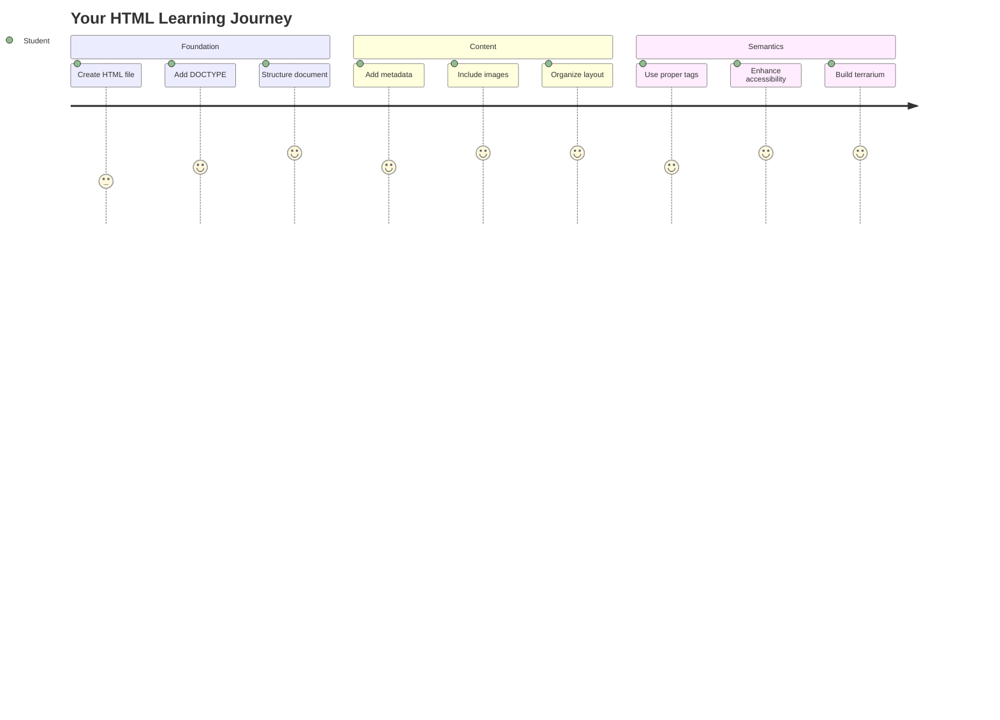
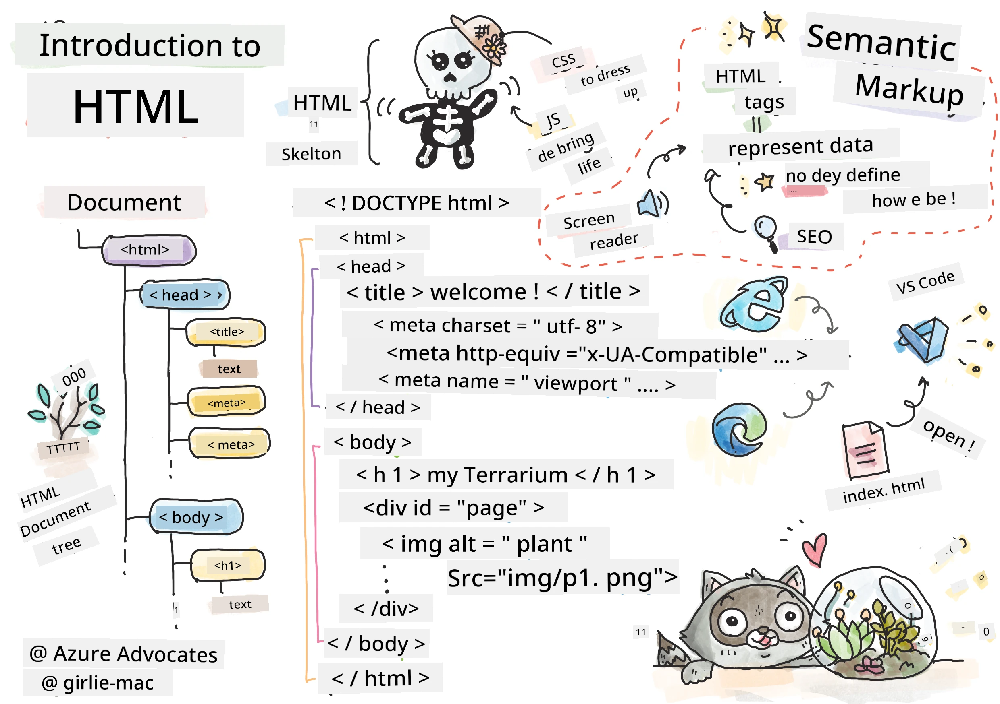
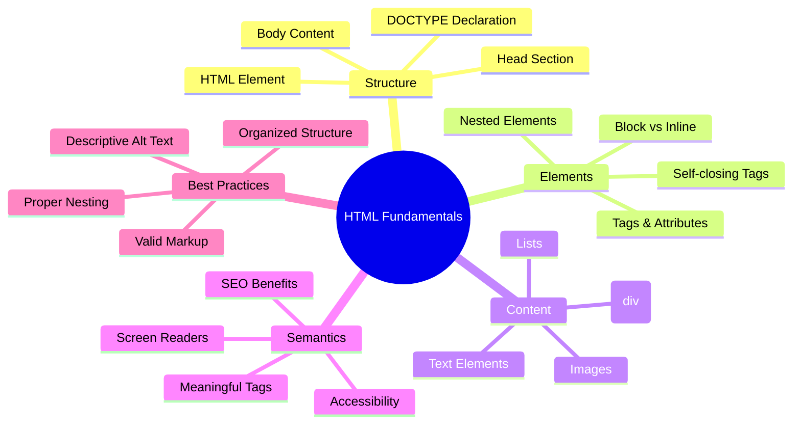
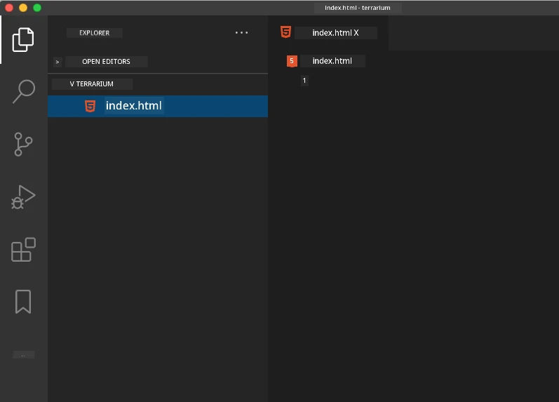
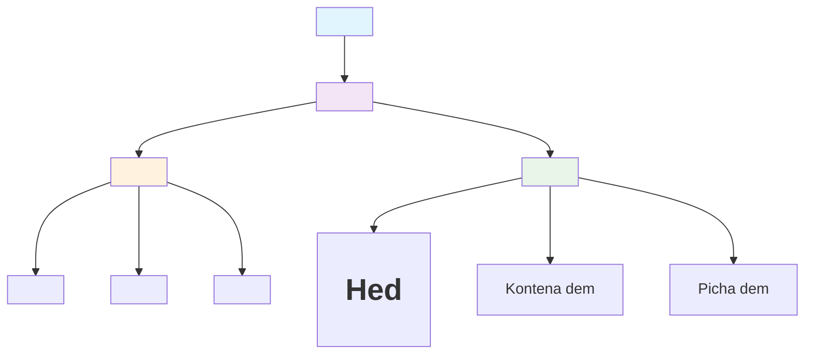
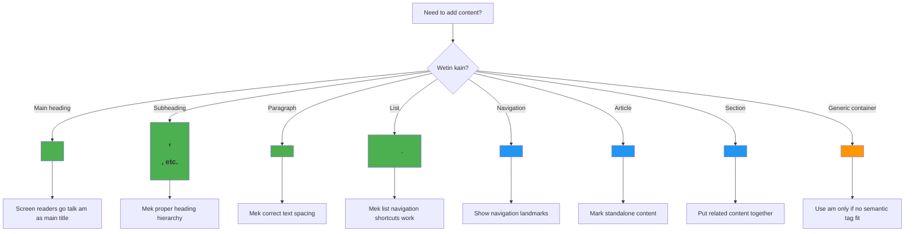
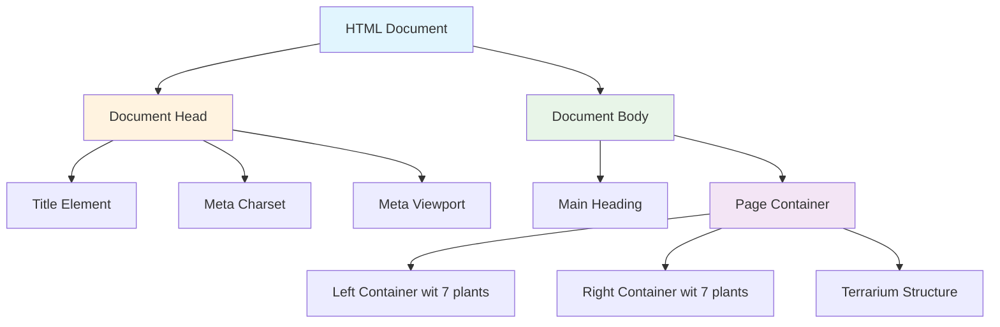
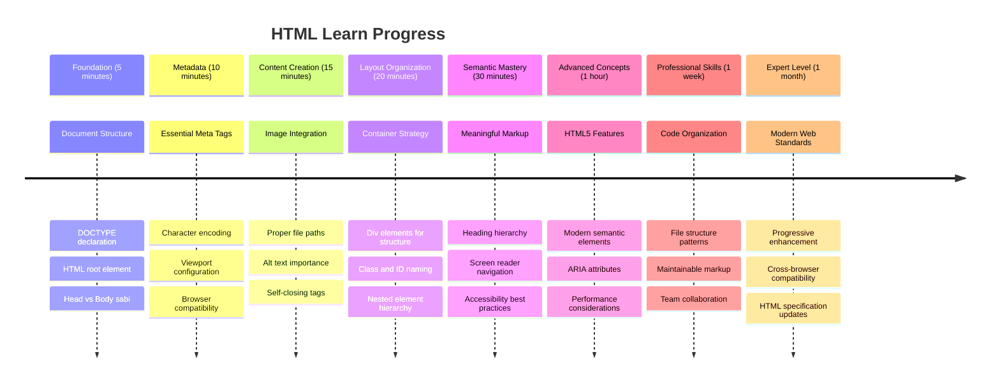

<!--
CO_OP_TRANSLATOR_METADATA:
{
  "original_hash": "3fcfa99c4897e051b558b5eaf1e8cc74",
  "translation_date": "2026-01-08T18:29:33+00:00",
  "source_file": "3-terrarium/1-intro-to-html/README.md",
  "language_code": "pcm"
}
-->
# Terrarium Project Part 1: Introduction to HTML



> Sketchnote by [Tomomi Imura](https://twitter.com/girlie_mac)

HTML, or HyperText Markup Language, na di foundation of every website wey you don ever visit. Think of HTML as di skeleton wey dey give structure to web pages – e dey define where content go, how e dey organized, and wetin each piece mean. While CSS go later "dress up" your HTML with colors and layouts, and JavaScript go bring am to life wit interactivity, HTML na di essential structure wey dey make everything else possible.

For dis lesson, you go create di HTML structure for virtual terrarium interface. Dis hands-on project go teach you fundamental HTML concepts while you dey build something wey go dey visually engaging. You go learn how to organize content using semantic elements, work wit images, and create di foundation for interactive web application.

By di end of dis lesson, you go get working HTML page wey dey show plant images for organized columns, ready for styling for di next lesson. No worry if e look basic at first – na exactly wetin HTML suppose do before CSS add di visual polish.


## Pre-Lecture Quiz

[Pre-lecture quiz](https://ff-quizzes.netlify.app/web/quiz/15)

> 📺 **Watch and Learn**: Check out dis helpful video overview
> 
> [](https://www.youtube.com/watch?v=1TvxJKBzhyQ)

## Setting Up Your Project

Before we dive into HTML code, mek we set up proper workspace for your terrarium project. Creating organized file structure from di beginning na important habit wey go serve you well throughout your web development journey.

### Task: Create Your Project Structure

You go create dedicated folder for your terrarium project and add your first HTML file. Here be two approaches wey you fit use:

**Option 1: Using Visual Studio Code**
1. Open Visual Studio Code
2. Click "File" → "Open Folder" or use `Ctrl+K, Ctrl+O` (Windows/Linux) or `Cmd+K, Cmd+O` (Mac)
3. Create new folder wey dem name `terrarium` and select am
4. For Explorer pane, click "New File" icon
5. Name your file `index.html`



**Option 2: Using Terminal Commands**
```bash
mkdir terrarium
cd terrarium
touch index.html
code index.html
```

**Here na wetin these commands dey do:**
- **Creates** new directory wey dem name `terrarium` for your project
- **Navigates** inside di terrarium directory 
- **Creates** empty `index.html` file
- **Opens** di file for Visual Studio Code make you fit edit

> 💡 **Pro Tip**: Di filename `index.html` special for web development. When person visit website, browsers dey automatically look for `index.html` as di default page wey dem go show. Dis mean URL like `https://mysite.com/projects/` go automatically serve di `index.html` file from `projects` folder without you needing to specify di filename for di URL.

## Understanding HTML Document Structure

Every HTML document follow specific structure wey browsers need to understand and display well. Think of dis structure like formal letter – e get required elements for particular order wey dey help di recipient (na di browser) process di content well.


Make we start by adding di essential foundation wey every HTML document need.

### The DOCTYPE Declaration and Root Element

Di first two lines of any HTML file na di document's "introduction" to di browser:

```html
<!DOCTYPE html>
<html></html>
```

**Understanding wetin dis code dey do:**
- **Declares** di document type as HTML5 using `<!DOCTYPE html>`
- **Creates** di root `<html>` element wey go contain all page content
- **Establishes** modern web standards for proper browser rendering
- **Ensures** consistent display across different browsers and devices

> 💡 **VS Code Tip**: Hover over any HTML tag for VS Code to see helpful information from MDN Web Docs, including usage examples and browser compatibility details.

> 📚 **Learn More**: Di DOCTYPE declaration dey stop browsers from entering "quirks mode," wey dem dey use to support very old websites. Modern web development use simple `<!DOCTYPE html>` declaration to ensure [standards-compliant rendering](https://developer.mozilla.org/docs/Web/HTML/Quirks_Mode_and_Standards_Mode).

### 🔄 **Pedagogical Check-in**
**Pause and Reflect**: Before you continue, make sure say you understand:
- ✅ Why every HTML document need DOCTYPE declaration
- ✅ Wetin di `<html>` root element contain
- ✅ How dis structure dey help browsers render pages well

**Quick Self-Test**: Fit explain with your own words wetin "standards-compliant rendering" mean?

## Adding Essential Document Metadata

Di `<head>` section of HTML document get important information wey browsers and search engines need, but visitors no dey see am directly on di page. Think am as "behind-the-scenes" info wey help your webpage work well and show correctly across different devices and platforms.

Dis metadata dey tell browsers how to display your page, wetin character encoding to use, and how to handle different screen sizes – all na important for creating professional, accessible web pages.

### Task: Add the Document Head

Put dis `<head>` section between your opening and closing `<html>` tags:

```html
<head>
	<title>Welcome to my Virtual Terrarium</title>
	<meta charset="utf-8" />
	<meta http-equiv="X-UA-Compatible" content="IE=edge" />
	<meta name="viewport" content="width=device-width, initial-scale=1" />
</head>
```

**Breaking down wetin each element dey do:**
- **Sets** di page title wey go show for browser tabs and search results
- **Specifies** UTF-8 character encoding for proper text display around di world
- **Ensures** compatibility with modern versions of Internet Explorer
- **Configures** responsive design by setting di viewport to match device width
- **Controls** initial zoom level make content show normally

> 🤔 **Think About This**: Wetin go happen if you set viewport meta tag like dis: `<meta name="viewport" content="width=600">`? Dis one go force di page to always be 600 pixels wide, and e go spoil responsive design! Learn more about [proper viewport configuration](https://developer.mozilla.org/docs/Web/HTML/Viewport_meta_tag).

## Building the Document Body

Di `<body>` element get all di visible content of your webpage – everything wey users go see and interact with. While di `<head>` section dey give instructions to di browser, di `<body>` section get di actual content: text, images, buttons, and other elements wey go create your user interface.

Make we add body structure and understand how HTML tags dey work together to create meaningful content.

### Understanding HTML Tag Structure

HTML dey use paired tags to define elements. Most tags get opening tag like `<p>` and closing tag like `</p>`, with content inside: `<p>Hello, world!</p>`. Dis one create paragraph element wey contain di text "Hello, world!".

### Task: Add the Body Element

Update your HTML file to include di `<body>` element:

```html
<!DOCTYPE html>
<html>
	<head>
		<title>Welcome to my Virtual Terrarium</title>
		<meta charset="utf-8" />
		<meta http-equiv="X-UA-Compatible" content="IE=edge" />
		<meta name="viewport" content="width=device-width, initial-scale=1" />
	</head>
	<body></body>
</html>
```

**Here na wetin dis complete structure dey provide:**
- **Establishes** di basic HTML5 document framework
- **Includes** important metadata for proper browser rendering
- **Creates** empty body ready for your visible content
- **Follows** modern web development best practices

Now you ready to add di visible elements of your terrarium. We go use `<div>` elements as containers to organize different sections of content, and `` elements to show di plant images.

### Working with Images and Layout Containers

Images special for HTML because dem dey use "self-closing" tags. Unlike elements like `<p></p>` wey dey wrap content, di `` tag contain all info e need inside di tag itself using attributes like `src` for di image file path and `alt` for accessibility.

Before you add images to your HTML, you gats organize your project files well by creating images folder and adding di plant graphics.

**First, set up your images:**
1. Create folder wey dem call `images` inside your terrarium project folder
2. Download di plant images from [solution folder](../../../../3-terrarium/solution/images) (14 plant images total)
3. Copy all di plant images enter your new `images` folder

### Task: Create the Plant Display Layout

Now add di plant images organized in two columns between your `<body></body>` tags:

```html
<div id="page">
	<div id="left-container" class="container">
		<div class="plant-holder">
			
		</div>
		<div class="plant-holder">
			
		</div>
		<div class="plant-holder">
			
		</div>
		<div class="plant-holder">
			
		</div>
		<div class="plant-holder">
			
		</div>
		<div class="plant-holder">
			
		</div>
		<div class="plant-holder">
			
		</div>
	</div>
	<div id="right-container" class="container">
		<div class="plant-holder">
			
		</div>
		<div class="plant-holder">
			
		</div>
		<div class="plant-holder">
			
		</div>
		<div class="plant-holder">
			
		</div>
		<div class="plant-holder">
			
		</div>
		<div class="plant-holder">
			
		</div>
		<div class="plant-holder">
			
		</div>
	</div>
</div>
```

**Step by step, na wetin dey happen for dis code:**
- **Creates** main page container with `id="page"` to hold all content
- **Establishes** two column containers: `left-container` and `right-container`
- **Organizes** 7 plants for left column and 7 plants for right column
- **Wraps** each plant image inside `plant-holder` div for individual positioning
- **Applies** consistent class names for CSS styling later
- **Assigns** unique IDs to each plant image for JavaScript interaction later
- **Includes** correct file paths wey point to di images folder

> 🤔 **Consider This**: Notice say all images get di same alt text "plant". Dis no good for accessibility. Screen reader users go hear "plant" 14 times without knowing which particular plant each image show. Fit think better, more descriptive alt text for each image?

> 📝 **HTML Element Types**: `<div>` elements be "block-level" and dem take full width, while `<span>` elements be "inline" and dem only take as much width as dem need. Wetin you think go happen if you change all these `<div>` tags to `<span>` tags?

### 🔄 **Pedagogical Check-in**
**Structure Understanding**: Take small time to review your HTML structure:
- ✅ Fit identify main containers for your layout?
- ✅ You understand why each image get unique ID?
- ✅ How you go describe di purpose of `plant-holder` divs?

**Visual Inspection**: Open your HTML file for browser. You suppose see:
- Basic list of plant images
- Images arranged for two columns
- Simple, unstyled layout

**Remember**: Dis plain look na wetin HTML suppose be before CSS styling!

With dis markup added, di plants go show for screen, though dem no go look polished yet – na di work for CSS for di next lesson! For now, you get solid HTML foundation wey organize your content well and follow accessibility best practices.

## Using Semantic HTML for Accessibility

Semantic HTML mean say you dey pick HTML elements based on their meaning and purpose, no be only their appearance. When you use semantic markup, you dey talk di structure and meaning of your content to browsers, search engines, and assistive technologies like screen readers.


Dis method dey make your websites more accessible to users with disabilities and dey help search engines better understand your content. E be fundamental principle of modern web development wey dey create better experiences for everybody.

### Adding a Semantic Page Title

Make we add proper heading to your terrarium page. Insert dis line right after your opening `<body>` tag:

```html
<h1>My Terrarium</h1>
```

**Why semantic markup dey important:**
- **Helps** screen readers navigate and understand page structure
- **Improves** search engine optimization (SEO) by clarifying content hierarchy
- **Enhances** accessibility for users with visual impairments or cognitive differences
- **Creates** better user experiences across all devices and platforms
- **Follows** web standards and best practices for professional development

**Examples of semantic vs. non-semantic choices:**

| Purpose | ✅ Semantic Choice | ❌ Non-Semantic Choice |
|---------|-------------------|------------------------|
| Main heading | `<h1>Title</h1>` | `<div class="big-text">Title</div>` |
| Navigation | `<nav><ul><li></li></ul></nav>` | `<div class="menu"><div></div></div>` |
| Button | `<button>Click me</button>` | `<span onclick="...">Click me</span>` |
| Article content | `<article><p></p></article>` | `<div class="content"><div></div></div>` |

> 🎥 **See It in Action**: Watch [how screen readers interact with web pages](https://www.youtube.com/watch?v=OUDV1gqs9GA) to understand why semantic markup dey important for accessibility. Notice how correct HTML structure dey help users navigate well.

## Creating the Terrarium Container

Now make we add di HTML structure for di terrarium itself – di glass container wey plants go eventually dey inside. Dis section dey show important concept: HTML dey provide structure, but without CSS styling, these elements no go visible yet.

Di terrarium markup dey use descriptive class names wey go make CSS styling simple and maintainable for next lesson.

### Task: Add the Terrarium Structure

Insert dis markup above di last `</div>` tag (before di closing tag of di page container):

```html
<div id="terrarium">
	<div class="jar-top"></div>
	<div class="jar-walls">
		<div class="jar-glossy-long"></div>
		<div class="jar-glossy-short"></div>
	</div>
	<div class="dirt"></div>
	<div class="jar-bottom"></div>
</div>
```

**Understanding dis terrarium structure:**
- **Creates** main terrarium container with unique ID for styling
- **Defines** separate elements for each visual component (top, walls, dirt, bottom)
- **Includes** nested elements for glass reflection effects (glossy elements)
- **Uses** descriptive class names wey clearly show wetin each element dey do
- **Prepares** the structure for CSS styling wey go create the glass terrarium look

> 🤔 **Notice Something?**: Even though you add this markup, you no go see anything new for the page! This one clear how HTML dey provide structure and CSS na im dey provide appearance. These `<div>` elements dey but dem never get visual styling yet – dat one go come for the next lesson!


### 🔄 **Pedagogical Check-in**
**HTML Structure Mastery**: Before you move forward, make sure say you fit:
- ✅ Explain the difference between HTML structure and how e dey show for eye
- ✅ Identify semantic and non-semantic HTML elements
- ✅ Talk how correct markup go help make am easier for people to use your site well
- ✅ Recognize the full document tree structure

**Testing Your Understanding**: Try open your HTML file for browser wey JavaScript no dey and CSS comot finish. This one go show you the pure semantic structure wey you create!

---

## GitHub Copilot Agent Challenge

Use the Agent mode to complete the following challenge:

**Description:** Create a semantic HTML structure for plant care guide section wey fit add to the terrarium project.

**Prompt:** Create semantic HTML section wey get main heading "Plant Care Guide", three subsections wey get headings "Watering", "Light Requirements", and "Soil Care", each get paragraph wey talk plant care information. Use correct semantic HTML tags like `<section>`, `<h2>`, `<h3>`, and `<p>` to arrange the content well.

Learn more about [agent mode](https://code.visualstudio.com/blogs/2025/02/24/introducing-copilot-agent-mode) here.

## Explore HTML History Challenge

**Learning About Web Evolution**

HTML don evolve well well since Tim Berners-Lee make the first web browser for CERN for 1990. Some old tags like `<marquee>` don become outdated because dem no too work well with modern accessibility standards and responsive design.

**Try This Experiment:**
1. Temporarily put your `<h1>` title inside `<marquee>` tag: `<marquee><h1>My Terrarium</h1></marquee>`
2. Open your page for browser and watch the scrolling effect
3. Think why them ban that tag (hint: think about user experience and accessibility)
4. Remove the `<marquee>` tag and comot back to semantic markup

**Reflection Questions:**
- How e fit affect people wey get visual problem or motion sensitivity if title dey move like that?
- Which modern CSS ways fit do similar visual effects wey be better for everybody?
- Why e important to use current web standards instead of old elements wey no dey supported?

Explore more about [obsolete and deprecated HTML elements](https://developer.mozilla.org/docs/Web/HTML/Element#Obsolete_and_deprecated_elements) to sabi how web standards dey evolve to help user experience.

## Post-Lecture Quiz

[Post-lecture quiz](https://ff-quizzes.netlify.app/web/quiz/16)

## Review & Self Study

**Deepen Your HTML Knowledge**

HTML don be the base of web for over 30 years, e begin as simple document markup language, now e don become strong platform to build interactive applications. To sabi dis evolution go help you appreciate modern web standards and take better development decisions.

**Recommended Learning Paths:**

1. **HTML History and Evolution**
   - Research from HTML 1.0 reach HTML5
   - Find out why some tags they ban (because of accessibility, mobile-friendliness, maintainability)
   - Explore new HTML features and proposals

2. **Semantic HTML Deep Dive**
   - Learn the full list of [HTML5 semantic elements](https://developer.mozilla.org/docs/Web/HTML/Element)
   - Practice when to use `<article>`, `<section>`, `<aside>`, and `<main>`
   - Learn about ARIA attributes for better accessibility

3. **Modern Web Development**
   - Explore [building responsive websites](https://docs.microsoft.com/learn/modules/build-simple-website/?WT.mc_id=academic-77807-sagibbon) on Microsoft Learn
   - Understand how HTML dey connect with CSS and JavaScript
   - Learn about web performance and SEO best practices

**Reflection Questions:**
- Which deprecated HTML tags you find, and why dem ban am?
- Which new HTML features dem dey plan for future versions?
- How semantic HTML dey help web accessibility and SEO?

### ⚡ **Wetin You Fit Do for Next 5 Minutes**
- [ ] Open DevTools (F12) check the HTML structure of your favourite website
- [ ] Create simple HTML file with basic tags: `<h1>`, `<p>`, and ``
- [ ] Validate your HTML with W3C HTML Validator online
- [ ] Try add comment for your HTML with `<!-- comment -->`

### 🎯 **Wetin You Fit Achieve This Hour**
- [ ] Finish the post-lesson quiz and review semantic HTML concepts
- [ ] Build simple webpage about yourself with correct HTML structure
- [ ] Try different heading levels and text formatting tags
- [ ] Add images and links to practise multimedia work
- [ ] Research HTML5 features wey you never try yet

### 📅 **Your Week-Long HTML Journey**
- [ ] Finish the terrarium project with semantic markup
- [ ] Create accessible webpage using ARIA labels and roles
- [ ] Practice form building with different input types
- [ ] Explore HTML5 APIs like localStorage or geolocation
- [ ] Study responsive HTML patterns and mobile-first design
- [ ] Check other developers' HTML code for best practices

### 🌟 **Your Month-Long Web Foundation**
- [ ] Build portfolio website to show your HTML skill
- [ ] Learn HTML templating with framework like Handlebars
- [ ] Help open source projects by improving HTML docs
- [ ] Master advanced HTML concepts like custom elements
- [ ] Mix HTML with CSS frameworks and JavaScript libraries
- [ ] Mentor others wey dey learn HTML fundamentals

## 🎯 Your HTML Mastery Timeline


### 🛠️ Your HTML Toolkit Summary

After you finish this lesson, you don get:
- **Document Structure**: Complete HTML5 foundation with correct DOCTYPE
- **Semantic Markup**: Meaningful tags wey improve accessibility and SEO
- **Image Integration**: Proper file organization and alt text practice
- **Layout Containers**: Smart use of divs with descriptive class names
- **Accessibility Awareness**: Understanding how screen readers navigate
- **Modern Standards**: Current HTML5 way and knowledge of deprecated tags
- **Project Foundation**: Strong base for CSS styling and JavaScript interactivity

**Next Steps**: Your HTML structure don ready for CSS styling! The semantic base you build go make the next lesson easy to understand.

## Assignment

[Practice your HTML: Build a blog mockup](assignment.md)

---

<!-- CO-OP TRANSLATOR DISCLAIMER START -->
**Disclaimer**:
Dis document don translate wit AI translation service [Co-op Translator](https://github.com/Azure/co-op-translator). Even though we try make e correct, make you sabi say automated translations fit get mistake or no too correct. Di original document wey e bin write for im own language na di correct one. For important information, e good make professional human translation do am. We no go responsible for any wrong understanding or mistake wey fit happen because of this translation.
<!-- CO-OP TRANSLATOR DISCLAIMER END -->