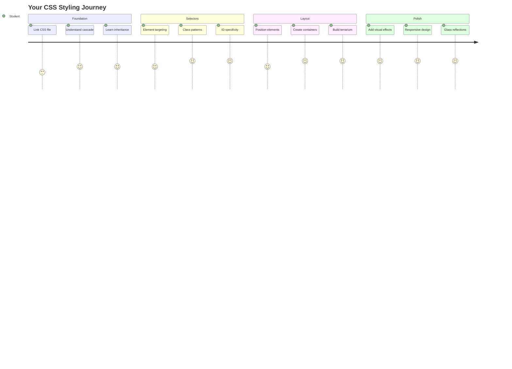
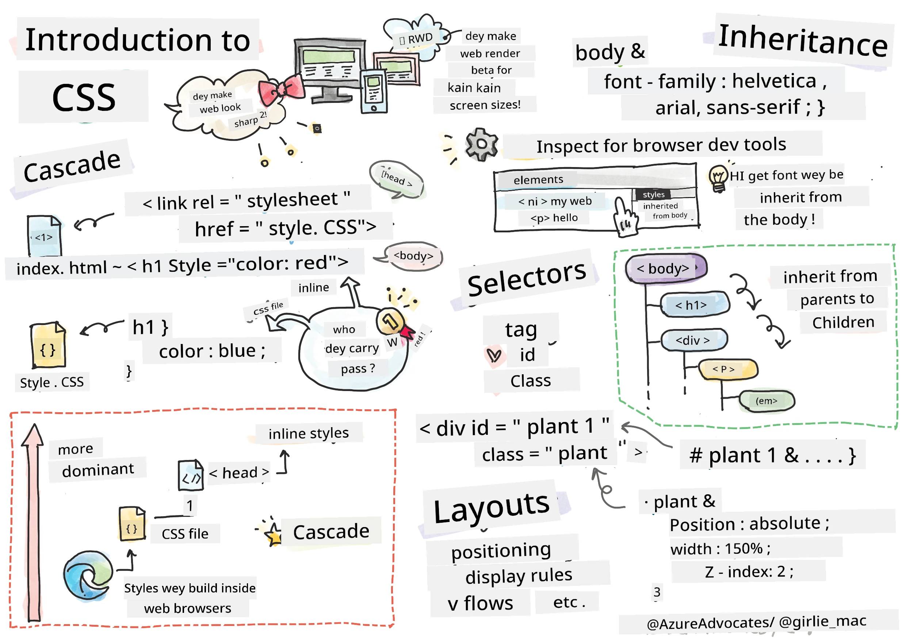
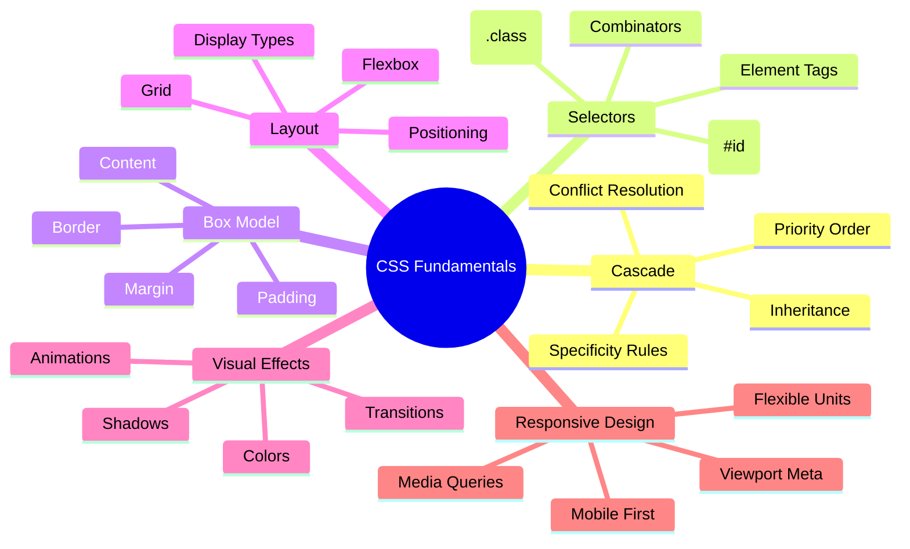
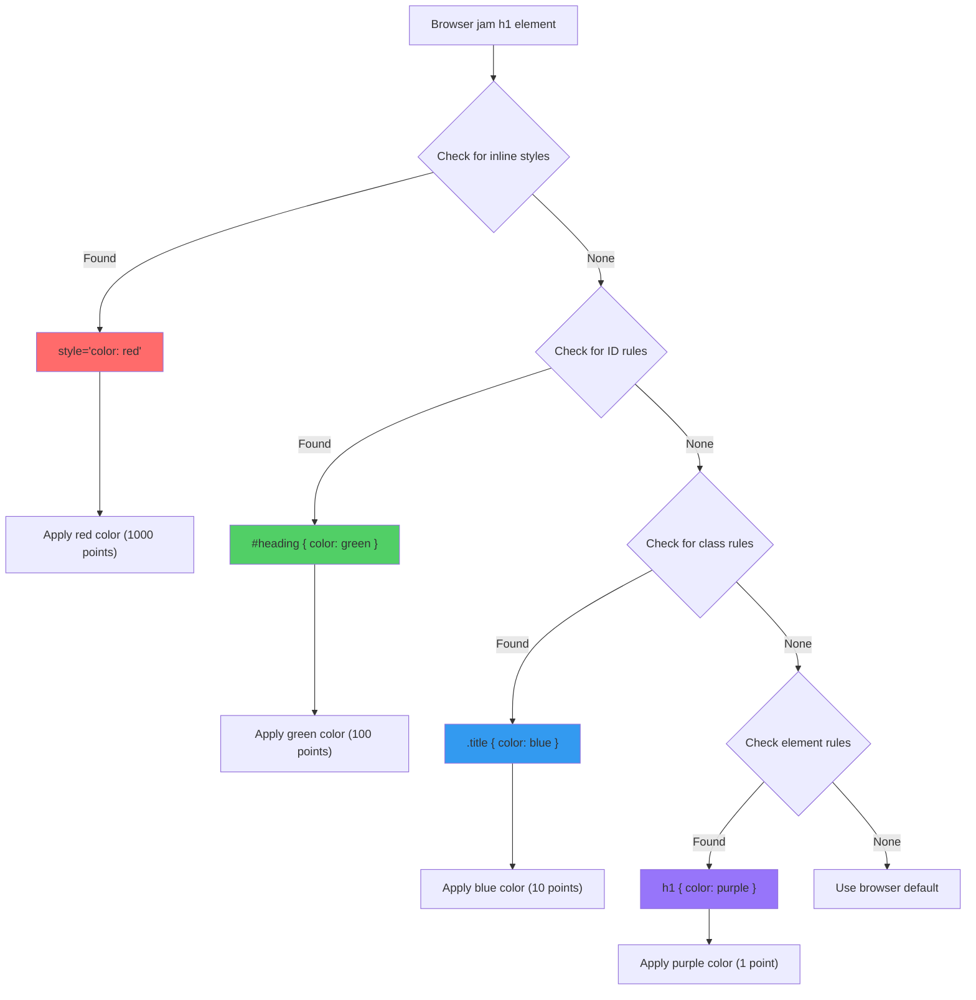
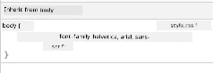
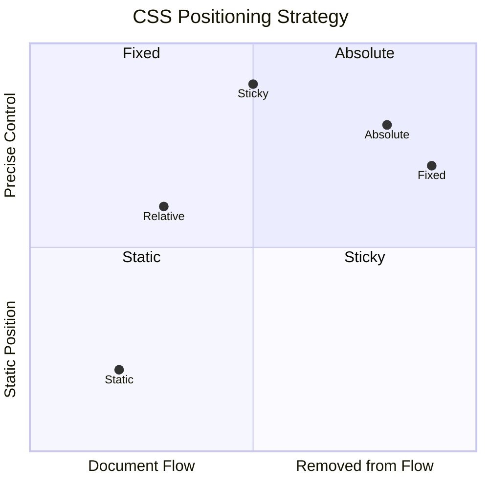
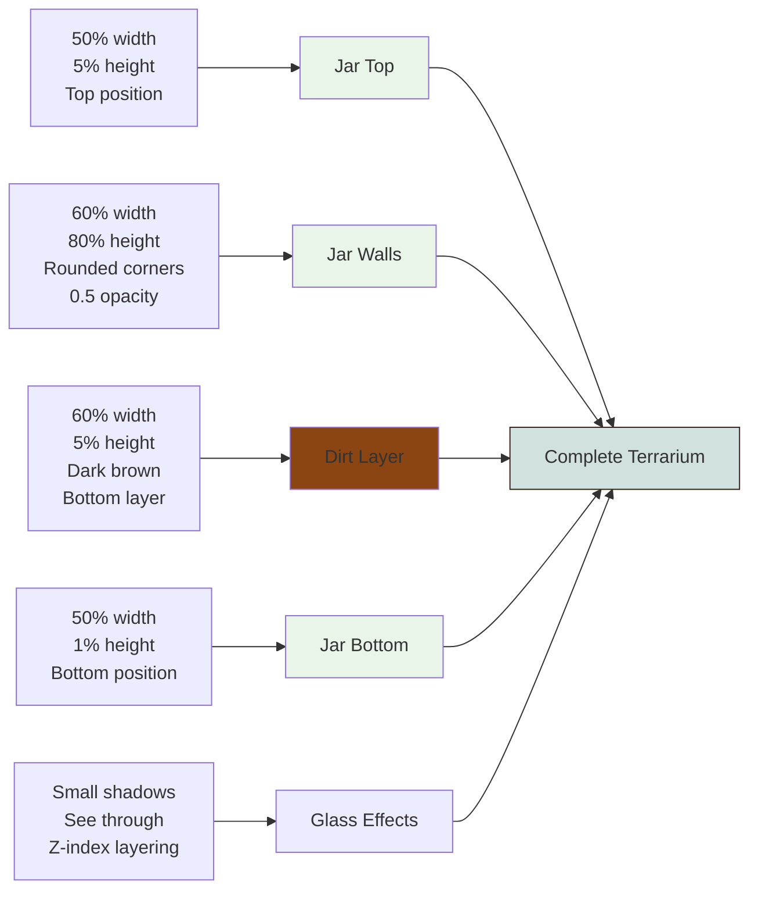
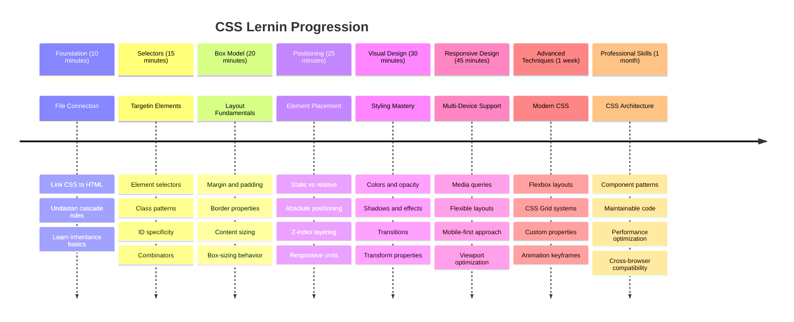

# Terrarium Project Part 2: Introduction to CSS



> Sketchnote by [Tomomi Imura](https://twitter.com/girlie_mac)

Memba how your HTML terrarium bin fine simple? CSS na di place wey we go take change dat plain structure come one wey fine for eye.

If HTML be like di building frame for house, then CSS na wetin make e feel like home - di paint color dem, how furniture arrange, di light dem, and how di rooms dey flow together. Think about how Palace of Versailles start as small hunting lodge, but correct attention to decoration and layout turn am to one of di world’s most fine buildings.

Today, we go change your terrarium from just working to fine finish. You go learn how to position elements correct correct, make layouts dey respond to different screen sizes, and make di visual fine wey dey make websites dey interesting.

By di end of dis lesson, you go see how correct CSS styling fit improve your project well well. Make we add style to your terrarium.


## Pre-Lecture Quiz

[Pre-lecture quiz](https://ff-quizzes.netlify.app/web/quiz/17)

## Getting Started with CSS

People often talk say CSS na just to make things fine, but e get plenty purpose pass dat. CSS na like director for movie - you dey control not just how everything look, but how e dey move, how e take respond to interaction, and how e take change for different situations.

Modern CSS get power well well. You fit write code wey go automatically adjust layout for phone, tablet, and desktop. You fit create smooth animation wey go guide users eye where e suppose dey. Di result fit dey very impressive when everything work together well.

> 💡 **Pro Tip**: CSS dey always dey evolve with new features and power. Always check [CanIUse.com](https://caniuse.com) to confirm browser support for new CSS features before you use am for production projects.

**Wet we go do for dis lesson be:**
- **Create** complete visual design for your terrarium using modern CSS techniques
- **Explore** fundamental concepts like cascade, inheritance, and CSS selectors
- **Implement** responsive positioning and layout strategies
- **Build** di terrarium container using CSS shapes and styling

### Prerequisite

You suppose don finish di HTML structure for your terrarium from di last lesson and dem dey ready for styling.

> 📺 **Video Resource**: Check dis helpful video walkthrough
>
> [](https://www.youtube.com/watch?v=6yIdOIV9p1I)

### Setting Up Your CSS File

Before we fit start styling, we gats connect CSS to our HTML. Dis connection go tell di browser where to find di styling instruction for our terrarium.

For your terrarium folder, create new file wey dem go call `style.css`, then link am for your HTML document `<head>` section:

```html
<link rel="stylesheet" href="./style.css" />
```

**Wet dis code dey do be:**
- **Create** connection between your HTML and CSS files
- **Tell** di browser to load and apply di styles from `style.css`
- **Use** di `rel="stylesheet"` attribute to talk say dis na CSS file
- **Reference** di file path with `href="./style.css"`

## Understanding the CSS Cascade

You don ever wonder why dem call CSS "Cascading" Style Sheets? Styles dey cascade down like waterfall, and sometimes dem dey clash.

Think about how military command structures dey work - one general order fit talk say "all troops make dem wear green," but specific order for your unit fit talk say "wear dress blues for di ceremony." Di specific order go win. CSS dey follow dis kind logic, and if you understand dis hierarchy, e go make debugging easy.

### Experimenting with Cascade Priority

Make we see di cascade work by creating style wahala. First, add inline style to your `<h1>` tag:

```html
<h1 style="color: red">My Terrarium</h1>
```

**Wet dis code dey do:**
- **Apply** red color direct to `<h1>` element using inline styling
- **Use** di `style` attribute to put CSS direct for HTML
- **Create** highest priority style rule for dis specific element

Next, put dis rule for your `style.css` file:

```css
h1 {
  color: blue;
}
```

**For di code top, we:**
- **Define** CSS rule wey target all `<h1>` elements
- **Set** di text color to blue using external stylesheet
- **Create** lower priority rule compared to inline styles

✅ **Knowledge Check**: Which color your web app go show? Why dat color win? You fit think of situations wey you go like override styles?


> 💡 **CSS Priority Order (from highest go lowest):**
> 1. **Inline styles** (style attribute)
> 2. **IDs** (#myId)
> 3. **Classes** (.myClass) and attributes
> 4. **Element selectors** (h1, div, p)
> 5. **Browser defaults**

## CSS Inheritance in Action

CSS inheritance be like genetics - elements dey inherit some properties from their parent elements. If you set font family for body element, all text inside go use dat same font. E resemble how Habsburg family jawline appear for generations without e get to talk about am for each person.

But no be everything dey inherit. Text styles like fonts and colors dey inherit, but layout properties like margins and borders no dey. Just like pikin fit inherit physical traits but no inherit their parents fashion choice.

### Observing Font Inheritance

Make we see inheritance work by setting font family on `<body>` element:

```css
body {
  font-family: 'Segoe UI', Tahoma, Geneva, Verdana, sans-serif;
}
```

**Wet happen here:**
- **Set** font family for whole page by targeting `<body>` element
- **Use** font stack with fallback options for better browser compatibility
- **Apply** modern system fonts wey fine for different operating systems
- **Ensure** all child elements inherit dis font unless dem override am

Open browser developer tools (F12), go Elements tab, inspect your `<h1>` element. You go see say e inherit font family from body:



✅ **Experiment Time**: Try set other inheritable properties for `<body>` like `color`, `line-height`, or `text-align`. Wetin happen to your heading and other elements?

> 📝 **Inheritable Properties Include**: `color`, `font-family`, `font-size`, `line-height`, `text-align`, `visibility`
>
> **Non-Inheritable Properties Include**: `margin`, `padding`, `border`, `width`, `height`, `position`

### 🔄 **Pedagogical Check-in**
**CSS Foundation Understanding**: Before you waka go selectors, make sure you fit:
- ✅ Explain di difference between cascade and inheritance
- ✅ Predict which style go win for specificity conflict
- ✅ Identify which properties dey inherit from parent elements
- ✅ Connect CSS files to HTML correct

**Quick Test**: If you get these styles, which color `<h1>` inside `<div class="special">` go be?
```css
div { color: blue; }
.special { color: green; }
h1 { color: red; }
```
*Answer: Red (element selector direct target h1)*

## Mastering CSS Selectors

CSS selectors na your way to target specific elements for styling. Dem work like giving exact direction - instead of saying "di house," you fit talk "di blue house wey get red door for Maple Street."

CSS get different ways to be specific, and to choose di correct selector na like to choose correct tool for di job. Sometimes you want style every door for neighborhood, sometime na just the one door.

### Element Selectors (Tags)

Element selectors dey target HTML elements by their tag name. Dem good for base styles wey go apply for the entire page:

```css
body {
  font-family: 'Segoe UI', Tahoma, Geneva, Verdana, sans-serif;
  margin: 0;
  padding: 0;
}

h1 {
  color: #3a241d;
  text-align: center;
  font-size: 2.5rem;
  margin-bottom: 1rem;
}
```

**Understanding dis styles:**
- **Set** consistent typography across whole page with `body` selector
- **Remove** default browser margins and padding for better control
- **Style** all heading elements with color, alignment, and spacing
- **Use** `rem` units for font wey fit scale and dey accessible

Even though element selectors good for general styling, you go still need specific selectors to style individual parts like di plants for your terrarium.

### ID Selectors for Unique Elements

ID selectors use `#` symbol and dem target elements with specific `id` attributes. Because IDs suppose to be unique for a page, dem good for styling individual special elements like our left and right plant containers.

Make we create styling for our terrarium side containers wey plants go dey:

```css
#left-container {
  background-color: #f5f5f5;
  width: 15%;
  left: 0;
  top: 0;
  position: absolute;
  height: 100vh;
  padding: 1rem;
  box-sizing: border-box;
}

#right-container {
  background-color: #f5f5f5;
  width: 15%;
  right: 0;
  top: 0;
  position: absolute;
  height: 100vh;
  padding: 1rem;
  box-sizing: border-box;
}
```

**Wet dis code do be:**
- **Position** containers for far left and right side using `absolute` positioning
- **Use** `vh` (viewport height) units for height wey go adjust according to screen size
- **Apply** `box-sizing: border-box` to include padding for overall width
- **Remove** unnecessary `px` units from zero values to make code fine
- **Set** subtle background color wey easy for eye pass plain gray

✅ **Code Quality Challenge**: You notice say dis CSS dey break DRY (Don't Repeat Yourself) rule. Fit refactor am with both ID and class?

**Better way to do am:**
```html
<div id="left-container" class="container"></div>
<div id="right-container" class="container"></div>
```

```css
.container {
  background-color: #f5f5f5;
  width: 15%;
  top: 0;
  position: absolute;
  height: 100vh;
  padding: 1rem;
  box-sizing: border-box;
}

#left-container {
  left: 0;
}

#right-container {
  right: 0;
}
```

### Class Selectors for Reusable Styles

Class selectors use `.` symbol and dem good for when you want apply same styles to many elements. Unlike IDs, classes fit dey used plenty times for your HTML, making dem perfect for consistent styling.

Inside our terrarium, each plant need similar styling but also need individual position. We go use mix of classes for shared styles and IDs for individual placement.

**Dis na di HTML structure for each plant:**
```html
<div class="plant-holder">
  
</div>
```

**Key elements explain:**
- **Use** `class="plant-holder"` for container styling wey dey same for all plants
- **Apply** `class="plant"` for shared image styling and behaviour
- **Include** unique `id="plant1"` for individual positioning and JavaScript interaction
- **Provide** descriptive alt text for screen reader access

Now put these styles for your `style.css` file:

```css
.plant-holder {
  position: relative;
  height: 13%;
  left: -0.6rem;
}

.plant {
  position: absolute;
  max-width: 150%;
  max-height: 150%;
  z-index: 2;
  transition: transform 0.3s ease;
}

.plant:hover {
  transform: scale(1.05);
}
```

**Wet dey happen for these styles:**
- **Create** relative positioning for plant holder to make positioning context
- **Set** each plant holder to 13% height, to fit all plants vertically without scrolling
- **Shift** holders small left to better center plants inside their container
- **Allow** plants to scale responsively using `max-width` and `max-height`
- **Use** `z-index` to put plants ahead of other things for terrarium
- **Add** small hover effect with CSS transitions for better user interaction

✅ **Critical Thinking**: Why we need both `.plant-holder` and `.plant` selectors? Which tin go happen if you use only one?

> 💡 **Design Pattern**: Container (`.plant-holder`) control layout and positioning, content (`.plant`) control appearance and scaling. Dis kind separation make code easier to maintain and more flexible.

## Understanding CSS Positioning

CSS positioning na like being stage director for play - you direct where each actor stand and how dem move. Some actors follow normal formation, others need special position for drama.

Once you understand positioning, many layout problems go dey easy. You want navigation bar wey no go comot from top when user dey scroll? Positioning na di solution. You want tooltip wey go show for one specific place? Na positioning too.

### The Five Position Values


| Position Value | Behavior | Use Case |
|----------------|----------|----------|
| `static` | Default flow, no mind top/left/right/bottom | Normal document layout |
| `relative` | Position relative to normal place | Small movements, create positioning context |
| `absolute` | Position relative to closest positioned ancestor | Exact placement, overlays |
| `fixed` | Position relative to viewport | Navigation bars, floating elements |
| `sticky` | Switch between relative and fixed depending on scroll | Headers wey stick as you scroll |

### Positioning in Our Terrarium

Our terrarium use correct combination of positioning types to get di layout we want:

```css
/* Container positioning */
.container {
  position: absolute; /* Removes from normal flow */
  /* ... other styles ... */
}

/* Plant holder positioning */
.plant-holder {
  position: relative; /* Creates positioning context */
  /* ... other styles ... */
}

/* Plant positioning */
.plant {
  position: absolute; /* Allows precise placement within holder */
  /* ... other styles ... */
}
```

**Understand di positioning strategy:**
- **Absolute containers** comot for normal document flow and dey pinned to screen edges
- **Relative plant holders** create positioning context while dem dey for document flow
- **Absolute plants** fit position well inside their relative containers
- **Dis combination** allow plants stack vertical and still fit uniquely positioned each one

> 🎯 **Why Dis Important**: Di `plant` elements need absolute positioning so dem fit dey draggable for next lesson. Absolute positioning comot dem from normal layout flow, make drag-and-drop interaction possible.

✅ **Experiment Time**: Try change positioning values and watch wetin happen:
- Wetin go happen if you change `.container` from `absolute` to `relative`?
- How di layout go change if `.plant-holder` use `absolute` instead of `relative`?
- Wetin go happen when you switch `.plant` to `relative` positioning?

### 🔄 **Pedagogical Check-in**
**CSS Positioning Mastery**: Pause to check say you sabi well:
- ✅ You fit explain why plants need absolute positioning for drag-and-drop?
- ✅ You understand how relative containers dey create positioning context?
- ✅ Why side containers dem dey use absolute positioning?
- ✅ Wetin go happen if you comot position declarations finish?

**Real-World Connection**: Think about how CSS positioning dey imitate real-world layout:
- **Static**: Books for shelf (natural order)
- **Relative**: Move book small but still keep im position
- **Absolute**: Put bookmark for exact page number
- **Fixed**: Sticky note wey dey remain visible as you dey flip pages

## Building the Terrarium with CSS

Now we go build glass jar using only CSS - no images or graphics software needed.

To create glass wey dey realistic, shadows, and depth effects using positioning and transparency na how CSS sabi make things visual. This method dey resemble how architects for Bauhaus movement take simple geometric shapes create complex, beautiful buildings. Once you understand these principles, you go fit see the CSS skill for many web designs.


### Creating the Glass Jar Components

Make we build the terrarium jar piece by piece. Each part use absolute positioning and percentage-based sizing for responsive design:

```css
.jar-walls {
  height: 80%;
  width: 60%;
  background: #d1e1df;
  border-radius: 1rem;
  position: absolute;
  bottom: 0.5%;
  left: 20%;
  opacity: 0.5;
  z-index: 1;
  box-shadow: inset 0 0 2rem rgba(0, 0, 0, 0.1);
}

.jar-top {
  width: 50%;
  height: 5%;
  background: #d1e1df;
  position: absolute;
  bottom: 80.5%;
  left: 25%;
  opacity: 0.7;
  z-index: 1;
  border-radius: 0.5rem 0.5rem 0 0;
}

.jar-bottom {
  width: 50%;
  height: 1%;
  background: #d1e1df;
  position: absolute;
  bottom: 0;
  left: 25%;
  opacity: 0.7;
  border-radius: 0 0 0.5rem 0.5rem;
}

.dirt {
  width: 60%;
  height: 5%;
  background: #3a241d;
  position: absolute;
  border-radius: 0 0 1rem 1rem;
  bottom: 1%;
  left: 20%;
  opacity: 0.7;
  z-index: -1;
}
```

**Understanding the terrarium construction:**
- **Uses** percentage-based dimensions for scaling well on all screen sizes
- **Positions** elements absolute to stack and align am well
- **Applies** different opacity levels to make glass transparency effect
- **Implements** `z-index` layering so plants fit show inside the jar
- **Adds** subtle box-shadow and neat border-radius for more realistic look

### Responsive Design with Percentages

See how all dimensions dey use percentage instead of fixed pixel values:

**Why dis matter:**
- **Ensure** say terrarium scales well for any screen size
- **Maintain** visual relationship between jar parts
- **Provide** consistent experience from mobile phones to big desktop monitors
- **Allow** design to adapt without spoiling visual layout

### CSS Units in Action

We dey use `rem` units for border-radius, wey scale relative to root font size. This one dey create easier-to-access designs wey respect user font preferences. Learn more about [CSS relative units](https://www.w3.org/TR/css-values-3/#font-relative-lengths) for official specs.

✅ **Visual Experimentation**: Try change these values and watch di effects:
- Change jar opacity from 0.5 to 0.8 – how e go affect glass look?
- Change dirt color from `#3a241d` to `#8B4513` – which kind visual impact e get?
- Modify `z-index` of dirt to 2 – wetin go happen to layering?

### 🔄 **Pedagogical Check-in**
**CSS Visual Design Understanding**: Confirm say you sabi visual CSS well:
- ✅ How percentage-based dimensions dey create responsive design?
- ✅ Why opacity dey create glass transparency effect?
- ✅ Wetin be role of z-index for layering elements?
- ✅ How border-radius values dey create jar shape?

**Design Principle**: Notice how we dey build complex visuals from simple shapes:
1. **Rectangles** → **Rounded rectangles** → **Jar components**
2. **Flat colors** → **Opacity** → **Glass effect**
3. **Individual elements** → **Layered composition** → **3D appearance**

---

## GitHub Copilot Agent Challenge 🚀

Use Agent mode to complete this challenge:

**Description:** Create CSS animation wey go make terrarium plants gently sway back and forth, like breeze dey blow. This go help you practice CSS animations, transforms, and keyframes to make your terrarium fine.

**Prompt:** Add CSS keyframe animations to make the plants for terrarium sway gently side to side. Create sway animation wey go rotate each plant small (2-3 degrees) left and right with duration of 3-4 seconds, and apply am to `.plant` class. Make sure say animation dey loop forever and get easing function for natural movement.

Learn more about [agent mode](https://code.visualstudio.com/blogs/2025/02/24/introducing-copilot-agent-mode) here.

## 🚀 Challenge: Adding Glass Reflections

Ready to make your terrarium better with real glass reflections? This technique go add depth and realism to design.

You go create subtle white or light-colored oval shapes for glass reflections. Position dem well for left side of jar, apply correct opacity and blur effects for realistic light reflection, use `border-radius` to make organic, bubble-like shapes, and experiment with gradients or box-shadows for strong realism.

## Post-Lecture Quiz

[Post-lecture quiz](https://ff-quizzes.netlify.app/web/quiz/18)

## Expand Your CSS Knowledge

CSS fit look hard at first, but understanding these main concepts go give you strong foundation for advanced techniques.

**Your next CSS learning areas:**
- **Flexbox** - simplify alignment and distribution of elements
- **CSS Grid** - give powerful tools for complex layouts
- **CSS Variables** - reduce repetition and make maintenance easy
- **Responsive design** - make sure sites work well on different screen sizes

### Interactive Learning Resources

Practice these concepts with these fun, hands-on games:
- 🐸 [Flexbox Froggy](https://flexboxfroggy.com/) - Master Flexbox through fun challenges
- 🌱 [Grid Garden](https://codepip.com/games/grid-garden/) - Learn CSS Grid by growing virtual carrots
- 🎯 [CSS Battle](https://cssbattle.dev/) - Test your CSS skills with coding challenges

### Additional Learning

For full CSS basics, finish this Microsoft Learn module: [Style your HTML app with CSS](https://docs.microsoft.com/learn/modules/build-simple-website/4-css-basics/?WT.mc_id=academic-77807-sagibbon)

### ⚡ **Wetin You Fit Do For Next 5 Minutes**
- [ ] Open DevTools and inspect CSS styles on any website using Elements panel
- [ ] Create simple CSS file and link am to HTML page
- [ ] Try change colors using diff methods: hex, RGB, and named colors
- [ ] Practice box model by adding padding and margin to div

### 🎯 **Wetin You Fit Achieve Dis Hour**
- [ ] Complete post-lesson quiz and review CSS basics
- [ ] Style your HTML page with fonts, colors, and spacing
- [ ] Create simple layout using flexbox or grid
- [ ] Experiment with CSS transitions for smooth effects
- [ ] Practice responsive design with media queries

### 📅 **Your Week-Long CSS Journey**
- [ ] Complete terrarium styling task with creativity
- [ ] Master CSS Grid by building photo gallery layout
- [ ] Learn CSS animations to bring your designs alive
- [ ] Explore CSS preprocessors like Sass or Less
- [ ] Study design principles and apply am for CSS
- [ ] Analyze and recreate interesting designs you find online

### 🌟 **Your Month-Long Design Mastery**
- [ ] Build complete responsive website design system
- [ ] Learn CSS-in-JS or utility-first frameworks like Tailwind
- [ ] Contribute to open source projects with CSS improvements
- [ ] Master advanced CSS concepts like custom properties and containment
- [ ] Create reusable components libraries with modular CSS
- [ ] Mentor others wey dey learn CSS and share design knowledge

## 🎯 Your CSS Mastery Timeline


### 🛠️ Your CSS Toolkit Summary

After completing dis lesson, you get:
- **Cascade Understanding**: How styles dey inherit and override each other
- **Selector Mastery**: Precise targeting with elements, classes, and IDs
- **Positioning Skills**: Strategic element placing and layering
- **Visual Design**: Creating glass effects, shadows, and transparency
- **Responsive Techniques**: Percentage-based layouts wey go adapt to any screen
- **Code Organization**: Clean, maintainable CSS structure
- **Modern Practices**: Using relative units and accessible design patterns

**Next Steps**: Your terrarium now get both structure (HTML) and style (CSS). Final lesson go add interactivity with JavaScript!

## Assignment

[CSS Refactoring](assignment.md)

---

<!-- CO-OP TRANSLATOR DISCLAIMER START -->
**Disclaimer**:
Dis document don translate wit AI translation service wey dem dey call [Co-op Translator](https://github.com/Azure/co-op-translator). Even though we try make am correct, abeg make you sabi say automated translation fit get some mistakes or wrong tins. Di original document wey na di native language na di correct source. If na important tin you dey look for, make you use person wey sabi professional translation. We no go carry any yawa wey fit happen if person misunderstand or misinterpret dis translation.
<!-- CO-OP TRANSLATOR DISCLAIMER END -->