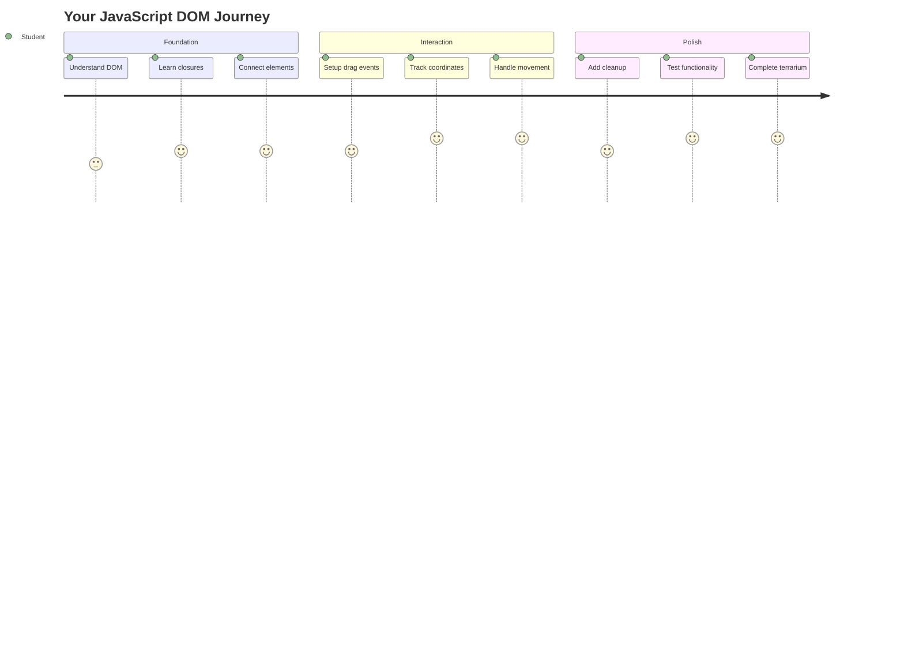
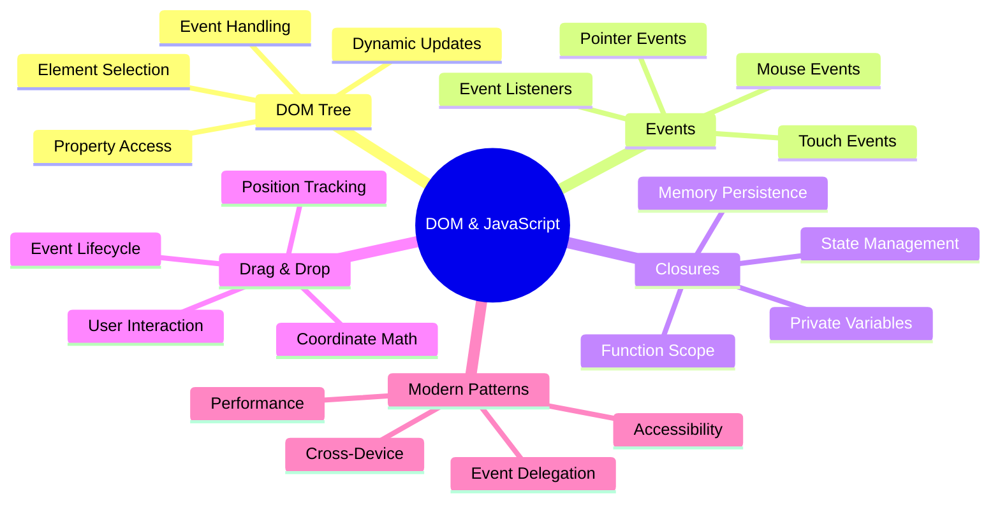
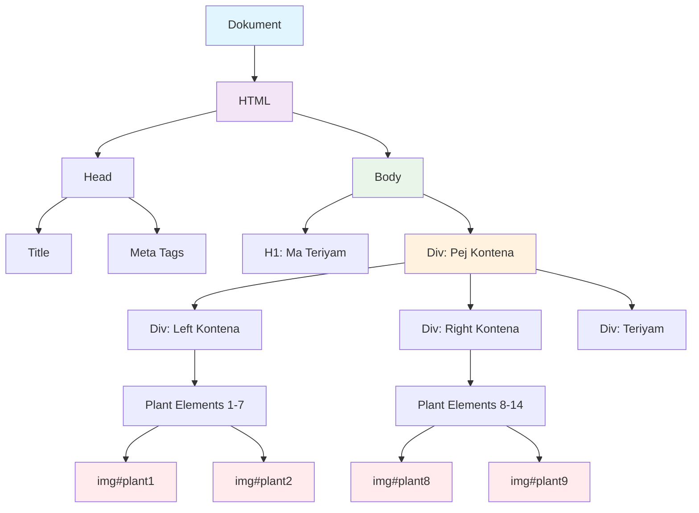
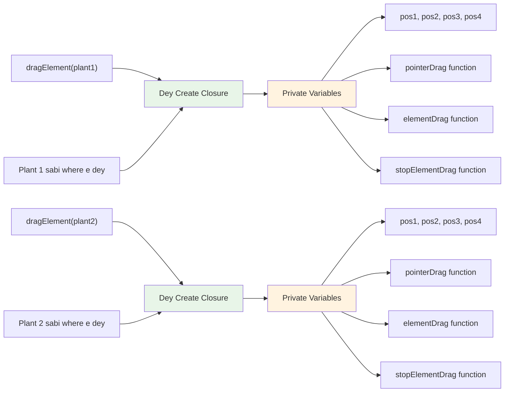
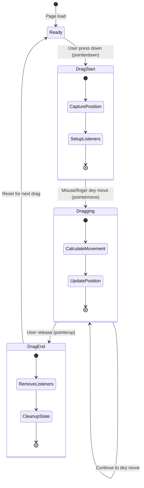
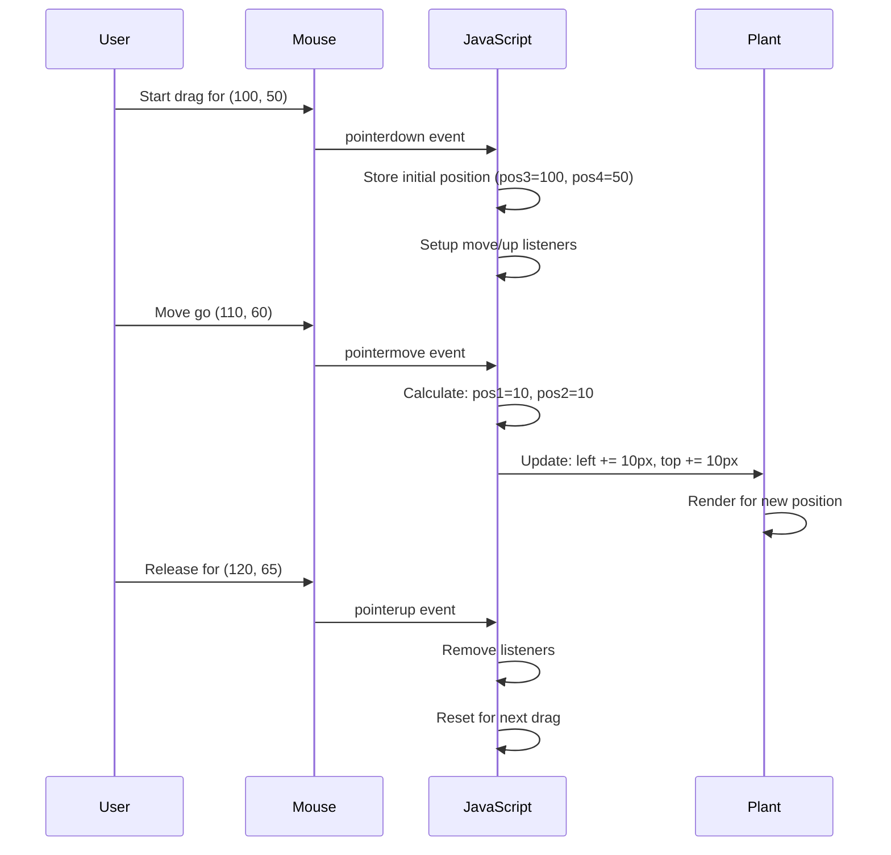
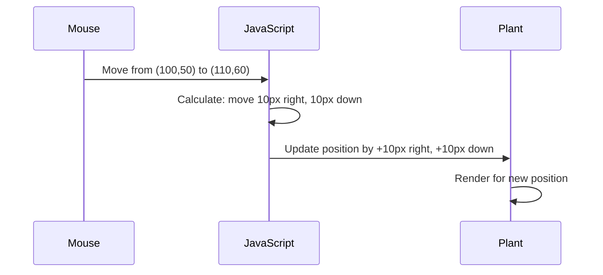
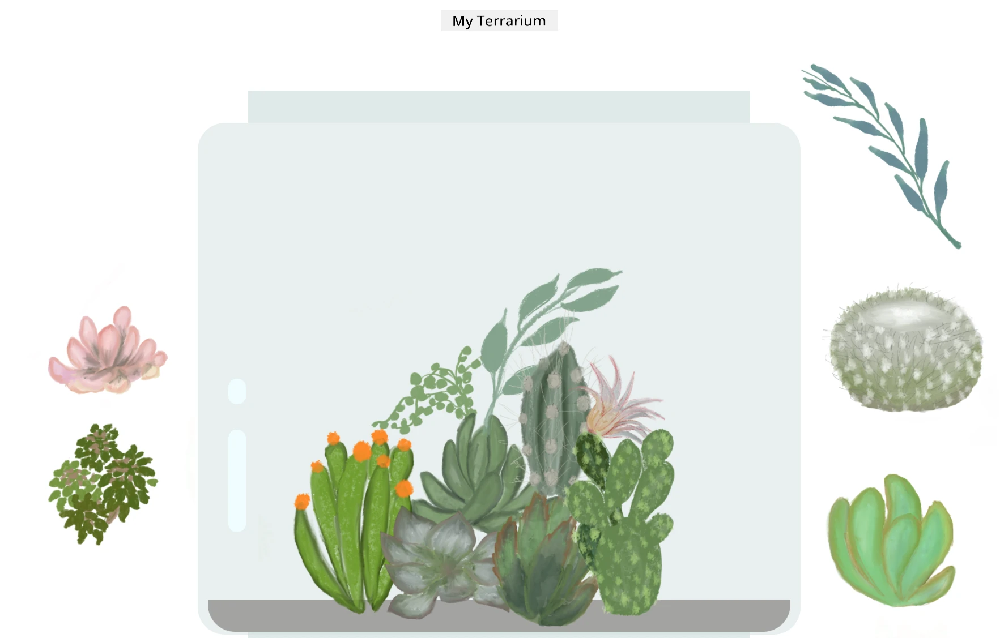
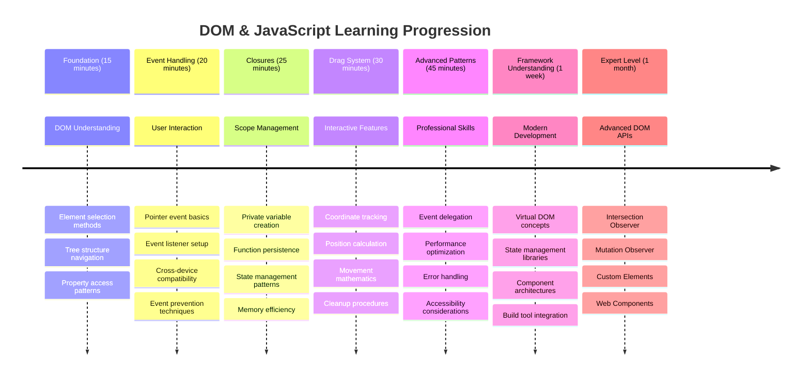

# Terrarium Project Part 3: DOM Manipulation and JavaScript Closures



> Sketchnote by [Tomomi Imura](https://twitter.com/girlie_mac)

Welcome to one of di most interesting tins for web development - to make tins wey fit react! Di Document Object Model (DOM) na bridge wey connect your HTML and JavaScript, and tiday we go use am bring your terrarium to life. Wen Tim Berners-Lee create di first web browser, e imagine say web go be place wey docs fit change and react - na di DOM sabi make dis thing happen.

We go also talk about JavaScript closures, wey fit sound hard at first. Think of closures like "memory pockets" weh your functions fit remember important tins. E be like how each plant for your terrarium get im own data record to sabi where e dey. By di end of dis lesson, you go understand how natural and useful dem be.

Dis na wetin we dey build: one terrarium weh users fit drag and drop plants anywhere dem want. You go learn di DOM manipulation skill wey dey power everything from drag-and-drop file upload to interactive games. Make we bring your terrarium alive.


## Pre-Lecture Quiz

[Pre-lecture quiz](https://ff-quizzes.netlify.app/web/quiz/19)

## Understanding the DOM: Your Gateway to Interactive Web Pages

Di Document Object Model (DOM) na how JavaScript dey talk to your HTML elements. Wen your browser load one HTML page, e go create one structured picture of dat page for memory - na dat be di DOM. Think am like family tree wey every HTML element na family member wey JavaScript fit reach, change, or rearrange.

DOM manipulation dey change static pages to interactive websites. Anytime you see button change color wen you put mouse for top, content update without refresh page, or elements wey you fit drag comot, na DOM manipulation dey wok.




> A representation of the DOM and the HTML markup that references it. From [Olfa Nasraoui](https://www.researchgate.net/publication/221417012_Profile-Based_Focused_Crawler_for_Social_Media-Sharing_Websites)

**Dis na why DOM dey powerful:**
- **E dey provide** correct way to reach any element for your page
- **E go allow** dynamic content update without page reload
- **E go enable** quick response to user tins like clicks and drag
- **E dey form** foundation for modern interactive web apps

## JavaScript Closures: Creating Organized, Powerful Code

One [JavaScript closure](https://developer.mozilla.org/docs/Web/JavaScript/Closures) be like to give function e own private workspace with memory wey no go vanish. Think how Darwin finches for Galápagos Islands each carry different beak because of their special environment - closures dey work like dat, e dey create special functions wey "remember" dem own context even after their parent function don finish.

For our terrarium, closures dey help every plant remember where e dey on im own. Dis pattern dey everywhere for professional JavaScript development, so e good to sabi.


> 💡 **Understanding Closures**: Closures na big topic inside JavaScript, and many developers dey use am for years before dem understand all di theory. Tiday, we dey focus on how to use am for real - you go see closures naturally show as we dey build our interactive tins. You go understand well as you see how dem fit solve real problems.


> A representation of the DOM and the HTML markup that references it. From [Olfa Nasraoui](https://www.researchgate.net/publication/221417012_Profile-Based_Focused_Crawler_for_Social_Media-Sharing_Websites)

For dis lesson, we go finish our interactive terrarium project by creating di JavaScript wey go allow user to manipulate plants for di page.

## Before We Begin: Setting Up for Success

You go need your HTML and CSS files from previous terrarium lessons - we dey go make dat static design interactive. If na your first time, finish those lessons first make you understand better.

Dis na wetin we go build:
- **Smooth drag-and-drop** for all terrarium plants
- **Coordinate tracking** make plants remember dem position
- **One full interactive interface** wey use vanilla JavaScript
- **Clean, organized code** with closure patterns

## Setting Up Your JavaScript File

Make we create di JavaScript file wey go make your terrarium interactive.

**Step 1: Create your script file**

For your terrarium folder, create new file wey dem go call `script.js`.

**Step 2: Link the JavaScript to your HTML**

Add dis script tag inside `<head>` section for your `index.html` file:

```html
<script src="./script.js" defer></script>
```

**Why `defer` attribute important:**
- **E dey make sure** your JavaScript wait till all HTML don load
- **E prevent** error wey fit happen if JavaScript find elements wey never ready
- **E guarantee** say all your plant elements dey ready for interaction
- **E dey better** pass to put scripts for page bottom

> ⚠️ **Important Note**: `defer` attribute dey stop common timing wahala. Without am, JavaScript fit try access HTML elements before dem load, wey fit cause error.

---

## Connecting JavaScript to Your HTML Elements

Before we fit make elements dey draggable, JavaScript must find dem inside di DOM. Think am like library catalog system - once you get catalog number, you go find correct book and access all inside tins.

We go use `document.getElementById()` method to do dis connection. E be like correct filing system - you give ID, e go find di exact HTML element wey you want.

### Enabling Drag Functionality for All Plants

Add dis code to your `script.js` file:

```javascript
// Make dem fit drag all di 14 plants
dragElement(document.getElementById('plant1'));
dragElement(document.getElementById('plant2'));
dragElement(document.getElementById('plant3'));
dragElement(document.getElementById('plant4'));
dragElement(document.getElementById('plant5'));
dragElement(document.getElementById('plant6'));
dragElement(document.getElementById('plant7'));
dragElement(document.getElementById('plant8'));
dragElement(document.getElementById('plant9'));
dragElement(document.getElementById('plant10'));
dragElement(document.getElementById('plant11'));
dragElement(document.getElementById('plant12'));
dragElement(document.getElementById('plant13'));
dragElement(document.getElementById('plant14'));
```

**Dis na wetin dis code dey do:**
- **E dey find** each plant element for DOM by their unique ID
- **E dey get** JavaScript reference to each HTML element
- **E dey pass** every element go `dragElement` function (wey we go create later)
- **E dey prepare** every plant for drag-and-drop interaction
- **E dey connect** your HTML structure to JavaScript work

> 🎯 **Why Use IDs Instead of Classes?** IDs dey give unique identity to specific elements, but CSS classes na for styling groups of elements. If JavaScript wan manipulate individual element, IDs get di precision and good performance.

> 💡 **Pro Tip**: You see how we dey call `dragElement()` for each plant separately? Dis approach dey make sure each plant get e own drag behavior, wey important for smooth user interaction.

### 🔄 **Pedagogical Check-in**
**DOM Connection Understanding**: Before you start drag work, make you:
- ✅ Explain how `document.getElementById()` dey find HTML elements
- ✅ Understand why we dey use unique IDs for each plant
- ✅ Talk wetin `defer` attribute mean inside script tags
- ✅ Know how JavaScript and HTML connect using DOM

**Quick Self-Test**: Wetin go happen if two elements get the same ID? Why `getElementById()` go return only one element?
*Answer: IDs suppose be unique; if dem duplicate, only first element go show*

---

## Building the Drag Element Closure

Now we go build main part of our drag functionality: one closure wey go handle dragging for each plant. Dis closure get plenty inner functions wey work together to track mouse movement and update element position.

Closures good for dis work because dem fit create "private" variables wey dey last between function calls, so each plant get e own coordinate tracking.

### Understanding Closures with a Simple Example

Make I show you closure example wey clear di idea:

```javascript
function createCounter() {
    let count = 0; // Dis na like private variable
    
    function increment() {
        count++; // Di inside function dey remember di outside variable
        return count;
    }
    
    return increment; // We dey give back di inside function
}

const myCounter = createCounter();
console.log(myCounter()); // 1
console.log(myCounter()); // 2
```

**Wetin dis closure dey do:**
- **E dey create** private `count` variable wey only dey inside dis closure
- **Inner function** fit access and change dat outside variable (closure way)
- **When we return** inner function, e hold connection to dat private data
- **Even after** `createCounter()` don finish, `count` still dey and remember value

### Why Closures Are Perfect for Drag Functionality

For our terrarium, each plant need remember where e dey now. Closures dey solve dis problem well:

**Key benefits for our project:**
- **E keep** private position variables for each plant alone
- **E save** coordinate data between drag events
- **E protect** variable from conflicting with other draggable elements
- **E create** clean and organized code structure

> 🎯 **Learning Goal**: You no need sabi every small thing about closures now. Just dey observe how dem help arrange code and keep state for dragging work.


### Creating the dragElement Function

Now make we build main function wey go handle all dragging logic. Add dis function under your plant element declarations:

```javascript
function dragElement(terrariumElement) {
    // Start position tracking variables
    let pos1 = 0,  // Di mouse X position wey happen before
        pos2 = 0,  // Di mouse Y position wey happen before
        pos3 = 0,  // Di current mouse X position
        pos4 = 0;  // Di current mouse Y position
    
    // Arrange di first drag event listener
    terrariumElement.onpointerdown = pointerDrag;
}
```

**Understanding position tracking system:**
- **`pos1` and `pos2`**: Store difference between old and new mouse position
- **`pos3` and `pos4`**: Track current mouse coordinates
- **`terrariumElement`**: The plant element we dey make draggable
- **`onpointerdown`**: Event wey start when user begin drag

**How di closure pattern waka:**
- **E create** private position variables for every plant
- **E keep** these variables during dragging time
- **E make sure** each plant track im own coordinate independently
- **E provide** clean interface through `dragElement` function

### Why Use Pointer Events?

You fit ask why use `onpointerdown` instead of common `onclick`. See reason here:

| Event Type | Best For | The Catch |
|------------|----------|-------------|
| `onclick` | Simple button clicks | No drag support, only click and release |
| `onpointerdown` | Both mouse and touch | New but well supported now |
| `onmousedown` | Desktop mouse only | No support for mobile touch |

**Why pointer events good for our build:**
- **E work well** whether you use mouse, finger, or stylus
- **E feel same** for laptop, tablet, or phone
- **E handle** real dragging motion (no just click and finish)
- **E give** smooth experience wey modern web apps need

> 💡 **Future-Proofing**: Pointer events na modern way to handle user interaction. Instead make you write separate code for mouse and touch, you get both for free. E dey kampe, abi?

### 🔄 **Pedagogical Check-in**
**Event Handling Understanding**: Stop and check say you sabi these:
- ✅ Why we use pointer events instead of just mouse events?
- ✅ How closure variables last between function calls?
- ✅ Wetin `preventDefault()` do for smooth dragging?
- ✅ Why we attach listeners to document and not per element?

**Real-World Connection**: Think about drag-and-drop tins you dey use everyday:
- **File uploads**: Drag files enter browser window
- **Kanban boards**: Move tasks between columns
- **Image galleries**: Change photo order
- **Mobile interfaces**: Swipe and drag for touchscreen

---

## The pointerDrag Function: Capturing the Start of a Drag

When user press down for plant (with mouse click or finger touch), `pointerDrag` function go start work. Dis function capture where drag start and prepare dragging system.

Add dis function inside your `dragElement` closure, right after line `terrariumElement.onpointerdown = pointerDrag;`:

```javascript
function pointerDrag(e) {
    // Make browser no do im normal tin dem (like to select text)
    e.preventDefault();
    
    // Catch di first mouse/touch position
    pos3 = e.clientX;  // X position wey drag begin
    pos4 = e.clientY;  // Y position wey drag begin
    
    // Arrange event listeners for di drag process
    document.onpointermove = elementDrag;
    document.onpointerup = stopElementDrag;
}
```

**Step by step, wetin e dey do:**
- **E stop** default browser action wey fit spoil dragging
- **E record** exact place wey user start drag
- **E set up** event listener to continue drag movement
- **E prepare** system to track mouse/finger movement across whole document

### Understanding Event Prevention

Di `e.preventDefault()` line dey important for smooth dragging:

**Without dis prevention, browsers fit:**
- **Select** text wen you drag across page
- **Open** context menu on right-click drag
- **Waka interfere** with our drag behaviour
- **Create** visual disturbance during drag

> 🔍 **Experiment**: After this lesson finish, try remove `e.preventDefault()` and see wetin happen to dragging. You go sharpaly understand why e dey important!

### Coordinate Tracking System

`e.clientX` and `e.clientY` give us exact mouse/touch position:

| Property | Wetin E Mean | For Wetin E Use |
|----------|--------------|-----------------|
| `clientX` | Horizontal position relative to viewport | Track left-right movement |
| `clientY` | Vertical position relative to viewport | Track up-down movement |
**Understanding these coordinates:**
- **De give** pixel-perfect position information
- **De update** for real-time as user move dia pointer
- **De remain** consistent across different screen size dem and zoom level dem
- **De enable** smooth, responsive drag interaction

### Setting Up Document-Level Event Listeners

Notice how we attach the move and stop event dem to the whole `document`, no be only di plant element:

```javascript
document.onpointermove = elementDrag;
document.onpointerup = stopElementDrag;
```

**Why attach to the document:**
- **De continue** to track even when di mouse comot di plant element
- **De prevent** drag interruption if user move fast
- **De give** smooth dragging all over di whole screen
- **De handle** edge cases wey di cursor move outside di browser window

> ⚡ **Performance Note**: We go clean up these document-level listeners when drag stop to avoid memory leak and performance wahala.

## Completing the Drag System: Movement and Cleanup

Now we go add di two functions wey remain wey go handle di real dragging movement and di cleanup when dragging stop. These functions dey work together to create smooth, responsive plant movement inside your terrarium.

### The elementDrag Function: Tracking Movement

Add di `elementDrag` function directly after di closing curly bracket of `pointerDrag`:

```javascript
function elementDrag(e) {
    // Calculate how far e don move since di last event
    pos1 = pos3 - e.clientX;  // Horizontal distance wey e move
    pos2 = pos4 - e.clientY;  // Vertical distance wey e move
    
    // Update di current position wey we dey track
    pos3 = e.clientX;  // New current X position
    pos4 = e.clientY;  // New current Y position
    
    // Apply di movement to di element position
    terrariumElement.style.top = (terrariumElement.offsetTop - pos2) + 'px';
    terrariumElement.style.left = (terrariumElement.offsetLeft - pos1) + 'px';
}
```

**Understanding the coordinate mathematics:**
- **`pos1` and `pos2`**: Calculate how far di mouse don move since di last time update
- **`pos3` and `pos4`**: Store di current mouse position for di next calculation
- **`offsetTop` and `offsetLeft`**: Get di element position for the page now now
- **Subtraction logic**: De move di element by di same amount wey di mouse move


**This na di movement calculation breakdown:**
1. **De measure** di difference between old and new mouse position dem
2. **De calculate** how much make element move based on mouse movement
3. **De update** di element CSS position properties in real-time
4. **De store** di new position as base for di next movement calculation

### Visual Representation of the Math


### The stopElementDrag Function: Cleaning Up

Add di cleanup function after di closing curly bracket of `elementDrag`:

```javascript
function stopElementDrag() {
    // Comot di document-level event listeners
    document.onpointerup = null;
    document.onpointermove = null;
}
```

**Why cleanup dey important:**
- **De prevent** memory leak from event listeners wey still dey
- **De stop** di dragging action when user release di plant
- **De allow** other element dem to drag their own independently
- **De reset** di system for next drag operation

**Wetin go happen if no cleanup:**
- Event listeners go still dey run even after dragging don stop
- Performance go reduce as unused listeners go pile up
- Wahala for unexpected behavior when you interact with other element dem
- Browser resources go waste for unnecessary event handling

### Understanding CSS Position Properties

Our dragging system dey manipulate two important CSS properties:

| Property | Wetin E Control | How We Take Use Am |
|----------|-----------------|-------------------|
| `top` | Distance from top edge | Vertical positioning during drag |
| `left` | Distance from left edge | Horizontal positioning during drag |

**Key insights about offset properties:**
- **`offsetTop`**: Current distance from top of the positioned parent element
- **`offsetLeft`**: Current distance from left of the positioned parent element
- **Positioning context**: These values dey relative to the nearest positioned ancestor
- **Real-time updates**: E dey change immediately when we modify the CSS properties

> 🎯 **Design Philosophy**: This drag system na purposely flexible – we no get any kind drop zones or restrictions. Users fit put their plants anywhere, give dem full creative control over their terrarium design.

## Bringing It All Together: Your Complete Drag System

Congrats! You don just build sophisticated drag-and-drop system with vanilla JavaScript. Your full `dragElement` function now get strong closure wey dey manage:

**Wetin your closure dey accomplish:**
- **De maintain** private position variables for each plant independently
- **De handle** di complete drag lifecycle from beginning to end
- **De give** smooth, responsive movement across the whole screen
- **De clean** resources well to avoid memory leaks
- **De create** intuitive, creative interface for terrarium design

### Testing Your Interactive Terrarium

Now try test your interactive terrarium! Open your `index.html` file for web browser and try di functionality:

1. **Click and hold** any plant to start to drag am
2. **Move your mouse or finger** and watch di plant dey follow smoothly
3. **Release** to drop di plant for the new position e dey
4. **Try different arrangement** to explore di interface well well

🥇 **Achievement**: You don create full interactive web app using the core concepts wey professional developers dey use every day. That drag-and-drop thing na the same principle behind file uploads, kanban board, and plenty other interactive interfaces.

### 🔄 **Pedagogical Check-in**
**Complete System Understanding**: Check if you sabi di full drag system well:
- ✅ How closures dey maintain independent state for each plant?
- ✅ Why coordinate calculation mathematics dey necessary for smooth movement?
- ✅ Wetin go happen if we forget clean up event listeners?
- ✅ How this pattern fit scale to more complex interactions?

**Code Quality Reflection**: Look your complete solution:
- **Modular design**: Each plant get im own closure instance
- **Event efficiency**: Proper setup and cleanup of listeners
- **Cross-device support**: E dey work on desktop and mobile
- **Performance conscious**: No memory leaks or unnecessary calculations



---

## GitHub Copilot Agent Challenge 🚀

Use Agent mode to complete this challenge:

**Description:** Improve the terrarium project by adding reset functionality wey go return all plants to their original positions with smooth animations.

**Prompt:** Create reset button wey when you click am, e go animate all plants back to their original sidebar positions using CSS transitions. The function go store the original positions when the page load and then smoothly transition plants back to those positions for 1 second when user press the reset button.

Learn more about [agent mode](https://code.visualstudio.com/blogs/2025/02/24/introducing-copilot-agent-mode) here.

## 🚀 Additional Challenge: Expand Your Skills

Ready to take your terrarium to the next level? Try add these enhancements:

**Creative Extensions:**
- **Double-click** plant to bring am come front (z-index manipulation)
- **Add visual feedback** like small glow when you hover over plants
- **Implement boundaries** so plants no go fit drag outside terrarium
- **Create save function** wey remember plant positions using localStorage
- **Add sound effects** for picking and placing plants

> 💡 **Learning Opportunity**: Each challenge go teach you new things about DOM manipulation, event handling, and user experience design.

## Post-Lecture Quiz

[Post-lecture quiz](https://ff-quizzes.netlify.app/web/quiz/20)

## Review & Self Study: Deepening Your Understanding

You don master fundamentals of DOM manipulation and closures, but still get more for explore! Here some ways to expand your knowledge and skills.

### Alternative Drag and Drop Approaches

We use pointer events for maximum flexibility, but web development get different approaches:

| Approach | Best For | Learning Value |
|----------|----------|----------------|
| [HTML Drag and Drop API](https://developer.mozilla.org/docs/Web/API/HTML_Drag_and_Drop_API) | File uploads, formal drag zones | Understanding native browser capabilities |
| [Touch Events](https://developer.mozilla.org/docs/Web/API/Touch_events) | Mobile-specific interactions | Mobile-first development patterns |
| CSS `transform` properties | Smooth animations | Performance optimization techniques |

### Advanced DOM Manipulation Topics

**Next steps for your learning journey:**
- **Event delegation**: Handle events efficiently for many elements
- **Intersection Observer**: Detect when element enter or leave viewport
- **Mutation Observer**: Watch for changes for DOM structure
- **Web Components**: Create reusable, encapsulated UI elements
- **Virtual DOM concepts**: Understand how frameworks optimize DOM updates

### Essential Resources for Continued Learning

**Technical Documentation:**
- [MDN Pointer Events Guide](https://developer.mozilla.org/docs/Web/API/Pointer_events) - Full pointer event reference
- [W3C Pointer Events Specification](https://www.w3.org/TR/pointerevents1/) - Official standards docs
- [JavaScript Closures Deep Dive](https://developer.mozilla.org/docs/Web/JavaScript/Closures) - Advanced closure patterns

**Browser Compatibility:**
- [CanIUse.com](https://caniuse.com/) - Check feature support for browsers
- [MDN Browser Compatibility Data](https://github.com/mdn/browser-compat-data) - Detailed compatibility info

**Practice Opportunities:**
- **Build** puzzle game with similar drag mechanics
- **Create** kanban board with drag-and-drop task management
- **Design** image gallery with draggable photo arrangement
- **Try** touch gesture for mobile interfaces

> 🎯 **Learning Strategy**: Best way to solidify concepts na through practice. Try build different draggable interfaces – each project go teach you new thing about user interaction and DOM manipulation.

### ⚡ **What You Can Do in the Next 5 Minutes**
- [ ] Open browser DevTools and type `document.querySelector('body')` inside console
- [ ] Try change webpage text using `innerHTML` or `textContent`
- [ ] Add click event listener to any button or link on webpage
- [ ] Inspect DOM structure using Elements panel

### 🎯 **What You Can Accomplish This Hour**
- [ ] Complete post-lesson quiz and review DOM manipulation concepts
- [ ] Create interactive webpage wey respond to user clicks
- [ ] Practice event handling with different event types (click, mouseover, keypress)
- [ ] Build simple to-do list or counter with DOM manipulation
- [ ] Explore relations between HTML elements and JavaScript objects

### 📅 **Your Week-Long JavaScript Journey**
- [ ] Complete interactive terrarium project with drag-and-drop functionality
- [ ] Master event delegation for efficient event handling
- [ ] Learn about event loop and asynchronous JavaScript
- [ ] Practice closures by building modules with private state
- [ ] Explore modern DOM APIs like Intersection Observer
- [ ] Build interactive components without frameworks

### 🌟 **Your Month-Long JavaScript Mastery**
- [ ] Create complex single-page application using vanilla JavaScript
- [ ] Learn modern framework (React, Vue, or Angular) and compare to vanilla DOM
- [ ] Contribute to open source JavaScript projects
- [ ] Master advanced concepts like web components and custom elements
- [ ] Build performant web apps with optimal DOM patterns
- [ ] Teach others about DOM manipulation and JavaScript fundamentals

## 🎯 Your JavaScript DOM Mastery Timeline


### 🛠️ Your JavaScript Toolkit Summary

After you don complete this lesson, you get:
- **DOM Mastery**: Element selection, property manipulation, and tree navigation
- **Event Expertise**: Cross-device handling with pointer events
- **Closure Understanding**: Private state management and function persistence
- **Interactive Systems**: Full drag-and-drop implementation from beginning
- **Performance Awareness**: Proper event cleanup and memory management
- **Modern Patterns**: Code organization techniques used by pros
- **User Experience**: Creating intuitive, responsive interfaces

**Professional Skills You Get**: You don build features using same technique as:
- **Trello/Kanban boards**: Card dragging between columns
- **File upload systems**: Drag-and-drop file handling
- **Image galleries**: Photo arrangement interfaces
- **Mobile apps**: Touch-based interaction patterns

**Next Level**: You ready explore modern frameworks like React, Vue, or Angular wey build on these core DOM manipulation concepts!

## Assignment

[Work a bit more with the DOM](assignment.md)

---

<!-- CO-OP TRANSLATOR DISCLAIMER START -->
**Disclaimer**:  
Dis document na AI translation service [Co-op Translator](https://github.com/Azure/co-op-translator) wey dem use translate am. Even though we dey try make am correct, abeg sabi say machine translation fit get mistake or no too correct. Di original document wey e dey for e own language na di correct one. If na important tin, better make professional human translator do am. We no go responsible if person misunderstand or get wrong idea from dis translation.
<!-- CO-OP TRANSLATOR DISCLAIMER END -->