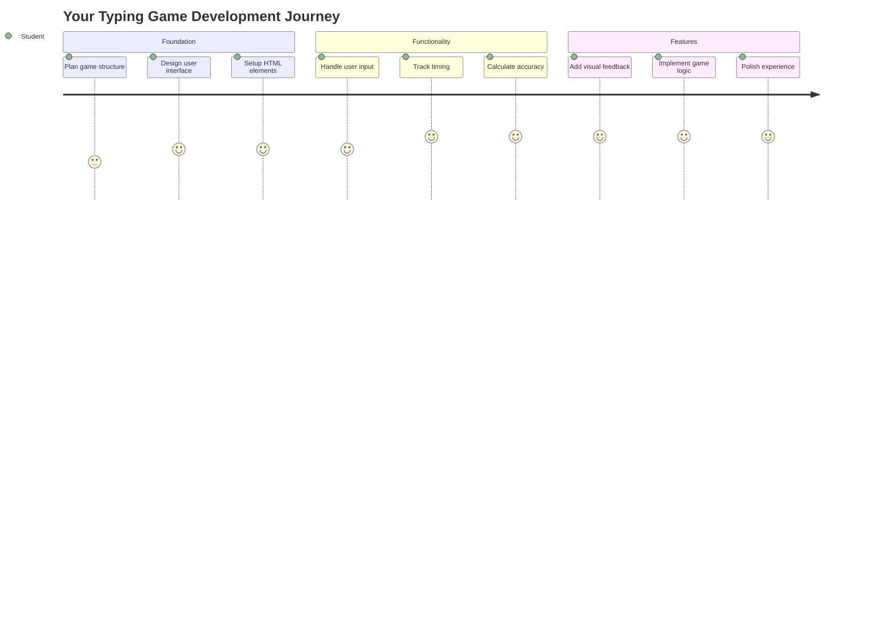
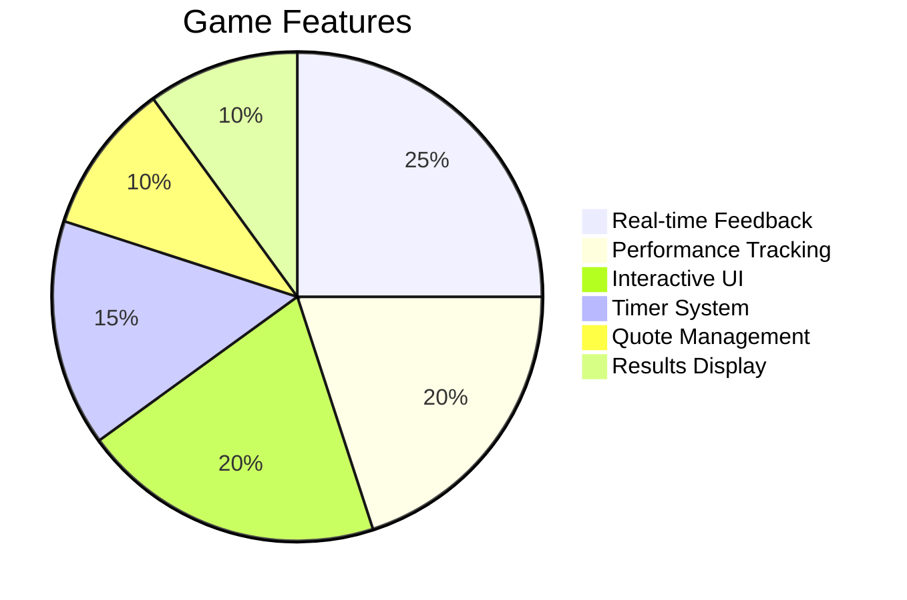
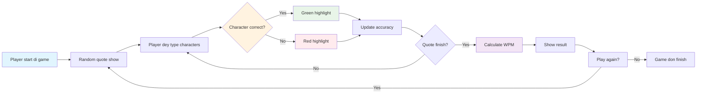
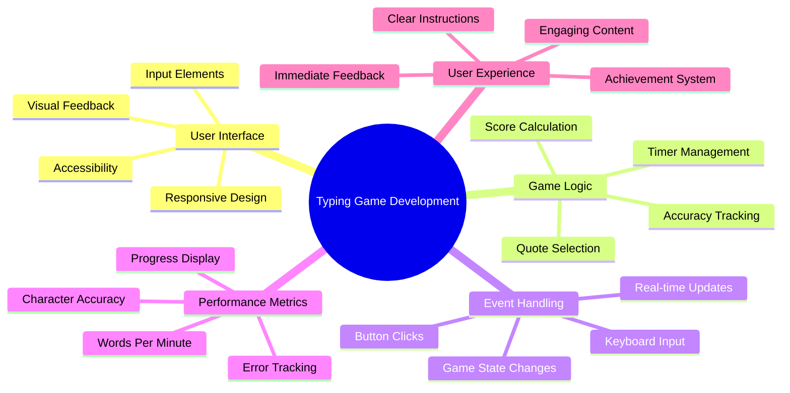
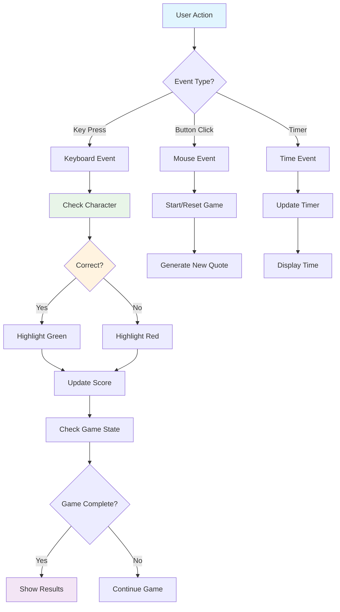
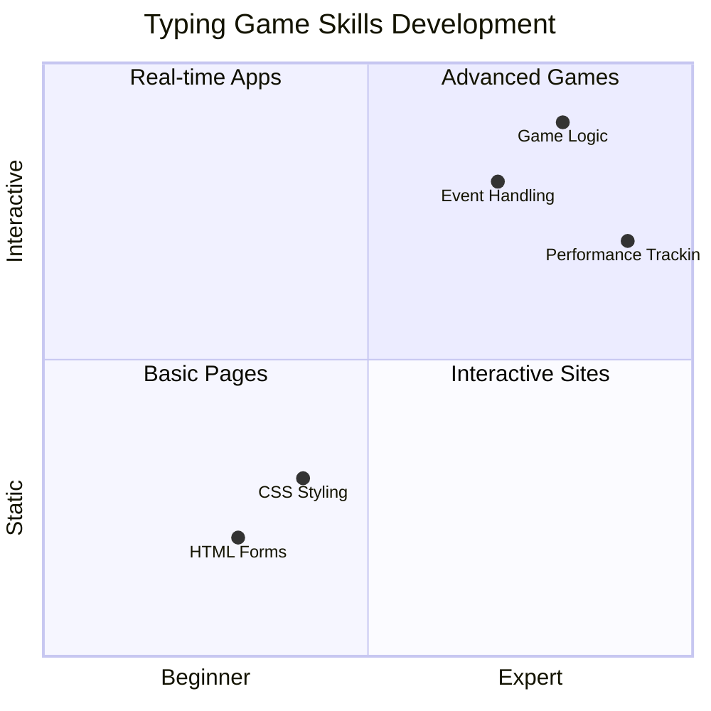
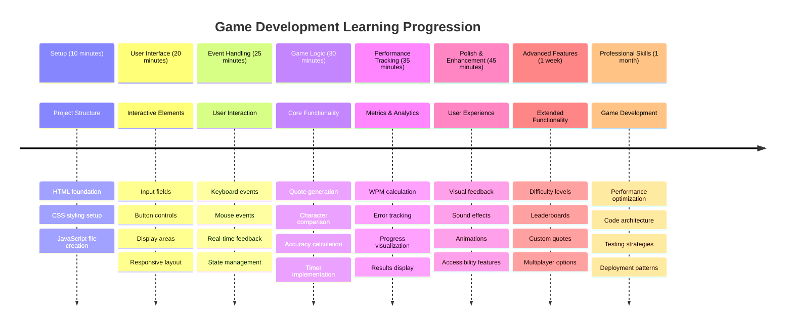

<!--
CO_OP_TRANSLATOR_METADATA:
{
  "original_hash": "efa2ab875b8bb5a7883816506da6b6d2",
  "translation_date": "2026-01-08T11:31:16+00:00",
  "source_file": "4-typing-game/README.md",
  "language_code": "pcm"
}
-->
# Event-Driven Programming - Build a Typing Game

## Introduction

Dis na wetin every developer sabi but no dey talk about well-well: typing fast na big power! 🚀 Think am - di faster wey you fit commot your tins from your brain go your code editor, di more your creativity go flow. E be like say you get direct pipeline between your mind and di screen.

You wan sabi one beta way to upgrade dis skill? You don guess am - we go build game!

> Make we create beta typing game together!

You ready to put all those JavaScript, HTML, and CSS skills wey you don dey learn for work? We go build typing game wey go challenge you with random quotes from di legendary detective [Sherlock Holmes](https://en.wikipedia.org/wiki/Sherlock_Holmes). Di game go dey track how fast and correct you fit type - and I swear, e dey more addictive pass wetin you fit think!

## Wetin You Need to Know

Before we start, make sure say you sabi these tins well (no shaking if you need quick refresher - we all don pass dat one!):

- How to create text input and button controls
- CSS and how to set styles with classes  
- JavaScript basics
  - How to create array
  - How to create random number
  - How to get current time

If any of this tins dey small rusty for you, no worry! Sometimes di beta way to make your knowledge strong na to jump inside project and learn as you dey go.

### 🔄 **Pedagogical Check-in**
**Foundation Assessment**: Before you start development, make sure say you sabi:
- ✅ How HTML forms and input elements dey work
- ✅ CSS classes and dynamic styling
- ✅ JavaScript event listeners and handlers
- ✅ Array manipulation and random selection
- ✅ How to measure time and do calculations

**Quick Self-Test**: Fit explain how these concepts dey work together for interactive game?
- **Events** dey trigger when users interact with elements
- **Handlers** dey process those events and update game state
- **CSS** dey give visual feedback for user actions
- **Timing** dey enable performance measurement and game progress

## Make We Build Dis Game!

[Creating a typing game by using event driven programming](./typing-game/README.md)

### ⚡ **Wetin You Fit Do for Next 5 Minutes**
- [ ] Open your browser console and try listen for keyboard events with `addEventListener`
- [ ] Create simple HTML page with input field and test typing detection
- [ ] Practice string manipulation by comparing typed text with target text
- [ ] Try use `setTimeout` to understand timing functions

### 🎯 **Wetin You Fit Achieve Dis Hour**
- [ ] Finish post-lesson quiz and understand event-driven programming
- [ ] Build basic version of typing game with word validation
- [ ] Add visual feedback for correct and wrong typing
- [ ] Implement simple scoring system wey depend on speed and accuracy
- [ ] Style your game with CSS to make am look fine

### 📅 **Your Week-Long Game Development**
- [ ] Finish full typing game with all features and polish
- [ ] Add difficulty levels with different word complexity
- [ ] Implement user statistics tracking (WPM, accuracy over time)
- [ ] Create sound effects and animations for better user experience
- [ ] Make your game mobile-responsive for touch devices
- [ ] Share your game online and collect feedback from users

### 🌟 **Your Month-Long Interactive Development**
- [ ] Build multiple games to explore different interaction patterns
- [ ] Learn about game loops, state management, and performance optimization
- [ ] Contribute to open source game development projects
- [ ] Master advanced timing concepts and smooth animations
- [ ] Create portfolio wey dey show different interactive applications
- [ ] Mentor people wey dey interested in game development and user interaction

## 🎯 Your Typing Game Mastery Timeline

### 🛠️ Your Game Development Toolkit Summary

After you finish dis project, you go sabi:
- **Event-Driven Programming**: Responsive user interfaces wey dey react to input
- **Real-Time Feedback**: Instant visual and performance updates
- **Performance Measurement**: Correct timing and scoring systems
- **Game State Management**: Control application flow and user experience
- **Interactive Design**: Create engaging, addictive user experiences
- **Modern Web APIs**: Use browser capabilities for rich interactions
- **Accessibility Patterns**: Inclusive design for everybody

**Real-World Applications**: These skills dey important for:
- **Web Applications**: Any interactive interface or dashboard
- **Educational Software**: Learning platforms and skill assessment tools
- **Productivity Tools**: Text editors, IDEs, and collaboration software
- **Gaming Industry**: Browser games and interactive entertainment
- **Mobile Development**: Touch-based interfaces and gesture handling

**Next Level**: You ready to explore advanced game frameworks, real-time multiplayer systems, or complex interactive applications!

## Credits

Written with ♥️ by [Christopher Harrison](http://www.twitter.com/geektrainer)

---

<!-- CO-OP TRANSLATOR DISCLAIMER START -->
**Disclaimer**:  
Dis dokumment don translate wit AI translation service [Co-op Translator](https://github.com/Azure/co-op-translator). Even though we dey try make am correct, abeg make you sabi se automated translation fit get some error or mistake. Di original dokumment wey dey dia for im own language na im be di main correct source. For important info, na professional human translation you suppose use. We no go responsible for any kind konfussion or wrong understandin wey fit happen from dis translation.
<!-- CO-OP TRANSLATOR DISCLAIMER END -->