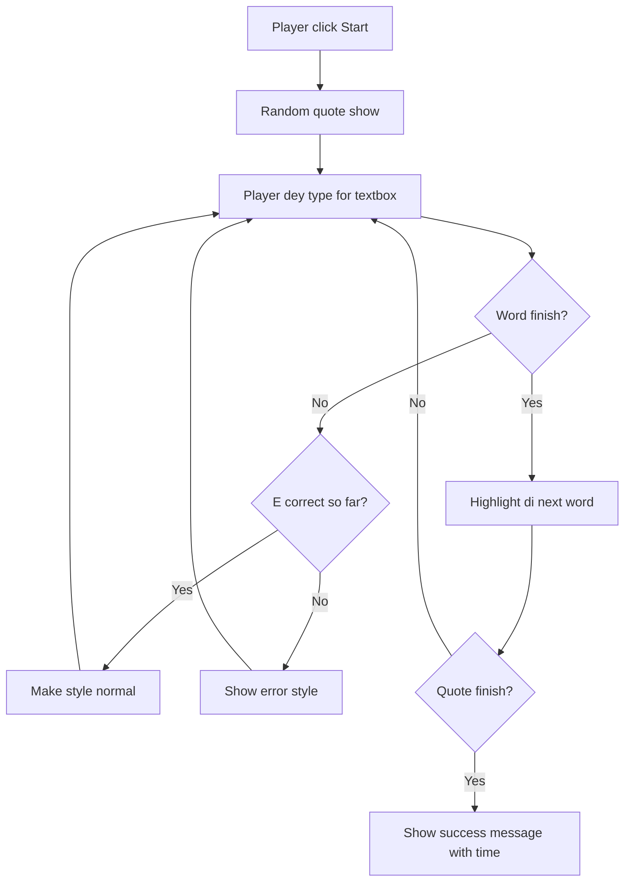
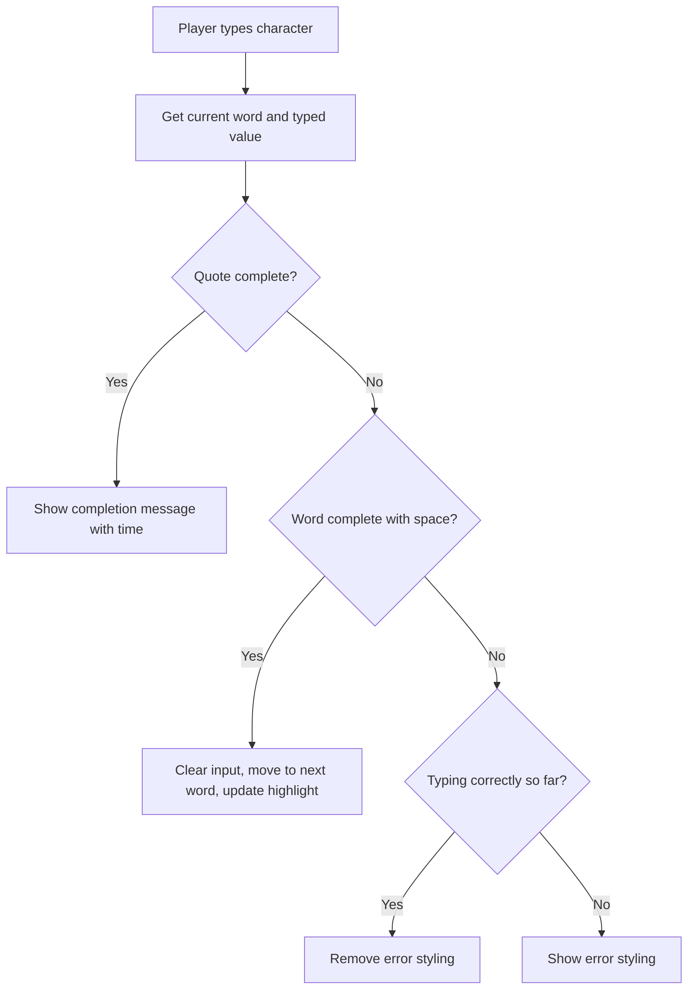
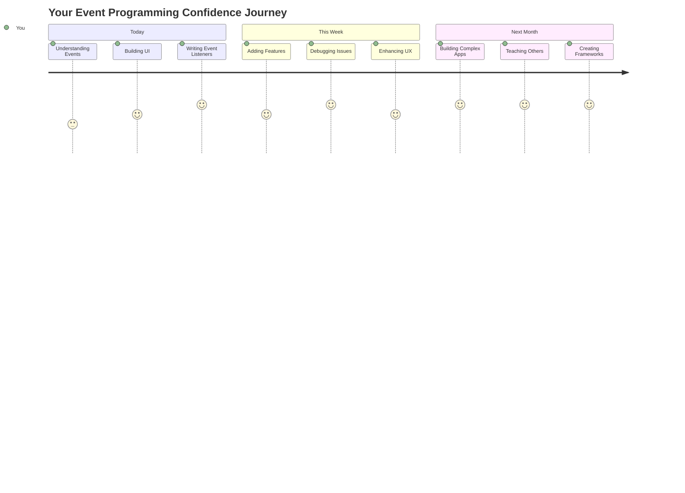

<!--
CO_OP_TRANSLATOR_METADATA:
{
  "original_hash": "da8bc72041a2bb3826a54654ee1a8844",
  "translation_date": "2026-01-08T18:08:21+00:00",
  "source_file": "4-typing-game/typing-game/README.md",
  "language_code": "pcm"
}
-->
# Creating a game using events

You don waka ever wonder how websites sabi when you click button or type for inside textbox? Na the magic wey dey inside event-driven programming! Wetin better way to learn dis important skill than to build something useful - typing speed game wey dey react to every keystroke wey you do.

You go see for yourself how web browsers dey "talk" to your JavaScript code. Every time you click, type, or move your mouse, the browser dey send small messages (we dey call dem events) go your code, and na you go decide how to respond!

By the time we finish here, you go don build real typing game wey dey track your speed and accuracy. More importantly, you go understand the fundamental concepts wey dey power every interactive website wey you don ever use. Make we dive inside!

## Pre-Lecture Quiz

[Pre-lecture quiz](https://ff-quizzes.netlify.app/web/quiz/21)

## Event driven programming

Think about your favorite app or website - wetin make am feel alive and responsive? Na everything about how e dey react to wetin you do! Every tap, click, swipe, or keystroke na wetin we dey call "event," and na there the real magic of web development dey happen.

This na wetin make programming for web dey interesting: we no sabi when person go click that button or begin type for inside textbox. E fit click immediately, wait five minutes, or maybe no click at all! This unpredictability mean say we need to think differently on top how we dey write our code.

Instead of writing code wey go run from top to bottom like recipe, we dey write code wey just siddon wait patiently for something to happen. E be like how telegraph operators for 1800s dey siddon near their machines, ready to respond the moment message show for the wire.

So wetin be "event"? Simply put, na wetin happen! When you click button - na event be dat. When you type letter - na event be dat. When you move your mouse - na another event be dat.

Event-driven programming let us set our code to listen and respond. We dey create special functions wey we dey call **event listeners** wey go wait patiently for specific things to happen, then come rush into action when dem happen.

Think event listeners as doorbell for your code. You set the doorbell (`addEventListener()`), tell am which sound to listen for (like 'click' or 'keypress'), then specify wetin suppose happen when person ring am (your own custom function).

**Dis na how event listeners dey work:**
- **Listen** for specific user actions like clicks, keystrokes, or mouse movements
- **Run** your custom code when the specified event happen
- **Respond** immediately to user interactions, create smooth experience
- **Handle** multiple events on same element using different listeners

> **NOTE:** E good to know say plenty ways dey to create event listeners. You fit use anonymous functions, or create named ones. You fit use different shortcuts, like to set `click` property, or to use `addEventListener()`. For our exercise, we go focus on `addEventListener()` and anonymous functions, as na the most common way web developers dey use. E get plenty flexibility too, as `addEventListener()` dey work with all events, and event name fit dey passed as parameter.

### Common events

Even though web browsers get plenty different events wey you fit listen to, most interactive apps rely on just few important events. To sabi these main events go give you foundation to build better user interactions.

You get [dozens of events](https://developer.mozilla.org/docs/Web/Events) wey you fit listen for when you dey create app. Basically anything wey user do on page go raise event, this one dey give you plenty power to make sure dem get the experience you want. Luckily, you go normally need only small handful of events. Here some common ones (including the two we go use for making our game):

| Event | Description | Common Use Cases |
|-------|-------------|------------------|
| `click` | User click on something | Buttons, links, interactive elements |
| `contextmenu` | User click right mouse button | Custom right-click menus |
| `select` | User highlight some text | Text editing, copy operations |
| `input` | User input some text | Form validation, real-time search |

**To understand these event types:**
- **Trigger** when users interact with specific elements on your page
- **Provide** detailed info about user's action through event objects
- **Enable** you to create responsive, interactive web apps
- **Work** consistently across different browsers and devices

## Creating the game

Now wey you don understand how events dey work, make we take that knowledge put am for practice by building something useful. We go create typing speed game wey go show how event handling dey work and help you develop important developer skill.

We go create game to explore how events dey work for JavaScript. Our game go test player typing skill which be one of the most underrated skills wey all developers suppose get. Fun fact: the QWERTY keyboard layout wey we use today na im dem design for typewriters back for 1870s - and good typing skill still dey very valuable for programmers today! The general flow of the game go be like this:


**Here na how our game go work:**
- **Start** when player click start button and display random quote
- **Track** player typing progress word by word in real-time
- **Highlight** the current word to guide player focus
- **Provide** immediate visual feedback for typing errors
- **Calculate** and display the total time when the quote complete

Make we build our game, and learn more about events!

### File structure

Before we start to code, make we organize ourselves! To get clean file structure from the beginning go save headache later and make your project look professional. 😊

We go keep am simple with just three files: `index.html` for page structure, `script.js` for all our game logic, and `style.css` to make everything fine. Dis na classic trio wey dey power most web!

**Create new folder for your work by opening console or terminal and run dis command:**

```bash
# Linux or macOS
mkdir typing-game && cd typing-game

# Windows
md typing-game && cd typing-game
```

**Here na wetin these commands go do:**
- **Create** new directory wey dem call `typing-game` for your project files
- **Goto** the newly created directory automatically
- **Set** clean workspace for your game development

**Open Visual Studio Code:**

```bash
code .
```

**Dis command:**
- **Launch** Visual Studio Code for current directory
- **Open** your project folder inside editor
- **Provide** access to all development tools wey you go need

**Add three files to the folder inside Visual Studio Code with these names:**
- `index.html` - get structure and content of your game
- `script.js` - handle all game logic and event listeners
- `style.css` - define visual look and styling

## Create the user interface

Now make we build the stage where all our game action go happen! Think am like to design control panel for spaceship - we need make sure everything wey our players need dey for place wey dem expect.

Make we think wetin our game really need. If na you dey play typing game, wetin you go want see for the screen? Here na wetin we go need:

| UI Element | Purpose | HTML Element |
|------------|---------|-------------|
| Quote Display | Show the text to type | `<p>` with `id="quote"` |
| Message Area | Show status and success messages | `<p>` with `id="message"` |
| Text Input | Where players type the quote | `<input>` with `id="typed-value"` |
| Start Button | Begin the game | `<button>` with `id="start"` |

**Understanding the UI structure:**
- **Organize** content logically from top to bottom
- **Assign** unique IDs to elements for JavaScript targeting
- **Provide** clear visual hierarchy for better user experience
- **Include** semantic HTML elements for accessibility

Each one go need ID so that we fit work with dem inside our JavaScript. We go also add reference to CSS and JavaScript files wey we go create.

Create new file wey dem go call `index.html`. Add this HTML:

```html
<!-- inside index.html -->
<html>
<head>
  <title>Typing game</title>
  <link rel="stylesheet" href="style.css">
</head>
<body>
  <h1>Typing game!</h1>
  <p>Practice your typing skills with a quote from Sherlock Holmes. Click **start** to begin!</p>
  <p id="quote"></p> <!-- This will display our quote -->
  <p id="message"></p> <!-- This will display any status messages -->
  <div>
    <input type="text" aria-label="current word" id="typed-value" /> <!-- The textbox for typing -->
    <button type="button" id="start">Start</button> <!-- To start the game -->
  </div>
  <script src="script.js"></script>
</body>
</html>
```

**Explain what this HTML structure fit do:**
- **Link** the CSS stylesheet inside `<head>` for styling
- **Create** clear heading and instructions for users
- **Establish** placeholder paragraphs with specific IDs for dynamic content
- **Include** input field with accessibility attributes
- **Provide** start button to start the game
- **Load** JavaScript file at the end for better performance

### Launch the application

Testing your application frequently while you dey develop go help you catch problems early and see your progress in real-time. Live Server na valuable tool wey go automatically refresh your browser anytime you save changes, this one make development better.

E good to develop little by little so you fit see how things dey look. Make we launch our application. There a great extension for Visual Studio Code called [Live Server](https://marketplace.visualstudio.com/items?itemName=ritwickdey.LiveServer&WT.mc_id=academic-77807-sagibbon) wey go host your application locally and also refresh the browser whenever you save.

**Install [Live Server](https://marketplace.visualstudio.com/items?itemName=ritwickdey.LiveServer&WT.mc_id=academic-77807-sagibbon) by following the link and click Install:**

**Here na wetin go happen during installation:**
- **Tell** your browser to open Visual Studio Code
- **Guide** you through the extension installation process
- **Fit require** restart Visual Studio Code to finish setup

**When e don install, for Visual Studio Code, press Ctrl-Shift-P (or Cmd-Shift-P) to open command palette:**

**Understanding the command palette:**
- **Give** quick access to all VS Code commands
- **Search** commands as you type
- **Give** keyboard shortcuts for faster development

**Type "Live Server: Open with Live Server":**

**Wetn Live Server dey do:**
- **Start** local development server for your project
- **Automatically** refresh browser when you save files
- **Serve** your files from local URL (usually `localhost:5500`)

**Open browser and go `https://localhost:5500`:**

You suppose see the page you create! Make we add some functionality.

## Add the CSS

Now make we make things fine! Visual feedback don dey important for user interfaces since early days of computing. For 1980s, researchers discover say immediate visual feedback really improve user performance and reduce mistakes. Na exactly wetin we go create here.

Our game need make e clear well well wetin dey happen. Players suppose know immediately which word to type, and if dem make mistake, dem go see am immediately. Make we create simple but effective styling:

Create new file wey you call `style.css` and put dis syntax inside.

```css
/* inside style.css */
.highlight {
  background-color: yellow;
}

.error {
  background-color: lightcoral;
  border: red;
}
```

**Understanding these CSS classes:**
- **Highlight** the current word with yellow background to give clear visual guidance
- **Show** typing errors with light coral background color
- **Provide** immediate feedback without disturbing user typing flow
- **Use** contrasting colors for accessibility and clear visual communication

✅ For CSS, you fit arrange your page any how you like. Take small time and make the page fine:

- Pick different font
- Color the headers
- Resize items

## JavaScript

Now na here things go start dey interesting! 🎉 We get our HTML structure and CSS styling, but now our game be like beautiful car wey no get engine. JavaScript na that engine - na im dey make everything really work and respond to wetin players do.

Na here you go see your creation come to life. We go do am step by step so e no go too heavy:

| Step | Purpose | Wetin You Go Learn |
|------|---------|------------------|
| [Create the constants](../../../../4-typing-game/typing-game) | Set up quotes and DOM references | Variable management and DOM selection |
| [Event listener to start the game](../../../../4-typing-game/typing-game) | Handle game initialization | Event handling and UI updates |
| [Event listener to typing](../../../../4-typing-game/typing-game) | Process user input in real-time | Input validation and dynamic feedback |

**Dis structured approach go help you:**
- **Organize** your code into logical, manageable parts
- **Build** functionality step by step to make debugging easy
- **Understand** how different parts of app dey work together
- **Create** reusable patterns for future projects

But first, create new file wey you go call `script.js`.

### Add the constants

Before we enter action, make we gather all our resources! Just like NASA mission control wey set all their monitoring systems before launch, e dey easier when you get everything ready. This go save us from to dey find things later and help make we no make typos.

Here na wetin we need set up first:

| Data Type | Purpose | Example |
| Array of quotes | Store all possible quotes for the game | `['Quote 1', 'Quote 2', ...]` |
| Word array | Break current quote into individual words | `['When', 'you', 'have', ...]` |
| Word index | Track which word player is typing | `0, 1, 2, 3...` |
| Start time | Calculate elapsed time for scoring | `Date.now()` |

**We go still need references to our UI elements:**
| Element | ID | Purpose |
|---------|----|---------|
| Text input | `typed-value` | Where players go type |
| Quote display | `quote` | Shows the quote to type |
| Message area | `message` | Displays status updates |

```javascript
// inside script.js
// all of our quotes
const quotes = [
    'When you have eliminated the impossible, whatever remains, however improbable, must be the truth.',
    'There is nothing more deceptive than an obvious fact.',
    'I ought to know by this time that when a fact appears to be opposed to a long train of deductions it invariably proves to be capable of bearing some other interpretation.',
    'I never make exceptions. An exception disproves the rule.',
    'What one man can invent another can discover.',
    'Nothing clears up a case so much as stating it to another person.',
    'Education never ends, Watson. It is a series of lessons, with the greatest for the last.',
];
// store di list of words and di index of di word wey di player dey type now
let words = [];
let wordIndex = 0;
// di starting time
let startTime = Date.now();
// page elements
const quoteElement = document.getElementById('quote');
const messageElement = document.getElementById('message');
const typedValueElement = document.getElementById('typed-value');
```

**Breaking down wetin dis setup code dey do:**
- **Stores** array of Sherlock Holmes quotes with `const` because quotes no go change
- **Initializes** tracking variables with `let` as dem go dey update during gameplay
- **Captures** references to DOM elements using `document.getElementById()` for better access
- **Sets up** ground for all game functionality with clear, descriptive variable names
- **Organizes** related data and elements make e easy to maintain code

✅ Go ahead add more quotes to your game

> 💡 **Pro Tip**: We fit retrieve elements anytime for code by using `document.getElementById()`. Since we go dey refer these elements anyhow, we go avoid typos with string literals by using constants. Frameworks like [Vue.js](https://vuejs.org/) or [React](https://reactjs.org/) fit help you manage centralizing your code better.
>
**Na why dis approach dey work so well:**
- **Prevents** spelling mistakes when you dey refer elements many times
- **Improves** code clarity with descriptive constant names
- **Enables** better IDE support with autocomplete and error checking
- **Makes** am easier to refactor if element IDs change later

Take small time watch video on top using `const`, `let` and `var`

[](https://youtube.com/watch?v=JNIXfGiDWM8 "Types of variables")

> 🎥 Click the picture above for video about variables.

### Add start logic

Na here everything go begin work! 🚀 You dey about write your first true event listener, and e dey satisfy to see your code respond when person click button.

Think am well: somewhere, player go click that "Start" button, and your code must ready for am. We no know when dem go click am - fit be immediately, fit be after dem grab coffee - but when dem do am, your game go start live.

When user click `start`, we go pick quote, setup user interface, then setup tracking for current word and time. Below na the JavaScript you need add; we go explain am just after the script block.

```javascript
// for di end of script.js
document.getElementById('start').addEventListener('click', () => {
  // make we find one quote
  const quoteIndex = Math.floor(Math.random() * quotes.length);
  const quote = quotes[quoteIndex];
  // Put di quote inside one array of words
  words = quote.split(' ');
  // reset di word index so we fit track am
  wordIndex = 0;

  // UI dey update
  // Make array of span things so we fit set class
  const spanWords = words.map(function(word) { return `<span>${word} </span>`});
  // Change am to string and put am as innerHTML for di quote display
  quoteElement.innerHTML = spanWords.join('');
  // Make di first word clear pass di others
  quoteElement.childNodes[0].className = 'highlight';
  // Clear any kain message wey dey before
  messageElement.innerText = '';

  // Arrange di textbox
  // Clear di textbox
  typedValueElement.value = '';
  // put focus
  typedValueElement.focus();
  // put di event handler

  // Start di timer
  startTime = new Date().getTime();
});
```

**Make we break down the code into sections:**

**📊 Word Tracking Setup:**
- **Selects** random quote using `Math.floor()` and `Math.random()` for variety
- **Converts** quote into array of individual words using `split(' ')`
- **Resets** `wordIndex` to 0 because players start with first word
- **Prepares** game state for fresh round

**🎨 UI Setup and Display:**
- **Creates** array of `<span>` elements, wrap each word for separate styling
- **Joins** span elements into one string for efficient DOM update
- **Highlights** first word by adding `highlight` CSS class
- **Clears** any past game messages to provide clean slate

**⌨️ Textbox Preparation:**
- **Clears** any existing text inside input
- **Sets focus** to textbox so players go start type immediately
- **Prepares** input area for new game session

**⏱️ Timer Initialization:**
- **Captures** current timestamp with `new Date().getTime()`
- **Enables** accurate calculation of typing speed and completion time
- **Starts** performance tracking for game session

### Add typing logic

Na here we dey take handle the heart of our game! No worry if e look complicated at first - we go waka through every part, and by the end, you go see how e dey logical.

Wetin we dey build here na serious: every time person type letter, our code go check wetin dem type, give dem feedback, and decide wetin go happen next. Na like those old word processors like WordStar from 1970s wey dey give typists real-time feedback.

```javascript
// for di end of script.js
typedValueElement.addEventListener('input', () => {
  // make you get di current word
  const currentWord = words[wordIndex];
  // make you get di current value
  const typedValue = typedValueElement.value;

  if (typedValue === currentWord && wordIndex === words.length - 1) {
    // end of di sentence
    // show success
    const elapsedTime = new Date().getTime() - startTime;
    const message = `CONGRATULATIONS! You finished in ${elapsedTime / 1000} seconds.`;
    messageElement.innerText = message;
  } else if (typedValue.endsWith(' ') && typedValue.trim() === currentWord) {
    // end of di word
    // clear di typedValueElement for di new word
    typedValueElement.value = '';
    // move go di next word
    wordIndex++;
    // make reset di class name for all di elements wey dey quote
    for (const wordElement of quoteElement.childNodes) {
      wordElement.className = '';
    }
    // highlight di new word
    quoteElement.childNodes[wordIndex].className = 'highlight';
  } else if (currentWord.startsWith(typedValue)) {
    // correct so far
    // highlight di next word
    typedValueElement.className = '';
  } else {
    // error state
    typedValueElement.className = 'error';
  }
});
```

**Understanding the typing logic flow:**

This function dey use waterfall style, checking conditions from most specific go most general. Make we break am down for each scenario:


**🏁 Quote Complete (Scenario 1):**
- **Checks** if typed value match current word AND we dey for last word
- **Calculates** elapsed time by subtracting start time from current time
- **Converts** milliseconds to seconds by dividing by 1,000
- **Displays** congratulatory message wit completion time

**✅ Word Complete (Scenario 2):**
- **Detects** word complete when input end wit space
- **Validates** say trimmed input match current word exactly
- **Clears** input field for next word
- **Advances** to next word by incrementing `wordIndex`
- **Updates** visual highlighting by removing all classes then highlight new word

**📝 Typing in Progress (Scenario 3):**
- **Verifies** say current word start wit wetin dem type so far
- **Removes** any error styling show say input correct
- **Allows** continued typing without wahala

**❌ Error State (Scenario 4):**
- **Triggers** when typed text no match the expected word beginning
- **Applies** error CSS class for immediate visual feedback
- **Helps** players quickly spot and correct mistake

## Test your application

Look wetin you don achieve! 🎉 You build real, working typing game from scratch using event-driven programming. Take time appreciate that - na no small thing be that!

Now na testing phase come! E go work as we expect? We miss anything? Wetin dey happen be say if e no work perfectly immediately, no wahala. Even top developers dey find bugs for their code sometimes. Na part of development process be that!

Click `start`, den start to type! E go look small like the animation we see before.


**Wetin to test for your application:**
- **Verifies** say clicking Start go show random quote
- **Confirms** typing go highlight current word correct
- **Checks** that error styling show up for wrong typing
- **Ensures** say completing words go move highlight properly
- **Tests** finishing quote go show completion message with timing

**Common debugging tips:**
- **Check** browser console (F12) for JavaScript errors
- **Verify** all file names match exactly (case-sensitive)
- **Ensure** Live Server dey run and dey refresh well
- **Test** plenty quotes to check say random selection dey work

---

## GitHub Copilot Agent Challenge 🎮

Use Agent mode take complete dis challenge:

**Description:** Expand typing game by adding difficulty system wey adjust game based on player performance. This challenge go help you practice advanced event handling, data analysis, and dynamic UI updates.

**Prompt:** Create difficulty adjustment system for typing game wey:
1. Track player typing speed (words per minute) and accuracy percentage
2. Automatically adjust to three difficulty levels: Easy (simple quotes), Medium (current quotes), Hard (complex quotes with punctuation)
3. Show current difficulty level and player stats on UI
4. Implement streak counter wey increase difficulty after 3 good performances in row
5. Add visual feedback (colors, animations) to show difficulty changes

Add necessary HTML elements, CSS styles, and JavaScript functions to implement dis feature. Make sure error handling dey proper and game remain accessible wit correct ARIA labels.

Learn more about [agent mode](https://code.visualstudio.com/blogs/2025/02/24/introducing-copilot-agent-mode) here.

## 🚀 Challenge

Ready to take your typing game go next level? Try put these advanced features add to grow understanding of event handling and DOM manipulation:

**Add more functionality:**

| Feature | Description | Skills You'll Practice |
|---------|-------------|------------------------|
| **Input Control** | Disable `input` event listener after completion, re-enable when button clicked | Event management and state control |
| **UI State Management** | Disable textbox when player finish quote | DOM property manipulation |
| **Modal Dialog** | Show modal dialog box with success message | Advanced UI patterns and accessibility |
| **High Score System** | Store high scores using `localStorage` | Browser storage APIs and data persistence |

**Implementation tips:**
- **Research** `localStorage.setItem()` and `localStorage.getItem()` for persistent storage
- **Practice** adding and removing event listeners dynamically
- **Explore** HTML dialog elements or CSS modal patterns
- **Consider** accessibility while disabling and enabling form controls

## Post-Lecture Quiz

[Post-lecture quiz](https://ff-quizzes.netlify.app/web/quiz/22)

---

## 🚀 Your Typing Game Mastery Timeline

### ⚡ **Wetin You Fit Do for Next 5 Minutes**
- [ ] Test your typing game wit different quotes to make sure e smooth
- [ ] Try change CSS styling - try change highlight and error colors
- [ ] Open browser DevTools (F12) and watch console while you dey play
- [ ] Challenge yourself make you finish quote fast

### ⏰ **Wetin You Fit Accomplish This Hour**
- [ ] Add more quotes to array (maybe from your favorite books or movies)
- [ ] Implement localStorage high score system from challenge section
- [ ] Create words-per-minute calculator wey show after each game
- [ ] Add sound effects for correct typing, errors, and completion

### 📅 **Your Week-Long Adventure**
- [ ] Build multiplayer version weh friends fit compete side-by-side
- [ ] Create different difficulty levels with varying quote complexity
- [ ] Add progress bar show how much of quote don complete
- [ ] Implement user accounts with personal stats tracking
- [ ] Design custom themes and allow users choose their preferred styling

### 🗓️ **Your Month-Long Transformation**
- [ ] Create typing course with lessons wey dey teach proper finger placement step-by-step
- [ ] Build analytics show which letters or words dey cause plenty errors
- [ ] Add support for different languages and keyboard layouts
- [ ] Integrate educational APIs to pull quotes from literature databases
- [ ] Publish your enhanced typing game make others fit use and enjoy

### 🎯 **Final Reflection Check-in**

**Before you move on, take time celebrate:**
- Wetin be the most satisfying moment as you dey build this game?
- How do you feel about event-driven programming now compared to when you start?
- Which one feature you dey excited to add to make dis game uniquely yours?
- How you fit apply event handling concepts to other projects?


> 🌟 **Remember**: You don master one core concept wey dey power every interactive website and app. Event-driven programming na wetin dey make web feel alive and responsive. Anytime you see dropdown menu, form wey dey validate as you type, or game wey respond to your clicks, you don sabi the magic behind am. You no just dey learn code - you dey learn to create experiences wey go feel natural and engaging! 🎉

---

## Review & Self Study

Read up on [all the events available](https://developer.mozilla.org/docs/Web/Events) give the developer through web browser, and reason the scenarios where you go use each one.

## Assignment

[Create a new keyboard game](assignment.md)

---

<!-- CO-OP TRANSLATOR DISCLAIMER START -->
**Disclaimer**:  
Dis document na e get translate wit AI translation service wey dem dey call [Co-op Translator](https://github.com/Azure/co-op-translator). Even though we dey try make everything correct, abeg remember say automated translate fit get some errors or mistakes. Di original document wey dem write for im own language na di correct one wey you suppose trust. If na serious matter, e good make person wey sabi translate for human do am. We no go responsible if pesin go misunderstand or misinterpret anything wey dis translation carry.
<!-- CO-OP TRANSLATOR DISCLAIMER END -->