<!--
CO_OP_TRANSLATOR_METADATA:
{
  "original_hash": "00aa85715e1efd4930c17a23e3012e69",
  "translation_date": "2026-01-08T15:39:46+00:00",
  "source_file": "5-browser-extension/1-about-browsers/README.md",
  "language_code": "pcm"
}
-->
# Browser Extension Project Part 1: All about Browsers

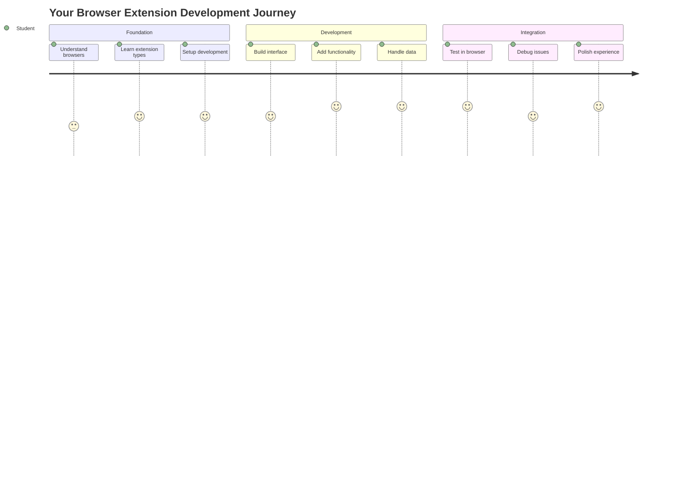
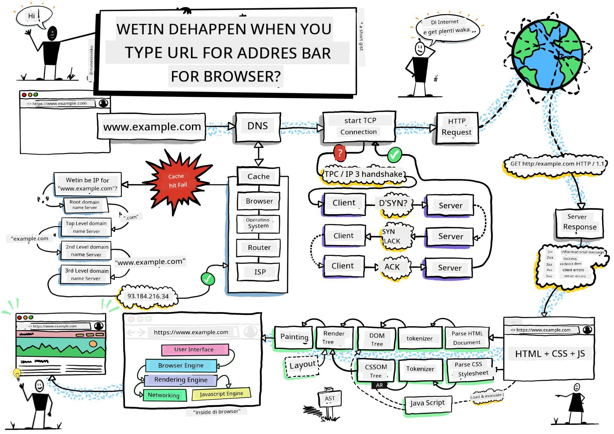
> Sketchnote by [Wassim Chegham](https://dev.to/wassimchegham/ever-wondered-what-happens-when-you-type-in-a-url-in-an-address-bar-in-a-browser-3dob)

## Pre-Lecture Quiz

[Pre-lecture quiz](https://ff-quizzes.netlify.app/web/quiz/23)

### Introduction

Browser extensions na small apps wey dey make your web browsing beta. Like Tim Berners-Lee original plan for interactive web, extensions dey increase the browser power pass just to dey look documents. From password managers wey dey keep your account safe to color pickers wey help designers find correct shades, extensions dey solve wahala wey dey everyday browsing.

Before we build your first extension, make we understand how browsers dey work. Just like Alexander Graham Bell suppose understand how sound dey carry before e invent telephone, to sabi browser basics go help you make extensions wey go join well-well with browser systems.

By the end of this lesson, you go sabi browser architecture and start to build your first extension.

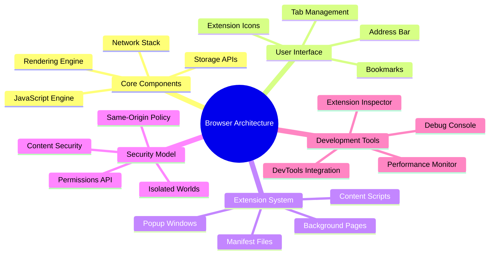
## Understanding Web Browsers

Web browser na correct document interpreter. When you type "google.com" inside address bar, browser go do gbege series of work - e go request content from servers for everywhere, then e go parse am and render dat code into interactive web pages wey you dey see.

This process dey like how first web browser, WorldWideWeb, Tim Berners-Lee design am for 1990 so that everybody fit access hyperlinked documents.

✅ **Small history**: Di first browser na 'WorldWideWeb' an e be Tim Berners-Lee create am for 1990.

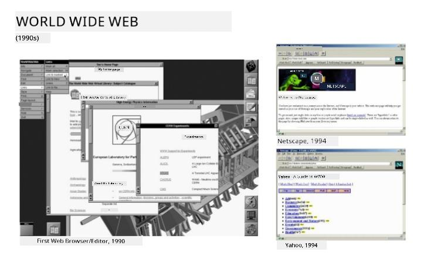
> Some early browsers, via [Karen McGrane](https://www.slideshare.net/KMcGrane/week-4-ixd-history-personal-computing)

### How Browsers Process Web Content

The process between to put URL and see webpage get many steps wey dem arranged nicely, and everything happen in seconds:

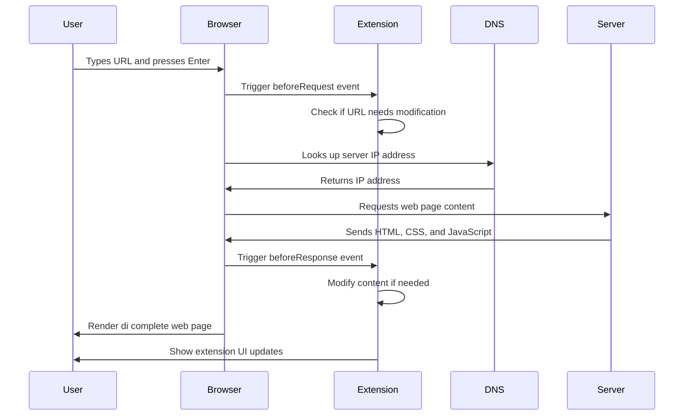
**Dis na wetin dis process dey do:**
- **Translate** human readable URL go server IP address through DNS lookup
- **Set up** secure connection with the web server using HTTP or HTTPS protocols
- **Request** the exact web page content from the server
- **Receive** HTML markup, CSS styling, and JavaScript code from server
- **Render** all di content to interactive web page wey you dey see

### Browser Core Features

Modern browsers get plenty features wey extension developers fit use:

| Feature | Purpose | Extension Opportunities |
|---------|---------|------------------------|
| **Rendering Engine** | Display HTML, CSS, JavaScript | Change content, styling injection |
| **JavaScript Engine** | Run JavaScript code | Custom scripts, API interactions |
| **Local Storage** | Save data local | User preferences, cached data |
| **Network Stack** | Handle web requests | Monitor requests, data analysis |
| **Security Model** | Protect users from bad content | Content filtering, security upgrades |

**To sabi these features go help you:**
- **Know** where your extension fit add the most value
- **Pick** correct browser APIs for your extension work
- **Design** extensions wey dey work well with browser system
- **Make sure** your extension follow browser security best practices

### Cross-Browser Development Considerations

Different browsers dey do standards small-small different, like how different programming languages dey handle algorithm differently too. Chrome, Firefox, and Safari get their own way wey developers must understand as dem develop extensions.

> 💡 **Pro Tip**: Use [caniuse.com](https://www.caniuse.com) to check which web technologies browsers support. Dis thing go help you plan your extension well!

**Important things to remember when developing extensions:**
- **Test** your extension for Chrome, Firefox, and Edge
- **Adjust** to different browser extension APIs and manifest formats
- **Handle** different performance and limits
- **Provide** fallbacks for browser-specific features wey no too dey available

✅ **Analytics Insight**: You fit sabi the browsers wey your users like by installing analytics tools for your web projects. Dis data go help you know which browser to support first.

## Understanding Browser Extensions

Browser extensions dey solve common web browsing problems by adding extra work directly to the browser interface. No need for separate apps or complicated workflow, extensions go give quick access to tools.

Dis idea na like how early computer pioneers like Douglas Engelbart think say technology fit boost wetin humans fit do - extensions go add power to your browser.

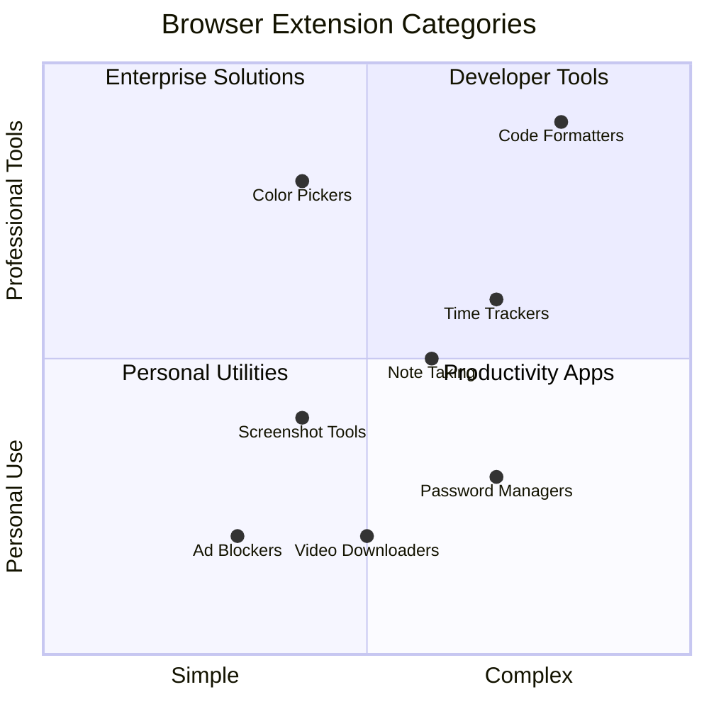
**Popular extension categories and benefits:**
- **Productivity Tools**: Task managers, note-taking apps, time trackers wey dey help you organize
- **Security Enhancements**: Password managers, ad blockers, privacy tools wey protect your data
- **Developer Tools**: Code formatters, color pickers, debugging tools wey make development easier
- **Content Enhancement**: Reading modes, video downloaders, screenshot tools wey improve your web experience

✅ **Reflection Question**: Wetin be your favorite browser extensions? Wetin dem dey do, and how e dey make your browsing better?

### 🔄 **Pedagogical Check-in**
**Browser Architecture Understanding**: Before you start to develop extensions, make sure you:
- ✅ Fit explain how browsers dey process web requests and display content
- ✅ Fit identify main parts for browser architecture
- ✅ Understand how extensions join with browser functions
- ✅ Know security model wey protect users

**Quick Self-Test**: You fit trace the way from when you type URL to when webpage show?
1. **DNS lookup** convert URL go IP address
2. **HTTP request** fetch content from server
3. **Parsing** processes HTML, CSS, JavaScript
4. **Rendering** display final webpage
5. **Extension** fit change content for different steps

## Installing and Managing Extensions

To sabi extension installation process go help you sabi how user experience go be when people dey install your extension. Installation process dey similar for all modern browsers, only small design differences.

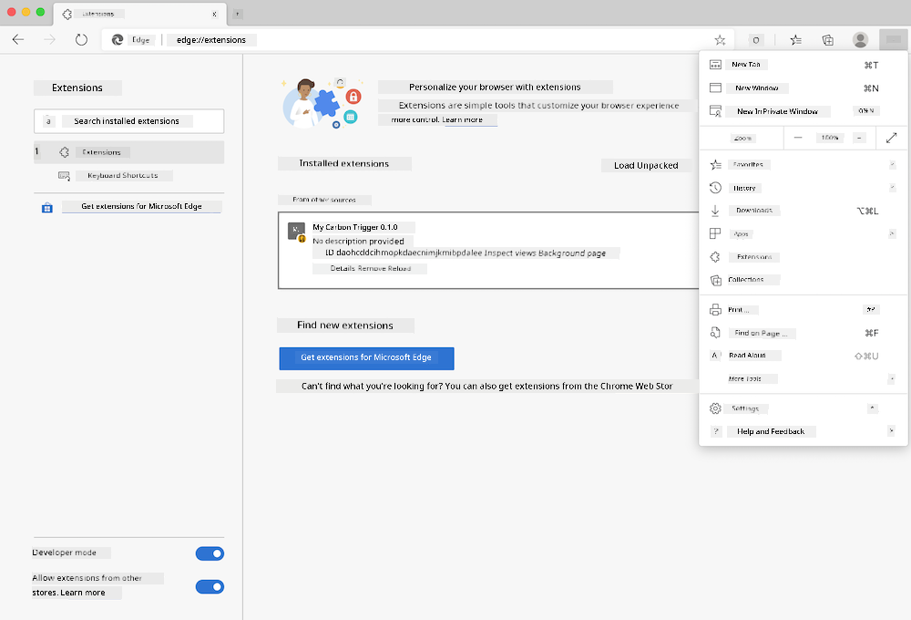

> **Important**: Make sure say developer mode dey on and you allow extensions wey come from other stores when you dey test your own extensions.

### Development Extension Installation Process

When you dey develop and test your own extensions, follow this steps:

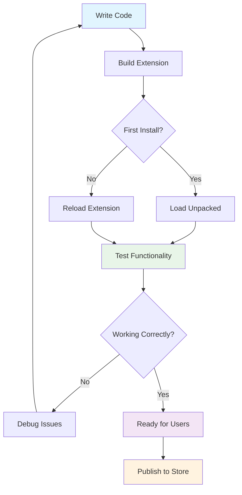
```bash
# Step 1: Make your extension
npm run build
```

**Wetìn dis command dey do:**
- **Compile** your source code into browser ready files
- **Bundle** JavaScript modules into better optimized packages
- **Create** final extension files for `/dist` folder
- **Prepare** your extension for installation and testing

**Step 2: Go Browser Extensions**
1. **Open** your browser extension management page
2. **Click** "Settings and more" button (`...` icon) for top right
3. **Select** "Extensions" from menu

**Step 3: Load Your Extension**
- **For new installs**: Choose `load unpacked` and select your `/dist` folder
- **For updates**: Click `reload` beside your installed extension
- **For testing**: Turn on "Developer mode" to get extra debugging features

### Production Extension Installation

> ✅ **Note**: These development instructions na for extensions wey you dey build yourself. If you want install published extensions, go official browser extension stores like [Microsoft Edge Add-ons store](https://microsoftedge.microsoft.com/addons/Microsoft-Edge-Extensions-Home).

**Understand the difference:**
- **Development install** let you test unpublished extensions as you develop
- **Store install** na vetted, published extensions wey get automatic updates
- **Sideloading** na to install extensions from outside official stores (developer mode must dey on)

## Building Your Carbon Footprint Extension

We go create browser extension wey go show carbon footprint for your region energy use. Dis project show key extension development concepts plus create real tool for environment.

Dis approach follow "learning by doing" principle wey John Dewey education theory dey support - mix technical skills with real-world purpose.

### Project Requirements

Before you start development, make we gather wetin we need:

**Required API Access:**
- **[CO2 Signal API key](https://www.co2signal.com/)**: Put your email to get free API key
- **[Region code](http://api.electricitymap.org/v3/zones)**: Find your region code on [Electricity Map](https://www.electricitymap.org/map) (for example, Boston get 'US-NEISO')

**Development Tools:**
- **[Node.js and NPM](https://www.npmjs.com)**: Package manager tool to install project dependencies
- **[Starter code](../../../../5-browser-extension/start)**: Download `start` folder to start development

✅ **Learn More**: Improve your package management skills with this [comprehensive Learn module](https://docs.microsoft.com/learn/modules/create-nodejs-project-dependencies/?WT.mc_id=academic-77807-sagibbon)

### Understanding the Project Structure

Sabi project structure help organize development work better. Like Library of Alexandria organize knowledge for easy retrieval, well-structured codebase make development faster:

```
project-root/
├── dist/                    # Built extension files
│   ├── manifest.json        # Extension configuration
│   ├── index.html           # User interface markup
│   ├── background.js        # Background script functionality
│   └── main.js              # Compiled JavaScript bundle
├── src/                     # Source development files
│   └── index.js             # Your main JavaScript code
├── package.json             # Project dependencies and scripts
└── webpack.config.js        # Build configuration
```

**Break down wetin each file do:**
- **`manifest.json`**: **Define** extension metadata, permissions, and entry points
- **`index.html`**: **Create** user interface wey show when people click your extension
- **`background.js`**: **Handle** background work and browser event listeners
- **`main.js`**: **Contain** final bundled JavaScript after build
- **`src/index.js`**: **House** your main development code wey go compile into `main.js`

> 💡 **Organization Tip**: Keep your API key and region code for secure note so you fit easily check am during development. You go need am to test extension work.

✅ **Security Note**: No ever commit API keys or sensitive info to code repository. We go show you how to keep am safe later.

## Creating the Extension Interface

Now, we go build user interface parts. The extension get two screens: one for setup and one for result show.

This follow progressive disclosure principle inside interface design since early computers - dey show info and options step by step so no overwhelm user.

### Extension Views Overview

**Setup View** - Configuration for first time user:
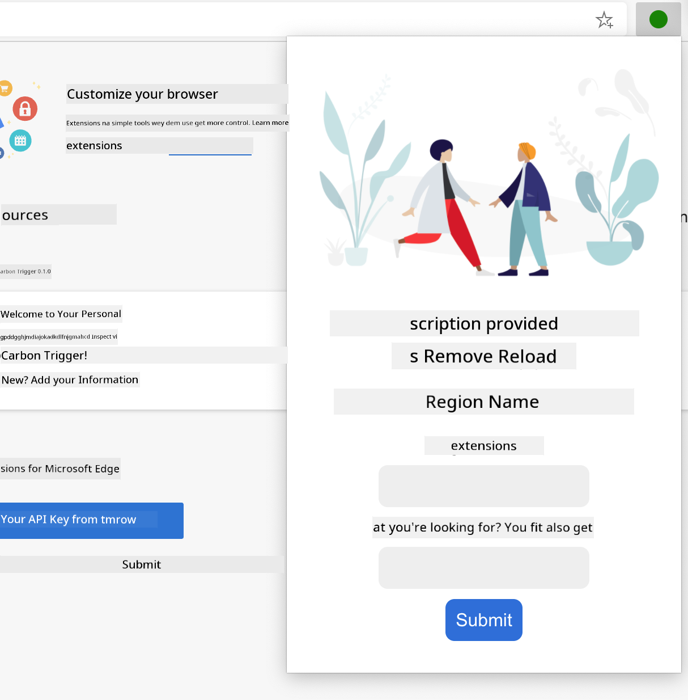

**Results View** - Carbon footprint data display:
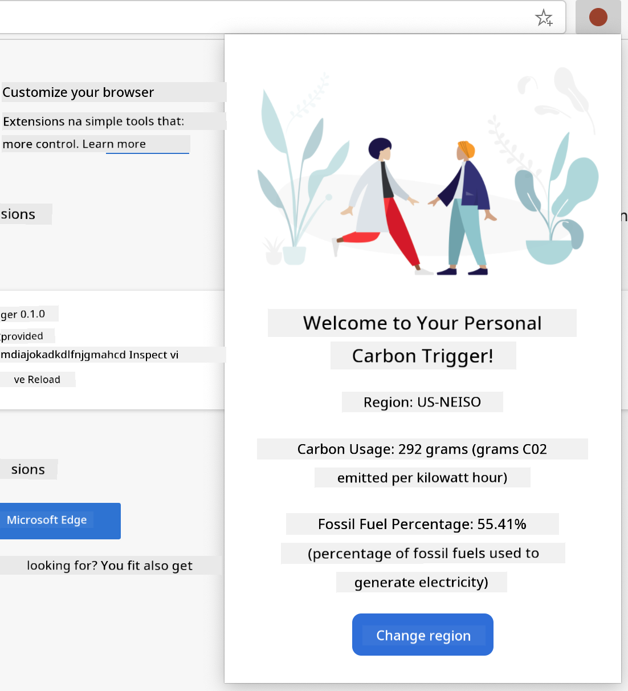

### Building the Configuration Form

Setup form go collect user config data on first use. After you set am, info go remain for browser storage for next times.

For `/dist/index.html` file, add dis form structure:

```html
<form class="form-data" autocomplete="on">
    <div>
        <h2>New? Add your Information</h2>
    </div>
    <div>
        <label for="region">Region Name</label>
        <input type="text" id="region" required class="region-name" />
    </div>
    <div>
        <label for="api">Your API Key from tmrow</label>
        <input type="text" id="api" required class="api-key" />
    </div>
    <button class="search-btn">Submit</button>
</form>
```

**Wetìn dis form dey do:**
- **Create** semantic form with correct labels and input connection
- **Enable** browser autocomplete to make user experience better
- **Require** both fields to fill before submit using `required` attribute
- **Organize** inputs with class names to ease styling and JavaScript access
- **Give** clear instructions to users wey dey set extension first time

### Building the Results Display

Next, create where results go show the carbon footprint data. Add dis HTML below the form:

```html
<div class="result">
    <div class="loading">loading...</div>
    <div class="errors"></div>
    <div class="data"></div>
    <div class="result-container">
        <p><strong>Region: </strong><span class="my-region"></span></p>
        <p><strong>Carbon Usage: </strong><span class="carbon-usage"></span></p>
        <p><strong>Fossil Fuel Percentage: </strong><span class="fossil-fuel"></span></p>
    </div>
    <button class="clear-btn">Change region</button>
</div>
```

**Break down wetin dis place dey provide:**
- **`loading`**: **Show** loading message while API data dey fetch
- **`errors`**: **Show** error messages if API call fail or data no correct
- **`data`**: **Hold** raw data for debugging during development
- **`result-container`**: **Display** formatted carbon footprint info to users
- **`clear-btn`**: **Allow** users change region and reset extension

### Setting Up the Build Process

Now make we install project dependencies and test build process:

```bash
npm install
```

**Wetín dis installation go do:**
- **Download** Webpack and other development dependencies from `package.json`
- **Configure** build tools for compiling modern JavaScript
- **Prepare** development environment to build and test extension
- **Enable** code bundling, optimization, and cross-browser support

> 💡 **Build Process Insight**: Webpack bundle your source code from `/src/index.js` into `/dist/main.js`. Dis process go optimize your code for production and make am compatible with browsers.

### Testing Your Progress

For now, you fit start to test your extension:
1. **Run** di build command to compile ya kode
2. **Load** di extension inside ya browser wit di developer mode
3. **Verify** sey di form dey show well and e fine well well
4. **Check** sey all di form elements line well and dey work

**Wetin you don achieve:**
- **Built** di basic HTML structure for ya extension
- **Created** both configuration and results interfaces with correct semantic markup
- **Set up** modern development workflow using industry-standard tools
- **Prepared** di foundation to add interactive JavaScript functionality

### 🔄 **Pedagogical Check-in**
**Extension Development Progress**: Make sure sey you sabi before you continue:
- ✅ You fit explain di purpose of each file inside di project structure?
- ✅ You understand how di build process dey turn your source code?
- ✅ Why we separate configuration and results into different UI sections?
- ✅ How di form structure dey support both usability and accessibility?

**Development Workflow Understanding**: You suppose fit now to:
1. **Modify** HTML and CSS for ya extension interface
2. **Run** di build command to compile your changes
3. **Reload** di extension inside your browser to test updates
4. **Debug** wahala using browser developer tools

You don finish di first phase of browser extension development. Just like how Wright brothers first gats understand aerodynamics before dem fit fly, understanding dis basic kind concept dey prepare you to build more complex interactive features for the next lesson.

## GitHub Copilot Agent Challenge 🚀

Use di Agent mode to finish di following challenge:

**Description:** Make di browser extension beta by adding form validation and user feedback features to better di user experience when dem dey put API keys and region codes.

**Prompt:** Create JavaScript validation functions wey go check if di API key field get at least 20 characters and if di region code follow the correct format (like 'US-NEISO'). Add visual feedback by changing input border colors to green if valid and red if no correct. Make you also add toggle feature to show/hide di API key for security reasons.

Find out more about [agent mode](https://code.visualstudio.com/blogs/2025/02/24/introducing-copilot-agent-mode) here.

## 🚀 Challenge

Make you check one browser extension store and install one for your browser. You fit check im files in interesting way. Wetin you discover?

## Post-Lecture Quiz

[Post-lecture quiz](https://ff-quizzes.netlify.app/web/quiz/24)

## Review & Self Study

For dis lesson you learn small about di history of web browser; take dis chance to learn how di inventors of di World Wide Web see how people go use am by reading more about di history. Some sites wey fit help include:

[The History of Web Browsers](https://www.mozilla.org/firefox/browsers/browser-history/)

[History of the Web](https://webfoundation.org/about/vision/history-of-the-web/)

[An interview with Tim Berners-Lee](https://www.theguardian.com/technology/2019/mar/12/tim-berners-lee-on-30-years-of-the-web-if-we-dream-a-little-we-can-get-the-web-we-want)

### ⚡ **Wetin You Fit Do for Next 5 Minutes**
- [ ] Open Chrome/Edge extensions page (chrome://extensions) and explore wetin you get for your browser
- [ ] Look your browser DevTools Network tab as you dey load webpage
- [ ] Try see page source (Ctrl+U) to check HTML structure
- [ ] Inspect any webpage element and change im CSS inside DevTools

### 🎯 **Wetin You Fit Achieve Dis Hour**
- [ ] Finish di post-lesson quiz and sabi browser fundamentals
- [ ] Create basic manifest.json file for browser extension
- [ ] Build simple "Hello World" extension wey go show popup
- [ ] Test loading your extension for developer mode
- [ ] Explore di browser extension documentation for your target browser

### 📅 **Your Week-Long Extension Journey**
- [ ] Finish functional browser extension wey get real use
- [ ] Learn about content scripts, background scripts, and popup interactions
- [ ] Master browser APIs like storage, tabs, and messaging
- [ ] Design user-friendly interfaces for your extension
- [ ] Test your extension on different websites and scenarios
- [ ] Publish your extension to the browser extension store

### 🌟 **Your Month-Long Browser Development**
- [ ] Build many extensions wey solve different user problems
- [ ] Learn advanced browser APIs and correct security ways
- [ ] Contribute to open source browser extension projects
- [ ] Master cross-browser compatibility and progressive enhancement
- [ ] Create extension development tools and templates for other people to use
- [ ] Become browser extension expert wey fit help other developers

## 🎯 Your Browser Extension Mastery Timeline

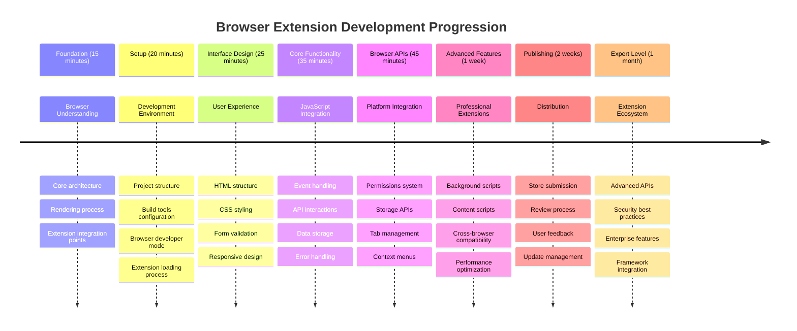
### 🛠️ Your Extension Development Toolkit Summary

After you finish dis lesson, you now get:
- **Browser Architecture Knowledge**: You sabi rendering engines, security models, and extension integration
- **Development Environment**: Modern tools like Webpack, NPM, and debugging
- **UI/UX Foundation**: Semantic HTML structure with progressive disclosure patterns
- **Security Awareness**: You know browser permissions and how to develop safely
- **Cross-Browser Concepts**: You sabi compatibility and testing approach
- **API Integration**: Foundation to work with external data
- **Professional Workflow**: Industry-standard development and testing methods

**Real-World Applications**: These skills good for:
- **Web Development**: Single-page applications and progressive web apps
- **Desktop Applications**: Electron and web-based desktop software
- **Mobile Development**: Hybrid apps and web-based mobile solutions
- **Enterprise Tools**: Internal productivity apps and workflow automation
- **Open Source**: Contributing to browser extension projects and web standards

**Next Level**: You ready to add interactive features, work with browser APIs, and create extensions wey go solve real user wahala!

## Assignment 

[Restyle your extension](assignment.md)

---

<!-- CO-OP TRANSLATOR DISCLAIMER START -->
**Disclaimer**: Dis document don translate wit AI translation service wey dem call [Co-op Translator](https://github.com/Azure/co-op-translator). Even though we dey try make everything correct, abeg make you sabi say automatic translation fit get wahala or mistake. Di original document for im own language na im get di real correct tin. If na important information, better make professional human translation do am. We no go responsible for any yawa or wrong understanding wey fit happen because of dis translation.
<!-- CO-OP TRANSLATOR DISCLAIMER END -->