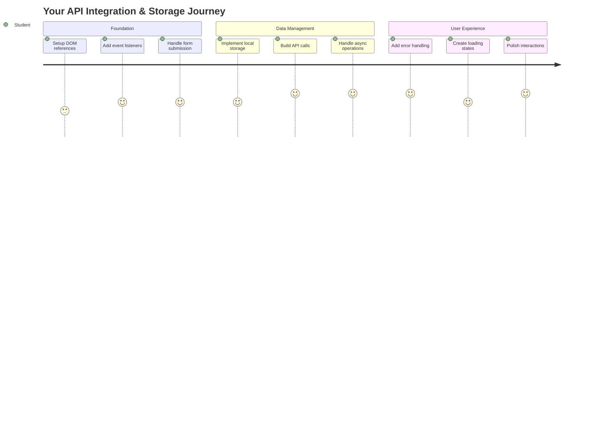
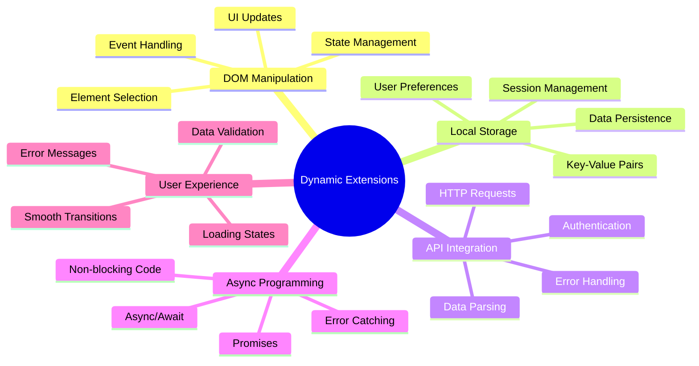
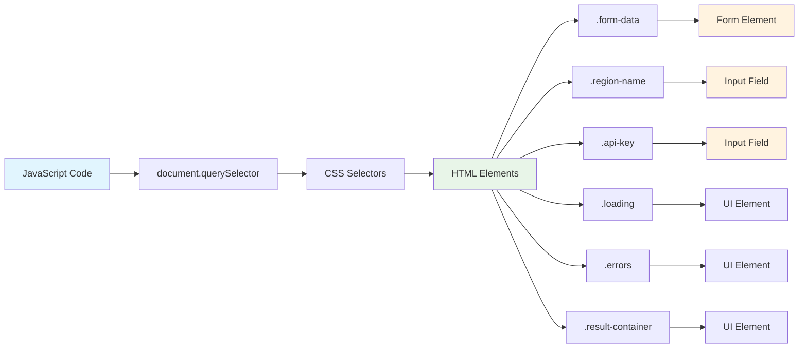
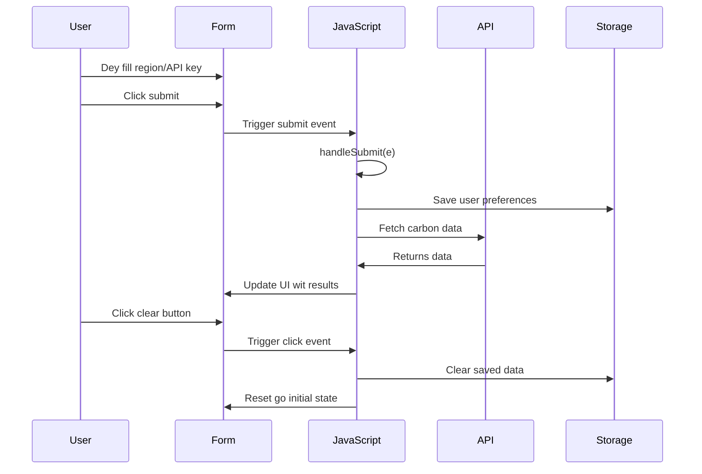
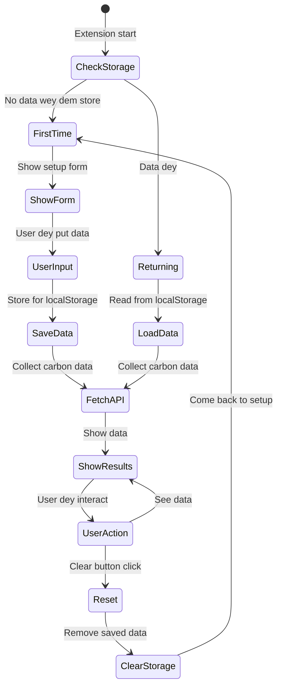
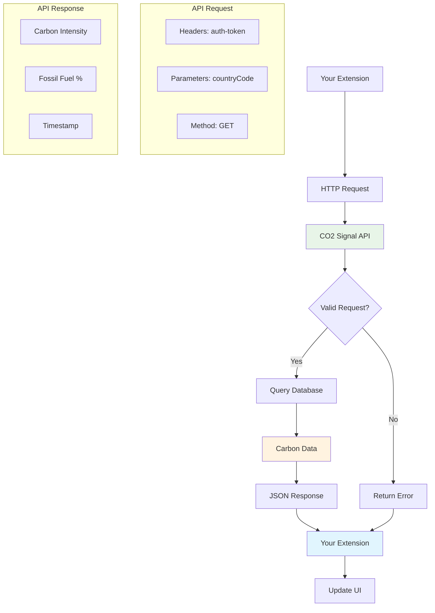
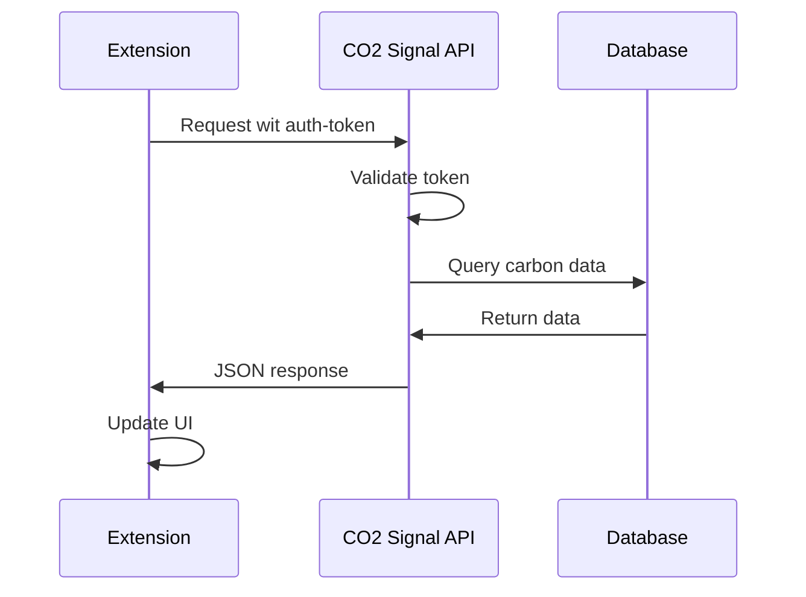
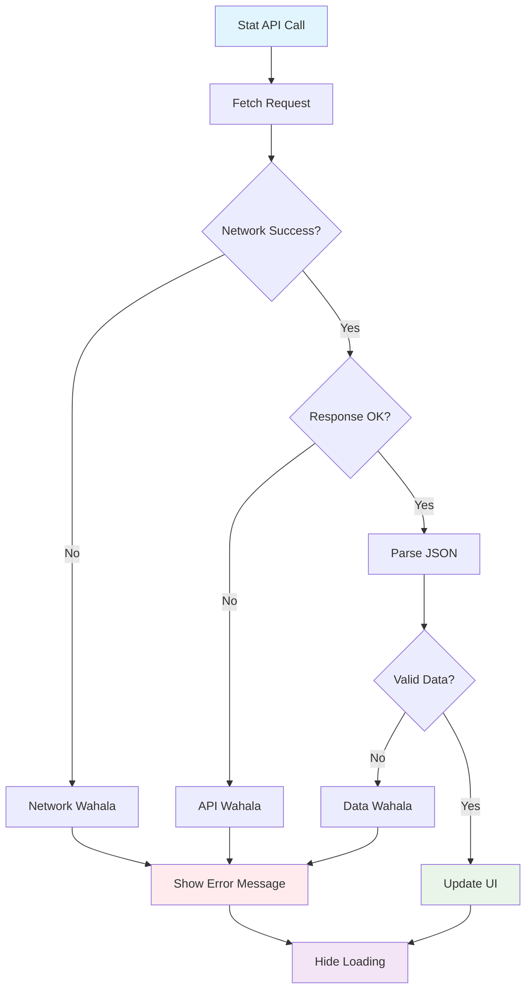
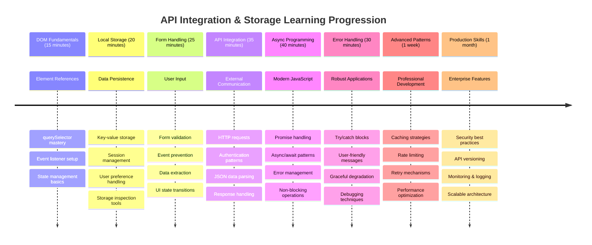

<!--
CO_OP_TRANSLATOR_METADATA:
{
  "original_hash": "2b6203a48c48d8234e0948353b47d84e",
  "translation_date": "2026-01-08T15:03:33+00:00",
  "source_file": "5-browser-extension/2-forms-browsers-local-storage/README.md",
  "language_code": "pcm"
}
-->
# Browser Extension Project Part 2: Call an API, use Local Storage


## Pre-Lecture Quiz

[Pre-lecture quiz](https://ff-quizzes.netlify.app/web/quiz/25)

## Introduction

Remember dat browser extension wey you start build? Right now you get one beta form wey fine, but e just dey static. Today we go make am come alive by connect am to real data and give am memory.

Think about di Apollo mission control computers - dem no just dey show fixed information. Dem dey always relate wit spacecrafts, dey update wit telemetry data, and dem dey remember important mission parameters. Na dis kain dynamic behavior we dey build today. Your extension go reach out to internet, gather real environmental data, and remember your settings for next time.

API integration fit sound hard, but na just teaching your code how e go yan wit other services be dat. Whether you dey fetch weather data, social media feeds, or carbon footprint info like we go do today, na all about to make dis digital connections. We go also explore how browsers fit keep information - like how libraries take use card catalogs to remember where book dem dey.

By di end of dis lesson, you go get browser extension wey dey fetch real data, dey store user preferences, and dey provide smooth experience. Make we begin!


✅ Follow di numbered segments for di correct files to sabi where to put your code

## Set up the elements to manipulate for di extension

Before your JavaScript fit manipulate di interface, e need references to specific HTML elements. Think am like telescope wey e need point for certain stars - before Galileo fit study Jupiter moons, e gats locate and focus for Jupiter itself.

For your `index.js` file, we go create `const` variables wey go capture references to every important form element. Dis one be like how scientists dey label their equipment - instead to dey find everywhere for di laboratory every time, dem fit just access wetin dem need straight.


```javascript
// form filds
const form = document.querySelector('.form-data');
const region = document.querySelector('.region-name');
const apiKey = document.querySelector('.api-key');

// resalts
const errors = document.querySelector('.errors');
const loading = document.querySelector('.loading');
const results = document.querySelector('.result-container');
const usage = document.querySelector('.carbon-usage');
const fossilfuel = document.querySelector('.fossil-fuel');
const myregion = document.querySelector('.my-region');
const clearBtn = document.querySelector('.clear-btn');
```

**Na wetin dis code dey do:**
- **Captures** form elements using `document.querySelector()` wit CSS class selectors
- **Creates** references to input fields for di region name and API key
- **Establishes** connections to result display elements for carbon usage data
- **Sets up** access to UI elements like loading indicators and error messages
- **Stores** each element reference inside `const` variable to make am easy to use everywhere for your code

## Add event listeners

Now we go make your extension respond to wetin user dey do. Event listeners na how your code dey monitor user actions. Think dem like telephone operators wey dey early exchanges - dem dey listen for incoming calls then dem go connect di correct circuits when pesin want make connection.


```javascript
form.addEventListener('submit', (e) => handleSubmit(e));
clearBtn.addEventListener('click', (e) => reset(e));
init();
```

**Make you sabi dis concepts:**
- **Attaches** submit listener to form wey go trigger when users press Enter or click submit
- **Connects** click listener to clear button to reset form
- **Passes** di event object `(e)` to handler functions for extra control
- **Calls** di `init()` function immediately to arrange initial setup of your extension

✅ Note di shorthand arrow function syntax wey dey used for here. Dis modern JavaScript way dey clean pass old school function expression, but both still dey work well!

### 🔄 **Pedagogical Check-in**
**Event Handling Understanding**: Before you start initialization, make sure say you fit:
- ✅ Explain how `addEventListener` dey connect user actions to JavaScript functions
- ✅ Understand why we dey pass event object `(e)` to handler functions
- ✅ Know difference between `submit` and `click` events
- ✅ Describe when `init()` function go run and why

**Quick Self-Test**: Wetin go happen if you forget `e.preventDefault()` when form submit?
*Answer: The page go reload, all JavaScript state go lost, and user experience go stop*

## Build di initialization and reset functions

Make we write the initialization logic for your extension. Di `init()` function na like ship navigation system wey dey check instruments - e dey find current state and change interface based on dat. E dey check if pesin don use your extension before and e load their previous settings.

Di `reset()` function na to give users fresh start - like how scientists dey reset instruments between experiments to get clean data.

```javascript
function init() {
	// Check if user don save API credentials before
	const storedApiKey = localStorage.getItem('apiKey');
	const storedRegion = localStorage.getItem('regionName');

	// Set extension icon to general green (placeholder for next lesson)
	// TODO: Make icon update for next lesson

	if (storedApiKey === null || storedRegion === null) {
		// First-time user: show di setup form
		form.style.display = 'block';
		results.style.display = 'none';
		loading.style.display = 'none';
		clearBtn.style.display = 'none';
		errors.textContent = '';
	} else {
		// Returning user: load dia saved data automatically
		displayCarbonUsage(storedApiKey, storedRegion);
		results.style.display = 'none';
		form.style.display = 'none';
		clearBtn.style.display = 'block';
	}
}

function reset(e) {
	e.preventDefault();
	// Clear stored region make user fit pick new location
	localStorage.removeItem('regionName');
	// Restart di initialization process
	init();
}
```

**Wetin dey happen here:**
- **Retrieves** stored API key and region from browser local storage
- **Checks** if na first-time user (no stored credentials) or na returning user
- **Shows** setup form for new users and hide other interface elements
- **Loads** saved data automatically for returning users and shows reset option
- **Manages** user interface state based on data wey available

**Key tori about Local Storage:**
- **Persists** data between browser sessions (no be like session storage)
- **Stores** data as key-value pairs using `getItem()` and `setItem()`
- **Returns** `null` if no data dey for di key
- **Provides** simple way to remember user preferences and settings

> 💡 **Understanding Browser Storage**: [LocalStorage](https://developer.mozilla.org/docs/Web/API/Window/localStorage) na like to give your extension persistent memory. Think how ancient Library of Alexandria dey store scrolls - information still dey available even if scholars comot then come back.
>
> **Main tori be:**
> - **Persists** data even after you close your browser
> - **Survives** computer restart and browser crash
> - **Provides** big storage space for user preferences
> - **Offers** quick access without network wahala

> **Important Note**: Your browser extension get im own isolated local storage wey separate from normal web pages. Dis one dey keep am secure and prevent conflict wit other websites.

You fit see your stored data by opening browser Developer Tools (F12), go **Application** tab, then expand **Local Storage** section.




> ⚠️ **Security Consideration**: For production apps, to store API keys for LocalStorage fit cause security risks since JavaScript fit access dis data. For learning, dis way good, but real apps suppose use secure server-side storage for sensitive credentials.

## Handle form submission

Now make we manage wetin dey happen when pesin submit your form. By default, browsers dey reload page when forms submit, but we go stop dis to make experience smooth.

Dis one be like how mission control dey handle spacecraft communication - no be to reset everything for each time, dem just dey run continuously while dem dey process new info.

Make a function wey go capture form submission event and collect wetin user put:

```javascript
function handleSubmit(e) {
	e.preventDefault();
	setUpUser(apiKey.value, region.value);
}
```

**For di code above, we:**
- **Prevents** default form submission wey go refresh page
- **Extracts** user input from API key and region fields
- **Passes** form data go `setUpUser()` function for processing
- **Maintains** single-page app behavior by no reload page

✅ Remember say your HTML form fields get `required` attribute, so browser go check say user put both API key and region before dis function go run.

## Set up user preferences

Di `setUpUser` function dey responsible to save user credentials and to start di first API call. Dis one na to make smooth transition from setup to showing results.

```javascript
function setUpUser(apiKey, regionName) {
	// Save di user credentials for future sessions
	localStorage.setItem('apiKey', apiKey);
	localStorage.setItem('regionName', regionName);
	
	// Update UI to show say e dey load
	loading.style.display = 'block';
	errors.textContent = '';
	clearBtn.style.display = 'block';
	
	// Fetch carbon usage data wit di user's credentials
	displayCarbonUsage(apiKey, regionName);
}
```

**Step by step, wetin dey happen:**
- **Saves** API key and region name for local storage to use for future
- **Shows** loading indicator to tell user say data dey fetch
- **Clears** any error messages wey dey before
- **Reveals** clear button make users fit reset their settings later
- **Starts** API call to fetch real carbon usage data

Dis function dey create smooth user experience by dey manage both data persistence and UI update for one go.

## Display carbon usage data

Now we go connect your extension to outside data sources through APIs. Dis one go turn your extension from standalone tool to something wey fit access real-time info from internet.

**Understanding APIs**

[APIs](https://www.webopedia.com/TERM/A/API.html) na how different apps dey yan to each other. Think am like telegraph system wey connect far towns for 19th century - operators go send requests to far stations and receive answers wit requested info. Anytime you check social media, ask voice assistant question, or use delivery app, na APIs dey facilitate dis data exchange.


**Key tori about REST APIs:**
- **REST** mean 'Representational State Transfer'
- **Uses** standard HTTP methods (GET, POST, PUT, DELETE) to waka wit data
- **Returns** data for predictable formats, mostly JSON
- **Provides** steady, URL-based endpoints for different requests

✅ Di [CO2 Signal API](https://www.co2signal.com/) wey we go use dey supply real-time carbon intensity data from electrical grids worldwide. Dis one dey help users understand how dem electricity use dey affect environment!

> 💡 **Understanding Asynchronous JavaScript**: Di [`async` keyword](https://developer.mozilla.org/docs/Web/JavaScript/Reference/Statements/async_function) make your code fit do many operations at once. When you dey request data from server, you no want say your whole extension go hang - dat one go be like air traffic control stop all work as e dey wait for one plane.

>
> **Key benefits:**
> - **Keep** extension dey respond while data dey load
> - **Allow** other code to continue during network requests
> - **Make** code easy to read pass old callback style
> - **Help** handle errors well during network waka

Here be quick video about `async`:

[](https://youtube.com/watch?v=YwmlRkrxvkk "Async and Await for managing promises")

> 🎥 Click di picture on top for video about async/await.

### 🔄 **Pedagogical Check-in**
**Async Programming Understanding**: Before you start API function, make sure say you sabi:
- ✅ Why we dey use `async/await` no be to block di whole extension
- ✅ How `try/catch` dey handle network wahala well
- ✅ Difference between synchronous and asynchronous operations
- ✅ Why API calls fit fail and how to manage dis failures

**Real-World Connection**: Think about dis async examples:
- **Ordering food**: You no just dey wait for kitchen - you get receipt then continue other things
- **Sending emails**: Your email app no freeze while sending - you fit write more emails
- **Loading web pages**: Images dey load slow-slow while you fit already read text

**API Authentication Flow**:

Make function to fetch and show carbon usage data:

```javascript
// Modern fetch API way (no need external dependencies)
async function displayCarbonUsage(apiKey, region) {
	try {
		// Fetch carbon intensity data from CO2 Signal API
		const response = await fetch('https://api.co2signal.com/v1/latest', {
			method: 'GET',
			headers: {
				'auth-token': apiKey,
				'Content-Type': 'application/json'
			},
			// Add query parameters for the particular region
			...new URLSearchParams({ countryCode: region }) && {
				url: `https://api.co2signal.com/v1/latest?countryCode=${region}`
			}
		});

		// Check if the API request dey successful
		if (!response.ok) {
			throw new Error(`API request failed: ${response.status}`);
		}

		const data = await response.json();
		const carbonData = data.data;

		// Calculate rounded carbon intensity value
		const carbonIntensity = Math.round(carbonData.carbonIntensity);

		// Update the user interface with di fetched data
		loading.style.display = 'none';
		form.style.display = 'none';
		myregion.textContent = region.toUpperCase();
		usage.textContent = `${carbonIntensity} grams (grams CO₂ emitted per kilowatt hour)`;
		fossilfuel.textContent = `${carbonData.fossilFuelPercentage.toFixed(2)}% (percentage of fossil fuels used to generate electricity)`;
		results.style.display = 'block';

		// TODO: calculateColor(carbonIntensity) - go implement am for next lesson

	} catch (error) {
		console.error('Error fetching carbon data:', error);
		
		// Show user-friendly error message
		loading.style.display = 'none';
		results.style.display = 'none';
		errors.textContent = 'Sorry, we couldn\'t fetch data for that region. Please check your API key and region code.';
	}
}
```

**Wetin dey happen here:**
- **Uses** modern `fetch()` API no use external libraries like Axios make code clean and no need dependencies
- **Implements** correct error checking with `response.ok` to catch API failure quick
- **Handles** async operation with `async/await` make code easy to read
- **Authenticates** wit CO2 Signal API using `auth-token` header
- **Parses** JSON data and take carbon intensity info
- **Updates** many UI elements wit formatted environment data
- **Shows** user-friendly error messages when API call fail

**Key modern JavaScript tori wey e show:**
- **Template literals** wit `${}` syntax to format strings cleanly
- **Error handling** wit try/catch block for robust apps
- **Async/await** pattern to handle network requests well
- **Object destructuring** to take specific data from API response
- **Method chaining** to do many DOM changes smooth

✅ Dis function dey show many important web dev skills - how to talk wit server, handle authentication, process data, update interface, and manage error well. Dis na core skill wey pro developers dey use every day.


### 🔄 **Pedagogical Check-in**
**Complete System Understanding**: Make sure you sabi full flow:
- ✅ How DOM references help JavaScript control interface
- ✅ Why local storage dey create persistence between browser session
- ✅ How async/await dey make API calls without freeze extension
- ✅ Wetin happen if API call fail and how to handle errors
- ✅ Why user experience get loading states and error messages

🎉 **Wetin you don do:** You don create browser extension wey:
- **Connects** to internet and get real environmental data
- **Persists** user settings between sessions
- **Handles** errors well no be to crash
- **Provides** smooth and professional user experience

Test your work by running `npm run build` and refresh your extension for browser. Now you get working carbon footprint tracker. Next lesson go add dynamic icon functionality to complete di extension.

---

## GitHub Copilot Agent Challenge 🚀

Use Agent mode to complete dis challenge:
**Description:** Make the browser extension beta by adding beta beta for error handling and better user experience features. This challenge go help you sabi how to work with APIs, local storage, and DOM manipulation using modern JavaScript style.

**Prompt:** Create better version of displayCarbonUsage function wey get: 1) Retry mechanism for API call wey fail with exponential backoff, 2) Check make sure say region code correct before you call API, 3) Loading animation with progress signs, 4) Cache API responses for localStorage with expiry time (cache for 30 minutes), and 5) Show historical data from previous API calls. Add correct TypeScript-style JSDoc comments to explain all function parameters and return types.

Learn more about [agent mode](https://code.visualstudio.com/blogs/2025/02/24/introducing-copilot-agent-mode) here.

## 🚀 Challenge

Make your understanding of APIs big by exploring beta beta browser-based APIs wey dey for web development. Choose one browser API and build small demonstration:

- [Geolocation API](https://developer.mozilla.org/docs/Web/API/Geolocation_API) - Get user current location
- [Notification API](https://developer.mozilla.org/docs/Web/API/Notifications_API) - Send desktop notifications
- [HTML Drag and Drop API](https://developer.mozilla.org/docs/Web/API/HTML_Drag_and_Drop_API) - Create interactive drag interfaces
- [Web Storage API](https://developer.mozilla.org/docs/Web/API/Web_Storage_API) - Advanced local storage techniques
- [Fetch API](https://developer.mozilla.org/docs/Web/API/Fetch_API) - Modern alternative to XMLHttpRequest

**Research questions to consider:**
- Wetin real-world problem dis API fit solve?
- How API dey handle errors and edge cases?
- Wetin be security things wey you for sabi when you dey use dis API?
- How many browsers dey support dis API?

After your research, find out wetin make API developer-friendly and reliable.

## Post-Lecture Quiz

[Post-lecture quiz](https://ff-quizzes.netlify.app/web/quiz/26)

## Review & Self Study

You don learn about LocalStorage and APIs for this lesson, both very useful for professional web developer. Fit you think how these two things go work together? Think how you go plan web site wey go save things for API use.

### ⚡ **Wetyn You Fit Do for Next 5 Minutes**
- [ ] Open DevTools Application tab and check localStorage for any website
- [ ] Create simple HTML form and test form validation for browser
- [ ] Try save and collect data using localStorage for browser console
- [ ] Check form data wey dey submit using Network tab

### 🎯 **Wetyn You Fit Finish This Hour**
- [ ] Finish post-lesson quiz and understand form handling ideas
- [ ] Build browser extension form wey go save user preferences
- [ ] Make client-side form validation with correct error messages
- [ ] Practice using chrome.storage API for extension data saving
- [ ] Create user interface wey respond to saved user settings

### 📅 **Your Week-Long Extension Building**
- [ ] Finish full browser extension with form function
- [ ] Master different storage ways: local, sync, and session storage
- [ ] Add advanced form features like autocomplete and validation
- [ ] Add import/export function for user data
- [ ] Test your extension well well across different browsers
- [ ] Make your extension user experience and error handling beta

### 🌟 **Your Month-Long Web API Mastery**
- [ ] Build complex app using different browser storage APIs
- [ ] Learn offline-first development pattern
- [ ] Contribute to open source projects about data saving
- [ ] Master privacy-focused development and GDPR compliance
- [ ] Create reusable libraries for form handling and data management
- [ ] Share knowledge about web APIs and extension development

## 🎯 Your Extension Development Mastery Timeline


### 🛠️ Your Full-Stack Development Toolkit Summary

After you finish this lesson, you now get:
- **DOM Mastery**: Sharp element targeting and manipulation
- **Storage Expertise**: Persistent data management with localStorage
- **API Integration**: Real-time data fetching and authentication
- **Async Programming**: Non-blocking work with modern JavaScript
- **Error Handling**: Strong apps wey fit handle failure well
- **User Experience**: Loading states, validation, and smooth interactions
- **Modern Patterns**: fetch API, async/await, and ES6+ features

**Professional Skills We You Fit Get**: You don use patterns for:
- **Web Applications**: Single-page apps with external data sources
- **Mobile Development**: API-driven app with offline abilities
- **Desktop Software**: Electron apps with persistent storage
- **Enterprise Systems**: Authentication, caching, and error handling
- **Modern Frameworks**: React/Vue/Angular data management patterns

**Next Level**: You don ready to explore advanced topics like caching strategies, real-time WebSocket connections, or complex state management!

## Assignment

[Adopt an API](assignment.md)

---

<!-- CO-OP TRANSLATOR DISCLAIMER START -->
**Disclaimer**:
Dis document don translate wit AI translation service [Co-op Translator](https://github.com/Azure/co-op-translator). Even though we try make e correct, abeg remember say automatic translation fit get some mistake or no too correct. Di original document wey e dey for im own language na di correct one wey you suppose trust. For important information, na professional human translation dem recommend. We no go responsible if person misunderstand or misinterpret anything wey come from dis translation.
<!-- CO-OP TRANSLATOR DISCLAIMER END -->