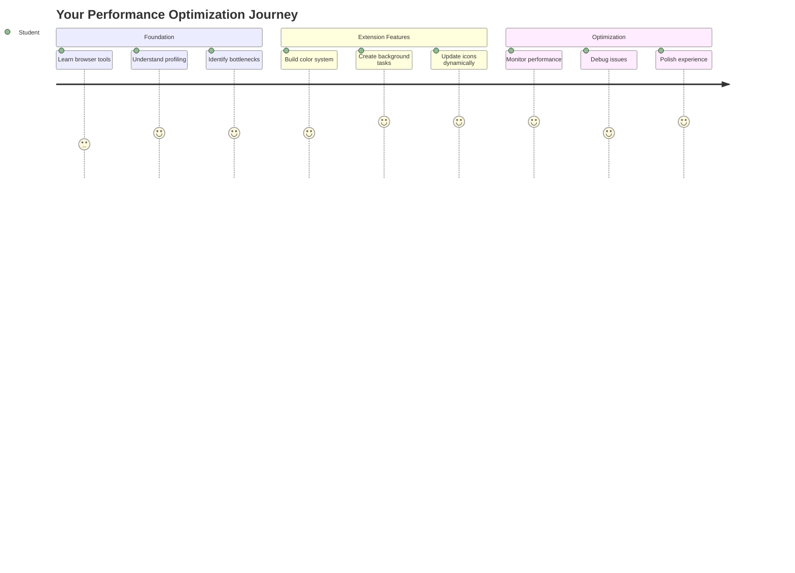
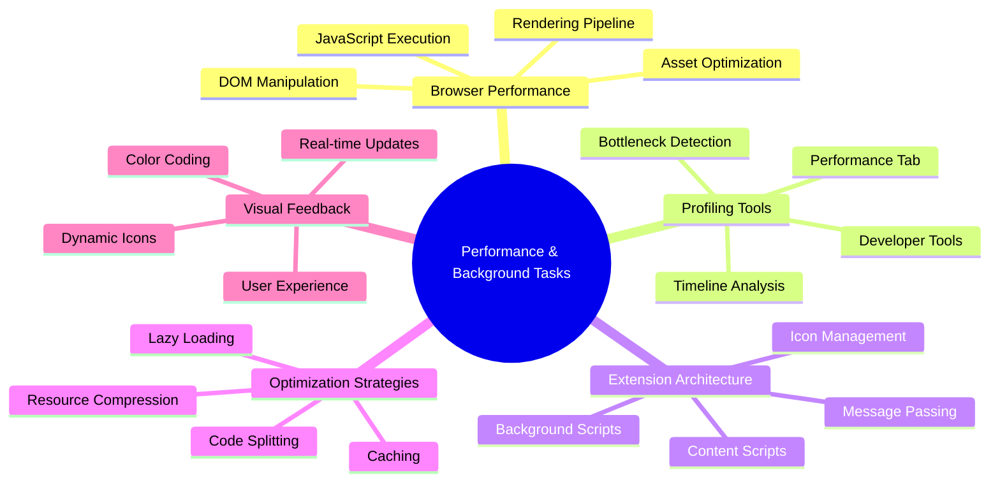
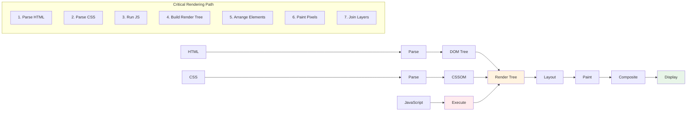
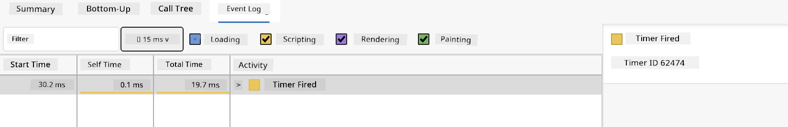
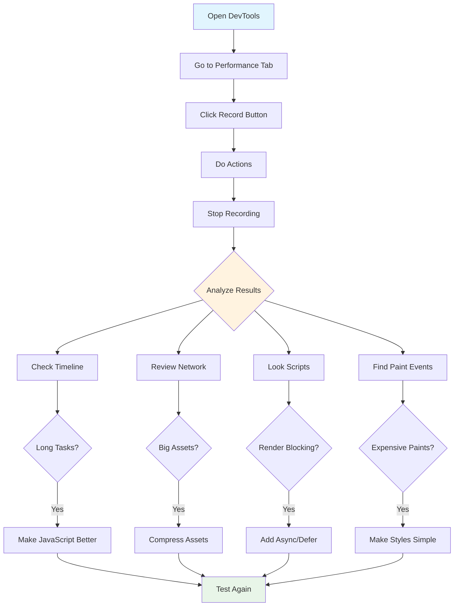
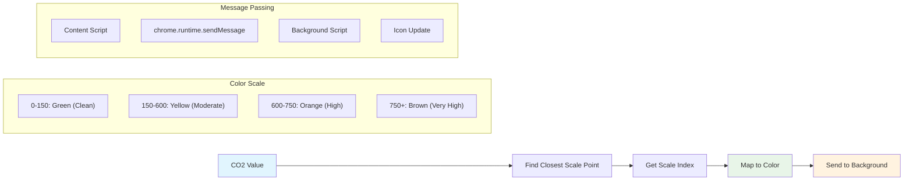
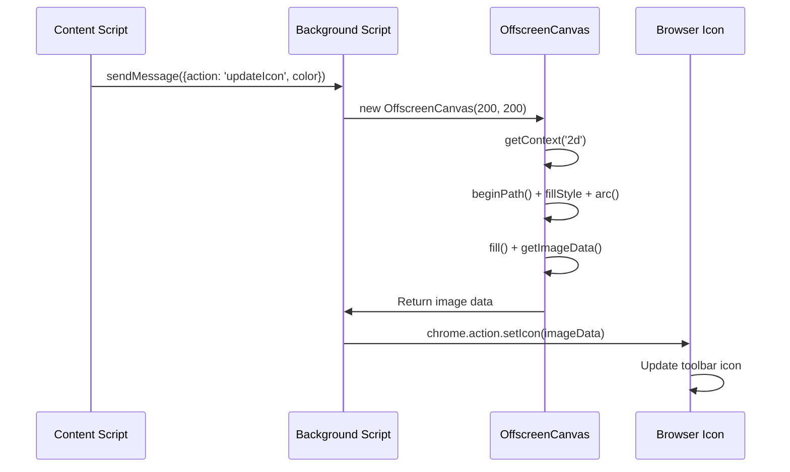
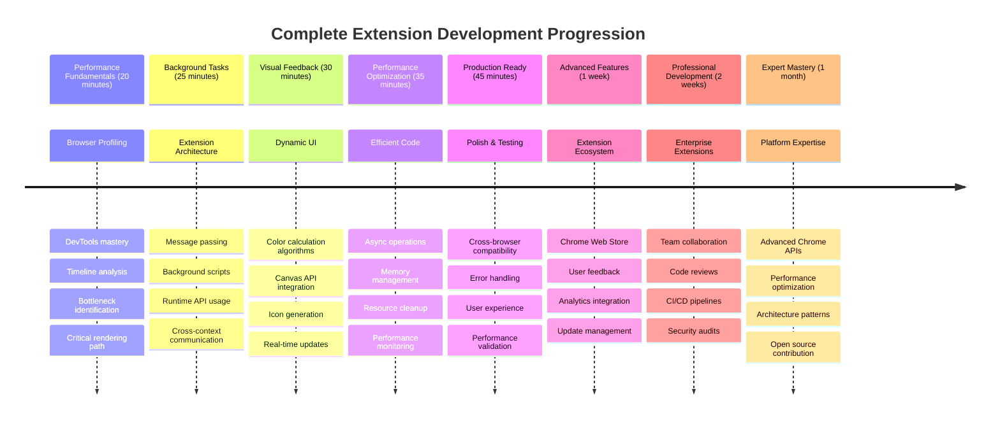

# Browser Extension Project Part 3: Learn about Background Tasks and Performance


You don waka ever wonder why some browser extensions dey feel sharp and responsive while others dey slow slow? Di koko na wetin dey happen for background. As users dey click tins for your extension interface, e get plenty background processes wey dey quietly manage data fetching, icon updates, and system resources.

Dis na di last lesson for di browser extension series, and we go make your carbon footprint tracker work smooth. You go add dynamic icon updates and learn how to see performance wahala before e become problem. E dey like tuning race car - small tinkerings fit make big difference for how everything dey run.

By di time we finish, you go get polished extension and sabi di performance principles wey separate good web apps from better ones. Make we dive enter di world of browser optimization.

## Pre-Lecture Quiz

[Pre-lecture quiz](https://ff-quizzes.netlify.app/web/quiz/27)

### Introduction

For our previous lessons, you don build form, connect am to API, and handle asynchronous data fetching. Your extension dey form well.

Now we need to add di last touches - like making di extension icon change color based on di carbon data. Dis remind me how NASA for optimize every system for Apollo spacecraft. Dem no fit waste any cycles or memory because lives depend on performance. Even tho our browser extension no too critical like dat, di same principles still dey apply - efficient code dey make better user experiences.


## Web Performance Basics

When your code dey run efficiently, people fit *feel* di difference. You sabi dat moment when page load straight-away or animation flow smooth? Na good performance dey work.

Performance no be only about speed - e mean say web experiences go dey natural and no go be clunky or frustrating. For early days of computing, Grace Hopper hold nanosecond (wire wey about one foot long) for her desk to show how far light fit travel inside one billionth of second. That na her way to explain why every microsecond matter for computing. Make we explore the detective tools wey fit help you see wetin dey slow things down.

> "Website performance na about two tins: how fast di page load, and how fast di code for am dey run." -- [Zack Grossbart](https://www.smashingmagazine.com/2012/06/javascript-profiling-chrome-developer-tools/)

Di topic on how to make your websites dey blazing fast for all kain devices, all kain users, and all kain situations, e big. Here some points to keep for mind as you dey build standard web project or browser extension.

Di first step for optimizing your site na to sabi wetin really dey happen under di hood. Luckily, your browser get powerful detective tools inside.


To open Developer Tools for Edge, click di three dots for top right corner, then go More Tools > Developer Tools. Or you fit use keyboard shortcut: `Ctrl` + `Shift` + `I` for Windows or `Option` + `Command` + `I` for Mac. Once you dey there, click Performance tab - na there you go do your investigation.

**Here your performance detective toolkit:**
- **Open** Developer Tools (you go dey use am well well as developer!)
- **Go** Performance tab - think am like your web app fitness tracker
- **Press** that Record button and watch your page dey do tins
- **Check** di results to see wetin dey slow things down

Make we try am. Open website (Microsoft.com good for this) and click 'Record' button. Now refresh di page and watch di profiler record everything wey dey happen. When you stop recording, you go see detailed breakdown of how browser 'scripts', 'renders', and 'paints' di site. E dey remind me how mission control dey monitor every system during rocket launch - you go get real-time data on exactly wetin dey happen and when.


✅ Di [Microsoft Documentation](https://docs.microsoft.com/microsoft-edge/devtools-guide/performance/?WT.mc_id=academic-77807-sagibbon) get plenty details if you wan deep dive

> Pro tip: Clear your browser cache before testing to see how your site perform for first-time visitors - e normally different from repeat visits!

Select elements for profile timeline to zoom on events wey happen while your page dey load.

Get snapshot of your page performance by selecting part of profile timeline and look summary pane:


Check Event Log pane to see if any event carry pass 15 ms:



✅ Get to sabi your profiler! Open developer tools for this site and check if any bottlenecks dey. Wetin be slowest-loading asset? Di fastest?


## Wetin to Look For When Profiling

Running profiler na only di beginning - di real skill na to sabi wetin those colorful charts dey tell you. No worry, you go sabi how to read dem. Experienced developers don learn how to spot warning signs before e turn big problem.

Make we talk about usual suspects - di performance wahala wey fit sneak inside web projects. Like how Marie Curie dey monitor radiation level well for her lab, we need to dey watch some patterns wey fit mean trouble. Catch am early to save you (and your users) plenty frustration.

**Asset sizes**: Websites don dey "heavy" over di years, and extra weight mostly come from images. E be like say we dey pack more tins for our digital suitcase.

✅ Check [Internet Archive](https://httparchive.org/reports/page-weight) to see how page sizes don grow - e dey very revealing.

**How keep your assets optimized:**
- **Compress** images! Modern format like WebP fit reduce file sizes well well
- **Serve** correct image size for each device - no need send big desktop images to phone dem
- **Minify** your CSS and JavaScript - every byte matter
- **Use** lazy loading so images go download only when users scroll come them

**DOM traversals**: Browser go build Document Object Model from di code you write, so na better page performance to keep your tags small, use and style only wetin di page need. Extra CSS for page fit need optimize; styles wey only need for one page no need to join main style sheet.

**Key strategies for DOM optimization:**
- **Minimizes** number of HTML elements and nesting levels
- **Removes** CSS rules wey no dey used and join stylesheets well well
- **Organizes** CSS to load only wetin needed for each page
- **Structures** HTML semantically so browser fit parse better

**JavaScript**: Every JavaScript developer suppose watch for 'render-blocking' scripts wey suppose load before di rest of DOM fit traverse and render. Try use `defer` with your inline scripts (like we do for Terrarium module).

**Modern JavaScript optimization techniques:**
- **Uses** `defer` attribute to load scripts after DOM parsing
- **Implements** code splitting to load only JavaScript wey necessary
- **Applies** lazy loading for non-critical work
- **Minimizes** use of heavy libraries and frameworks when fit

✅ Try some sites for [Site Speed Test website](https://www.webpagetest.org/) to learn common checks wey dem do to know site performance.

### 🔄 **Pedagogical Check-in**
**Performance Understanding**: Before you build extension features, make sure you fit:
- ✅ Explain critical rendering path from HTML go pixels
- ✅ Identify common performance bottlenecks for web apps
- ✅ Use browser developer tools to profile page performance
- ✅ Understand how asset size and DOM complexity dey affect speed

**Quick Self-Test**: Wetin happen if you get render-blocking JavaScript?
*Answer: Browser must download and run di script before e fit continue parsing HTML and render di page*

**Real-World Performance Impact**:
- **100ms delay**: Users go notice slowdown
- **1 second delay**: Users begin lose focus
- **3+ seconds**: 40% users go comot page
- **Mobile networks**: Performance dey even more important

Now say you get idea how browser dey render di assets you send am, make we see last tins you need do to complete your extension:

### Create a function to calculate color

Now we go create function wey go turn numerical data to meaningful colors. Think am like traffic light system - green mean clean energy, red mean high carbon intensity.

Dis function go take CO2 data from our API and decide which color best represent environmental impact. Na like how scientists dey use color-coding for heat maps to show complex data patterns - from ocean temperature to star formation. Make we add dis to `/src/index.js`, just after those `const` variables wey we set earlier:


```javascript
function calculateColor(value) {
	// Define CO2 intensity scale (grams per kWh)
	const co2Scale = [0, 150, 600, 750, 800];
	// Corresponding colors from green (clean) to dark brown (high carbon)
	const colors = ['#2AA364', '#F5EB4D', '#9E4229', '#381D02', '#381D02'];

	// Find di closest scale value to we input
	const closestNum = co2Scale.sort((a, b) => {
		return Math.abs(a - value) - Math.abs(b - value);
	})[0];
	
	console.log(`${value} is closest to ${closestNum}`);
	
	// Find di index for color mapping
	const num = (element) => element > closestNum;
	const scaleIndex = co2Scale.findIndex(num);

	const closestColor = colors[scaleIndex];
	console.log(scaleIndex, closestColor);

	// Send color update message go background script
	chrome.runtime.sendMessage({ action: 'updateIcon', value: { color: closestColor } });
}
```

**Make we break down dis clever small function:**
- **Sets up** two arrays - one for CO2 levels, another for colors (green = clean, brown = dirty!)
- **Finds** the closest match to actual CO2 value with some neat array sorting
- **Grabs** matching color with findIndex() method
- **Sends** message to Chrome background script with our chosen color
- **Uses** template literals (those backticks) for cleaner string formatting
- **Keeps** everything organized with const declarations

The `chrome.runtime` [API](https://developer.chrome.com/extensions/runtime) na like nervous system of your extension - e dey handle all behind-the-scenes communication and tasks:

> "Use chrome.runtime API to get background page, return details about manifest, and listen to respond to events for app or extension lifecycle. You fit also use dis API to convert relative path of URLs to full qualified URLs."

**Why Chrome Runtime API dey very handy:**
- **Lets** different parts of your extension dey talk
- **Handles** background work without freeze user interface
- **Manages** your extension lifecycle events
- **Makes** message passing between scripts easy well

✅ If you dey develop dis browser extension for Edge, e fit shock you say you dey use chrome API. Di newer Edge versions dey run for Chromium engine, so you fit use these tools.


```mermaid
architecture-beta
    group browser(logos:chrome)[Browza]
    
    service popup(logos:html5)[Popup UI] in browser
    service content(logos:javascript)[Content Script] in browser
    service background(database)[Background Script] in browser
    service api(logos:api)[External API] in browser
    
    popup:R -- L:content
    content:R -- L:background
    background:T -- B:api
    content:T -- B:api
    
    junction junctionCenter in browser
    popup:R -- L:junctionCenter
    junctionCenter:R -- L:background
```

> **Pro Tip**: If you want profile browser extension, open dev tools from inside the extension, because e be separate browser instance. Dis one go give you extension-specific performance metrics.

### Set a default icon color

Before we start fetch real data, make we give our extension starting point. Nobody like to dey look blank or broken icon. We go start with green color so users go sabi extension dey work from moment dem install am.

For your `init()` function, make we set default green icon:

```javascript
chrome.runtime.sendMessage({
	action: 'updateIcon',
	value: {
		color: 'green',
	},
});
```

**Wetin dis initialization dey do:**
- **Sets** neutral green color as default state
- **Gives** immediate visual feedback when extension dey load
- **Establishes** communication pattern with background script
- **Ensures** users go see functional extension before data load
### Call the function, execute the call

Now make we connect everything so that when fresh CO2 data land, your icon go update automatically with correct color. E be like connect final circuit for electronic device - suddenly all components go work as one system.

Add dis line just after you get CO2 data from API:

```javascript
// After we don collect CO2 data from the API
// make CO2 = data.data[0].intensity.actual;
calculateColor(CO2);
```

**Dis integration dey do:**
- **Connects** API data flow with visual indicator system
- **Triggers** icon updates automatically when new data show
- **Ensures** real-time visual feedback based on current carbon intensity
- **Maintains** separation of data fetching and display logic

Finally, for `/dist/background.js`, add listener for these background action calls:

```javascript
// Dey listen for messages wey come from content script
chrome.runtime.onMessage.addListener(function (msg, sender, sendResponse) {
	if (msg.action === 'updateIcon') {
		chrome.action.setIcon({ imageData: drawIcon(msg.value) });
	}
});

// Draw dynamic icon use Canvas API
// Borrow from energy lollipop extension - na beta feature!
function drawIcon(value) {
	// Create offscreen canvas make performance beta
	const canvas = new OffscreenCanvas(200, 200);
	const context = canvas.getContext('2d');

	// Draw color circle wey represent carbon intensity
	context.beginPath();
	context.fillStyle = value.color;
	context.arc(100, 100, 50, 0, 2 * Math.PI);
	context.fill();

	// Return di image data for di browser icon
	return context.getImageData(50, 50, 100, 100);
}
```

**Wetin dis background script dey do:**
- **Listens** for messages from your main script (like receptionist wey dey take calls)
- **Processes** 'updateIcon' request to change your toolbar icon
- **Creates** new icons quickly with Canvas API
- **Draws** simple colored circle wey dey show current carbon intensity
- **Updates** your browser toolbar with fresh icon
- **Uses** OffscreenCanvas for smooth performance (no UI block)

✅ You go learn more about Canvas API for [Space Game lessons](../../6-space-game/2-drawing-to-canvas/README.md).


### 🔄 **Pedagogical Check-in**
**Complete Extension Understanding**: Check your mastery for whole system:
- ✅ How message passing dey work between different extension scripts?
- ✅ Why we use OffscreenCanvas instead of regular Canvas for better performance?
- ✅ Wetin be di role wey Chrome Runtime API dey play for extension architecture?
- ✅ How di color calculation algorithm dey map data go visual feedback?

**Performance Considerations**: Your extension don now show:
- **Efficient messaging**: Clear communication between script contexts
- **Optimized rendering**: OffscreenCanvas dey stop UI from blocking
- **Real-time updates**: Dynamic icon dey change based on live data
- **Memory management**: Correct cleanup and handling of resource

**Time to test your extension:**
- **Build** everything with `npm run build`
- **Reload** your extension for the browser (no forget dis step)
- **Open** your extension and watch di icon change colors
- **Check** how e dey respond to real carbon data from around di world

Now you go sabi sharp sharp whether na good time for dat load of laundry or if you gats wait for cleaner energy. You don just build something wey really useful and learn about browser performance as you go.

## GitHub Copilot Agent Challenge 🚀

Use di Agent mode to complete dis challenge:

**Description:** Improve di browser extension's performance monitoring power by adding a feature wey go track and show load times for different parts of di extension.

**Prompt:** Make a performance monitoring system for di browser extension wey go measure and log di time e dey take to fetch CO2 data from di API, calculate colors, and update di icon. Add function called `performanceTracker` wey dey use di Performance API to measure these operations and show di results for di browser console with timestamps and duration metrics.

Learn more about [agent mode](https://code.visualstudio.com/blogs/2025/02/24/introducing-copilot-agent-mode) here.

## 🚀 Challenge

Here be one interesting detective mission: choose some open source websites wey don dey for years (like Wikipedia, GitHub, or Stack Overflow) and check their commit history. You fit see wetin dem do for performance improvement? Wetin be di problems wey dey always come up?

**Your investigation approach:**
- **Search** commit messages for words like "optimize," "performance," or "faster"
- **Look** for patterns - dem dey always fix di same kind issues?
- **Identify** di common wahala wey dey slow down websites
- **Share** wetin you find - other developers go learn from real-world example

## Post-Lecture Quiz

[Post-lecture quiz](https://ff-quizzes.netlify.app/web/quiz/28)

## Review & Self Study

Try sign up for one [performance newsletter](https://perf.email/)

Check some ways wey browsers dey measure web performance by using di performance tabs inside their web tools. You find any big difference?

### ⚡ **Wetyn You Fit Do for Di Next 5 Minutes**
- [ ] Open browser Task Manager (Shift+Esc for Chrome) to see extension resource usage
- [ ] Use DevTools Performance tab to record and analyze webpage performance
- [ ] Check di browser's Extensions page to see which extensions dey affect startup time
- [ ] Try turn off some extensions for small time to see performance differences

### 🎯 **Wetyn You Fit Achieve for Dis Hour**
- [ ] Finish di post-lesson quiz and understand performance concepts
- [ ] Build one background script for your browser extension
- [ ] Learn how to use browser.alarms for efficient background tasks
- [ ] Practice message passing between content scripts and background scripts
- [ ] Measure and optimize your extension's resource usage

### 📅 **Your Week-Long Performance Journey**
- [ ] Finish one high-performance browser extension with background functionality
- [ ] Master service workers and modern extension architecture
- [ ] Build efficient data synchronization and caching strategies
- [ ] Learn advanced debugging techniques for extension performance
- [ ] Optimize your extension for both functionality and resource efficiency
- [ ] Create comprehensive tests for extension performance scenarios

### 🌟 **Your Month-Long Optimization Mastery**
- [ ] Build enterprise-grade browser extensions with optimal performance
- [ ] Learn about Web Workers, Service Workers, and modern web performance
- [ ] Contribute to open source projects focused on performance optimization
- [ ] Master browser internals and advanced debugging techniques
- [ ] Create performance monitoring tools and best practices guides
- [ ] Become a performance expert wey dey help optimize web applications

## 🎯 Your Browser Extension Mastery Timeline


### 🛠️ Your Complete Extension Development Toolkit

After you don finish dis trilogy, you don master:
- **Browser Architecture**: Deep understanding how extensions dey join browser systems
- **Performance Profiling**: Fit identify and fix bottlenecks with developer tools
- **Async Programming**: Modern JavaScript styles for responsive and non-blocking operations
- **API Integration**: External data fetching with authentication and error handling
- **Visual Design**: Dynamic UI updates and Canvas-based graphics generation
- **Message Passing**: Communication between scripts for extension architectures
- **User Experience**: Loading states, error handling, and easy to use interactions
- **Production Skills**: Testing, debugging, and optimization for real-world usage

**Real-World Applications**: Your skills for extension development apply direct to:
- **Progressive Web Apps**: Similar architecture and performance patterns
- **Electron Desktop Apps**: Cross-platform apps wey dey use web technologies
- **Mobile Hybrid Apps**: Cordova/PhoneGap development using web APIs
- **Enterprise Web Applications**: Complex dashboard and productivity tools
- **Chrome DevTools Extensions**: Advanced developer tooling and debugging
- **Web API Integration**: Any app wey dey talk with external services

**Professional Impact**: You fit now:
- **Build** production-ready browser extensions from concept go deployment
- **Optimize** web application performance using industry-standard profiling tools
- **Architect** scalable systems with proper separation of concerns
- **Debug** complex async operations and cross-context communication
- **Contribute** to open source extension projects and browser standards

**Next Level Opportunities**:
- **Chrome Web Store Developer**: Publish extensions for millions of users
- **Web Performance Engineer**: Specialize for optimization and user experience
- **Browser Platform Developer**: Help develop browser engine
- **Extension Framework Creator**: Build tools wey go help other developers
- **Developer Relations**: Share knowledge through teaching and content creation

🌟 **Achievement Unlocked**: You don build one complete, functional browser extension wey show professional development skills and modern web standards!

## Assignment

[Analyze a site for performance](assignment.md)

---

<!-- CO-OP TRANSLATOR DISCLAIMER START -->
**Disclaimer**:  
Dis document don translate with AI translation service [Co-op Translator](https://github.com/Azure/co-op-translator). Even though we dey try make am correct, abeg sabi say machine translation fit get mistake or waka wrong. Di original document for im own language na di main correct source. If na serious information, make person wey sabi human translation do am. We no go responsible if person no understand well or if dem use dis translation anyhow.
<!-- CO-OP TRANSLATOR DISCLAIMER END -->