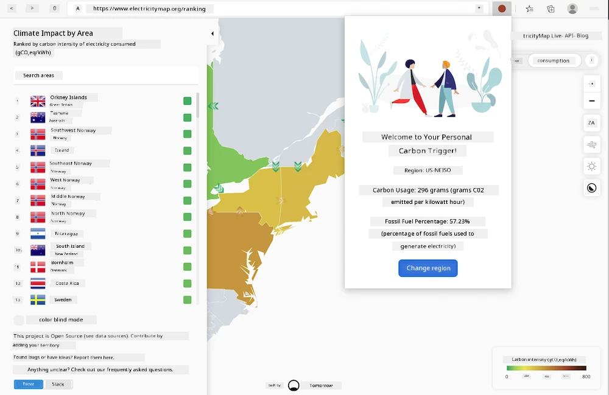

<!--
CO_OP_TRANSLATOR_METADATA:
{
  "original_hash": "9a6b22a2eff0f499b66236be973b24ad",
  "translation_date": "2026-01-08T16:16:43+00:00",
  "source_file": "5-browser-extension/solution/translation/README.it.md",
  "language_code": "pcm"
}
-->
# Estensione del browser Carbon Trigger: kòd wey make you fit start

We go use API Signal C02 from tmrow to dey monitor how people dey use electricity to make browser extension wey go dey remind you inside your browser how heavy electricity use be for your area. Dis kind extension go help you to sabi how your activities dey affect electricity use based on dis info.



## To Start

You go need make sure say [npm](https://npmjs.com) dey installed. Download copy of dis code put am for folder for your computer.

Make you install all di packages wey you need:

```
npm install
```

Make you create the extension using webpack

```
npm run build
```

To install am for Edge, use di "three dots" menu for top right corner for browser to find Extensions panel. If "Developer Mode" no dey enabled, enable am (e dey for bottom left). Choose "Load unpacked" to load new extension. Open "dist" folder for prompt and the extension go load. To use am, you need API key for CO2 Signal API (you fit [get am here via email](https://www.co2signal.com/) - put your email for the box for dat page) and [code for your region](http://api.electricitymap.org/v3/zones) wey match di [electricity map](https://www.electricitymap.org/map) (for Boston, for example, na "US-NEISO").


Once API key and region don enter for the extension interface, the colored dot for the browser extension bar suppose change to show your region energy use and give hint about which high energy activities fit make sense to run. The idea wey behind dis "dots" system na from [Energy Lollipop extension](https://energylollipop.com/) wey dem make for California emissions.

---

<!-- CO-OP TRANSLATOR DISCLAIMER START -->
**Disclaimer**:  
Dis document don translate wit AI translation service [Co-op Translator](https://github.com/Azure/co-op-translator). Even tho we dey try make am accurate, abeg sabi say automated translations fit get errors or mistakes. Di original document wey written for im correct language na di main tori. If na serious information, make person professional human translator check am. We no go responsible for any confusion or wrong understanding wey fit happen because of dis translation.
<!-- CO-OP TRANSLATOR DISCLAIMER END -->