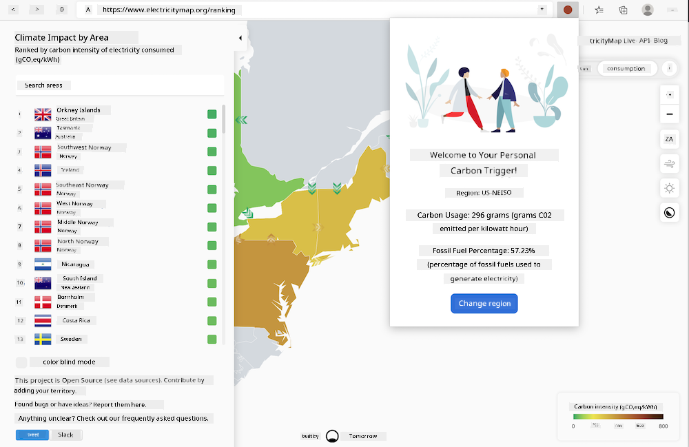

<!--
CO_OP_TRANSLATOR_METADATA:
{
  "original_hash": "26fd39046d264ba185dcb086d3a8cf3e",
  "translation_date": "2026-01-08T16:00:02+00:00",
  "source_file": "5-browser-extension/start/README.md",
  "language_code": "pcm"
}
-->
# Carbon Trigger Browser Extension: Starter Code

Using tmrow's C02 Signal API to track electricity usage, build a browser extension so that you fit get reminder for your browser about how heavy your regiohn dem electricity usage be. Using this extension sometimes go help you make correct judgement on top your activities based on this information.



## Getting Started

You go need get [npm](https://npmjs.com) installed. Download copy of this code go one folder for your computer.

Install all the required packages:

```
npm install
```

Build the extension from webpack

```
npm run build
```

To install for Edge, use the 'three dot' menu for top right corner of the browser to find the Extensions panel. From there, select 'Load Unpacked' to load new extension. Open the 'dist' folder when e ask and the extension go load. To use am, you go need API key for CO2 Signal's API ([get one here via email](https://www.co2signal.com/) - put your email for the box for this page) and the [code for your region](http://api.electricitymap.org/v3/zones) wey match the [Electricity Map](https://www.electricitymap.org/map) (for Boston, for example, I dey use 'US-NEISO').


Once you input the API key and region for the extension interface, the colored dot for the browser extension bar go change to show how your region dey use energy and give you pointer on which energy-heavy activities fit beta for you to do. The idea for this 'dot' system na from the [Energy Lollipop extension](https://energylollipop.com/) for California emissions.

---

<!-- CO-OP TRANSLATOR DISCLAIMER START -->
**Disclaimer**:
Dis dokumant don translate wit AI translation service wey dem call [Co-op Translator](https://github.com/Azure/co-op-translator). Even though we dey try make am correct, abeg sabi say automated translation fit get mistake or no too correct. Di original dokumant wey dey im original language na di main correct source. If na serious mata, make person wey sabi translate am proper do am. We no go responsible if pesin no understand or misunderstand any tin wey happen because of dis translation.
<!-- CO-OP TRANSLATOR DISCLAIMER END -->