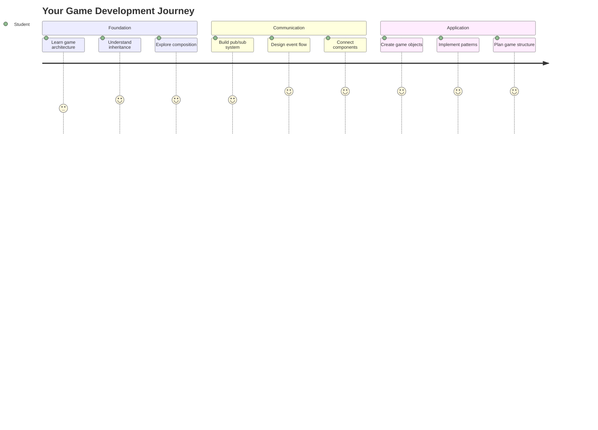
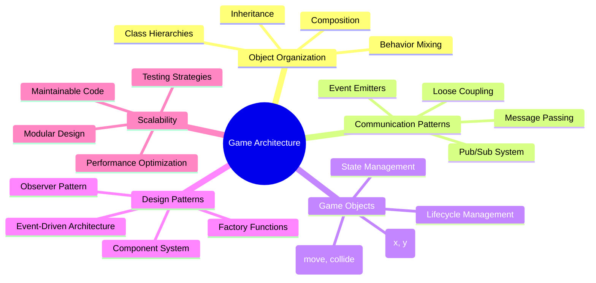
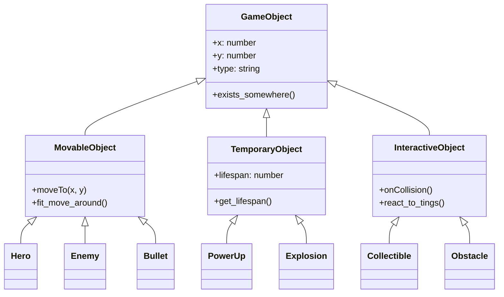
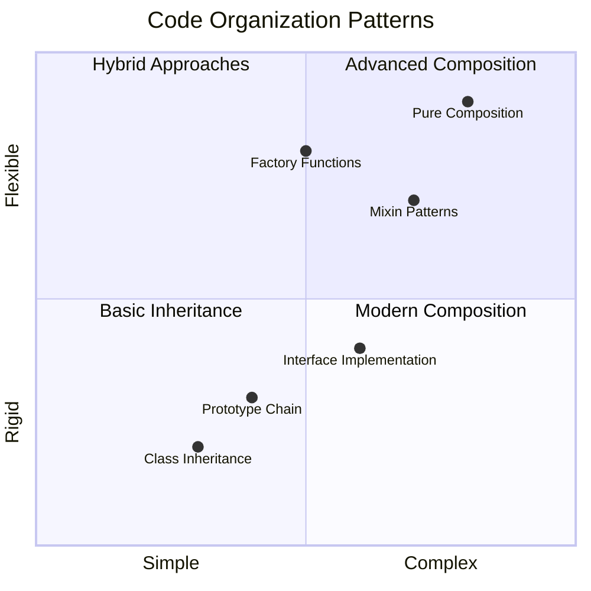
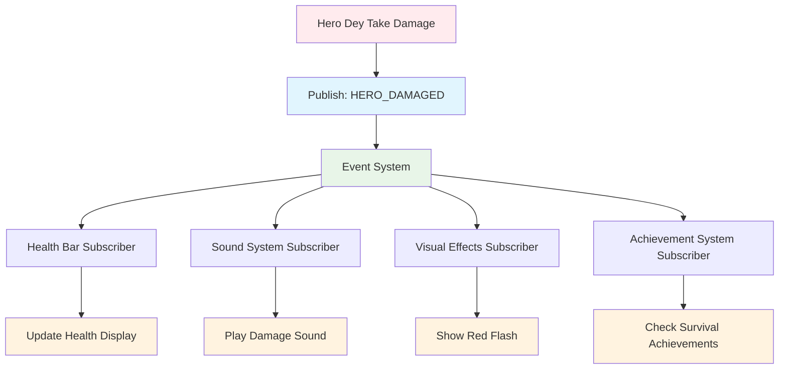
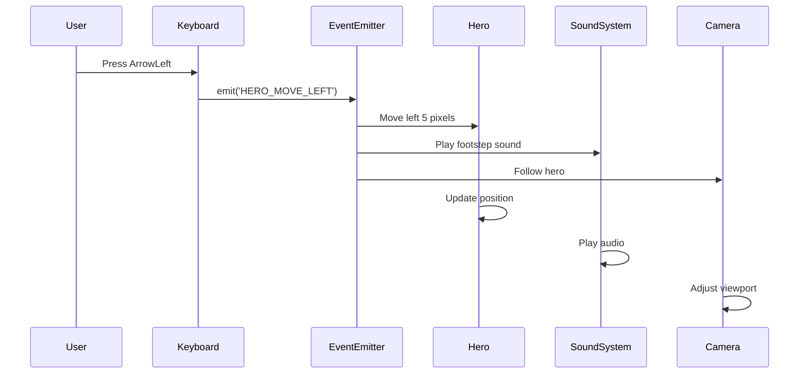
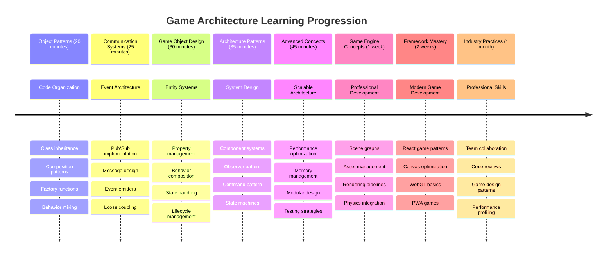

<!--
CO_OP_TRANSLATOR_METADATA:
{
  "original_hash": "a6332a7bb4d0be3bfd24199c83993777",
  "translation_date": "2026-01-08T14:19:16+00:00",
  "source_file": "6-space-game/1-introduction/README.md",
  "language_code": "pcm"
}
-->
# Build a Space Game Part 1: Introduction




Just like NASA's mission control dey coordinate plenty systems during space launch, we go build space game wey go show how different parts of program fit work together well well. While you dey create sometin wey you fit really play, you go learn important programming concepts wey fit apply to any software project.

We go explore two important ways to organize code: inheritance and composition. Dem no be just school concepts – na these patterns dey power everything from video games to banking systems. We go also implement communication system wey dem dey call pub/sub wey dey work like the communication networks wey spacecrafts dey use, wey go allow different components sabi share info without them con create dependencies.

By di end of dis series, you go understand how to build applications wey fit scale and evolve – whether you dey develop games, web applications, or any oda software system.


## Pre-Lecture Quiz

[Pre-lecture quiz](https://ff-quizzes.netlify.app/web/quiz/29)

## Inheritance and Composition in Game Development

As projects dey grow complex, code organization go dey very important. Wetin start as simple script fit hard to maintain without proper structure – e be like how Apollo missions need serious coordination between thousands of components.

We go explore two main ways to organize code: inheritance and composition. Each one get im own advantage, and to sabi both go help you choose the best way for different situations. We go show these concepts inside our space game, where heroes, enemies, power-ups, and other objects must dey interact well.

✅ One of di most famous programming books ever written na about [design patterns](https://en.wikipedia.org/wiki/Design_Patterns).

For any game, you get `game objects` – na the interactive things wey full your game world. Heroes, enemies, power-ups, and visual effects na all game objects. Each one dey exist for certain screen coordinates using `x` and `y` values, like to plot points for coordinate plane.

Even though dem different for how dem look, these objects dey share important behaviors:

- **Dem dey exist somewhere** – Every object get x and y coordinates so game go sabi where to draw am
- **Plenty fit move around** – Heroes dey run, enemies dey chase, bullets dey fly pass screen
- **Dem get lifespan** – Some go stay dey forever, others (like explosion) go show small and disappear
- **Dem dey react to tinz** – When tins collide, power-ups go get collect, health bars go change

✅ Think about game like Pac-Man. You fit identify the four object types wey we list for dis game?


### Expressing Behavior Through Code

Now wey you don understand the common behaviors wey game objects get, make we explore how to implement these behaviors for JavaScript. You fit express object behavior through methods wey dem attach to either classes or individual objects, and plenty ways dey.

**The Class-Based Approach**

Classes and inheritance dey give structured approach to organize game objects. Like the way taxonomic classification system wey Carl Linnaeus make, you go start with base class wey get common properties, then create special classes wey go inherit these basics but add specific capabilities.

✅ Inheritance na important concept to sabi. Learn more for [MDN's article about inheritance](https://developer.mozilla.org/docs/Web/JavaScript/Inheritance_and_the_prototype_chain).

See how you fit implement game objects using classes and inheritance:

```javascript
// Step 1: Mak di base GameObject klaas
class GameObject {
  constructor(x, y, type) {
    this.x = x;
    this.y = y;
    this.type = type;
  }
}
```

**Make we break am down step by step:**
- We dey create basic template wey every game object fit use
- The constructor dey save where the object dey (`x`, `y`) and wetin kind thing e be
- This one go be the foundation wey all your game objects go build on

```javascript
// Step 2: Make am fit move by inherit from oda class
class Movable extends GameObject {
  constructor(x, y, type) {
    super(x, y, type); // Call di parent constructor
  }

  // Add di power to move go new position
  moveTo(x, y) {
    this.x = x;
    this.y = y;
  }
}
```

**For the one wey dey above, we:**
- **Extend** the GameObject class to add movement functionality
- **Call** the parent constructor using `super()` to initialize inherited properties
- **Add** `moveTo()` method wey dey update the object's position

```javascript
// Step 3: Mak sure say you create game object types wey get special kind
class Hero extends Movable {
  constructor(x, y) {
    super(x, y, 'Hero'); // Auto set the type
  }
}

class Tree extends GameObject {
  constructor(x, y) {
    super(x, y, 'Tree'); // Trees no need to waka
  }
}

// Step 4: Use your game objects
const hero = new Hero(0, 0);
hero.moveTo(5, 5); // Hero fit waka!

const tree = new Tree(10, 15);
// tree.moveTo() go cause error - trees no fit waka
```

**To understand these concepts:**
- **Create** special object types wey go inherit correct behaviors
- **Show** how inheritance fit allow make you select wetin feature you want
- **Teach** say heroes fit move but trees no fit move
- **Make clear** how class hierarchy fit stop wrong actions

✅ Take small time reminisce Pac-Man hero (Inky, Pinky or Blinky, for example) and how you fit write am in JavaScript.

**The Composition Approach**

Composition dey follow modular design philosophy, like how engineers dey design spacecraft with interchangeable parts. Instead of inherit from one parent class, you join specific behaviors to make objects wey get exactly the function wey dem need. This approach get flexibility without stiff hierarchical wahala.

```javascript
// Step 1: Make di base behavior objects
const gameObject = {
  x: 0,
  y: 0,
  type: ''
};

const movable = {
  moveTo(x, y) {
    this.x = x;
    this.y = y;
  }
};
```

**Dis code dey do:**
- **Define** base `gameObject` wey get position and type properties
- **Create** separate `movable` behavior object with movement function
- **Separate** concerns by keeping position data and movement logic different

```javascript
// Step 2: Combine tins dem make object dem
const movableObject = { ...gameObject, ...movable };

// Step 3: Build factory function dem for different kinds object
function createHero(x, y) {
  return {
    ...movableObject,
    x,
    y,
    type: 'Hero'
  };
}

function createStatic(x, y, type) {
  return {
    ...gameObject,
    x,
    y,
    type
  };
}
```

**For the one wey dey above, we:**
- **Combine** base object properties with movement behavior using spread syntax
- **Make** factory functions wey go return customized objects
- **Allow** flexible object creation without stiff class hierarchy
- **Make** objects get exactly the behaviors dem need

```javascript
// Step 4: Make and use your join objects dem
const hero = createHero(10, 10);
hero.moveTo(5, 5); // E dey work well well!

const tree = createStatic(0, 0, 'Tree');
// tree.moveTo() no get - movement behavior no join together
```

**Main points to remember:**
- **Compose** objects by mixing behaviors instead of inherit them
- **Give** more flexibility pass strict inheritance hierarchies
- **Allow** objects get exactly the features dem need
- **Use** modern JavaScript spread syntax for clean object combination 
```

**Which Pattern Should You Choose?**

**Which Pattern Should You Choose?**



> 💡 **Pro Tip**: Both patterns get dia place for modern JavaScript development. Classes dey work well for clear hierarchy, while composition dey shine when you want maximum flexibility.
> 
**When to use each approach:**
- **Choose** inheritance when you get clear "is-a" relationships (Hero *is-a* Movable object)
- **Select** composition when you need "has-a" relationships (Hero *get* movement ability)
- **Think about** your team preference and project needs
- **Remember** say you fit mix both approaches inside the same app

### 🔄 **Pedagogical Check-in**
**Object Organization Understanding**: Before you move to communication patterns, make sure say you fit:
- ✅ Explain the difference between inheritance and composition
- ✅ Identify when you go use classes vs factory functions
- ✅ Understand how `super()` keyword work for inheritance
- ✅ Know the benefits of each approach for game development

**Quick Self-Test**: How you go create Flying Enemy wey fit both move and fly?
- **Inheritance approach**: `class FlyingEnemy extends Movable`
- **Composition approach**: `{ ...movable, ...flyable, ...gameObject }`

**Real-World Connection**: These patterns dey everywhere:
- **React Components**: Props (composition) vs class inheritance
- **Game Engines**: Entity-component systems dey use composition
- **Mobile Apps**: UI frameworks dey use inheritance hierarchies too

## Communication Patterns: The Pub/Sub System

As applications get complex, to manage communication between components fit hard. The publish-subscribe pattern (pub/sub) dey solve this by using principles like radio broadcasting – one transmitter fit reach many receivers even if e no sabi who dey listen.

Think about wetin dey happen when hero suffer damage: health bar go update, sound effect go play, visual feedback go show. Instead to join the hero object directly with these systems, pub/sub allow the hero to broadcast message "damage taken." Any system wey need respond fit subscribe to this message type and react.

✅ **Pub/Sub** mean 'publish-subscribe'


### Understanding the Pub/Sub Architecture

The pub/sub pattern make different parts of your app loosely coupled, meaning say dem fit work together without direct dependence. This separation make your code easy to maintain, test and flexible to change.

**Main players for pub/sub:**
- **Messages** – Simple text tags like `'PLAYER_SCORED'` wey go explain wetin happen (plus any extra info)
- **Publishers** – The objects wey dey shout "Somtin happen!" to anyone wey dey listen
- **Subscribers** – The objects wey talk "I care about dis event" and respond when e happen
- **Event System** – Di middleman wey make sure messages reach the correct listeners

### Building an Event System

Make we create simple but powerful event system wey go show these concepts:

```javascript
// Step 1: Make di EventEmitter class
class EventEmitter {
  constructor() {
    this.listeners = {}; // Keep all di event listeners dem
  }
  
  // Register one listener for one kain message type
  on(message, listener) {
    if (!this.listeners[message]) {
      this.listeners[message] = [];
    }
    this.listeners[message].push(listener);
  }
  
  // Send message go all di registered listeners dem
  emit(message, payload = null) {
    if (this.listeners[message]) {
      this.listeners[message].forEach(listener => {
        listener(message, payload);
      });
    }
  }
}
```

**Break down wetin dey happen here:**
- **Create** central event management system using simple class
- **Store** listeners inside object organized by message type
- **Register** new listeners using `on()` method
- **Broadcast** messages to all listeners wey dey interested using `emit()`
- **Support** optional data to carry relevant info

### Putting It All Together: A Practical Example

Alright, make we see am for real! We go build simple movement system wey go show how simple and flexible pub/sub fit be:

```javascript
// Step 1: Tok say wetin kin message you wan use
const Messages = {
  HERO_MOVE_LEFT: 'HERO_MOVE_LEFT',
  HERO_MOVE_RIGHT: 'HERO_MOVE_RIGHT',
  ENEMY_SPOTTED: 'ENEMY_SPOTTED'
};

// Step 2: Make your event system and game tins
const eventEmitter = new EventEmitter();
const hero = createHero(0, 0);
```

**Dis code dey do:**
- **Define** constants object to prevent typo for message names
- **Create** event emitter instance to handle all communication
- **Initialize** hero object for starting position

```javascript
// Step 3: Arrange for event listeners (people wey dey subscribe)
eventEmitter.on(Messages.HERO_MOVE_LEFT, () => {
  hero.moveTo(hero.x - 5, hero.y);
  console.log(`Hero moved to position: ${hero.x}, ${hero.y}`);
});

eventEmitter.on(Messages.HERO_MOVE_RIGHT, () => {
  hero.moveTo(hero.x + 5, hero.y);
  console.log(`Hero moved to position: ${hero.x}, ${hero.y}`);
});
```

**For the one wey dey above, we:**
- **Register** event listeners wey respond to movement messages
- **Update** hero position based on movement direction
- **Add** console logging to track hero position change
- **Separate** movement logic from input handling

```javascript
// Step 4: Make keyboard input join events (publishers)
window.addEventListener('keydown', (event) => {
  switch(event.key) {
    case 'ArrowLeft':
      eventEmitter.emit(Messages.HERO_MOVE_LEFT);
      break;
    case 'ArrowRight':
      eventEmitter.emit(Messages.HERO_MOVE_RIGHT);
      break;
  }
});
```

**To understand these concepts:**
- **Connect** keyboard input to game events without strong coupling
- **Make** input system fit talk to game objects indirectly
- **Allow** many systems respond to same keyboard events
- **Make** e easy to change key bindings or add new input ways


> 💡 **Pro Tip**: The beauty of this pattern na flexibility! You fit add sound effects, screen shake, or particle effects by just adding more listeners – no need change keyboard or movement code.
> 
**Why you go love this approach:**
- Adding new features go easy – just listen for events you care about
- Many tinz fit react to same event without conflict
- Testing go simple because every piece dey independent
- When somtin break, you sabi exactly where to check

### Why Pub/Sub Scales Effectively

The pub/sub pattern dey keep things simple as applications dey get big. Whether you dey manage plenty enemies, dynamic UI updates, or sound systems, the pattern fit handle scale without architecture wahala. New features go join inside existing event system without affect older functionality.

> ⚠️ **Common Mistake**: No make too many specific message types early. Start with big categories and sharpen as your game need clear.
> 
**Best practices:**
- **Group** related messages into logical categories
- **Use** clear names wey show wetin happen
- **Keep** message payloads simple and focused
- **Document** your message types for team work

### 🔄 **Pedagogical Check-in**
**Event-Driven Architecture Understanding**: Check if you sabi the whole system:
- ✅ How pub/sub pattern dey prevent strong coupling between components?
- ✅ Why e dey easy to add new features with event-driven architecture?
- ✅ Wetin the EventEmitter dey do for communication flow?
- ✅ How message constants dey prevent bugs and make maintainability better?

**Design Challenge**: How you go handle these game cases with pub/sub?
1. **Enemy dies**: Update score, play sound, spawn power-up, remove from screen
2. **Level complete**: Stop music, show UI, save progress, load next level
3. **Power-up collected**: Enhance abilities, update UI, play effect, start timer

**Professional Connection**: This pattern dey for:
- **Frontend Frameworks**: React/Vue event systems
- **Backend Services**: Microservice communication
- **Game Engines**: Unity event systems
- **Mobile Development**: iOS/Android notification systems

---

## GitHub Copilot Agent Challenge 🚀

Use the Agent mode to complete this challenge:

**Description:** Create simple game object system using both inheritance and pub/sub pattern. You go implement basic game where different objects fit communicate through events without directly knowing about each other.

**Prompt:** Create JavaScript game system wey get these requirements: 1) Create base GameObject class with x, y coordinates and type property. 2) Create Hero class wey extend GameObject and fit move. 3) Create Enemy class wey extend GameObject and fit chase the hero. 4) Implement EventEmitter class for pub/sub pattern. 5) Setup event listeners so when hero move, nearby enemies receive 'HERO_MOVED' event and update their position to move toward hero. Include console.log to show communication between objects.

Learn more about [agent mode](https://code.visualstudio.com/blogs/2025/02/24/introducing-copilot-agent-mode) here.

## 🚀 Challenge
Consider how the pub-sub pattern fit better game architecture. Identify which components suppose dey emit events and how the system suppose respond. Design one game concept and map out di communication patterns between im components.

## Post-Lecture Quiz

[Post-lecture quiz](https://ff-quizzes.netlify.app/web/quiz/30)

## Review & Self Study

Learn more about Pub/Sub by [reading about am](https://docs.microsoft.com/azure/architecture/patterns/publisher-subscriber/?WT.mc_id=academic-77807-sagibbon).

### ⚡ **Wetin You Fit Do for Di Next 5 Minutes**
- [ ] Open any HTML5 game online and check im code using DevTools
- [ ] Create one simple HTML5 Canvas element and draw one basic shape
- [ ] Try use `setInterval` create one simple animation loop
- [ ] Explore di Canvas API documentation and try one drawing method

### 🎯 **Wetin You Fit Achieve This Hour**
- [ ] Complete di post-lesson quiz and understand game development concepts
- [ ] Set up your game project structure with HTML, CSS, and JavaScript files
- [ ] Create one basic game loop wey dey update and render continuously
- [ ] Draw your first game sprites for di canvas
- [ ] Implement basic asset loading for images and sounds

### 📅 **Your Week-Long Game Creation**
- [ ] Complete di full space game with all di planned features
- [ ] Add polished graphics, sound effects, and smooth animations
- [ ] Implement game states (start screen, gameplay, game over)
- [ ] Create scoring system and player progress tracking
- [ ] Make your game responsive and accessible across devices
- [ ] Share your game online and gather feedback from players

### 🌟 **Your Month-Long Game Development**
- [ ] Build multiple games wey explore different genres and mechanics
- [ ] Learn game development framework like Phaser or Three.js
- [ ] Contribute to open source game development projects
- [ ] Master advanced game programming patterns and optimization
- [ ] Create portfolio wey show your game development skills
- [ ] Mentor others wey dey interested for game development and interactive media

## 🎯 Your Game Development Mastery Timeline


### 🛠️ Your Game Architecture Toolkit Summary

After you finish dis lesson, you get now:
- **Design Pattern Mastery**: Understand inheritance vs composition trade-offs
- **Event-Driven Architecture**: Pub/sub implementation for scalable communication
- **Object-Oriented Design**: Class hierarchies and behavior composition
- **Modern JavaScript**: Factory functions, spread syntax, and ES6+ patterns
- **Scalable Architecture**: Loose coupling and modular design principles
- **Game Development Foundation**: Entity systems and component patterns
- **Professional Patterns**: Industry-standard ways to arrange code

**Real-World Applications**: These patterns fit come:
- **Frontend Frameworks**: React/Vue component architecture and state management
- **Backend Services**: Microservice communication and event-driven systems
- **Mobile Development**: iOS/Android app architecture and notification systems
- **Game Engines**: Unity, Unreal, and web-based game development
- **Enterprise Software**: Event sourcing and distributed system design
- **API Design**: RESTful services and real-time communication

**Professional Skills Gained**: You fit now:
- **Design** scalable software architectures using proven patterns
- **Implement** event-driven systems wey handle complex interactions
- **Choose** better code organization strategies for different scenarios
- **Debug** and maintain loosely coupled systems well well
- **Communicate** technical decisions using industry-standard language

**Next Level**: You ready to implement these patterns for real game, explore advanced game development topics, or apply these architectural knowledge to web apps!

🌟 **Achievement Unlocked**: You don master important software architecture patterns wey dey power everything from simple games to complex enterprise systems!

## Assignment

[Mock up a game](assignment.md)

---

<!-- CO-OP TRANSLATOR DISCLAIMER START -->
**Disclaimer**:  
Dis document na translate wey AI translation service [Co-op Translator](https://github.com/Azure/co-op-translator) do. Even tho we dey try make everything correct, abeg sabi say automatic translation fit get some mistakes or no correct well. The original document wey dem write for im own language na the real correct one to trust. For important matter, e good make professional human translation help. We no go responsible if anybody misunderstand or mix things up because of this translation.
<!-- CO-OP TRANSLATOR DISCLAIMER END -->