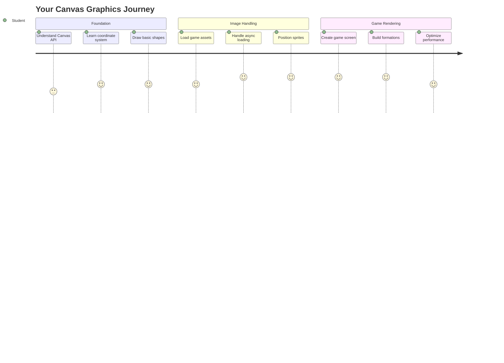
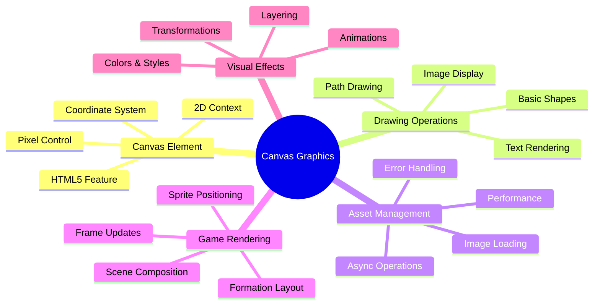
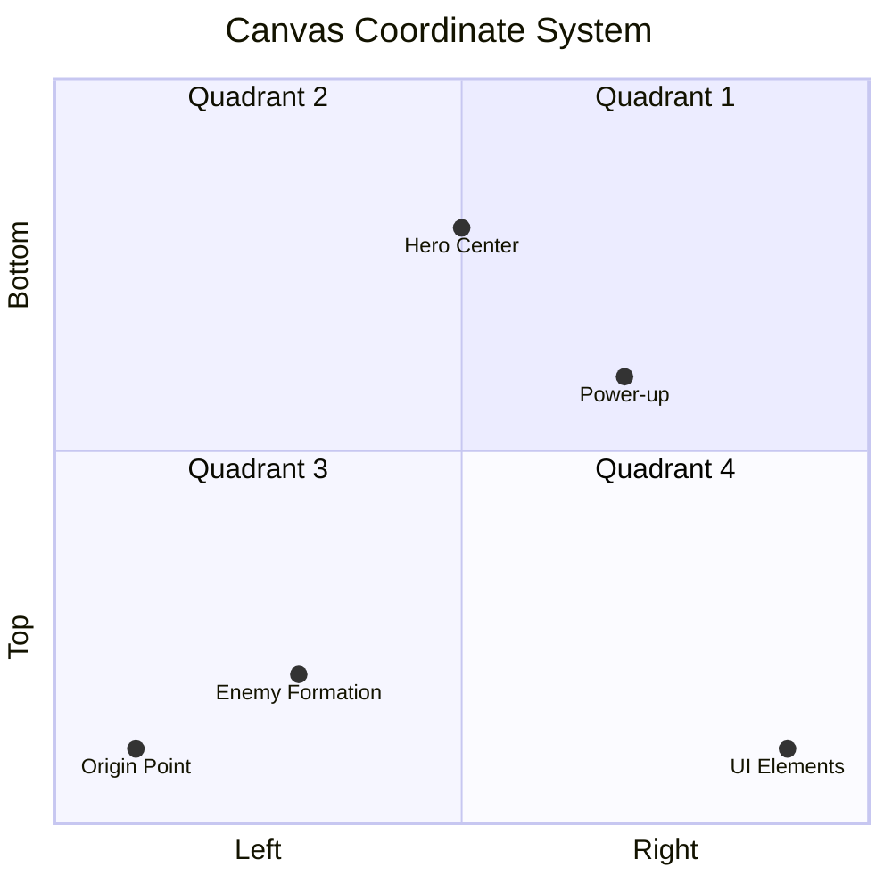
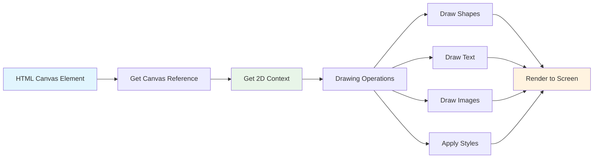
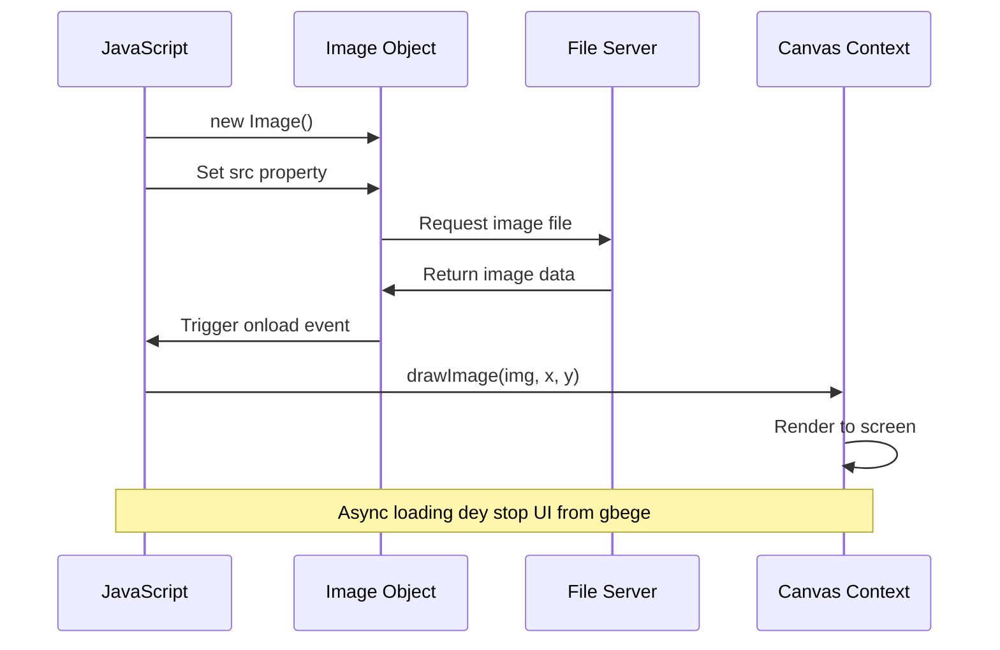
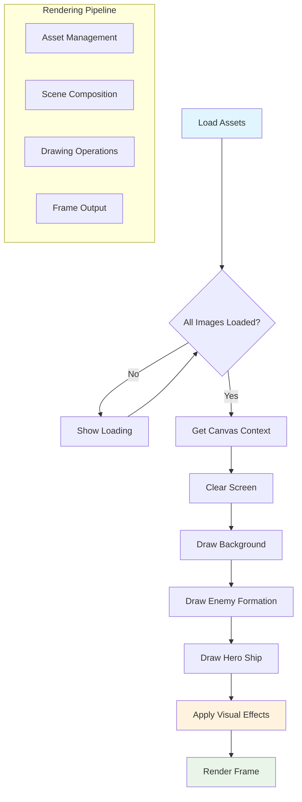
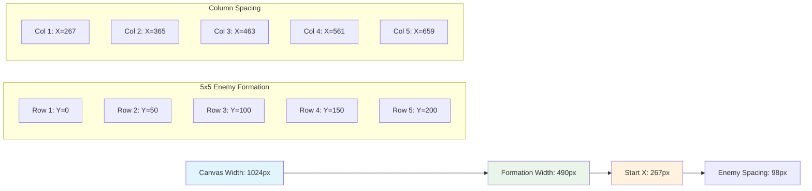
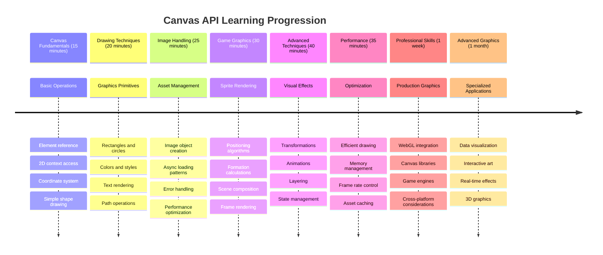

<!--
CO_OP_TRANSLATOR_METADATA:
{
  "original_hash": "7994743c5b21fdcceb36307916ef249a",
  "translation_date": "2026-01-08T13:37:36+00:00",
  "source_file": "6-space-game/2-drawing-to-canvas/README.md",
  "language_code": "pcm"
}
-->
# Build a Space Game Part 2: Draw Hero and Monsters to Canvas


Di Canvas API na one of di web development powerfull tin dem wey fit create dynamic, interactive graphics direct for your browser. For dis lesson, we go change dat blank HTML `<canvas>` element come be game world wey full with heroes and monsters. Think am like your digital art board wey code dey change to visual.

We dey build on top wetin you learn for di last lesson, and now we go enter di visual tins dem. You go learn how to load and show game sprites, put elements for correct position, and create di visual base for your space game. Dis one go join di gap between static web pages and dynamic, interactive experience dem.

By di time we don finish dis lesson, you go get complete game scene wey your hero ship dey positioned well and enemy formations dey ready for battle. You go sabi how modern games dey render graphics for browsers and gain skills to create your own interactive visual experiences. Make we explore canvas graphics and bring your space game come life!


## Pre-Lecture Quiz

[Pre-lecture quiz](https://ff-quizzes.netlify.app/web/quiz/31)

## The Canvas

So wetin dis `<canvas>` element really be? Na HTML5 solution for creating dynamic graphics and animations inside web browsers. E different from regular images or videos wey na static, di canvas dey give you control for every pixel wey show for screen. Dis one perfect for games, data visualizations, and interactive art. Think am as programmable drawing surface wey JavaScript be your paintbrush.

By default, canvas element be like blank, transparent rectangle for your page. But na there di potential dey! E real power dey come out when you use JavaScript draw shapes, load images, create animates, and make tins respond to how user interact. E similar to how early computer graphics pipo for Bell Labs for di 1960s gats program every pixel to create di first digital animations.

✅ Read [more about the Canvas API](https://developer.mozilla.org/docs/Web/API/Canvas_API) for MDN.

Dis na how e normally dey show for page body:

```html
<canvas id="myCanvas" width="200" height="100"></canvas>
```
  
**Dis na wetin dis code dey do:**  
- **Sets** di `id` attribute so you fit reference dis particular canvas element inside JavaScript  
- **Defines** di `width` for pixels to control horizontal size of di canvas  
- **Establishes** di `height` for pixels to determine vertical dimension of di canvas

## Drawing Simple Geometry

Now wey you don sabi wetin di canvas element be, mek we explore how to actually draw for am! Di canvas dey use coordinate system wey fit remind you of math class, but one important kink dey wey relate to computer graphics.

Di canvas dey use Cartesian coordinates with x-axis (horizontal) and y-axis (vertical) to place everytin wey you draw. But di main difference be say: no be like math class coordinate system, di origin point `(0,0)` dey for top-left corner, with x-values dey increase as you dey move right and y-values dey increase as you dey move down. Dis approach come from early computer displays wey electron beams dey scan from top to bottom, so top-left na di natural starting point.


  
> Image from [MDN](https://developer.mozilla.org/docs/Web/API/Canvas_API/Tutorial/Drawing_shapes)

To draw for di canvas element, you go follow same three-step process wey be foundation for all canvas graphics. Once you do am small times, e go become second nature:


1. **Get reference** to your Canvas element from di DOM (like any other HTML element)  
2. **Get di 2D rendering context** – dis one dey provide all di drawing methods  
3. **Start to draw!** Use di context built-in methods to create your graphics

Dis na how e look for code:

```javascript
// Step 1: Comot di canvas element
const canvas = document.getElementById("myCanvas");

// Step 2: Comot di 2D rendering context
const ctx = canvas.getContext("2d");

// Step 3: Set di fill color an draw one rectangle
ctx.fillStyle = 'red';
ctx.fillRect(0, 0, 200, 200); // x, y, width, height
```
  
**Make we break dis down step by step:**  
- We **grab** our canvas element by im ID and store am for variable  
- We **get** di 2D rendering context – na our toolkit full of drawing methods dis be  
- We **tell** di canvas say we wan fill tins with red with di `fillStyle` property  
- We **draw** rectangle wey dey start for top-left corner (0,0) wey 200 pixels wide and tall be dat

✅ Di Canvas API focus mostly on 2D shapes, but you fit also draw 3D tins for web site; for dis, you fit use di [WebGL API](https://developer.mozilla.org/docs/Web/API/WebGL_API).

You fit draw all kain tins with di Canvas API like:

- **Geometrical shapes**, we don show how to draw rectangle, but many more tins dey wey you fit draw.  
- **Text**, you fit draw text with any font and color wey you want.  
- **Images**, you fit draw image based on image asset like .jpg or .png for example.

✅ Try am! You sabi how to draw rectangle, you fit draw circle for page? Check some interesting Canvas drawings for CodePen. Here na [one example wey good well](https://codepen.io/dissimulate/pen/KrAwx).

### 🔄 **Pedagogical Check-in**  
**Canvas Fundamentals Understanding**: Before you move go image loading, make sure you fit:  
- ✅ Explain how di canvas coordinate system different from math coordinates  
- ✅ Understand di three-step process for canvas drawing operations  
- ✅ Identify wetin di 2D rendering context provide  
- ✅ Describe how fillStyle and fillRect dey work together

**Quick Self-Test**: How you go draw blue circle for position (100, 50) with radius 25?  
```javascript
ctx.fillStyle = 'blue';
ctx.beginPath();
ctx.arc(100, 50, 25, 0, 2 * Math.PI);
ctx.fill();
```
  
**Canvas Drawing Methods We You Don Know**:  
- **fillRect()**: Draw filled rectangles  
- **fillStyle**: Set colors and patterns  
- **beginPath()**: Start new drawing paths  
- **arc()**: Create circles and curves

## Load and Draw an Image Asset

Drawing simple shapes e good for start, but most games need real images! Sprites, backgrounds, and textures na wetin make games get better visual look. Loading and showing images on canvas different from drawing geometric shapes, but e easy once you sabi the way.

We gats create `Image` object, load our image file (dis one na asynchronous, e mean say e dey happen "for background"), then draw am for canvas when e ready. Dis approach make sure say your images go show well without blocking your application while dem dey load.


### Basic Image Loading

```javascript
const img = new Image();
img.src = 'path/to/my/image.png';
img.onload = () => {
  // Image don load and e ready to use
  console.log('Image loaded successfully!');
};
```
  
**Dis na wetin dey happen for dis code:**  
- We **create** new Image object to hold our sprite or texture  
- We **tell** am which image file to load by setting source path  
- We **listen** for load event so we go know exact time wey image ready to use

### Better Way to Load Images

Here na better way to handle image loading wey professional developers dey usually use. We go wrap di image loading with Promise-based function – dis approach wey JavaScript Promises popular in ES6, go organize your code well and handle errors sharp-sharp:

```javascript
function loadAsset(path) {
  return new Promise((resolve, reject) => {
    const img = new Image();
    img.src = path;
    img.onload = () => {
      resolve(img);
    };
    img.onerror = () => {
      reject(new Error(`Failed to load image: ${path}`));
    };
  });
}

// Modern way to use am wit async/await
async function initializeGame() {
  try {
    const heroImg = await loadAsset('hero.png');
    const monsterImg = await loadAsset('monster.png');
    // Images dem don ready to use now
  } catch (error) {
    console.error('Failed to load game assets:', error);
  }
}
```
  
**Wetin we do here:**  
- **Wrap** all di image loading logic inside Promise so e go better handle am  
- **Add** error handling wey go really tell us if any tin go wrong  
- **Use** modern async/await syntax because e clear and easy to read  
- **Include** try/catch blocks to handle loading wahala well

Once your images load finish, drawing dem for canvas na easy matter:

```javascript
async function renderGameScreen() {
  try {
    // Load game things dem
    const heroImg = await loadAsset('hero.png');
    const monsterImg = await loadAsset('monster.png');

    // Find canvas and context
    const canvas = document.getElementById("myCanvas");
    const ctx = canvas.getContext("2d");

    // Draw picture dem for specific place dem
    ctx.drawImage(heroImg, canvas.width / 2, canvas.height / 2);
    ctx.drawImage(monsterImg, 0, 0);
  } catch (error) {
    console.error('Failed to render game screen:', error);
  }
}
```
  
**Make we run dis step by step:**  
- We **load** both our hero and monster images for background using await  
- We **grab** our canvas element and get di 2D rendering context we need  
- We **position** hero image for center using some quick coordinate math  
- We **put** monster image for top-left corner to start our enemy formation  
- We **catch** any errors wey fit happen during loading or rendering


## Now E Time to Start Building Your Game

Now we go join everytin together to create di visual base for your space game. You get solid understanding of canvas fundamentals and image loading, so dis hands-on section go guide you build complete game screen with proper sprite position.

### Wetin To Build

You go build web page wey get Canvas element. E suppose show black screen `1024*768`. We don provide you with two images:

- Hero ship  

   

- 5*5 monster  

   

### Recommended steps to start development

Find di starter files wey dem don create for you for `your-work` sub folder. Your project structure suppose get:

```bash
your-work/
├── assets/
│   ├── enemyShip.png
│   └── player.png
├── index.html
├── app.js
└── package.json
```
  
**Dis na wetin you dey work with:**  
- **Game sprites** dey `assets/` folder so everything go stay organized  
- **Your main HTML file** go setup canvas element and prepare everything  
- **JavaScript file** wey you go write all your game rendering magic  
- **A package.json** wey go setup development server so you fit test locally

Open dis folder for Visual Studio Code to start development. You need local development environment with Visual Studio Code, NPM, and Node.js installed. If you never get `npm` for your computer, [here na how to install am](https://www.npmjs.com/get-npm).

Start your development server by entering `your-work` folder:

```bash
cd your-work
npm start
```
  
**Dis command dey do cool tins:**  
- **Start** local server for `http://localhost:5000` so you fit test game  
- **Serve** all your files correct make your browser fit load am well  
- **Watch** your files for changes so you fit develop smoothly  
- **Give you** professional development environment for testing everything

> 💡 **Note**: At first your browser go show blank page – na normal! As you add code, just refresh browser to see your changes. Dis iterative development approach similar to how NASA build Apollo guidance computer – dem dey test each part before dem join am together.

### Add code

Add di code wey dem ask for inside `your-work/app.js` to finish dis tasks:

1. **Draw canvas wit black background**  
   > 💡 **How e go be**: Find TODO inside `/app.js` and add only two lines. Set `ctx.fillStyle` to black, then use `ctx.fillRect()` start (0,0) with your canvas size. Easy!

2. **Load game textures**  
   > 💡 **How e go be**: Use `await loadAsset()` to load your player and enemy images. Store dem for variables so you fit use later. Remember – dem no go show till you draw dem!

3. **Draw hero ship for center-bottom position**  
   > 💡 **How e go be**: Use `ctx.drawImage()` to position your hero. For x-coordinate, try `canvas.width / 2 - 45` to center am, for y-coordinate use `canvas.height - canvas.height / 4` put am for bottom area.

4. **Draw 5×5 formation of enemy ships**  
   > 💡 **How e go be**: Find `createEnemies` function and set nested loop. You need do some math for space and position, but no worry – I go show you exactly how!

First, set constants for correct enemy formation layout:

```javascript
const ENEMY_TOTAL = 5;
const ENEMY_SPACING = 98;
const FORMATION_WIDTH = ENEMY_TOTAL * ENEMY_SPACING;
const START_X = (canvas.width - FORMATION_WIDTH) / 2;
const STOP_X = START_X + FORMATION_WIDTH;
```
  
**Make we break down weh dis constants dey do:**  
- We **set** 5 enemies per row and column (nice 5×5 grid)  
- We **define** how far enemies go dey from each other so dem no go too close  
- We **calculate** di width of our whole formation  
- We **figure** where to start and stop so formation go look centered


Then, create nested loops to draw enemy formation:

```javascript
for (let x = START_X; x < STOP_X; x += ENEMY_SPACING) {
  for (let y = 0; y < 50 * 5; y += 50) {
    ctx.drawImage(enemyImg, x, y);
  }
}
```
  
**Dis na wetin dis nested loop dey do:**  
- Outer loop **go move** left to right across formation  
- Inner loop **go move** top to bottom to create nice rows  
- We **draw** each enemy sprite for exact x,y coordinates we calculate  
- Everything **stay evenly spaced** so e go look sharp and organized

### 🔄 **Pedagogical Check-in**  
**Game Rendering Mastery**: Make sure you understand whole rendering system:  
- ✅ How async image loading dey stop UI from blocking for game start?  
- ✅ Why we dey calculate enemy formation position with constants, no hardcode?  
- ✅ Wetin 2D rendering context dey do for drawing?  
- ✅ How nested loops dey create organized sprite formations?

**Performance Considerations**: Your game now dey show:  
- **Efficient asset loading**: Promise-based image management  
- **Organized rendering**: Structured drawing operations  
- **Mathematical positioning**: Calculated sprite placement  
- **Error handling**: Graceful failure management

**Visual Programming Concepts**: You don learn:
- **Coordinate systems**: Di way we take change math go screen positions
- **Sprite management**: How to load an show game graphics
- **Formation algorithms**: Math patterns for organized layouts
- **Async operations**: Modern JavaScript for better user experience

## Result

Di final result suppose be like dis:


## Solution

Try solve am by yourself first but if you jam, make you check dis [solution](../../../../6-space-game/2-drawing-to-canvas/solution/app.js)

---

## GitHub Copilot Agent Challenge 🚀

Use di Agent mode to complete dis challenge:

**Description:** Make your space game canvas beta by adding visual effects and interactive tins using di Canvas API way you don learn.

**Prompt:** Create new file wey dem go call `enhanced-canvas.html` wey get canvas wey dey show animated stars for background, one pulsing health bar for di hero ship, plus enemy ships wey go dey slowly move down. Add JavaScript code wey go draw twinkling stars using random positions and opacity, put health bar wey dey change color base on health level (green > yellow > red), plus make di enemy ships dey move down di screen with different speeds.

Learn more about [agent mode](https://code.visualstudio.com/blogs/2025/02/24/introducing-copilot-agent-mode) here.

## 🚀 Challenge

You don sabi how to draw with di 2D Canvas API; try check am for [WebGL API](https://developer.mozilla.org/docs/Web/API/WebGL_API), then try draw 3D object.

## Post-Lecture Quiz

[Post-lecture quiz](https://ff-quizzes.netlify.app/web/quiz/32)

## Review & Self Study

Learn more about di Canvas API by [reading about it](https://developer.mozilla.org/docs/Web/API/Canvas_API).

### ⚡ **Wetin You Fit Do For Di Next 5 Minutes**
- [ ] Open your browser console and create canvas element with `document.createElement('canvas')`
- [ ] Try draw rectangle using `fillRect()` for canvas context
- [ ] Experiment with different colors using `fillStyle` property
- [ ] Draw simple circle using `arc()` method

### 🎯 **Wetin You Fit Achieve This Hour**
- [ ] Complete post-lesson quiz and understand canvas basics
- [ ] Create canvas drawing app with plenty shapes and colors
- [ ] Implement image loading and sprite rendering for your game
- [ ] Build simple animation wey dey move objects across di canvas
- [ ] Practice canvas transformations like scaling, rotation, and translation

### 📅 **Your Week-Long Canvas Journey**
- [ ] Complete space game with polished graphics and sprite animations
- [ ] Master advanced canvas techniques like gradients, patterns, and compositing
- [ ] Create interactive visualizations using canvas for data representation
- [ ] Learn canvas optimization techniques for smooth performance
- [ ] Build drawing or painting app with different tools
- [ ] Explore creative coding patterns and generative art with canvas

### 🌟 **Your Month-Long Graphics Mastery**
- [ ] Build complex visual apps using Canvas 2D and WebGL
- [ ] Learn graphics programming concepts and shader basics
- [ ] Contribute to open source graphics libraries and visualization tools
- [ ] Master performance optimization for graphics-heavy apps
- [ ] Create educational content about canvas programming and computer graphics
- [ ] Become graphics programming expert wey fit help others create visual experience

## 🎯 Your Canvas Graphics Mastery Timeline


### 🛠️ Your Canvas Graphics Toolkit Summary

After you finish dis lesson, you get:
- **Canvas API Mastery**: Full understanding of 2D graphics programming
- **Coordinate Mathematics**: Correct positioning and layout algorithms
- **Asset Management**: Professional image loading with error handling
- **Rendering Pipeline**: Organized way to compose scenes
- **Game Graphics**: Sprite positioning and formation calculations
- **Async Programming**: Modern JavaScript patterns for smooth performance
- **Visual Programming**: How to change math concepts to screen graphics

**Real-World Applications**: Your Canvas skills fit directly apply to:
- **Data Visualization**: Charts, graphs, and interactive dashboards
- **Game Development**: 2D games, simulations, and interactive experience
- **Digital Art**: Creative coding and generative art projects
- **UI/UX Design**: Custom graphics and interactive elements
- **Educational Software**: Visual learning tools and simulations
- **Web Applications**: Dynamic graphics and real-time visuals

**Professional Skills Gained**: Now you fit:
- **Build** custom graphics wey no use outside libraries
- **Optimize** rendering performance for smooth user experience
- **Debug** complex visual wahala with browser developer tools
- **Design** scalable graphics system using math principles
- **Integrate** Canvas graphics wit modern web application frameworks

**Canvas API Methods You Don Master**:
- **Element Management**: getElementById, getContext
- **Drawing Operations**: fillRect, drawImage, fillStyle
- **Asset Loading**: Image objects, Promise patterns
- **Mathematical Positioning**: Coordinate calculations, formation algorithms

**Next Level**: You fit now add animation, user interaction, collision detection, or try WebGL for 3D graphics!

🌟 **Achievement Unlocked**: You don build complete game rendering system using basic Canvas API techniques!

## Assignment

[Play with the Canvas API](assignment.md)

---

<!-- CO-OP TRANSLATOR DISCLAIMER START -->
**Disclaimer**:  
Dis document don translate by AI translation service [Co-op Translator](https://github.com/Azure/co-op-translator). Even though we dey try make am correct, abeg sabi say automated translations fit get some mistake or wahala. The original document wey e dey for im own language na the real correct source. For important information, e good make person wey sabi translate am well do the translation. We no go take responsibility for any misunderstanding or wrong meaning wey fit happen because of dis translation.
<!-- CO-OP TRANSLATOR DISCLAIMER END -->