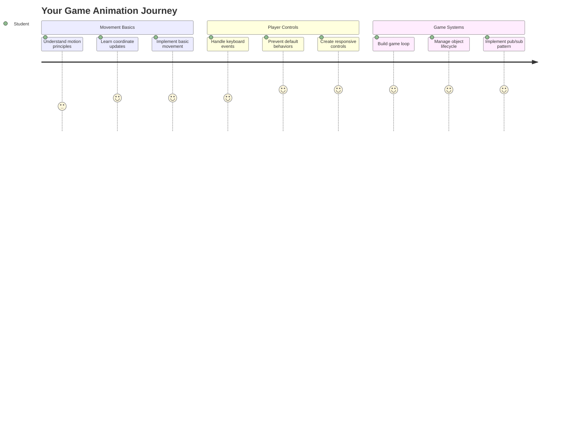
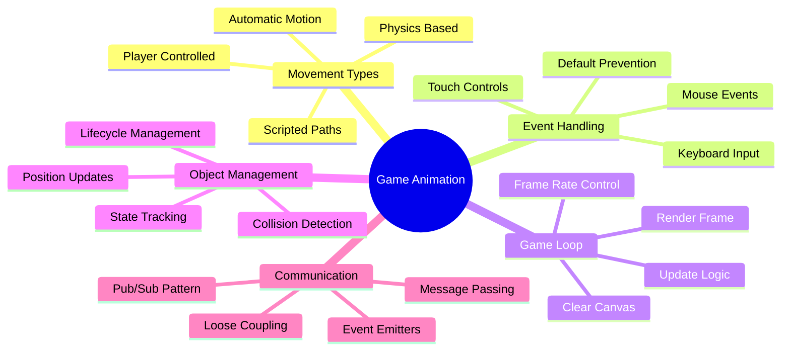
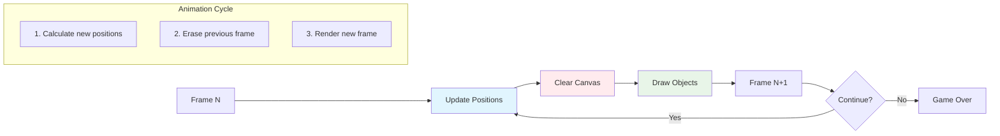
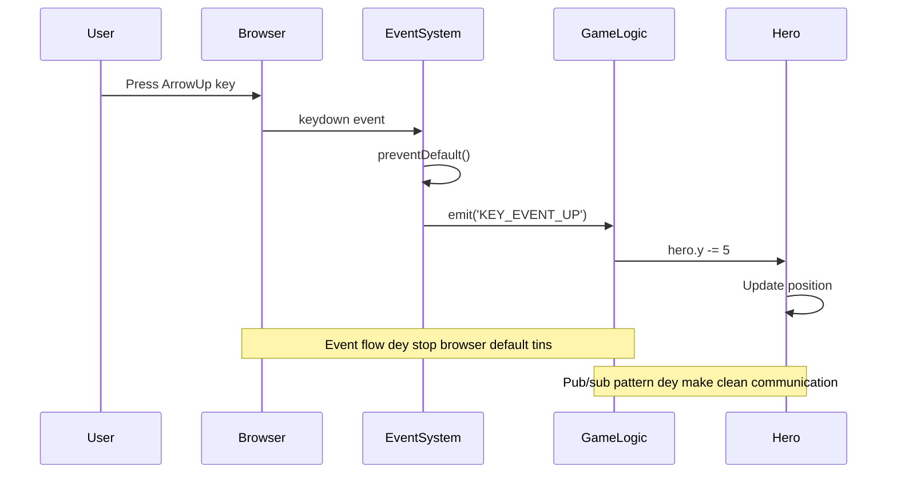
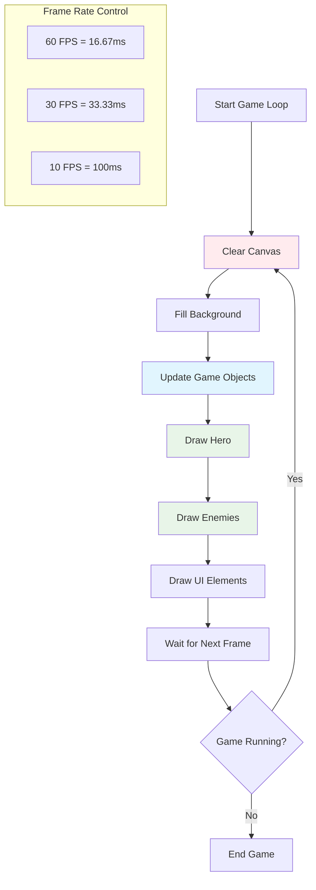
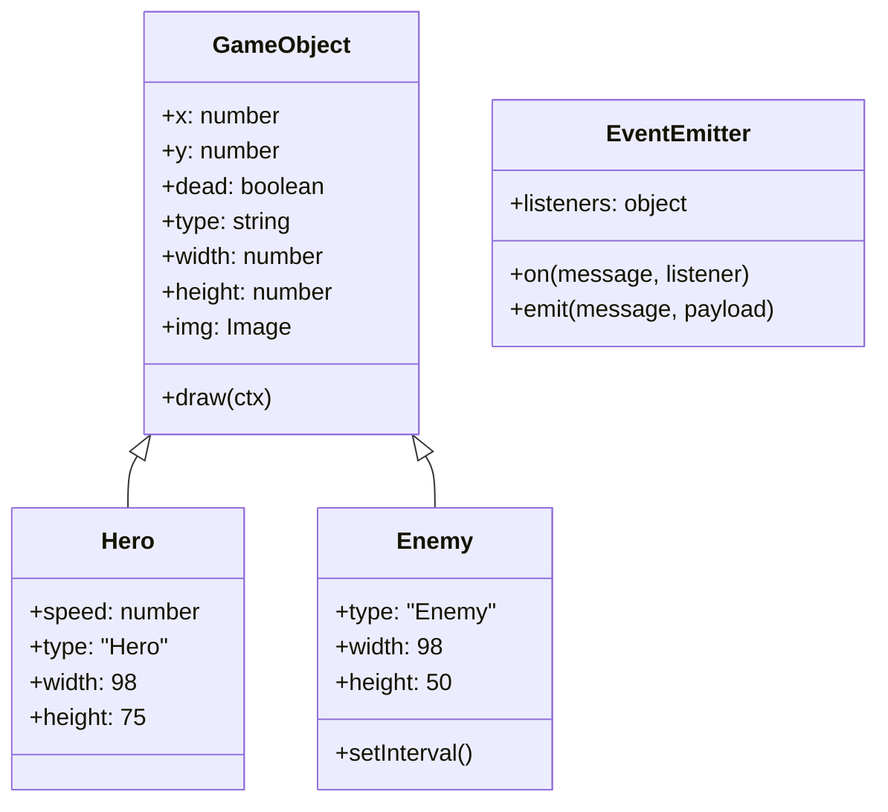
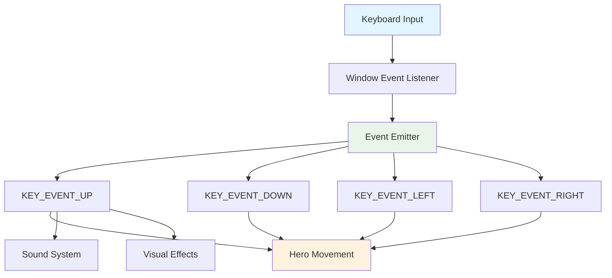
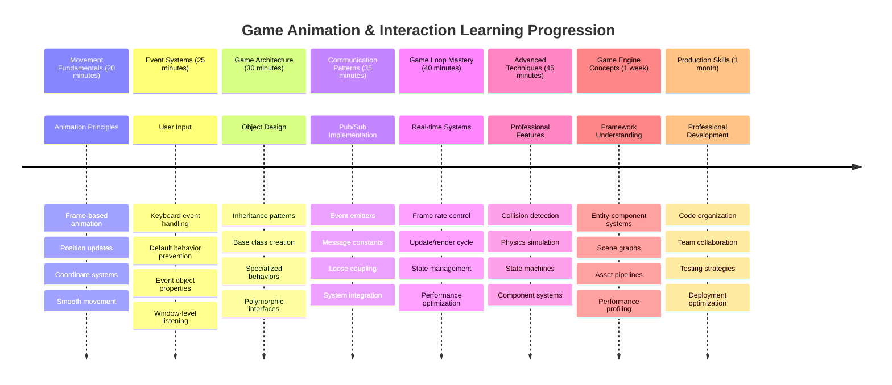

# Build a Space Game Part 3: Adding Motion


Think about your favorite games – wetin dey make dem sweet no be only fine graphics, na how everything dey move and respond to wetin you dey do. Right now, your space game be like beautiful picture, but we go add movement wey go make am live.

When NASA engineers write code for Apollo mission guidance computer, dem face the same yawa: how you go make spacecraft respond to pilot input plus automatically adjust course? The principle wey we go learn today na the same kind thing – how to manage player-controlled movement with automatic system behaviors.

For this lesson, you go learn how to make spaceship waka glide for screen, respond to player command, and create smooth movement pattern dem. We go break am down into small concepts wey dey build on each other naturally.

By the end, your players go dey fly their hero ship around the screen while enemy ship go dey patrol for up. Most important, you go sabi the core principle wey dey make game movement system work.


## Pre-Lecture Quiz

[Pre-lecture quiz](https://ff-quizzes.netlify.app/web/quiz/33)

## Understanding Game Movement

Games dey come alive when things start to move, and basically two ways e dey happen:

- **Player-controlled movement**: When you press key or click mouse, something go move. Na the direct connection between you and your game world.
- **Automatic movement**: When game itself decide to move things – like enemy ship wey suppose patrol screen whether you dey do anything or not.

Making object move for computer screen simple pass wetin you fit think. You remember those x and y coordinates from math class? Na the exact thing we dey use here. When Galileo track Jupiter moons for 1610, na the same thing e dey do – plotting position over time to understand movement pattern.

To move things on screen na like to create flipbook animation – you need follow these three simple steps:


1. **Update the position** – Change where your object suppose dey (fit move am 5 pixels go right)
2. **Erase the old frame** – Clear screen so you no go see any ghostly trail
3. **Draw the new frame** – Put your object for the new place

If you do am fast, bam! You get smooth movement wey make sense to players.

E go fit look like this for code:

```javascript
// Set di hero location
hero.x += 5;
// Clear di rectangle wey hold di hero
ctx.clearRect(0, 0, canvas.width, canvas.height);
// Draw di game background and hero again
ctx.fillRect(0, 0, canvas.width, canvas.height);
ctx.fillStyle = "black";
ctx.drawImage(heroImg, hero.x, hero.y);
```

**This na wetin dis code dey do:**
- **Update** hero x-coordinate by 5 pixels to move am horizontally
- **Clear** whole canvas area to remove previous frame
- **Fill** canvas with black background color
- **Redraw** hero image for the new position

✅ You fit reason why to dey redraw your hero plenty time per second fit dey cost performance? Read about [alternatives to this pattern](https://developer.mozilla.org/en-US/docs/Web/API/Canvas_API/Tutorial/Optimizing_canvas).

## Handle keyboard events

Na here we connect player input to game action. When person press spacebar to fire laser or tap arrow key to dodge asteroid, your game need detect and respond to that input.

Keyboard events dey happen for window level, meaning your entire browser window dey listen for keypress. Mouse clicks fit connect to specific elements (like button click). For our space game, we go focus on keyboard controls cause na the one wey give players classic arcade feel.

This remind me how telegraph operators for 1800s translate morse code input to meaningful message – we dey do similar, translating keypress to game command.

To handle event, you need use window's `addEventListener()` method and give am two input parameters. The first na name of event, for example `keyup`. The second na function wey suppose run when event happen.

See example below:

```javascript
window.addEventListener('keyup', (evt) => {
  // evt.key = na di string way represent di key
  if (evt.key === 'ArrowUp') {
    // do somtin
  }
});
```

**Breaking wetin happen here down:**
- **Listen** for keyboard events on entire window
- **Capture** event object wey get info about which key dem press
- **Check** if the key wey dem press match specific key (for here na up arrow)
- **Run** code when the condition complete

For key events, you get two property for event wey you fit use check which key dem press:

- `key` - na string form of pressed key, like `'ArrowUp'`
- `keyCode` - na number form, like `37`, mean `ArrowLeft`

✅ Manipulate key event no only help for game development. Wetin other uses you fit think for this technique?


### Special keys: make you watch sharp!

Some keys get browser behavior wey go fit spoil your game. Arrow keys dey scroll page and spacebar go jump down – these na wetin you no want as person dey try pilot their spaceship.

We fit stop these default behavior make our game handle the input instead. Na similar way early computer programmers dey override system interrupts to create custom behavior – na like that we dey do at browser level. See how:

```javascript
const onKeyDown = function (e) {
  console.log(e.keyCode);
  switch (e.keyCode) {
    case 37:
    case 39:
    case 38:
    case 40: // Arrow keys
    case 32:
      e.preventDefault();
      break; // Space
    default:
      break; // no make e block oda keys
  }
};

window.addEventListener('keydown', onKeyDown);
```

**Understanding dis prevention code:**
- **Check** for specific key codes wey fit cause unwanted browser behavior
- **Prevent** default browser action for arrow keys and spacebar
- **Allow** other keys to work normally
- **Use** `e.preventDefault()` to stop browser built-in behavior

### 🔄 **Pedagogical Check-in**
**Event Handling Understanding**: Before you move go automatic movement, make sure say you fit:
- ✅ Explain difference between `keydown` and `keyup` event
- ✅ Understand why we dey prevent default browser behaviors
- ✅ Talk how event listeners connect user input to game logic
- ✅ Identify keys wey fit interfere with game controls

**Quick Self-Test**: Wetin go happen if you no prevent default behavior for arrow keys?
*Answer: Browser go scroll page, e go spoil game movement*

**Event System Architecture**: Now you sabi:
- **Window-level listening**: Capture events for browser level
- **Event object properties**: `key` strings vs `keyCode` numbers
- **Default prevention**: Stop unwanted browser behavior
- **Conditional logic**: Respond to specific key combinations

## Game induced movement

Now we go talk about objects wey dey move without player input. Think about enemy ships wey dey cruise across screen, bullets wey dey fly straight, or clouds wey dey drift for background. This autonomous movement dey make your game world feel alive even when nobody dey touch controls.

We dey use JavaScript built-in timer to update position at regular time. This concept be like how pendulum clock sabi work – na regular machine dey trigger consistent timed actions. Here how simple e be:

```javascript
const id = setInterval(() => {
  // Comot di enemy fo di y axis
  enemy.y += 10;
}, 100);
```

**This movement code dey do:**
- **Create** timer wey run every 100 milliseconds
- **Update** enemy y-coordinate by 10 pixels every time
- **Store** interval ID so we fit stop am later if need be
- **Move** enemy automatically go down screen

## The game loop

Dis one na the concept wey join everything together – the game loop. If your game be movie, the game loop na the film projector, wey dey show frame after frame so fast that everything go dey move smooth.

Every game dey get this kind loop wey dey run behind scenes. Na function wey go update all game objects, redraw screen, and dey repeat dis process. E dey keep track of your hero, all the enemies, any laser wey dey fly – the whole game state.

This concept remind me how early film animator like Walt Disney dey redraw characters frame by frame to create movement illusion. Na same thing we dey do, just say na code instead of pencil.

This na how game loop fit look for code:


```javascript
const gameLoopId = setInterval(() => {
  function gameLoop() {
    ctx.clearRect(0, 0, canvas.width, canvas.height);
    ctx.fillStyle = "black";
    ctx.fillRect(0, 0, canvas.width, canvas.height);
    drawHero();
    drawEnemies();
    drawStaticObjects();
  }
  gameLoop();
}, 200);
```

**Understanding game loop structure:**
- **Clear** whole canvas to remove previous frame
- **Fill** background with solid color
- **Draw** all game objects for their current position
- **Repeat** dis every 200 milliseconds to create smooth animation
- **Manage** frame rate by controlling interval timing

## Continuing the Space Game

Now we go add movement to the static scene we build before. We go transform am from picture to interactive experience. We go work am step by step to make sure each part build on the one before.

Carry code from where we stop for previous lesson (or start with code wey dey inside the [Part II- starter](../../../../6-space-game/3-moving-elements-around/your-work) folder if you want new start).

**Na wetin we dey build today:**
- **Hero controls**: Arrow keys go pilot your spaceship around screen
- **Enemy movement**: Those alien ships go start to waka

Make we start to implement these features.

## Recommended steps

Find the files wey dem don create for you for `your-work` sub folder. E suppose get these:

```bash
-| assets
  -| enemyShip.png
  -| player.png
-| index.html
-| app.js
-| package.json
```

You go start your project for `your-work` folder by to type:

```bash
cd your-work
npm start
```

**Wetinh this command dey do:**
- **Go** your project directory
- **Start** HTTP Server for address `http://localhost:5000`
- **Serve** your game files so you fit test am for browser

The command up there go start HTTP Server for address `http://localhost:5000`. Open browser and put that address, right now e suppose render the hero plus all enemies; nothing dey move yet!

### Add code

1. **Add dedicated objects** for `hero` and `enemy` and `game object`, dem suppose get `x` and `y` properties. (Remember the part wey talk about [Inheritance or composition](../README.md)).

   *HINT* `game object` na the one wey get `x` and `y` and fit draw itself for canvas.

   > **Tip**: Start with adding new `GameObject` class with constructor like below, then draw am for canvas:

    ```javascript
    class GameObject {
      constructor(x, y) {
        this.x = x;
        this.y = y;
        this.dead = false;
        this.type = "";
        this.width = 0;
        this.height = 0;
        this.img = undefined;
      }
    
      draw(ctx) {
        ctx.drawImage(this.img, this.x, this.y, this.width, this.height);
      }
    }
    ```

    **Understanding this base class:**
    - **Define** common properties wey all game objects share (position, size, image)
    - **Include** `dead` flag to track if object suppose remove
    - **Provide** `draw()` method wey go render object on canvas
    - **Set** default values for properties wey child classes fit override


    Now, extend dis `GameObject` make you create `Hero` and `Enemy`:

    ```javascript
    class Hero extends GameObject {
      constructor(x, y) {
        super(x, y);
        this.width = 98;
        this.height = 75;
        this.type = "Hero";
        this.speed = 5;
      }
    }
    ```

    ```javascript
    class Enemy extends GameObject {
      constructor(x, y) {
        super(x, y);
        this.width = 98;
        this.height = 50;
        this.type = "Enemy";
        const id = setInterval(() => {
          if (this.y < canvas.height - this.height) {
            this.y += 5;
          } else {
            console.log('Stopped at', this.y);
            clearInterval(id);
          }
        }, 300);
      }
    }
    ```

    **Key concepts for these classes:**
    - **Inherit** from `GameObject` using `extends` keyword
    - **Call** parent constructor with `super(x, y)`
    - **Set** specific size and properties for each object type
    - **Implement** automatic movement for enemy using `setInterval()`

2. **Add key-event handlers** to handle key navigation (move hero up/down left/right)

   *REMEMBER* na Cartesian system, top-left na `0,0`. Make sure say you add code to stop *default behavior*

   > **Tip**: Create your `onKeyDown` function and attach am to window:

   ```javascript
   const onKeyDown = function (e) {
     console.log(e.keyCode);
     // Add de code wey dey from di lesson wey dey above to stop di default behavior
     switch (e.keyCode) {
       case 37:
       case 39:
       case 38:
       case 40: // Arrow keys
       case 32:
         e.preventDefault();
         break; // Space
       default:
         break; // no block oda keys
     }
   };

   window.addEventListener("keydown", onKeyDown);
   ```
    
   **What this event handler dey do:**
   - **Listen** for keydown event on entire window
   - **Log** the key code to help debug which keys dey press
   - **Prevent** default browser behavior for arrow keys and spacebar
   - **Allow** other keys work normally
   
   Check your browser console now, watch the keystroke wey dey log.

3. **Implement** the [Pub sub pattern](../README.md), dis one go keep your code clean as you dey follow the next steps.

   Publish-Subscribe pattern help organize code by separating event detection from event handling. E make your code modular and easier to maintain.

   To do last part you fit:

   1. **Add event listener** on window:

       ```javascript
       window.addEventListener("keyup", (evt) => {
         if (evt.key === "ArrowUp") {
           eventEmitter.emit(Messages.KEY_EVENT_UP);
         } else if (evt.key === "ArrowDown") {
           eventEmitter.emit(Messages.KEY_EVENT_DOWN);
         } else if (evt.key === "ArrowLeft") {
           eventEmitter.emit(Messages.KEY_EVENT_LEFT);
         } else if (evt.key === "ArrowRight") {
           eventEmitter.emit(Messages.KEY_EVENT_RIGHT);
         }
       });
       ```

   **What this event system dey do:**
   - **Detect** keyboard input and convert am to custom game event
   - **Separate** input detection from game logic
   - **Make** am easier to change controls later without touching game code
   - **Allow** multiple systems to respond to same input


   2. **Create EventEmitter class** to publish and subscribe to messages:

       ```javascript
       class EventEmitter {
         constructor() {
           this.listeners = {};
         }
       
         on(message, listener) {
           if (!this.listeners[message]) {
             this.listeners[message] = [];
           }
           this.listeners[message].push(listener);
         }
       
   3. **Add constants** and set up EventEmitter:

       ```javascript
       const Messages = {
         KEY_EVENT_UP: "KEY_EVENT_UP",
         KEY_EVENT_DOWN: "KEY_EVENT_DOWN",
         KEY_EVENT_LEFT: "KEY_EVENT_LEFT",
         KEY_EVENT_RIGHT: "KEY_EVENT_RIGHT",
       };
       
       let heroImg, 
           enemyImg, 
           laserImg,
           canvas, ctx, 
           gameObjects = [], 
           hero, 
           eventEmitter = new EventEmitter();
       ```

   **Understanding the setup:**
   - **Define** message constants to prevent typo and make refactoring easy
   - **Declare** variables for images, canvas context, and game state
   - **Create** global event emitter for pub-sub system
   - **Dey start** one array dat go hold all game objects

   4. **Start di game**

       ```javascript
       function initGame() {
         gameObjects = [];
         createEnemies();
         createHero();
       
         eventEmitter.on(Messages.KEY_EVENT_UP, () => {
           hero.y -= 5;
         });
       
         eventEmitter.on(Messages.KEY_EVENT_DOWN, () => {
           hero.y += 5;
         });
       
         eventEmitter.on(Messages.KEY_EVENT_LEFT, () => {
           hero.x -= 5;
         });
       
4. **Arrange di game loop**

   Change di `window.onload` function so e go start di game and arrange one game loop wey dey run well for correct time. You go add one laser beam join:

    ```javascript
    window.onload = async () => {
      canvas = document.getElementById("canvas");
      ctx = canvas.getContext("2d");
      heroImg = await loadTexture("assets/player.png");
      enemyImg = await loadTexture("assets/enemyShip.png");
      laserImg = await loadTexture("assets/laserRed.png");
    
      initGame();
      const gameLoopId = setInterval(() => {
        ctx.clearRect(0, 0, canvas.width, canvas.height);
        ctx.fillStyle = "black";
        ctx.fillRect(0, 0, canvas.width, canvas.height);
        drawGameObjects(ctx);
      }, 100);
    };
    ```

   **How di game setup dey work:**
   - **Dey wait** for di page to finish load before e start
   - **Dey find** di canvas element and im 2D render context
   - **Dey load** all di image assets asynchronous using `await`
   - **Dey start** di game loop wey go run every 100ms (10 FPS)
   - **Dey clear** and redraw di whole screen every frame

5. **Add code** wey go move enemies for one certain interval

    Change di `createEnemies()` function to create di enemies and push dem into di new gameObjects class:

    ```javascript
    function createEnemies() {
      const MONSTER_TOTAL = 5;
      const MONSTER_WIDTH = MONSTER_TOTAL * 98;
      const START_X = (canvas.width - MONSTER_WIDTH) / 2;
      const STOP_X = START_X + MONSTER_WIDTH;
    
      for (let x = START_X; x < STOP_X; x += 98) {
        for (let y = 0; y < 50 * 5; y += 50) {
          const enemy = new Enemy(x, y);
          enemy.img = enemyImg;
          gameObjects.push(enemy);
        }
      }
    }
    ```

    **Wetin di enemy creation dey do:**
    - **Dey calculate** the correct place wey go put enemies so dem balance for middle
    - **Dey create** grid of enemies with nested loops
    - **Dey assign** di enemy image to each enemy object
    - **Dey add** every enemy to di global game objects array
    
    and add one `createHero()` function to do similar process for di hero.
    
    ```javascript
    function createHero() {
      hero = new Hero(
        canvas.width / 2 - 45,
        canvas.height - canvas.height / 4
      );
      hero.img = heroImg;
      gameObjects.push(hero);
    }
    ```

    **Wetin di hero creation dey do:**
    - **Dey put** di hero for bottom middle of di screen
    - **Dey assign** di hero image to di hero object
    - **Dey add** di hero to di game objects array make e fit render

    and last, add one `drawGameObjects()` function so e go start di drawing:

    ```javascript
    function drawGameObjects(ctx) {
      gameObjects.forEach(go => go.draw(ctx));
    }
    ```

    **How di drawing function dey work:**
    - **Dey run through** all di game objects inside di array
    - **Dey call** di `draw()` method on each object
    - **Dey pass** di canvas context make objects fit render themselves

    ### 🔄 **Pedagogical Check-in**
    **Complete Game System Understanding**: Make sure say you sabi di whole architecture well:
    - ✅ How inheritance dey make Hero and Enemy share common GameObject properties?
    - ✅ Why pub/sub pattern dey make your code easy to maintain?
    - ✅ Wetin di game loop dey do for smooth animation creation?
    - ✅ How event listeners dey connect user input to game object behavior?

    **System Integration**: Your game dey show now:
    - **Object-Oriented Design**: Base classes with special inheritance
    - **Event-Driven Architecture**: Pub/sub pattern for loose coupling
    - **Animation Framework**: Game loop with consistent frame updates
    - **Input Handling**: Keyboard events with default prevention
    - **Asset Management**: Image loading and sprite rendering

    **Professional Patterns**: You don implement:
    - **Separation of Concerns**: Input, logic and rendering separated
    - **Polymorphism**: All game objects dey share same drawing interface
    - **Message Passing**: Clean communication between components
    - **Resource Management**: Efficient sprite and animation handling

    Your enemies suppose don start to advance for your hero spaceship!
      }
    }
    ```
    
    and add a `createHero()` function to do a similar process for the hero.
    
    ```javascript
    function createHero() {
      hero = new Hero(
        canvas.width / 2 - 45,
        canvas.height - canvas.height / 4
      );
      hero.img = heroImg;
      gameObjects.push(hero);
    }
    ```

    and last, add one `drawGameObjects()` function to start di drawing:

    ```javascript
    function drawGameObjects(ctx) {
      gameObjects.forEach(go => go.draw(ctx));
    }
    ```

    Your enemies suppose don start to advance for your hero spaceship!

---

## GitHub Copilot Agent Challenge 🚀

Here na challenge wey go improve your game polish: adding boundaries and smooth controls. Right now, your hero fit fly comot screen, and di movement fit feel choppy.

**Your Mission:** Make your spaceship feel more real by adding screen boundaries and smooth movement. E be like how NASA flight control systems dey stop spacecraft from pass safe operation limits.

**Wetin you go build:** Create system wey go keep your hero spaceship for inside screen, and make di controls smooth. When players hold down one arrow key, di ship go glide continuously instead of moving in small small steps. Try add visual feedback when di ship reach screen boundaries – like small subtle effect wey show say na edge of play area.

Learn more about [agent mode](https://code.visualstudio.com/blogs/2025/02/24/introducing-copilot-agent-mode) here.

## 🚀 Challenge

Code organisation dey become very important as projects dey grow. You go notice say your file start dey crowded with functions, variables and classes wey dey mix together. E remind me how engineers wey arrange Apollo mission code gatz create clear, maintainable systems so many teams fit work together well.

**Your mission:**
Think as software architect. How you go arrange your code make six months later, you or teammate fit understand wetin dey happen? Even if everything dey one file for now, you fit create better organisation:

- **Group related functions** together with clear comment headers
- **Separate concerns** - keep game logic apart from rendering
- **Use consistent naming** conventions for variables and functions
- **Create modules** or namespaces to organize different parts of your game
- **Add documentation** to explain purpose of each major section

**Reflection questions:**
- Which parts of your code hardiest to understand when you return to dem?
- How you fit organize your code to make am easier for somebody else to contribute?
- Wetin suppose happen if you wan add new features like power-ups or different enemy types?

## Post-Lecture Quiz

[Post-lecture quiz](https://ff-quizzes.netlify.app/web/quiz/34)

## Review & Self Study

We don dey build everything from scratch, and e dey good for learning, but here na small secret – some better JavaScript frameworks dey hide wey fit handle many heavy lifting for you. Once you comfortable with basics wey we cover so far, e good to [check wetin dey available](https://github.com/collections/javascript-game-engines).

Think of frameworks like having well-stocked toolbox instead of making every tool by hand. Dem fit solve lots of code organisation wahala wey we talk before, plus dem get features wey go take weeks to build yourself.

**Things worth exploring:**
- How game engines dey organize code – you go surprise at clever patterns wey dem use
- Performance tricks to make canvas games run butter-smooth  
- Modern JavaScript features wey fit make your code cleaner and easy to maintain
- Different ways to manage game objects and their relationships

## 🎯 Your Game Animation Mastery Timeline


### 🛠️ Your Game Development Toolkit Summary

After you finish this lesson, you don master:
- **Animation Principles**: Frame-based movement and smooth transitions
- **Event-Driven Programming**: Keyboard input handling with correct event management
- **Object-Oriented Design**: Inheritance hierarchies and polymorphic interfaces
- **Communication Patterns**: Pub/sub architecture for maintainable code
- **Game Loop Architecture**: Real-time update and rendering cycles
- **Input Systems**: User control mapping with default behavior prevention
- **Asset Management**: Sprite loading and efficient rendering techniques

### ⚡ **Wetin you fit do for next 5 minutes**
- [ ] Open browser console try `addEventListener('keydown', console.log)` to see keyboard events
- [ ] Create simple div element and move am using arrow keys
- [ ] Experiment with `setInterval` to create continuous movement
- [ ] Try prevent default behavior with `event.preventDefault()`

### 🎯 **Wetin you fit accomplish this hour**
- [ ] Complete post-lesson quiz and understand event-driven programming
- [ ] Build moving hero spaceship with full keyboard controls
- [ ] Implement smooth enemy movement patterns
- [ ] Add boundaries to prevent game objects from leaving screen
- [ ] Create basic collision detection between game objects

### 📅 **Your Week-Long Animation Journey**
- [ ] Complete full space game with polished movement and interactions
- [ ] Add advanced movement patterns like curves, acceleration and physics
- [ ] Implement smooth transitions and easing functions
- [ ] Create particle effects and visual feedback systems
- [ ] Optimize game performance for smooth 60fps gameplay
- [ ] Add mobile touch controls and responsive design

### 🌟 **Your Month-Long Interactive Development**
- [ ] Build complex interactive applications with advanced animation systems
- [ ] Learn animation libraries like GSAP or build your own animation engine
- [ ] Contribute to open source game development and animation projects
- [ ] Master performance optimization for graphics-heavy applications
- [ ] Create educational content about game development and animation
- [ ] Build portfolio showing advanced interactive programming skills

**Real-World Applications**: Your game animation skills fit directly for:
- **Interactive Web Applications**: Dynamic dashboards and real-time interfaces
- **Data Visualization**: Animated charts and interactive graphics
- **Educational Software**: Interactive simulations and learning tools
- **Mobile Development**: Touch-based games and gesture handling
- **Desktop Applications**: Electron apps with smooth animations
- **Web Animations**: CSS and JavaScript animation libraries

**Professional Skills You Gain**: You fit now:
- **Architect** event-driven systems wey fit scale with complexity
- **Implement** smooth animations using mathematical principles
- **Debug** complex interaction systems using browser developer tools
- **Optimize** game performance for different devices and browsers
- **Design** maintainable code structures using proven patterns

**Game Development Concepts You Master**:
- **Frame Rate Management**: Understanding FPS and timing controls
- **Input Handling**: Cross-platform keyboard and event systems
- **Object Lifecycle**: Creation, update and destruction patterns
- **State Synchronization**: Keep game state consistent across frames
- **Event Architecture**: Decoupled communication between game systems

**Next Level**: You ready to add collision detection, scoring systems, sound effects, or explore modern game frameworks like Phaser or Three.js!

🌟 **Achievement Unlocked**: You don build complete interactive game system with professional architecture patterns!

## Assignment

[Comment your code](assignment.md)

---

<!-- CO-OP TRANSLATOR DISCLAIMER START -->
**Disclaimer**:
Dis document don translate wit AI translation service [Co-op Translator](https://github.com/Azure/co-op-translator). Even though we try make e correct, abeg sabi say automated translations fit get errors or wahala. The original document wey e dey for im own language na im be the correct one. For important tins, make you use professional human translation. We no go responsible for any misunderstanding or wrong interpretation wey fit come from dis translation.
<!-- CO-OP TRANSLATOR DISCLAIMER END -->