# Build a Space Game Part 4: Adding A Laser and Detect Collisions


## Pre-Lecture Quiz

[Pre-lecture quiz](https://ff-quizzes.netlify.app/web/quiz/35)

Think about the moment in Star Wars wen Luke proton torpedoes hit di Death Star exhaust port. Dat exact collision detection change di fate of di galaxy! Inside games, collision detection dey work di same way - e dey determine wen objects dey interact and wetin go happen next.

For dis lesson, you go add laser weapons for your space game and put collision detection. Just like NASA mission planners dey calculate spacecraft trajectory to avoid debris, you go learn to detect wen game objects dey intersect. We go break am down into small steps wey go build once after the other.

By di end, you go get working combat system wey lasers go fit destroy enemies and collisions go trigger game events. Dis same collision principles dey used for everything from physics simulations to interactive web interfaces.


✅ Do small research on di very first computer game wey anybody write. Wetin e fit do?

## Collision detection

Collision detection dey work like proximity sensors wey dey Apollo lunar module - e dey always check distance and dey trigger alerts wen objects get too close. For games, dis system dey determine wen objects dey interact and wetin suppose happen next.

Di approach wey we go use na sey every game object be rectangle, like how air traffic control systems dey use simplified geometric shapes to track aircraft. Dis rectangular method fit look basic, but e dey efficient for computer plus e dey work well for most game situations.

### Rectangle representation

Every game object need coordinate boundaries, like how Mars Pathfinder rover map im location for Mars surface. Dis na how we dey define boundary coordinates:

```mermaid
flowchart TD
    A["🎯 Game Object"] --> B["📍 Position (x, y)"]
    A --> C["📏 Dimensions (width, height)"]
    
    B --> D["Top: y"]
    B --> E["Left: x"]
    
    C --> F["Bottom: y + height"]
    C --> G["Right: x + width"]
    
    D --> H["🔲 Rectangle Bounds"]
    E --> H
    F --> H
    G --> H
    
    H --> I["Collision Detection Ready"]
    
    style A fill:#e3f2fd
    style H fill:#e8f5e8
    style I fill:#fff3e0
```


```javascript
rectFromGameObject() {
  return {
    top: this.y,
    left: this.x,
    bottom: this.y + this.height,
    right: this.x + this.width
  }
}
```

**Make we break am down:**
- **Top edge**: Na just where your object start vertically (na im y position be dat)
- **Left edge**: Where e start horizontally (na im x position be dat) 
- **Bottom edge**: Add height to y position - now you know where e end!
- **Right edge**: Add width to x position - and now you get full boundary

### Intersection algorithm

To detect rectangle intersections na like how Hubble Space Telescope dey figure if celestial objects dey overlap for im field of view. Di algorithm dey check for separation:

```mermaid
flowchart LR
    A["Rectangle 1"] --> B{"Separation Tests"}
    C["Rectangle 2"] --> B
    
    B --> D["R2 left pass R1 right?"]
    B --> E["R2 right no reach R1 left?"]
    B --> F["R2 top pass R1 bottom?"]
    B --> G["R2 bottom no reach R1 top?"]
    
    D --> H{"Any True?"}
    E --> H
    F --> H
    G --> H
    
    H -->|Yes| I["❌ No Collision"]
    H -->|No| J["✅ Collision Detected"]
    
    style B fill:#e3f2fd
    style I fill:#ffebee
    style J fill:#e8f5e8
```


```javascript
function intersectRect(r1, r2) {
  return !(r2.left > r1.right ||
    r2.right < r1.left ||
    r2.top > r1.bottom ||
    r2.bottom < r1.top);
}
```

**Di separation test dey work like radar systems:**
- E go check if rectangle 2 dey completely for right side of rectangle 1?
- E go check if rectangle 2 dey completely for left side of rectangle 1?
- E go check if rectangle 2 dey completely below rectangle 1?
- E go check if rectangle 2 dey completely above rectangle 1?

If none of dis conditions true, di rectangles go dey overlapping. Dis kind approach na like how radar operators dey determine if two aircraft dey at safe distance.

## Managing object lifecycles

Wen laser hit enemy, both objects go need comot from game. But to delete objects for middle of loop fit cause crash - na lesson dem learn hard way for early computer systems like Apollo Guidance Computer. Instead, we go use "mark for deletion" wey dey remove objects safely between frames.


Dis na how we dey mark somtin for removal:

```javascript
// Mark objek for komot
enemy.dead = true;
```

**Why dis approach work:**
- We go mark di object as "dead" but no go delete am immediately
- Dis one go allow di current game frame finish well
- No crashes for trying to use object wey don already go!

Then filter out objects wey we mark before next render cycle:

```javascript
gameObjects = gameObjects.filter(go => !go.dead);
```

**Wetin dis filtering dey do:**
- E go create fresh list wey get only "living" objects
- E go throway anything wey mark as dead
- E go keep your game dey run smoothly
- E go prevent memory bloat from plenty destroyed objects wey dey pile up

## Implementing laser mechanics

Laser projectiles for games dey work like photon torpedoes for Star Trek - dem be separate objects wey dey travel straight line till dem hit somtin. Every time you press spacebar, e go create new laser object wey go move across screen.

To make dis one work, we need arrange few things:

**Key components to implement:**
- **Create** laser objects wey go come from hero position
- **Handle** keyboard input to trigger laser creation
- **Manage** laser movement and lifecycle
- **Implement** visual representation for laser projectiles

## Implementing firing rate control

To fire unlimited times go overwhelm di game engine and make di game too easy. Real weapon systems dey face dis kind wahala too - even USS Enterprise phasers need time to recharge between shots.

We go implement cooldown system wey go prevent rapid-fire spam but still keep controls responsive:


```javascript
class Cooldown {
  constructor(time) {
    this.cool = false;
    setTimeout(() => {
      this.cool = true;
    }, time);
  }
}

class Weapon {
  constructor() {
    this.cooldown = null;
  }
  
  fire() {
    if (!this.cooldown || this.cooldown.cool) {
      // Mak laser projectile
      this.cooldown = new Cooldown(500);
    } else {
      // Weapon dey still cool down
    }
  }
}
```

**How di cooldown dey work:**
- Wen e first create, weapon start "hot" (no fit fire yet)
- After timeout period, e become "cool" (ready to fire)
- Before firing, we go check: "Weapon cool?"
- Dis one go prevent spam clicking but keep control responsive

✅ Refer to lesson 1 for di space game series to remind yourself about cooldowns.

## Building the collision system

You go extend your space game code to add collision detection system. Like di International Space Station automated collision avoidance system, your game go dey monitor object position dey go respond to intersections.

Starting from your previous lesson code, you go add collision detection with specific rules to control object interactions.

> 💡 **Pro Tip**: Di laser sprite dey inside your assets folder and e dey referenced in your code, ready for use.

### Collision rules to implement

**Game mechanics to add:**
1. **Laser hit enemy**: Enemy object go destroy wen laser projectile hit am
2. **Laser hit screen boundary**: Laser go remove wen e reach top edge of screen
3. **Enemy and hero collision**: Both objects go destroy wen dem intersect
4. **Enemy reach bottom**: Game over if enemies reach screen bottom

### 🔄 **Pedagogical Check-in**
**Collision Detection Foundation**: Before you implement, make sure you sabi:
- ✅ How rectangle boundaries dey define collision zones
- ✅ Why separation test better than intersection calcuation
- ✅ Importance of object lifecycle management for game loops
- ✅ How event-driven systems dey coordinate collision response

**Quick Self-Test**: Wetin go happen if you delete objects immediately instead of marking dem?
*Answer: Mid-loop deletion fit cause crash or skip objects during iteration*

**Physics Understanding**: Now you understand:
- **Coordinate Systems**: How position and size create boundaries
- **Intersection Logic**: Maths principles behind collision detection
- **Performance Optimization**: Why efficient algorithms important for real-time systems
- **Memory Management**: Safe object lifecycle patterns for stability

## Setting up your development environment

Better news - we don set most ground for you already! All your game assets and basic structure dey inside `your-work` subfolder, ready for you to add di cool collision features.

### Project structure

```bash
-| assets
  -| enemyShip.png
  -| player.png
  -| laserRed.png
-| index.html
-| app.js
-| package.json
```

**Understand file structure:**
- **Contains** all sprite images needed for game objects
- **Includes** main HTML document and JavaScript app file
- **Provides** package config for local development server

### Starting the development server

Go your project folder and start local server:

```bash
cd your-work
npm start
```

**Dis command dem do:**
- **Change** directory to your project folder
- **Start** local HTTP server at `http://localhost:5000`
- **Serve** your game files for testing and development
- **Enable** live development with automatic reload

Open your browser and go `http://localhost:5000` to see your current game state with hero and enemies on screen.

### Step-by-step implementation

Like how NASA take program Voyager spacecraft systematically, we go implement collision detection methodically, building each part step by step.

```mermaid
flowchart TD
    A["1. Rectangle Bounds"] --> B["2. Intersection Detection"]
    B --> C["3. Laser System"]
    C --> D["4. Event Handling"]
    D --> E["5. Collision Rules"]
    E --> F["6. Cooldown System"]
    
    G["Object Boundaries"] --> A
    H["Physics Algorithm"] --> B
    I["Projectile Creation"] --> C
    J["Keyboard Input"] --> D
    K["Game Logic"] --> E
    L["Rate Limiting"] --> F
    
    F --> M["🎮 Complete Game"]
    
    style A fill:#e3f2fd
    style B fill:#e8f5e8
    style C fill:#fff3e0
    style D fill:#f3e5f5
    style E fill:#e0f2f1
    style F fill:#fce4ec
    style M fill:#e1f5fe
```


#### 1. Add rectangle collision bounds

First, make we teach our game objects how to describe their boundaries. Add dis method to your `GameObject` class:

```javascript
rectFromGameObject() {
    return {
      top: this.y,
      left: this.x,
      bottom: this.y + this.height,
      right: this.x + this.width,
    };
  }
```

**Dis method dey do:**
- **Create** rectangle object with exact boundary coordinates
- **Calculate** bottom and right edges using position plus dimensions
- **Return** object ready for collision detection algorithm
- **Provide** standardized interface for all game objects

#### 2. Implement intersection detection

Make we create our collision detective - function wey fit tell when two rectangles dey overlap:

```javascript
function intersectRect(r1, r2) {
  return !(
    r2.left > r1.right ||
    r2.right < r1.left ||
    r2.top > r1.bottom ||
    r2.bottom < r1.top
  );
}
```

**Dis algorithm dey work by:**
- **Test** four separation conditions between rectangles
- **Return** `false` if any separation condition true
- **Indicate** collision when no separation dey
- **Use** negation logic for efficient intersection testing

#### 3. Implement laser firing system

Na here dia action dey start! Make we setup laser firing system.

##### Message constants

First, define some message types so different parts of our game fit talk with each other:

```javascript
KEY_EVENT_SPACE: "KEY_EVENT_SPACE",
COLLISION_ENEMY_LASER: "COLLISION_ENEMY_LASER",
COLLISION_ENEMY_HERO: "COLLISION_ENEMY_HERO",
```

**These constants provide:**
- **Standardize** event names across application
- **Enable** consistent communication between game systems
- **Prevent** typo for event handler registration

##### Keyboard input handling

Add space key detection to your key event listener:

```javascript
} else if(evt.keyCode === 32) {
  eventEmitter.emit(Messages.KEY_EVENT_SPACE);
}
```

**Dis input handler:**
- **Detect** space key press with keyCode 32
- **Emit** standardized event message
- **Allow** decoupled firing logic

##### Event listener setup

Register firing behavior inside your `initGame()` function:

```javascript
eventEmitter.on(Messages.KEY_EVENT_SPACE, () => {
 if (hero.canFire()) {
   hero.fire();
 }
});
```

**Dis event listener:**
- **Respond** to space key events
- **Check** firing cooldown status
- **Trigger** laser creation when allowed

Add collision handling for laser-enemy interaction:

```javascript
eventEmitter.on(Messages.COLLISION_ENEMY_LASER, (_, { first, second }) => {
  first.dead = true;
  second.dead = true;
});
```

**Dis collision handler:**
- **Receive** collision event data with both objects
- **Mark** both objects for removal
- **Ensure** proper cleanup after collision

#### 4. Create the Laser class

Implement laser projectile wey go move upward and handle im own lifecycle:

```javascript
class Laser extends GameObject {
  constructor(x, y) {
    super(x, y);
    this.width = 9;
    this.height = 33;
    this.type = 'Laser';
    this.img = laserImg;
    
    let id = setInterval(() => {
      if (this.y > 0) {
        this.y -= 15;
      } else {
        this.dead = true;
        clearInterval(id);
      }
    }, 100);
  }
}
```

**Dis class implementation:**
- **Extend** GameObject to inherit basic functionality
- **Set** proper dimensions for laser sprite
- **Create** automatic upward movement using `setInterval()`
- **Handle** self-destruction wen e reach screen top
- **Manage** its own animation timing and cleanup

#### 5. Implement collision detection system

Create complete collision detection function:

```javascript
function updateGameObjects() {
  const enemies = gameObjects.filter(go => go.type === 'Enemy');
  const lasers = gameObjects.filter(go => go.type === "Laser");
  
  // Test laser and enemy dem collision
  lasers.forEach((laser) => {
    enemies.forEach((enemy) => {
      if (intersectRect(laser.rectFromGameObject(), enemy.rectFromGameObject())) {
        eventEmitter.emit(Messages.COLLISION_ENEMY_LASER, {
          first: laser,
          second: enemy,
        });
      }
    });
  });

  // Comot objects wey dem don destroy
  gameObjects = gameObjects.filter(go => !go.dead);
}
```

**Dis collision system:**
- **Filter** game objects by type to test efficiently
- **Test** every laser against every enemy for intersections
- **Emit** collision events wen intersections detect
- **Clean** destroyed objects after collision process

> ⚠️ **Important**: Add `updateGameObjects()` to your main game loop inside `window.onload` to enable collision detection.

#### 6. Add cooldown system to Hero class

Improve Hero class with firing mechanics and rate limiting:

```javascript
class Hero extends GameObject {
  constructor(x, y) {
    super(x, y);
    this.width = 99;
    this.height = 75;
    this.type = "Hero";
    this.speed = { x: 0, y: 0 };
    this.cooldown = 0;
  }
  
  fire() {
    gameObjects.push(new Laser(this.x + 45, this.y - 10));
    this.cooldown = 500;

    let id = setInterval(() => {
      if (this.cooldown > 0) {
        this.cooldown -= 100;
      } else {
        clearInterval(id);
      }
    }, 200);
  }
  
  canFire() {
    return this.cooldown === 0;
  }
}
```

**Understand enhanced Hero class:**
- **Initialize** cooldown timer at zero (ready to fire)
- **Create** laser objects wey position above hero ship
- **Set** cooldown time to prevent rapid firing
- **Decrement** cooldown timer using interval updates
- **Provide** firing status check with `canFire()` method

### 🔄 **Pedagogical Check-in**
**Complete System Understanding**: Make sure you sabi how di collision system work:
- ✅ How rectangle boundaries fit enable efficient collision detection?
- ✅ Why object lifecycle management dey critical for game stability?
- ✅ How cooldown system dey prevent performance wahala?
- ✅ Wetin event-driven architecture role be for collision handling?

**System Integration**: Your collision detection dey show:
- **Mathematical Precision**: Rectangle intersection algorithm
- **Performance Optimization**: Efficient collision testing pattern
- **Memory Management**: Safe object creation and destruction
- **Event Coordination**: Decoupled system communication
- **Real-time Processing**: Frame-based update cycles

**Professional Patterns**: You don implement:
- **Separation of Concerns**: Physics, rendering, input separate
- **Object-Oriented Design**: Inheritance and polymorphism
- **State Management**: Object lifecycle and game state tracking
- **Performance Optimization**: Efficient algorithm for real-time use

### Testing your implementation

Your space game now get complete collision detection and combat mechanics. 🚀 Test these new features:
- **Move** wit arrow keys to check movement controls
- **Fire lasers** with spacebar - see how cooldown stop spam click
- **Watch collision** wen lasers hit enemies and remove dem
- **Check cleanup** as destroyed objects disappear from game

You don successfully implement collision detection system with same maths principles wey guide spacecraft navigation and robotics.

### ⚡ **Wetn You Fit Do for Di Next 5 Minutes**
- [ ] Open browser DevTools and set breakpoint for your collision detection function
- [ ] Try change laser speed or enemy movement to see collision effects
- [ ] Experiment with different cooldown values to test firing rates
- [ ] Add `console.log` statements to track collision events for real-time

### 🎯 **Wetin You Fit Achieve Dis Hour**
- [ ] Finish di post-lesson quiz and sabi di collision detection algorithms
- [ ] Add visual effects like explosions wen collisions happen
- [ ] Implement different kain projectiles wey get different properties
- [ ] Create power-ups wey go boost player abilities for small time
- [ ] Add sound effects to make collisions dey more satisfying

### 📅 **Your Week-Long Physics Programming**
- [ ] Complete di full space game wey get polished collision systems
- [ ] Implement advanced collision shapes beyond rectangles (circles, polygons)
- [ ] Add particle systems for realistic explosion effects
- [ ] Create complex enemy behaviour with collision avoidance
- [ ] Optimize collision detection for better performance with plenty objects
- [ ] Add physics simulation like momentum and realistic movement

### 🌟 **Your Month-Long Game Physics Mastery**
- [ ] Build games with advanced physics engines and realistic simulations
- [ ] Learn 3D collision detection and spatial partitioning algorithms
- [ ] Contribute to open source physics libraries and game engines
- [ ] Master performance optimization for graphics-intensive applications
- [ ] Create educational content about game physics and collision detection
- [ ] Build a portfolio wey show advanced physics programming skills

## 🎯 Your Collision Detection Mastery Timeline


### 🛠️ Your Game Physics Toolkit Summary

After you don finish dis lesson, you don master:
- **Collision Mathematics**: Rectangle intersection algorithms and coordinate systems
- **Performance Optimization**: Efficient collision detection for real-time applications
- **Object Lifecycle Management**: Safe creation, updating, and destruction patterns
- **Event-Driven Architecture**: Decoupled systems for collision response
- **Game Loop Integration**: Frame-based physics updates and rendering coordination
- **Input Systems**: Responsive controls with rate limiting and feedback
- **Memory Management**: Efficient object pooling and cleanup strategies

**Real-World Applications**: Your collision detection skills fit apply straight to:
- **Interactive Simulations**: Scientific modeling and educational tools
- **User Interface Design**: Drag-and-drop interactions and touch detection
- **Data Visualization**: Interactive charts and clickable elements
- **Mobile Development**: Touch gesture recognition and collision handling
- **Robotics Programming**: Path planning and obstacle avoidance
- **Computer Graphics**: Ray tracing and spatial algorithms

**Professional Skills Gained**: Now you fit:
- **Design** efficient algorithms for real-time collision detection
- **Implement** physics systems wey fit scale with object complexity
- **Debug** complex interaction systems with mathematical principles
- **Optimize** performance for different hardware and browser capabilities
- **Architect** maintainable game systems with proven design patterns

**Game Development Concepts Mastered**:
- **Physics Simulation**: Real-time collision detection and response
- **Performance Engineering**: Optimized algorithms for interactive applications
- **Event Systems**: Decoupled communication between game components
- **Object Management**: Efficient lifecycle patterns for dynamic content
- **Input Handling**: Responsive controls with correct feedback

**Next Level**: You ready to explore advanced physics engines like Matter.js, implement 3D collision detection, or build complex particle systems!

🌟 **Achievement Unlocked**: You don build complete physics-based interaction system with professional-grade collision detection!

## GitHub Copilot Agent Challenge 🚀

Use the Agent mode to complete dis challenge:

**Description:** Improve di collision detection system by adding power-ups wey go spawn randomly and give temporary abilities when hero ship collect dem.

**Prompt:** Create PowerUp class wey extend GameObject and implement collision detection between di hero and power-ups. Add at least two types of power-ups: one wey dey increase fire rate (reduce cooldown) and another wey create temporary shield. Include spawn logic wey go create power-ups at random intervals and positions.

---


## 🚀 Challenge

Add explosion! Check di game assets inside [the Space Art repo](../../../../6-space-game/solution/spaceArt/readme.txt) and try add explosion wen di laser hit alien

## Post-Lecture Quiz

[Post-lecture quiz](https://ff-quizzes.netlify.app/web/quiz/36)

## Review & Self Study

Try play with di intervals for your game so far. Wetin happen wen you change dem? Read more about [JavaScript timing events](https://www.freecodecamp.org/news/javascript-timing-events-settimeout-and-setinterval/).

## Assignment

[Explore collisions](assignment.md)

---

<!-- CO-OP TRANSLATOR DISCLAIMER START -->
**Disclaimer**:
Dis document don translate by AI translation service wey dem dey call [Co-op Translator](https://github.com/Azure/co-op-translator). Even though we dey try make am correct, abeg sabi say automated translation fit get some mistakes or wrong yan. Di original document wey e original language na di main correct source. For important tori dem, make person wey sabi human translator do am. We no go take responsibility if person no understand or dem interpret am wrong because of dis translation.
<!-- CO-OP TRANSLATOR DISCLAIMER END -->