<!--
CO_OP_TRANSLATOR_METADATA:
{
  "original_hash": "2ed9145a16cf576faa2a973dff84d099",
  "translation_date": "2026-01-08T14:07:40+00:00",
  "source_file": "6-space-game/5-keeping-score/README.md",
  "language_code": "pcm"
}
-->
# Build a Space Game Part 5: Scoring and Lives


## Pre-Lecture Quiz

[Pre-lecture quiz](https://ff-quizzes.netlify.app/web/quiz/37)

You ready to make your space game feel like real game? Make we add scoring points and managing lives - na the main kian thing wey change early arcade games like Space Invaders from simple play into addictive entertainment. Na here your game go start to dey really playable.


## Drawing Text on Screen - Your Game's Voice

To show your score, we need learn how to put text for canvas. The `fillText()` method na your main tool for dis - na the same way wey dem dey use for old school arcade games to show scores and status information.

```mermaid
flowchart LR
    A["📝 Text Content"] --> B["🎨 Styling"]
    B --> C["📍 Positioning"]
    C --> D["🖼️ Canvas Render"]
    
    E["Font Family"] --> B
    F["Font Size"] --> B
    G["Color"] --> B
    H["Alignment"] --> B
    
    I["X Coordinate"] --> C
    J["Y Coordinate"] --> C
    
    style A fill:#e3f2fd
    style B fill:#e8f5e8
    style C fill:#fff3e0
    style D fill:#f3e5f5
```


You fit control everything for how the text go look:

```javascript
ctx.font = "30px Arial";
ctx.fillStyle = "red";
ctx.textAlign = "right";
ctx.fillText("show this on the screen", 0, 0);
```

✅ Dive deep inside [adding text to a canvas](https://developer.mozilla.org/docs/Web/API/Canvas_API/Tutorial/Drawing_text) - you fit surprise yourself how you fit get creative with fonts and style!

## Lives - More Than Just a Number

For game design, "life" mean how many chance player get to make mistake. Dis idea come from pinball machines, where you go get many balls to play with. For early video games like Asteroids, lives mean say player fit take chance, learn from mistakes.

```mermaid
flowchart TD
    A["🎮 Player Action"] --> B{"Risk Assessment"}
    
    B --> C["High Risk, High Reward"]
    B --> D["Safe Strategy"]
    
    C --> E{"Outcome"}
    D --> F["Steady Progress"]
    
    E -->|Success| G["🏆 Big Points"]
    E -->|Failure| H["💔 Lose Life"]
    
    H --> I{"Lives Remaining?"}
    I -->|Yes| J["🔄 Try Again"]
    I -->|No| K["💀 Game Over"]
    
    J --> B
    G --> B
    F --> B
    
    style C fill:#ffebee
    style D fill:#e8f5e8
    style G fill:#e3f2fd
    style H fill:#fff3e0
```


How e go show matter well well - to show ship icons instead of just "Lives: 3" dey give quick visual understanding, just like how early arcade machines use icon to talk across language wahala.

## Building Your Game's Reward System

Now we go put the main feedback systems wey dey keep players interested:


- **Scoring system**: Every enemy ship wey you destroy go give you 100 points (round numbers easy for players to calculate inside their head). The score go show for bottom left corner.
- **Life counter**: Your hero start with three lives - na standard wey early arcade games set to balance challenge and playability. Every time you crash with enemy, you lose one life. We go show the lives left for bottom right with ship icons .

## Make We Start Build!

First, arrange your workspace. Go your `your-work` sub folder. You supposed see these files:

```bash
-| assets
  -| enemyShip.png
  -| player.png
  -| laserRed.png
-| index.html
-| app.js
-| package.json
```

To test your game, start the development server from the `your_work` folder:

```bash
cd your-work
npm start
```

Dis one go run local server for `http://localhost:5000`. Open dis address for your browser to see your game. Try the controls with arrow keys and try shoot enemy to confirm everything dey work.

```mermaid
flowchart TD
    A["1. Asset Loading"] --> B["2. Game Variables"]
    B --> C["3. Collision Detection"]
    C --> D["4. Hero Enhancement"]
    D --> E["5. Display Functions"]
    E --> F["6. Event Handlers"]
    
    G["Life Icon Image"] --> A
    H["Score & Lives Tracking"] --> B
    I["Hero-Enemy Intersections"] --> C
    J["Points & Life Methods"] --> D
    K["Text & Icon Rendering"] --> E
    L["Reward & Penalty Logic"] --> F
    
    F --> M["🎮 Complete Game"]
    
    style A fill:#e3f2fd
    style B fill:#e8f5e8
    style C fill:#fff3e0
    style D fill:#f3e5f5
    style E fill:#e0f2f1
    style F fill:#fce4ec
    style M fill:#e1f5fe
```


### Time to Code!

1. **Collect the visual assets wey you need**. Copy the `life.png` asset from `solution/assets/` folder go your `your-work` folder. Then add the lifeImg to your window.onload function:

    ```javascript
    lifeImg = await loadTexture("assets/life.png");
    ```

1. No forget to add the `lifeImg` to your assets list:

    ```javascript
    let heroImg,
    ...
    lifeImg,
    ...
    eventEmitter = new EventEmitter();
    ```
  
2. **Setup your game variables**. Add code to track your total score (we start from 0) and lives wey remain (we start with 3). We go show dis for screen make players always sabi how e be.

3. **Implement collision detection**. Extend your `updateGameObjects()` function to find when enemy crash your hero:

    ```javascript
    enemies.forEach(enemy => {
        const heroRect = hero.rectFromGameObject();
        if (intersectRect(heroRect, enemy.rectFromGameObject())) {
          eventEmitter.emit(Messages.COLLISION_ENEMY_HERO, { enemy });
        }
      })
    ```

4. **Add life and point tracking to your Hero**. 
   1. **Start the counters**. Under `this.cooldown = 0` inside your `Hero` class, set life and points:

        ```javascript
        this.life = 3;
        this.points = 0;
        ```

   1. **Show these values to player**. Make functions wey go draw these for screen:

        ```javascript
        function drawLife() {
          // TODO, 35, 27
          const START_POS = canvas.width - 180;
          for(let i=0; i < hero.life; i++ ) {
            ctx.drawImage(
              lifeImg, 
              START_POS + (45 * (i+1) ), 
              canvas.height - 37);
          }
        }
        
        function drawPoints() {
          ctx.font = "30px Arial";
          ctx.fillStyle = "red";
          ctx.textAlign = "left";
          drawText("Points: " + hero.points, 10, canvas.height-20);
        }
        
        function drawText(message, x, y) {
          ctx.fillText(message, x, y);
        }

        ```

   1. **Connect everything enter your game loop**. Add these functions to your window.onload function just after `updateGameObjects()`:

        ```javascript
        drawPoints();
        drawLife();
        ```

### 🔄 **Pedagogical Check-in**
**Game Design Understanding**: Before you put consequences, make sure you understand:
- ✅ How visual feedback dey tell players how game be
- ✅ Why to place UI elements same place dey help usability
- ✅ The mindset behind point values and managing life
- ✅ How canvas text drawing different from HTML text

**Quick Self-Test**: Why arcade games dey usually use round numbers for points?
*Answer: Round numbers easier for players calculate inside their head and e dey give satisfying psychological reward*

**User Experience Principles**: Now you dey apply:
- **Visual Hierarchy**: Important info dey show well
- **Immediate Feedback**: Player action dey update quick quick
- **Cognitive Load**: Simple, clear info presentation
- **Emotional Design**: Icons and colors wey connect player

1. **Implement game consequences and rewards**. Now we go add feedback systems wey make player actions get meaning:

   1. **Collisions dey cost lives**. Anytime your hero jam enemy, you go lose one life.
   
      Add this method to your `Hero` class:

        ```javascript
        decrementLife() {
          this.life--;
          if (this.life === 0) {
            this.dead = true;
          }
        }
        ```

   2. **Shooting enemies dey give points**. Every hit wey land well go give 100 points, na quick positive feedback for good shooting.

      Expand your Hero class with this increment method:
    
        ```javascript
          incrementPoints() {
            this.points += 100;
          }
        ```

        Now connect these functions to your collision events:

        ```javascript
        eventEmitter.on(Messages.COLLISION_ENEMY_LASER, (_, { first, second }) => {
           first.dead = true;
           second.dead = true;
           hero.incrementPoints();
        })

        eventEmitter.on(Messages.COLLISION_ENEMY_HERO, (_, { enemy }) => {
           enemy.dead = true;
           hero.decrementLife();
        });
        ```

✅ You wan know other games wey JavaScript and Canvas dey build? Go explore - you go shock how e fit dey!

After you add these, test your game to see the complete feedback system dey work. You go see life icons for bottom right, score for bottom left, and watch as crash reduce lives and correct shoot increase your score.

Your game now get the main mechanics that make old arcade games fun - clear goals, immediate feedback, and consequences wey matter to player actions.

### 🔄 **Pedagogical Check-in**
**Complete Game Design System**: Check you sabi player feedback system well:
- ✅ How scoring mechanics dey create motivation and player engagement?
- ✅ Why visual consistency important for UI design?
- ✅ How life system balance challenge with player retention?
- ✅ Wetin immediate feedback dey do to make gameplay satisfy?

**System Integration**: Your feedback system dey show:
- **User Experience Design**: Clear visual info and hierarchy
- **Event-Driven Architecture**: Quick updates to player actions
- **State Management**: Track and show changing game data
- **Canvas Mastery**: Text drawing and sprite placement
- **Game Psychology**: Know player motivation and engagement

**Professional Patterns**: You don implement:
- **MVC Architecture**: Separate game logic, data, and presentation
- **Observer Pattern**: Event-driven updates for game state
- **Component Design**: Reusable functions for drawing and logic
- **Performance Optimization**: Efficient drawing for game loops

### ⚡ **Wetin You Fit Do for Next 5 Minutes**
- [ ] Try different font sizes and colors for the score display
- [ ] Try change point values and feel how e affect gameplay
- [ ] Add console.log to trace when points and lives change
- [ ] Test edge cases like when lives finish or you get high scores

### 🎯 **Wetin You Fit Do This Hour**
- [ ] Complete post-lesson quiz and understand game design psychology
- [ ] Add sound effects for scoring and losing lives
- [ ] Implement high score system using localStorage
- [ ] Add different point values for different enemy types
- [ ] Add visual effects like screen shake when life lose

### 📅 **Your One Week Game Design Journey**
- [ ] Complete full space game with solid feedback systems
- [ ] Add advanced scoring mechanics like combo multipliers
- [ ] Add achievements and unlockable content
- [ ] Create difficulty progression and balance systems
- [ ] Design user interfaces for menus and game over screens
- [ ] Study other games to understand engagement ways

### 🌟 **Your One Month Game Development Mastery**
- [ ] Build full games with complex progression systems
- [ ] Learn game analytics and player behavior measuring
- [ ] Contribute to open source game dev projects
- [ ] Master advanced game design patterns and monetization
- [ ] Make educational content about game design and user experience
- [ ] Build portfolio showing your game design and development skills

## 🎯 Your Game Design Mastery Timeline


### 🛠️ Your Game Design Toolkit Summary

After this lesson, you don sabi:
- **Player Psychology**: Understanding motivation, risk/reward, engagement loops
- **Visual Communication**: Good UI design with text, icons, and layout
- **Feedback Systems**: Real-time reaction to player action and game events
- **State Management**: Track and show dynamic game data well
- **Canvas Text Rendering**: Professional text display with style and position
- **Event Integration**: Connect user action to real game consequences
- **Game Balance**: Design difficulty curve and player progression systems

**Real-World Applications**: Your game design skills fit:
- **User Interface Design**: Make engaging and easy interface
- **Product Development**: Understand user motivation and feedback loops
- **Educational Technology**: Gamification and learning systems
- **Data Visualization**: Make complex info simple and engaging
- **Mobile App Development**: Retention mechanics and UX design
- **Marketing Technology**: Understand user behavior and conversion optimize

**Professional Skills Gained**: You fit now:
- **Design** user experiences wey motivate and engage users
- **Implement** feedback systems wey guide user behavior well
- **Balance** challenge and accessibility for interactive systems
- **Create** visual communication wey work across user groups
- **Analyze** user behavior and improve design

**Game Development Concepts Mastered**:
- **Player Motivation**: Understanding wetin make player engage and stay
- **Visual Design**: Create clear, nice, and functional interface
- **System Integration**: Connect many game systems for one correct experience
- **Performance Optimization**: Efficient drawing and state management
- **Accessibility**: Design for all skill levels and player needs

**Next Level**: You fit waka go advanced game design patterns, put analytics systems, or learn game monetization and player retention strategies!

🌟 **Achievement Unlocked**: You don build solid player feedback system with professional game design principles!

---

## GitHub Copilot Agent Challenge 🚀

Use Agent mode to complete this challenge:

**Description:** Make your space game scoring system better by putting high score feature wey save in persistent storage plus bonus scoring mechanics.

**Prompt:** Create high score system wey save player best score to localStorage. Add bonus points for many enemy kill in row (combo system) and put different point values for different enemy types. Show visual sign when player get new high score and show current high score on game screen.


## 🚀 Challenge

Your game don dey work with scoring and lives. Think about wetin other features fit make player experience beta.

## Post-Lecture Quiz

[Post-lecture quiz](https://ff-quizzes.netlify.app/web/quiz/38)

## Review & Self Study

You wan explore more? Research different ways for game scoring and life systems. Plenty better game engines dey like [PlayFab](https://playfab.com) wey dey handle scoring, leaderboard, and player progress. How to put something like dat for your game go make am next level?

## Assignment

[Build a Scoring Game](assignment.md)

---

<!-- CO-OP TRANSLATOR DISCLAIMER START -->
**Disclaimer**:
Dis document don translate wit AI translation service wey dem dey call [Co-op Translator](https://github.com/Azure/co-op-translator). Even though we dey try make am correct, abeg sabi say automatic translation fit get yawa or no correct well-well. The original document wey dem write for im own language na im be the correct one. If na important matter, e good make human wey sabi translate am well do am. We no go take any blame if pesin miss-understand or interpret am wrong because of this translation.
<!-- CO-OP TRANSLATOR DISCLAIMER END -->