# Build a Space Game Part 6: End and Restart


Every great game dey need clear end conditions and smooth restart mechanism. You don build correct space game wey get movement, combat, and scoring - now na time to add the last pieces wey go make am complete.

Your game dey run forever now, like the Voyager probes wey NASA launch for 1977 - still dey travel space even after many years. E good for space exploration but games need set endpoints to make the experience satisfy.

Today, we go implement correct win/lose conditions plus restart system. By end of this lesson, you go get polished game wey people fit complete and play again, just like classic arcade games wey define the medium.


## Pre-Lecture Quiz

[Pre-lecture quiz](https://ff-quizzes.netlify.app/web/quiz/39)

## Understanding Game End Conditions

When your game suppose end? Dis question na the foundation wey don shape game design since early arcade days. Pac-Man go end when ghosts catch you or you clear all dots, Space Invaders go end when aliens reach bottom or you destroy dem all.

As game creator, na you define how player go win or lose. For our space game, here na wetin dey proven to create engaging gameplay:

```mermaid
flowchart TD
    A["🎮 Game Don Start"] --> B{"Check Conditions"}
    
    B --> C["Enemy Count"]
    B --> D["Hero Lives"]
    B --> E["Score Threshold"]
    B --> F["Level Progress"]
    
    C --> C1{"Enemies = 0?"}
    D --> D1{"Lives = 0?"}
    E --> E1{"Score ≥ Target?"}
    F --> F1{"Objectives Complete?"}
    
    C1 -->|Yes| G["🏆 Victory"]
    D1 -->|Yes| H["💀 Defeat"]
    E1 -->|Yes| G
    F1 -->|Yes| G
    
    C1 -->|No| B
    D1 -->|No| B
    E1 -->|No| B
    F1 -->|No| B
    
    G --> I["🔄 Restart Option"]
    H --> I
    
    style G fill:#e8f5e8
    style H fill:#ffebee
    style I fill:#e3f2fd
```


- **`N` Enemy ships don destroy**: E common if you divide game into levels wey you need destroy `N` Enemy ships to finish one level
- **Your ship don destroy**: E get games wey you lose if your ship destroy. Another way na to get lives concept: every time your ship destroy, e go reduce one life. When all lives done, na lose game be dat.
- **You don collect `N` points**: Another common way to end game na to collect points. How you take gather points na your choice but e dey common to assign points for things like destroying enemy ships or collecting items wey dem drop after you destroy dem.
- **Complete one level**: Dis fit require many conditions like `X` enemy ships destroy, `Y` points collect or collect some specific item.

## Implementing Game Restart Functionality

Good games dey encourage make player play again through smooth restart methods. When player finish game (or lose), dem go want try again sharp-sharp - either to beat their score or do better.


Tetris na example for dis well well: when blocks reach top, you fit begin new game anytime without go through complex menu. We go build similar restart system wey go clear game state well and make players quick enter action again.

✅ **Reflection**: Think about games wey you don play. Under wetin conditions dem go end? How dem dey make you restart? Wetin make restart experience smooth or frustrating?

## Wetin You Go Build

You go add final features wey go turn your project to complete game experience. These things separate polished games from basic prototypes.

**Na wetin we dey add today:**

1. **Victory condition**: Blast all enemies then get correct celebration (you deserve am!)
2. **Defeat condition**: When life finish, face defeat screen
3. **Restart mechanism**: Press Enter to start again - one game no ever enough
4. **State management**: Clean start every time - no enemies wey remain or funny glitches from previous game

## Getting Started

Make we prepare your development environment. You suppose get all your space game files from previous lessons ready.

**Your project suppose look like dis:**

```bash
-| assets
  -| enemyShip.png
  -| player.png
  -| laserRed.png
  -| life.png
-| index.html
-| app.js
-| package.json
```

**Start your development server:**

```bash
cd your-work
npm start
```

**This command:**
- Dey run local server for `http://localhost:5000`
- Dey serve your files well well
- Automatically dey refresh anytime you make changes

Open `http://localhost:5000` for your browser and confirm say your game dey run. You suppose fit move, shoot and interact with enemies. Once you confirm am, we fit continue with implementation.

> 💡 **Pro Tip**: To avoid warnings for Visual Studio Code, declare `gameLoopId` for top of your file as `let gameLoopId;` instead of declaring am inside `window.onload`. Dis na better JavaScript variable declaration practice.


## Implementation Steps

### Step 1: Create End Condition Tracking Functions

We need functions wey go dey watch when game suppose end. Like sensors for International Space Station wey dey monitor systems every time, these functions go dey check game state non stop.

```javascript
function isHeroDead() {
  return hero.life <= 0;
}

function isEnemiesDead() {
  const enemies = gameObjects.filter((go) => go.type === "Enemy" && !go.dead);
  return enemies.length === 0;
}
```

**Na wetin dey happen for under the hood:**
- **Check** if our hero don finish life (ouch!)
- **Count** how many enemies still dey alive and dey fight
- **Return** `true` when battlefield clear of enemies
- **Use** simple true/false logic to keep am easy
- **Filter** through all game objects to find survivors

### Step 2: Update Event Handlers for End Conditions

Now we go connect these condition checks to game event system. Every time collision happen, game go check if na end condition. Dis one go create immediate feedback for important events.


```javascript
eventEmitter.on(Messages.COLLISION_ENEMY_LASER, (_, { first, second }) => {
    first.dead = true;
    second.dead = true;
    hero.incrementPoints();

    if (isEnemiesDead()) {
      eventEmitter.emit(Messages.GAME_END_WIN);
    }
});

eventEmitter.on(Messages.COLLISION_ENEMY_HERO, (_, { enemy }) => {
    enemy.dead = true;
    hero.decrementLife();
    if (isHeroDead())  {
      eventEmitter.emit(Messages.GAME_END_LOSS);
      return; // los before win
    }
    if (isEnemiesDead()) {
      eventEmitter.emit(Messages.GAME_END_WIN);
    }
});

eventEmitter.on(Messages.GAME_END_WIN, () => {
    endGame(true);
});
  
eventEmitter.on(Messages.GAME_END_LOSS, () => {
  endGame(false);
});
```

**Na wetin dey happen here:**
- **Laser hit enemy**: both disappear, you gain points, and we check if you don win
- **Enemy hit you**: you lose life, and we check if you still dey alive
- **Smart ordering**: we check for defeat first (no one wan win and lose at same time!)
- **Instant reaction**: as soon as something important happen, game go sabi am

### Step 3: Add New Message Constants

You need add new message types to your `Messages` constant object. These constants dey help keep things consistent and avoid typing mistakes for your event system.

```javascript
GAME_END_LOSS: "GAME_END_LOSS",
GAME_END_WIN: "GAME_END_WIN",
```

**For the above, we:**
- **Add** constants for game end events to keep am consistent
- **Use** descriptive names wey clearly show wetin event mean
- **Follow** existing naming style for message types

### Step 4: Implement Restart Controls

Now you go add keyboard controls wey go let players restart game. Enter key na natural choice because e dey associated with confirming actions and starting new games.

**Add Enter key detection for your current keydown event listener:**

```javascript
else if(evt.key === "Enter") {
   eventEmitter.emit(Messages.KEY_EVENT_ENTER);
}
```

**Add the new message constant:**

```javascript
KEY_EVENT_ENTER: "KEY_EVENT_ENTER",
```

**Wetin you need sabi:**
- **Extend** your existing keyboard event handling system
- **Use** Enter key as restart trigger for easy understanding
- **Emit** custom event wey other parts of game fit listen
- **Maintain** same pattern as other keyboard controls

### Step 5: Create the Message Display System

Your game need talk to players clearly. We go create message system wey go show victory and defeat states with colored text, like old computer terminals where green mean success and red mean error.

**Create `displayMessage()` function:**

```javascript
function displayMessage(message, color = "red") {
  ctx.font = "30px Arial";
  ctx.fillStyle = color;
  ctx.textAlign = "center";
  ctx.fillText(message, canvas.width / 2, canvas.height / 2);
}
```

**Step by step, na wetin dey happen:**
- **Set** font size and family for clear text
- **Apply** color parameter with "red" as default for warning
- **Center** text horizontal and vertical for canvas
- **Use** modern JavaScript default parameters for flexible colors
- **Leverage** canvas 2D context to directly draw text

**Create `endGame()` function:**

```javascript
function endGame(win) {
  clearInterval(gameLoopId);

  // Set delay make sure say any pending renders go complete
  setTimeout(() => {
    ctx.clearRect(0, 0, canvas.width, canvas.height);
    ctx.fillStyle = "black";
    ctx.fillRect(0, 0, canvas.width, canvas.height);
    if (win) {
      displayMessage(
        "Victory!!! Pew Pew... - Press [Enter] to start a new game Captain Pew Pew",
        "green"
      );
    } else {
      displayMessage(
        "You died !!! Press [Enter] to start a new game Captain Pew Pew"
      );
    }
  }, 200)  
}
```

**Wetin this function dey do:**
- **Freeze** everything — no more moving ships or lasers
- **Pause small** (200ms) to let last frame draw finish
- **Clear** screen and paint am black for dramatic effect
- **Show** different messages for winners and losers
- **Color code** message - green for success, red for wahala
- **Tell** players how to jump back in

### 🔄 **Pedagogical Check-in**
**Game State Management**: Before you implement reset, make sure you understand:
- ✅ How end conditions create clear gameplay goals
- ✅ Why visual feedback important for player understanding
- ✅ Why proper cleanup dey prevent memory wahala
- ✅ How event-driven design allow clean state switches

**Quick Self-Test**: Wetin go happen if you no clear event listeners during reset?
*Answer: Memory leaks and double event handlers go cause waka we no fit predict*

**Game Design Principles**: You don implement:
- **Clear Goals**: Players sabi exactly when dem win or lose
- **Immediate Feedback**: Game state changes dey show sharp sharp
- **User Control**: Players fit restart anytime dem ready
- **System Reliability**: Proper cleanup stop bugs and improve performance

### Step 6: Implement Game Reset Functionality

Reset system need fully clear current game state and start new game session. This one go ensure clean start without old data from previous game.

**Create `resetGame()` function:**

```javascript
function resetGame() {
  if (gameLoopId) {
    clearInterval(gameLoopId);
    eventEmitter.clear();
    initGame();
    gameLoopId = setInterval(() => {
      ctx.clearRect(0, 0, canvas.width, canvas.height);
      ctx.fillStyle = "black";
      ctx.fillRect(0, 0, canvas.width, canvas.height);
      drawPoints();
      drawLife();
      updateGameObjects();
      drawGameObjects(ctx);
    }, 100);
  }
}
```

**Make we understand each part:**
- **Check** if game loop dey run before reset
- **Clear** existing game loop to stop everything
- **Remove** all event listeners to avoid memory leaks
- **Reinitialize** game state with fresh objects and variables
- **Start** new game loop with important game functions
- **Use** 100ms interval for consistent game flow

**Add Enter key event handler to your `initGame()` function:**

```javascript
eventEmitter.on(Messages.KEY_EVENT_ENTER, () => {
  resetGame();
});
```

**Add `clear()` method to your EventEmitter class:**

```javascript
clear() {
  this.listeners = {};
}
```

**Key points to remember:**
- **Connect** Enter key press to reset game
- **Register** this listener during game init
- **Give** easy way to remove all listeners when resetting
- **Prevent** memory leaks by clearing handlers between games
- **Reset** listener object to empty for fresh start

## Congratulations! 🎉

👽 💥 🚀 You don build complete game from start to finish. Just like programmers wey create first video games for 1970s, you don turn code lines to interactive experience wey get correct game mechanics and user feedback. 🚀 💥 👽

**You don achieve:**
- **Implement** complete win and lose conditions with user feedback
- **Create** smooth restart system for continuous play
- **Design** clear visual communication for game states
- **Manage** complex state transitions and cleanup
- **Put together** all parts into one strong playable game

### 🔄 **Pedagogical Check-in**
**Complete Game Development System**: Celebrate your skill for full game development:
- ✅ How end conditions create satisfying player experience?
- ✅ Why correct state management dey critical for game stability?
- ✅ How visual feedback improve player understanding?
- ✅ Wetin restart system mean to player stay?

**System Mastery**: Your complete game show:
- **Full-Stack Game Development**: From graphics to input to state management
- **Professional Architecture**: Event-driven system with proper cleanup
- **User Experience Design**: Clear feedback and easy controls
- **Performance Optimization**: Efficient rendering and memory handling
- **Polish and Completion**: All details wey make game feel finished

**Industry-Ready Skills**: You don implement:
- **Game Loop Architecture**: Real-time system with steady performance
- **Event-Driven Programming**: Decoupled system wey fit scale well
- **State Management**: Complex data handling and lifecycle control
- **UI Design**: Clear communication and responsive input
- **Testing and Debugging**: Iterate and solve problems well

### ⚡ **Wetin You Fit Do for Next 5 Minutes**
- [ ] Play your full game and test all win and lose conditions
- [ ] Try different end condition parameters
- [ ] Add console.log statements to follow game state changes
- [ ] Share your game with friends and collect their feedback

### 🎯 **Wetin You Fit Achieve Dis Hour**
- [ ] Complete post-lesson quiz and reflect on game journey
- [ ] Add sound effects for win and lose states
- [ ] Implement extra end conditions like time limits or bonus goals
- [ ] Create different difficulty levels with more enemies
- [ ] Polish visuals with better fonts and colors

### 📅 **Your Week-Long Game Development Mastery**
- [ ] Complete enhanced space game with multiple levels and progress
- [ ] Add advanced features like power-ups, different enemies, special weapons
- [ ] Create high score system with persistent storage
- [ ] Design user interfaces for menus, settings, game options
- [ ] Optimize performance for different devices and browsers
- [ ] Deploy game online and share with community
### 🌟 **Your Month-Long Game Development Career**
- [ ] Build multiple complete games exploring different genres and mechanics  
- [ ] Learn advanced game development frameworks like Phaser or Three.js  
- [ ] Contribute to open source game development projects  
- [ ] Study game design principles and player psychology  
- [ ] Create a portfolio showcasing your game development skills  
- [ ] Connect with the game development community and continue learning  

## 🎯 Your Complete Game Development Mastery Timeline


### 🛠️ Your Complete Game Development Toolkit Summary

After completing this entire space game series, you now don master:  
- **Game Architecture**: Event-driven systems, game loops, and state management  
- **Graphics Programming**: Canvas API, sprite rendering, and visual effects  
- **Input Systems**: Keyboard handling, collision detection, and responsive controls  
- **Game Design**: Player feedback, progression systems, and engagement mechanics  
- **Performance Optimization**: Efficient rendering, memory management, and frame rate control  
- **User Experience**: Clear communication, intuitive controls, and polish details  
- **Professional Patterns**: Clean code, debugging techniques, and project organization  

**Real-World Applications**: Your game development skills fit directly for:  
- **Interactive Web Applications**: Dynamic interfaces and real-time systems  
- **Data Visualization**: Animated charts and interactive graphics  
- **Educational Technology**: Gamification and engaging learning experiences  
- **Mobile Development**: Touch-based interactions and performance optimization  
- **Simulation Software**: Physics engines and real-time modeling  
- **Creative Industries**: Interactive art, entertainment, and digital experiences  

**Professional Skills Gained**: You fit now:  
- **Architect** complex interactive systems from scratch  
- **Debug** real-time applications using systematic approaches  
- **Optimize** performance for smooth user experiences  
- **Design** engaging user interfaces and interaction patterns  
- **Collaborate** well on technical projects with proper code organization  

**Game Development Concepts Mastered**:  
- **Real-time Systems**: Game loops, frame rate management, and performance  
- **Event-Driven Architecture**: Decoupled systems and message passing  
- **State Management**: Complex data handling and lifecycle management  
- **User Interface Programming**: Canvas graphics and responsive design  
- **Game Design Theory**: Player psychology and engagement mechanics  

**Next Level**: You ready to test advanced game frameworks, 3D graphics, multiplayer systems, or move enter professional game development roles!  

🌟 **Achievement Unlocked**: You don complete full game development journey and build professional-quality interactive experience from scratch!  

**Welcome to the game development community!** 🎮✨

## GitHub Copilot Agent Challenge 🚀

Use the Agent mode to complete this challenge:  

**Description:** Make the space game better by putting level progression system wey get increasing difficulty and bonus features.  

**Prompt:** Build multi-level space game system wey every level get more enemy ships wey dey faster and get more health. Add scoring multiplier wey dey increase with each level, also put power-ups (like rapid fire or shield) wey go randomly appear when enemies spoil. Add level completion bonus and show the current level for screen plus the score and lives wey dey already.  

Learn more about [agent mode](https://code.visualstudio.com/blogs/2025/02/24/introducing-copilot-agent-mode) here.  

## 🚀 Optional Enhancement Challenge  

**Add Audio to Your Game**: Make your game better by adding sound effects! Think to add audio for:  

- **Laser shots** wen player fire  
- **Enemy destruction** wen ship dem chop  
- **Hero damage** wen player dey hit  
- **Victory music** wen player win game  
- **Defeat sound** wen player lose game  

**Audio implementation example:**  

```javascript
// Make audio ogbonge objects
const laserSound = new Audio('assets/laser.wav');
const explosionSound = new Audio('assets/explosion.wav');

// Play sound dem wen game tins happen
function playLaserSound() {
  laserSound.currentTime = 0; // Start from the beginning once again
  laserSound.play();
}
```
  
**Wetyn you need sabi:**  
- **Creates** Audio objects for different sound effects  
- **Reset** di `currentTime` so that rapid-fire sound effects fit run quick  
- **Handles** browser autoplay rules by making sounds come from user actions  
- **Manages** audio volume and timing to make game experience better  

> 💡 **Learning Resource**: Check dis [audio sandbox](https://www.w3schools.com/jsref/tryit.asp?filename=tryjsref_audio_play) to learn more how to put audio for JavaScript games.  

## Post-Lecture Quiz  

[Post-lecture quiz](https://ff-quizzes.netlify.app/web/quiz/40)  

## Review & Self Study  

Your assignment na to create fresh sample game, so go explore some interesting games wey dey so to see which kain game you fit build.  

## Assignment  

[Build a Sample Game](assignment.md)

---

<!-- CO-OP TRANSLATOR DISCLAIMER START -->
**Disclaimer**:  
Dis document don translate wit AI translation service [Co-op Translator](https://github.com/Azure/co-op-translator). Even as we dey try make am correct, abeg sabi say automated translation fit get some errors or wahala. Di original document for dia own language na di correct one dem suppose trust. If na serious info, e better make professional human translation do am. We no go responsible if person misunderstand or comot wrong meaning from dis translation.
<!-- CO-OP TRANSLATOR DISCLAIMER END -->