<!--
CO_OP_TRANSLATOR_METADATA:
{
  "original_hash": "351678bece18f07d9daa987a881fb062",
  "translation_date": "2026-01-08T16:40:22+00:00",
  "source_file": "7-bank-project/1-template-route/README.md",
  "language_code": "pcm"
}
-->
# Build a Banking App Part 1: HTML Templates and Routes in a Web App


When Apollo 11's guidance computer navigated to the moon in 1969, e bin gats switch between different programs without restarting the entire system. Modern web applications dey work similarly – dem dey change wetin you dey see without reloading everything from scratch. Dis one dey create the smooth, responsive experience wey users dey expect nowadays.

Unlike traditional websites wey dey reload whole pages for every interaction, modern web apps dey update only the parts wey need to change. Dis method, like how mission control dey switch between different displays while still dey communicate, e dey create that fluid experience we don dey expect.

Na wetin make di difference so big:

| Traditional Multi-Page Apps | Modern Single-Page Apps |
|----------------------------|-------------------------|
| **Navigation** | Full page reload for each screen | Instant content switching |
| **Performance** | Slower due to complete HTML downloads | Faster with partial updates |
| **User Experience** | Jarring page flashes | Smooth, app-like transitions |
| **Data Sharing** | Difficult between pages | Easy state management |
| **Development** | Multiple HTML files to maintain | Single HTML with dynamic templates |

**Understanding the evolution:**
- **Traditional apps** need server requests for every navigation action
- **Modern SPAs** load once and update content dynamically using JavaScript
- **User expectations** now dey favour instant, smooth interactions
- **Performance benefits** dey include less bandwidth usage and faster responses

For this lesson, we go build a banking app wey get many screens wey dey flow well together. Like how scientists dey use modular instruments wey you fit reconfigure for different experiments, we go use HTML templates as reusable components wey fit show anytime we need am.

You go work with HTML templates (reusable blueprints for different screens), JavaScript routing (the system wey dey switch between screens), and the browser's history API (wey keep the back button dey work as e suppose). Dem na the same important methods wey frameworks like React, Vue, and Angular use.

By the end, you go get a working banking app wey show professional single-page application principles.


## Pre-Lecture Quiz

[Pre-lecture quiz](https://ff-quizzes.netlify.app/web/quiz/41)

### Wetin You Go Need

We go need local web server to test our banking app – no worry, e easy pass as e sound! If you never set am up before, just install [Node.js](https://nodejs.org) and run `npx lite-server` from your project folder. Dis command go start local server and open your app for browser automatically.

### Preparation

For your computer, create folder wey dem go call `bank` put inside am file wey get name `index.html`. We go start from dis HTML [boilerplate](https://en.wikipedia.org/wiki/Boilerplate_code):

```html
<!DOCTYPE html>
<html lang="en">
  <head>
    <meta charset="UTF-8">
    <meta name="viewport" content="width=device-width, initial-scale=1.0">
    <title>Bank App</title>
  </head>
  <body>
    <!-- This is where you'll work -->
  </body>
</html>
```

**Wetin dis boilerplate dey provide:**
- **Establishes** the HTML5 document structure with proper DOCTYPE declaration
- **Configures** character encoding as UTF-8 for international text support
- **Enables** responsive design with the viewport meta tag for mobile compatibility
- **Sets** a descriptive title wey go show for browser tab
- **Creates** clean body section wey we go take build our application

> 📁 **Project Structure Preview**
> 
> **By the end of this lesson, your project go get:**
> ```
> bank/
> ├── index.html      <!-- Main HTML with templates -->
> ├── app.js          <!-- Routing and navigation logic -->
> └── style.css       <!-- (Optional for future lessons) -->
> ```
> 
> **File responsibilities:**
> - **index.html**: Get all templates and app structure
> - **app.js**: E dey handle routing, navigation, and template management
> - **Templates**: Na UI for login, dashboard, and other screens

---

## HTML Templates

Templates dey solve one basic problem for web development. When Gutenberg invent movable type printing for 1440s, e realize say instead make e carve full pages, e fit create reusable letter blocks and arrange dem as e want. HTML templates dey work like dat – instead of creating separate HTML files for each screen, you go define reusable structures wey you fit show anytime you need am.

```mermaid
flowchart TD
    A["📋 Templet Definshon"] --> B["💬 Hid en DOM"]
    B --> C["🔍 JavaScript Dey Find Templet"]
    C --> D["📋 Klon Templet Kontent"]
    D --> E["🔗 Atach to We Dey Visible DOM"]
    E --> F["👁️ Yusae Dey See Kontent"]
    
    G["Login Templet"] --> A
    H["Dashboard Templet"] --> A
    I["Futura Templet"] --> A
    
    style A fill:#e3f2fd
    style D fill:#e8f5e8
    style F fill:#fff3e0
    style B fill:#f3e5f5
```


Think templates as blueprint for different parts of your app. Like architect wey create one blueprint and use am many times instead of drawing exact rooms again and again, we dey create templates once and e go show anytime we need am. The browser dey hide these templates until JavaScript use am activate dem.

If you want make web page get many screens, one way na to create one HTML file for every screen you want show. But dis one get small wahala:

- You go gats reload full HTML anytime you change screen, e fit slow.
- E hard to share data between the different screens.

Another way na to get only one HTML file, and define many [HTML templates](https://developer.mozilla.org/docs/Web/HTML/Element/template) using the `<template>` element. Template na reusable HTML block wey browser no dey show by default, you go gats activate am with JavaScript during runtime.

### Make We Build Am

We go create bank app wey get two main screens: login page and dashboard. First, make we add placeholder element for our HTML body – na here all our different screens go show:

```html
<div id="app">Loading...</div>
```

**Understanding dis placeholder:**
- **Creates** container with ID "app" where all screens go show
- **Show** loading message until JavaScript start first screen
- **Provide** one single mounting point for dynamic content
- **Allow** JavaScript to target am easily using `document.getElementById()`

> 💡 **Pro Tip**: Because dis element content go change, we fit put loading message or indicator wey go show while app dey load.

Next, make we add below HTML template for login page. For now we go put only title and section wey get link wey we go use do navigation.

```html
<template id="login">
  <h1>Bank App</h1>
  <section>
    <a href="/dashboard">Login</a>
  </section>
</template>
```

**Breaking down dis login template:**
- **Defines** template with unique ID "login" for JavaScript to target
- **Includes** main heading wey dey establish app branding
- **Get** semantic `<section>` element to group related items
- **Provide** navigation link wey go carry user go dashboard

Then we go add another HTML template for dashboard page. Dis page go get different sections:

- Header wey get title and logout link
- Current bank account balance
- List of transactions, shown for table

```html
<template id="dashboard">
  <header>
    <h1>Bank App</h1>
    <a href="/login">Logout</a>
  </header>
  <section>
    Balance: 100$
  </section>
  <section>
    <h2>Transactions</h2>
    <table>
      <thead>
        <tr>
          <th>Date</th>
          <th>Object</th>
          <th>Amount</th>
        </tr>
      </thead>
      <tbody></tbody>
    </table>
  </section>
</template>
```

**Make we understand each part of dis dashboard:**
- **Structure** page with semantic `<header>` element wey get navigation
- **Show** app title steady for all screens to maintain branding
- **Provide** logout link wey go take user back to login screen
- **Show** current account balance for special section
- **Arrange** transaction data using proper HTML table
- **Define** table headers for Date, Object, and Amount columns
- **Leave** table body empty so we fit add content dynamically later

> 💡 **Pro Tip**: When you dey create HTML templates, if you want check how e go look, you fit comment out `<template>` and `</template>` line by enclosing dem inside `<!-- -->`.

### 🔄 **Pedagogical Check-in**
**Template System Understanding**: Before you write JavaScript, make sure say you understand:
- ✅ How templates dey different from normal HTML elements
- ✅ Why templates dey hidden until JavaScript activate dem
- ✅ How semantic HTML structure dey important inside templates
- ✅ How templates dey enable reusable UI components

**Quick Self-Test**: Wetin go happen if you remove `<template>` tags from your HTML?
*Answer: The content go show immediately and e no go behave like template again*

**Architecture Benefits**: Templates dey provide:
- **Reusability**: One definition, many instances
- **Performance**: No need repeat HTML parsing
- **Maintainability**: UI structure dey centralized
- **Flexibility**: Content fit change dynamically

✅ Why you think say we dey use `id` attributes for templates? We fit use classes instead?

## Bring Templates to Life with JavaScript

Now we need make our templates dey work. Like how 3D printer dey take digital blueprint kon create physical object, JavaScript dey take our hidden templates and create visible, interactive elements wey users fit see and use.

The process get three steady steps wey form foundation of modern web development. When you understand dis pattern, you go see am for many different frameworks and libraries.

If you try open your current HTML file for browser, you go see say e go just dey show `Loading...` forever. Na because we need add JavaScript code to instantiate and show HTML templates.

To instantiate template dey follow these 3 steps:

1. Find the template element in the DOM, example na [`document.getElementById`](https://developer.mozilla.org/docs/Web/API/Document/getElementById).
2. Clone the template element using [`cloneNode`](https://developer.mozilla.org/docs/Web/API/Node/cloneNode).
3. Attach the cloned content to the DOM inside a visible element, example na [`appendChild`](https://developer.mozilla.org/docs/Web/API/Node/appendChild).

```mermaid
flowchart TD
    A[🔍 Step 1: Find Template] --> B[📋 Step 2: Clone Template]
    B --> C[🔗 Step 3: Attach to DOM]
    
    A1["document.getElementById('login')"] --> A
    B1["template.content.cloneNode(true)"] --> B  
    C1["app.appendChild(view)"] --> C
    
    C --> D[👁️ Template Wey User Fit See]
    
    style A fill:#e1f5fe
    style B fill:#f3e5f5
    style C fill:#e8f5e8
    style D fill:#fff3e0
```


**Visual breakdown of the process:**
- **Step 1** find the hidden template inside DOM structure
- **Step 2** create working copy wey you fit change safely
- **Step 3** put the copy for visible page area
- **Result** na functional screen wey users fit interact with

✅ Why we need clone template before we attach am for DOM? Wetin fit happen if we skip this step?

### Task

Create new file wey dem go call `app.js` for your project folder then import am for `<head>` section of your HTML:

```html
<script src="app.js" defer></script>
```

**Understanding dis script import:**
- **Link** JavaScript file to our HTML document
- **Use** `defer` attribute so script run after HTML parsing finish
- **Enable** access to all DOM elements because dem go fully load before script run
- **Follow** modern best practices for script loading and performance

Now for `app.js`, we go create new function wey dem go call `updateRoute`:

```js
function updateRoute(templateId) {
  const template = document.getElementById(templateId);
  const view = template.content.cloneNode(true);
  const app = document.getElementById('app');
  app.innerHTML = '';
  app.appendChild(view);
}
```

**Step by step, wetin dey happen be:**
- **Find** template element using e unique ID
- **Create** deep copy of template content using `cloneNode(true)`
- **Find** the app container where content go show
- **Clear** any content wey dey inside app container
- **Put** cloned template content inside visible DOM

Now call dis function with one of the templates and look wetin happen.

```js
updateRoute('login');
```

**Wetin dis function call dey do:**
- **Activate** login template by passing its ID as parameter
- **Show** how to switch between different app screens programmatically
- **Show** login screen instead of "Loading..." message

✅ Why e dey important to do `app.innerHTML = '';`? Wetin go happen without am?

## Create Routes

Routing na to connect URLs to the correct content. Think how old telephone operators use switchboards to connect calls – dem go take incoming request and route am to correct destination. Web routing dey work the same way, e go take URL request and decide which content to show.


Traditionally, web servers go serve different HTML files for different URLs. Since we dey build single-page app, we need handle the routing ourselves with JavaScript. Dis way go give us better control over user experience and performance.

```mermaid
flowchart LR
    A["🌐 URL Path<br/>/dashboard"] --> B["🗺️ Routes Object<br/>Look up"]
    B --> C["🎯 Template ID<br/>'dashboard'"]
    C --> D["📄 Find Template<br/>getElementById"]
    D --> E["👁️ Show Screen<br/>Clone & Append"]
    
    F["📍 /login"] --> G["🎯 'login'"]
    H["📍 /unknown"] --> I["❌ No Find"]
    I --> J["🔄 Redirect go /login"]
    
    style B fill:#e3f2fd
    style E fill:#e8f5e8
    style I fill:#ffebee
    style J fill:#fff3e0
```


**Understanding routing flow:**
- **URL changes** dey make us look for route inside our configuration
- **Valid routes** go map to specific template IDs for rendering
- **Invalid routes** go trigger fallback behavior to avoid broken UI
- **Template rendering** follow the three-step process wey we learn before

When we talk about web app, *Routing* mean to map **URLs** to specific screens wey go show. For website with many HTML files, dis one go happen automatically because file paths dey reflect for URL. For example, if these files dey your project folder:

```
mywebsite/index.html
mywebsite/login.html
mywebsite/admin/index.html
```

If you create web server with `mywebsite` as root, URL mapping go be:

```
https://site.com            --> mywebsite/index.html
https://site.com/login.html --> mywebsite/login.html
https://site.com/admin/     --> mywebsite/admin/index.html
```

But for our web app we dey use single HTML file wey get all screens, this default behaviour no go help us. We gats create this map by ourselves and update the displayed template using JavaScript.

### Task

We go use simple object that go implement [map](https://en.wikipedia.org/wiki/Associative_array) between URL paths and our templates. Add this object for the top of your `app.js` file.

```js
const routes = {
  '/login': { templateId: 'login' },
  '/dashboard': { templateId: 'dashboard' },
};
```

**Understanding dis routes configuration:**
- **Defines** mapping between URL paths and template identifiers
- **Use** object syntax where keys na URL paths and values get template info
- **Makes** e easy to lookup which template to display for any URL
- **Provide** structure wey fit grow well for adding new routes later on
Now mek we modify small di `updateRoute` function. Instead of just passing di `templateId` as argument, we wan first find am by looking di current URL, then we go use our map to get di template ID wey match am. We fit use [`window.location.pathname`](https://developer.mozilla.org/docs/Web/API/Location/pathname) to get only di path part for di URL.

```js
function updateRoute() {
  const path = window.location.pathname;
  const route = routes[path];

  const template = document.getElementById(route.templateId);
  const view = template.content.cloneNode(true);
  const app = document.getElementById('app');
  app.innerHTML = '';
  app.appendChild(view);
}
```

**Break down wetin dey happen here:**
- **Extracts** di current path from di browser URL using `window.location.pathname`
- **Look up** di correct route configuration inside our routes object
- **Fetch** di template ID from di route configuration
- **Follow** di same template rendering process as before
- **Create** one dynamic system wey dey respond to URL changes

Here we don map di routes we declare to di correct template. You fit test am say e dey work well by changing di URL manually for your browser.

✅ Wetin go happen if you enter wrong path for di URL? How we fit solve am?

## Adding Navigation

With routing don set, users need one way to waka through di app. Normal websites dey reload whole pages when dem click for links, but we want update both di URL and content without page refresh. Dis one go create smoother experience like how desktop apps dey switch between different views.

We need coordinate two tins: update di browser URL so users fit bookmark pages and share links, and show correct content. If we do am correct, e go give di smooth navigation wey users dey expect from modern apps.


### 🔄 **Pedagogical Check-in**
**Single-Page Application Architecture**: Check your understanding of di complete system:
- ✅ How client-side routing different from traditional server-side routing?
- ✅ Why History API important for correct SPA navigation?
- ✅ How templates dey enable dynamic content without page reload?
- ✅ Wetin event handling role be for intercepting navigation?

**System Integration**: Your SPA dey show:
- **Template Management**: Reusable UI parts with dynamic content
- **Client-side Routing**: URL control without server request
- **Event-driven Architecture**: Responsive navigation and user action
- **Browser Integration**: Proper history plus back/forward button support
- **Performance Optimization**: Fast switches and less server load

**Professional Patterns**: You don implement:
- **Model-View Separation**: Templates separate from app logic
- **State Management**: URL state synchronized with shown content
- **Progressive Enhancement**: JavaScript dey upgrade basic HTML function
- **User Experience**: Smooth, app-like navigation without page reload

> � **Architecture Insight**: Navigation System Components
>
> **Wetin you dey build:**
> - **🔄 URL Management**: Updates browser address bar without page reload
> - **📋 Template System**: Swap content dynamically by current route  
> - **📚 History Integration**: Keep browser back/forward button dey work
> - **🛡️ Error Handling**: Graceful fallback for wrong or missing routes
>
> **How components dey work together:**
> - **Listen** for navigation events (clicks, history changes)
> - **Update** di URL using History API
> - **Render** correct template for di new route
> - **Keep** smooth user experience throughout

Di next step for our app na to add ability to waka between pages without anybody change di URL manually. This mean two things:

  1. Update di current URL
  2. Update di shown template based on di new URL

We don already handle di second part with di `updateRoute` function, so na how we go update di current URL remain.

We go use JavaScript and specially [`history.pushState`](https://developer.mozilla.org/docs/Web/API/History/pushState) wey fit update URL and create new entry for browsing history, without reloading di HTML.

> ⚠️ **Important Note**: Even though di HTML anchor element [`<a href>`](https://developer.mozilla.org/docs/Web/HTML/Element/a) fit dey used alone to create hyperlinks to other URLs, e go make browser reload di HTML by default. E dey necessary to stop dis behavior when you dey handle routing with custom javascript, by using preventDefault() function on di click event.

### Task

Make we create new function wey we fit use to navigate for our app:

```js
function navigate(path) {
  window.history.pushState({}, path, path);
  updateRoute();
}
```

**Understand this navigation function:**
- **Update** di browser URL to new path using `history.pushState`
- **Add** new entry to browser history stack so back/forward buttons go work
- **Trigger** di `updateRoute()` function to show correct template
- **Keep** di single-page app experience without page reload

Dis method first update di current URL base on di path wey you give, then e update di template. Di property `window.location.origin` dey give di URL root, so we fit use am build complete URL from path.

Now we get this function, we fit handle di problem we get if path no match any defined route. We go modify di `updateRoute` function by adding fallback to one of di existing routes if we no fit find match.

```js
function updateRoute() {
  const path = window.location.pathname;
  const route = routes[path];

  if (!route) {
    return navigate('/login');
  }

  const template = document.getElementById(route.templateId);
  const view = template.content.cloneNode(true);
  const app = document.getElementById('app');
  app.innerHTML = '';
  app.appendChild(view);
}
```

**Key tins to remember:**
- **Check** if route dey for current path
- **Redirect** go login page if invalid route dey accessed
- **Provide** fallback method to stop broken navigation
- **Ensure** say users always dey see valid screen, even if URL wrong

If route no fit find, now we go redirect to `login` page.

Now make we create function to get di URL when dem click link, and to stop di browser default link behavior:

```js
function onLinkClick(event) {
  event.preventDefault();
  navigate(event.target.href);
}
```

**Break down dis click handler:**
- **Stop** di browser default link behavior using `preventDefault()`
- **Extract** di destination URL from di clicked link
- **Call** our custom navigate function instead of reloading da page
- **Keep** di smooth single-page app experience

```html
<a href="/dashboard" onclick="onLinkClick(event)">Login</a>
...
<a href="/login" onclick="onLinkClick(event)">Logout</a>
```

**Wetyn dis onclick na im do:**
- **Connect** every link to our custom navigation system
- **Pass** di click event to our `onLinkClick` function so e fit process am
- **Enable** smooth navigation without page reload
- **Keep** correct URL structure so users fit bookmark or share am

Di [`onclick`](https://developer.mozilla.org/docs/Web/API/GlobalEventHandlers/onclick) attribute dey bind di `click` event to JavaScript code, here e call di `navigate()` function.

Try click on these links, you suppose now fit waka between different screens for your app.

✅ Di `history.pushState` method na part of HTML5 standard and e dey inside [all modern browsers](https://caniuse.com/?search=pushState). If you dey build web app for old browsers, one trick you fit use instead of dis API be say: use [hash (`#`)](https://en.wikipedia.org/wiki/URI_fragment) before di path you fit continue to do routing wey go work with normal anchor navigation and no reload di page, because e suppose create internal links inside one page.

## Make Di Back and Forward Buttons Work

Back and forward buttons important well for web browsing, like how NASA mission controllers fit dey check previous system status during space missions. Users expect these buttons to work, and if dem no work, e go spoil di expected browsing experience.

Our single-page app need extra configuration to support dis. The browser get one history stack (wey we dey add to with `history.pushState`), but if users waka through this history, our app must respond by updating di shown content accordingly.


**Key interaction points:**
- **User actions** trigger navigation through clicks or browser buttons
- **App intercept** link clicks to stop page reload
- **History API** manage URL changes plus browser history stack
- **Templates** provide content structure for each screen
- **Event listeners** make sure app respond to all navigation types

Using `history.pushState` dey create new entries for browser navigation history. You fit check am by holding *back button* for your browser, e suppose show like dis:


If you dey click back button small times, you go see say current URL dey change and history dey updated, but di same template still dey show.

Na because di app no sabi say we need call `updateRoute()` anytime history change. If you check di [`history.pushState` docs](https://developer.mozilla.org/docs/Web/API/History/pushState), you go see say if state change - meaning we don move to different URL - di [`popstate`](https://developer.mozilla.org/docs/Web/API/Window/popstate_event) event go trigger. We go use am fix dat wahala.

### Task

To make sure di shown template dey update anytime browser history change, we go add new function wey go call `updateRoute()`. We go put am for bottom of our `app.js` file:

```js
window.onpopstate = () => updateRoute();
updateRoute();
```

**Understand dis history integration:**
- **Listen** for `popstate` events wey dey happen if users navigate with browser buttons
- **Use** arrow function for short and clean event handler code
- **Call** `updateRoute()` automatically anytime history state change
- **Init** app by calling `updateRoute()` when page load first time
- **Ensure** say correct template go show no matter how user navigate

> 💡 **Pro Tip**: We use [arrow function](https://developer.mozilla.org/docs/Web/JavaScript/Reference/Functions/Arrow_functions) here to write our `popstate` event handler nicely, but regular function dey work the same.

Na refresher video about arrow functions:

[](https://youtube.com/watch?v=OP6eEbOj2sc "Arrow Functions")

> 🎥 Click di image above to watch video about arrow functions.

Now try use back and forward buttons for your browser, check say di route wey display don update well dis time.

### ⚡ **Wetyn You Fit Do Inside Next 5 Minutes**
- [ ] Test your banking app navigation using browser back/forward buttons
- [ ] Try type different URLs manually for address bar to test routing
- [ ] Open browser DevTools and check how templates dey clone inside DOM
- [ ] Try add console.log statements to follow routing flow

### 🎯 **Wetyn You Fit Achieve This Hour**
- [ ] Complete post-lesson quiz and sabi SPA architecture concepts
- [ ] Add CSS style to make your banking app templates look professional
- [ ] Implement 404 error page challenge with correct error handling
- [ ] Create credits page challenge with extra routing functionality
- [ ] Add loading states and transitions between template switches

### 📅 **Your Week-Long SPA Development Journey**
- [ ] Complete full banking app with forms, data management, and persistence
- [ ] Add advanced routing features like route parameters and nested routes
- [ ] Implement navigation guards and authentication-based routing
- [ ] Create reusable template components and component library
- [ ] Add animations and transitions for smoother user experience
- [ ] Deploy your SPA to hosting platform and configure routing well

### 🌟 **Your Month-Long Frontend Architecture Mastery**
- [ ] Build complex SPAs using modern frameworks like React, Vue, or Angular
- [ ] Learn advanced state management patterns and libraries
- [ ] Master build tools and development workflows for SPA development
- [ ] Implement Progressive Web App features and offline functionality
- [ ] Study performance optimization techniques for large SPAs
- [ ] Contribute to open source SPA projects and share your knowledge

## 🎯 Your Single-Page Application Mastery Timeline


### 🛠️ Your SPA Development Toolkit Summary

After you finish dis lesson, you don master:
- **Template Architecture**: Reusable HTML components with dynamic content rendering
- **Client-side Routing**: URL control and navigation without page reload
- **Browser Integration**: Use History API and back/forward button support
- **Event-driven Systems**: Navigation handling and user interaction management
- **DOM Manipulation**: Cloning templates, content switching, and element control
- **Error Handling**: Graceful fallback for wrong routes and missing content
- **Performance Patterns**: Efficient content loading and rendering methods

**Real-World Applications**: Your SPA skills fit directly go:
- **Modern Web Apps**: React, Vue, Angular, and other framework building
- **Progressive Web Apps**: Offline-capable apps with app-like experience
- **Enterprise Dashboards**: Business apps with multiple views
- **E-commerce Platforms**: Product catalog, shopping, checkout flows
- **Content Management**: Dynamic content creating and editing
- **Mobile Development**: Hybrid apps using web technologies

**Professional Skills Gained**: Now you sabi:
- **Architect** single-page applications wit proper separation of concerns
- **Implement** client-side routing systems wey fit scale wit application complexity
- **Debug** complex navigation flows usin browser developer tools
- **Optimize** application performance through efficient template management
- **Design** user experiences wey dey feel native and responsive

**Frontend Development Concepts Mastered**:
- **Component Architecture**: Reusable UI patterns and template systems
- **State Synchronization**: URL state management and browser history
- **Event-driven Programming**: User interaction handling and navigation
- **Performance Optimization**: Efficient DOM manipulation and content loading
- **User Experience Design**: Smooth transitions and intuitive navigation

**Next Level**: You don ready to explore modern frontend frameworks, advanced state management, or build complex enterprise applications!

🌟 **Achievement Unlocked**: You don build professional single-page application foundation wit modern web architecture patterns!

---

## GitHub Copilot Agent Challenge 🚀

Use the Agent mode to complete di following challenge:

**Description:** Enhance di banking app by implementing error handling and a 404 page template for invalid routes, improve di user experience wen dem dey navigate to pages wey no dey.

**Prompt:** Create new HTML template wit id "not-found" wey go show user-friendly 404 error page with styling. Then modify di JavaScript routing logic to show dis template wen users dey go invalid URLs, and add "Go Home" button wey go take dem back to di login page.

Learn more about [agent mode](https://code.visualstudio.com/blogs/2025/02/24/introducing-copilot-agent-mode) here.

## 🚀 Challenge

Add new template and route for third page wey go show di credits for dis app.

**Challenge goals:**
- **Create** new HTML template wit correct content structure
- **Add** di new route to your routes configuration object
- **Include** navigation links go and come from di credits page
- **Test** say all navigation dey work correct wit browser history

## Post-Lecture Quiz

[Post-lecture quiz](https://ff-quizzes.netlify.app/web/quiz/42)

## Review & Self Study

Routing na one of di wahala parts for web development, especially as web dey move from page refresh behaviors to Single Page Application page refreshes. Read small about [how di Azure Static Web App service](https://docs.microsoft.com/azure/static-web-apps/routes/?WT.mc_id=academic-77807-sagibbon) dey handle routing. You fit explain why some of di decisions wey dem talk for dat document dey necessary?

**Additional learning resources:**
- **Explore** how popular frameworks like React Router and Vue Router dey implement client-side routing
- **Research** di differences between hash-based routing and history API routing
- **Learn** about server-side rendering (SSR) and how e dey affect routing strategies
- **Investigate** how Progressive Web Apps (PWAs) dey handle routing and navigation

## Assignment

[Improve the routing](assignment.md)

---

<!-- CO-OP TRANSLATOR DISCLAIMER START -->
**Disclaimer**:
Dis document dem don translate am wit AI translation service [Co-op Translator](https://github.com/Azure/co-op-translator). Even though we dey try make e correct, abeg sabi say automated translation fit get some mistake or no too correct. The original document for im own language na di correct source wey you for trust. If na serious mata, abeg use professional human translation. We no go responsible if anybody misunderstand or use dis translation anyhow.
<!-- CO-OP TRANSLATOR DISCLAIMER END -->