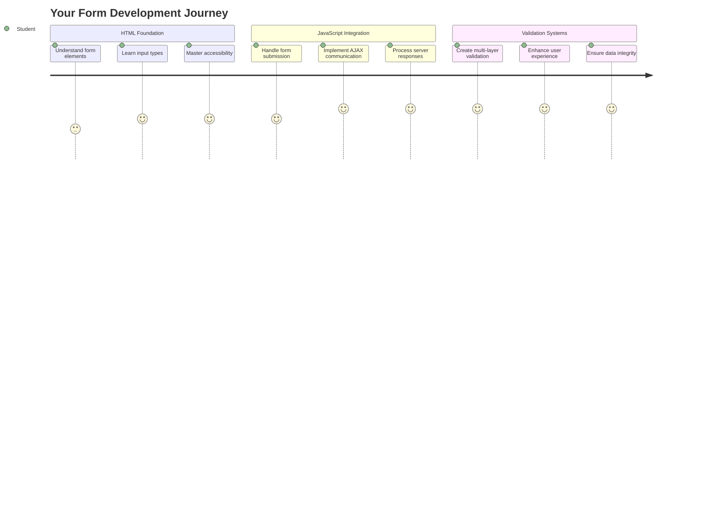
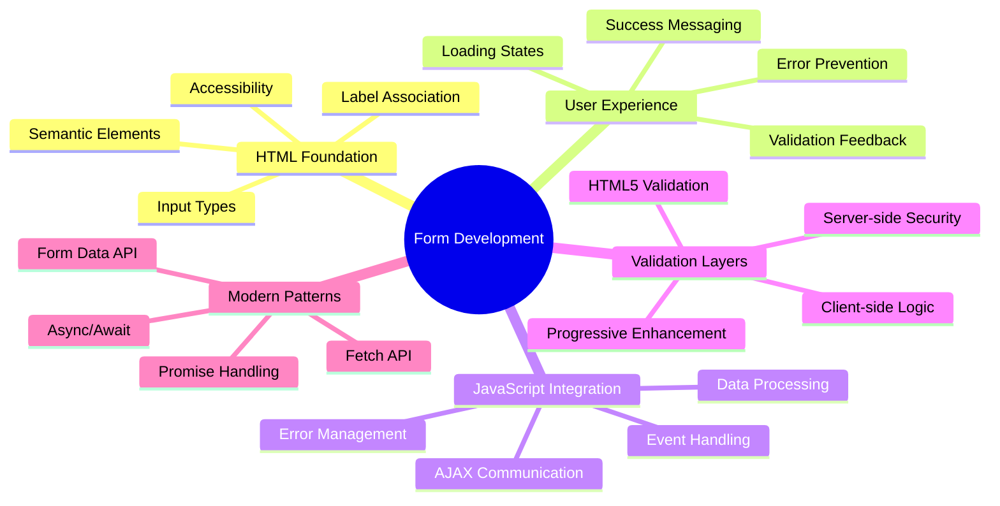
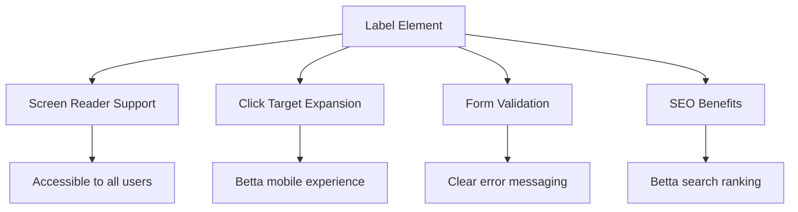
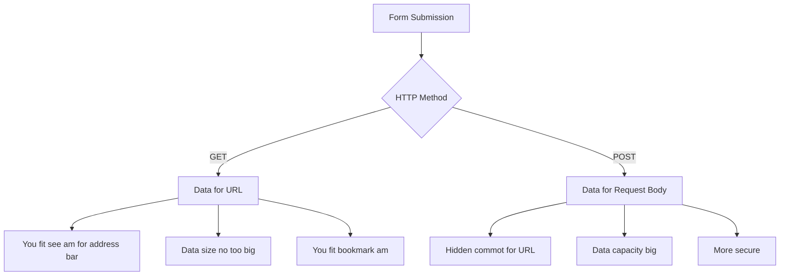
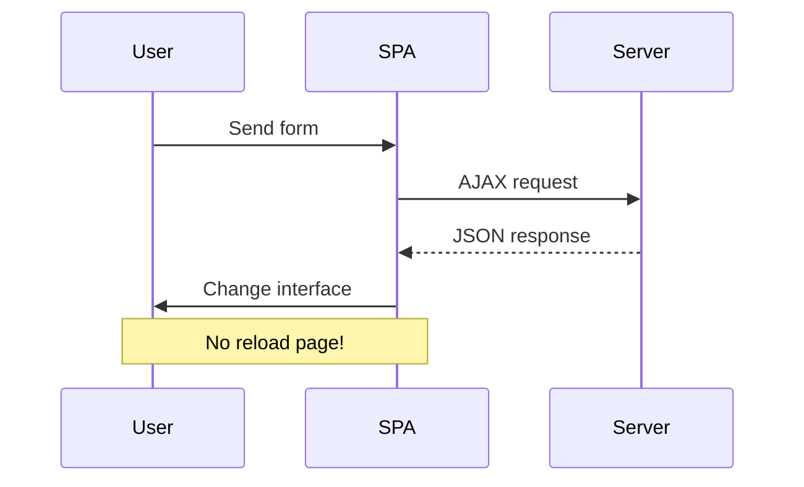
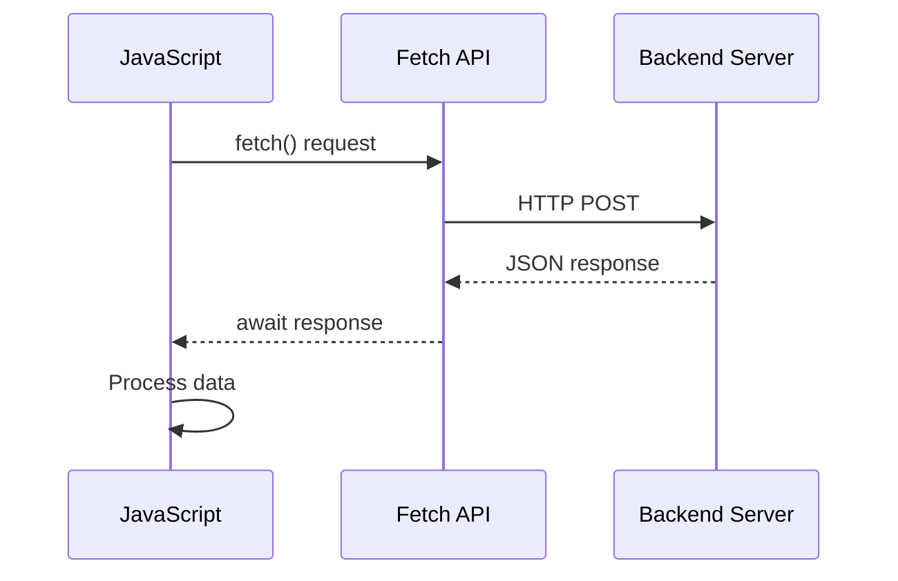
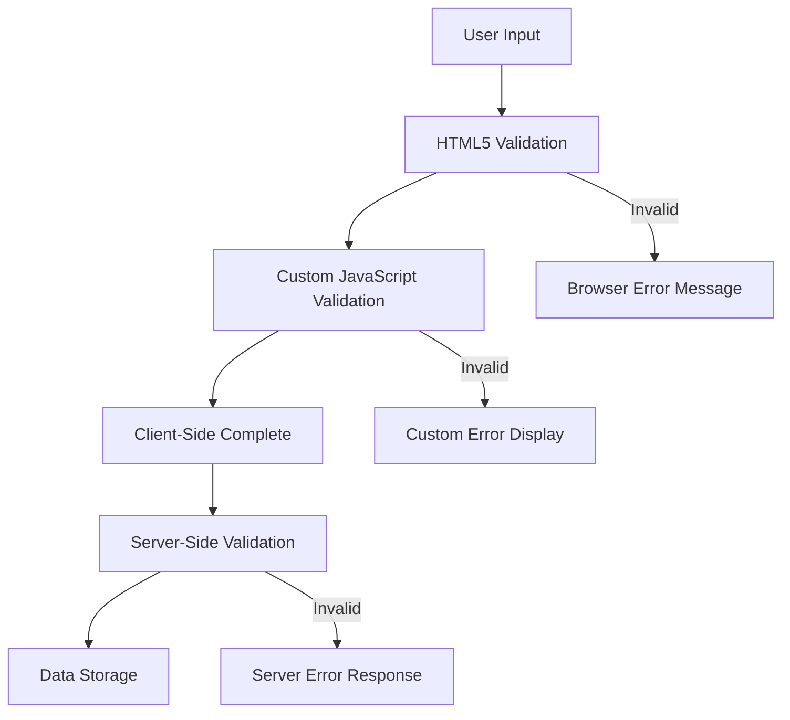
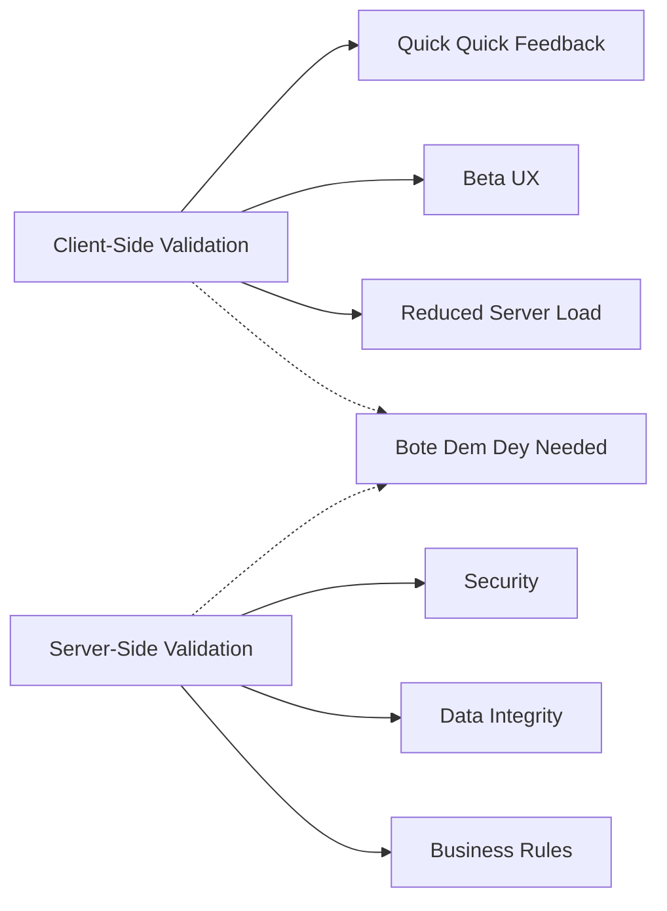
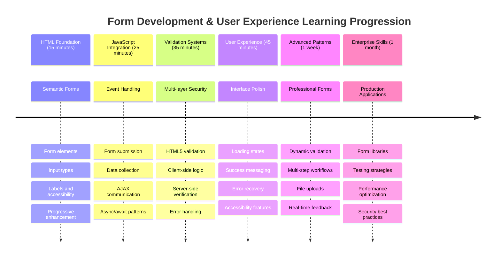
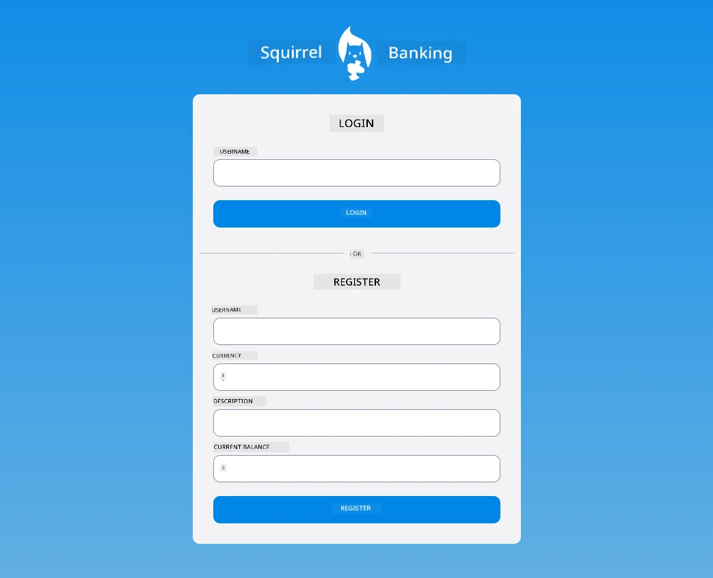

# Build a Banking App Part 2: Build a Login and Registration Form


## Pre-Lecture Quiz

[Pre-lecture quiz](https://ff-quizzes.netlify.app/web/quiz/43)

You don ever fill form for internet before and e no gree accept your email format? Or you don lose all di information wen you click submit? We all don face dis kain wahala before.

Forms na bridge wey dey connect your users and your app functionality. Like how air traffic controllers take guide plane well so dem fit land safe, better-designed forms dey give clear feedback and e dey stop costly mistakes. Bad forms fit make users waka commot quick quick like how communication fail for busy airport.

For dis lesson, we go turn your static banking app to interactive application. You go learn how to build forms wey go check user input well, dey talk with servers, and give better feedback. Think am like building control interface weh go allow users guide your app features.

By di end, you go get complete login and registration system wey get validation wey dey guide users make dem succeed no be make dem frustrated.


## Prerequisites

Before we start to build forms, make sure sey everything set well. Dis lesson na continuation from di last one, so if you jump pass, you fit wan go back make sure di basics dey work well first.

### Required Setup

| Component | Status | Description |
|-----------|--------|-------------|
| [HTML Templates](../1-template-route/README.md) | ✅ Required | Your basic banking app structure |
| [Node.js](https://nodejs.org) | ✅ Required | JavaScript runtime for the server |
| [Bank API Server](../api/README.md) | ✅ Required | Backend service for data storage |

> 💡 **Development Tip**: You go dey run two different servers at the same time – one for your frontend banking app and anoda for backend API. Dis setup mirror how real-life development dey work where frontend and backend services dey independent.

### Server Configuration

**Your development environment go get:**
- **Frontend server**: Na im dey serve your banking app (usually port `3000`)
- **Backend API server**: Na im dey handle data storage and retrieval (port `5000`)
- **Both servers** fit run together without wahala

**To test your API connection:**
```bash
curl http://localhost:5000/api
# Wetin we expect make e respond: "Bank API v1.0.0"
```

**If you see di API version response, you ready to continue!**

---

## Understanding HTML Forms and Controls

HTML forms na how users dey talk to your web application. Think am like telegraph system weh connect far places for 19th century – na communication protocol between user wahala and application response. When dem design am well, dem go catch errors, guide how user suppose enter data, and give better suggestions.

Today forms don better pass simple text inputs. HTML5 bring special input types wey dey handle email validation, number format, and date selection automatically. These improvements dey help both accessibility and mobile users.

### Essential Form Elements

**Building blocks every form need:**

```html
<!-- Basic form structure -->
<form id="userForm" method="POST">
  <label for="username">Username</label>
  <input id="username" name="username" type="text" required>
  
  <button type="submit">Submit</button>
</form>
```

**Wetin dis code dey do:**
- **Creates** form container with unique id
- **Specifies** di HTTP method wey them go use submit data
- **Link** labels with inputs make e dey accessible
- **Get** submit button wey go process di form

### Modern Input Types and Attributes

| Input Type | Purpose | Example Usage |
|------------|---------|---------------|
| `text` | Normal text input | `<input type="text" name="username">` |
| `email` | Email validation | `<input type="email" name="email">` |
| `password` | Hidden text entry | `<input type="password" name="password">` |
| `number` | Number input | `<input type="number" name="balance" min="0">` |
| `tel` | Phone number | `<input type="tel" name="phone">` |

> 💡 **Modern HTML5 Advantage**: Using special input types mean automatic validation, correct mobile keyboards, and better accessibility support without extra JavaScript!

### Button Types and Behavior

```html
<!-- Different button behaviors -->
<button type="submit">Save Data</button>     <!-- Submits the form -->
<button type="reset">Clear Form</button>    <!-- Resets all fields -->
<button type="button">Custom Action</button> <!-- No default behavior -->
```

**Dis na wetin each button type dey do:**
- **Submit buttons**: Dey trigger form submission and send data go specified endpoint
- **Reset buttons**: Dey bring back all form fields to how dem start
- **Normal buttons**: No get default behaviour, need your own JavaScript to work

> ⚠️ **Important Note**: The `<input>` element na self-closing. You no need to close am like `<input />`. Best practice now na to write just `<input>` without slash.

### Building Your Login Form

Make we create practical login form wey show modern HTML form way of doing things. We go start with basic structure then add accessibility and validation slowly.

```html
<template id="login">
  <h1>Bank App</h1>
  <section>
    <h2>Login</h2>
    <form id="loginForm" novalidate>
      <div class="form-group">
        <label for="username">Username</label>
        <input id="username" name="user" type="text" required 
               autocomplete="username" placeholder="Enter your username">
      </div>
      <button type="submit">Login</button>
    </form>
  </section>
</template>
```

**Breakdown of wetin dey happen here:**
- **Organizes** form using semantic HTML5 elements
- **Group** related parts inside `div` with good class names
- **Link** labels with inputs using `for` and `id`
- **Include** modern attributes like `autocomplete` and `placeholder` for better user experience
- **Add** `novalidate` so JavaScript fit handle validation, no be browser default

### The Power of Proper Labels

**Why labels dey important for modern web development:**


**Wetin good labels dey do:**
- **Allow** screen readers to announce form fields well well
- **Expand** clickable area (click label, input go get focus)
- **Make** mobile use easier with bigger touch targets
- **Support** form validation with better error messages
- **Improve** SEO cos e give semantic meaning to form

> 🎯 **Accessibility Goal**: Every form input suppose get label wey match am. This small thing go make your forms usable by everybody, including those wey get disabilities, and e go make experience better for all users.

### Creating the Registration Form

Registration form need plenty detail to make full user account. Make we build am with modern HTML5 features plus better accessibility.

```html
<hr/>
<h2>Register</h2>
<form id="registerForm" novalidate>
  <div class="form-group">
    <label for="user">Username</label>
    <input id="user" name="user" type="text" required 
           autocomplete="username" placeholder="Choose a username">
  </div>
  
  <div class="form-group">
    <label for="currency">Currency</label>
    <input id="currency" name="currency" type="text" value="$" 
           required maxlength="3" placeholder="USD, EUR, etc.">
  </div>
  
  <div class="form-group">
    <label for="description">Account Description</label>
    <input id="description" name="description" type="text" 
           maxlength="100" placeholder="Personal savings, checking, etc.">
  </div>
  
  <div class="form-group">
    <label for="balance">Starting Balance</label>
    <input id="balance" name="balance" type="number" value="0" 
           min="0" step="0.01" placeholder="0.00">
  </div>
  
  <button type="submit">Create Account</button>
</form>
```

**For di form above, we don:**
- **Organize** every field inside container divs for better styling and layout
- **Add** proper `autocomplete` attributes for browser autofill
- **Put** good placeholder text to help user input
- **Set** sensible defaults with `value` attribute
- **Use** validation attributes like `required`, `maxlength`, and `min`
- **Use** `type="number"` for balance field with decimal support

### Exploring Input Types and Behavior

**Modern input types get better features:**

| Feature | Benefit | Example |
|---------|---------|----------|
| `type="number"` | Numeric keypad for mobile | Easier to enter balance |
| `step="0.01"` | Control decimal precision | Allow cents for money |
| `autocomplete` | Browser autofill | Faster to fill form |
| `placeholder` | Context hints | Help user know what to enter |

> 🎯 **Accessibility Challenge**: Try to move around form using only your keyboard! Use `Tab` to waka between fields, `Space` to check box, and `Enter` to submit. Dis experience go help you understand how screen reader users take use forms.

### 🔄 **Pedagogical Check-in**
**Form Foundation Understanding**: Before you start JavaScript, make sure you sabi:
- ✅ How semantic HTML dey create accessible form structure
- ✅ Why input types dey important for mobile keyboards and validation
- ✅ Relationship between labels and form controls
- ✅ How form attributes dey affect browser default behaviour

**Quick Self-Test**: Wetin happen if you submit form without JavaScript?
*Answer: Browser go do default submission, normally e go redirect to action URL*

**HTML5 Form Benefits**: Modern forms get:
- **Built-in Validation**: Automatic email and number format checking
- **Mobile Optimization**: Proper keyboards for input types
- **Accessibility**: Screen reader support and keyboard navigation
- **Progressive Enhancement**: E go still work even if JavaScript no dey

## Understanding Form Submission Methods

When person fill your form and click submit, that data must go somewhere – normally server weh fit save am. Several ways dey do dis, and to sabi which one to use go help you avoid problem later.

Make we look wetin really happen when person click submit button.

### Default Form Behavior

First, make we see wetin happen with normal form submission:

**Test your forms:**
1. Click the *Register* button for your form
2. Look di address bar your browser
3. See how di page fresh and data enter for URL


### HTTP Methods Comparison


**Understand di difference:**

| Method | Use Case | Data Location | Security Level | Size Limit |
|--------|----------|---------------|----------------|-------------|
| `GET` | Search and filters | URL parameters | Low (everybody fit see) | ~2000 characters |
| `POST` | User accounts, sensitive info | Request body | Higher (hidden) | No real limit |

**Summary of difference:**
- **GET**: Data dey go URL as query parameters (good for search)
- **POST**: Data dey inside request body (better for sensitive info)
- **GET problems**: Small size limit, data dey show, dey save in browser history
- **POST pros**: Fit large data, private, fit upload files

> 💡 **Best Practice**: Use `GET` for search and filters (data retrieval), use `POST` for user registration, login, and data creation.

### Configuring Form Submission

Make we setup your registration form so e fit talk well with backend API using POST method:

```html
<form id="registerForm" action="//localhost:5000/api/accounts" 
      method="POST" novalidate>
```

**Dis configuration go do:**
- **Send** form data go your API endpoint
- **Use** POST method for secure data send
- **Add** `novalidate` so JavaScript go handle validation

### Testing Form Submission

**Do dis for test your form:**
1. **Fill** registration form with your info
2. **Click** "Create Account" button
3. **Look** server response for your browser


**Wetin you suppose see:**
- **Browser go redirect** go API endpoint URL
- **JSON response** wey get your new account data
- **Server confirmation** sey account create finish well

> 🧪 **Try am:** Register again with same username. Which response you go get? This to help you understand how server dey handle duplicate data and error cases.

### Understanding JSON Responses

**When server process your form well:**
```json
{
  "user": "john_doe",
  "currency": "$",
  "description": "Personal savings",
  "balance": 100,
  "id": "unique_account_id"
}
```

**Dis response confirm:**
- **Create** new account with your data
- **Assign** unique ID for future use
- **Return** all account info make you check
- **Show** sey e don save inside database

## Modern Form Handling with JavaScript

Old style form submissions dey make page reload full time, like old space missions wey need reset to change course. E dey disturb user experience and e dey cause app lose context.

JavaScript form handling be like modern spacecraft control wey dey adjust course continuously – e no dey lose navigation. We fit stop form submission, give feedback quick, handle errors better, and update interface base on server responses while user still dey inside app.

### Why Avoid Page Reloads?


**Benefits of JavaScript form handling:**
- **Keep** app state and user context
- **Give** quick feedback and show loading signs
- **Fit** handle errors dynamically and do validation
- **Make** smooth, app-like user experience
- **Allow** conditional logic base on server response

### Transitioning from Traditional to Modern Forms

**Problems with traditional way:**
- **Redirect** users away from your app
- **Lose** current app state and context
- **Need** full page reload for simple things
- **Gat limited control over user feedback**

**Good things about modern JavaScript way:**
- **Users stay** inside app
- **Keep** all app state and data
- **Allow** real-time validation and feedback
- **Support** progressive enhancement and accessibility

### Implementing JavaScript Form Handling

Make we replace traditional form submission with modern JavaScript event handling:

```html
<!-- Remove the action attribute and add event handling -->
<form id="registerForm" method="POST" novalidate>
```

**Add registration logic for your `app.js` file:**

```javascript
// Modern event-driven form handling
function register() {
  const registerForm = document.getElementById('registerForm');
  const formData = new FormData(registerForm);
  const data = Object.fromEntries(formData);
  const jsonData = JSON.stringify(data);
  
  console.log('Form data prepared:', data);
}

// Attach event listener wen di page load
document.addEventListener('DOMContentLoaded', () => {
  const registerForm = document.getElementById('registerForm');
  registerForm.addEventListener('submit', (event) => {
    event.preventDefault(); // Prevent default form submission
    register();
  });
});
```

**Breakdown of wetin dey happen here:**
- **Stop** default form submission with `event.preventDefault()`
- **Get** di form element using modern DOM selection
- **Get** form data with powerful `FormData` API
- **Convert** FormData to plain JavaScript object with `Object.fromEntries()`
- **Serialize** data to JSON for sending server
- **Log** processed data for debugging and check

### Understanding the FormData API

**FormData API na strong tool for form handling:**
```javascript
// Example of wetin FormData dey capture
const formData = new FormData(registerForm);

// FormData dey capture automatically:
// {
//   "user": "john_doe",
//   "currency": "$",
//   "description": "Personal account",
//   "balance": "100"
// }
```

**FormData API benefits dem:**
- **Complete collection**: E dey capture all form elements like text, files, and complex inputs
- **Type sabi**: E dey handle different input types automatically without you write custom code
- **Quick work**: E no need make you collect fields manully, na one API call e dey use
- **Flexible**: E go still work as form structure dey change

### How to Build Server Communication Function

Now make we build strong function wey go talk to your API server using modern JavaScript style:

```javascript
async function createAccount(account) {
  try {
    const response = await fetch('//localhost:5000/api/accounts', {
      method: 'POST',
      headers: { 
        'Content-Type': 'application/json',
        'Accept': 'application/json'
      },
      body: account
    });
    
    // Make sure say di response na success
    if (!response.ok) {
      throw new Error(`HTTP error! status: ${response.status}`);
    }
    
    return await response.json();
  } catch (error) {
    console.error('Account creation failed:', error);
    return { error: error.message || 'Network error occurred' };
  }
}
```

**How asynchronous JavaScript work:**


**Wetin dis modern implementation dey do:**
- **E dey use** `async/await` for code wey easy to read dey do async
- **E get** proper error handling wit try/catch blocks
- **E dey check** response status before e process data
- **E set** correct headers for JSON communication
- **E dey give** better error messages for debugging
- **E dey return** consistent data structure for success and error

### Power of Modern Fetch API

**Fetch API better pass old methods:**

| Feature | Benefit | Implementation |
|---------|---------|----------------|
| Promise-based | Clean async code | `await fetch()` |
| Request customization | Full HTTP control | Headers, methods, body |
| Response handling | Flexible data parsing | `.json()`, `.text()`, `.blob()` |
| Error handling | Comprehensive error catching | Try/catch blocks |

> 🎥 **Learn More**: [Async/Await Tutorial](https://youtube.com/watch?v=YwmlRkrxvkk) - Understand how asynchronous JavaScript patterns dey work for modern web development.

**Important things for server communication:**
- **Async functions** fit pause to wait for server response
- **Await keyword** make asynchronous code read like normal synchronous code
- **Fetch API** na modern, promise-based HTTP requests
- **Error handling** ensure app no go crash and dey react well to network wahala

### Complete Registration Function

Make we put everything together wit complete, production-ready registration function:

```javascript
async function register() {
  const registerForm = document.getElementById('registerForm');
  const submitButton = registerForm.querySelector('button[type="submit"]');
  
  try {
    // Show di loading state
    submitButton.disabled = true;
    submitButton.textContent = 'Creating Account...';
    
    // Process di form data
    const formData = new FormData(registerForm);
    const jsonData = JSON.stringify(Object.fromEntries(formData));
    
    // Send am go server
    const result = await createAccount(jsonData);
    
    if (result.error) {
      console.error('Registration failed:', result.error);
      alert(`Registration failed: ${result.error}`);
      return;
    }
    
    console.log('Account created successfully!', result);
    alert(`Welcome, ${result.user}! Your account has been created.`);
    
    // Reset di form after e don register well
    registerForm.reset();
    
  } catch (error) {
    console.error('Unexpected error:', error);
    alert('An unexpected error occurred. Please try again.');
  } finally {
    // Make button state normal again
    submitButton.disabled = false;
    submitButton.textContent = 'Create Account';
  }
}
```

**Dis improved implementation get:**
- **E dey show** visual feedback when form dey submit
- **E dey disable** submit button make person no submit multiply times
- **E dey handle** both expected and unexpected error well
- **E dey show** user-friendly success and error messages
- **E dey reset** form after registration wey succeeed
- **E dey restore** UI status no matter result

### Test Your Implementation

**Open your browser dev tools make you test registration:**

1. **Open** browser console (F12 → Console tab)
2. **Fill** the registration form
3. **Click** "Create Account"
4. **Watch** console messages and user feedback


**Wetin you go see:**
- **Loading state** show for submit button
- **Console logs** show detailed information about wetin dey happen
- **Success message** show wen account create finish well
- **Form reset** automatically after submission

> 🔒 **Security Reminder**: Right now, data dey waka through HTTP, e no secure for production. For real apps, always use HTTPS make data safe. Learn more about [HTTPS security](https://en.wikipedia.org/wiki/HTTPS) and why e important to protect user data.

### 🔄 **Pedagogical Check-in**
**Modern JavaScript Integration**: Confirm say you sabi async form handling:
- ✅ How `event.preventDefault()` take change default form behaviour?
- ✅ Why FormData API dey more efficient than manual field collection?
- ✅ How async/await patterns improve code readability?
- ✅ Wetin error handling role be for user experience?

**System Architecture**: Your form handling dey show:
- **Event-Driven Programming**: Forms dey react to user actions without page reload
- **Asynchronous Communication**: Server request no go block UI
- **Error Handling**: App go still dey work when network request fail
- **State Management**: UI dey update based on server response correctly
- **Progressive Enhancement**: Basic feature work, JavaScript na im dey add better things

**Professional Patterns**: You don implement:
- **Single Responsibility**: Functions get clear and focused job
- **Error Boundaries**: Try/catch blocks stop app crash
- **User Feedback**: Loading states and success/error messages
- **Data Transformation**: FormData to JSON for server talk

## Complete Form Validation

Validating form dey save people from stress of finding error after dem submit. Like how International Space Station get many safety systems, good validation get layers of checks.

Best way na combine browser level validation for quick feedback, JavaScript validation for better user experience, and server validation to secure data. This approach dey protect both user happiness and system safety.

### Understanding Validation Layers


**Multiple layers validation strategy:**
- **HTML5 validation**: Browser checks immediately
- **JavaScript validation**: Custom logic and better user experience
- **Server validation**: Final security and data accuracy check
- **Progressive enhancement**: E still work even if JavaScript turn off

### HTML5 Validation Attributes

**Modern validation tools for your use:**

| Attribute | Purpose | Example Usage | Browser Behavior |
|-----------|---------|---------------|------------------|
| `required` | Fields wey you must fill | `<input required>` | No allow empty submission |
| `minlength`/`maxlength` | Text length limits | `<input maxlength="20">` | Restrict characters number |
| `min`/`max` | Number range | `<input min="0" max="1000">` | Check number inside limits |
| `pattern` | Custom regex rules | `<input pattern="[A-Za-z]+">` | Match specific format |
| `type` | Validate data type | `<input type="email">` | Ensure format correct |

### CSS Validation Styling

**Make visual feedback for validation state:**

```css
/* Valid input styling */
input:valid {
  border-color: #28a745;
  background-color: #f8fff9;
}

/* Invalid input styling */
input:invalid {
  border-color: #dc3545;
  background-color: #fff5f5;
}

/* Focus states for better accessibility */
input:focus:valid {
  box-shadow: 0 0 0 0.2rem rgba(40, 167, 69, 0.25);
}

input:focus:invalid {
  box-shadow: 0 0 0 0.2rem rgba(220, 53, 69, 0.25);
}
```

**Wetin these visual signals dey do:**
- **Green borders**: Show validation pass, like green light for control room
- **Red borders**: Show validation errors wey need attention
- **Focus highlight**: Show where input active clearly
- **Consistent style**: Make interface pattern clear for users to sabi

> 💡 **Pro Tip**: Use `:valid` and `:invalid` CSS pseudo-classes to give instant visual feedback as people dey type, make interface responsive and helpful.

### Implement Complete Validation

Make we improve your registration form with strong validation wey go give better user experience and quality data:

```html
<form id="registerForm" method="POST" novalidate>
  <div class="form-group">
    <label for="user">Username <span class="required">*</span></label>
    <input id="user" name="user" type="text" required 
           minlength="3" maxlength="20" 
           pattern="[a-zA-Z0-9_]+" 
           autocomplete="username"
           title="Username must be 3-20 characters, letters, numbers, and underscores only">
    <small class="form-text">Choose a unique username (3-20 characters)</small>
  </div>
  
  <div class="form-group">
    <label for="currency">Currency <span class="required">*</span></label>
    <input id="currency" name="currency" type="text" required 
           value="$" maxlength="3" 
           pattern="[A-Z$€£¥₹]+" 
           title="Enter a valid currency symbol or code">
    <small class="form-text">Currency symbol (e.g., $, €, £)</small>
  </div>
  
  <div class="form-group">
    <label for="description">Account Description</label>
    <input id="description" name="description" type="text" 
           maxlength="100" 
           placeholder="Personal savings, checking, etc.">
    <small class="form-text">Optional description (up to 100 characters)</small>
  </div>
  
  <div class="form-group">
    <label for="balance">Starting Balance</label>
    <input id="balance" name="balance" type="number" 
           value="0" min="0" step="0.01" 
           title="Enter a positive number for your starting balance">
    <small class="form-text">Initial account balance (minimum $0.00)</small>
  </div>
  
  <button type="submit">Create Account</button>
</form>
```

**Understanding improved validation:**
- **Combine** required field marks with useful descriptions
- **Get** `pattern` attributes for format check
- **Add** `title` attributes for accessibility and tooltips
- **Put** helper text to guide user input
- **Use** semantic HTML structure for better accessibility

### Advanced Validation Rules 

**What each validation rule do:**

| Field | Validation Rules | User Benefit |
|-------|------------------|--------------|
| Username | `required`, `minlength="3"`, `maxlength="20"`, `pattern="[a-zA-Z0-9_]+"` | Make sure id valid and unique |
| Currency | `required`, `maxlength="3"`, `pattern="[A-Z$€£¥₹]+"` | Accept common currency signs |
| Balance | `min="0"`, `step="0.01"`, `type="number"` | Stop negative balances |
| Description | `maxlength="100"` | Reasonable limit for text |

### Test Validation Behavior

**Try these validation cases:**
1. **Submit** form wit empty required fields
2. **Put** username wey too short (less than 3)
3. **Try** special characters for username
4. **Input** negative number for balance


**Wetin you go see:**
- **Browser show** native validation messages
- **Style go change** based on `:valid` and `:invalid`
- **Form no go submit** until all validation pass
- **Focus go move** to first invalid field automatically

### Client-Side vs Server-Side Validation


**Why you need both validation levels:**
- **Client-side validation**: Quick feedback and better user experience
- **Server-side validation**: Secure and handle complex rules
- **Together**: Make app strong, user-friendly, and secure
- **Progressive enhancement**: E still work if JavaScript off

> 🛡️ **Security Reminder**: No trust client-side validation alone! Bad people fit bypass am, so always do server-side validation for safety and data integrity.

### ⚡ **Wetyn You Fit Do in Next 5 Minutes**
- [ ] Test your form with wrong data to see validation messages
- [ ] Try submit form with JavaScript off to see HTML5 validation
- [ ] Open browser DevTools check form data wey dey send to server
- [ ] Try different input types to see mobile keyboard change

### 🎯 **Wetyn You Fit Achieve This Hour**
- [ ] Finish post-lesson test and understand form handling concepts
- [ ] Implement full validation challenge with instant feedback
- [ ] Add CSS style to make professional looking forms
- [ ] Add error handling for duplicate usernames and server issues
- [ ] Add password confirmation with matching validation

### 📅 **Your Week-Long Form Mastery Journey**
- [ ] Build full banking app with advanced form features
- [ ] Add file upload support for profile pics or documents
- [ ] Create multi-step forms with progress and state control
- [ ] Build dynamic forms wey adjust based on user choice
- [ ] Add form autosave and recovery for better user experience
- [ ] Add advanced validation like email and phone formatting

### 🌟 **Your Month-Long Frontend Development Mastery**
- [ ] Build complex form apps wit conditional logic and workflow
- [ ] Learn form libraries and frameworks for faster development
- [ ] Master accessibility guidelines and inclusive design
- [ ] Implement i18n and localization for global forms
- [ ] Create reusable form component libraries and design systems
- [ ] Contribute to open source form projects and share best practice

## 🎯 Your Form Development Mastery Timeline


### 🛠️ Your Form Development Toolkit Summary

After dis lesson, you don master:
- **HTML5 Forms**: Good structure, input types, and accessibility
- **JavaScript Form Handling**: Events, data collection, AJAX communication
- **Validation Architecture**: Multi-layer checks for security and UX
- **Asynchronous Programming**: Modern fetch API and async/await
- **Error Management**: Complete error catching and user feedback
- **User Experience Design**: Loading, success messages, error recovery
- **Progressive Enhancement**: Forms work on all browsers and setups

**Real-World Applications**: Your form skill fit:
- **E-commerce Apps**: Checkout, signup, payment forms
- **Enterprise Software**: Data entry, reports, workflow apps
- **Content Management**: Publishing, user content, admin tools
- **Finance Apps**: Banking, investments, transactions
- **Healthcare**: Patient portals, scheduling, medical forms
- **Education**: Course sign-up, assessments, LMS

**Professional Skills You Get**:
- **Design** accessible forms for all users including disabled
- **Implement** secure validation to stop data corruption and attacks
- **Create** responsive UI wey give clear feedback and guide users
- **Debug** complex forms using browser dev tools and network checks
- **Optimize** form performance through data handling and validation

**Frontend Development Concepts You Master**:
- **Event-Driven Architecture**: User interaction and response
- **Asynchronous Programming**: Non-blocking server talk and error handle
- **Data Validation**: Client and server side security and integrity
- **User Experience Design**: Easy interfaces wey guide success
- **Accessibility Engineering**: Inclusive design for diverse needs

**Next Steps**: You ready to learn advanced form libraries, complex validation, or build enterprise data systems!

🌟 **Achievement Unlocked**: You don build complete form system with pro validation, error handling, and UX patterns!

---


---

## GitHub Copilot Agent Challenge 🚀

Use Agent mode to finish this challenge:

**Description:** Make the registration form better with full client-side validation and user feedback. Dis challenge go help you practice validation, error handling, and improve user experience with interactive feedback.
**Prompt:** Create a complete form validation system for the registration form wey get: 1) Real-time validation feedback for every field as di user dey type, 2) Custom validation messages wey dey show under every input field, 3) Password confirmation field wey dey check if dem match, 4) Visual indicators (like green checkmarks for valid fields and red warnings for invalid ones), 5) Submit button wey go only active when all validations don pass. Use HTML5 validation attributes, CSS to style the validation states, and JavaScript for the interactive behavior.

Learn more about [agent mode](https://code.visualstudio.com/blogs/2025/02/24/introducing-copilot-agent-mode) here.

## 🚀 Challenge

Show error message for the HTML if di user don already exist.

Here be example of how the final login page fit look after small styling:



## Post-Lecture Quiz

[Post-lecture quiz](https://ff-quizzes.netlify.app/web/quiz/44)

## Review & Self Study

Developers don become very creative for their form building, especially for validation strategies. Learn about different form flows by checking [CodePen](https://codepen.com); fit you find some interesting and inspiring forms?

## Assignment

[Style your bank app](assignment.md)

---

<!-- CO-OP TRANSLATOR DISCLAIMER START -->
**Disclaimer**:
Dis document na wetin AI translation service [Co-op Translator](https://github.com/Azure/co-op-translator) help translate. Even though we dey try make am correct, abeg sabi say automated translation fit get errors or no too correct sometimes. The original document for im own language na di correct one wey you suppose trust. For important information, make person wey sabi translation do am human way. We no go responsible if person misunderstand or misinterpret anything because of dis translation.
<!-- CO-OP TRANSLATOR DISCLAIMER END -->