<!--
CO_OP_TRANSLATOR_METADATA:
{
  "original_hash": "86ee5069f27ea3151389d8687c95fac9",
  "translation_date": "2026-01-08T17:12:03+00:00",
  "source_file": "7-bank-project/3-data/README.md",
  "language_code": "pcm"
}
-->
# Build a Banking App Part 3: Methods of Fetching and Using Data

Think about di Enterprise computer for Star Trek - wen Captain Picard ask for ship status, di information show sharp sharp without di whole interface stop to rebuild by itself. Dat smooth flow of information na exactly wetin we dey build here wit dynamic data fetching.

Right now, your banking app dey like one printed newspaper - informative but e no dey change. We go turn am to something like NASA mission control, wey data go dey flow steady steady and dey update for real-time without interrupt di person wey dey use am.

You go sabi how to talk wit servers asynchronously, handle data wey go show at different times, and turn raw information to something wey get meaning for your users. Na di difference between demo and production-ready software dis be.

## ⚡ Wetin You Fit Do For Next 5 Minutes

**Quick Start Pathway for Busy Developers**

```mermaid
flowchart LR
    A[⚡ 5 minutes] --> B[Set up API server]
    B --> C[Test fetch with curl]
    C --> D[Create login function]
    D --> E[See data for action]
```


- **Minute 1-2**: Start your API server (`cd api && npm start`) and test di connection
- **Minute 3**: Create basic `getAccount()` function wit fetch
- **Minute 4**: Connect di login form wit `action="javascript:login()"`
- **Minute 5**: Test login and see account data show for di console

**Quick Test Commands**:
```bash
# Check say API dey run
curl http://localhost:5000/api

# Test to grab account data
curl http://localhost:5000/api/accounts/test
```

**Why Dis Matter**: For 5 minutes, you go see di magic of asynchronous data fetching wey power every modern web app. Na di foundation wey make apps feel responsive and alive.

## 🗺️ Your Learning Journey Through Data-Driven Web Applications


**Your Journey Destination**: By di end of dis lesson, you go understand how modern web apps dey fetch, process, and display data dynamically, creating di smooth user experiences wey we dey expect from pro applications.

## Pre-Lecture Quiz

[Pre-lecture quiz](https://ff-quizzes.netlify.app/web/quiz/45)

### Prerequisites

Before you jump enter data fetching, make sure say you get these components ready:

- **Previous Lesson**: Finish di [Login and Registration Form](../2-forms/README.md) - we go build on top dis
- **Local Server**: Install [Node.js](https://nodejs.org) and [run di server API](../api/README.md) to provide account data
- **API Connection**: Test your server connection wit dis command:

```bash
curl http://localhost:5000/api
# Wetin we expect for response: "Bank API v1.0.0"
```

Dis quick test dey make sure all components dey communicate well:
- Confirm say Node.js dey run correct for your system
- Show say your API server dey active and e dey respond
- Make sure say your app fit reach di server (like checking radio contact before mission)

## 🧠 Data Management Ecosystem Overview


**Core Principle**: Modern web apps na data control systems - dem dey coordinate between user interfaces, server APIs, and browser security settings to create smooth, responsive experiences.

---

## Understanding Data Fetching in Modern Web Apps

How web apps dey handle data don change wella for di past twenty years. Understanding dis change go help you appreciate why modern tools like AJAX and Fetch API powerful and why web developers no fit do without dem.

Make we look how traditional websites dey work compare to di dynamic, responsive apps wey we dey build nowadays.

### Traditional Multi-Page Applications (MPA)

For early days of web, every click be like changing TV channels - di screen go blank then slowly show di new content. Dat na how early web apps be, where every interaction mean say dem go rebuild di whole page from zero.


**Wetin make dis approach be clunky:**
- Every click mean rebuild di whole page from scratch
- Users go dey interrupt for middle of thing because of those annoying page flashes
- Your internet go do overtime to download di same header and footer again and again
- Apps go feel like you dey click through filing cabinet no be real software

### Modern Single-Page Applications (SPA)

AJAX (Asynchronous JavaScript and XML) change dis matter completly. Like di modular design of International Space Station wey astronauts fit change parts without building am again, AJAX let us update special parts of webpage without reloading everything. Even though e get XML for di name, we mostly dey use JSON now, but di main idea na say update only wetin need to change.


**Why SPAs feel better:**
- Only di parts wey change dey update (smart na so)
- No sudden interruption - users fit dey flow steady
- Less data dey move for network so loading fast
- Everything dey sharp and responsive, like apps for phone

### The Evolution to Modern Fetch API

Modern browsers get [`Fetch` API](https://developer.mozilla.org/docs/Web/API/Fetch_API) wey replace old [`XMLHttpRequest`](https://developer.mozilla.org/docs/Web/API/XMLHttpRequest/Using_XMLHttpRequest/). Like di difference between telegraph and email, Fetch API use promise for clean asynchronous code and e sabi handle JSON naturally.

| Feature | XMLHttpRequest | Fetch API |
|---------|----------------|----------|
| **Syntax** | Complex callback-based | Clean promise-based |
| **JSON Handling** | Must parse manually | Get built-in `.json()` method |
| **Error Handling** | Limited info | Plenty error details |
| **Modern Support** | Old browsers | ES6+ promises and async/await |

> 💡 **Browser Compatibility**: Good news - Fetch API dey work for all modern browsers! If you want know specific versions, [caniuse.com](https://caniuse.com/fetch) get full compatibility story.
> 
**Bottom line:**
- E work well for Chrome, Firefox, Safari, Edge (basically everywhere your users dey)
- Only Internet Explorer need special help (and honestly, time to drop IE)
- E prepare you for better async/await style wey we go use later

### Implementing User Login and Data Retrieval

Make we implement login system wey go transform your banking app from static display to functional app. Like the authentication dem dey use for secure military places, we go check user credentials then give access to their data.

We go build am step by step, starting wit basic authentication then add data-fetching ability.

#### Step 1: Create the Login Function Foundation

Open your `app.js` file and add new `login` function wey go handle user authentication:

```javascript
async function login() {
  const loginForm = document.getElementById('loginForm');
  const user = loginForm.user.value;
}
```

**Make we break am down:**
- Dat `async` keyword mean say JavaScript dey expect say dis function fit need wait
- We dey grab di form from di page (no wahala, just find by ID)
- Then we dey pull wetin user type as username
- One correct trick: you fit grab any form input by its `name` attribute - no need extra getElementById palava!

> 💡 **Form Access Pattern**: Every form control fit access by its name (wey dem set for HTML using `name` attribute) as property of form. E make code clean and easy to read.

#### Step 2: Create the Account Data Fetching Function

Next, create function to get account data from server. E go similar your registration function but e focus on data fetching:

```javascript
async function getAccount(user) {
  try {
    const response = await fetch('//localhost:5000/api/accounts/' + encodeURIComponent(user));
    return await response.json();
  } catch (error) {
    return { error: error.message || 'Unknown error' };
  }
}
```

**Wetin dis code dey do:**
- **Use** modern `fetch` API for async data request
- **Build** GET request URL with username parameter
- **Use** `encodeURIComponent()` to handle special characters safe for URLs
- **Convert** response to JSON for easy work
- **Catch** errors well by returning error object instead of crashing

> ⚠️ **Security Note**: `encodeURIComponent()` dey handle special characters for URLs. Like naval communication encoding, e make sure your message arrive safe, so characters like "#" or "&" no go spoil am.
> 
**Why dis matter:**
- Stop special characters from breaking URLs
- Protect from URL manipulation attack
- Make sure server receive correct data
- Follow secure coding style

#### Understanding HTTP GET Requests

One thing wey fit surprise you: wen you use `fetch` without extra option, e dey create a [`GET`](https://developer.mozilla.org/docs/Web/HTTP/Methods/GET) request automatically. Dis fit di kind request wey we want - to ask server "hey, abeg show me this user's account data?"

Think of GET request like polite asker wey want borrow book from library - you dey request to see something wey dey there already. POST request (wey we use for registration) na like you dey submit new book to add for library.

| GET Request | POST Request |
|-------------|--------------|
| **Purpose** | Retrieve data wey exist | Send new data to server |
| **Parameters** | For URL path or query string | For request body |
| **Caching** | Fit cache by browsers | Normally no cache |
| **Security** | Visible for URL and logs | Hidden for request body |


#### Step 3: Bringing It All Together

Now di satisfying part - make we connect your account fetching function to login process. Na here everything just work:

```javascript
async function login() {
  const loginForm = document.getElementById('loginForm');
  const user = loginForm.user.value;
  const data = await getAccount(user);

  if (data.error) {
    return console.log('loginError', data.error);
  }

  account = data;
  navigate('/dashboard');
}
```

Dis function get clear sequence:
- Extract username from form input
- Ask server for user account data
- Handle any error weh fit show
- Save account data and waka go dashboard if success

> 🎯 **Async/Await Pattern**: Since `getAccount` na async function, we use `await` to make code wait till server respond. E prevent code from running wit undefined data.

#### Step 4: Creating a Home for Your Data

Your app need place to keep account info after e load. Think am like your app short-term memory - to hold current user data. Add dis line for top of your `app.js`:

```javascript
// Dis dey hold di current user account data
let account = null;
```

**Why we need am:**
- Make data dey accessible from anywhere for app
- Start wit `null` mean say "no person login yet"
- E go update wen person login or register well
- Na single source of truth - no confusion who log in

#### Step 5: Wire Up Your Form

Now make we connect your sharp new login function to HTML form. Update your form tag like dis:

```html
<form id="loginForm" action="javascript:login()">
  <!-- Your existing form inputs -->
</form>
```

**Wetin dis small change do:**
- Stop form from reloading whole page by default
- Call your custom JavaScript function instead
- Make everything smooth like single-page app
- Make you get full control of wetin happen wen users click "Login"

#### Step 6: Enhance Your Registration Function

For balance, update your `register` function to also save account data and go dashboard:

```javascript
// Add dis lines for di end of your register function
account = result;
navigate('/dashboard');
```

**Dis upgrade give:**
- **Smooth** change from registration to dashboard
- **Consistent** user experience for login and registration
- **Quick** access to account data after registration

#### Testing Your Implementation

```mermaid
flowchart TD
    A[User put credentials] --> B[Login function call]
    B --> C[Fetch account data from server]
    C --> D{Data reach inside well?}
    D -->|Yes| E[Store account data everywhere]
    D -->|No| F[Show error message]
    E --> G[Go dashbɔ̀d]
    F --> H[User remain for login page]
```


**Time to test am:**
1. Make new account to check if e work
2. Try to login wit dat same info
3. Check your browser console (F12) if any wahala show
4. Make sure say you land dashboard after login success

If e no work, no panic! Most wahala na small mistakes like typo or you forget start API server.

#### A Quick Word About Cross-Origin Magic

You fit dey wonder: "How my web app dey talk to dis API server wen dem dey for different ports?" Correct question! Dis na wetin every web developer go face.

> 🔒 **Cross-Origin Security**: Browsers get "same-origin policy" to stop unauthorized talk between different domains. Like checkpoint for Pentagon, dem go verify before allow communication.
> 
**For our setup:**
- Your web app dey `localhost:3000` (development server)
- Your API server dey `localhost:5000` (backend server)
- API server get [CORS headers](https://developer.mozilla.org/docs/Web/HTTP/CORS) wey allow communication from your web app

Dis na real-world setup where frontend and backend dey run on different servers.

> 📚 **Learn More**: Make you dive deeper into APIs and data fetching wit dis wide [Microsoft Learn module on APIs](https://docs.microsoft.com/learn/modules/use-apis-discover-museum-art/?WT.mc_id=academic-77807-sagibbon).

## Bringing Your Data to Life in HTML

Now we go make di fetched data visible to users through DOM manipulation. Like developing photos for darkroom, we dey turn invisible data to something wey users fit see and interact with.
Manipulation for DOM na di technique wey dey turn static web pages to dynamic applications wey go dey update dia content based on how users interact and server responses.

### How to Choose Di Correct Tool for Di Work

When you wan update your HTML wit JavaScript, you get plenty options. Think am like different tools inside toolbox - each one dey perfect for certain kind work:

| Method | Wetin e good for | When to use am | Safety level |
|--------|------------------|----------------|--------------|
| `textContent` | Display user data wey safe | Anytime you dey show text | ✅ Solid well well |
| `createElement()` + `append()` | Build complex layouts | When you wan create new sections/lists | ✅ Bulletproof |
| `innerHTML` | Set HTML content | ⚠️ Try to avoid am | ❌ Risky wahala |

#### Di Safe Way to Show Text: textContent

Di [`textContent`](https://developer.mozilla.org/docs/Web/API/Node/textContent) property na your best padi when you dey show user data. E be like bouncer for your webpage - nothing wey fit harm fit pass:

```javascript
// Di safe, correct way to update text
const balanceElement = document.getElementById('balance');
balanceElement.textContent = account.balance;
```

**Benefits of textContent:**
- Treat everything as plain text (no let script run)
- Automatically clear old content
- Sharp sharp for simple text update
- Get security inside to protect against bad content

#### How to Create Dynamic HTML Elements

For more complex content, join [`document.createElement()`](https://developer.mozilla.org/docs/Web/API/Document/createElement) with [`append()`](https://developer.mozilla.org/docs/Web/API/ParentNode/append) method:

```javascript
// Beta way to make new tin dem
const transactionItem = document.createElement('div');
transactionItem.className = 'transaction-item';
transactionItem.textContent = `${transaction.date}: ${transaction.description}`;
container.append(transactionItem);
```

**How this style work:**
- **Create** new DOM elements wit code
- **Keep** full control for element attributes and content
- **Allow** make complex, nested element structure
- **Save** security by separating structure from content

> ⚠️ **Security Matter**: Although [`innerHTML`](https://developer.mozilla.org/docs/Web/API/Element/innerHTML) dey for many tutorials, e fit run script wey dey inside. Just like CERN get security wey no dey allow unauthorized code, using `textContent` and `createElement` na safer option.
> 
**Risk for innerHTML:**
- E fit run any `<script>` wey dey user data
- Easy to get code injection attack
- Fit cause security wahala
- Safer options like we dey use get same kain power to work

### Make Errors Dey User-Friendly

As e dey now, login errors dey only show for browser console wey users no fit see. Na like pilot own internal diagnostic and passenger info system. We need to tell users important thing for correct way.

If error message dey visible, e go give user quick feedback about wetin spoil and how dem go take fix am.

#### Step 1: Add Place for Error Messages

First, mek we give error messages place for your HTML. Put am before your login button so users go fit see am naturally:

```html
<!-- This is where error messages will appear -->
<div id="loginError" role="alert"></div>
<button>Login</button>
```

**Wetin dey happen here:**
- We dey create empty container wey no dey visible until e need shine
- E dey where users go naturally look after dem click "Login"
- That `role="alert"` na correct touch for screen readers - e dey tell assistive technology say "hey, this one important!"
- The unique `id` dey make am easy for our JavaScript target am

#### Step 2: Create Better Helper Function

Make we create small utility function wey fit update any element text. Na one of those "write once, use everywhere" function wey go save your time:

```javascript
function updateElement(id, text) {
  const element = document.getElementById(id);
  element.textContent = text;
}
```

**Function benefits:**
- Simple way wey need only element ID and text content
- Find DOM elements safely and update dem
- Pattern wey fit take reduce code copy paste
- Dey keep update behavior consistent across app

#### Step 3: Show Errors Where User Fit See

Now mek we change that hidden console message to something user fit see. Update your login function:

```javascript
// Instead of just logging to console, show di user wetin wrong dey
if (data.error) {
  return updateElement('loginError', data.error);
}
```

**This small change get big effect:**
- Error messages dey show for place users dey look
- No more silent quiet failure
- Users go get immediate feedback wey dem fit act on
- Your app go dey professional and well thought out

Now if you test wit wrong account, you go see helpful error message well for page!


#### Step 4: Make E Inclusive wit Accessibility

One correct thing about that `role="alert"` we add before be say e no just dey decorate! This small attribute dey create wetin dem dey call [Live Region](https://developer.mozilla.org/docs/Web/Accessibility/ARIA/ARIA_Live_Regions) wey go immediately announce changes to screen readers:

```html
<div id="loginError" role="alert"></div>
```

**Why e matter:**
- Screen reader users go hear error message as soon as e show
- Everybody go get same important info no matter how dem dey use app navigate
- Na simple way to make your app dey work for more people
- E show say you care to make inclusive experience

Small touch like this na wetin separate good developers from better ones!

### 🎯 Pedagogical Check-in: Authentication Patterns

**Pause and Reflect**: You don just put correct authentication flow. Na foundation pattern for web development.

**Quick Self-Assessment**:
- You fit explain why we dey use async/await for API calls?
- Wetin go happen if we forget to use `encodeURIComponent()` function?
- How our error handling dey improve user experience?

**Real-World Connection**: Patterns wey you learn here (async data fetching, error handling, user feedback) dey everywhere for major web apps from social media to e-commerce sites. Na production-level skill you dey build!

**Challenge Question**: How you fit change this authentication system to handle many user roles (customer, admin, teller)? Think about data structure and UI changes wey go need.

#### Step 5: Apply Same Style for Registration

For consistency, put same error handling pattern for your registration form:

1. **Add** error display element inside your registration HTML:
```html
<div id="registerError" role="alert"></div>
```

2. **Update** your register function to use same error display style:
```javascript
if (data.error) {
  return updateElement('registerError', data.error);
}
```

**Benefits of consistent error handling:**
- **Give** uniform user experience for all forms
- **Reduce** brain pain by using familiar patterns
- **Make** maintenance easy with reusable code
- **Ensure** app meet accessibility standards well well

## How to Create Your Dynamic Dashboard

Now we go turn your static dashboard to dynamic interface wey dey show real account data. Just like printed flight schedule different from live departure boards for airports, we dey move from static info to real-time display wey dey respond.

Using DOM manipulation techniques wey you don learn, we go create dashboard wey go dey automatically update with current account info.

### Get to Know Your Data

Before we start to build, make we look wetin kind data your server dey send back. When person login correct, this na the kind info you go get:

```json
{
  "user": "test",
  "currency": "$",
  "description": "Test account",
  "balance": 75,
  "transactions": [
    { "id": "1", "date": "2020-10-01", "object": "Pocket money", "amount": 50 },
    { "id": "2", "date": "2020-10-03", "object": "Book", "amount": -10 },
    { "id": "3", "date": "2020-10-04", "object": "Sandwich", "amount": -5 }
  ]
}
```

**This data structure get:**
- **`user`**: Perfect for personalize experience ("Welcome back, Sarah!")
- **`currency`**: Make sure money amounts dey display correct
- **`description`**: Friendly name for account
- **`balance`**: Important current balance amount
- **`transactions`**: Complete transaction history with all details

Everything you need to build pro bank dashboard!


> 💡 **Pro Tip**: You want see your dashboard sharp sharp? Use username `test` when you login - e get sample data already loaded so you fit see everything dey work without creating transactions first.
> 
**Why test account dey handy:**
- Get realistic sample data loaded already
- Perfect to see how transactions go display
- Great for testing dashboard features
- E go save you time from making dummy data by hand

### How to Create Dashboard Display Elements

Let’s build your dashboard step by step, start with account summary info and then move to complex parts like transaction lists.

#### Step 1: Update Your HTML Structure

First, change static "Balance" section to dynamic placeholder elements wey your JavaScript fit fill:

```html
<section>
  Balance: <span id="balance"></span><span id="currency"></span>
</section>
```

Next, add section for account description. Since this go act like title for dashboard content, use correct semantic HTML:

```html
<h2 id="description"></h2>
```

**How HTML structure work:**
- **Use** separate `<span>` elements for balance and currency so e fit get individual control
- **Apply** unique IDs for each element so JavaScript fit target dem
- **Follow** semantic HTML by using `<h2>` for account description
- **Create** logical hierarchy for screen readers and SEO

> ✅ **Accessibility Insight**: Account description na title for dashboard content, so e dey marked properly as heading. Learn more about how [heading structure](https://www.nomensa.com/blog/2017/how-structure-headings-web-accessibility) affect accessibility. You fit identify other elements for your page wey need heading tags?

#### Step 2: Create Dashboard Update Function

Now create function wey go fill your dashboard with real account data:

```javascript
function updateDashboard() {
  if (!account) {
    return navigate('/login');
  }

  updateElement('description', account.description);
  updateElement('balance', account.balance.toFixed(2));
  updateElement('currency', account.currency);
}
```

**Step by step, what this function dey do:**
- **Check** if account data dey before e proceed
- **Redirect** unauthenticated users go login page
- **Update** account description using reusable `updateElement` function
- **Format** balance to always show two decimal places
- **Show** appropriate currency symbol

> 💰 **Money Formatting**: That [`toFixed(2)`](https://developer.mozilla.org/docs/Web/JavaScript/Reference/Global_Objects/Number/toFixed) method na lifesaver! E sure your balance always look like real money - "75.00" no be just "75". Users go like seeing proper currency format.

#### Step 3: Make Sure Your Dashboard Update

To make sure dashboard dey fresh with current data anytime person go visit am, we need to connect to your navigation system. If you don do [lesson 1 assignment](../1-template-route/assignment.md), this go be familiar. If no, no worry - here na wetin you need:

Add this to your `updateRoute()` function end:

```javascript
if (typeof route.init === 'function') {
  route.init();
}
```

Then update your routes to include dashboard setup:

```javascript
const routes = {
  '/login': { templateId: 'login' },
  '/dashboard': { templateId: 'dashboard', init: updateDashboard }
};
```

**How this setup sabi work:**
- Check if route get special initialization code
- Run that code automatically when route load
- Make sure your dashboard dey show fresh, current data
- Keep your routing logic clean and organised

#### Test Your Dashboard

After all this change, test your dashboard:

1. **Login** with test account
2. **Confirm** say you redirect go dashboard
3. **Check** if account description, balance, and currency dey show correct
4. **Try logout and login again** to make sure data dey refresh well

Your dashboard now fit display dynamic account info wey update based on logged-in user data!

## Build Smart Transaction Lists with Templates

Instead of you dey create HTML manually for each transaction, we go use templates to generate consistently formatted rows automatically. Just like standardized parts for spacecraft, templates make sure every transaction row get same structure and look.

This way fit scale sharp from few transactions to thousands without wahala, still keep performance and look consistent.


### Step 1: Create Transaction Template

First, add reusable template for transaction rows inside your HTML `<body>`:

```html
<template id="transaction">
  <tr>
    <td></td>
    <td></td>
    <td></td>
  </tr>
</template>
```

**How HTML templates work:**
- **Define** structure for one table row
- **Remain** invisible till clone and populate with JavaScript
- **Get** three cells for date, description, and amount
- **Provide** reusable pattern for consistent look

### Step 2: Prepare Table for Dynamic Content

Next, add `id` to your tbody so JavaScript fit easily target am:

```html
<tbody id="transactions"></tbody>
```

**What this one do:**
- **Create** clear target to insert transaction rows
- **Separate** table structure from dynamic content
- **Allow** easy clearing and refilling of transaction data

### Step 3: Build Transaction Row Factory Function

Now create function to change transaction data to HTML elements:

```javascript
function createTransactionRow(transaction) {
  const template = document.getElementById('transaction');
  const transactionRow = template.content.cloneNode(true);
  const tr = transactionRow.querySelector('tr');
  tr.children[0].textContent = transaction.date;
  tr.children[1].textContent = transaction.object;
  tr.children[2].textContent = transaction.amount.toFixed(2);
  return transactionRow;
}
```

**How factory function work:**
- **Find** template element by ID
- **Clone** template content for safe work
- **Select** table row inside cloned content
- **Fill** each cell with transaction data
- **Format** amount to show correct decimal places
- **Return** ready row to insert

### Step 4: Generate Multiple Transaction Rows Fast

Add this code to your `updateDashboard()` function so e go display all transactions:

```javascript
const transactionsRows = document.createDocumentFragment();
for (const transaction of account.transactions) {
  const transactionRow = createTransactionRow(transaction);
  transactionsRows.appendChild(transactionRow);
}
updateElement('transactions', transactionsRows);
```

**How this efficient approach work:**
- **Create** document fragment to batch DOM operations
- **Loop** through all transactions in account data
- **Make** row for each transaction with factory function
- **Collect** all rows in fragment before adding to DOM
- **Do** one big DOM update instead of many small ones
> ⚡ **Performance Optimization**: [`document.createDocumentFragment()`](https://developer.mozilla.org/docs/Web/API/Document/createDocumentFragment) dey work like how dem dey assemble plane for Boeing - components dem dey prepare for sidon off the main line, den dem go install am as one complete unit. Dis kind batching approach dey minimize DOM reflows by to just do one insertion instead of to dey do plenty separate operations.

### Step 5: Make Update Function Better for Mixed Content

Your `updateElement()` function now na im dey handle only text content. Make you update am to make e fit work with both text and DOM nodes:

```javascript
function updateElement(id, textOrNode) {
  const element = document.getElementById(id);
  element.textContent = ''; // Comot all di pikin them
  element.append(textOrNode);
}
```
  
**Key improvements for this update be:**  
- **E clear** the content wey dey before before as e add new content  
- **E accept** text strings or DOM nodes as parameters  
- **E use** the [`append()`](https://developer.mozilla.org/docs/Web/API/ParentNode/append) method for more flexibility  
- **E still get** backward compatibility with old text-based way of using am  

### Make You Test Your Dashboard

Time don reach for the moment of truth! Make we see how your dynamic dashboard dey work:  

1. Login with `test` account (e get sample data ready)  
2. Go your dashboard  
3. Check say transaction rows dey appear with correct format  
4. Make sure say dates, descriptions, and amounts dem look well  

If everything dey work, you go see full transaction list wey dey work well for your dashboard! 🎉

**Wetin you don achieve:**  
- You don build dashboard wey fit handle any amount of data  
- You create reusable templates to keep format consistent  
- You use better DOM manipulation skills  
- You build functionality wey fit compete with production banking apps  

You don convert static webpage come dynamic web application successfully.

### 🎯 Pedagogical Check-in: How You Take Generate Dynamic Content

**How System Arrange E:** You don create better data-to-UI pipeline wey dey similar to wetin frameworks like React, Vue, and Angular dey use.  

**Main Concepts We You Don Learn:**  
- **Template-based rendering**: To create reusable UI components  
- **Document fragments**: To optimize DOM performance  
- **Safe DOM manipulation**: Make e no get security problem  
- **Data transformation**: Convert server data make e become user interface  

**Industry Connection:** Dis kain skills na wetin modern frontend frameworks base on. React virtual DOM, Vue template system and Angular component architecture na all dis main ideas dey build on top.  

**Reflection Question:** How you fit make system fit handle real-time updates (like when new transactions show automatically)? Think WebSockets or Server-Sent Events.

---

## 📈 Your Data Management Mastery Timeline


**🎓 Graduation Milestone:** You don successfully build data-driven web application using modern JavaScript patterns. This kin skills fit directly use for frameworks like React, Vue or Angular.  

**🔄 Next Level Skills:**  
- You ready to explore frontend frameworks wey go build on these ideas  
- You fit add real-time features wit WebSockets  
- You get skill to build Progressive Web Apps wey fit work offline  
- You get foundation for to dey learn advanced state management patterns  

## GitHub Copilot Agent Challenge 🚀

Use Agent mode do this challenge:

**Description:** Make the banking app beta with search and filter feature so dat users fit find specific transactions by date range, amount or description.  

**Prompt:** Create search functionality for banking app wey get: 1) Search form with input fields for date range (from/to), minimum/maximum amount, and transaction description keywords; 2) `filterTransactions()` function wey go filter account.transactions array based on search criteria; 3) Update `updateDashboard()` function to show filtered results; 4) Add a "Clear Filters" button to reset view. Use modern JavaScript array methods like `filter()` and handle corner cases for empty search criteria.

Learn more about [agent mode](https://code.visualstudio.com/blogs/2025/02/24/introducing-copilot-agent-mode) here.

## 🚀 Challenge

You ready to take your banking app go next level? Make e dey look and feel as someting wey you really wan use. Here na some ideas to help your creativity:

**Make am fine:** Add CSS styling to make dashboard wey actually fine to look. Think clean lines, good spacing, and maybe small animations too.  

**Make am respond well:** Try use [media queries](https://developer.mozilla.org/docs/Web/CSS/Media_Queries) to build [responsive design](https://developer.mozilla.org/docs/Web/Progressive_web_apps/Responsive/responsive_design_building_blocks) wey fit run well for phones, tablets and desktops. Your users go thank you!  

**Add small style:** Try dey color code transactions (green for income, red for expense), add icons, or create hover effects wey go make interface dey interactive.  

See how better dashboard fit look:


No feel say you suppose copy am exactly - use am for inspiration and do your own style!

## Post-Lecture Quiz

[Post-lecture quiz](https://ff-quizzes.netlify.app/web/quiz/46)

## Assignment

[Refactor and comment your code](assignment.md)

---

<!-- CO-OP TRANSLATOR DISCLAIMER START -->
**Disclaimer**:
Dis dokument na im dey translate wit AI translation service wey dem call [Co-op Translator](https://github.com/Azure/co-op-translator). Even though we dey try make am correct, abeg sabi say automated translation fit get mistake or no too exact. Di original dokument wey e original language na di correct source. If na serious matter, better make human expert translate am. We no go responsible if pesin no understandwell or mistake come because of dis translation.
<!-- CO-OP TRANSLATOR DISCLAIMER END -->