<!--
CO_OP_TRANSLATOR_METADATA:
{
  "original_hash": "b807b09df716dc48a2b750835bf8e933",
  "translation_date": "2026-01-08T17:33:42+00:00",
  "source_file": "7-bank-project/4-state-management/README.md",
  "language_code": "pcm"
}
-->
# Build a Banking App Part 4: Concepts of State Management

## ⚡ Wetin You Fit Do for Di Next 5 Minutes

**Quick Start Pathway for Busy Developers**

```mermaid
flowchart LR
    A[⚡ 5 minutes] --> B[Diagnose state wahala]
    B --> C[Create central state object]
    C --> D[Add updateState function]
    D --> E[See immediate improvements]
```


- **Minute 1**: Test di current state wahala - log in, refresh page, see logout
- **Minute 2**: Change `let account = null` to `let state = { account: null }`
- **Minute 3**: Make one simple `updateState()` function for controlled updates
- **Minute 4**: Change one function to use di new pattern
- **Minute 5**: Test di better predictability and debugging power

**Quick Diagnostic Test**:
```javascript
// Before: Scatter state
let account = null; // Lost when you refresh!

// After: Centralize state
let state = Object.freeze({ account: null }); // Control and fit track am!
```

**Why This Matters**: For 5 minutes, you go experience di change from chaotic state management go predictable, debuggable patterns. Na dis foundation wey make complex apps fit still dey manageable.

## 🗺️ Your Learning Journey Through State Management Mastery


**Your Journey Destination**: By di end of dis lesson, you go build professional-grade state management system wey dey handle persistence, data freshness, and predictable updates - na di same pattern wey production apps dey use.

## Pre-Lecture Quiz

[Pre-lecture quiz](https://ff-quizzes.netlify.app/web/quiz/47)

## Introduction

State management be like di navigation system wey dey for Voyager spacecraft – when everything dey work smooth, you no go too notice am. But when wahala show, na im go make difference between reaching interstellar space and drifting lost for cosmic void. For web development, state mean everything wey your app need to remember: user login status, form data, navigation history, and temporary interface states.

As your banking app don grow from simple login form to more advanced application, you for already meet some common challenges. You refresh page, users dey logout unexpectedly. You close browser, progress disappear. You want debug problem, you dey search many functions wey dey change di same data in different ways.

Dis no mean say coding bad – na nature wahala wey show anytime app reach certain level of complexity. Every developer dey face dis kind challenge as dem app dey change from "proof of concept" to "production ready."

For dis lesson, we go implement centralized state management system wey go turn your banking app to reliable, professional application. You go learn how to manage data flows predictably, keep user sessions correct, and make smooth user experience wey modern web apps need.

## Prerequisites

Before you dive into state management concepts, you need get your development environment set up well and your banking app base ready. Dis lesson dey build directly on concepts and code wey dey previous parts of dis series.

Make sure say you get dis things ready before you continue:

**Required Setup:**
- Complete di [data fetching lesson](../3-data/README.md) - your app suppose fit load and display account data well
- Install [Node.js](https://nodejs.org) for your system to run backend API
- Start di [server API](../api/README.md) locally to handle account data work

**Testing Your Environment:**

Make sure say your API server dey run correct by running dis command for terminal:

```sh
curl http://localhost:5000/api
# -> e suppose return "Bank API v1.0.0" as result
```

**Wetin dis command dey do:**
- **Send** GET request to your local API server
- **Test** connection and check if server dey respond
- **Return** API version info if everything dey work right

## 🧠 State Management Architecture Overview


**Core Principle**: Professional state management dey balance predictability, persistence, and performance to create reliable user experiences wey fit scale from simple interactions to complex app workflows.

---

## Diagnosing the Current State Issues

Like Sherlock Holmes wey dey inspect crime scene, we need understand wetin exactly dey happen for current implementation before we fit solve di mystery of disappearing user sessions.

Make we do simple experiment wey go show di main state management wahala:

**🧪 Try This Diagnostic Test:**
1. Log into your banking app and go dashboard
2. Refresh browser page
3. Observe wetin happen to your login status

If you carry you redirect back to login screen, you don find di classic state persistence problem. Dis one happen because our current implementation dey store user data for JavaScript variables wey dey reset anytime page load.

**Current Implementation Problems:**

Di simple `account` variable wey we get for our [previous lesson](../3-data/README.md) dey cause three big wahala wey affect both user experience and code maintainability:

| Wahala | Technical Cause | User Impact |
|---------|--------|----------------|
| **Session Loss** | Page refresh dey clear JavaScript variables | Users go dey re-authenticate every now and then |
| **Scattered Updates** | Many functions dey change state directly | Debugging go dey harder and harder |
| **Incomplete Cleanup** | Logout no dey clear all state references | Potential security and privacy wahala |

**The Architectural Challenge:**

Like how Titanic get compartment system wey look strong until plenty compartments fill with water at once, to fix dis problems one by one no go solve di main architectural problem. We need big state management solution.

> 💡 **Wetin we really dey try do here?**

[State management](https://en.wikipedia.org/wiki/State_management) na to solve two main puzzles:

1. **Where's My Data?**: Make we sabi wetin information we get and where e come from
2. **Is Everyone on the Same Page?**: Make sure wetin users see na wetin dey really happen

**Our Game Plan:**

Instead to dey run round everywhere, we go create **centralized state management** system. Think am like one organized person wey dey control everything wey important:


**Understand dis data flow:**
- **Centralize** all application state for one place
- **Route** all state changes through controlled functions
- **Ensure** UI dey synchronized with current state
- **Provide** clear, predictable pattern for data management

> 💡 **Professional Insight**: Dis lesson na fundamentals. For complex apps, libraries like [Redux](https://redux.js.org) get more advanced state management features. If you understand core principle dem, you go fit master any state management library.

> ⚠️ **Advanced Topic**: We no go talk about automatic UI updates wey dey happen because of state changes, as dis one na [Reactive Programming](https://en.wikipedia.org/wiki/Reactive_programming) matter. You fit take am as next level for your learning journey!

### Task: Centralize State Structure

Make we start to transform our scattered state management into one centralized system. Dis first step go build foundation for all di better things wey dem go follow.

**Step 1: Create a Central State Object**

Change di simple `account` declaration for:

```js
let account = null;
```

To structured state object:

```js
let state = {
  account: null
};
```

**Why dis change matter:**
- **Centralize** all app data for one place
- **Prepare** structure to add more state properties later
- **Create** clear boundary between state and other variables
- **Build** pattern wey fit grow as your app dey grow

**Step 2: Update State Access Patterns**

Change your functions to use di new state structure:

**For `register()` and `login()` functions**, change this:

```js
account = ...
```

To dis one:

```js
state.account = ...
```

**For `updateDashboard()` function**, add dis line for top:

```js
const account = state.account;
```

**Wetin these updates dey do:**
- **Maintain** existing function but improve structure
- **Prepare** your code for advanced state management
- **Create** consistent patterns to access state data
- **Build** foundation for centralized state updates

> 💡 **Note**: Dis refactoring no solve all wahala immediately, but e go build strong foundation for better improvements wey go come!

### 🎯 Pedagogical Check-in: Centralization Principles

**Pause and Reflect**: You don just implement foundation for centralized state management. Na important architectural decision be dis.

**Quick Self-Assessment**:
- You fit talk why e good to centralize state inside one object, no scatter am for many variables?
- Wetin go happen if you forget to update function to use `state.account`?
- How dis pattern dey prepare your code for more advanced features?

**Real-World Connection**: Di centralization pattern wey you learn na di foundation for modern frameworks like Redux, Vuex, and React Context. You dey build the same architectural thinking wey big app dem dey use.

**Challenge Question**: If you want add user preferences (theme, language) for your app, where you go put am for state structure? How e go scale?

## Implementing Controlled State Updates

With state already centralized, di next step na to set controlled way for data changes. Dis one go make state changes dey predictable and debugging easy.

Main principle na like air traffic control: no multiple functions dey change state anyhow, but make all changes dey go through one controlled function. Dis pattern dey provide clear oversight of when and how data change.

**Immutable State Management:**

We go treat our `state` object as [*immutable*](https://en.wikipedia.org/wiki/Immutable_object), meaning say we no go dey change am directly. Each time we want change am, we go create new state object with updated data.

Though dis one fit look like e no dey efficient compared to direct change, e get better benefit for debugging, testing, and make app dey predictable.

**Benefits of immutable state management:**

| Benefit | Description | Impact |
|---------|-------------|--------|
| **Predictability** | Changes dey happen only through controlled functions | Debug and test go easy |
| **History Tracking** | Each state change get new object | Fit do undo/redo functions |
| **Side Effect Prevention** | No accidental changes | Avoid mysterious bugs |
| **Performance Optimization** | Easy to detect when state really change | Fit do efficient UI updates |

**JavaScript Immutability with `Object.freeze()`:**

JavaScript get [`Object.freeze()`](https://developer.mozilla.org/docs/Web/JavaScript/Reference/Global_Objects/Object/freeze) wey fit stop object changes:

```js
const immutableState = Object.freeze({ account: userData });
// Any try to change immutableState go throw error
```

**Wetin dey happen here:**
- **Stop** direct property assignment or deletion
- **Throw** error if modification try happen
- **Ensure** state changes must enter controlled functions
- **Create** clear contract how state go fit update

> 💡 **Deep Dive**: Learn difference between *shallow* and *deep* immutable objects for [MDN documentation](https://developer.mozilla.org/docs/Web/JavaScript/Reference/Global_Objects/Object/freeze#What_is_shallow_freeze). To sabi dis difference na important for complex state structures.


### Task

Make we create one new `updateState()` function:

```js
function updateState(property, newData) {
  state = Object.freeze({
    ...state,
    [property]: newData
  });
}
```

For dis function, we dey create new state object and copy data from old state using [*spread (`...`) operator*](https://developer.mozilla.org/docs/Web/JavaScript/Reference/Operators/Spread_syntax#Spread_in_object_literals). Then we dey override one particular property of state with new data using [bracket notation](https://developer.mozilla.org/docs/Web/JavaScript/Guide/Working_with_Objects#Objects_and_properties) `[property]` for assign. Finally, we dey lock the object to prevent change with `Object.freeze()`. Right now, we only get `account` property for state, but with dis method, you fit add as many properties as you want.

We also go update `state` initialization to make sure initial state sef dey frozen:

```js
let state = Object.freeze({
  account: null
});
```

After that, update `register` function by replacing `state.account = result;` with:

```js
updateState('account', result);
```

Do same thing for `login`, replace `state.account = data;` with:

```js
updateState('account', data);
```

Now, we go take chance fix issue wey account data no dey clear when user click *Logout*.

Create new function `logout()`:

```js
function logout() {
  updateState('account', null);
  navigate('/login');
}
```

For `updateDashboard()`, replace redirection `return navigate('/login');` with `return logout()`;

Try register new account, logout, and log back in to check say everything still dey work well.

> Tip: You fit see all state changes by putting `console.log(state)` for bottom of `updateState()` and open console for your browser development tools.

## Implementing Data Persistence

Session loss wahala we identify earlier need persistence solution wey go keep user state across browser sessions. Dis one go turn our app from temporary experience to reliable, professional tool.

Think how atomic clocks dey keep precise time even during power failure by storing important state for non-volatile memory. Likewise, web apps need storage wey fit preserve key user data across browser sessions and page refresh.

**Strategic Questions for Data Persistence:**

Before you do persistence, reason these main questions:

| Question | Banking App Context | Decision Impact |
|----------|-------------------|----------------|
| **Is the data sensitive?** | Account balance, transaction history | Choose secure storage methods |
| **How long e go last?** | Login state vs. temporary UI preferences | Choose correct storage duration |
| **Server need am?** | Authentication tokens vs. UI settings | Decide if e go share |

**Browser Storage Options:**

Modern browsers get different storage ways wey dem build for different use:

**Primary Storage APIs:**

1. **[`localStorage`](https://developer.mozilla.org/docs/Web/API/Window/localStorage)**: Persistent [Key/Value storage](https://en.wikipedia.org/wiki/Key%E2%80%93value_database)
   - **Data dey stay** across browser sessions forever  
   - **No lost** when browser or computer clear or restart
   - **Na for** that one website domain only
   - **Good** for user preferences and login states

2. **[`sessionStorage`](https://developer.mozilla.org/docs/Web/API/Window/sessionStorage)**: Temporary session storage
   - **Works** the same as localStorage when session dey
   - **Clear** when browser tab close
   - **Perfect** for temporary data wey no suppose last

3. **[HTTP Cookies](https://developer.mozilla.org/docs/Web/HTTP/Cookies)**: Server-shared storage
   - **Send** automatically with every server request
   - **Good** for [authentication](https://en.wikipedia.org/wiki/Authentication) tokens
   - **Small** size and fit slow performance

**Data Serialization Requirement:**

Both `localStorage` and `sessionStorage` dey store only [strings](https://developer.mozilla.org/docs/Web/JavaScript/Reference/Global_Objects/String):

```js
// Change objects to JSON strings make e fit store
const accountData = { user: 'john', balance: 150 };
localStorage.setItem('account', JSON.stringify(accountData));

// Turn JSON strings back to objects wen you dey find am out
const savedAccount = JSON.parse(localStorage.getItem('account'));
```

**How serialization dey work:**
- **Converts** JavaScript objects to JSON strings with [`JSON.stringify()`](https://developer.mozilla.org/docs/Web/JavaScript/Reference/Global_Objects/JSON/stringify)
- **Transforms back** objects from JSON with [`JSON.parse()`](https://developer.mozilla.org/docs/Web/JavaScript/Reference/Global_Objects/JSON/parse)
- **Fit handle** complex nested objects and arrays automatically
- **No fit handle** functions, undefined values, and circular references

> 💡 **Advanced Option**: For complex offline apps with big data, try [`IndexedDB` API](https://developer.mozilla.org/docs/Web/API/IndexedDB_API). E be full client-side database but e need more complex implementation.


### Task: Build localStorage Persistence

Make we build persistent storage so people no go log out until dem do am purposely. We go use `localStorage` to store account data across browser sessions.

**Step 1: Define Storage Configuration**

```js
const storageKey = 'savedAccount';
```

**What dis constant dey do:**
- **Create** sure identifier for our stored data
- **Help avoid** typos for storage key
- **Easy to change** storage key if we need
- **Follow** good code practice

**Step 2: Add Automatic Persistence**

Put this line for the end of `updateState()` function:

```js
localStorage.setItem(storageKey, JSON.stringify(state.account));
```

**Wetin dis line dey do:**
- **Change** account object to JSON string for storage
- **Save** data with our storage key
- **Run** anytime state change happen
- **Make sure** stored data always correct with state

> 💡 **Architecture Benefit**: Because all state update na through `updateState()`, only one line of code to add persistence. This show how good architecture work!

**Step 3: Restore State on App Load**

Make initialization function to bring back saved data:

```js
function init() {
  const savedAccount = localStorage.getItem(storageKey);
  if (savedAccount) {
    updateState('account', JSON.parse(savedAccount));
  }

  // Our previous initialization code na di one webin we start wit bifo
  window.onpopstate = () => updateRoute();
  updateRoute();
}

init();
```

**How initialization dey work:**
- **Get** any saved account data inside localStorage
- **Parse** JSON string back to JavaScript object
- **Update** state with controlled update function
- **Restore** user session automatically on page load
- **Run** before route changes to make state ready

**Step 4: Optimize Default Route**

Update default route to use persistence well:

For `updateRoute()`, replace:
```js
// Replace: return waka go('/login');
return navigate('/dashboard');
```

**Why this change dey okay:**
- **Use** new persistence system correctly
- **Let** dashboard handle authentication checks
- **Automatically** redirect to login if no session saved
- **Create** better user experience

**Testing Your Implementation:**

1. Login your banking app
2. Refresh browser page
3. Confirm say you still dey logged in and dashboard dey show
4. Close and open your browser again
5. Go back your app and check say you still dey logged in

🎉 **You Don Do Am!**: You don build correct persistent state management! Your app dey behave like professional web app now.

### 🎯 Pedagogical Check-in: Persistence Architecture

**Architecture Understanding**: You don create strong persistence layer wey balance user experience and data management.

**Key Concepts Mastered**:
- **JSON Serialization**: How to change complex objects to strings wey fit store
- **Automatic Synchronization**: State changes trigger storage save
- **Session Recovery**: App fit restore user context after interruption
- **Centralized Persistence**: One function handle all storage

**Industry Connection**: This persistence style na core for Progressive Web Apps (PWAs), offline-first apps, and modern mobile web apps. You dey build pro functionality.

**Reflection Question**: How you go take adjust am to handle many user accounts on one device? Think about privacy and security.

## Balancing Persistence with Data Freshness

Our persistence system dey keep user session well, but e bring wahala: data fit stale. When many users or apps change same server data, local cache go old.

Na like Viking sailors wey rely both on stored star charts and current sky observation. The charts give steady info but sailors still need fresh sight to dey correct for changes. Same way, our app need both persistent user state and current server data.

**🧪 Discovering Data Freshness Problem:**

1. Login dashboard with `test` account
2. Run dis command for terminal to simulate other source transaction:

```sh
curl --request POST \
     --header "Content-Type: application/json" \
     --data "{ \"date\": \"2020-07-24\", \"object\": \"Bought book\", \"amount\": -20 }" \
     http://localhost:5000/api/accounts/test/transactions
```

3. Refresh your dashboard page for browser
4. See if new transaction show

**Wetin this test show:**
- **Show** how local storage fit become "stale" (old)
- **Simulate** real life wen data change comot for app
- **Show** tension between persistence and data freshness

**The Data Staleness Challenge:**

| Problem | Cause | User Impact |
|---------|-------|-------------|
| **Stale Data** | localStorage no dey expire automatically | Users dey see old info |
| **Server Changes** | Other users/apps modify same data | Views no dey consistent for different platform |
| **Cache vs. Reality** | Local cache no match server state | Bad user experience and confusion |

**Solution Strategy:**

We go do "refresh on load" pattern to balance persistence benefits with fresh data need. This go keep smooth experience and make sure data correct.


### Task: Implement Data Refresh System

We go create system wey go automatically fetch fresh data from server while still keep our persistent state benefits.

**Step 1: Create Account Data Updater**

```js
async function updateAccountData() {
  const account = state.account;
  if (!account) {
    return logout();
  }

  const data = await getAccount(account.user);
  if (data.error) {
    return logout();
  }

  updateState('account', data);
}
```

**How this function work:**
- **Check** if user logged in (state.account dey)
- **Redirect** to logout if no correct session
- **Fetch** fresh account data with existing `getAccount()` function
- **Handle** server errors softly by logging out invalid session
- **Update** state with fresh data using our controlled update way
- **Trigger** automatic localStorage save through `updateState()`

**Step 2: Create Dashboard Refresh Handler**

```js
async function refresh() {
  await updateAccountData();
  updateDashboard();
}
```

**What this refresh function do:**
- **Manage** data refresh and UI update
- **Wait** fresh data before update display
- **Make sure** dashboard dey show latest info
- **Keep** data management and UI updates separate

**Step 3: Integrate with Route System**

Change your route config to trigger refresh automatically:

```js
const routes = {
  '/login': { templateId: 'login' },
  '/dashboard': { templateId: 'dashboard', init: refresh }
};
```

**How this integration work:**
- **Run** refresh function every time dashboard route load
- **Make sure** fresh data dey any time user open dashboard
- **Keep** old route structure and add data freshness
- **Set** solid pattern for route init

**Testing Your Data Refresh System:**

1. Login your banking app
2. Run curl command earlier to add new transaction
3. Refresh dashboard page or go away come back
4. Confirm new transaction show sharp sharp

🎉 **Perfect Balance!** Your app combine smooth persistent state with fresh server data accuracy now!

## 📈 Your State Management Mastery Timeline


**🎓 Graduation Milestone**: You don strong build complete state management system like Redux, Vuex, and other pro libraries. These patterns fit small app to big enterprise app.

**🔄 Next Level Skills**:
- Ready to master Redux, Zustand, Pinia and other state frameworks
- Prepared to do real-time with WebSockets
- Ready to build offline-first Progressive Web Apps
- Steady for advanced patterns like state machines and observers

## GitHub Copilot Agent Challenge 🚀

Use Agent mode to solve dis challenge:

**Description:** Build strong state management system wey get undo/redo for banking app. The challenge go help you practice advanced state ideas like history tracking, immutable updates, and UI sync.

**Prompt:** Make better state system wey get: 1) state history array to track past states, 2) undo/redo functions to reverse states, 3) UI buttons for undo/redo on dashboard, 4) max history limit of 10 to control memory, 5) clear history on logout. Make undo/redo work with account balance changes and still keep after browser refresh.

More info about [agent mode](https://code.visualstudio.com/blogs/2025/02/24/introducing-copilot-agent-mode) dey this link.

## 🚀 Challenge: Storage Optimization

Your build dey handle user sessions, data refresh, and state management well. But think if our current method really balance storage use with functionality.

Like chess players wey sabi pick important pieces and leave pawns, good state management go need to sabi which data must persist and which data better to always fresh from server.

**Optimization Analysis:**

Check your localStorage now and ask yourself:
- Which minimum info wey suppose hold user authentication?
- Which data dey change often wey local cache no really help?
- How storage optimization fit make performance better without spoil user experience?

Dis kind architectural thinking dey separate senior devs wey dey consider functionality and efficiency well.

**Implementation Strategy:**
- **Find** essential data wey must persist (usually just user id)
- **Change** localStorage to store only important session data
- **Make sure** fresh data fetch from server anytime dashboard open
- **Test** say your optimized method still give good user experience

**Advanced Consideration:**
- **Compare** storing full account data vs. only auth tokens
- **Write down** your choices and reasons for others later

Dis challenge go train you to think like professional dev wey sabi balance user experience and app efficiency. Take your time try different ways!

## Post-Lecture Quiz

[Post-lecture quiz](https://ff-quizzes.netlify.app/web/quiz/48)

## Assignment

[Implement "Add transaction" dialog](assignment.md)

Here na example result after you finish the assignment:


---

<!-- CO-OP TRANSLATOR DISCLAIMER START -->
**Disclaimer**:
Dis document na toktok wey AI translation service [Co-op Translator](https://github.com/Azure/co-op-translator) help do. Even though we try make am correct, abeg sabi say automatic translation fit get some mistakes or error. Di original document wey dem write for im own language na di real correct one. If na serious matter, make person wey sabi do translation well do am. We no go fit carry any gbege or wahala if pesin no understand well or get wrong meaning from dis translation.
<!-- CO-OP TRANSLATOR DISCLAIMER END -->