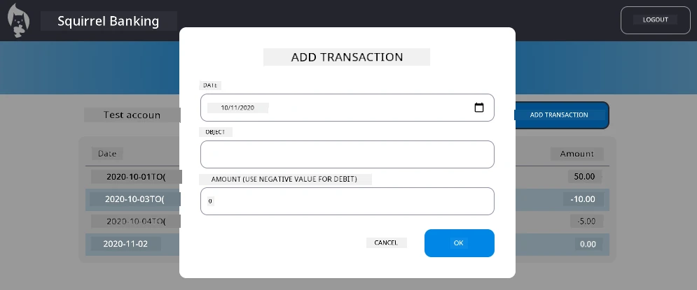

# Implement "Add Transaction" Dialog

## Overview

Your banking app don get solid state management and data persistence, but e miss one important feature wey real banking apps need: make users fit add dia own transactions. For this assignment, you go implement complete "Add Transaction" dialog wey go connect well with your current state management system.

Dis assignment combine all wetin you don learn for the four banking lessons: HTML templating, form handling, API integration, and state management.

## Learning Objectives

When you finish dis assignment, you go fit:
- **Create** user-friendly dialog interface for data entry
- **Implement** accessible form design wey support keyboard and screen reader
- **Integrate** new features with your existing state management system
- **Practice** API communication and how to handle errors
- **Apply** modern web development patterns for real-world feature

## Instructions

### Step 1: Add Transaction Button

**Create** "Add Transaction" button for your dashboard page wey users fit find and use easily.

**Requirements:**
- **Place** the button for correct place for dashboard
- **Use** clear action dey for the button text
- **Style** the button to match your current UI design
- **Ensure** the button dey accessible with keyboard

### Step 2: Dialog Implementation

Choose one of these two ways to implement your dialog:

**Option A: Separate Page**
- **Create** new HTML template for the transaction form
- **Add** new route to your routing system
- **Implement** navigation to and from the form page

**Option B: Modal Dialog (Recommended)**
- **Use** JavaScript to show/hide the dialog without comot for the dashboard
- **Implement** using the [`hidden` property](https://developer.mozilla.org/docs/Web/HTML/Global_attributes/hidden) or CSS classes
- **Create** smooth user experience with proper focus management

### Step 3: Accessibility Implementation

**Ensure** say your dialog meet [accessibility standards for modal dialogs](https://developer.paciellogroup.com/blog/2018/06/the-current-state-of-modal-dialog-accessibility/):

**Keyboard Navigation:**
- **Support** Escape key to close the dialog
- **Trap** focus inside the dialog when e open
- **Return** focus to the trigger button when e close

**Screen Reader Support:**
- **Add** correct ARIA labels and roles
- **Announce** dialog open/close to screen readers
- **Provide** clear labels for form fields and error messages

### Step 4: Form Creation

**Design** HTML form wey go collect transaction data:

**Required Fields:**
- **Date**: When transaction happen
- **Description**: Wetin transaction be for
- **Amount**: Transaction value (positive for income, negative for expenses)

**Form Features:**
- **Validate** user input before you submit am
- **Provide** clear error messages for invalid data
- **Include** helpful placeholder text and labels
- **Style** am same way as your current design

### Step 5: API Integration

**Connect** your form to backend API:

**Implementation Steps:**
- **Review** the [server API specifications](../api/README.md) for correct endpoint and data format
- **Create** JSON data from your form inputs
- **Send** the data to the API with correct error handling
- **Display** success or failure messages to the user
- **Handle** network errors well

### Step 6: State Management Integration

**Update** your dashboard with the new transaction:

**Integration Requirements:**
- **Refresh** the account data after transaction add finish well
- **Update** dashboard display without needing page reload
- **Ensure** the new transaction show immediately
- **Maintain** correct state consistency during the whole process

## Technical Specifications

**API Endpoint Details:**
Refer to the [server API documentation](../api/README.md) for:
- Required JSON format for transaction data
- HTTP method and endpoint URL
- Expected response format
- Error response handling

**Expected Result:**
After you finish this assignment, your banking app suppose get fully working "Add Transaction" feature wey look and behave professionally:

## Testing Your Implementation

**Functional Testing:**
1. **Verify** "Add Transaction" button dey clearly visible and accessible
2. **Test** say the dialog open and close properly
3. **Confirm** form validation dey work for all required fields
4. **Check** say successful transactions show immediately for dashboard
5. **Ensure** error handling dey work for invalid data and network wahala

**Accessibility Testing:**
1. **Navigate** through the whole flow with keyboard only
2. **Test** with screen reader to confirm correct announcements
3. **Verify** focus management dey work well
4. **Check** say all form elements get correct labels

## Evaluation Rubric

| Criteria | Exemplary | Adequate | Needs Improvement |
| -------- | --------- | -------- | ----------------- |
| **Functionality** | Add transaction feature dey work perfectly with excellent user experience and follow all best practices from lessons | Add transaction feature dey work correctly but fit no follow some best practices or get small usability wahala | Add transaction feature dey partly work or get serious usability problems |
| **Code Quality** | Code well-organized, follow correct patterns, get proper error handling, and integrate well with existing state management | Code dey work but maybe dey disorganized or no consistent with existing codebase patterns | Code get big structural issues or no integrate well with existing patterns |
| **Accessibility** | Full keyboard navigation support, screen reader compatible, and follow WCAG guidelines with excellent focus management | Basic accessibility features dey but some keyboard navigation or screen reader features fit dey missing | Limited or no accessibility considerations implement |
| **User Experience** | Intuitive, polished interface with clear feedback, smooth interactions, and professional look | Good user experience with small room to improve feedback or visual design | Poor user experience with confusing interface or no user feedback |

## Additional Challenges (Optional)

Once you don finish the basic requirements, consider these enhancements:

**Enhanced Features:**
- **Add** transaction categories (food, transportation, entertainment, etc.)
- **Implement** input validation with real-time feedback
- **Create** keyboard shortcuts for power users
- **Add** transaction editing and deletion abilities

**Advanced Integration:**
- **Implement** undo function for recently added transactions
- **Add** bulk transaction import from CSV files
- **Create** transaction search and filtering abilities
- **Implement** data export function

These optional features go help you practice more advanced web development ideas and build more complete banking app!

---

<!-- CO-OP TRANSLATOR DISCLAIMER START -->
**Disclaimer**:  
Dis document don translate with AI translation service wey dem dey call [Co-op Translator](https://github.com/Azure/co-op-translator). Even though we dey try make am correct, abeg sabi say automated translation fit get some mistakes or no too correct. The original document wey dem write for im own language na im get proper authority. If na serious matter, e better make human professional translate am. We no go responsible if person misunderstand or arrange the meaning wrong because of this translation.
<!-- CO-OP TRANSLATOR DISCLAIMER END -->