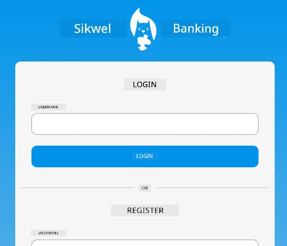
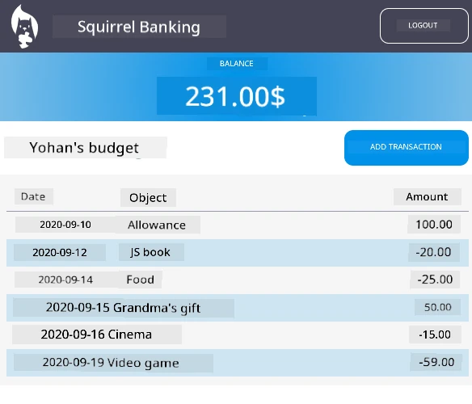

# :dollar: Build Bank

For dis project, you go learn how to build one fictional bank. Dem lessons go show you how to layout web app and provide routes, build forms, manage state, plus how to fetch data from API wey you fit use take get di bank data.

|  |  |
|--------------------------------|--------------------------------|

## Lessons

1. [HTML Templates and Routes in a Web App](1-template-route/README.md)
2. [Build Login and Registration Form](2-forms/README.md)
3. [Methods for Fetching and Using Data](3-data/README.md)
4. [Concepts for State Management](4-state-management/README.md)

### Credits

Dem lessons na wetin :hearts: [Yohan Lasorsa](https://twitter.com/sinedied) write.

If you wan learn how to build di [server API](/7-bank-project/api/README.md) wey dem use for dis lessons, you fit follow [dis series of videos](https://aka.ms/NodeBeginner) (specially video 17 to 21).

You fit also check [dis interactive Learn tutorial](https://aka.ms/learn/express-api).

---

<!-- CO-OP TRANSLATOR DISCLAIMER START -->
**Disclaimer**:
Dis document na AI translation service [Co-op Translator](https://github.com/Azure/co-op-translator) translate am. Though we dey try make am correct, abeg sabi say automatic translations fit get mistake or no too clear. The original document wey dey im own language na di correct one. If na serious matter, e better make professional human translator check am. We no go take any blame if pesin no understand or miss-interpret because of dis translation.
<!-- CO-OP TRANSLATOR DISCLAIMER END -->