<!--
CO_OP_TRANSLATOR_METADATA:
{
  "original_hash": "a9a3bcc037a447e2d8994d99e871cd9f",
  "translation_date": "2026-01-08T13:11:41+00:00",
  "source_file": "8-code-editor/1-using-a-code-editor/README.md",
  "language_code": "pcm"
}
-->
# Using a Code Editor: Mastering VSCode.dev

Remember for *The Matrix* when Neo bin haff plug inside one big computer terminal to waka enter di digital world? Today web development tools na di oda side – plenty power full skill wey anybody fit use from anywhere. VSCode.dev na browser-based code editor wey dey carry professional development tools go any device wey get internet connection.

Just like how di printing press make books easy for everybody to read, no be only scribes for monastery, VSCode.dev dey give everybody chance to do code. You fit work on projects from library computer, school lab, or anywhere wey you get browser access. No need to install anything, no need to talk say "I need my own setup."

By di end of dis lesson, you go sabi how to waka for VSCode.dev, open GitHub repositories direct for your browser, and use Git for version control – all na di skills professional developers dey use every day.

## ⚡ Wetin You Fit Do for Di Next 5 Minutes

**Quick Start Pathway for Busy Developers**


- **Minute 1**: Go [vscode.dev](https://vscode.dev) – no need to install anything
- **Minute 2**: Sign in with GitHub to connect your repositories
- **Minute 3**: Try di URL trick: change `github.com` to `vscode.dev/github` for any repo URL
- **Minute 4**: Create new file and watch as syntax highlighting just dey work by itself
- **Minute 5**: Make change and commit am through the Source Control panel

**Quick Test URL**:
```
# Transform this:
github.com/microsoft/Web-Dev-For-Beginners

# Into this:
vscode.dev/github/microsoft/Web-Dev-For-Beginners
```

**Why Dis Matter**: For 5 minutes, you go feel di freedom of coding anywhere with professional tools. Dis na di future of development – easy to get, powerful, and fast.

## 🗺️ Your Learning Journey Through Cloud-Based Development


**Your Journey Destination**: By di end of dis lesson, you go don master professional cloud development environment wey dey work from any device, make you dey code with same tools developers dey use for big tech companies.

## Wetin You Go Learn

After we waka together, you go fit:

- Waka for VSCode.dev like na your own second home – find everything without confusion
- Open any GitHub repository for your browser and start to edit immediately (dis one na correct magic!)
- Use Git to track your changes and save your work like pro
- Boost your editor with extensions wey go make coding faster and more fun
- Create and organize project files with confidence

## Wetin You Go Need

Di requirements simple:

- Free [GitHub account](https://github.com) (we go show you how to create if you need help)
- Basic sabi how web browsers dey work
- The GitHub Basics lesson get useful background, although e no too necessary

> 💡 **You be New GitHub User?** Creating account na free and e go take only few minutes. Like how library card dey give you access to books globally, GitHub account go open doors to plenty code repositories for internet.

## 🧠 Cloud Development Ecosystem Overview


**Core Principle**: Cloud-based development environments na di future of coding – dem dey provide professional-level tools wey everybody fit use, collaborate, and no worry which platform you dey use.

## Why Web-Based Code Editors Get Importance

Before internet, scientists for different universities no fit easily share their research. Then ARPANET come for 1960s, e connect computers together across long distance. Web-based code editors follow the same idea – dey make powerful tools fit any place or any device you dey use.

Code editor na your work area where you write, edit, and organize code files. E no be like simple text editors; professional code editors dey give you syntax highlighting, error detection, and project management.

VSCode.dev dey bring all these power to your browser:

**Web-based editing advantages:**

| Feature | Description | Practical Benefit |
|---------|-------------|-------------------|
| **Platform Independence** | E dey run on any device with browser | You fit work for many computers easily |
| **No Installation Required** | You fit access with web URL | No need install software for your device |
| **Automatic Updates** | E dey always run di latest version | You dey get new features without stress |
| **Repository Integration** | Direct connection to GitHub | You fit edit code without managing local files |

**Practical implications:**
- Work fit continue anywhere same same
- Interface consistent for any operating system
- Collaboration fit happen quickly
- Local storage no go full too fast

## Exploring VSCode.dev

Just like how Marie Curie laboratory get plenty advanced equipment inside one small space, VSCode.dev put professional development tools inside your browser interface. Dis web app dey do the same things desktop editors do.

Start by going to [vscode.dev](https://vscode.dev) inside your browser. Interface go load quick without any installation or download – na real cloud computing principles.

### Connecting Your GitHub Account

Like Alexander Graham Bell telephone connect far places, connecting your GitHub account join VSCode.dev with your code repos. When dem ask you sign in with GitHub, e good to accept.

**GitHub integration gives you:**
- Direct access to your repositories inside the editor
- Settings and extensions synchronize across devices
- Easy saving flow to GitHub
- Personalized development environment

### Getting to Know Your New Workspace

Once e don load finish, you go see clean workspace wey design to help you focus on wetin important – your code!


**Here na your neighborhood tour:**
- **Activity Bar** (di left strip): Na your main navigation, get Explorer 📁, Search 🔍, Source Control 🌿, Extensions 🧩, and Settings ⚙️
- **Sidebar** (panel wey dey beside am): E dey change to show relevant info based on wetin you select
- **Editor Area** (big space for middle): Na dia di magic dey happen – your main coding space

**Take small time explore:**
- Click those Activity Bar icons, see wetin each one dey do
- Notice how sidebar dey change to show different info – e cool well well
- Explorer view (📁) na where you go spend most time, make you get familiar with am

```mermaid
flowchart TB
    subgraph "VSCode.dev Interface Architecture"
        A[Activity Bar] --> B[Explorer 📁]
        A --> C[Search 🔍]
        A --> D[Source Control 🌿]
        A --> E[Extensions 🧩]
        A --> F[Settings ⚙️]
        
        B --> G[File Tree]
        C --> H[Find & Replace]
        D --> I[Git Status]
        E --> J[Extension Marketplace]
        F --> K[Configuration]
        
        L[Sidebar] --> M[Context Panel]
        N[Editor Area] --> O[Code Files]
        P[Terminal/Output] --> Q[Command Line]
    end
```


## Opening GitHub Repositories

Before internet, researchers haff waka go libraries to find documents. GitHub repositories na similar thing – collections of code stored for remote places. VSCode.dev remove di need to download repositories before you fit edit.

Dis go give you immediate access to any public repository to see, edit, or contribute. Here be two ways to open repositories:

### Method 1: The Point-and-Click Way

Dis one good when you dey start new inside VSCode.dev and you wan open one specific repo. E easy and good for beginners:

**How to do am:**

1. Go [vscode.dev](https://vscode.dev) if you never enter 
2. Find "Open Remote Repository" button for welcome screen, click am

   

3. Paste any GitHub repo URL (try dis one: `https://github.com/microsoft/Web-Dev-For-Beginners`)
4. Press Enter, make magic happen!

**Pro tip - The Command Palette shortcut:**

Wanna feel like coding wizard? Try keyboard shortcut: Ctrl+Shift+P (or Cmd+Shift+P for Mac) to open Command Palette:


**Command Palette na like search engine for everything you fit do:**
- Type "open remote" and e go find the repository opener for you
- E dey remember repositories wey you open before (e dey useful!)
- When you sabi am, you go code like fast lightning
- E be like VSCode.dev own "Hey Siri, but for coding"

### Method 2: URL Modification Technique

Like how HTTP and HTTPS dey use different protocols but keep same domain, VSCode.dev get URL pattern wey mirror GitHub addressing. Any GitHub repo URL fit change to open direct for VSCode.dev.

**URL transformation pattern:**

| Repository Type | GitHub URL | VSCode.dev URL |
|----------------|---------------------|----------------|
| **Public Repository** | `github.com/microsoft/Web-Dev-For-Beginners` | `vscode.dev/github/microsoft/Web-Dev-For-Beginners` |
| **Personal Project** | `github.com/your-username/my-project` | `vscode.dev/github/your-username/my-project` |
| **Any Accessible Repo** | `github.com/their-username/awesome-repo` | `vscode.dev/github/their-username/awesome-repo` |

**How e dey work:**
- Change `github.com` to `vscode.dev/github`
- Keep all other parts of URL same
- E work with any public repository
- You go fit start edit quick

> 💡 **Life-changing tip**: Bookmark your favorite VSCode.dev repo URLs. I get bookmarks like "Edit My Portfolio" and "Fix Documentation" wey dey carry me enter edit mode direct!

**Which way you go use?**
- **Interface way**: Good when you dey explore or you no remember exact repo name
- **URL trick**: Perfect for fast access when you know exactly where you dey go

### 🎯 Pedagogical Check-in: Cloud Development Access

**Pause and Reflect**: You just learn two ways to access code repos through browser. E mean say big change don happen for how development dey work.

**Quick Self-Assessment**:
- Fit explain why web-based editing no need traditional "environment setup"?
- Wetin URL modification trick get better pass local git cloning?
- How dis style fit change how you go contribute to open source projects?

**Real-World Connection**: Big companies like GitHub, GitLab, and Replit build their platforms with cloud-first mindset. You dey learn same workflows professional developer teams dey use worldwide.

**Challenge Question**: How cloud-based development fit change how coding dey taught for school? Think about device needs, software management, and collaboration possibilities.

## Working with Files and Projects

Now wey you don open repository, make we start to build! VSCode.dev give you everything you need to create, edit, and organize code files. E be like your own digital workshop – all tools dey where you need am.

Make we enter everyday tasks wey go make your coding workflow easy.

### Creating New Files

Like how architect organize blueprints for office, file creation for VSCode.dev dey follow structured process. System support all standard web dev file types.

**File creation steps:**

1. Go target folder on Explorer sidebar
2. Hover over folder name to see "New File" icon (📄+)
3. Type filename with correct extension (`style.css`, `script.js`, `index.html`)
4. Press Enter to create am


**Name rules:**
- Use descriptive names wey show file purpose
- Put file extensions for correct syntax highlighting
- Follow consistent naming style for projects
- Use lowercase letters and hyphens instead of spaces

### Editing and Saving Files

Now di real fun don start! VSCode.dev editor get plenty helper features wey dey make coding smooth and easy. E be like smart writing assistant, but for code.

**Your editing workflow:**

1. Click any file for Explorer to open am inside main area
2. Start to type and watch VSCode.dev help you with colors, suggestions, and error alerts
3. Save with Ctrl+S (Windows/Linux) or Cmd+S (Mac) – but e also auto-saves


**The cool things wey dey happen as you code:**
- Your code dey color-coded well so e easy to read
- VSCode.dev dey suggest completions as you type (like autocorrect, but smarter)
- E dey catch typos and errors before you save
- You fit open many files with tabs, just like browser
- Everything dey save automatically for background

> ⚠️ **Quick tip**: Even though auto-save dey work, better make you hit Ctrl+S or Cmd+S sometimes. E go save everything quick and trigger extra features like error checking.

### Version Control with Git

Like how archaeologists dey keep detailed record of their excavation layers, Git dey track changes for your code over time. This system keep project history and allow you to go back to older versions. VSCode.dev get built-in Git support.

**Source Control interface:**

1. Go Source Control panel by clicking 🌿 icon for Activity Bar
2. Files wey you change go show for "Changes" section
3. Colors show type of changes: green for additions, red for deletions


**How to save your work (commit process):**


**Step-by-step:**
- Click "+" icon beside files you want to save (dis dey "stage" them)
- Double-check say you dey happy wit all di changes wey you don stage
- Write small note wey explain wetin you do (dis na your "commit message")
- Click di checkmark button to save everytin to GitHub
- If you change mind about sometin, di undo icon go let you discard changes

**How to write beta commit messages (dis one no hard like you tink!):**
- Just talk wetin you do, like "Add contact form" or "Fix broken navigation"
- Make am short and sweet – think tweet length, no long essay
- Start wit action words like "Add", "Fix", "Update", or "Remove"
- **Good examples**: "Add responsive navigation menu", "Fix mobile layout issues", "Update colors for better accessibility"

> 💡 **Quick navigation tip**: Use di hamburger menu (☰) for top left to jump back to your GitHub repository and see di changes wey you don commit online. E be like portal wey connect your editing environment and your project home for GitHub!

## Enhancing Functionality with Extensions

Just like how craftsperson workshop get special tools for different work, VSCode.dev fit customize wit extensions wey add extra abilities. Dis community-made plugins dey solve common development needs like code formatting, live preview, and better Git integration.

Di extension marketplace get thousands free tools wey developers worldwide create. Each extension dey solve particular workflow wahala, so you fit build your own personalized development environment wey fit your own needs and taste.


### Finding Your Perfect Extensions

Di extension marketplace organize well well, so you no go lost trying find wetin you need. E design to help you discover specific tools and even beta tins wey you no sabi say dey!

**How to reach di marketplace:**

1. Click di Extensions icon (🧩) for di Activity Bar
2. Browse around or search for wetin you want
3. Click on anything wey look interesting to learn more about am


**Wetin you go see inside:**

| Section | Wetin Dey Inside | Why E Dey Helpful |
|----------|---------|----------|
| **Installed** | Extensions wey you don add before | Your personal coding toolkit |
| **Popular** | Di crowd favourites | Wetin most developers trust well well |
| **Recommended** | Smart suggestions for your project | VSCode.dev beta recommendations |

**Wetin make browsing easy:**
- Each extension show ratings, download count, and real user reviews
- You go get screenshots and clear explanations of wetin each one dey do
- Everything mark well with compatibility info
- Similar extensions dey suggest so you fit compare options

### Installing Extensions (E Easy Pass Jollof!)

Adding new power to your editor easy like clicking button. Extensions install quick quick and start work immediately – no restart, no wait.

**Wet you need do na:**

1. Search for wetin you want (try search "live server" or "prettier")
2. Click one wey look good to see more detail
3. Read what e dey do and check di ratings
4. Press di blue "Install" button and you done!


**Wetin dey happen behind di scene:**
- Di extension go download and set up automatically
- New features go show for your interface immediately
- Everything go start work like lightning (serious!)
- If you sign in, di extension go sync to all your devices

**Some extensions wey I suggest for start:**
- **Live Server**: See your website update live as you dey code (dis one na magic!)
- **Prettier**: Make your code clean and professional automatically
- **Auto Rename Tag**: Change one HTML tag, its partner go change too
- **Bracket Pair Colorizer**: Color your brackets so you no go lost
- **GitLens**: Boost your Git features with plenty useful info

### Customizing Your Extensions

Most extensions get settings wey you fit adjust make dem work exactly how you want. Think am like how you adjust seat and mirrors for car – everybody get e own preference!

**How to adjust extension settings:**

1. Find your installed extension for di Extensions panel
2. Find di small gear icon (⚙️) next to the name and click am
3. Choose "Extension Settings" from di dropdown
4. Change tins till e feel right for your workflow


**Common tins wey you fit want change:**
- How your code go be formatted (tabs or spaces, line length, etc.)
- Which keyboard shortcuts go trigger certain actions
- Which file types di extension suppose work with
- Turn some features on or off to keep everytin clean

### Keeping Your Extensions Organized

As you discover beta extensions, you go want keep your collection tidy and correct. VSCode.dev make dis very easy to manage.

**Your extension management options:**

| Wetin You Fit Do | When E Dey Helpful | Pro Tip |
|--------|---------|----------|
| **Disable** | Test if extension dey cause wahala | Better than uninstall if you fit want am back |
| **Uninstall** | Remove extension wey you no want again | Keep your environment clean and fast |
| **Update** | Get latest features and bug fixes | Usually automatic, but good to check |

**How I like manage extensions:**
- Every few months, I go check wetin I don install and remove tins wey I no dey use
- I dey keep extensions updated to get latest improvements and security fixes
- If somtin dey slow, I go temporarily disable extensions to find which one be culprit
- I dey read update notes when extensions get big updates – sometimes new cool features dey!

> ⚠️ **Performance tip**: Extensions good, but if too many, e fit slow tin down. Focus on ones wey really make your life easier and no fear to uninstall ones you no dey use.

### 🎯 Pedagogical Check-in: Development Environment Customization

**Architecture Understanding**: You don learn how to customize professional development environment using community-made extensions. E resemble how big enterprise teams build standardized toolchains.

**Key Concepts Mastered**:
- **Extension Discovery**: Find tools wey solve specific development challenges
- **Environment Configuration**: Customize tools to match personal or team taste
- **Performance Optimization**: Balance functionality with system performance
- **Community Collaboration**: Use tools created by global developer community

**Industry Connection**: Extension ecosystems power big development platforms like VS Code, Chrome DevTools, and modern IDEs. To sabi how to check, install, and configure extensions na key for professional development workflow.

**Reflection Question**: How you go take set up a standardized development environment for team of 10 developers? Think about consistency, performance, and individual preferences.

## 📈 Your Cloud Development Mastery Timeline


**🎓 Graduation Milestone**: You don master cloud-based development using same tools and workflows wey professional developers dey use for big tech companies. These skills be future of software development.

**🔄 Next Level Capabilities**:
- Ready to explore advanced cloud development platforms (Codespaces, GitPod)
- Fit work for distributed development teams
- Ready to contribute to open source projects worldwide
- Foundation set for modern DevOps and continuous integration practices

## GitHub Copilot Agent Challenge 🚀

Like NASA style approach for space mission, dis challenge na systematic use of VSCode.dev skills in complete workflow.

**Objective:** Show say you sabi use VSCode.dev by building complete web development workflow.

**Project requirements:** Using Agent mode help, complete dis tasks:
1. Fork existing repository or create new one
2. Set up functional project structure wit HTML, CSS, and JavaScript files
3. Install and configure three development-enhancing extensions
4. Practice version control wit descriptive commit messages
5. Try feature branch creation and modification
6. Document wetin you do and wetin you learn for README.md

Dis exercise join all VSCode.dev concepts for one real-world workflow wey you fit use for future projects.

Learn more about [agent mode](https://code.visualstudio.com/blogs/2025/02/24/introducing-copilot-agent-mode) here.

## Assignment

Time to test these skills for real! I get hands-on project wey go let you practice everything we don cover: [Create a resume website using VSCode.dev](./assignment.md)

Dis assignment go guide you build professional resume website completely for your browser. You go use all VSCode.dev features wey we talk about, by di end you go get beta website plus solid confidence for your new workflow.

## Keep Exploring and Growing Your Skills

You don get strong foundation now, but still plenty beta tins to discover! Here dey some resources and ideas to grow your VSCode.dev skills to next level:

**Official docs wey worth bookmarking:**
- [VSCode Web Documentation](https://code.visualstudio.com/docs/editor/vscode-web?WT.mc_id=academic-0000-alfredodeza) – Complete guide to browser-based editing
- [GitHub Codespaces](https://docs.github.com/en/codespaces) – For when you want even more power for cloud

**Cool features to try next:**
- **Keyboard Shortcuts**: Learn key combos wey go make you feel like coding ninja
- **Workspace Settings**: Set up different environments for different project types
- **Multi-root Workspaces**: Work on multiple repositories at same time (super useful!)
- **Terminal Integration**: Access command-line tools directly inside browser

**Ideas for practice:**
- Jump into open-source projects and contribute using VSCode.dev – na beta way to give back!
- Try different extensions to find your perfect setup
- Create project templates for sites you build most
- Practice Git workflows like branching and merging – these skills be gold for team projects

---

**You don master browser-based development!** 🎉 Like how portable instruments allow scientists to do research anywhere, VSCode.dev enable professional coding from any device wey get internet.

These skills show correct industry practice – many professional developers use cloud-based environments for flexibility and easy access. You don learn workflow wey fit range from individual projects to big team collaboration.

Use these skills for your next development project! 🚀

---

<!-- CO-OP TRANSLATOR DISCLAIMER START -->
**Disclaimer**:
Dis document dem don translate am wit AI translation service [Co-op Translator](https://github.com/Azure/co-op-translator). Even tho we try make am correct, abeg sabi say automatic translation fit get some mistake or no too clear. Di original document wey dey for e own language na di correct one. If na serious matter, e better make human person wey sabi translate do am. We no dey responsible for any wrong understanding or wrong meaning wey fit happen because of dis translation.
<!-- CO-OP TRANSLATOR DISCLAIMER END -->