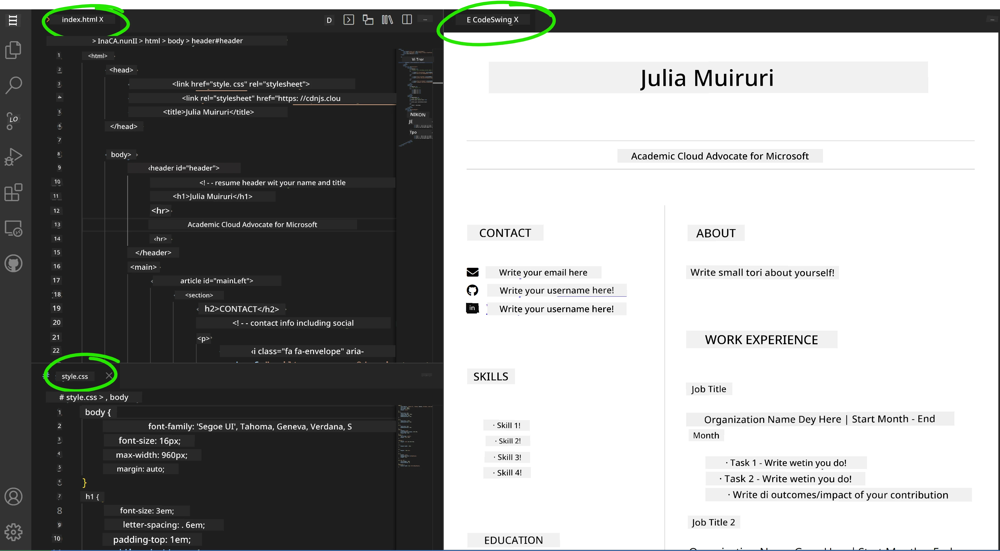

# Create a Resume Website Using VSCode.dev

Transform your career prospects by building a professional resume website wey dey show your skills and experience for interactive, modern format. Instead make you dey send traditional PDFs, think say you fit give recruiters one clean, responsive website wey dey show both your qualifications and your web development skills.

This hands-on assignment go make all your VSCode.dev skills work as you dey create something wey go really help your career. You go experience the full web development workflow – from repository creation to deployment – all inside your browser.

If you complete this project, you go get professional online presence wey e easy to share with potential employers, fit update as your skills grow, and you fit customize am to match your personal brand. Na this kind practical project dey show real-world web development skills.

## Learning Objectives

After you finish this assignment, you go fit:

- **Create** and manage full web development project using VSCode.dev
- **Structure** professional website using semantic HTML elements
- **Style** responsive layouts with modern CSS techniques
- **Implement** interactive features using basic web technologies
- **Deploy** one live website wey people fit access with shareable URL
- **Demonstrate** version control best practices throughout the development process

## Prerequisites

Before you start this assignment, make sure say you get:

- GitHub account (if no get, create one for [github.com](https://github.com/))
- Finish the VSCode.dev lesson wey cover interface navigation and basic operations
- Basic understanding of HTML structure and CSS styling concepts

## Project Setup and Repository Creation

Make we start to set up your project foundation. This process dey similar to real-world development workflow wey projects dey start with proper repository initialization and structure planning.

### Step 1: Create Your GitHub Repository

To set up dedicated repository go make sure say your project dey well organize and version-controlled from the start.

1. **Go** to [GitHub.com](https://github.com) and sign in to your account
2. **Click** the green "New" button or the "+" icon for top-right corner
3. **Name** your repository `my-resume` (or choose another name wey be like `john-smith-resume`)
4. **Add** short description: "Professional resume website built with HTML and CSS"
5. **Choose** "Public" so that employers fit access your resume
6. **Check** "Add a README file" to create initial project description
7. **Click** "Create repository" to finish the setup

> 💡 **Repository Naming Tip**: Use descriptive, professional names wey clearly talk the project purpose. This one go help if you wan share am with employers or during portfolio reviews.

### Step 2: Initialize Project Structure

Because VSCode.dev need at least one file to open repository, we go create our main HTML file directly for GitHub before we switch go the web editor.

1. **Click** "creating a new file" link for your new repository
2. **Type** `index.html` as the filename
3. **Add** this initial HTML structure:

```html
<!DOCTYPE html>
<html lang="en">
<head>
    <meta charset="UTF-8">
    <meta name="viewport" content="width=device-width, initial-scale=1.0">
    <title>Your Name - Professional Resume</title>
</head>
<body>
    <h1>Your Name</h1>
    <p>Professional Resume Website</p>
</body>
</html>
```

4. **Write** commit message: "Add initial HTML structure"
5. **Click** "Commit new file" to save your work


**Wetin this initial setup dey do:**
- **Establishes** correct HTML5 document structure with semantic elements
- **Includes** viewport meta tag for responsive design
- **Sets** descriptive page title wey go show for browser tab
- **Creates** foundation for professional content organization

## Working in VSCode.dev

Now we don set your repository foundation, make we move go VSCode.dev to do the main development work. This web-based editor get all tools wey you need for professional web development.

### Step 3: Open Your Project in VSCode.dev

1. **Go** to [vscode.dev](https://vscode.dev) for new browser tab
2. **Click** "Open Remote Repository" for welcome screen
3. **Copy** your repository URL from GitHub and paste am for input box

   Format: `https://github.com/your-username/my-resume`
   
   *Replace `your-username` with your real GitHub username*

4. **Press** Enter to load your project

✅ **Success indicator**: You go see your project files for Explorer sidebar and `index.html` ready for editing for main editor


**Wetin you go see for interface:**
- **Explorer sidebar**: **Shows** your repository files and folder structure
- **Editor area**: **Displays** content of selected files for editing
- **Activity bar**: **Gives** access to features like Source Control and Extensions
- **Status bar**: **Shows** connection status and current branch info

### Step 4: Build Your Resume Content

Replace the placeholder content inside `index.html` with full resume structure. This HTML go be the foundation for professional way to show your qualifications.

<details>
<summary><b>Complete HTML Resume Structure</b></summary>

```html
<!DOCTYPE html>
<html lang="en">
<head>
    <meta charset="UTF-8">
    <meta name="viewport" content="width=device-width, initial-scale=1.0">
    <link href="style.css" rel="stylesheet">
    <link rel="stylesheet" href="https://cdnjs.cloudflare.com/ajax/libs/font-awesome/5.15.4/css/all.min.css">
    <title>Your Name - Professional Resume</title>
</head>
<body>
    <header id="header">
        <h1>Your Full Name</h1>
        <hr>
        <p class="role">Your Professional Title</p>
        <hr>
    </header>
    
    <main>
        <article id="mainLeft">
            <section>
                <h2>CONTACT</h2>
                <p>
                    <i class="fa fa-envelope" aria-hidden="true"></i>
                    <a href="mailto:your.email@domain.com">your.email@domain.com</a>
                </p>
                <p>
                    <i class="fab fa-github" aria-hidden="true"></i>
                    <a href="https://github.com/your-username">github.com/your-username</a>
                </p>
                <p>
                    <i class="fab fa-linkedin" aria-hidden="true"></i>
                    <a href="https://linkedin.com/in/your-profile">linkedin.com/in/your-profile</a>
                </p>
            </section>
            
            <section>
                <h2>SKILLS</h2>
                <ul>
                    <li>HTML5 & CSS3</li>
                    <li>JavaScript (ES6+)</li>
                    <li>Responsive Web Design</li>
                    <li>Version Control (Git)</li>
                    <li>Problem Solving</li>
                </ul>
            </section>
            
            <section>
                <h2>EDUCATION</h2>
                <h3>Your Degree or Certification</h3>
                <p>Institution Name</p>
                <p>Start Date - End Date</p>
            </section>
        </article>
        
        <article id="mainRight">
            <section>
                <h2>ABOUT</h2>
                <p>Write a compelling summary that highlights your passion for web development, key achievements, and career goals. This section should give employers insight into your personality and professional approach.</p>
            </section>
            
            <section>
                <h2>WORK EXPERIENCE</h2>
                <div class="job">
                    <h3>Job Title</h3>
                    <p class="company">Company Name | Start Date – End Date</p>
                    <ul>
                        <li>Describe a key accomplishment or responsibility</li>
                        <li>Highlight specific skills or technologies used</li>
                        <li>Quantify impact where possible (e.g., "Improved efficiency by 25%")</li>
                    </ul>
                </div>
                
                <div class="job">
                    <h3>Previous Job Title</h3>
                    <p class="company">Previous Company | Start Date – End Date</p>
                    <ul>
                        <li>Focus on transferable skills and achievements</li>
                        <li>Demonstrate growth and learning progression</li>
                        <li>Include any leadership or collaboration experiences</li>
                    </ul>
                </div>
            </section>
            
            <section>
                <h2>PROJECTS</h2>
                <div class="project">
                    <h3>Project Name</h3>
                    <p>Brief description of what the project accomplishes and technologies used.</p>
                    <a href="#" target="_blank">View Project</a>
                </div>
            </section>
        </article>
    </main>
</body>
</html>
```
</details>

**How to customize am:**
- **Replace** all placeholder text with your real details
- **Adjust** sections according to your experience and career focus
- **Add** or remove sections as you want (like Certifications, Volunteer Work, Languages)
- **Put** links to your real profiles and projects

### Step 5: Create Supporting Files

Professional websites need organized file setup. Create CSS stylesheet and config files wey you need to get complete project.

1. **Hover** your project folder name for Explorer sidebar
2. **Click** the "New File" icon (📄+) wey appear
3. **Create** these files one by one:
   - `style.css` (for styling and layout)
   - `codeswing.json` (for preview extension config)

**Make the CSS file (`style.css`):**

<details>
<summary><b>Professional CSS Styling</b></summary>

```css
/* Modern Resume Styling */
body {
    font-family: 'Segoe UI', Tahoma, Geneva, Verdana, sans-serif;
    font-size: 16px;
    line-height: 1.6;
    max-width: 960px;
    margin: 0 auto;
    padding: 20px;
    color: #333;
    background-color: #f9f9f9;
}

/* Header Styling */
header {
    text-align: center;
    margin-bottom: 3em;
    padding: 2em;
    background: linear-gradient(135deg, #667eea 0%, #764ba2 100%);
    color: white;
    border-radius: 10px;
    box-shadow: 0 4px 6px rgba(0, 0, 0, 0.1);
}

h1 {
    font-size: 3em;
    letter-spacing: 0.1em;
    margin-bottom: 0.2em;
    font-weight: 300;
}

.role {
    font-size: 1.3em;
    font-weight: 300;
    margin: 1em 0;
}

/* Main Content Layout */
main {
    display: grid;
    grid-template-columns: 35% 65%;
    gap: 3em;
    margin-top: 3em;
    background: white;
    padding: 2em;
    border-radius: 10px;
    box-shadow: 0 2px 10px rgba(0, 0, 0, 0.1);
}

/* Typography */
h2 {
    font-size: 1.4em;
    font-weight: 600;
    margin-bottom: 1em;
    color: #667eea;
    border-bottom: 2px solid #667eea;
    padding-bottom: 0.3em;
}

h3 {
    font-size: 1.1em;
    font-weight: 600;
    margin-bottom: 0.5em;
    color: #444;
}

/* Section Styling */
section {
    margin-bottom: 2.5em;
}

#mainLeft {
    border-right: 1px solid #e0e0e0;
    padding-right: 2em;
}

/* Contact Links */
section a {
    color: #667eea;
    text-decoration: none;
    transition: color 0.3s ease;
}

section a:hover {
    color: #764ba2;
    text-decoration: underline;
}

/* Icons */
i {
    margin-right: 0.8em;
    width: 20px;
    text-align: center;
    color: #667eea;
}

/* Lists */
ul {
    list-style: none;
    padding-left: 0;
}

li {
    margin: 0.5em 0;
    padding: 0.3em 0;
    position: relative;
}

li:before {
    content: "▸";
    color: #667eea;
    margin-right: 0.5em;
}

/* Work Experience */
.job, .project {
    margin-bottom: 2em;
    padding-bottom: 1.5em;
    border-bottom: 1px solid #f0f0f0;
}

.company {
    font-style: italic;
    color: #666;
    margin-bottom: 0.5em;
}

/* Responsive Design */
@media (max-width: 768px) {
    main {
        grid-template-columns: 1fr;
        gap: 2em;
    }
    
    #mainLeft {
        border-right: none;
        border-bottom: 1px solid #e0e0e0;
        padding-right: 0;
        padding-bottom: 2em;
    }
    
    h1 {
        font-size: 2.2em;
    }
    
    body {
        padding: 10px;
    }
}

/* Print Styles */
@media print {
    body {
        background: white;
        color: black;
        font-size: 12pt;
    }
    
    header {
        background: none;
        color: black;
        box-shadow: none;
    }
    
    main {
        box-shadow: none;
    }
}
```
</details>

**Make the config file (`codeswing.json`):**

```json
{
    "scripts": [],
    "styles": []
}
```

**Understanding the CSS features:**
- **Uses** CSS Grid for responsive, professional layout
- **Has** modern color schemes with gradient headers
- **Includes** hover effects and smooth transitions for interaction
- **Provides** responsive design wey work for all device sizes
- **Adds** print-friendly styles for PDF generation

### Step 6: Install and Configure Extensions

Extensions go improve your development experience by giving live preview and better workflow tools. CodeSwing extension na one wey good well for web development projects.

**How to install CodeSwing Extension:**

1. **Click** Extensions icon (🧩) for Activity Bar
2. **Search** for "CodeSwing" inside marketplace search box
3. **Select** the CodeSwing extension from search results
4. **Click** blue "Install" button


**Wetin CodeSwing dey give you:**
- **Lets you** preview your website live as you dey edit
- **Shows** changes in real-time without you refresh manually
- **Supports** many file types like HTML, CSS, and JavaScript
- **Gives** integrated development environment experience

**After you install am immediately:**
You go see live preview of your resume website inside editor. This one go help you see exactly how your site dey look as you dey make changes.



**How the new interface dey work:**
- **Split view**: **Show** your code for one side and live preview for the other
- **Real-time updates**: **Reflect** changes immediately as you type
- **Interactive preview**: **Allow** you test links and interactions
- **Mobile simulation**: **Give** you responsive design testing tools

### Step 7: Version Control and Publishing

Now your resume website don ready, use Git save your work and put am online.

**How to commit your changes:**

1. **Click** Source Control icon (🌿) for Activity Bar
2. **Review** all files you create or modify inside "Changes" section
3. **Stage** your changes by clicking "+" icon beside each file
4. **Write** commit message wey clear like:
   - "Add complete resume website with responsive design"
   - "Implement professional styling and content structure"
5. **Click** checkmark (✓) to commit and push your changes

**Good commit message examples:**
- "Add professional resume content and styling"
- "Implement responsive design for mobile compatibility"
- "Update contact information and project links"

> 💡 **Professional Tip**: Good commit messages go help track your project progress and show attention to detail – na wetin employers dey value.

**How to access your published site:**
After commit finish, you fit go GitHub repository using hamburger menu (☰) for top-left corner. Your resume website don dey version-controlled and ready for deployment or to share.

## Results and Next Steps

**Congratulations! 🎉** You don successfully create professional resume website with VSCode.dev. Your project dey show:

**Technical skills demonstrated:**
- **Repository management**: Create and organize full project structure
- **Web development**: Build responsive website using modern HTML5 and CSS3
- **Version control**: Follow proper Git workflow with meaningful commits
- **Tool proficiency**: Use VSCode.dev interface and extension system well

**Professional outcomes achieved:**
- **Online presence**: Shareable URL wey show your qualifications
- **Modern format**: Interactive alternative to old-school PDF resumes
- **Demonstrable skills**: Clear proof of your web development abilities
- **Easy updates**: Foundation for you to continuously improve and customize

### Deployment Options

To make your resume easy to access by employers, consider these hosting options:

**GitHub Pages (Recommended):**
1. Go to your repository Settings on GitHub
2. Scroll go "Pages" section
3. Select "Deploy from a branch" and pick "main"
4. Your site go dey available at `https://your-username.github.io/my-resume`

**Other platforms:**
- **Netlify**: Automatic deployment with custom domains
- **Vercel**: Fast deployment with modern hosting features
- **GitHub Codespaces**: Development environment with built-in preview

### Enhancement Suggestions

Keep developing your skills by adding these features:

**Technical improvements:**
- **JavaScript interactivity**: Add smooth scrolling or interactive things
- **Dark mode toggle**: Add theme switching for user choice
- **Contact form**: Make direct communication easy from employers
- **SEO optimization**: Add meta tags and structured data make search better

**Content enhancements:**
- **Project portfolio**: Link to GitHub repositories and live demos
- **Skills visualization**: Create progress bars or skill ratings
- **Testimonials section**: Add recommendations from colleagues or teachers
- **Blog integration**: Add blog section to show your learning journey

## GitHub Copilot Agent Challenge 🚀

Use the Agent mode to complete this challenge:

**Description:** Improve your resume website with advanced features wey show professional web development skills and modern design principles.

**Prompt:** Build from your current resume website, add these advanced features:
1. Add dark/light theme toggle wey get smooth transitions
2. Create interactive skills section with animated progress bars
3. Implement contact form with form validation
4. Add projects portfolio section with hover effects and modal popups
5. Include blog section with at least 3 sample posts about your learning journey
6. Optimize for SEO with correct meta tags, structured data, and performance
7. Deploy the enhanced site using GitHub Pages or Netlify
8. Document all new features for your README.md with screenshots

Your upgraded website suppose show mastery of modern web development practices like responsive design, JavaScript interactivity, and professional deployment workflows.

## Challenge Extension

Wetin you fit try next:

**📱 Mobile-First Redesign:** Build your site again with mobile-first approach using CSS Grid and Flexbox

**🔍 SEO Optimization:** Do full SEO work including meta tags, structured data, and performance optimization

**🌐 Multi-language Support:** Add internationalization so multiple languages fit dey supported

**📊 Analytics Integration:** Add Google Analytics to track visitor engagement and optimize your content

**🚀 Performance Optimization:** Achieve perfect Lighthouse scores for all categories

## Review & Self Study

Expand your knowledge with these resources:

**Advanced VSCode.dev Features:**
- [VSCode.dev Documentation](https://code.visualstudio.com/docs/editor/vscode-web?WT.mc_id=academic-0000-alfredodeza) - Full guide to web-based editing
- [GitHub Codespaces](https://docs.github.com/en/codespaces) - Cloud development environments

**Web Development Best Practices:**
- **Responsive Design**: Learn CSS Grid and Flexbox for modern layouts
- **Accessibility**: Learn WCAG guidelines for inclusive web design
- **Performance**: Explore tools like Lighthouse for optimization
- **SEO**: Understand search engine optimization fundamentals

**Professional Development:**
- **Portfolio Building**: Create additional projects to showcase diverse skills
- **Open Source**: Contribute to existing projects to gain collaboration experience
- **Networking**: Share your resume website in developer communities for feedback
- **Continuous Learning**: Stay updated with web development trends and technologies

---

**Your Next Steps:** Share your resume website with friends, family, or mentors for feedback. Use their suggestions to iterate and improve your design. Remember, this project no be just resume – na demonstration of how you don grow as web developer!

---

<!-- CO-OP TRANSLATOR DISCLAIMER START -->
**Disclaimer**:
Dis document don translate wit AI translation service wey dem call [Co-op Translator](https://github.com/Azure/co-op-translator). Even tho we dey try make am correct, abeg sabi say automated translation fit get some mistakes or no too correct. Di original document wey dem write for im own language na dat one be the correct source. If na important information, better make human professional translator do am. We no go take responsibility if person no understand or misunderstand tins wey dem see for dis translation.
<!-- CO-OP TRANSLATOR DISCLAIMER END -->