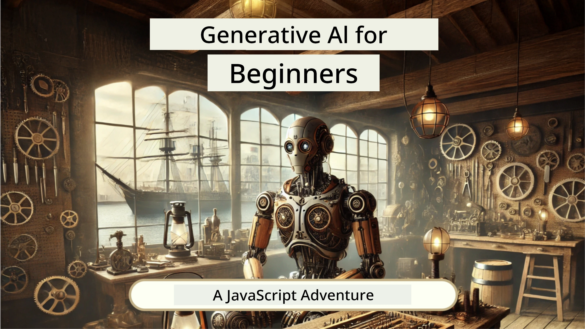
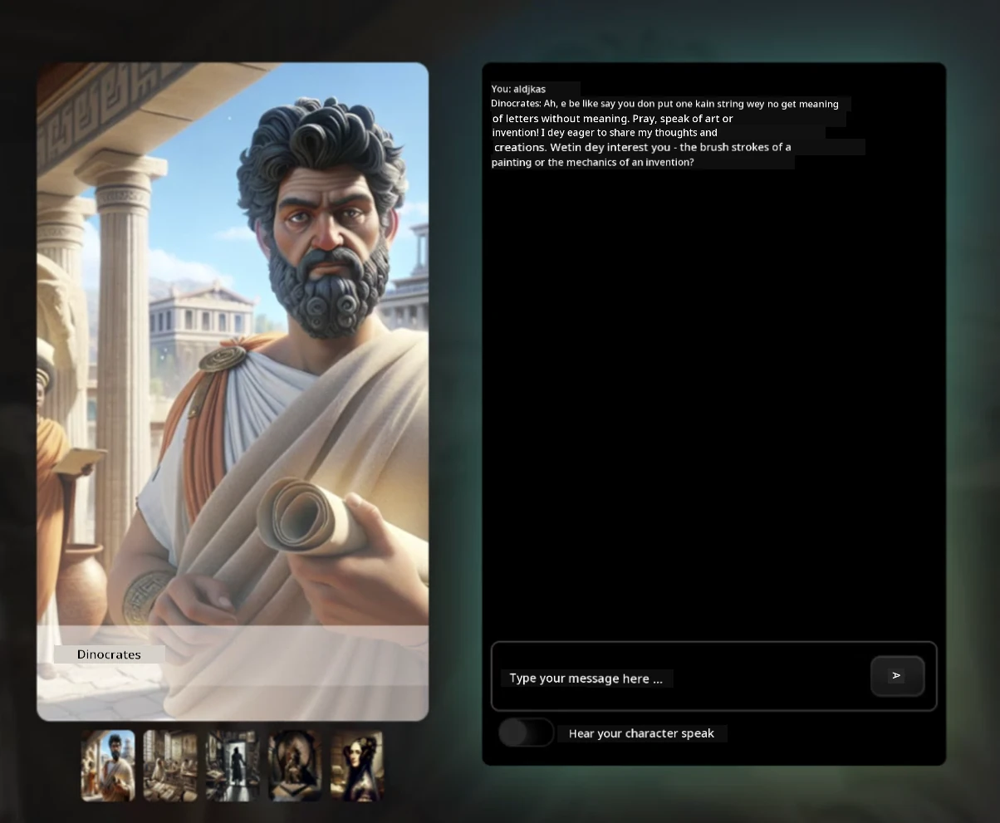
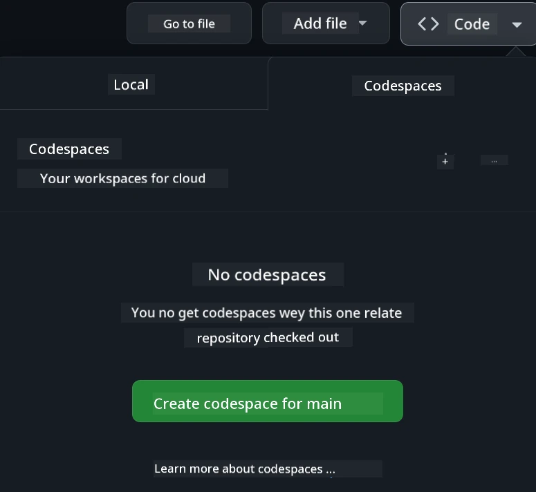

# Web Development for Beginners - A Curriculum

Learn di fundamentals of web development wit our 12-week complete course by Microsoft Cloud Advocates. Each of di 24 lessons go deep into JavaScript, CSS, and HTML through hands-on projects like terrariums, browser extensions, and space games. Engage wit quizzes, discussions, and practical assignments. Improve your skills and make sure sey you sabi well wit our good project-based way to learn. Start your coding journey today!

Join di Azure AI Foundry Discord Community

Follow these steps to start to use these resources:
1. **Fork di Repository**: Click [](https://GitHub.com/microsoft/Web-Dev-For-Beginners/fork)
2. **Clone di Repository**:   `git clone https://github.com/microsoft/Web-Dev-For-Beginners.git`
3. [**Join Di Azure AI Foundry Discord and meet experts and fellow developers**](https://discord.com/invite/ByRwuEEgH4)

### 🌐 Multi-Language Support

#### Supported via GitHub Action (Automated & Always Up-to-Date)

> **Prefer to Clone Locally?**

> Dis repository get 50+ language translations wey go make di download size big. To clone without translations, use sparse checkout:
> ```bash
> git clone --filter=blob:none --sparse https://github.com/microsoft/Web-Dev-For-Beginners.git
> cd Web-Dev-For-Beginners
> git sparse-checkout set --no-cone '/*' '!translations' '!translated_images'
> ```
> Dis go give you everything you need to finish di course faster.

**If you want make we add more translation languages, dem dey listed [here](https://github.com/Azure/co-op-translator/blob/main/getting_started/supported-languages.md)**

#### 🧑‍🎓 _You be student?_

Visit [**Student Hub page**](https://docs.microsoft.com/learn/student-hub/?WT.mc_id=academic-77807-sagibbon) wey get beginner resources, Student packs and even ways to get free certificate voucher. This na the page wey you go want bookmark and check every time because we dey change content every month.

### 📣 Announcement - New GitHub Copilot Agent mode challenges to complete!

New Challenge don add, look for "GitHub Copilot Agent Challenge 🚀" for most chapters. Na new challenge for you to complete using GitHub Copilot and Agent mode. If you never use Agent mode before e fit no only generate text but also fit create and edit files, run commands and more.

### 📣 Announcement - _New Project to build using Generative AI_ 

New AI Assistant project just add, check am [project](./9-chat-project/README.md)

### 📣 Announcement - _New Curriculum_ on Generative AI for JavaScript just release

No miss our new Generative AI curriculum!

Visit [https://aka.ms/genai-js-course](https://aka.ms/genai-js-course) to start!



- Lessons wey cover everything from basics to RAG.
- Talk to historical characters using GenAI and our companion app.
- Fun and interesting story, you go dey time travel!




Every lesson get assignment to finish, knowledge check and challenge to guide you for learning topics like:
- Prompting and prompt engineering
- Text and image app generation
- Search apps

Visit [https://aka.ms/genai-js-course](https://aka.ms/genai-js-course) to start!


## 🌱 Getting Started

> **Teachers**, we get [some suggestions](for-teachers.md) on how to take use this curriculum. We go like make you give feedback [for our discussion forum](https://github.com/microsoft/Web-Dev-For-Beginners/discussions/categories/teacher-corner)!

**[Learners](https://aka.ms/student-page/?WT.mc_id=academic-77807-sagibbon)**, for each lesson, start wit pre-lecture quiz and follow am to read di lecture material, finish di activities and check your understanding wit post-lecture quiz.

To make your learning better, join wit your peers to work on projects together! Discussions dey encouraged for our [discussion forum](https://github.com/microsoft/Web-Dev-For-Beginners/discussions) where our moderators go dey available to answer your questions.

To continue your education, we dey recommend say you check [Microsoft Learn](https://learn.microsoft.com/users/wirelesslife/collections/p1ddcy5jwy0jkm?WT.mc_id=academic-77807-sagibbon) for more study materials.

### 📋 Setting up your environment

Dis curriculum get development environment ready! As you start, you fit choose run di curriculum for [Codespace](https://github.com/features/codespaces/) (_na browser-based, no need install environment_), or locally for your computer using text editor like [Visual Studio Code](https://code.visualstudio.com/?WT.mc_id=academic-77807-sagibbon).

#### Create your repository
To make am easy for you to save your work, e good make you create your own copy of dis repository. You fit do am by clicking di **Use this template** button at di top of di page. E go create new repository for your GitHub account with copy of di curriculum.

Follow these steps:
1. **Fork the Repository**: Click on di "Fork" button for top-right corner of dis page.
2. **Clone the Repository**:   `git clone https://github.com/microsoft/Web-Dev-For-Beginners.git`

#### Running di curriculum in a Codespace

For your copy of dis repository wey you create, click di **Code** button and select **Open with Codespaces**. E go create new Codespace for you to work.



#### Running di curriculum locally on your computer

To run dis curriculum locally for your computer, you go need text editor, browser and command line tool. Our first lesson, [Introduction to Programming Languages and Tools of the Trade](../../1-getting-started-lessons/1-intro-to-programming-languages), go show you options for each of these tools to pick wey fit you best.

Our advice na to use [Visual Studio Code](https://code.visualstudio.com/?WT.mc_id=academic-77807-sagibbon) as your editor, wey get inside [Terminal](https://code.visualstudio.com/docs/terminal/basics/?WT.mc_id=academic-77807-sagibbon). You fit download Visual Studio Code [here](https://code.visualstudio.com/?WT.mc_id=academic-77807-sagibbon).

1. Clone your repository to your computer. You fit do am by clicking di **Code** button and copy di URL:

    [CodeSpace](./images/createcodespace.png)
Then, open [Terminal](https://code.visualstudio.com/docs/terminal/basics/?WT.mc_id=academic-77807-sagibbon) inside [Visual Studio Code](https://code.visualstudio.com/?WT.mc_id=academic-77807-sagibbon) and run dis command, replace `<your-repository-url>` with di URL wey you just copy:

    ```bash 
    git clone <your-repository-url>
    ```

2. Open di folder for Visual Studio Code. You fit do dis by click **File** > **Open Folder** and choose di folder wey you just clone.


> Recommended Visual Studio Code extensions:
>
> * [Live Server](https://marketplace.visualstudio.com/items?itemName=ritwickdey.LiveServer&WT.mc_id=academic-77807-sagibbon) - for preview HTML pages inside Visual Studio Code
> * [Copilot](https://marketplace.visualstudio.com/items?itemName=GitHub.copilot&WT.mc_id=academic-77807-sagibbon) - to help you write code quick quick

## 📂 Each lesson get:

- optional sketchnote
- optional supplemental video
- pre-lesson warmup quiz
- written lesson
- for project-based lessons, step-by-step guides on how to build di project
- knowledge checks
- challenge
- supplemental reading
- assignment
- [post-lesson quiz](https://ff-quizzes.netlify.app/web/)

> **One note about quizzes**: All quizzes dey inside Quiz-app folder, total na 48 quizzes with three questions each. Dem dey available [here](https://ff-quizzes.netlify.app/web/), di quiz app fit run locally or you fit deploy am for Azure; follow di instruction inside `quiz-app` folder.

## 🗃️ Lessons

|     |                       Project Name                       |                            Concepts Taught                             | Learning Objectives                                                                                                                 |                                                         Linked Lesson                                                          |         Author          |
| :-: | :------------------------------------------------------: | :--------------------------------------------------------------------: | ----------------------------------------------------------------------------------------------------------------------------------- | :----------------------------------------------------------------------------------------------------------------------------: | :---------------------: |
| 01  |                     Getting Started                      |           Introduction to Programming and Tools of the Trade           | Learn di basic foundation wey most programming languages get and about software wey dey help professional developers do dia work | [Intro to Programming Languages and Tools of the Trade](./1-getting-started-lessons/1-intro-to-programming-languages/README.md) |         Jasmine         |
| 02  |                     Getting Started                      |             Basics of GitHub, including how to work with team          | How to use GitHub for your project, how to collaborate with others on code base                                                     |                            [Intro to GitHub](./1-getting-started-lessons/2-github-basics/README.md)                             |          Floor          |
| 03  |                     Getting Started                      |                             Accessibility                              | Learn di basics of web accessibility                                                                                               |                       [Accessibility Fundamentals](./1-getting-started-lessons/3-accessibility/README.md)                       |       Christopher       |
| 04  |                        JS Basics                         |                         JavaScript Data Types                          | Basics of JavaScript data types                                                                                                    |                                       [Data Types](./2-js-basics/1-data-types/README.md)                                        |         Jasmine         |
| 05  |                        JS Basics                         |                         Functions and Methods                          | Learn about functions and methods to manage how application logic dey flow                                                           |                              [Functions and Methods](./2-js-basics/2-functions-methods/README.md)                               | Jasmine and Christopher |
| 06  |                        JS Basics                         |                        Making Decisions with JS                        | Learn how to create condition inside your code using decision-making methods                                                        |                                 [Making Decisions](./2-js-basics/3-making-decisions/README.md)                                  |         Jasmine         |
| 07  |                        JS Basics                         |                            Arrays and Loops                            | Work with data using arrays and loops in JavaScript                                                                                 |                                   [Arrays and Loops](./2-js-basics/4-arrays-loops/README.md)                                    |         Jasmine         |
| 08  |       [Terrarium](./3-terrarium/solution/README.md)       |                            HTML in Practice                            | Build di HTML to create online terrarium, dey focus on building layout                                                              |                                 [Introduction to HTML](./3-terrarium/1-intro-to-html/README.md)                                 |           Jen           |
| 09  |       [Terrarium](./3-terrarium/solution/README.md)       |                            CSS in Practice                             | Build di CSS to style di online terrarium, focus on basics of CSS including making di page responsive                               |                                  [Introduction to CSS](./3-terrarium/2-intro-to-css/README.md)                                  |           Jen           |
| 10  |            [Terrarium](./3-terrarium/solution/README.md)            |                 JavaScript Closures, DOM manipulation                  | Build di JavaScript to make terrarium work as drag/drop interface, focus on closures and DOM manipulation                           |                  [JavaScript Closures, DOM manipulation](./3-terrarium/3-intro-to-DOM-and-closures/README.md)                   |           Jen           |
| 11  |          [Typing Game](./4-typing-game/solution/README.md)          |                          Build a Typing Game                           | Learn how to use keyboard events to run the logic of your JavaScript app                                                           |                                [Event-Driven Programming](./4-typing-game/typing-game/README.md)                                |       Christopher       |
| 12  | [Green Browser Extension](./5-browser-extension/solution/README.md) |                         Working with Browsers                          | Learn how browsers work, dia history, and how to scaffold di first elements of a browser extension                                   |                               [About Browsers](./5-browser-extension/1-about-browsers/README.md)                                |           Jen           |
| 13  | [Green Browser Extension](./5-browser-extension/solution/README.md) | Building form, dey call API and storing variables inside local storage | Build JavaScript elements of your browser extension to call API using variables wey dey store inside local storage                   |                [APIs, Forms, and Local Storage](./5-browser-extension/2-forms-browsers-local-storage/README.md)                 |           Jen           |
| 14  | [Green Browser Extension](./5-browser-extension/solution/README.md) |          Background processes for browser, web performance             | Use browser background processes to manage extension icon; learn about web performance and some optimization to improve am       |             [Background Tasks and Performance](./5-browser-extension/3-background-tasks-and-performance/README.md)              |           Jen           |
| 15  |           [Space Game](./6-space-game/solution/README.md)           |             More Advanced Game Development with JavaScript             | Learn about Inheritance using both Classes and Composition and Pub/Sub pattern, to prepare for building game                          |                      [Introduction to Advanced Game Development](./6-space-game/1-introduction/README.md)                       |          Chris          |
| 16  |           [Space Game](./6-space-game/solution/README.md)           |                           Drawing to canvas                            | Learn about di Canvas API wey dem dey use to draw elements for screen                                                               |                                [Drawing to Canvas](./6-space-game/2-drawing-to-canvas/README.md)                                |          Chris          |
| 17  |           [Space Game](./6-space-game/solution/README.md)           |                   Moving elements around di screen                     | Discover how elements fit move using Cartesian coordinates and di Canvas API                                                        |                           [Moving Elements Around](./6-space-game/3-moving-elements-around/README.md)                           |          Chris          |
| 18  |           [Space Game](./6-space-game/solution/README.md)           |                          Collision detection                           | Make elements collide and react to each other with keypresses and put cooldown function to make sure game performance pep           |                              [Collision Detection](./6-space-game/4-collision-detection/README.md)                              |          Chris          |
| 19  |           [Space Game](./6-space-game/solution/README.md)           |                             Keeping score                              | Do math calculations based on di game status and performance                                                                         |                                    [Keeping Score](./6-space-game/5-keeping-score/README.md)                                    |          Chris          |
| 20  |           [Space Game](./6-space-game/solution/README.md)           |                     Ending and restarting di game                      | Learn about ending and restarting game, including cleaning up assets and resetting variable values                                  |                                [The Ending Condition](./6-space-game/6-end-condition/README.md)                                 |          Chris          |
| 21  |         [Banking App](./7-bank-project/solution/README.md)          |                 HTML Templates and Routes for Web App                 | Learn how to create scaffold of multipage website architecture using routing and HTML templates                                       |                            [HTML Templates and Routes](./7-bank-project/1-template-route/README.md)                             |          Yohan          |
| 22  |         [Banking App](./7-bank-project/solution/README.md)          |                  Build Login and Registration Form                    | Learn how to build forms and handle validation routines                                                                              |                                           [Forms](./7-bank-project/2-forms/README.md)                                           |          Yohan          |
| 23  |         [Banking App](./7-bank-project/solution/README.md)          |                   Methods of Fetching and Using Data                   | How data dey flow in and out of your app, how to fetch am, store am, and discard am                                                  |                                            [Data](./7-bank-project/3-data/README.md)                                            |          Yohan          |
| 24  |         [Banking App](./7-bank-project/solution/README.md)          |                      Concepts of State Management                      | Learn how your app dey keep state and how to manage am programmatically                                                              |                                [State Management](./7-bank-project/4-state-management/README.md)                                |          Yohan          |
| 25 | [Browser/VScode Code](../../8-code-editor) | Working with VScode | Learn how to Using code editor| [Use VScode Code Editor](./8-code-editor/1-using-a-code-editor/README.md) | Chris |
| 26 | [AI Assistants](./9-chat-project/README.md) | Working with AI | Learn how to build your own AI assistant | [AI Assistant project](./9-chat-project/README.md) | Chris |

## 🏫 Pedagogy

Our curriculum design take two main pedagogy principles seriously:
* project-based learning
* frequent quizzes

Di program dey teach fundamentals of JavaScript, HTML, and CSS, plus di latest tools and techniques wey web developers dey use now. Students go fit develop hands-on experience by building typing game, virtual terrarium, eco-friendly browser extension, space-invader style game, and banking app for businesses. By the end of the course, students go get solid understanding of web development.

> 🎓 You fit take di first few lessons in dis curriculum as [Learn Path](https://docs.microsoft.com/learn/paths/web-development-101/?WT.mc_id=academic-77807-sagibbon) for Microsoft Learn!

By making sure content match projects, the process go make learning more interesting for students and concepts go remain for mind well well. We also write some starter lessons for JavaScript basics to introduce concepts, plus video from "[Beginners Series to: JavaScript](https://channel9.msdn.com/Series/Beginners-Series-to-JavaScript/?WT.mc_id=academic-77807-sagibbon)" collection of video tutorials, some authors from the videos join to help design this curriculum.

Plus, low-stakes quiz before class dey set student mindset for learning topic, and second quiz after class make sure say dem remember well. This curriculum na flexible and fun one wey you fit do as whole or part. Projects start small and go get more complex by 12-week cycle end.

Even though we no bother to introduce JavaScript frameworks so that we go focus on basic skills wey web developers need before use framework, good next step after dis curriculum na to learn Node.js with another video series: "[Beginner Series to: Node.js](https://channel9.msdn.com/Series/Beginners-Series-to-Nodejs/?WT.mc_id=academic-77807-sagibbon)".

> Visit our [Code of Conduct](CODE_OF_CONDUCT.md) and [Contributing](CONTRIBUTING.md) guidelines. We welcome your constructive feedback!


## 🧭 Offline access

You fit run dis documentation offline by using [Docsify](https://docsify.js.org/#/). Fork this repo, [install Docsify](https://docsify.js.org/#/quickstart) for your local machine, then for root folder of dis repo, type `docsify serve`. Di website go dey serve for port 3000 for your localhost: `localhost:3000`.

## 📘 PDF

PDF of all di lessons fit find [here](https://microsoft.github.io/Web-Dev-For-Beginners/pdf/readme.pdf).


## 🎒 Other Courses
Our team dey produce oda courses! Make you check am out:

<!-- CO-OP TRANSLATOR OTHER COURSES START -->
### LangChain
[](https://aka.ms/langchain4j-for-beginners)
[](https://aka.ms/langchainjs-for-beginners?WT.mc_id=m365-94501-dwahlin)
[](https://github.com/microsoft/langchain-for-beginners?WT.mc_id=m365-94501-dwahlin)
---

### Azure / Edge / MCP / Agents
[](https://github.com/microsoft/AZD-for-beginners?WT.mc_id=academic-105485-koreyst)
[](https://github.com/microsoft/edgeai-for-beginners?WT.mc_id=academic-105485-koreyst)
[](https://github.com/microsoft/mcp-for-beginners?WT.mc_id=academic-105485-koreyst)
[](https://github.com/microsoft/ai-agents-for-beginners?WT.mc_id=academic-105485-koreyst)

---
 
### Generative AI Series
[](https://github.com/microsoft/generative-ai-for-beginners?WT.mc_id=academic-105485-koreyst)
[-9333EA?style=for-the-badge&labelColor=E5E7EB&color=9333EA)](https://github.com/microsoft/Generative-AI-for-beginners-dotnet?WT.mc_id=academic-105485-koreyst)
[-C084FC?style=for-the-badge&labelColor=E5E7EB&color=C084FC)](https://github.com/microsoft/generative-ai-for-beginners-java?WT.mc_id=academic-105485-koreyst)
[-E879F9?style=for-the-badge&labelColor=E5E7EB&color=E879F9)](https://github.com/microsoft/generative-ai-with-javascript?WT.mc_id=academic-105485-koreyst)

---
 
### Core Learning
[](https://aka.ms/ml-beginners?WT.mc_id=academic-105485-koreyst)
[](https://aka.ms/datascience-beginners?WT.mc_id=academic-105485-koreyst)
[](https://aka.ms/ai-beginners?WT.mc_id=academic-105485-koreyst)
[](https://github.com/microsoft/Security-101?WT.mc_id=academic-96948-sayoung)
[](https://aka.ms/webdev-beginners?WT.mc_id=academic-105485-koreyst)
[](https://aka.ms/iot-beginners?WT.mc_id=academic-105485-koreyst)
[](https://github.com/microsoft/xr-development-for-beginners?WT.mc_id=academic-105485-koreyst)

---
 
### Copilot Series
[](https://aka.ms/GitHubCopilotAI?WT.mc_id=academic-105485-koreyst)
[](https://github.com/microsoft/mastering-github-copilot-for-dotnet-csharp-developers?WT.mc_id=academic-105485-koreyst)
[](https://github.com/microsoft/CopilotAdventures?WT.mc_id=academic-105485-koreyst)
<!-- CO-OP TRANSLATOR OTHER COURSES END -->

## Getting Help

If you jam or get any question about how to build AI apps. Come join other learners and developers wey sabi well well for talks about MCP. Na supportive community wey dey welcome questions and dem share knowledge freely.

[](https://discord.gg/nTYy5BXMWG)

If you get product feedback or you see error as you dey build, visit:

[](https://aka.ms/foundry/forum)

## License

Dis repository get MIT license. See the [LICENSE](../../LICENSE) file for more info.

---

<!-- CO-OP TRANSLATOR DISCLAIMER START -->
**Disclaimer**:
Dis document don translate wit AI translation service wey dem dey call [Co-op Translator](https://github.com/Azure/co-op-translator). Even though we dey try make am correct, abeg mek you sabi say machine translation fit get some errors or wrong tins. The og document for im original language na di correct one wey you suppose trust. If na important info, better make person wey sabi translate am well do the work. We no go take responsibility if pesin no understand or misunderstand tins because of dis translation.
<!-- CO-OP TRANSLATOR DISCLAIMER END -->