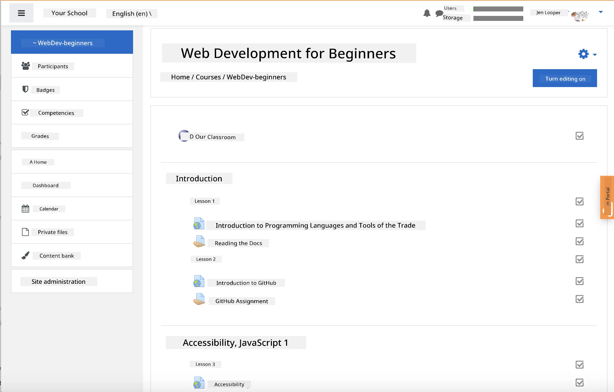
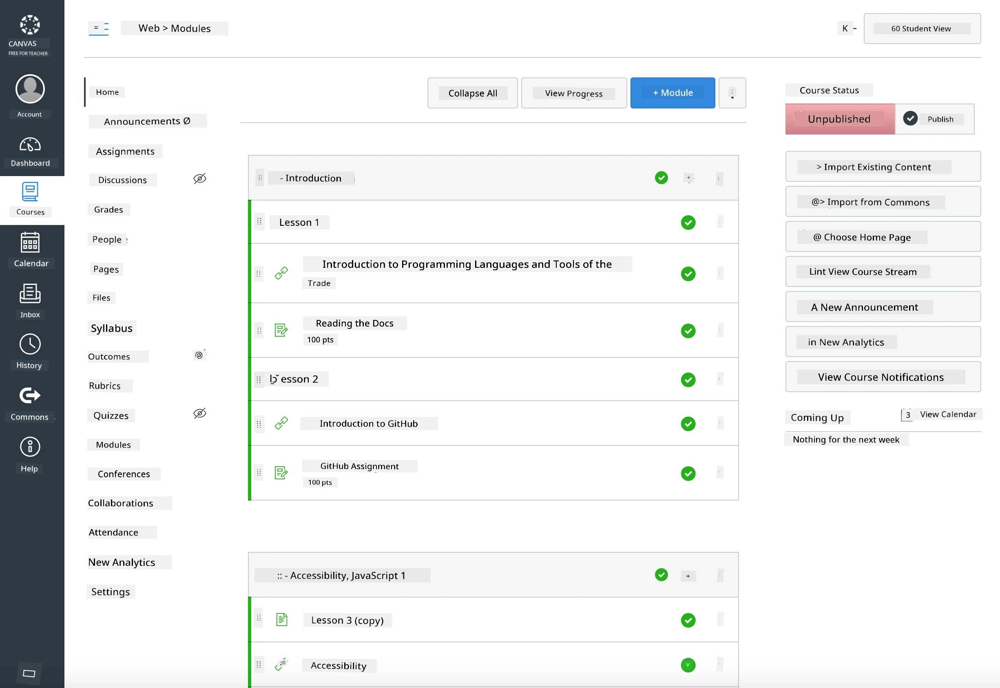

<!--
CO_OP_TRANSLATOR_METADATA:
{
  "original_hash": "71009af209f81cc01a1f2d324200375f",
  "translation_date": "2026-01-08T10:10:13+00:00",
  "source_file": "for-teachers.md",
  "language_code": "pcm"
}
-->
### For Educators

Una fit use dis curriculum for una classroom. E dey work well well wit GitHub Classroom and di beta LMS platforms dem, and e fit also be standalone repo wey una fit use wit una students.

### Use with GitHub Classroom

To manage lessons and assignments per cohort, create one repository per lesson so GitHub Classroom fit attach each assignment independently.

- Fork dis repo to una organization.
- Create separate repo for each lesson by comot each lesson folder make e dey im own repository.
  - Option A: Create empty repos (one per lesson) and copy di lesson folder contents inside each.
  - Option B: Use Git history‑preserving way (e.g., split folder into new repo) if you need provenance.
- For GitHub Classroom, create assignment per lesson and point am to di matching lesson repo.
- Recommended settings:
  - Repository visibility: private for student work.
  - Use starter code from di lesson repo’s default branch.
  - Add issue and pull request templates for quizzes and submissions.
  - You fit also configure autograding and tests if una lessons get dem.
- Things wey go help:
  - Repository names like lesson-01-intro, lesson-02-html, etc.
  - Labels: quiz, assignment, needs-review, late, resubmission.
  - Tags/releases per cohort (e.g., v2025-term1).

Tip: Make you no dey keep repositories for synced folders (like OneDrive/Google Drive) so dat Git no go get wahala for Windows.

### Use with Moodle, Canvas, or Blackboard

Dis curriculum get importable packages for common LMS workflows.

- Moodle: Use di Moodle upload file [Moodle upload file](../../../../../../../teaching-files/webdev-moodle.mbz) to load di full course.
- Common Cartridge: Use di Common Cartridge file [Common Cartridge file](../../../../../../../teaching-files/webdev-common-cartridge.imscc) for wider LMS compatibility.
- Notes:
  - Moodle Cloud limited for Common Cartridge support. Better make you use di Moodle file wey dey on top, wey you fit still upload inside Canvas.
  - After you import, check modules, due dates, and quiz settings make e match your term schedule.

> Di curriculum for Moodle classroom

> Di curriculum for Canvas

### Use di repo directly (no Classroom)

If you nor wan use GitHub Classroom, you fit run di course directly from dis repo.

- Synchronous/online formats (Zoom/Teams):
  - Run short mentor‑led warmups; use breakout rooms for quizzes.
  - Make dem know di time window for quizzes; students go submit answers as GitHub Issues.
  - For collaborative assignments, students go work in public lesson repos and open pull requests.
- Private/asynchronous formats:
  - Students go fork each lesson to their own **private** repos and add you as collaborator.
  - Dem go submit via Issues (quizzes) and Pull Requests (assignments) on your classroom repo or their private forks.

### Best practices

- Give orientation lesson on Git/GitHub basics, Issues, and PRs.
- Use checklists for multi‑step quizzes/assignments inside Issues.
- Add CONTRIBUTING.md and CODE_OF_CONDUCT.md to set classroom norms.
- Add accessibility notes (alt text, captions) and offer printable PDFs.
- Version your content every term and freeze lesson repos after you publish.

### Feedback and support

We want dis curriculum to work well for you and your students. Abeg open new Issue for dis repository if you find bugs, requests, or improvements, or start discussion for Teacher Corner.

---

<!-- CO-OP TRANSLATOR DISCLAIMER START -->
**Warning**:  
Dis document na AI translation tool [Co-op Translator](https://github.com/Azure/co-op-translator) translate am. We dey try make am correct, but make you sabi say machine fit make mistake or get wrong meaning sometimes. The original document wey dem write for di main language na di correct one wey you suppose trust. If na serious matter, better to use person wey sabi human translation. We no go gree if you misunderstand or sabi wrong from this translation.
<!-- CO-OP TRANSLATOR DISCLAIMER END -->