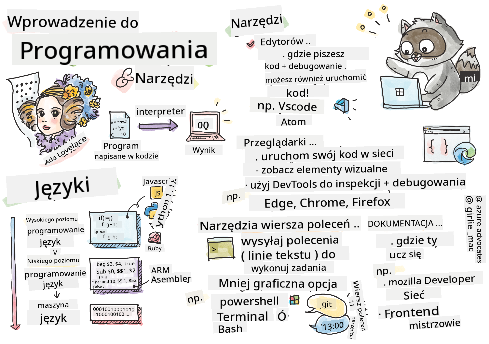
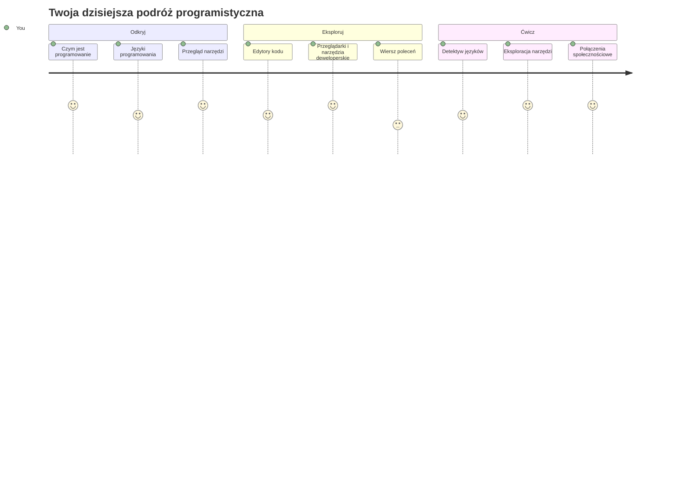
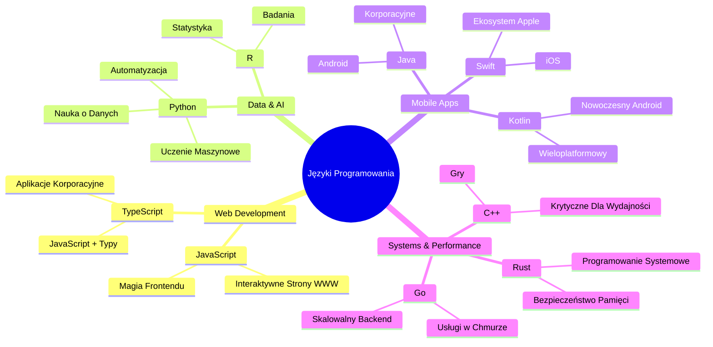
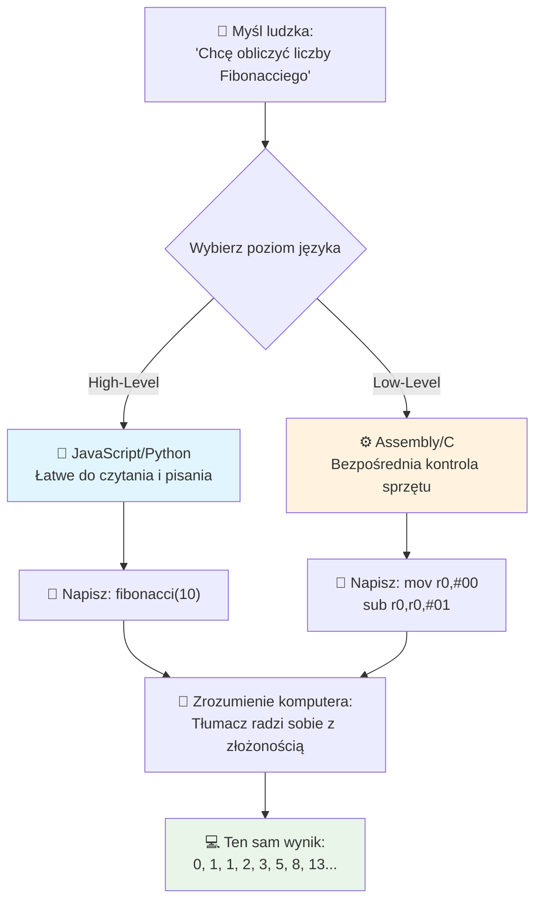
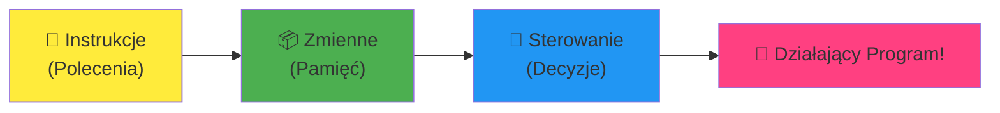
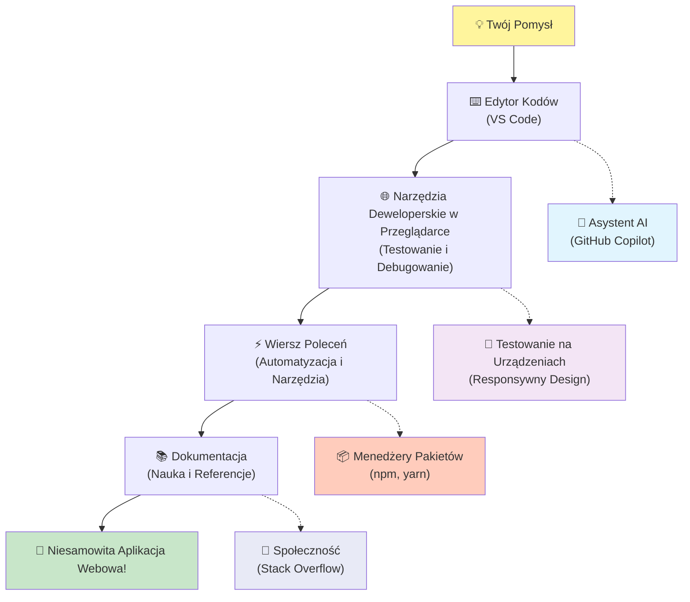
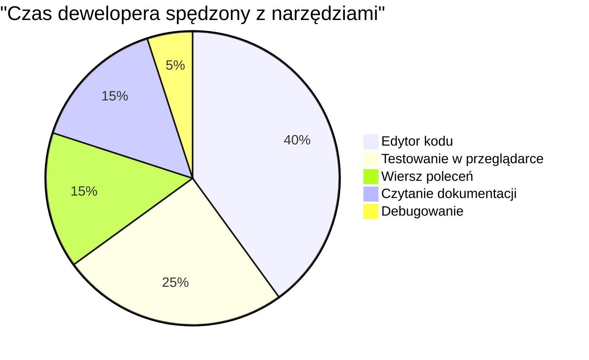
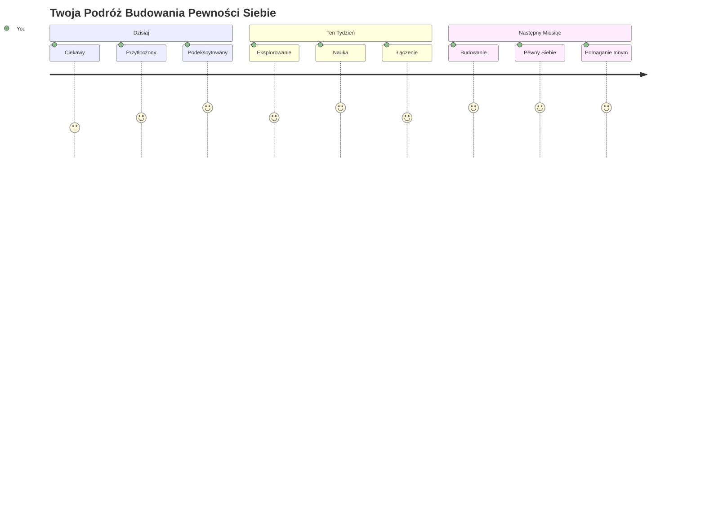

<!--
CO_OP_TRANSLATOR_METADATA:
{
  "original_hash": "d45ddcc54eb9232a76d08328b09d792e",
  "translation_date": "2026-01-06T19:58:04+00:00",
  "source_file": "1-getting-started-lessons/1-intro-to-programming-languages/README.md",
  "language_code": "pl"
}
-->
# Wprowadzenie do języków programowania i nowoczesnych narzędzi dla programistów
 
Cześć, przyszły programisto! 👋 Czy mogę Ci powiedzieć coś, co wciąż przyprawia mnie o dreszcze za każdym razem? Zaraz odkryjesz, że programowanie to nie tylko komputery – to prawdziwe supermoce pozwalające wcielić w życie najbardziej dzikie pomysły!

Znacie ten moment, gdy korzystacie ze swojej ulubionej aplikacji i wszystko działa idealnie? Gdy stukacie w przycisk i dzieje się coś absolutnie magicznego, co sprawia, że mówicie „wow, jak oni to zrobili?” Cóż, ktoś taki jak Ty – pewnie siedząc w swojej ulubionej kawiarni o 2 w nocy przy trzecim espresso – napisał kod, który stworzył tę magię. A teraz coś, co Cię zaskoczy: na końcu tej lekcji nie tylko zrozumiesz, jak to działa, ale będziesz wręcz chcę to sam wypróbować!

Słuchaj, całkowicie rozumiem, jeśli programowanie wydaje się teraz przerażające. Kiedy zaczynałem, szczerze myślałem, że trzeba być geniuszem matematycznym albo kodować od piątego roku życia. Ale oto, co całkowicie zmieniło moje podejście: programowanie to dokładnie jak nauka prowadzenia rozmów w nowym języku. Zaczynasz od „cześć” i „dziękuję”, potem potrafisz zamówić kawę, a zanim się obejrzysz, prowadzisz głębokie filozoficzne dyskusje! Tyle że w tym przypadku rozmawiasz z komputerami, a one? One są najbardziej cierpliwymi rozmówcami, jakich poznasz – nigdy nie oceniają Twoich błędów i zawsze chętnie próbują ponownie!

Dziś poznamy niesamowite narzędzia, które sprawiają, że nowoczesne tworzenie stron internetowych jest nie tylko możliwe, ale też niesamowicie wciągające. Mówię o tych samych edytorach, przeglądarkach i przepływach pracy, z których korzystają programiści Netflixa, Spotify oraz Twojego ulubionego studia indie tworzącego aplikacje każdego dnia. I oto część, która sprawi, że zatańczysz z radości: większość tych profesjonalnych, standardowych narzędzi jest całkowicie darmowa!


> Sketchnote autorstwa [Tomomi Imura](https://twitter.com/girlie_mac)


## Sprawdź, co już wiesz!

Zanim przejdziemy do zabawy, jestem ciekaw – co już wiesz o tym świecie programowania? I słuchaj, jeśli patrzysz na te pytania myśląc „dosłownie nic o tym nie wiem”, to nie tylko w porządku, to idealnie! To znaczy, że jesteś dokładnie tam, gdzie powinieneś być. Traktuj ten quiz jak rozgrzewkę przed treningiem – po prostu rozgrzewamy mięśnie mózgu!

[Weź udział w quizie wstępnym](https://forms.office.com/r/dru4TE0U9n?origin=lprLink)


## Przygoda, w którą zaraz wyruszymy razem

Dobra, naprawdę nie mogę się doczekać, co dziś odkryjemy! Naprawdę, chciałbym widzieć Twoją minę, gdy niektóre z tych koncepcji wreszcie zaczną do Ciebie trafiać. Oto niesamowita podróż, na którą ruszamy razem:

- **Czym tak naprawdę jest programowanie (i dlaczego to najfajniejsza rzecz na świecie!)** – Poznamy, jak kod jest dosłownie niewidzialną magią napędzającą wszystko wokół ciebie, od tego alarmu, który jakoś wie, że jest poniedziałek rano, po algorytm, który idealnie dopasowuje rekomendacje na Netflixie
- **Języki programowania i ich niesamowite osobowości** – Wyobraź sobie imprezę, na którą każdy człowiek przynosi zupełnie inne supermoce i sposoby rozwiązywania problemów. Tak wygląda świat języków programowania, a ty pokochasz je poznawać!
- **Fundamentalne elementy, które tworzą cyfrową magię** – Pomyśl o nich jak o ostatecznym kreatywnym zestawie LEGO. Kiedy zrozumiesz, jak pasują do siebie te elementy, uświadomisz sobie, że możesz dosłownie zbudować wszystko, co tylko wymyśli twoja wyobraźnia
- **Profesjonalne narzędzia, które sprawią, że poczujesz się jakbyś dostał różdżkę czarodzieja** – Nie przesadzam – te narzędzia naprawdę sprawią, że poczujesz się jak posiadający supermoce, a najlepsze jest to, że to dokładnie te same, z których korzystają profesjonaliści!

> 💡 **Tylko jedna sprawa**: Nie próbuj dzisiaj wszystkiego zapamiętać! Teraz chcę tylko, żebyś poczuł ten błysk ekscytacji tym, co jest możliwe. Szczegóły wbiją się naturalnie, gdy będziemy ćwiczyć – tak naprawdę uczy się najlepiej!

> Możesz wykonać tę lekcję na [Microsoft Learn](https://docs.microsoft.com/learn/modules/web-development-101/introduction-programming/?WT.mc_id=academic-77807-sagibbon)!

## Czym dokładnie *jest* programowanie?

Dobra, zajmijmy się milionowym pytaniem: czym właściwie jest programowanie?

Opowiem Ci historię, która całkowicie zmieniła moje podejście. W zeszłym tygodniu próbowałem wytłumaczyć mamie, jak korzystać z naszego nowego pilota do smart TV. Złapałem się na tym, że mówię rzeczy typu „Naciśnij czerwony przycisk, ale nie ten duży czerwony, ten mały czerwony po lewej... nie, tamta twoja lewa... ok, teraz przytrzymaj przez dwie sekundy, nie jedną, nie trzy...” Brzmi znajomo? 😅

To jest właśnie programowanie! To sztuka dawania niezwykle szczegółowych, krok po kroku instrukcji czemuś, co jest bardzo potężne, ale wymaga, by wszystko było dosłownie napisane dokładnie. Tyle że zamiast tłumaczyć to mamie (która może zapytać „który czerwony przycisk?!”), tłumaczysz to komputerowi (który robi dokładnie to, co mu powiesz, nawet jeśli to nie do końca to, co miałeś na myśli).

Oto co mnie oszołomiło, gdy się tego nauczyłem: komputery są w gruncie rzeczy dość proste. Dosłownie rozumieją tylko dwie rzeczy – 1 i 0, co jest w zasadzie "tak" i "nie" albo "włączone" i "wyłączone". To wszystko! Ale tutaj zaczyna się magia – nie musimy mówić w 1 i 0 jak w Matrixie. Wtedy pojawiają się na ratunek **języki programowania**. To jak posiadanie najlepszego tłumacza na świecie, który bierze twoje zwykłe ludzkie myśli i przekłada je na język komputera.

I oto co nadal przyprawia mnie o dreszcze każdego ranka, gdy się budzę: dosłownie *wszystko* cyfrowe w twoim życiu zaczęło się od kogoś takiego jak ty, pewnie siedzącego w piżamie z kubkiem kawy, piszącego kod na laptopie. Ten filtr na Instagramie, który sprawia, że wyglądasz perfekcyjnie? Ktoś go zaprogramował. Rekomendacja, która doprowadziła cię do twojej nowej ulubionej piosenki? Algorytm stworzył developer. Aplikacja, która pomaga dzielić rachunki za obiad z przyjaciółmi? Tak, ktoś pomyślał „to jest irytujące, pewnie mógłbym to naprawić” i... zrobił!

Kiedy uczysz się programować, nie tylko zdobywasz nową umiejętność – stajesz się częścią niesamowitej społeczności rozwiązywaczy problemów, którzy spędzają dni myśląc „A co jeśli mógłbym zbudować coś, co sprawi, że czyjś dzień będzie choć odrobinę lepszy?” Szczerze, czy jest coś fajniejszego?

✅ **Zabawa Faktami**: Oto coś super ciekawego do sprawdzenia, gdy będziesz miał chwilę – kto był pierwszym na świecie programistą? Dam Ci wskazówkę: może to nie być ta osoba, której się spodziewasz! Historia tej osoby jest absolutnie fascynująca i pokazuje, że programowanie od zawsze było o kreatywnym rozwiązywaniu problemów i myśleniu poza schematem.

### 🧠 **Czas na refleksję: Jak się czujesz?**

**Zatrzymaj się na chwilę i pomyśl:**
- Czy teraz idea „dawania instrukcji komputerom” ma dla Ciebie sens?
- Czy potrafisz wymyślić jakąś codzienną czynność, którą chciałbyś zautomatyzować programowaniem?
- Jakie pytania pojawiają się w Twojej głowie o całym tym programowaniu?

> **Pamiętaj**: to całkowicie normalne, jeśli niektóre koncepcje wydają się teraz niejasne. Nauka programowania to jak nauka nowego języka – mózg potrzebuje czasu, by zbudować odpowiednie połączenia nerwowe. Radzisz sobie świetnie!

## Języki programowania są jak różne smaki magii

Dobra, to zabrzmi dziwnie, ale zostań ze mną – języki programowania są jak różne gatunki muzyki. Pomyśl: masz jazz, który jest gładki i improwizowany, rock, który jest mocny i prosty, klasykę, która jest elegancka i uporządkowana, oraz hip-hop, który jest kreatywny i ekspresyjny. Każdy styl ma swój klimat, swoją społeczność fanów i każdy jest idealny na inne nastroje i okazje.

Języki programowania działają dokładnie tak samo! Nie użyłbyś tego samego języka do zbudowania zabawnej gry mobilnej, którego użyłbyś do przetwarzania ogromnej ilości danych klimatycznych, tak jak nie zagrałbyś death metalu na zajęciach z jogi (no, chyba że w większości zajęć z jogi! 😄).

Ale to, co mnie za każdym razem zachwyca: te języki to jak mieć najcierpliwszego, genialnego tłumacza świata siedzącego tuż obok ciebie. Możesz wyrażać swoje pomysły w sposób naturalny dla twojego ludzkiego mózgu, a on zajmuje się całym tym niesamowicie skomplikowanym procesem tłumaczenia ich na 1 i 0, którymi naprawdę mówią komputery. To jak mieć przyjaciela, który perfekcyjnie zna zarówno „ludzką kreatywność”, jak i „komputerową logikę” – nigdy się nie męczy, nigdy nie potrzebuje przerw na kawę i nigdy nie ocenia, gdy pytasz o to samo dwa razy!

### Popularne języki programowania i ich zastosowania


| Język | Do czego najlepszy | Dlaczego jest popularny |
|----------|----------|------------------|
| **JavaScript** | Tworzenie stron, interfejsy użytkownika | Działa w przeglądarkach i napędza interaktywne strony |
| **Python** | Nauka o danych, automatyzacja, AI | Łatwy do nauki i czytania, potężne biblioteki |
| **Java** | Aplikacje korporacyjne, aplikacje Android | Niezależny od platformy, solidny dla dużych systemów |
| **C#** | Aplikacje Windows, tworzenie gier | Silne wsparcie w ekosystemie Microsoft |
| **Go** | Usługi w chmurze, systemy backendowe | Szybki, prosty, zaprojektowany dla nowoczesnych komputerów |

### Języki wysokiego vs niskiego poziomu

Dobra, to był szczerze koncept, który mnie złamał, gdy zaczynałem się uczyć, więc podzielę się analogią, która w końcu mi to wyjaśniła – mam nadzieję, że Tobie też pomoże!

Wyobraź sobie, że odwiedzasz kraj, w którym nie mówisz w lokalnym języku i bardzo musisz znaleźć najbliższą toaletę (każdy to zna, prawda? 😅):

- **Programowanie niskiego poziomu** to jak nauka lokalnego dialektu tak dobrze, że możesz rozmawiać z babcią sprzedającą owoce na rogu, używając odniesień kulturowych, lokalnego slangu i żartów zrozumiałych tylko dla osób wychowanych tam. Super imponujące i niezwykle efektywne... jeśli akurat jesteś biegły! Ale raczej przytłaczające, gdy próbujesz tylko znaleźć toaletę.

- **Programowanie wysokiego poziomu** to jak mieć niesamowitego lokalnego przyjaciela, który cię rozumie. Możesz powiedzieć „Naprawdę muszę znaleźć toaletę” po angielsku, a on załatwi całą tłumaczą i poda wskazówki, które mają sens dla Twojego mózgu.

W programowaniu:
- **Języki niskiego poziomu** (np. asembler czy C) pozwalają na bardzo szczegółowe rozmowy ze sprzętem komputera, ale musisz myśleć jak maszyna, co... powiedzmy, wymaga dużej zmiany mentalnej!
- **Języki wysokiego poziomu** (np. JavaScript, Python czy C#) pozwalają myśleć jak człowiek, podczas gdy one zajmują się całą maszynową mową w tle. A do tego mają te niesamowicie gościnne społeczności pełne ludzi, którzy pamiętają, jak to jest być początkującym i naprawdę chcą pomóc!

Zgadnij, które polecam na start? 😉 Języki wysokiego poziomu to jak kółka treningowe, których nigdy nie chcesz ściągać, bo cały proces jest o wiele przyjemniejszy!


### Pokażę Ci, dlaczego języki wysokiego poziomu są o wiele przyjaźniejsze

Dobra, zaraz pokażę Ci coś, co idealnie pokazuje, dlaczego zakochałem się w językach wysokiego poziomu, ale najpierw musisz mi obiecać jedną rzecz. Gdy zobaczysz pierwszy przykład kodu, nie panikuj! Ma wyglądać na przerażający. Dokładnie o to mi chodzi!

Zobaczymy dokładnie to samo zadanie napisane w dwóch zupełnie innych stylach. Oba tworzą tzw. ciąg Fibonacciego – to piękny wzór matematyczny, w którym każda liczba jest sumą dwóch poprzednich: 0, 1, 1, 2, 3, 5, 8, 13... (Ciekawostka: ten wzór występuje dosłownie wszędzie w przyrodzie – spiralach nasion słonecznika, wzorach szyszek, nawet tworzeniu się galaktyk!)

Gotowy zobaczyć różnicę? Zaczynamy!

**Język wysokiego poziomu (JavaScript) – przyjazny dla ludzi:**

```javascript
// Krok 1: Podstawowa konfiguracja Fibonnaciego
const fibonacciCount = 10;
let current = 0;
let next = 1;

console.log('Fibonacci sequence:');
```

**Co robi ten kod:**
- **Deklaruje** stałą, która określa, ile liczb Fibonacciego chcemy wygenerować
- **Inicjalizuje** dwie zmienne, które śledzą aktualną i następną liczbę w sekwencji
- **Ustawia** wartości startowe (0 i 1), które definiują wzór Fibonacciego
- **Wyświetla** nagłówek identyfikujący nasz wynik

```javascript
// Krok 2: Wygeneruj sekwencję za pomocą pętli
for (let i = 0; i < fibonacciCount; i++) {
  console.log(`Position ${i + 1}: ${current}`);
  
  // Oblicz następny numer w sekwencji
  const sum = current + next;
  current = next;
  next = sum;
}
```

**Rozbicie na części:**
- **Pętla** przechodzi przez każdą pozycję w naszej sekwencji za pomocą pętli `for`
- **Wyświetla** każdą liczbę z jej pozycją, używając formatowania szablonowego
- **Oblicza** następną liczbę Fibonacciego, dodając aktualną i następną wartość
- **Aktualizuje** zmienne śledzące, by przejść do następnej iteracji

```javascript
// Krok 3: Nowoczesne podejście funkcyjne
const generateFibonacci = (count) => {
  const sequence = [0, 1];
  
  for (let i = 2; i < count; i++) {
    sequence[i] = sequence[i - 1] + sequence[i - 2];
  }
  
  return sequence;
};

// Przykład użycia
const fibSequence = generateFibonacci(10);
console.log(fibSequence);
```

**W powyższym:**
- **Utworzyliśmy** wielokrotnego użytku funkcję, korzystając z nowoczesnej składni funkcji strzałkowej
- **Zbudowaliśmy** tablicę do przechowywania całej sekwencji zamiast wyświetlania po kolei
- **Użyliśmy** indeksowania tablicy, aby obliczyć każdą nową liczbę na podstawie poprzednich
- **Zwróciliśmy** pełną sekwencję, by móc ją elastycznie wykorzystywać gdzie indziej w programie

**Język niskiego poziomu (ARM Assembly) – przyjazny dla komputera:**

```assembly
 area ascen,code,readonly
 entry
 code32
 adr r0,thumb+1
 bx r0
 code16
thumb
 mov r0,#00
 sub r0,r0,#01
 mov r1,#01
 mov r4,#10
 ldr r2,=0x40000000
back add r0,r1
 str r0,[r2]
 add r2,#04
 mov r3,r0
 mov r0,r1
 mov r1,r3
 sub r4,#01
 cmp r4,#00
 bne back
 end
```

Zauważ, jak wersja JavaScript czyta się prawie jak instrukcje po angielsku, podczas gdy wersja Assembly używa zakodowanych poleceń, które bezpośrednio sterują procesorem komputera. Obie wykonują dokładnie to samo zadanie, ale język wysokiego poziomu jest znacznie łatwiejszy do zrozumienia, pisania i utrzymania przez ludzi.

**Kluczowe różnice, które zauważysz:**
- **Czytelność**: JavaScript używa opisowych nazw jak `fibonacciCount`, natomiast Assembly używa tajemniczych etykiet jak `r0`, `r1`
- **Komentarze**: Języki wysokiego poziomu zachęcają do dodawania wyjaśniających komentarzy, które sprawiają, że kod jest samodokumentujący się
- **Struktura**: Logiczny przepływ JavaScript odpowiada sposobowi myślenia ludzi o problemach krok po kroku
- **Konserwacja**: Aktualizacja wersji JavaScript dla różnych wymagań jest prosta i jasna

✅ **O ciągu Fibonacciego**: Ten absolutnie przepiękny wzór liczbowy (gdzie każda liczba jest sumą dwóch poprzednich: 0, 1, 1, 2, 3, 5, 8...) pojawia się dosłownie *wszędzie* w przyrodzie! Znajdziesz go w spiralach słoneczników, wzorach na szyszkach, w sposobie, w jaki krzywią się muszle nautilusa, a nawet w tym, jak rosną gałęzie drzew. To naprawdę niesamowite, jak matematyka i kod pomagają nam rozumieć i odtwarzać wzory, które natura wykorzystuje do tworzenia piękna!


## Elementy Budulcowe, Które Tworzą Magię

Dobra, skoro już widziałeś, jak wyglądają języki programowania w akcji, rozłóżmy na części pierwsze podstawowe elementy, które tworzą dosłownie każdy kiedykolwiek napisany program. Pomyśl o nich jak o niezbędnych składnikach w twoim ulubionym przepisie – gdy zrozumiesz, do czego służy każdy z nich, będziesz mógł czytać i pisać kod w praktycznie każdym języku!

To trochę jak nauka gramatyki programowania. Pamiętasz, jak w szkole uczyłeś się o rzeczownikach, czasownikach i jak budować zdania? Programowanie ma własną wersję gramatyki i szczerze mówiąc, jest ona dużo bardziej logiczna i wyrozumiała niż kiedykolwiek była angielska gramatyka! 😄

### Instrukcje: Krok po Kroku

Zacznijmy od **instrukcji** – to jak pojedyncze zdania w rozmowie z twoim komputerem. Każda instrukcja mówi komputerowi, by wykonał jedną konkretną rzecz, trochę jak dawanie wskazówek: „Skręć tutaj w lewo”, „Zatrzymaj się na czerwonym świetle”, „Zaparkuj na tym miejscu”.

To, co kocham w instrukcjach, to to, jak zazwyczaj są czytelne. Spójrz na to:

```javascript
// Podstawowe instrukcje wykonujące pojedyncze akcje
const userName = "Alex";                    
console.log("Hello, world!");              
const sum = 5 + 3;                         
```

**Oto, co robi ten kod:**
- **Deklaruje** stałą zmienną do przechowywania nazwy użytkownika
- **Wyświetla** wiadomość powitalną w konsoli
- **Oblicza** i przechowuje wynik operacji matematycznej

```javascript
// Instrukcje, które wchodzą w interakcję ze stronami internetowymi
document.title = "My Awesome Website";      
document.body.style.backgroundColor = "lightblue";
```

**Krok po kroku, oto co się dzieje:**
- **Modyfikuje** tytuł strony, który pojawia się na karcie przeglądarki
- **Zmienia** kolor tła całego ciała strony

### Zmienne: System Pamięci Twojego Programu

Dobra, **zmienne** to naprawdę jeden z moich ulubionych konceptów, bo są tak bardzo podobne do rzeczy, których używasz codziennie!

Pomyśl przez chwilę o liście kontaktów w telefonie. Nie zapamiętujesz wszystkich numerów – zamiast tego zapisujesz „Mama”, „Najlepszy przyjaciel” czy „Pizzeria, która dowozi do 2 w nocy” i pozwalasz telefonowi pamiętać same numery. Zmienne działają dokładnie tak samo! To jak oznakowane pojemniki, w których twój program może przechowywać informacje i potem je odczytywać za pomocą nazwy, która ma sens.

Co jest naprawdę fajne: zmienne mogą się zmieniać podczas działania programu (stąd nazwa „zmienna” – widzisz, co tu zrobili?). Tak jak możesz zaktualizować kontakt do pizzerii, gdy znajdziesz lepszą, zmienne mogą być aktualizowane w miarę zdobywania nowych informacji lub zmian sytuacji!

Pokażę ci, jak to może być przepięknie proste:

```javascript
// Krok 1: Tworzenie podstawowych zmiennych
const siteName = "Weather Dashboard";        
let currentWeather = "sunny";               
let temperature = 75;                       
let isRaining = false;                      
```

**Zrozumienie tych koncepcji:**
- **Przechowuj** wartości niezmienne w zmiennych `const` (np. nazwa strony)
- **Używaj** `let` dla wartości, które mogą się zmieniać w trakcie działania programu
- **Przypisuj** różne typy danych: łańcuchy znaków (tekst), liczby i boolowskie (true/false)
- **Wybieraj** opisowe nazwy tłumaczące, co przechowuje każda zmienna

```javascript
// Krok 2: Praca z obiektami w celu grupowania powiązanych danych
const weatherData = {                       
  location: "San Francisco",
  humidity: 65,
  windSpeed: 12
};
```

**W powyższym:**
- **Utworzyliśmy** obiekt do grupowania powiązanych informacji o pogodzie
- **Zorganizowaliśmy** wiele danych pod jedną nazwą zmiennej
- **Użyliśmy** par klucz-wartość do jasnego oznaczenia każdej informacji

```javascript
// Krok 3: Używanie i aktualizowanie zmiennych
console.log(`${siteName}: Today is ${currentWeather} and ${temperature}°F`);
console.log(`Wind speed: ${weatherData.windSpeed} mph`);

// Aktualizowanie zmiennych, które mogą się zmieniać
currentWeather = "cloudy";                  
temperature = 68;                          
```

**Zrozummy każdą część:**
- **Wyświetlaj** informacje używając literałów szablonowych z składnią `${}`
- **Dostęp** do właściwości obiektu za pomocą notacji kropkowej (`weatherData.windSpeed`)
- **Aktualizuj** zmienne deklarowane przez `let`, by odzwierciedlić zmieniające się warunki
- **Łącz** wiele zmiennych, by tworzyć znaczące komunikaty

```javascript
// Krok 4: Nowoczesne destrukturyzowanie dla czyściejszego kodu
const { location, humidity } = weatherData; 
console.log(`${location} humidity: ${humidity}%`);
```

**Co musisz wiedzieć:**
- **Wyodrębniaj** konkretne właściwości z obiektów za pomocą destrukturyzacji
- **Twórz** nowe zmienne automatycznie o tych samo nazwach, co klucze obiektu
- **Uprość** kod, unikając powtarzalnej notacji kropkowej

### Sterowanie Przepływem: Nauka Programu Myślenia

Dobra, tutaj programowanie staje się absolutnie zdumiewające! **Sterowanie przepływem** to zasadniczo uczenie programu podejmowania mądrych decyzji, dokładnie tak jak robisz to codziennie, nawet o tym nie myśląc.

Wyobraź sobie: dziś rano prawdopodobnie przeszedłeś przez coś w stylu „Jeśli pada deszcz, wezmę parasol. Jeśli jest zimno, założę kurtkę. Jeśli się spóźniam, pominę śniadanie i kupię kawę po drodze.” Twój mózg naturalnie stosuje tę logikę jeśli-wtedy dziesiątki razy każdego dnia!

To właśnie sprawia, że programy wydają się inteligentne i żywe, zamiast po prostu podążać za nudnym, przewidywalnym scenariuszem. Mogą spojrzeć na sytuację, ocenić, co się dzieje i odpowiednio zareagować. To jak nadanie programowi mózgu, który potrafi się dostosować i dokonywać wyborów!

Chcesz zobaczyć, jak to pięknie działa? Pokażę ci:

```javascript
// Krok 1: Podstawowa logika warunkowa
const userAge = 17;

if (userAge >= 18) {
  console.log("You can vote!");
} else {
  const yearsToWait = 18 - userAge;
  console.log(`You'll be able to vote in ${yearsToWait} year(s).`);
}
```

**Oto, co robi ten kod:**
- **Sprawdza**, czy wiek użytkownika spełnia wymóg głosowania
- **Wykonuje** różne bloki kodu w zależności od wyniku warunku
- **Oblicza** i wyświetla, ile zostało do uzyskania prawa do głosowania, jeśli mniej niż 18 lat
- **Zapewnia** konkretne, pomocne komunikaty dla każdej sytuacji

```javascript
// Krok 2: Wiele warunków z operatorami logicznymi
const userAge = 17;
const hasPermission = true;

if (userAge >= 18 && hasPermission) {
  console.log("Access granted: You can enter the venue.");
} else if (userAge >= 16) {
  console.log("You need parent permission to enter.");
} else {
  console.log("Sorry, you must be at least 16 years old.");
}
```

**Rozkład tego, co się tutaj dzieje:**
- **Łączy** kilka warunków za pomocą operatora `&&` (i)
- **Tworzy** hierarchię warunków stosując `else if` dla wielu scenariuszy
- **Obsługuje** wszystkie możliwe przypadki kończąc na `else`
- **Daje** jasne, praktyczne wskazówki dla każdej różnej sytuacji

```javascript
// Krok 3: Zwięzły warunek za pomocą operatora trójargumentowego
const votingStatus = userAge >= 18 ? "Can vote" : "Cannot vote yet";
console.log(`Status: ${votingStatus}`);
```

**Co trzeba zapamiętać:**
- **Używaj** operatora warunkowego (`? :`) dla prostych warunków z dwoma opcjami
- **Najpierw** napisz warunek, potem `?`, następnie wynik, gdy prawda, potem `:`, a potem wynik, gdy fałsz
- **Stosuj** ten wzorzec, gdy musisz przypisać wartości warunkowo

```javascript
// Krok 4: Obsługa wielu specyficznych przypadków
const dayOfWeek = "Tuesday";

switch (dayOfWeek) {
  case "Monday":
  case "Tuesday":
  case "Wednesday":
  case "Thursday":
  case "Friday":
    console.log("It's a weekday - time to work!");
    break;
  case "Saturday":
  case "Sunday":
    console.log("It's the weekend - time to relax!");
    break;
  default:
    console.log("Invalid day of the week");
}
```

**Ten kod realizuje:**
- **Porównuje** wartość zmiennej z wieloma konkretnymi przypadkami
- **Grupuje** podobne przypadki (dni powszednie vs. weekendy)
- **Wykonuje** odpowiedni blok kodu po znalezieniu dopasowania
- **Zawiera** przypadek `default` na nieoczekiwane wartości
- **Używa** `break` by zapobiec kontynuacji do następnego przypadku

> 💡 **Analogicznie w świecie rzeczywistym**: Pomyśl o sterowaniu przepływem jak o najbardziej cierpliwym GPS na świecie, który daje ci wskazówki. Może powiedzieć „Jeśli jest korek na Main Street, to jedź autostradą. Jeśli budowa blokuje autostradę, spróbuj trasy widokowej.” Programy używają dokładnie tego samego rodzaju logiki warunkowej, by inteligentnie reagować na różne sytuacje i zawsze dawać użytkownikom najlepsze możliwe doświadczenie.

### 🎯 **Sprawdzenie wiedzy: Opanowanie podstaw**

**Zobaczmy, jak radzisz sobie z podstawami:**
- Czy potrafisz własnymi słowami wyjaśnić różnicę między zmienną a instrukcją?
- Pomyśl o sytuacji z życia, w której użyłbyś decyzji jeśli-wtedy (jak w naszym przykładzie z głosowaniem)
- Co w logice programowania najbardziej cię zaskoczyło?

**Szybki zastrzyk pewności siebie:**

✅ **Co dalej**: Będziemy mieli absolutną frajdę, zagłębiając się głębiej w te koncepcje podczas naszej wspólnej niesamowitej podróży! Teraz skup się na ekscytacji wszystkimi niesamowitymi możliwościami, które masz przed sobą. Konkretne umiejętności i techniki przyjdą naturalnie podczas wspólnej praktyki – obiecuję, że to będzie o wiele fajniejsze niż się spodziewasz!

## Narzędzia Zawodu

Dobra, to jest właśnie moment, gdy tak się ekscytuję, że ledwo mogę się powstrzymać! 🚀 Zaraz porozmawiamy o niesamowitych narzędziach, które sprawią, że poczujesz się, jakby ktoś właśnie podał ci klucze do cyfrowego statku kosmicznego.

Wiesz, jak szef kuchni ma te idealnie wyważone noże, które są jak przedłużenie jego rąk? Albo jak muzyk ma tę jedną gitarę, która zdaje się śpiewać, gdy tylko jej dotknie? No więc my, programiści, mamy własną wersję tych magicznych narzędzi, i oto coś, co totalnie powali cię na kolana – większość z nich jest całkowicie darmowa!

Praktycznie podskakuję na krześle z radości, myśląc o tym, że mogę się nimi z tobą podzielić, bo zupełnie zrewolucjonizowały sposób, w jaki tworzymy oprogramowanie. Mówimy o asystentach kodowania napędzanych przez AI, którzy mogą pomagać pisać kod (nie żartuję!), o środowiskach w chmurze, gdzie możesz budować całe aplikacje dosłownie z każdego miejsca, gdzie jest Wi-Fi, i o narzędziach do debugowania tak zaawansowanych, że to jak mieć rentgen dla swoich programów.

I teraz część, która nadal daje mi dreszcze: to nie są „narzędzia dla początkujących”, z których się wyrastasz. To te same profesjonalne narzędzia, których używają deweloperzy w Google, Netflix i tym indie studiu aplikacji, które kochasz, właśnie w tej chwili. Będziesz się czuł jak prawdziwy profesjonalista, używając ich!


### Edytory kodu i IDE: Twoi Nowi Cyfrowi Przyjaciele

Porozmawiajmy o edytorach kodu – to naprawdę stanie się twoim nowym ulubionym miejscem, gdzie będziesz spędzać większość czasu, tworząc i dopieszczając swoje cyfrowe dzieła.

Ale to, co jest absolutnie magiczne w nowoczesnych edytorach, to nie są tylko wymyślne edytory tekstu. To jak mieć najbardziej błyskotliwego, wspierającego mentora kodowania dosłownie obok siebie 24/7. Łapią twoje literówki zanim je zauważysz, sugerują ulepszenia, które sprawiają, że wyglądasz na geniusza, pomagają zrozumieć, co robi każdy fragment kodu, a niektóre potrafią nawet przewidzieć, co zaraz napiszesz i zaoferować dokończenie twoich myśli!

Pamiętam, jak odkryłem funkcję automatycznego uzupełniania – czułem się jakbym żył w przyszłości. Zaczniesz pisać coś, a edytor mówi: „Hej, czy myślałeś o tej funkcji, która robi dokładnie to, czego potrzebujesz?” To jak mieć czytającego w myślach kumpla od kodowania!

**Co sprawia, że te edytory są takie niesamowite?**

Nowoczesne edytory kodu oferują imponujący zestaw funkcji zaprojektowanych, by zwiększać twoją produktywność:

| Funkcja | Co robi | Dlaczego pomaga |
|---------|---------|-----------------|
| **Podświetlanie składni** | Koloruje różne części kodu | Ułatwia czytanie i wychwycenie błędów |
| **Auto-uzupełnianie** | Sugeruje kod podczas pisania | Przyspiesza kodowanie i zmniejsza literówki |
| **Narzędzia do debugowania** | Pomagają odnaleźć i naprawić błędy | Oszczędza godziny śledzenia problemów |
| **Rozszerzenia** | Dodają specjalistyczne funkcje | Personalizuj edytor dla dowolnej technologii |
| **Asystenci AI** | Sugerują kod i wyjaśnienia | Przyspieszają naukę i efektywność |

> 🎥 **Materiał wideo**: Chcesz zobaczyć te narzędzia w akcji? Sprawdź ten [Film o Narzędziach Zawodu](https://youtube.com/watch?v=69WJeXGBdxg) dla kompleksowego przeglądu.

#### Polecane edytory dla web developmentu

**[Visual Studio Code](https://code.visualstudio.com/?WT.mc_id=academic-77807-sagibbon)** (Darmowy)
- Najpopularniejszy wśród web developerów
- Doskonały ekosystem rozszerzeń
- Wbudowany terminal i integracja z Git
- **Niezbędne rozszerzenia**:
  - [GitHub Copilot](https://marketplace.visualstudio.com/items?itemName=GitHub.copilot) - Opierające się na AI sugestie kodu
  - [Live Share](https://marketplace.visualstudio.com/items?itemName=MS-vsliveshare.vsliveshare) - Współpraca w czasie rzeczywistym
  - [Prettier](https://marketplace.visualstudio.com/items?itemName=esbenp.prettier-vscode) - Automatyczne formatowanie kodu
  - [Code Spell Checker](https://marketplace.visualstudio.com/items?itemName=streetsidesoftware.code-spell-checker) - Wykrywanie literówek w kodzie

**[JetBrains WebStorm](https://www.jetbrains.com/webstorm/)** (Płatny, darmowy dla studentów)
- Zaawansowane narzędzia debugowania i testowania
- Inteligentne uzupełnianie kodu
- Wbudowana kontrola wersji

**IDE oparte na chmurze** (różne ceny)
- [GitHub Codespaces](https://github.com/features/codespaces) - Pełen VS Code w twojej przeglądarce
- [Replit](https://replit.com/) - Świetny do nauki i dzielenia się kodem
- [StackBlitz](https://stackblitz.com/) - Natychmiastowy, pełen stos do tworzenia stron www

> 💡 **Wskazówka na start**: Zacznij od Visual Studio Code – jest darmowy, szeroko używany w branży i ma ogromną społeczność tworzącą pomocne tutoriale i rozszerzenia.


### Przeglądarki internetowe: Twoje Tajne Laboratorium Programistyczne

Dobra, przygotuj się na totalne zaskoczenie! Wiesz, jak używałeś przeglądarek do przeglądania mediów społecznościowych i oglądania filmów? Okazuje się, że cały czas ukrywały przed tobą to niesamowite sekretne laboratorium dla programistów, czekające, aż je odkryjesz!

Za każdym razem, gdy klikasz prawym przyciskiem myszy na stronie internetowej i wybierasz „Zbadaj element”, otwierasz ukryty świat narzędzi deweloperskich, które są szczerze potężniejsze niż niektóre drogie programy, za które kiedyś płaciłem setki dolarów. To jak odkrycie, że twoja zwykła kuchnia kryje za tajnym panelem profesjonalne laboratorium szefa kuchni!
Za pierwszym razem, gdy ktoś pokazał mi narzędzia deweloperskie w przeglądarce, spędziłem około trzech godzin, klikając wszędzie i mówiąc „CZEKAJ, TO TEŻ TAK POTRAFI?!” Możesz dosłownie edytować dowolną stronę internetową w czasie rzeczywistym, zobaczyć dokładnie, jak szybko wszystko się ładuje, przetestować, jak twoja witryna wygląda na różnych urządzeniach, a nawet debugować JavaScript jak totalny profesjonalista. To absolutnie zdumiewające!

**Oto dlaczego przeglądarki są twoją tajną bronią:**

Kiedy tworzysz stronę internetową lub aplikację webową, musisz zobaczyć, jak wygląda i zachowuje się w rzeczywistym świecie. Przeglądarki nie tylko wyświetlają twoją pracę, ale też dostarczają szczegółową informację zwrotną o wydajności, dostępności i potencjalnych problemach.

#### Narzędzia deweloperskie przeglądarki (DevTools)

Nowoczesne przeglądarki zawierają wszechstronne zestawy narzędzi programistycznych:

| Kategoria narzędzia | Co robi | Przykładowe zastosowanie |
|---------------------|---------|--------------------------|
| **Inspektor elementów** | Podgląd i edycja HTML/CSS w czasie rzeczywistym | Dopasuj styl, aby zobaczyć natychmiastowe rezultaty |
| **Konsola** | Wyświetlanie komunikatów o błędach i testowanie JavaScript | Debugowanie problemów i eksperymentowanie z kodem |
| **Monitor sieci** | Śledzenie ładowania zasobów | Optymalizacja wydajności i czasu ładowania |
| **Sprawdzarka dostępności** | Testowanie projektu pod kątem inkluzywności | Upewnij się, że twoja strona działa dla wszystkich użytkowników |
| **Symulator urządzeń** | Podgląd na różnych rozmiarach ekranów | Testowanie responsywnego designu bez wielu urządzeń |

#### Polecane przeglądarki do rozwoju

- **[Chrome](https://developers.google.com/web/tools/chrome-devtools/)** – narzędzia deweloperskie standardu branżowego z obszerną dokumentacją
- **[Firefox](https://developer.mozilla.org/docs/Tools)** – doskonałe narzędzia do CSS Grid i dostępności
- **[Edge](https://docs.microsoft.com/microsoft-edge/devtools-guide-chromium/?WT.mc_id=academic-77807-sagibbon)** – oparty na Chromium z zasobami deweloperskimi Microsoftu

> ⚠️ **Ważna wskazówka dotycząca testowania**: Zawsze testuj swoje strony w wielu przeglądarkach! To, co działa idealnie w Chrome, może wyglądać inaczej w Safari czy Firefox. Profesjonalni deweloperzy testują na wszystkich głównych przeglądarkach, aby zapewnić spójne doświadczenia użytkowników.


### Narzędzia wiersza poleceń: twoja brama do supermocy dewelopera

Dobra, teraz będzie całkowicie szczery moment o wierszu poleceń, bo chcę, żebyś to usłyszał od kogoś, kto naprawdę rozumie. Kiedy pierwszy raz go zobaczyłem – ten straszny czarny ekran z migającym tekstem – dosłownie pomyślałem: „Nie, absolutnie nie! To wygląda jak coś z filmu o hakerach z lat 80., a ja zdecydowanie nie jestem do tego na tyle mądry!” 😅

Ale oto co chciałbym, żeby ktoś mi wtedy powiedział, a co mówię teraz tobie: wiersz poleceń nie jest straszny – to tak, jakbyś rozmawiał bezpośrednio ze swoim komputerem. Pomyśl o tym jak o różnicy między zamawianiem jedzenia przez fajną aplikację z obrazkami i menu (co jest miłe i łatwe) a wejściem do swojej ulubionej lokalnej restauracji, gdzie kucharz dokładnie wie, co lubisz i może wyczarować coś idealnego tylko dlatego, że powiesz „zaskocz mnie czymś niesamowitym”.

Wiersz poleceń to miejsce, gdzie deweloperzy czują się jak prawdziwi czarodzieje. Wpisujesz kilka z pozoru magicznych słów (ok, to tylko komendy, ale wydają się magiczne!), naciskasz enter i BUM – stworzyłeś całe struktury projektu, zainstalowałeś potężne narzędzia z całego świata albo wdrożyłeś swoją aplikację w internecie, aby miliony ludzi mogły ją zobaczyć. Gdy raz zasmakujesz tej mocy, to naprawdę wciąga!

**Dlaczego wiersz poleceń stanie się twoim ulubionym narzędziem:**

Chociaż interfejsy graficzne są świetne do wielu zadań, wiersz poleceń wyróżnia się automatyzacją, precyzją i szybkością. Wiele narzędzi deweloperskich działa głównie przez interfejsy wiersza poleceń, a nauka ich sprawnego używania może dramatycznie poprawić twoją produktywność.

```bash
# Krok 1: Utwórz i przejdź do katalogu projektu
mkdir my-awesome-website
cd my-awesome-website
```

**Oto co robi ten kod:**
- **Tworzy** nowy katalog o nazwie „my-awesome-website” dla twojego projektu
- **Przechodzi** do nowo utworzonego katalogu, aby rozpocząć pracę

```bash
# Krok 2: Zainicjuj projekt za pomocą package.json
npm init -y

# Zainstaluj nowoczesne narzędzia do tworzenia oprogramowania
npm install --save-dev vite prettier eslint
npm install --save-dev @eslint/js
```

**Krok po kroku, to się dzieje:**
- **Inicjalizuje** nowy projekt Node.js z domyślnymi ustawieniami za pomocą `npm init -y`
- **Instaluje** Vite jako nowoczesne narzędzie budowania do szybkiego rozwoju i produkcji
- **Dodaje** Prettier do automatycznego formatowania kodu oraz ESLint do kontroli jakości kodu
- **Używa** flagi `--save-dev`, aby oznaczyć je jako zależności tylko do rozwoju

```bash
# Krok 3: Utwórz strukturę projektu i pliki
mkdir src assets
echo '<!DOCTYPE html><html><head><title>My Site</title></head><body><h1>Hello World</h1></body></html>' > index.html

# Uruchom serwer deweloperski
npx vite
```

**W powyższym:**
- **Zorganizowaliśmy** projekt, tworząc osobne foldery na kod źródłowy i zasoby
- **Wygenerowaliśmy** podstawowy plik HTML z odpowiednią strukturą dokumentu
- **Uruchomiliśmy** serwer developerski Vite z funkcją live reload i hot module replacement

#### Podstawowe narzędzia wiersza poleceń do tworzenia stron internetowych

| Narzędzie | Przeznaczenie | Dlaczego potrzebujesz |
|-----------|---------------|----------------------|
| **[Git](https://git-scm.com/)** | Kontrola wersji | Śledź zmiany, współpracuj z innymi, twórz kopie zapasowe |
| **[Node.js & npm](https://nodejs.org/)** | Środowisko JavaScript & zarządzanie pakietami | Uruchamiaj JavaScript poza przeglądarką, instaluj nowoczesne narzędzia |
| **[Vite](https://vitejs.dev/)** | Narzędzie budujące & serwer developerski | Błyskawiczny rozwój z hot module replacement |
| **[ESLint](https://eslint.org/)** | Jakość kodu | Automatycznie wykrywaj i naprawiaj problemy w JavaScript |
| **[Prettier](https://prettier.io/)** | Formatowanie kodu | Utrzymuj kod w spójnym, czytelnym formacie |

#### Opcje specyficzne dla platform

**Windows:**
- **[Windows Terminal](https://docs.microsoft.com/windows/terminal/?WT.mc_id=academic-77807-sagibbon)** – nowoczesny, bogaty w funkcje terminal
- **[PowerShell](https://docs.microsoft.com/powershell/?WT.mc_id=academic-77807-sagibbon)** 💻 – potężne środowisko skryptowe
- **[Command Prompt](https://docs.microsoft.com/windows-server/administration/windows-commands/?WT.mc_id=academic-77807-sagibbon)** 💻 – tradycyjny wiersz poleceń Windows

**macOS:**
- **[Terminal](https://support.apple.com/guide/terminal/)** 💻 – wbudowana aplikacja terminalowa
- **[iTerm2](https://iterm2.com/)** – ulepszony terminal z zaawansowanymi funkcjami

**Linux:**
- **[Bash](https://www.gnu.org/software/bash/)** 💻 – standardowy shell Linuxa
- **[KDE Konsole](https://docs.kde.org/trunk5/en/konsole/konsole/index.html)** – zaawansowany emulator terminala

> 💻 = Wstępnie zainstalowane w systemie operacyjnym

> 🎯 **Ścieżka nauki**: Zacznij od podstawowych poleceń, takich jak `cd` (zmiana katalogu), `ls` lub `dir` (lista plików) i `mkdir` (tworzenie folderu). Ćwicz polecenia z nowoczesnych workflow, takie jak `npm install`, `git status` i `code .` (otwiera bieżący katalog w VS Code). Im wygodniej się z nimi czujesz, tym naturalniej poznasz bardziej zaawansowane polecenia i techniki automatyzacji.


### Dokumentacja: twój mentor dostępny zawsze i wszędzie

Dobra, pozwól, że podzielę się małą tajemnicą, która sprawi, że poczujesz się znacznie lepiej jako początkujący: nawet najbardziej doświadczeni deweloperzy spędzają olbrzymią część swojego czasu na czytaniu dokumentacji. I to nie dlatego, że nie wiedzą, co robią – to naprawdę oznaka mądrości!

Pomyśl o dokumentacji jak o dostępie do najbardziej cierpliwych, kompetentnych nauczycieli na świecie, którzy są dostępni 24/7. Utknąłeś nad problemem o 2 w nocy? Dokumentacja jest tam z ciepłym wirtualnym uściskiem i dokładnie tą odpowiedzią, której potrzebujesz. Chcesz poznać nową, fajną funkcję, o której wszyscy mówią? Dokumentacja ma dla ciebie krok po kroku przykłady. Próbujesz zrozumieć, dlaczego coś działa tak, a nie inaczej? Zgadłeś – dokumentacja jest gotowa to wyjaśnić w sposób, który w końcu cię oświeci!

Coś, co całkowicie zmieniło mój sposób myślenia: świat tworzenia stron internetowych rozwija się niesamowicie szybko i nikt (naprawdę nikt!) nie pamięta wszystkiego na pamięć. Widziałem starszych programistów z ponad 15-letnim doświadczeniem, którzy sprawdzali podstawową składnię i wiesz co? To nie jest żenujące – to mądre! Nie chodzi o perfekcyjną pamięć, ale o to, żeby szybko znaleźć wiarygodne odpowiedzi i rozumieć, jak je zastosować.

**Tu dzieje się prawdziwa magia:**

Profesjonalni deweloperzy poświęcają znaczną część swojego czasu na czytanie dokumentacji – nie dlatego, że nie wiedzą, co robią, ale dlatego, że krajobraz web developmentu zmienia się tak szybko, że pozostanie na bieżąco wymaga ciągłej nauki. Świetna dokumentacja pomaga ci zrozumieć nie tylko *jak* czegoś używać, ale *dlaczego* i *kiedy* to robić.

#### Podstawowe źródła dokumentacji

**[Mozilla Developer Network (MDN)](https://developer.mozilla.org/docs/Web)**  
- Złoty standard dokumentacji technologii webowych  
- Obszerne przewodniki po HTML, CSS i JavaScript  
- Zawiera informacje o kompatybilności przeglądarek  
- Zawiera praktyczne przykłady i interaktywne demonstracje

**[Web.dev](https://web.dev)** (od Google)  
- Nowoczesne najlepsze praktyki tworzenia stron  
- Poradniki optymalizacji wydajności  
- Zasady dostępności i designu inkluzywnego  
- Case study z realnych projektów

**[Microsoft Developer Documentation](https://docs.microsoft.com/microsoft-edge/#microsoft-edge-for-developers)**  
- Zasoby dla deweloperów Edge  
- Przewodniki Progressive Web Apps  
- Wiedza o tworzeniu wieloplatformowym

**[Frontend Masters Learning Paths](https://frontendmasters.com/learn/)**  
- Strukturalne ścieżki nauki  
- Kursy wideo od ekspertów branżowych  
- Ćwiczenia praktyczne w kodowaniu

> 📚 **Strategia nauki**: Nie próbuj zapamiętywać dokumentacji – zamiast tego naucz się po niej sprawnie poruszać. Dodaj do zakładek często używane źródła i ćwicz korzystanie z wyszukiwarek, aby szybko znaleźć konkretną informację.

### 🔧 **Sprawdzenie opanowania narzędzi: Co z Tobą rezonuje?**

**Zastanów się chwilę:**
- Którego narzędzia jesteś najbardziej podekscytowany, by wypróbować najpierw? (Nie ma złych odpowiedzi!)
- Czy wiersz poleceń nadal wydaje się przerażający, czy może już budzi ciekawość?
- Czy potrafisz sobie wyobrazić używanie DevTools w przeglądarce, by zajrzeć za kulisy swoich ulubionych stron?


> **Fajna ciekawostka:** Większość programistów spędza około 40% czasu w swoim edytorze kodu, ale zauważ, ile czasu poświęcają na testowanie, naukę i rozwiązywanie problemów. Programowanie to nie tylko pisanie kodu – to tworzenie doświadczeń!

✅ **Do przemyślenia:** Zastanów się nad tym, jak narzędzia do budowania stron (rozwój) mogą różnić się od narzędzi do projektowania ich wyglądu (design)? To jak różnica między architektem tworzącym piękny dom a wykonawcą, który go faktycznie buduje. Obie role są kluczowe, ale potrzebują różnych zestawów narzędzi! Tego typu myślenie naprawdę pomoże ci zobaczyć szerszy obraz, jak powstają strony internetowe.

## Wyzwanie GitHub Copilot Agent 🚀

Użyj trybu Agenta, aby zrealizować następujące zadanie:

**Opis:** Zbadaj funkcje nowoczesnego edytora kodu lub IDE i pokaż, jak mogą usprawnić twój workflow jako dewelopera webowego.

**Zadanie:** Wybierz edytor kodu lub IDE (np. Visual Studio Code, WebStorm lub chmurowe IDE). Wymień trzy funkcje lub rozszerzenia, które pomagają pisać, debugować lub utrzymywać kod efektywniej. Dla każdej podaj krótkie wyjaśnienie, jak poprawia ona twój workflow.

---

## 🚀 Wyzwanie

**No dobrze, detektywie, gotowy na swoją pierwszą sprawę?**

Mając już solidne podstawy, mam dla ciebie przygodę, która pokaże ci, jak niesamowicie różnorodny i fascynujący jest świat programowania. I słuchaj – to jeszcze nie jest o pisaniu kodu, więc bez presji! Pomyśl o sobie jak o detektywie języków programowania na swojej pierwszej ekscytującej sprawie!

**Twoja misja, jeśli zdecydujesz się ją podjąć:**
1. **Stań się badaczem języków:** Wybierz trzy języki programowania z zupełnie różnych światów – może jeden do tworzenia stron, jeden do aplikacji mobilnych i jeden do analizy danych dla naukowców. Znajdź przykłady tego samego prostego zadania w każdym z nich. Obiecuję, że będziesz absolutnie zdumiony, jak bardzo mogą się różnić, robiąc dokładnie to samo!

2. **Poznaj ich historie powstania:** Co sprawia, że każdy język jest wyjątkowy? Ciekawostka – każdy język programowania powstał, bo ktoś pomyślał: „Wiesz co? Musi być lepszy sposób, by rozwiązać ten konkretny problem.” Czy potrafisz odkryć, jakie to problemy? Niektóre z tych historii są naprawdę fascynujące!

3. **Poznaj społeczności:** Sprawdź, jak gościnna i pełna pasji jest każda społeczność danego języka. Niektóre mają miliony programistów dzielących się wiedzą i pomagających sobie nawzajem, inne są mniejsze, ale bardzo zżyte i wspierające. Pokochasz różnorodność charakterów tych społeczności!

4. **Zaufaj intuicji:** Który język wydaje się dla ciebie najbardziej przystępny właśnie teraz? Nie przejmuj się „idealnym” wyborem – po prostu słuchaj swojego instynktu! Naprawdę nie ma złych odpowiedzi i zawsze możesz później eksplorować inne.

**Bonusowa praca detektywa:** Spróbuj dowiedzieć się, jakie główne strony lub aplikacje są zbudowane z użyciem każdego z tych języków. Gwarantuję, że będziesz w szoku, dowiadując się, co napędza Instagram, Netflix czy tę mobilną grę, od której nie możesz się oderwać!

> 💡 **Pamiętaj:** Dziś nie próbujesz zostać ekspertem żadnego z tych języków. Poznajesz tylko okolicę, zanim zdecydujesz, gdzie chcesz się osiedlić. Nie spiesz się, baw się dobrze i kieruj swoją ciekawością!

## Świętujmy to, co odkryłeś!

O rety, przyswoiłeś dziś tyle niesamowitych informacji! Jestem naprawdę podekscytowany, widząc, ile z tej cudownej podróży zostało z tobą. I pamiętaj – to nie jest test, gdzie musisz wszystko zrobić perfekcyjnie. To raczej świętowanie wszystkich fajnych rzeczy, które odkryłeś o tym fascynującym świecie, w który zaraz się zanurzysz!

[Wejdź do quizu po lekcji](https://ff-quizzes.netlify.app/web/)
## Przegląd i Samodzielna Nauka

**Nie spiesz się, eksploruj i baw się dobrze!**

Dzisiaj osiągnąłeś wiele i możesz być z tego dumny! Teraz nadchodzi najlepsza część – zgłębianie tematów, które wzbudziły Twoją ciekawość. Pamiętaj, to nie jest praca domowa – to przygoda!

**Zanurz się głębiej w to, co Cię ekscytuje:**

**Praktykuj programowanie:**
- Odwiedź oficjalne strony 2-3 języków programowania, które przykuły Twoją uwagę. Każdy z nich ma swoją osobowość i historię!
- Wypróbuj internetowe place zabaw do kodowania, takie jak [CodePen](https://codepen.io/), [JSFiddle](https://jsfiddle.net/) lub [Replit](https://replit.com/). Nie bój się eksperymentować – niczego nie zepsujesz!
- Przeczytaj o tym, jak powstał Twój ulubiony język. Serio, niektóre z tych historii powstania są fascynujące i pomogą Ci zrozumieć, dlaczego języki działają tak, a nie inaczej.

**Zapoznaj się ze swoimi nowymi narzędziami:**
- Pobierz Visual Studio Code, jeśli jeszcze tego nie zrobiłeś – jest darmowe i na pewno Ci się spodoba!
- Spędź kilka minut, przeglądając rynek rozszerzeń. To coś jak sklep z aplikacjami dla Twojego edytora kodu!
- Otwórz Narzędzia Deweloperskie przeglądarki i po prostu klikaj. Nie przejmuj się, jeśli czegoś nie rozumiesz – po prostu zapoznaj się z tym, co tam jest.

**Dołącz do społeczności:**
- Obserwuj społeczności programistów na [Dev.to](https://dev.to/), [Stack Overflow](https://stackoverflow.com/) lub [GitHub](https://github.com/). Społeczność programistów jest niesamowicie przyjazna dla nowicjuszy!
- Oglądaj filmy na YouTube dla początkujących programistów. Jest tam mnóstwo świetnych twórców, którzy pamiętają, jak to jest zaczynać.
- Rozważ dołączenie do lokalnych spotkań lub społeczności online. Uwierz mi, programiści uwielbiają pomagać nowym!

> 🎯 **Posłuchaj, co chcę, żebyś zapamiętał**: Nie oczekuje się, że staniesz się czarodziejem kodowania z dnia na dzień! Na razie po prostu poznajesz ten niesamowity nowy świat, którego stajesz się częścią. Nie spiesz się, ciesz się podróżą i pamiętaj – każdy programista, którego podziwiasz, kiedyś siedział dokładnie tam, gdzie Ty teraz, podekscytowany i może trochę przytłoczony. To całkowicie normalne i znaczy, że robisz to dobrze!


## Zadanie

[Reading the Docs](assignment.md)

> 💡 **Mała podpowiedź do Twojego zadania**: Bardzo chciałbym, abyś odkrył jakieś narzędzia, o których jeszcze nie rozmawialiśmy! Pomijaj edytory, przeglądarki i narzędzia wiersza poleceń, o których już mówiliśmy – istnieje całe niesamowite uniwersum świetnych narzędzi deweloperskich czekających na odkrycie. Szukaj tych, które są aktywnie rozwijane i mają żywe, pomocne społeczności (one mają zwykle najlepsze tutoriale i najbardziej wspierających ludzi, gdy utkniesz i potrzebujesz przyjaznej pomocy).

---

## 🚀 Twój Harmonogram Nauki Programowania

### ⚡ **Co możesz zrobić w ciągu następnych 5 minut**
- [ ] Dodaj do zakładek 2-3 strony języków programowania, które zwróciły Twoją uwagę
- [ ] Pobierz Visual Studio Code, jeśli jeszcze tego nie zrobiłeś
- [ ] Otwórz Narzędzia Deweloperskie przeglądarki (F12) i klikaj na dowolnej stronie
- [ ] Dołącz do jednej społeczności programistycznej (Dev.to, Reddit r/webdev lub Stack Overflow)

### ⏰ **Co możesz osiągnąć w ciągu tej godziny**
- [ ] Wykonaj quiz po lekcji i zastanów się nad swoimi odpowiedziami
- [ ] Skonfiguruj VS Code z rozszerzeniem GitHub Copilot
- [ ] Wypróbuj przykład "Hello World" w 2 różnych językach programowania online
- [ ] Obejrzyj film "Dzień z życia programisty" na YouTube
- [ ] Rozpocznij detektywistyczną pracę nad językiem programowania (zgodnie z wyzwaniem)

### 📅 **Twoja tygodniowa przygoda**
- [ ] Wykonaj zadanie i poznaj 3 nowe narzędzia deweloperskie
- [ ] Obserwuj 5 programistów lub kont programistycznych w mediach społecznościowych
- [ ] Spróbuj stworzyć coś małego w CodePen lub Replit (nawet tylko "Hello, [Twoje Imię]!")
- [ ] Przeczytaj jeden wpis na blogu programisty o jego drodze do programowania
- [ ] Dołącz do wirtualnego spotkania lub obejrzyj prezentację o programowaniu
- [ ] Zacznij uczyć się wybranego języka za pomocą samouczków online

### 🗓️ **Twoja miesięczna przemiana**
- [ ] Zbuduj swój pierwszy mały projekt (nawet prosta strona internetowa się liczy!)
- [ ] Wnieś wkład w projekt open-source (zacznij od poprawek dokumentacji)
- [ ] Zostań mentorem kogoś, kto właśnie zaczyna swoją przygodę z programowaniem
- [ ] Stwórz swoją stronę portfolio dla programistów
- [ ] Nawiąż kontakty z lokalnymi społecznościami programistów lub grupami naukowymi
- [ ] Zacznij planować kolejny ważny etap nauki

### 🎯 **Ostateczne refleksje**

**Zanim pójdziesz dalej, poświęć chwilę na świętowanie:**
- Co dzisiaj najbardziej Cię zaciekawiło w programowaniu?
- Które narzędzie lub koncepcję chcesz zbadać jako pierwszą?
- Jak się czujesz na początku tej przygody z programowaniem?
- Jakie pytanie chciałbyś teraz zadać programiście?


> 🌟 **Pamiętaj**: Każdy ekspert kiedyś zaczynał. Każdy doświadczony programista kiedyś czuł się dokładnie tak jak Ty teraz – podekscytowany, może trochę przytłoczony i zdecydowanie ciekawy, co jest możliwe. Jesteś w świetnym towarzystwie, a ta podróż będzie niesamowita. Witamy w cudownym świecie programowania! 🎉

---

<!-- CO-OP TRANSLATOR DISCLAIMER START -->
**Zastrzeżenie**:  
Dokument ten został przetłumaczony za pomocą usługi tłumaczeń AI [Co-op Translator](https://github.com/Azure/co-op-translator). Mimo że dążymy do dokładności, prosimy pamiętać, że tłumaczenia automatyczne mogą zawierać błędy lub nieścisłości. Oryginalny dokument w języku źródłowym powinien być traktowany jako źródło autorytatywne. W przypadku informacji krytycznych zaleca się skorzystanie z profesjonalnego tłumaczenia wykonanego przez człowieka. Nie ponosimy odpowiedzialności za jakiekolwiek nieporozumienia lub błędne interpretacje wynikające z korzystania z tego tłumaczenia.
<!-- CO-OP TRANSLATOR DISCLAIMER END -->