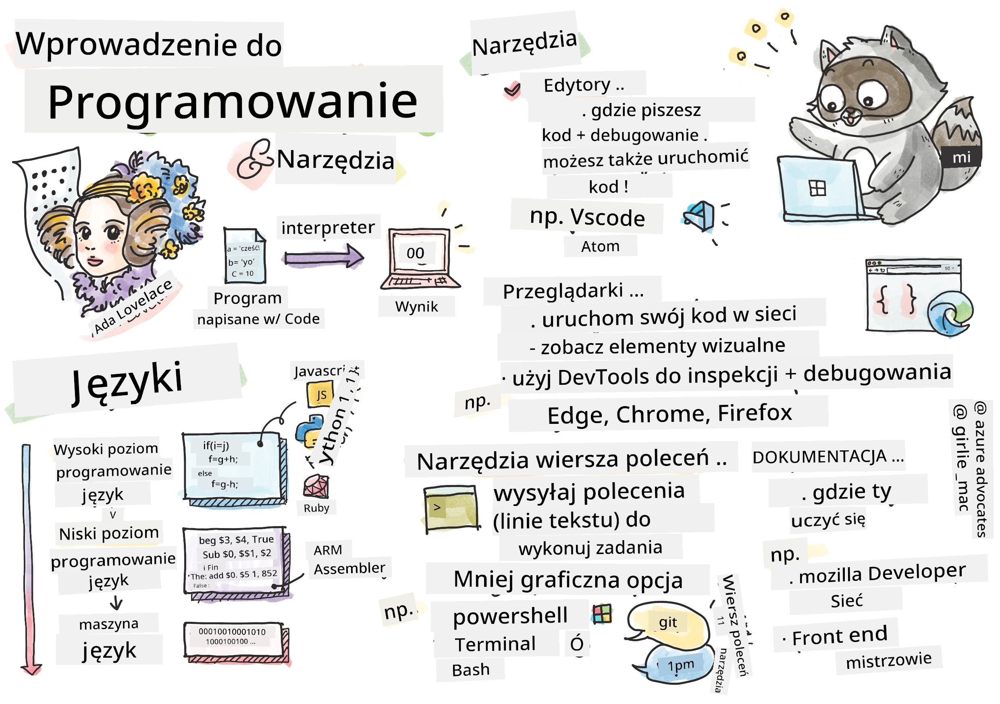
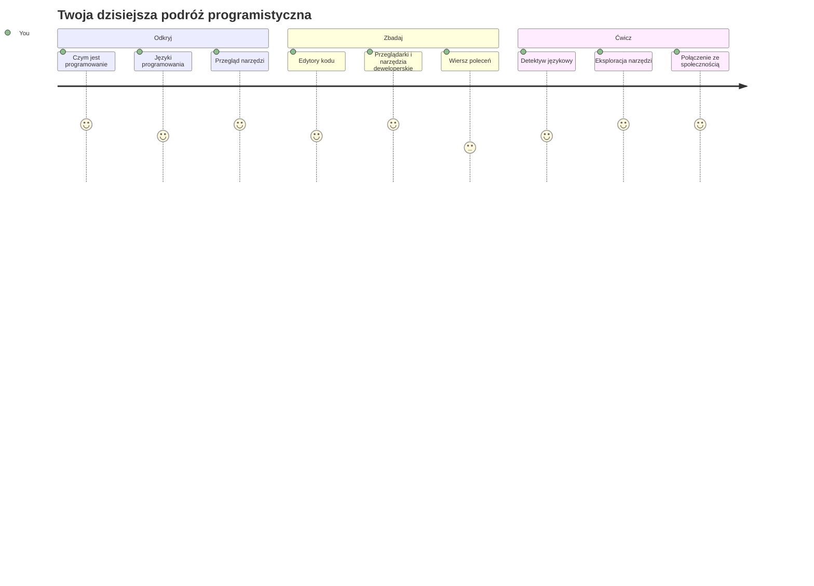
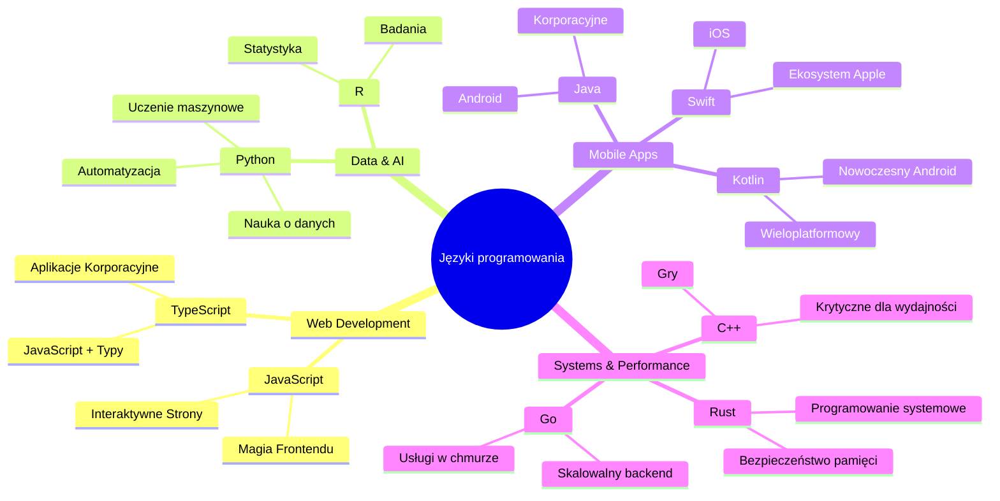
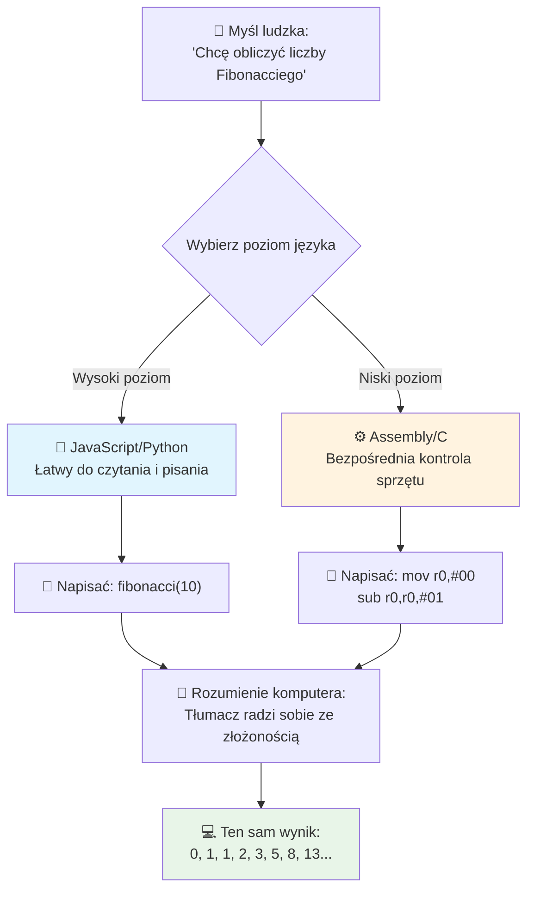
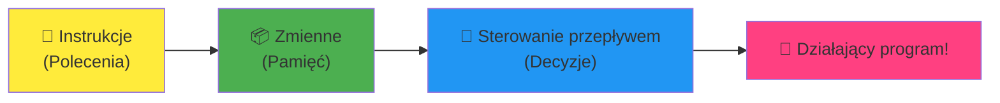
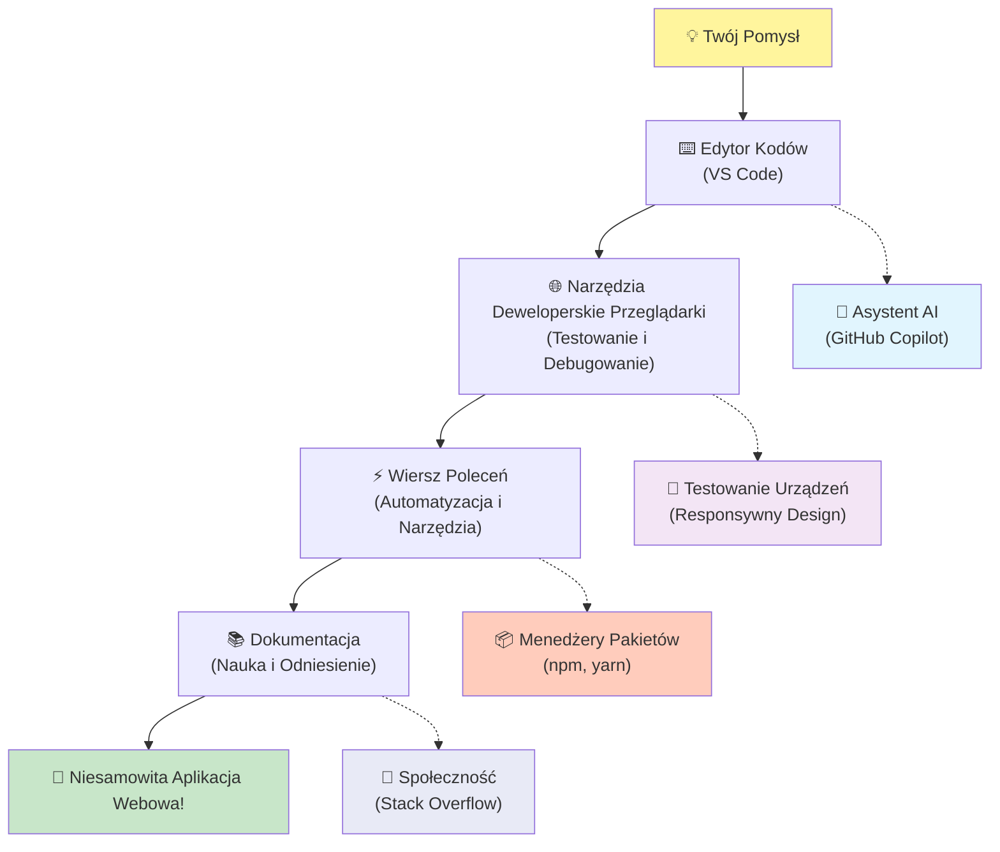
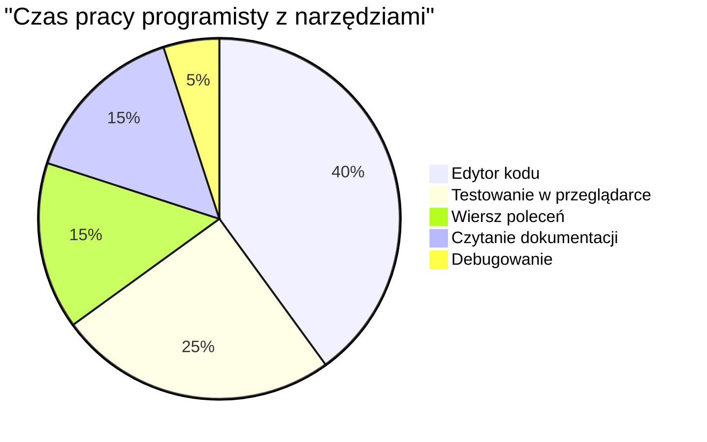
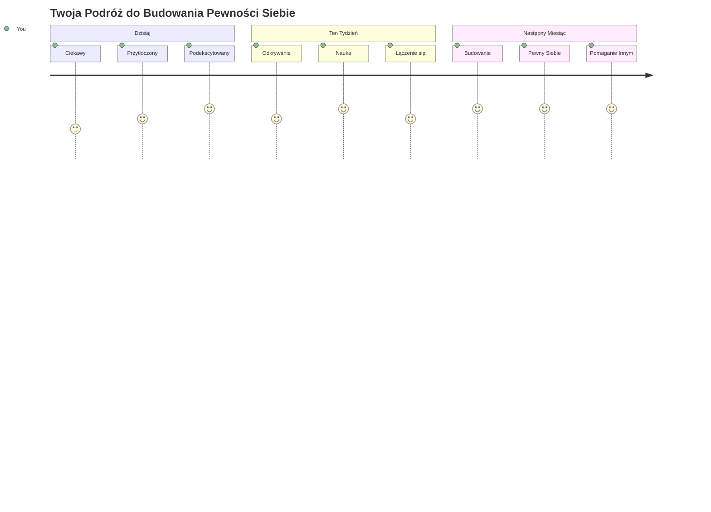

# Wprowadzenie do języków programowania i nowoczesnych narzędzi dla programistów
 
Cześć, przyszły programisto! 👋 Mogę Ci powiedzieć coś, co codziennie przyprawia mnie o dreszcze? Już niebawem odkryjesz, że programowanie to nie tylko komputery – to prawdziwa supermoc, która pozwala ożywiać Twoje najbardziej szalone pomysły!

Znasz ten moment, gdy korzystasz ze swojej ulubionej aplikacji i wszystko nagle działaj idealnie? Kiedy dotykasz przycisku i dzieje się coś absolutnie magicznego, co sprawia, że myślisz „wow, jak oni to ZROBILI?” Cóż, ktoś zupełnie taki jak Ty – pewnie siedząc w swojej ulubionej kawiarni o 2 w nocy przy trzecim espresso – napisał kod, który stworzył tę magię. A teraz coś, co Cię powali na kolana: pod koniec tej lekcji nie tylko zrozumiesz, jak to zrobili, ale też będziesz mieć ochotę spróbować sam!

Wiem, że programowanie może teraz wydawać się przerażające. Kiedy zaczynałem, szczerze myślałem, że trzeba być geniuszem matematycznym albo kodować od piątego roku życia. Lecz to, co całkowicie zmieniło moje podejście, to to: programowanie jest dokładnie jak nauka rozmów w nowym języku. Zaczynasz od „cześć” i „dziękuję”, potem uczysz się zamawiać kawę, a zanim się obejrzysz, prowadzisz głębokie, filozoficzne dyskusje! Tyle że w tym przypadku rozmawiasz z komputerami, a szczerze? To najbardziej cierpliwi rozmówcy, jakich kiedykolwiek poznasz – nigdy nie oceniają Twoich błędów i zawsze są gotowi spróbować jeszcze raz!

Dziś poznamy niesamowite narzędzia, które sprawiają, że nowoczesne tworzenie stron internetowych jest nie tylko możliwe, ale wręcz uzależniające. Mówię o tych samych edytorach, przeglądarkach i przepływach pracy, z których korzystają programiści w Netflixie, Spotify i Twoim ulubionym niezależnym studiu aplikacji każdego dnia. A teraz najlepsza część, która sprawi, że zatańczysz z radości: większość tych profesjonalnych, branżowych narzędzi jest całkowicie darmowa!


> Sketchnote autorstwa [Tomomi Imura](https://twitter.com/girlie_mac)


```mermaid
journey
    title Twoja dzisiejsza podróż programistyczna
    section Odkryj
      Czym jest programowanie: 5: You
      Języki programowania: 4: You
      Przegląd narzędzi: 5: You
    section Zbadaj
      Edytory kodu: 4: You
      Przeglądarki i narzędzia deweloperskie: 5: You
      Wiersz poleceń: 3: You
    section Ćwicz
      Detektyw językowy: 4: You
      Eksploracja narzędzi: 5: You
      Połączenie ze społecznością: 5: You
```
## Sprawdźmy, co już wiesz!

Zanim zaczniemy z fajniejszą częścią, jestem ciekaw – co już wiesz o świecie programowania? I słuchaj, jeśli patrzysz na te pytania i myślisz „nie mam zielonego pojęcia o niczym z tego,” to nie tylko w porządku, to idealnie! To znaczy, że jesteś dokładnie tam, gdzie powinieneś. Traktuj ten quiz jak rozgrzewkę przed treningiem – po prostu rozgrzewamy mięśnie mózgowe!

[Weź udział w quizie przed lekcją](https://ff-quizzes.netlify.app/web/)


## Przygoda, na którą zaraz wyruszymy razem

Okej, jestem naprawdę podekscytowany tym, co dziś odkryjemy! Serio, chciałbym zobaczyć Twoją minę, kiedy niektóre z tych koncepcji zaczną do Ciebie trafiać. Oto niesamowita podróż, którą przejdziemy razem:

- **Czym tak naprawdę jest programowanie (i dlaczego jest najfajniejszą rzeczą na świecie!)** – odkryjemy, jak kod jest dosłownie niewidzialną magią napędzającą wszystko wokół Ciebie, od budzika, który jakoś wie, że jest poniedziałek rano, po algorytm, który idealnie dobiera Ci polecenia na Netflixie
- **Języki programowania i ich niesamowite osobowości** – wyobraź sobie imprezę, na której każdy ma zupełnie inne supermoce i sposoby rozwiązywania problemów. Tak właśnie wygląda świat języków programowania i pokochasz ich poznawanie!
- **Podstawowe elementy, które tworzą cyfrową magię** – pomyśl o nich jak o najlepszym zestawie LEGO do kreatywnej zabawy. Kiedy zrozumiesz, jak te elementy łączą się ze sobą, zrozumiesz, że możesz zbudować dosłownie wszystko, o czym marzy Twoja wyobraźnia
- **Profesjonalne narzędzia, które sprawią, że poczujesz się, jakbyś właśnie dostał różdżkę czarodzieja** – nie przesadzam – te narzędzia naprawdę sprawią, że poczujesz się jak superbohater, a najlepsze jest to, że to te same, które używają profesjonaliści!

> 💡 **Oto rzecz**: Nie próbuj dzisiaj wszystkiego zapamiętać! Teraz chcę tylko, żebyś poczuł iskrę ekscytacji tym, co jest możliwe. Szczegóły same wchłoną się naturalnie, gdy będziemy ćwiczyć razem – tak właśnie wygląda prawdziwa nauka!

> Możesz przerobić tę lekcję na [Microsoft Learn](https://learn.microsoft.com/en-us/learn/modules/web-development-101/introduction-programming/?WT.mc_id=academic-77807-sagibbon)!

## To czym właściwie *jest* programowanie?

Dobra, zajmijmy się pytaniem za milion dolarów: czym tak naprawdę jest programowanie?

Opowiem Ci historię, która kompletnie zmieniła moje myślenie o tym. W zeszłym tygodniu próbowałem wytłumaczyć mamie, jak używać nowego pilota do naszego smart TV. Złapałem się na tym, że mówię rzeczy typu: „Naciśnij czerwony przycisk, ale nie ten duży czerwony, tylko ten mały czerwony po lewej... nie, Twój drugi lewy... dobra, teraz przytrzymaj przez dwie sekundy, nie jedną, nie trzy...” Znajome? 😅

To jest programowanie! Sztuka dawania bardzo dokładnych, krok po kroku instrukcji komuś potężnemu, ale kto potrzebuje wszystkiego wypisane bardzo precyzyjnie. Z tym wyjątkiem, że nie wyjaśniasz tego mamie (która może zapytać „który czerwony przycisk?!”), tylko komputerowi (który robi dokładnie to, co mu powiesz, nawet jeśli to nie do końca to, co miałeś na myśli).

Co mnie powaliło na kolana, gdy się tego nauczyłem: komputery są w gruncie rzeczy całkiem proste. Dosłownie rozumieją tylko dwie rzeczy – 1 i 0, co w zasadzie jest „tak” i „nie” albo „włączony” i „wyłączony.” To wszystko! Ale tutaj zaczyna się magia – nie musimy mówić w 1 i 0 jak w Matriksie. Wtedy pojawiają się **języki programowania**. To jak mieć najlepszego tłumacza na świecie, który bierze Twoje całkiem normalne ludzkie myśli i przekłada je na język komputera.

A to, co wciąż przyprawia mnie o dreszcze każdego ranka, gdy się budzę: dosłownie *wszystko* cyfrowe w Twoim życiu zaczęło się od kogoś takiego jak Ty, pewnie siedzącego w piżamie z kubkiem kawy, piszącego kod na swoim laptopie. Ten filtr na Instagramie, który sprawia, że wyglądasz perfekcyjnie? Ktoś to zakodował. Rekomendacja, która zaprowadziła Cię do nowej ulubionej piosenki? Programista stworzył ten algorytm. Aplikacja, która pomaga Ci dzielić rachunki za kolację ze znajomymi? Tak, ktoś pomyślał „to jest irytujące, chyba to naprawię,” i... zrobił to!

Ucząc się programować, nie zdobywasz tylko nowej umiejętności – stajesz się częścią tej niesamowitej społeczności rozwiązywaczy problemów, którzy spędzają dni na myśleniu „A co jeśli mógłbym zbudować coś, co choć trochę poprawi czyjś dzień?” Poważnie, czy może być coś fajniejszego?

✅ **Zabawa z ciekawostką**: Oto coś super ciekawego do wyszukania, gdy będziesz miał chwilę – kto był pierwszym na świecie programistą? Podpowiem: to może nie być ta osoba, której się spodziewasz! Historia tej osoby jest absolutnie fascynująca i pokazuje, że programowanie zawsze polegało na kreatywnym rozwiązywaniu problemów i myśleniu nieszablonowym.

### 🧠 **Czas na refleksję: Jak się czujesz?**

**Poświęć chwilę, aby zastanowić się:**
- Czy teraz ma dla Ciebie sens pomysł „dawania instrukcji komputerom”?
- Czy potrafisz wskazać codzienne zadanie, które chciałbyś zautomatyzować przez programowanie?
- Jakie pytania pojawiły się w Twojej głowie w związku z tym wszystkim o programowaniu?

> **Pamiętaj**: To normalne, jeśli niektóre koncepcje teraz są niejasne. Nauka programowania jest jak nauka nowego języka – Twój mózg potrzebuje czasu na zbudowanie nowych połączeń neuronowych. Radzisz sobie świetnie!

## Języki programowania są jak różne smaki magii

Ok, to może zabrzmieć dziwnie, ale zostań ze mną – języki programowania są bardzo podobne do różnych rodzajów muzyki. Pomyśl o tym: masz jazz, który jest płynny i improwizowany, rock, który jest mocny i prosty, muzykę klasyczną, elegancką i uporządkowaną, oraz hip-hop – kreatywny i ekspresyjny. Każdy styl ma swój klimat, swoją społeczność zapalonych fanów i każdy jest idealny na inne nastroje i okazje.

Języki programowania działają dokładnie tak samo! Nie użyłbyś tego samego języka do stworzenia zabawnej gry na telefon, którego używasz do analizy ogromnych zbiorów danych klimatycznych, tak jak nie zagrałbyś death metalu na zajęciach jogi (no, może w większości zajęć jogi! 😄).

Ale to, co za każdym razem mnie powala: te języki to jak mieć najbardziej cierpliwego, genialnego tłumacza na świecie siedzącego tuż obok Ciebie. Możesz wyrażać swoje pomysły w sposób naturalny dla swojego ludzkiego umysłu, a one zajmują się całym skomplikowanym tłumaczeniem na 1 i 0, w których mówią komputery. To jak mieć przyjaciela, który perfekcyjnie zna oba światy – „ludzką kreatywność” i „komputerową logikę” – i nigdy nie jest zmęczony, nie potrzebuje przerw na kawę i nigdy nie ocenia, jeśli pytasz to samo dwa razy!

### Popularne języki programowania i ich zastosowania


```mermaid
mindmap
  root((Języki programowania))
    Web Development
      JavaScript
        Magia Frontendu
        Interaktywne Strony
      TypeScript
        JavaScript + Typy
        Aplikacje Korporacyjne
    Data & AI
      Python
        Nauka o danych
        Uczenie maszynowe
        Automatyzacja
      R
        Statystyka
        Badania
    Mobile Apps
      Java
        Android
        Korporacyjne
      Swift
        iOS
        Ekosystem Apple
      Kotlin
        Nowoczesny Android
        Wieloplatformowy
    Systems & Performance
      C++
        Gry
        Krytyczne dla wydajności
      Rust
        Bezpieczeństwo pamięci
        Programowanie systemowe
      Go
        Usługi w chmurze
        Skalowalny backend
```
| Język | Najlepszy do | Dlaczego jest popularny |
|----------|----------|------------------|
| **JavaScript** | Tworzenie stron www, interfejsy użytkownika | Działa w przeglądarkach i napędza interaktywne strony |
| **Python** | Data science, automatyzacja, sztuczna inteligencja | Łatwy do czytania i nauki, potężne biblioteki |
| **Java** | Aplikacje korporacyjne, aplikacje na Androida | Niezależny od platformy, solidny dla dużych systemów |
| **C#** | Aplikacje na Windowsa, tworzenie gier | Silne wsparcie ekosystemu Microsoft |
| **Go** | Usługi w chmurze, systemy backendowe | Szybki, prosty, zaprojektowany do nowoczesnych zastosowań |

### Języki wysokiego i niskiego poziomu

Ok, to był szczerze koncept, który mnie totalnie zgubił, kiedy zaczynałem, więc podzielę się analogią, która w końcu sprawiła, że wszystko do mnie dotarło – i mam nadzieję, że Tobie też pomoże!

Wyobraź sobie, że jesteś w kraju, gdzie nie znasz języka, i desperacko próbujesz znaleźć najbliższą toaletę (wszyscy to znamy, prawda? 😅):

- **Programowanie niskiego poziomu** jest jak nauka lokalnego dialektu tak dobrze, że możesz rozmawiać z babcią sprzedającą owoce na rogu, używając lokalnych odniesień kulturowych, slangu i żartów, które rozumie tylko ktoś wychowany tam na miejscu. Super imponujące i bardzo efektywne... jeśli jesteś biegły! Ale dość przytłaczające, gdy po prostu szukasz toalety.

- **Programowanie wysokiego poziomu** jest jak mieć wspaniałego lokalnego przyjaciela, który po prostu Cię rozumie. Możesz powiedzieć „Naprawdę potrzebuję znaleźć toaletę” po angielsku, a on załatwia całą resztę – tłumaczenie kulturowe i pokazuje Ci drogę tak, byś zrozumiał to swoim niestandardowym mózgiem.

W programowaniu:
- **Języki niskiego poziomu** (jak Assembly czy C) pozwalają prowadzić bardzo szczegółowe rozmowy z rzeczywistym sprzętem komputera, ale musisz myśleć jak maszyna, co... powiedzmy, że to duża zmiana mentalna!
- **Języki wysokiego poziomu** (jak JavaScript, Python czy C#) pozwalają myśleć jak człowiek, podczas gdy one zajmują się całą maszynową mową w tle. Do tego mają te niesamowicie przyjazne społeczności, pełne ludzi, którzy pamiętają, jak to jest być początkującym i naprawdę chcą pomóc!

Zgadnij, które zalecę zacząć? 😉 Języki wysokiego poziomu są jak kółka treningowe, których nigdy tak naprawdę nie chcesz zdjąć, bo cały proces jest o wiele przyjemniejszy!


```mermaid
flowchart TB
    A["👤 Myśl ludzka:<br/>'Chcę obliczyć liczby Fibonacciego'"] --> B{Wybierz poziom języka}
    
    B -->|Wysoki poziom| C["🌟 JavaScript/Python<br/>Łatwy do czytania i pisania"]
    B -->|Niski poziom| D["⚙️ Assembly/C<br/>Bezpośrednia kontrola sprzętu"]
    
    C --> E["📝 Napisać: fibonacci(10)"]
    D --> F["📝 Napisać: mov r0,#00<br/>sub r0,r0,#01"]
    
    E --> G["🤖 Rozumienie komputera:<br/>Tłumacz radzi sobie ze złożonością"]
    F --> G
    
    G --> H["💻 Ten sam wynik:<br/>0, 1, 1, 2, 3, 5, 8, 13..."]
    
    style C fill:#e1f5fe
    style D fill:#fff3e0
    style H fill:#e8f5e8
```
### Pokażę Ci, dlaczego języki wysokiego poziomu są tak przyjazne

Dobra, zaraz pokażę Ci coś, co perfekcyjnie pokazuje, dlaczego zakochałem się w językach wysokiego poziomu, ale najpierw – musisz mi obiecać jedną rzecz. Gdy zobaczysz pierwszy przykład kodu, nie panikuj! Ma wyglądać na trudny do ogarnięcia. Dokładnie o to mi chodzi!

Zobaczymy to samo zadanie napisane w dwóch zupełnie różnych stylach. Oba tworzą coś, co nazywa się ciągiem Fibonacciego – to piękny matematyczny wzorzec, gdzie każda liczba to suma dwóch poprzednich: 0, 1, 1, 2, 3, 5, 8, 13... (Ciekawostka: ten wzór znajdziesz dosłownie wszędzie w przyrodzie – od spiral nasion słonecznika, wzoru na szyszce po sposób formowania się galaktyk!)

Gotowy zobaczyć różnicę? Zaczynajmy!

**Język wysokiego poziomu (JavaScript) – przyjazny dla ludzi:**

```javascript
// Krok 1: Podstawowa konfiguracja Fibonacciego
const fibonacciCount = 10;
let current = 0;
let next = 1;

console.log('Fibonacci sequence:');
```

**To robi ten kod:**
- **Deklaruje** stałą, która określa, ile liczb z ciągu Fibonacciego chcemy wygenerować
- **Inicjalizuje** dwie zmienne śledzące bieżącą i następną liczbę w sekwencji
- **Ustawia** wartości początkowe (0 i 1) definiujące wzorzec Fibonacciego
- **Wyświetla** nagłówek, aby zidentyfikować nasz wynik

```javascript
// Krok 2: Wygeneruj sekwencję za pomocą pętli
for (let i = 0; i < fibonacciCount; i++) {
  console.log(`Position ${i + 1}: ${current}`);
  
  // Oblicz następny numer w sekwencji
  const sum = current + next;
  current = next;
  next = sum;
}
```

**Co się tutaj dzieje:**
- **Przechodzi** przez każdą pozycję w sekwencji używając pętli `for`
- **Wyświetla** każdą liczbę wraz z jej pozycją, używając formatowania szablonu
- **Oblicza** kolejną liczbę Fibonacciego dodając bieżącą i następną wartość
- **Aktualizuje** zmienne śledzące, by przejść do kolejnej iteracji

```javascript
// Krok 3: Nowoczesne funkcjonalne podejście
const generateFibonacci = (count) => {
  const sequence = [0, 1];
  
  for (let i = 2; i < count; i++) {
    sequence[i] = sequence[i - 1] + sequence[i - 2];
  }
  
  return sequence;
};

// Przykład użycia
const fibSequence = generateFibonacci(10);
console.log(fibSequence);
```

**W powyższym:**
- **Stworzyliśmy** funkcję wielokrotnego użytku, używając nowoczesnej składni funkcji strzałkowej
- **Zbudowaliśmy** tablicę, aby przechować całą sekwencję zamiast wyświetlać liczby pojedynczo
- **Użyliśmy** indeksowania tablic, aby obliczyć każdą nową liczbę na podstawie poprzednich wartości
- **Zwróciliśmy** pełną sekwencję do elastycznego użycia w innych częściach programu

**Język niskiego poziomu (ARM Assembly) – przyjazny dla komputera:**

```assembly
 area ascen,code,readonly
 entry
 code32
 adr r0,thumb+1
 bx r0
 code16
thumb
 mov r0,#00
 sub r0,r0,#01
 mov r1,#01
 mov r4,#10
 ldr r2,=0x40000000
back add r0,r1
 str r0,[r2]
 add r2,#04
 mov r3,r0
 mov r0,r1
 mov r1,r3
 sub r4,#01
 cmp r4,#00
 bne back
 end
```

Zauważ, że wersja w JavaScript czyta się niemal jak instrukcje po angielsku, podczas gdy wersja Assembly używa zagadkowych komend, które bezpośrednio sterują procesorem komputera. Obie realizują to samo zadanie, ale język wysokiego poziomu jest dużo łatwiejszy do zrozumienia, napisania i utrzymania przez ludzi.

**Kluczowe różnice, które zauważysz:**
- **Czytelność**: JavaScript używa opisowych nazw, takich jak `fibonacciCount`, podczas gdy Assembly stosuje kryptograficzne etykiety jak `r0`, `r1`
- **Komentarze**: Języki wysokiego poziomu zachęcają do umieszczania wyjaśniających komentarzy, które czynią kod samodokumentującym się
- **Struktura**: Logiczny przepływ JavaScript odpowiada temu, jak ludzie myślą o problemach krok po kroku
- **Utrzymanie**: Aktualizacja wersji JavaScript dla różnych wymagań jest prosta i przejrzysta

✅ **O ciągu Fibonacciego**: Ten absolutnie przepiękny wzór liczb (gdzie każda liczba jest sumą dwóch poprzednich: 0, 1, 1, 2, 3, 5, 8...) pojawia się dosłownie *wszędzie* w naturze! Znajdziesz go w spiralach słonecznika, wzorach szyszek, w sposobie, w jaki zakrzywiają się muszle nautilusa, a nawet w tym, jak rosną gałęzie drzew. To naprawdę niesamowite, jak matematyka i kod mogą pomóc nam zrozumieć i odtworzyć wzory, które natura wykorzystuje do tworzenia piękna!


## Bloki Konstrukcyjne, Które Tworzą Magię

Dobra, teraz gdy widziałeś, jak wyglądają języki programowania w praktyce, rozbijmy fundamentalne elementy, z których złożony jest dosłownie każdy napisany program. Pomyśl o nich jak o niezbędnych składnikach twojego ulubionego przepisu – gdy zrozumiesz, do czego służy każdy z nich, będziesz mógł czytać i pisać kod w praktycznie każdym języku!

To trochę jak nauka gramatyki programowania. Pamiętasz, jak w szkole uczyłeś się o rzeczownikach, czasownikach i o tym, jak budować zdania? Programowanie ma swoją własną wersję gramatyki i szczerze mówiąc, jest ona dużo bardziej logiczna i wyrozumiała niż gramatyka angielska! 😄

### Instrukcje: Krok po Kroku

Zacznijmy od **instrukcji** – są jak pojedyncze zdania w rozmowie z twoim komputerem. Każda instrukcja mówi komputerowi, aby wykonał jedną konkretną rzecz, trochę jak dawanie wskazówek: „Skręć tutaj w lewo”, „Zatrzymaj się na czerwonym świetle”, „Zaparkuj w tym miejscu”.

To, co kocham w instrukcjach, to jak bardzo zazwyczaj są czytelne. Spójrz na to:

```javascript
// Podstawowe instrukcje wykonujące pojedyncze działania
const userName = "Alex";                    
console.log("Hello, world!");              
const sum = 5 + 3;                         
```

**Oto, co robi ten kod:**
- **Deklaruje** stałą zmienną do przechowywania imienia użytkownika
- **Wyświetla** komunikat powitalny na konsoli
- **Oblicza** i przechowuje wynik operacji matematycznej

```javascript
// Instrukcje, które współdziałają ze stronami internetowymi
document.title = "My Awesome Website";      
document.body.style.backgroundColor = "lightblue";
```

**Krok po kroku wygląda to tak:**
- **Modyfikuje** tytuł strony, który pojawia się na karcie przeglądarki
- **Zmienia** kolor tła całej strony

### Zmienne: Pamięć twojego programu

Dobra, **zmienne** to szczerze jedna z moich absolutnie ulubionych koncepcji do nauczania, ponieważ są tak podobne do rzeczy, których używasz na co dzień!

Pomyśl przez chwilę o książce telefonicznej swojego telefonu. Nie pamiętasz na pamięć wszystkich numerów – zamiast tego zapisujesz „Mama”, „Najlepszy Przyjaciel” lub „Pizzeria, która dowozi do 2 w nocy” i pozwalasz telefonowi zapamiętać prawdziwe numery. Zmienne działają dokładnie tak samo! Są jak oznakowane pojemniki, w których twój program może przechowywać informacje i później je pobierać używając nazwy, która faktycznie ma sens.

Co jest naprawdę fajne: zmienne mogą się zmieniać w trakcie działania programu (stąd nazwa „zmienna” – widzisz, co zrobili?). Tak jak możesz zaktualizować kontakt do pizzerii, gdy znajdziesz jeszcze lepsze miejsce, zmienne mogą zostać zaktualizowane, gdy program poznaje nowe informacje lub gdy sytuacja się zmienia!

Pokażę ci, jak pięknie proste to może być:

```javascript
// Krok 1: Tworzenie podstawowych zmiennych
const siteName = "Weather Dashboard";        
let currentWeather = "sunny";               
let temperature = 75;                       
let isRaining = false;                      
```

**Zrozumienie tych pojęć:**
- **Przechowuj** niezmienne wartości w zmiennych `const` (np. nazwa strony)
- **Używaj** `let` dla wartości, które mogą się zmieniać w trakcie działania programu
- **Przypisuj** różne typy danych: stringi (tekst), liczby i boole (true/false)
- **Wybieraj** opisowe nazwy, które wyjaśniają, co zawiera każda zmienna

```javascript
// Krok 2: Praca z obiektami w celu grupowania powiązanych danych
const weatherData = {                       
  location: "San Francisco",
  humidity: 65,
  windSpeed: 12
};
```

**Powyżej:**
- **Utworzyliśmy** obiekt, by pogrupować powiązane informacje o pogodzie
- **Zorganizowaliśmy** wiele danych w jednej zmiennej
- **Użyliśmy** par klucz-wartość do czytelnego oznaczenia każdej informacji

```javascript
// Krok 3: Używanie i aktualizowanie zmiennych
console.log(`${siteName}: Today is ${currentWeather} and ${temperature}°F`);
console.log(`Wind speed: ${weatherData.windSpeed} mph`);

// Aktualizacja zmiennych podlegających zmianom
currentWeather = "cloudy";                  
temperature = 68;                          
```

**Zrozummy każdą część:**
- **Wyświetl** informacje używając template literals z składnią `${}`
- **Dostęp** do właściwości obiektu za pomocą notacji kropkowej (`weatherData.windSpeed`)
- **Aktualizuj** zmienne zadeklarowane przez `let`, aby odzwierciedlić zmieniające się warunki
- **Łącz** wiele zmiennych, by tworzyć sensowne komunikaty

```javascript
// Krok 4: Nowoczesne destrukturyzowanie dla czyściejszego kodu
const { location, humidity } = weatherData; 
console.log(`${location} humidity: ${humidity}%`);
```

**Co musisz wiedzieć:**
- **Wyciągaj** konkretne właściwości z obiektów za pomocą destrukturyzacji
- **Twórz** nowe zmienne automatycznie z tymi samymi nazwami co klucze obiektu
- **Uprość** kod, unikając wielokrotnego używania notacji kropkowej

### Sterowanie przepływem: Naucz swój program myśleć

Dobra, tutaj programowanie staje się absolutnie niesamowite! **Sterowanie przepływem** to zasadniczo nauka twojego programu, jak podejmować mądre decyzje, dokładnie tak jak ty robisz to codziennie, nawet nie myśląc o tym.

Wyobraź sobie: dzisiaj rano pewnie przechodziłeś przez coś w stylu „Jeśli pada deszcz, zabiorę parasol. Jeśli jest zimno, założę kurtkę. Jeśli się spóźniam, pomijam śniadanie i biorę kawę na wynos.” Twój mózg naturalnie stosuje tę logikę if-then dziesiątki razy dziennie!

To właśnie sprawia, że programy wydają się inteligentne i żywe, a nie tylko wykonujące nudny, przewidywalny skrypt. One naprawdę mogą spojrzeć na sytuację, ocenić, co się dzieje, i odpowiednio zareagować. To jak danie twojemu programowi mózgu, który potrafi się dostosować i wybierać!

Chcesz zobaczyć, jak pięknie to działa? Pokażę ci:

```javascript
// Krok 1: Podstawowa logika warunkowa
const userAge = 17;

if (userAge >= 18) {
  console.log("You can vote!");
} else {
  const yearsToWait = 18 - userAge;
  console.log(`You'll be able to vote in ${yearsToWait} year(s).`);
}
```

**Co robi ten kod:**
- **Sprawdza**, czy wiek użytkownika spełnia wymóg do głosowania
- **Wykonuje** różne bloki kodu w zależności od wyniku warunku
- **Oblicza** i wyświetla, jak długo zostało do uzyskania prawa do głosowania, jeśli ma mniej niż 18 lat
- **Daje** konkretne, pomocne informacje dla każdej sytuacji

```javascript
// Krok 2: Wiele warunków z operatorami logicznymi
const userAge = 17;
const hasPermission = true;

if (userAge >= 18 && hasPermission) {
  console.log("Access granted: You can enter the venue.");
} else if (userAge >= 16) {
  console.log("You need parent permission to enter.");
} else {
  console.log("Sorry, you must be at least 16 years old.");
}
```

**Rozbicie tego na części:**
- **Łączy** wiele warunków za pomocą operatora `&&` (i)
- **Tworzy** hierarchię warunków za pomocą `else if` dla wielu scenariuszy
- **Obsługuje** wszystkie możliwe przypadki za pomocą końcowego `else`
- **Daje** jasną, wykonalną informację dla każdej sytuacji

```javascript
// Krok 3: Zwięzły warunek z operatorem trójargumentowym
const votingStatus = userAge >= 18 ? "Can vote" : "Cannot vote yet";
console.log(`Status: ${votingStatus}`);
```

**Co musisz zapamiętać:**
- **Używaj** operatora trójargumentowego (`? :`) dla prostych warunków dwuwyborowych
- **Napisz** najpierw warunek, następnie `?`, potem wynik prawdy, potem `:`, a na końcu wynik fałszu
- **Stosuj** ten wzorzec, gdy chcesz przypisać wartości bazujące na warunkach

```javascript
// Krok 4: Obsługa wielu konkretnych przypadków
const dayOfWeek = "Tuesday";

switch (dayOfWeek) {
  case "Monday":
  case "Tuesday":
  case "Wednesday":
  case "Thursday":
  case "Friday":
    console.log("It's a weekday - time to work!");
    break;
  case "Saturday":
  case "Sunday":
    console.log("It's the weekend - time to relax!");
    break;
  default:
    console.log("Invalid day of the week");
}
```

**Ten kod realizuje:**
- **Dopasowuje** wartość zmiennej do wielu konkretnych przypadków
- **Grupuje** podobne przypadki razem (dni robocze vs weekendy)
- **Wykonuje** odpowiedni blok kodu, gdy znajdzie dopasowanie
- **Zawiera** przypadek `default` do obsługi nieoczekiwanych wartości
- **Używa** instrukcji `break`, aby zapobiec dalszemu wykonywaniu kolejnych przypadków

> 💡 **Analogia z życia**: Pomyśl o sterowaniu przepływem jak o najbardziej cierpliwej na świecie nawigacji GPS, która podaje ci wskazówki. Może powiedzieć „Jeśli na Main Street jest korek, jedź autostradą. Jeśli autostrada jest zamknięta z powodu remontu, spróbuj trasy z widokiem.” Programy używają tego samego rodzaju logiki warunkowej, aby inteligentnie reagować na różne sytuacje i zawsze oferować użytkownikom jak najlepsze doświadczenie.

### 🎯 **Sprawdzenie koncepcji: Mistrzostwo w blokach konstrukcyjnych**

**Sprawdźmy, jak idzie Ci z fundamentami:**
- Czy potrafisz wyjaśnić różnicę między zmienną a instrukcją własnymi słowami?
- Pomyśl o sytuacji z życia, gdzie użyłbyś decyzji if-then (jak nasz przykład z głosowaniem)
- Coś, co zaskoczyło Cię w logice programowania?

**Szybki zastrzyk pewności:**

```mermaid
flowchart LR
    A["📝 Instrukcje<br/>(Polecenia)"] --> B["📦 Zmienne<br/>(Pamięć)"] --> C["🔀 Sterowanie przepływem<br/>(Decyzje)"] --> D["🎉 Działający program!"]
    
    style A fill:#ffeb3b
    style B fill:#4caf50
    style C fill:#2196f3
    style D fill:#ff4081
```
✅ **Co będzie dalej**: Będziemy się świetnie bawić, zgłębiając jeszcze bardziej te koncepcje podczas tej niesamowitej podróży! Teraz skup się tylko na poczuciu ekscytacji na myśl o wszystkich niesamowitych możliwościach, które stoją przed tobą. Konkretne umiejętności i techniki będą przychodzić naturalnie, gdy będziemy ćwiczyć razem – obiecuję, że to będzie dużo bardziej zabawne, niż się spodziewasz!

## Narzędzia Zawodu

Dobra, tutaj to naprawdę się ekscytuję tak bardzo, że ledwo się powstrzymuję! 🚀 Zaraz porozmawiamy o niesamowitych narzędziach, które sprawią, że poczujesz się, jakbyś właśnie otrzymał klucze do cyfrowego statku kosmicznego.

Wiesz, jak kucharz ma te idealnie wyważone noże, które wydają się przedłużeniem jego rąk? Albo jak muzyk ma tę jedną gitarę, która zaczyna śpiewać w momencie, gdy jej dotknie? Cóż, programiści mają własną wersję tych magicznych narzędzi, a oto co powali cię na kolana – większość z nich jest całkowicie darmowa!

Praktycznie podskakuję na krześle myśląc o tym, że mogę się tym z tobą podzielić, bo te narzędzia całkowicie zrewolucjonizowały sposób, w jaki tworzymy oprogramowanie. Mówimy o asystentach kodowania napędzanych AI, którzy mogą pomóc pisać twój kod (nie żartuję!), środowiskach w chmurze, gdzie możesz budować całe aplikacje dosłownie z każdego miejsca z Wi-Fi, oraz narzędziach do debugowania tak zaawansowanych, że to jakby mieć widzenie rentgenowskie dla twoich programów.

I teraz część, która wciąż powoduje u mnie dreszcze: to nie są „narzędzia dla początkujących”, które prędzej czy później wyrzucisz. To dokładnie te same profesjonalne narzędzia, których używają programiści w Google, Netflix i tym indie studiu aplikacji, które kochasz, właśnie teraz. Będziesz się czuć jak prawdziwy pro, korzystając z nich!


```mermaid
graph TD
    A["💡 Twój Pomysł"] --> B["⌨️ Edytor Kodów<br/>(VS Code)"] 
    B --> C["🌐 Narzędzia Deweloperskie Przeglądarki<br/>(Testowanie i Debugowanie)"]
    C --> D["⚡ Wiersz Poleceń<br/>(Automatyzacja i Narzędzia)"]
    D --> E["📚 Dokumentacja<br/>(Nauka i Odniesienie)"]
    E --> F["🚀 Niesamowita Aplikacja Webowa!"]
    
    B -.-> G["🤖 Asystent AI<br/>(GitHub Copilot)"]
    C -.-> H["📱 Testowanie Urządzeń<br/>(Responsywny Design)"]
    D -.-> I["📦 Menedżery Pakietów<br/>(npm, yarn)"]
    E -.-> J["👥 Społeczność<br/>(Stack Overflow)"]
    
    style A fill:#fff59d
    style F fill:#c8e6c9
    style G fill:#e1f5fe
    style H fill:#f3e5f5
    style I fill:#ffccbc
    style J fill:#e8eaf6
```
### Edytory kodu i IDE: Twoi nowi cyfrowi najlepsi przyjaciele

Porozmawiajmy o edytorach kodu – one za chwilę staną się twoimi ulubionymi miejscami do spędzania czasu! Pomyśl o nich jak o swojej osobistej świątyni kodowania, w której spędzisz większość czasu, tworząc i doskonaląc swoje cyfrowe dzieła.

Ale oto, co jest absolutnie magiczne w nowoczesnych edytorach: to nie są zwykłe edytory tekstu. To jak mieć najbardziej błyskotliwego, wspierającego mentora kodowania obok siebie 24/7. One łapią twoje literówki, zanim je zauważysz, podpowiadają ulepszenia, dzięki którym wyglądasz na geniusza, pomagają zrozumieć, co robi każdy fragment kodu, a niektóre nawet potrafią przewidzieć, co zaraz napiszesz i proponują dokończenie twoich myśli!

Pamiętam, gdy pierwszy raz odkryłem autouzupełnianie – dosłownie poczułem się, jakbym żył w przyszłości. Zaczynasz coś pisać, a edytor mówi: „Hej, czy myślałeś o tej funkcji, która robi dokładnie to, czego potrzebujesz?” To jak mieć czytającego w myślach kumpla do kodowania!

**Co sprawia, że te edytory są tak niesamowite?**

Nowoczesne edytory kodu oferują imponujący zestaw funkcji zaprojektowanych, aby zwiększyć twoją produktywność:

| Funkcja | Co robi | Dlaczego pomaga |
|---------|---------|----------------|
| **Podświetlanie składni** | Koloruje różne części twojego kodu | Ułatwia czytanie kodu i wychwytywanie błędów |
| **Autouzupełnianie** | Podpowiada kod podczas pisania | Przyspiesza kodowanie i redukuje literówki |
| **Narzędzia debugowania** | Pomaga znaleźć i naprawić błędy | Oszczędza godziny spędzone na szukaniu problemów |
| **Rozszerzenia** | Dodaje specjalistyczne funkcje | Dostosuj edytor do dowolnej technologii |
| **Asystenci AI** | Podpowiada kod i wyjaśnienia | Przyspiesza naukę i efektywność pracy |

> 🎥 **Źródło wideo**: Chcesz zobaczyć te narzędzia w akcji? Sprawdź ten [film „Tools of the Trade”](https://youtube.com/watch?v=69WJeXGBdxg) dla kompleksowego przeglądu.

#### Polecane edytory do tworzenia stron WWW

**[Visual Studio Code](https://code.visualstudio.com/?WT.mc_id=academic-77807-sagibbon)** (Darmowy)
- Najpopularniejszy wśród deweloperów www
- Doskonały ekosystem rozszerzeń
- Wbudowany terminal i integracja z Gitem
- **Nieodzowne rozszerzenia**:
  - [GitHub Copilot](https://marketplace.visualstudio.com/items?itemName=GitHub.copilot) - Podpowiedzi kodu napędzane AI
  - [Live Share](https://marketplace.visualstudio.com/items?itemName=MS-vsliveshare.vsliveshare) - Współpraca w czasie rzeczywistym
  - [Prettier](https://marketplace.visualstudio.com/items?itemName=esbenp.prettier-vscode) - Automatyczne formatowanie kodu
  - [Code Spell Checker](https://marketplace.visualstudio.com/items?itemName=streetsidesoftware.code-spell-checker) - Wykrywanie literówek w kodzie

**[JetBrains WebStorm](https://www.jetbrains.com/webstorm/)** (Płatny, darmowy dla studentów)
- Zaawansowane narzędzia debugowania i testowania
- Inteligentne podpowiedzi kodu
- Wbudowana kontrola wersji

**IDE w chmurze** (różne ceny)
- [GitHub Codespaces](https://github.com/features/codespaces) - Pełne VS Code w przeglądarce
- [Replit](https://replit.com/) - Świetne do nauki i dzielenia się kodem
- [StackBlitz](https://stackblitz.com/) - Natychmiastowy pełen stos do tworzenia stron WWW

> 💡 **Wskazówka na start**: Zacznij od Visual Studio Code – jest darmowy, szeroko używany w branży i ma ogromną społeczność tworzącą pomocne tutoriale i rozszerzenia.


### Przeglądarki internetowe: Twoje sekretne laboratorium deweloperskie

Dobra, przygotuj się na absolutny szok! Wiesz, jak używasz przeglądarek do scrollowania mediów społecznościowych i oglądania filmów? Okazuje się, że przez cały czas ukrywały przed tobą niesamowite, sekretne laboratorium deweloperskie, czekające aż je odkryjesz!

Za każdym razem, gdy klikniesz prawym przyciskiem na stronie i wybierzesz „Zbadaj element”, otwierasz ukryty świat narzędzi programistycznych, które są szczerze mocniejsze niż niejeden drogi program, za który kiedyś płaciłem setki dolarów. To jak odkrycie, że twoja zwykła kuchnia cały czas kryła profesjonalne laboratorium szefa kuchni za tajnym panelem!
Za pierwszym razem, gdy ktoś pokazał mi narzędzia developerskie w przeglądarce, spędziłem około trzech godzin, klikając wszędzie i mówiąc „CZEKAJ, TO TEŻ TAK DA SIĘ ZROBIĆ?!”. Dosłownie możesz edytować dowolną stronę internetową w czasie rzeczywistym, zobaczyć, jak szybko wszystko się ładuje, przetestować, jak Twoja witryna wygląda na różnych urządzeniach, a nawet debugować JavaScript jak prawdziwy profesjonalista. To wręcz niesamowite!

**Oto dlaczego przeglądarki to Twoja tajna broń:**

Kiedy tworzysz stronę internetową lub aplikację webową, musisz zobaczyć, jak wygląda i zachowuje się w prawdziwym świecie. Przeglądarki nie tylko wyświetlają Twoją pracę, ale również dostarczają szczegółowe informacje zwrotne na temat wydajności, dostępności i potencjalnych problemów.

#### Narzędzia deweloperskie w przeglądarce (DevTools)

Nowoczesne przeglądarki zawierają kompleksowe zestawy narzędzi deweloperskich:

| Kategoria narzędzi | Co robi | Przykład zastosowania |
|--------------------|---------|----------------------|
| **Inspektor elementów** | Przeglądaj i edytuj HTML/CSS w czasie rzeczywistym | Dopasuj styl, aby zobaczyć natychmiastowe efekty |
| **Konsola** | Podglądaj komunikaty o błędach i testuj JavaScript | Debuguj problemy i eksperymentuj z kodem |
| **Monitor sieci** | Śledź ładowanie zasobów | Optymalizuj wydajność i czas ładowania |
| **Sprawdzanie dostępności** | Testuj projekt pod kątem dostępności | Zapewnij działanie serwisu dla wszystkich użytkowników |
| **Symulator urządzeń** | Podgląd na różnych rozmiarach ekranów | Testuj responsywny design bez potrzeby wielu urządzeń |

#### Polecane przeglądarki do pracy deweloperskiej

- **[Chrome](https://developers.google.com/web/tools/chrome-devtools/)** – Standardowe narzędzia DevTools z obszerną dokumentacją
- **[Firefox](https://developer.mozilla.org/docs/Tools)** – Doskonałe narzędzia do CSS Grid i dostępności
- **[Edge](https://docs.microsoft.com/microsoft-edge/devtools-guide-chromium/?WT.mc_id=academic-77807-sagibbon)** – Oparty na Chromium z zasobami deweloperskimi Microsoftu

> ⚠️ **Ważna wskazówka dotycząca testowania**: Zawsze testuj swoje strony w wielu przeglądarkach! To, co działa perfekcyjnie w Chrome, może wyglądać inaczej w Safari czy Firefox. Profesjonalni deweloperzy testują we wszystkich głównych przeglądarkach, aby zapewnić spójne doświadczenie użytkownika.


### Narzędzia w wierszu poleceń: Twoja brama do supermocy developera

Dobra, bądźmy całkowicie szczerzy na temat wiersza poleceń, bo chcę, żebyś usłyszał to od kogoś, kto naprawdę to rozumie. Kiedy po raz pierwszy go zobaczyłem – ten straszny czarny ekran z migającym tekstem – dosłownie pomyślałem: „Nie, absolutnie nie! To wygląda jak coś z filmu o hakerach lat 80., a ja na pewno nie jestem na tyle mądry!” 😅

Ale oto czego chciałbym, żeby ktoś mi wtedy powiedział, a co mówię Ci teraz: wiersz poleceń nie jest straszny – to tak, jakby rozmawiać bezpośrednio z komputerem. Pomyśl o tym jak o różnicy między zamawianiem jedzenia przez fajną aplikację z obrazkami i menu (co jest wygodne i łatwe) a wejściem do swojej ulubionej lokalnej restauracji, gdzie szef kuchni dokładnie wie, co lubisz i może przygotować coś idealnego, wystarczy, że powiesz „zaskocz mnie czymś niesamowitym”.

Wiersz poleceń to miejsce, gdzie deweloperzy czują się jak prawdziwi czarodzieje. Wpisujesz kilka pozornie magicznych słów (okej, to po prostu komendy, ale czują się magicznie!), naciskasz enter i LUM! stworzyłeś całą strukturę projektu, zainstalowałeś potężne narzędzia z całego świata lub wdrożyłeś swoją aplikację do internetu, aby miliony ludzi mogło ją zobaczyć. Gdy spróbujesz tej mocy po raz pierwszy, szczerze mówiąc, robi się to uzależniające!

**Dlaczego wiersz poleceń stanie się Twoim ulubionym narzędziem:**

Chociaż graficzne interfejsy są świetne do wielu zadań, wiersz poleceń wyróżnia się automatyzacją, precyzją i szybkością. Wiele narzędzi deweloperskich działa głównie przez interfejs wiersza poleceń, a nauka efektywnego korzystania z nich może znacznie poprawić Twoją produktywność.

```bash
# Krok 1: Utwórz i przejdź do katalogu projektu
mkdir my-awesome-website
cd my-awesome-website
```

**Co robi ten kod:**
- **Tworzy** nowy katalog o nazwie „my-awesome-website” dla Twojego projektu
- **Przechodzi** do nowo utworzonego katalogu, aby rozpocząć pracę

```bash
# Krok 2: Inicjalizuj projekt za pomocą package.json
npm init -y

# Zainstaluj nowoczesne narzędzia do tworzenia oprogramowania
npm install --save-dev vite prettier eslint
npm install --save-dev @eslint/js
```

**Krok po kroku, co się dzieje:**
- **Inicjalizuje** nowy projekt Node.js z domyślnymi ustawieniami za pomocą `npm init -y`
- **Instaluje** Vite jako nowoczesne narzędzie do budowy dla szybkiego rozwoju i kompilacji produkcyjnej
- **Dodaje** Prettier do automatycznego formatowania kodu oraz ESLint do kontroli jakości kodu
- **Używa** flagi `--save-dev`, by oznaczyć te pakiety jako zależności tylko do rozwoju

```bash
# Krok 3: Utwórz strukturę projektu i pliki
mkdir src assets
echo '<!DOCTYPE html><html><head><title>My Site</title></head><body><h1>Hello World</h1></body></html>' > index.html

# Uruchom serwer deweloperski
npx vite
```

**W powyższym zrobiliśmy:**
- **Zorganizowaliśmy** projekt, tworząc osobne foldery na kod źródłowy i zasoby
- **Wygenerowaliśmy** podstawowy plik HTML z prawidłową strukturą dokumentu
- **Uruchomiliśmy** serwer deweloperski Vite dla live reload i hot module replacement

#### Podstawowe narzędzia w wierszu poleceń do tworzenia stron WWW

| Narzędzie | Cel | Dlaczego jest potrzebne |
|-----------|-----|------------------------|
| **[Git](https://git-scm.com/)** | Kontrola wersji | Śledź zmiany, współpracuj z innymi, twórz kopie zapasowe |
| **[Node.js & npm](https://nodejs.org/)** | Środowisko JavaScript i zarządzanie pakietami | Uruchamiaj JavaScript poza przeglądarką, instaluj nowoczesne narzędzia dev |
| **[Vite](https://vitejs.dev/)** | Narzędzie do budowy i serwer dev | Błyskawiczny rozwój z hot module replacement |
| **[ESLint](https://eslint.org/)** | Jakość kodu | Automatycznie wykrywaj i naprawiaj problemy w JavaScript |
| **[Prettier](https://prettier.io/)** | Formatowanie kodu | Utrzymuj spójne i czytelne formatowanie kodu |

#### Opcje specyficzne dla platformy

**Windows:**
- **[Windows Terminal](https://docs.microsoft.com/windows/terminal/?WT.mc_id=academic-77807-sagibbon)** – Nowoczesny, bogaty w funkcje terminal
- **[PowerShell](https://docs.microsoft.com/powershell/?WT.mc_id=academic-77807-sagibbon)** 💻 – Potężne środowisko skryptowe
- **[Command Prompt](https://learn.microsoft.com/windows-server/administration/windows-commands/windows-commands)** 💻 – Tradycyjny wiersz poleceń Windows

**macOS:**
- **[Terminal](https://support.apple.com/guide/terminal/)** 💻 – Wbudowana aplikacja terminalowa
- **[iTerm2](https://iterm2.com/)** – Ulepszony terminal z zaawansowanymi funkcjami

**Linux:**
- **[Bash](https://www.gnu.org/software/bash/)** 💻 – Standardowa powłoka Linuxa
- **[KDE Konsole](https://docs.kde.org/trunk5/en/konsole/konsole/index.html)** – Zaawansowany emulator terminala

> 💻 = Preinstalowane w systemie operacyjnym

> 🎯 **Ścieżka nauki**: Zacznij od podstawowych komend jak `cd` (zmiana katalogu), `ls` lub `dir` (lista plików) i `mkdir` (tworzenie folderu). Ćwicz nowoczesne polecenia workflow jak `npm install`, `git status` czy `code .` (otwiera bieżący katalog w VS Code). W miarę nabierania wprawy, naturalnie zaczniesz używać bardziej zaawansowanych komend i technik automatyzacji.


### Dokumentacja: Twój zawsze dostępny mentor do nauki

Dobra, podzielę się z Tobą małą tajemnicą, która sprawi, że poczujesz się dużo lepiej jako początkujący: nawet najbardziej doświadczeni deweloperzy spędzają ogromną część swojego czasu na czytaniu dokumentacji. I to nie dlatego, że nie wiedzą, co robią – to właściwie znak mądrości!

Pomyśl o dokumentacji jak o dostępie do najbardziej cierpliwych, kompetentnych nauczycieli na świecie, dostępnych 24/7. Utknąłeś z problemem o 2 w nocy? Dokumentacja jest tam z ciepłym wirtualnym uściskiem i dokładnie taką odpowiedzią, jakiej potrzebujesz. Chcesz poznać jakąś fajną nową funkcję, o której wszyscy mówią? Dokumentacja Cię nie zawiedzie z przykładami krok po kroku. Próbujesz zrozumieć, dlaczego coś działa tak, a nie inaczej? Zgadłeś – dokumentacja tłumaczy to w sposób, który wreszcie wszystko rozjaśnia!

Coś, co całkowicie zmieniło moje spojrzenie: świat web developmentu porusza się niesamowicie szybko i nikt (absolutnie nikt!) nie pamięta wszystkiego na pamięć. Widziałem starszych deweloperów z ponad 15-letnim stażem, którzy szukają podstawowej składni i wiesz co? To nie jest coś wstydliwego – to mądre! Nie chodzi o idealną pamięć, ale o to, żeby wiedzieć, gdzie znaleźć wiarygodne odpowiedzi szybko i jak ich używać.

**Tu dzieje się prawdziwa magia:**

Profesjonalni deweloperzy spędzają znaczną część czasu czytając dokumentację – nie dlatego, że nie wiedzą, co robią, ale dlatego, że krajobraz web developmentu rozwija się tak szybko, że ciągłe uczenie się jest konieczne. Dobra dokumentacja pomaga zrozumieć nie tylko *jak* czegoś używać, ale też *dlaczego* i *kiedy*.

#### Podstawowe zasoby dokumentacji

**[Mozilla Developer Network (MDN)](https://developer.mozilla.org/docs/Web)**
- Złoty standard dokumentacji technologii webowych
- Kompleksowe przewodniki po HTML, CSS i JavaScript
- Informacje o kompatybilności z przeglądarkami
- Praktyczne przykłady i interaktywne dema

**[Web.dev](https://web.dev)** (od Google)
- Nowoczesne najlepsze praktyki web developmentu
- Przewodniki optymalizacji wydajności
- Zasady dostępności i projektowania inkluzywnego
- Studium przypadków z prawdziwych projektów

**[Microsoft Developer Documentation](https://docs.microsoft.com/microsoft-edge/#microsoft-edge-for-developers)**
- Zasoby dla deweloperów przeglądarki Edge
- Przewodniki Progressive Web App
- Wskazówki do rozwoju wieloplatformowego

**[Frontend Masters Learning Paths](https://frontendmasters.com/learn/)**
- Strukturalne kursy nauki
- Kursy wideo od ekspertów z branży
- Ćwiczenia praktyczne z kodowaniem

> 📚 **Strategia nauki**: Nie próbuj zapamiętywać dokumentacji – zamiast tego naucz się efektywnie po niej nawigować. Dodaj do zakładek często używane odniesienia i ćwicz używanie funkcji wyszukiwania, by szybko odnaleźć konkretne informacje.

### 🔧 **Sprawdzenie mistrzostwa narzędzi: Co Tobie najbardziej odpowiada?**

**Zastanów się przez chwilę:**
- Którego narzędzia chcesz spróbować najpierw? (Nie ma złych odpowiedzi!)
- Czy wiersz poleceń nadal wydaje się przerażający, czy może jesteś tym ciekawy?
- Czy potrafisz sobie wyobrazić, że używasz narzędzi developerskich w przeglądarce, by zajrzeć za kulisy swoich ulubionych stron?


```mermaid
pie title "Czas pracy programisty z narzędziami"
    "Edytor kodu" : 40
    "Testowanie w przeglądarce" : 25
    "Wiersz poleceń" : 15
    "Czytanie dokumentacji" : 15
    "Debugowanie" : 5
```
> **Ciekawostka**: Większość deweloperów spędza około 40% czasu w edytorze kodu, ale zauważ, ile czasu poświęcają na testowanie, naukę i rozwiązywanie problemów. Programowanie to nie tylko pisanie kodu – to tworzenie doświadczeń!

✅ **Do przemyślenia**: Oto coś, co warto rozważyć – jak myślisz, czym mogą różnić się narzędzia do tworzenia stron (development) od narzędzi do projektowania ich wyglądu (design)? To jak różnica między architektem, który projektuje piękny dom, a wykonawcą, który ten dom rzeczywiście buduje. Obie role są kluczowe, ale potrzebują różnych skrzynek z narzędziami! Taki sposób myślenia naprawdę pomoże Ci zobaczyć szerszy obraz, jak powstają strony internetowe.

## Wyzwanie GitHub Copilot Agent 🚀

Użyj trybu Agent, aby ukończyć następujące wyzwanie:

**Opis:** Zbadaj funkcje nowoczesnego edytora kodu lub IDE i pokaż, jak może poprawić Twój workflow jako web developer.

**Zadanie:** Wybierz edytor kodu lub IDE (np. Visual Studio Code, WebStorm lub chmurowe IDE). Wypisz trzy funkcje lub rozszerzenia, które pomagają Ci pisać, debugować lub utrzymywać kod bardziej efektywnie. Dla każdej podaj krótkie wyjaśnienie, jak wpływa na Twój workflow.

---

## 🚀 Wyzwanie

**Dobra, detektywie, gotowy na pierwszą sprawę?**

Teraz, gdy masz solidne podstawy, mam dla Ciebie przygodę, która pokaże, jak niezwykle różnorodny i fascynujący jest świat programowania. I słuchaj – to jeszcze nie o pisaniu kodu, więc bez presji! Pomyśl o sobie jako o detektywie języków programowania, który rozwiązuje swoją pierwszą ekscytującą sprawę!

**Twoja misja, jeśli ją przyjmiesz:**
1. **Zostań odkrywcą języków:** Wybierz trzy języki programowania z zupełnie innych światów – może jeden do tworzenia stron, drugi do aplikacji mobilnych, a trzeci do analizy danych dla naukowców. Znajdź przykłady tego samego prostego zadania napisanego w każdym z nich. Obiecuję, że będziesz zdumiony, jak bardzo mogą się różnić choć robią dokładnie to samo!

2. **Poznaj ich historię:** Co sprawia, że każdy język jest wyjątkowy? Fajny fakt – każdy język programowania powstał, bo ktoś pomyślał: „Wiesz co? Musi być lepszy sposób na rozwiązanie tego konkretnego problemu.” Potrafisz ustalić, jakie to były problemy? Niektóre historie są naprawdę fascynujące!

3. **Poznaj społeczności:** Sprawdź, jak przyjazna i pasjonująca jest każda społeczność języka. Niektóre mają miliony deweloperów dzielących się wiedzą i pomagających sobie nawzajem, inne są mniejsze, ale bardzo zżyte i wspierające. Pokochasz różnorodne osobowości tych społeczności!

4. **Zaufaj intuicji:** Który język teraz wydaje się najprzystępniejszy? Nie stresuj się wyborem „idealnego” – po prostu słuchaj swojego instynktu! Naprawdę nie ma złych odpowiedzi i zawsze możesz poznać inne później.

**Dodatkowa praca detektywa:** Sprawdź, jakie duże strony lub aplikacje są zbudowane w każdym z tych języków. Gwarantuję, że będziesz zaskoczony, co zasila Instagrama, Netflixa czy tę grę mobilną, od której nie możesz się oderwać!

> 💡 **Pamiętaj:** Nie chodzi o to, by dzisiaj zostać ekspertem w którymkolwiek z języków. Chodzi o poznanie okolicy, zanim zdecydujesz, gdzie chcesz się osiedlić. Nie śpiesz się, baw się dobrze i pozwól, by ciekawość Cię prowadziła!

## Świętuj, co odkryłeś!

Wow, przyswoiłeś dziś tyle niesamowitych informacji! Naprawdę z niecierpliwością czekam, by zobaczyć, ile z tej świetnej podróży zostało z Tobą. I pamiętaj – to nie jest test, w którym musisz mieć wszystko perfekcyjnie. To raczej święto wszystkich fajnych rzeczy, które dowiedziałeś się o tym fascynującym świecie, w który właśnie się zanurzasz!

[Wejdź do quizu po lekcji](https://ff-quizzes.netlify.app/web/)

## Powtórka i samodzielna nauka

**Nie spiesz się, eksploruj i dobrze się baw!**
Dziś przeszliście przez wiele tematów i to jest coś, z czego możecie być dumni! Teraz nadchodzi zabawna część – eksplorowanie tematów, które wzbudziły waszą ciekawość. Pamiętajcie, to nie jest zadanie domowe – to przygoda!

**Zanurz się głębiej w to, co cię ekscytuje:**

**Zdobądź praktykę z językami programowania:**
- Odwiedź oficjalne strony 2-3 języków, które przykuły twoją uwagę. Każdy z nich ma swoją osobowość i historię!
- Wypróbuj internetowe place zabaw do kodowania, takie jak [CodePen](https://codepen.io/), [JSFiddle](https://jsfiddle.net/), lub [Replit](https://replit.com/). Nie bój się eksperymentować – niczego nie da się zepsuć!
- Przeczytaj, jak powstał twój ulubiony język. Naprawdę, niektóre historie powstania są fascynujące i pomogą ci zrozumieć, dlaczego języki działają tak, a nie inaczej.

**Zapoznaj się ze swoimi nowymi narzędziami:**
- Pobierz Visual Studio Code, jeśli jeszcze tego nie zrobiłeś – jest darmowy i na pewno ci się spodoba!
- Spędź kilka minut na przeglądaniu rynku rozszerzeń. To coś jak sklep z aplikacjami dla twojego edytora kodu!
- Otwórz Narzędzia Deweloperskie przeglądarki i po prostu klikaj. Nie martw się, jeśli wszystkiego nie rozumiesz – po prostu zaznajom się z tym, co tam jest.

**Dołącz do społeczności:**
- Obserwuj społeczności programistów na [Dev.to](https://dev.to/), [Stack Overflow](https://stackoverflow.com/) lub [GitHub](https://github.com/). Społeczność programistów jest niezwykle przyjazna dla nowicjuszy!
- Oglądaj filmy dla początkujących na YouTube. Jest wielu świetnych twórców, którzy pamiętają, jak to jest zaczynać od zera.
- Rozważ dołączenie do lokalnych spotkań lub społeczności online. Uwierz mi, programiści uwielbiają pomagać nowicjuszom!

> 🎯 **Posłuchaj, czego chcę, abyś zapamiętał**: Nie oczekuje się, że staniesz się czarodziejem kodu z dnia na dzień! Teraz po prostu poznajesz ten niesamowity nowy świat, którego zaraz będziesz częścią. Nie śpiesz się, ciesz się podróżą i pamiętaj – każdy programista, którego podziwiasz, kiedyś siedział dokładnie tam, gdzie ty teraz, czując ekscytację i może trochę przytłoczenie. To zupełnie normalne i oznacza, że robisz to dobrze!


## Zadanie

[Reading the Docs](assignment.md)

> 💡 **Mały bodziec do twojego zadania**: Bardzo chciałbym zobaczyć, jak eksplorujesz narzędzia, o których jeszcze nie rozmawialiśmy! Pomiń edytory, przeglądarki i narzędzia wiersza poleceń, o których już rozmawialiśmy – jest cały niesamowity wszechświat fantastycznych narzędzi dla programistów, które czekają na odkrycie. Szukaj takich, które są aktywnie rozwijane i mają żywą, pomocną społeczność (to one mają najlepsze tutoriale i najbardziej wspierających ludzi, kiedy utkniesz i potrzebujesz przyjaznej pomocy).

---

## 🚀 Twój programistyczny harmonogram podróży

### ⚡ **Co możesz zrobić w ciągu najbliższych 5 minut**
- [ ] Dodaj do zakładek 2-3 strony języków programowania, które przykuły twoją uwagę
- [ ] Pobierz Visual Studio Code, jeśli jeszcze tego nie zrobiłeś
- [ ] Otwórz DevTools swojej przeglądarki (F12) i klikaj po dowolnej stronie
- [ ] Dołącz do jednej społeczności programistycznej (Dev.to, Reddit r/webdev lub Stack Overflow)

### ⏰ **Co możesz osiągnąć w tym godzinie**
- [ ] Ukończ quiz po lekcji i zastanów się nad swoimi odpowiedziami
- [ ] Skonfiguruj VS Code z rozszerzeniem GitHub Copilot
- [ ] Wypróbuj przykład "Hello World" w 2 różnych językach programowania online
- [ ] Obejrzyj film "Dzień z życia programisty" na YouTube
- [ ] Rozpocznij detektywistyczne badanie wybranego języka programowania (według wyzwania)

### 📅 **Twoja tygodniowa przygoda**
- [ ] Wykonaj zadanie i odkryj 3 nowe narzędzia programistyczne
- [ ] Śledź 5 programistów lub kont programistycznych w mediach społecznościowych
- [ ] Spróbuj zbudować coś małego w CodePen lub Replit (nawet tylko "Hello, [Twoje Imię]!")
- [ ] Przeczytaj jeden wpis na blogu programisty o jego programistycznej drodze
- [ ] Dołącz do wirtualnego spotkania lub obejrzyj wykład programistyczny
- [ ] Zacznij uczyć się wybranego języka z tutoriali online

### 🗓️ **Twoja miesięczna transformacja**
- [ ] Zbuduj swój pierwszy mały projekt (nawet prostą stronę internetową!)
- [ ] Wnieś wkład do projektu open-source (zacznij od poprawek dokumentacji)
- [ ] Mentoruj kogoś, kto dopiero zaczyna przygodę z programowaniem
- [ ] Stwórz swoją stronę portfolio programisty
- [ ] Połącz się z lokalnymi społecznościami programistów lub grupami naukowymi
- [ ] Zacznij planować swój następny kamień milowy nauki

### 🎯 **Ostateczne refleksje**

**Zanim przejdziesz dalej, zatrzymaj się na chwilę, by uczcić:**
- Co dzisiaj najbardziej ekscytuje cię w programowaniu?
- Które narzędzie lub koncepcję chcesz zbadać najpierw?
- Jak się czujesz, zaczynając tę programistyczną podróż?
- Jakie pytanie chciałbyś teraz zadać programiście?


```mermaid
journey
    title Twoja Podróż do Budowania Pewności Siebie
    section Dzisiaj
      Ciekawy: 3: You
      Przytłoczony: 4: You
      Podekscytowany: 5: You
    section Ten Tydzień
      Odkrywanie: 4: You
      Nauka: 5: You
      Łączenie się: 4: You
    section Następny Miesiąc
      Budowanie: 5: You
      Pewny Siebie: 5: You
      Pomaganie Innym: 5: You
```
> 🌟 **Pamiętaj**: Każdy ekspert kiedyś był początkującym. Każdy starszy programista kiedyś czuł się dokładnie tak jak ty teraz – podekscytowany, może trochę przytłoczony i zdecydowanie ciekawy, co jest możliwe. Jesteś w niesamowitym towarzystwie, a ta podróż będzie niesamowita. Witamy w cudownym świecie programowania! 🎉

---

<!-- CO-OP TRANSLATOR DISCLAIMER START -->
**Zastrzeżenie**:  
Ten dokument został przetłumaczony za pomocą usługi tłumaczenia AI [Co-op Translator](https://github.com/Azure/co-op-translator). Chociaż dokładamy starań, aby zapewnić dokładność, prosimy pamiętać, że automatyczne tłumaczenia mogą zawierać błędy lub niedokładności. Oryginalny dokument w języku źródłowym powinien być uważany za źródło autorytatywne. W przypadku ważnych informacji zalecane jest skorzystanie z profesjonalnego tłumaczenia wykonanego przez człowieka. Nie ponosimy odpowiedzialności za wszelkie nieporozumienia lub błędne interpretacje wynikające z korzystania z tego tłumaczenia.
<!-- CO-OP TRANSLATOR DISCLAIMER END -->