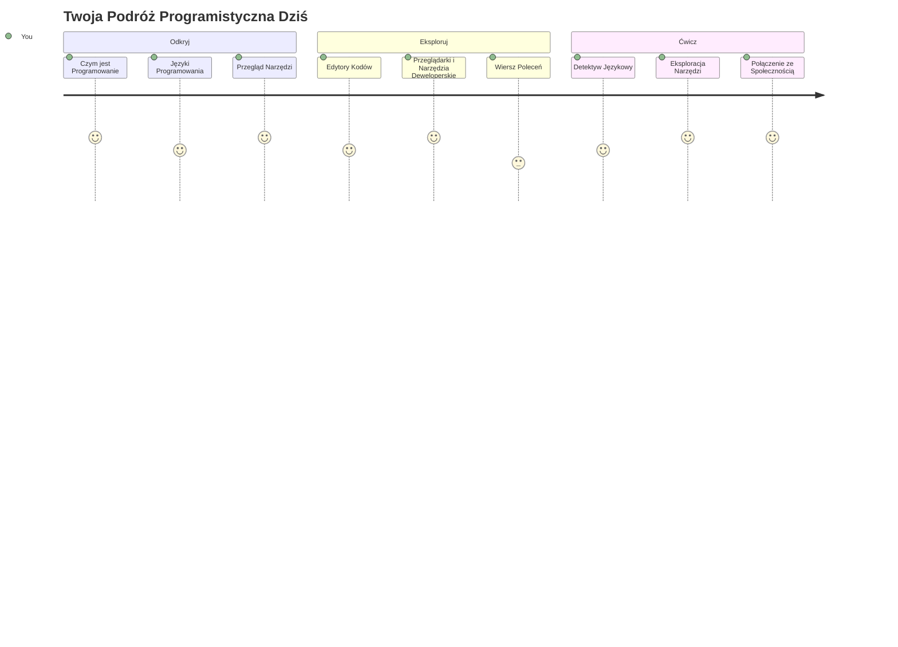
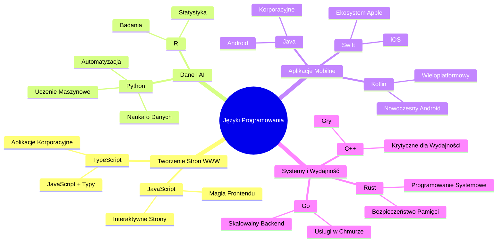
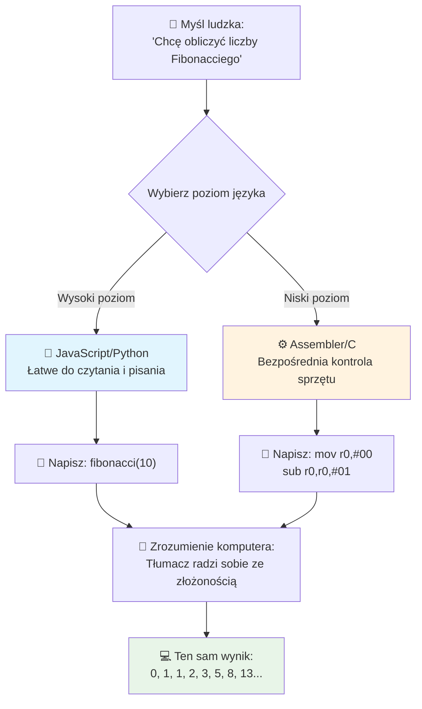
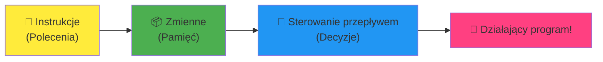
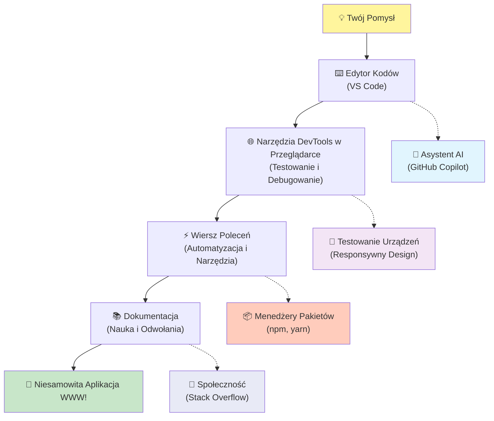
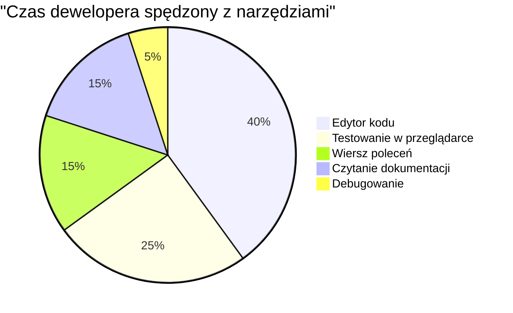
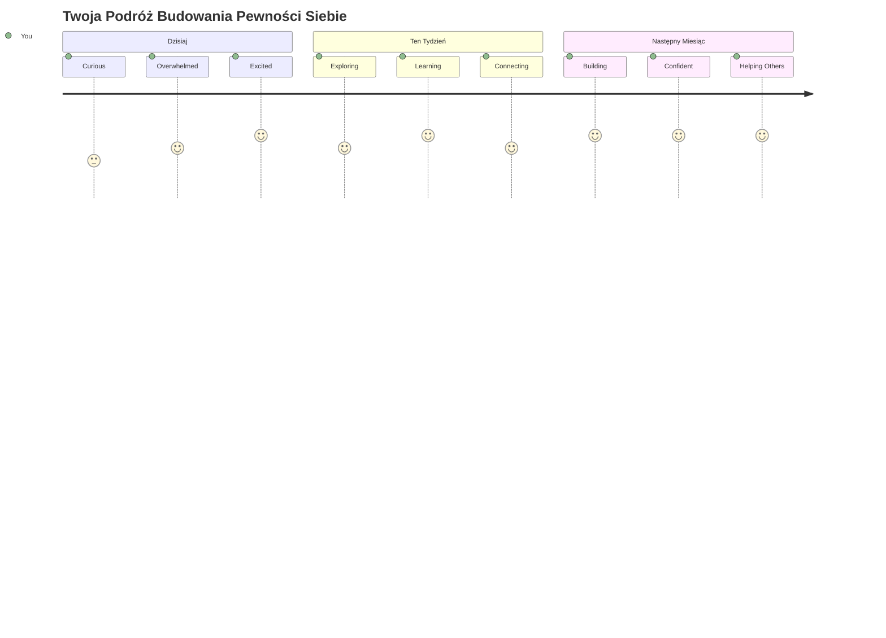

# Wprowadzenie do języków programowania i nowoczesnych narzędzi dla programistów

Cześć, przyszły programisto! 👋 Mogę Ci powiedzieć coś, co codziennie przyprawia mnie o dreszcze? Za chwilę odkryjesz, że programowanie to nie tylko komputery – to posiadanie prawdziwych supermocy, które pozwalają ożywić Twoje najdziksze pomysły!

Znasz ten moment, gdy korzystasz ze swojej ulubionej aplikacji i wszystko po prostu działa idealnie? Kiedy naciskasz przycisk i dzieje się coś magicznego, co sprawia, że mówisz „wow, jak oni to ZROBILI?” Cóż, ktoś dokładnie taki jak Ty – prawdopodobnie siedzący w swoim ulubionym kawiarni o 2 w nocy, pijąc trzeci espresso – napisał kod, który stworzył tę magię. A teraz coś, co zwali Cię z nóg: pod koniec tej lekcji nie tylko będziesz wiedzieć, jak to zrobili, ale zaczniesz sam z niecierpliwością próbować!

Słuchaj, doskonale rozumiem, jeśli programowanie wyda Ci się teraz onieśmielające. Kiedy zaczynałem, naprawdę myślałem, że trzeba być jakimś matematycznym geniuszem albo programować od piątego roku życia. Ale oto co całkowicie zmieniło mój punkt widzenia: programowanie jest dokładnie jak nauka rozmów w nowym języku. Zaczynasz od „cześć” i „dziękuję”, potem uczysz się zamawiać kawę, a zanim się obejrzysz, prowadzisz głębokie, filozoficzne dyskusje! Z tą różnicą, że tutaj rozmawiasz z komputerami, a szczerze? To najbardziej cierpliwi rozmówcy, jakich spotkasz – nigdy nie oceniają Twoich błędów i zawsze chętnie próbują ponownie!

Dzisiaj poznamy niesamowite narzędzia, które sprawiają, że nowoczesny rozwój sieciowy jest nie tylko możliwy, ale naprawdę uzależniający. Mówię o dokładnie tych samych edytorach, przeglądarkach i przepływach pracy, których używają programiści w Netflix, Spotify i Twoim ulubionym niezależnym studiu aplikacji każdego dnia. A teraz najlepsze: większość tych profesjonalnych, standardowych w branży narzędzi jest całkowicie darmowa!


> Sketchnote autorstwa [Tomomi Imura](https://twitter.com/girlie_mac)


```mermaid
journey
    title Twoja Podróż Programistyczna Dziś
    section Odkryj
      Czym jest Programowanie: 5: You
      Języki Programowania: 4: You
      Przegląd Narzędzi: 5: You
    section Eksploruj
      Edytory Kodów: 4: You
      Przeglądarki i Narzędzia Deweloperskie: 5: You
      Wiersz Poleceń: 3: You
    section Ćwicz
      Detektyw Językowy: 4: You
      Eksploracja Narzędzi: 5: You
      Połączenie ze Społecznością: 5: You
```
## Sprawdźmy, co już wiesz!

Zanim przejdziemy do zabawy, jestem ciekawy – co już wiesz o tym świecie programowania? I słuchaj, jeśli patrzysz na te pytania myśląc „nie mam o tym kompletnie pojęcia”, to nie tylko w porządku, to jest idealne! To oznacza, że jesteś dokładnie w odpowiednim miejscu. Pomyśl o tym quizie jak o rozgrzewce przed treningiem – po prostu rozciągamy mięśnie mózgu!

[Przejdź do quizu przed lekcją](https://ff-quizzes.netlify.app/web/)


## Przygoda, na którą zaraz ruszamy razem

Ok, naprawdę się ekscytuję tym, co dziś odkryjemy! Naprawdę chciałbym widzieć Twoją minę, gdy niektóre z tych koncepcji zaczną do Ciebie trafiać. Oto niesamowita podróż, którą odbywamy razem:

- **Czym tak naprawdę jest programowanie (i dlaczego to najfajniejsza rzecz na świecie!)** – Odkryjemy, jak kod jest dosłownie niewidzialną magią napędzającą wszystko wokół Ciebie, od budzika, który jakoś wie, że to poranek poniedziałku, po algorytm, który idealnie dobiera Twoje rekomendacje na Netflixie
- **Języki programowania i ich niesamowite osobowości** – Wyobraź sobie imprezę, gdzie każdy z gości ma zupełnie inne supermoce i sposoby rozwiązywania problemów. Tak właśnie wygląda świat języków programowania i zakochasz się w poznawaniu ich!
- **Podstawowe elementy, które sprawiają, że cyfrowa magia działa** – Pomyśl o nich jak o najlepszym kreatywnym zestawie LEGO. Kiedy zrozumiesz, jak te elementy ze sobą współgrają, zrozumiesz, że możesz zbudować dosłownie wszystko, o czym marzy Twoja wyobraźnia
- **Profesjonalne narzędzia, które sprawią, że poczujesz się jak z czarodziejską różdżką** – Nie przesadzam – te narzędzia naprawdę pozwolą Ci poczuć, że masz supermoce, a najlepsze jest to, że używają ich profesjonaliści!

> 💡 **Ważne**: Nie próbuj zapamiętać wszystkiego od razu! Teraz chcę tylko, żebyś poczuł iskrę ekscytacji związaną z tym, co jest możliwe. Szczegóły pojawią się naturalnie, gdy będziemy ćwiczyć razem – tak właśnie wygląda prawdziwa nauka!

> Możesz przerabiać tę lekcję na [Microsoft Learn](https://learn.microsoft.com/en-us/learn/modules/web-development-101/introduction-programming/?WT.mc_id=academic-77807-sagibbon)!

## To czym dokładnie *jest* programowanie?

Dobra, zmierzmy się z milionowym pytaniem: czym tak naprawdę jest programowanie?

Opowiem Ci historię, która całkowicie zmieniła moje podejście. W zeszłym tygodniu próbowałem wytłumaczyć mamie, jak korzystać z naszego nowego pilota do smart TV. Złapałem się na tym, że mówię rzeczy typu „Naciśnij czerwony przycisk, ale nie ten duży czerwony, tylko ten mały po lewej... nie, Twojej drugiej lewej... dobra, teraz trzymaj przez dwie sekundy, nie jedną, nie trzy...” Brzmi znajomo? 😅

To jest programowanie! To sztuka dawania niezwykle szczegółowych, krok po kroku instrukcji czemuś, co jest bardzo potężne, ale potrzebuje, żeby wszystko było dokładnie wyjaśnione. Tyle że zamiast tłumaczyć mamie (która może zapytać „który czerwony przycisk?!”), tłumaczysz komputerowi (który po prostu robi dokładnie to, co mu polecisz, nawet jeśli nie do końca o to Ci chodziło).

Co mnie zaskoczyło, gdy to odkryłem: komputery są w gruncie rzeczy całkiem proste. One dosłownie rozumieją tylko dwie rzeczy – 1 i 0, co w zasadzie oznacza „tak” i „nie” lub „włączone” i „wyłączone.” To wszystko! Ale teraz zaczyna się magia – nie musimy mówić w 1 i 0 jak w Matrixie. Tutaj na ratunek przychodzą **języki programowania**. Są jak najlepszy na świecie tłumacz, który bierze Twoje zupełnie normalne, ludzkie myśli i przekształca je na język komputera.

I oto, co nadal daje mi dreszcze każdego ranka, gdy się budzę: dosłownie *wszystko* cyfrowe w Twoim życiu zaczęło się od kogoś takiego jak Ty, siedzącego w pidżamie z filiżanką kawy, piszącego kod na laptopie. Ten filtr na Instagramie, który sprawia, że wyglądasz bezbłędnie? Ktoś go zakodował. Rekomendacja, która zaprowadziła Cię do nowej ulubionej piosenki? Programista stworzył ten algorytm. Aplikacja, która pomaga dzielić rachunki za kolację z przyjaciółmi? Tak, ktoś pomyślał „to denerwujące, chyba to naprawię” i... zrobił to!

Kiedy uczysz się programować, nie zdobywasz tylko nowej umiejętności – stajesz się częścią niesamowitej społeczności rozwiązywaczy problemów, którzy spędzają dni myśląc „A co jeśli mógłbym zbudować coś, co sprawi, że czyjś dzień będzie choć trochę lepszy?” Szczerze, czy jest coś fajniejszego?

✅ **Ciekawostka do sprawdzenia**: Poszukaj sobie w wolnej chwili – kto był pierwszym na świecie programistą? Podpowiem: może nie jest to osoba, którą byś się spodziewał! Historia tej osoby jest absolutnie fascynująca i pokazuje, że programowanie od zawsze było o kreatywnym rozwiązywaniu problemów i myśleniu nieszablonowym.

### 🧠 **Sprawdzenie samopoczucia: Jak się czujesz?**

**Zatrzymaj się na chwilę i zastanów:**
- Czy teraz rozumiesz, co oznacza „dawanie instrukcji komputerom”?
- Czy potrafisz pomyśleć o jakimś codziennym zadaniu, które chciałbyś zautomatyzować programowaniem?
- Jakie pytania rodzą się w Twojej głowie na temat tego całego programowania?

> **Pamiętaj**: To całkiem normalne, jeśli niektóre koncepcje są teraz niejasne. Nauka programowania jest jak nauka nowego języka – potrzeba czasu, by mózg zbudował odpowiednie ścieżki nerwowe. Świetnie Ci idzie!

## Języki programowania są jak różne smaki magii

Dobra, to zabrzmi dziwnie, ale zostań ze mną – języki programowania są trochę jak różne rodzaje muzyki. Pomyśl: jest jazz, który jest gładki i improwizowany, rock potężny i bezpośredni, muzyka klasyczna elegancka i uporządkowana oraz hip-hop kreatywny i ekspresyjny. Każdy styl ma swój klimat, swoją społeczność fanów i jest idealny na różne okazje i nastroje.

Języki programowania działają dokładnie tak samo! Nie użyłbyś tego samego języka do budowy zabawnej gry mobilnej, którego użyłbyś do przetwarzania ogromnych ilości danych klimatycznych, tak samo jak nie zagrałbyś death metalu na zajęciach jogi (no, przynajmniej na większości zajęć! 😄).

Ale co mnie za każdym razem powala na kolana, to to: te języki są jak najbardziej cierpliwy, genialny tłumacz świata siedzący tuż obok Ciebie. Możesz wyrazić swoje pomysły w sposób naturalny dla ludzkiego mózgu, a one zajmują się skomplikowanym tłumaczeniem na 1 i 0, które komputery naprawdę rozumieją. To jak mieć przyjaciela, który perfekcyjnie zna zarówno „ludzką kreatywność”, jak i „logikę komputera” – nigdy się nie męczy, nie robi przerw na kawę i nigdy nie ocenia, gdy pytasz to samo dwa razy!

### Popularne języki programowania i ich zastosowania


```mermaid
mindmap
  root((Języki Programowania))
    Tworzenie Stron WWW
      JavaScript
        Magia Frontendu
        Interaktywne Strony
      TypeScript
        JavaScript + Typy
        Aplikacje Korporacyjne
    Dane i AI
      Python
        Nauka o Danych
        Uczenie Maszynowe
        Automatyzacja
      R
        Statystyka
        Badania
    Aplikacje Mobilne
      Java
        Android
        Korporacyjne
      Swift
        iOS
        Ekosystem Apple
      Kotlin
        Nowoczesny Android
        Wieloplatformowy
    Systemy i Wydajność
      C++
        Gry
        Krytyczne dla Wydajności
      Rust
        Bezpieczeństwo Pamięci
        Programowanie Systemowe
      Go
        Usługi w Chmurze
        Skalowalny Backend
```
| Język | Najlepszy do | Dlaczego jest popularny |
|-------|--------------|------------------------|
| **JavaScript** | Tworzenie stron internetowych, interfejsy użytkownika | Działa w przeglądarkach i napędza interaktywne strony |
| **Python** | Nauka o danych, automatyzacja, sztuczna inteligencja | Łatwy do czytania i nauki, potężne biblioteki |
| **Java** | Aplikacje korporacyjne, aplikacje na Androida | Niezależny od platformy, solidny dla dużych systemów |
| **C#** | Aplikacje na Windows, tworzenie gier | Silne wsparcie ekosystemu Microsoft |
| **Go** | Usługi w chmurze, systemy backendowe | Szybki, prosty, zaprojektowany dla nowoczesnych komputerów |

### Języki wysokiego poziomu vs niskiego poziomu

Ok, to chyba była koncepcja, która złamała mój mózg kiedy zaczynałem, więc podzielę się analogią, która w końcu pozwoliła mi to zrozumieć – i mam nadzieję, że Tobie też pomoże!

Wyobraź sobie, że odwiedzasz kraj, gdzie nie znasz języka i desperacko musisz znaleźć najbliższą toaletę (wszyscy to znamy, prawda? 😅):

- **Programowanie niskiego poziomu** to jak nauka lokalnego dialektu tak dobrze, że możesz rozmawiać z babcią sprzedającą owoce na rogu, używając odniesień kulturowych, lokalnego slangu i powiedzonek, które zna tylko ktoś, kto tam dorastał. Super imponujące i bardzo efektywne... jeśli akurat mówisz płynnie! Ale dość przytłaczające, gdy po prostu chcesz znaleźć toaletę.

- **Programowanie wysokiego poziomu** to jak mieć tego niesamowitego lokalnego przyjaciela, który Cię rozumie. Możesz powiedzieć „Naprawdę potrzebuję znaleźć łazienkę” prosto po angielsku, a on zajmie się tłumaczeniem kulturowym i poda Ci wskazówki, które Twój nie-miejscowy mózg doskonale zrozumie.

W programowaniu:
- **Języki niskiego poziomu** (jak Assembly czy C) pozwalają na bardzo szczegółowe rozmowy z faktycznym sprzętem komputera, ale trzeba myśleć jak maszyna, co... powiedzmy, wymaga sporej zmiany sposobu myślenia!
- **Języki wysokiego poziomu** (jak JavaScript, Python czy C#) pozwalają myśleć jak człowiek, podczas gdy one zajmują się maszynowym językiem w tle. Dodatkowo mają niesamowicie przyjazne społeczności ludzi, którzy pamiętają, jak to jest być nowym i naprawdę chcą pomóc!

Zgadnij, jakie polecę na start? 😉 Języki wysokiego poziomu są jak kółka treningowe, których tak naprawdę nigdy nie chcesz zdjąć, bo sprawiają, że nauka jest dużo przyjemniejsza!


```mermaid
flowchart TB
    A["👤 Myśl ludzka:<br/>'Chcę obliczyć liczby Fibonacciego'"] --> B{Wybierz poziom języka}
    
    B -->|Wysoki poziom| C["🌟 JavaScript/Python<br/>Łatwe do czytania i pisania"]
    B -->|Niski poziom| D["⚙️ Assembler/C<br/>Bezpośrednia kontrola sprzętu"]
    
    C --> E["📝 Napisz: fibonacci(10)"]
    D --> F["📝 Napisz: mov r0,#00<br/>sub r0,r0,#01"]
    
    E --> G["🤖 Zrozumienie komputera:<br/>Tłumacz radzi sobie ze złożonością"]
    F --> G
    
    G --> H["💻 Ten sam wynik:<br/>0, 1, 1, 2, 3, 5, 8, 13..."]
    
    style C fill:#e1f5fe
    style D fill:#fff3e0
    style H fill:#e8f5e8
```
### Pokażę Ci, dlaczego języki wysokiego poziomu są dużo przyjaźniejsze

Dobra, pokażę Ci coś, co doskonale pokazuje, dlaczego zakochałem się w językach wysokiego poziomu, ale najpierw musisz mi coś obiecać. Gdy zobaczysz pierwszy przykład kodu, nie panikuj! Ma wyglądać na onieśmielający. Dokładnie o to chodzi!

Zobaczymy to samo zadanie napisane w dwóch zupełnie różnych stylach. Oba tworzą tzw. ciąg Fibonacciego – to piękny matematyczny wzór, gdzie każda liczba jest sumą dwóch poprzednich: 0, 1, 1, 2, 3, 5, 8, 13... (Ciekawostka: można tę sekwencję znaleźć dosłownie wszędzie w naturze – spirale nasion słonecznika, układy szyszek, nawet sposób tworzenia się galaktyk!)

Gotowy zobaczyć różnicę? Zaczynajmy!

**Język wysokiego poziomu (JavaScript) – Przyjazny człowiekowi:**

```javascript
// Krok 1: Podstawowa konfiguracja Fibonacciego
const fibonacciCount = 10;
let current = 0;
let next = 1;

console.log('Fibonacci sequence:');
```

**Co ten kod robi:**
- **Deklaruje** stałą określającą, ile liczb Fibonacciego chcemy wygenerować
- **Inicjalizuje** dwie zmienne do śledzenia bieżącej i następnej liczby w ciągu
- **Ustawia** wartości początkowe (0 i 1) definiujące wzór Fibonacciego
- **Wyświetla** nagłówek identyfikujący nasze wyjście

```javascript
// Krok 2: Wygeneruj sekwencję za pomocą pętli
for (let i = 0; i < fibonacciCount; i++) {
  console.log(`Position ${i + 1}: ${current}`);
  
  // Oblicz kolejny numer w sekwencji
  const sum = current + next;
  current = next;
  next = sum;
}
```

**Rozbijając, co się tutaj dzieje:**
- **Pętla** przechodzi przez każdą pozycję w ciągu za pomocą pętli `for`
- **Wyświetla** każdą liczbę z jej pozycją, używając formatowania szablonowego
- **Oblicza** następną liczbę Fibonacciego przez dodanie bieżącej i następnej wartości
- **Aktualizuje** zmienne śledzące do przejścia do następnej iteracji

```javascript
// Krok 3: Nowoczesne funkcjonalne podejście
const generateFibonacci = (count) => {
  const sequence = [0, 1];
  
  for (let i = 2; i < count; i++) {
    sequence[i] = sequence[i - 1] + sequence[i - 2];
  }
  
  return sequence;
};

// Przykład użycia
const fibSequence = generateFibonacci(10);
console.log(fibSequence);
```

**W powyższym stworzyliśmy:**
- **Funkcję** wielokrotnego użytku z użyciem nowoczesnej składni funkcji strzałkowej
- **Tablicę**, by przechować cały ciąg zamiast wyświetlać liczby pojedynczo
- **Indeksowanie tablicy**, by obliczyć każdą nową liczbę na podstawie poprzednich wartości
- **Zwrócenie** pełnego ciągu dla elastycznego użycia w innych częściach programu

**Język niskiego poziomu (ARM Assembly) – Przyjazny komputerowi:**

```assembly
 area ascen,code,readonly
 entry
 code32
 adr r0,thumb+1
 bx r0
 code16
thumb
 mov r0,#00
 sub r0,r0,#01
 mov r1,#01
 mov r4,#10
 ldr r2,=0x40000000
back add r0,r1
 str r0,[r2]
 add r2,#04
 mov r3,r0
 mov r0,r1
 mov r1,r3
 sub r4,#01
 cmp r4,#00
 bne back
 end
```

Zauważ, że wersja JavaScript czyta się prawie jak instrukcje w języku angielskim, podczas gdy wersja Assembly używa kryptograficznych poleceń, które bezpośrednio sterują procesorem komputera. Oba wykonują dokładnie to samo zadanie, ale język wysokiego poziomu jest dużo łatwiejszy dla ludzi do zrozumienia, pisania i utrzymania.

**Kluczowe różnice, które zauważysz:**
- **Czytelność**: JavaScript używa opisowych nazw, takich jak `fibonacciCount`, podczas gdy Assembly korzysta z krypticznych etykiet typu `r0`, `r1`
- **Komentarze**: Języki wysokiego poziomu zachęcają do pisania wyjaśniających komentarzy, które sprawiają, że kod jest samodokumentujący się
- **Struktura**: Logiczny przepływ w JavaScript odpowiada temu, jak ludzie myślą o problemach krok po kroku
- **Konserwacja**: Aktualizacja wersji JavaScript dla różnych wymagań jest prosta i klarowna

✅ **O ciągu Fibonacciego**: Ten absolutnie przepiękny wzór liczbowy (gdzie każda liczba równa się sumie dwóch poprzednich: 0, 1, 1, 2, 3, 5, 8...) pojawia się dosłownie *wszędzie* w przyrodzie! Znajdziesz go w spiralach słoneczników, wzorach szyszek, sposobie krzywizny muszli nautilusa, a nawet w tym, jak rosną gałęzie drzew. To naprawdę oszałamiające, jak matematyka i kod mogą pomóc nam zrozumieć i odtworzyć wzory, których natura używa do tworzenia piękna!


## Klocki, które tworzą magię

Dobra, skoro już widziałeś, jak wyglądają języki programowania w praktyce, rozłóżmy na czynniki pierwsze podstawowe elementy, które tworzą dosłownie każdy napisany program. Pomyśl o nich jak o niezbędnych składnikach twojego ulubionego przepisu – kiedy zrozumiesz, do czego służy każdy z nich, będziesz w stanie czytać i pisać kod w praktycznie każdym języku!

To trochę jak nauka gramatyki programowania. Pamiętasz, jak w szkole uczyłeś się o rzeczownikach, czasownikach i jak układać zdania? Programowanie ma swoją własną wersję gramatyki i szczerze mówiąc, jest ona o wiele bardziej logiczna i wyrozumiała niż gramatyka angielskiego! 😄

### Instrukcje: Krok po kroku

Zacznijmy od **instrukcji** – to jak pojedyncze zdania w rozmowie z twoim komputerem. Każda instrukcja mówi komputerowi, żeby wykonał jedną konkretną czynność, trochę jak podawanie wskazówek: „Skręć w lewo tutaj”, „Zatrzymaj się na czerwonym świetle”, „Zaparkuj w tym miejscu”. 

To, co kocham w instrukcjach, to jak są zazwyczaj czytelne. Spójrz na to:

```javascript
// Podstawowe instrukcje wykonujące pojedyncze akcje
const userName = "Alex";                    
console.log("Hello, world!");              
const sum = 5 + 3;                         
```

**Oto co robi ten kod:**
- **Deklaruje** stałą zmienną do przechowywania imienia użytkownika
- **Wyświetla** powitanie w konsoli
- **Oblicza** i przechowuje wynik działania matematycznego

```javascript
// Instrukcje współdziałające ze stronami internetowymi
document.title = "My Awesome Website";      
document.body.style.backgroundColor = "lightblue";
```

**Krok po kroku, oto co się dzieje:**
- **Modyfikuje** tytuł strony wyświetlany na karcie przeglądarki
- **Zmienia** kolor tła całej strony

### Zmienne: System pamięci twojego programu

Dobra, **zmienne** to naprawdę jeden z moich ulubionych konceptów do nauczania, ponieważ są bardzo podobne do rzeczy, których używasz codziennie!

Pomyśl przez chwilę o liście kontaktów w telefonie. Nie zapamiętujesz numeru każdej osoby – zamiast tego zapisujesz „Mama”, „Najlepszy przyjaciel” czy „Pizzeria, która działa do 2 w nocy” i pozwalasz telefonowi pamiętać faktyczne numery. Zmienne działają dokładnie tak samo! Są jak oznaczone pojemniki, gdzie twój program może przechowywać informacje i później je odzyskiwać za pomocą nazwy, która faktycznie ma sens.

Oto co jest naprawdę fajne: zmienne mogą się zmieniać podczas działania programu (stąd nazwa „zmienna” – widzisz, co tu zrobili?). Tak jak możesz aktualizować kontakt do pizzerii, gdy znajdziesz lepsze miejsce, zmienne mogą być aktualizowane, gdy program poznaje nowe informacje lub gdy sytuacja się zmienia!

Pokażę ci, jak to może być pięknie proste:

```javascript
// Krok 1: Tworzenie podstawowych zmiennych
const siteName = "Weather Dashboard";        
let currentWeather = "sunny";               
let temperature = 75;                       
let isRaining = false;                      
```

**Zrozumienie tych koncepcji:**
- **Przechowywanie** niezmiennych wartości w zmiennych `const` (np. nazwa strony)
- **Używanie** `let` dla wartości, które mogą się zmieniać podczas działania programu
- **Przypisywanie** różnych typów danych: stringów (tekstów), liczb oraz booleanów (true/false)
- **Wybieranie** opisowych nazw, które wyjaśniają, co zawiera każda zmienna

```javascript
// Krok 2: Praca z obiektami w celu grupowania powiązanych danych
const weatherData = {                       
  location: "San Francisco",
  humidity: 65,
  windSpeed: 12
};
```

**W powyższym przykładzie:**
- **Utworzyliśmy** obiekt do grupowania powiązanych informacji pogodowych
- **Zorganizowaliśmy** wiele kawałków danych pod jedną nazwą zmiennej
- **Użyliśmy** par klucz-wartość, aby wyraźnie oznaczyć każdą informację

```javascript
// Krok 3: Używanie i aktualizowanie zmiennych
console.log(`${siteName}: Today is ${currentWeather} and ${temperature}°F`);
console.log(`Wind speed: ${weatherData.windSpeed} mph`);

// Aktualizowanie zmiennych podlegających zmianom
currentWeather = "cloudy";                  
temperature = 68;                          
```

**Zrozummy każdą część:**
- **Wyświetlamy** informacje używając literałów szablonowych z składnią `${}`
- **Dostęp** do właściwości obiektu za pomocą notacji kropkowej (`weatherData.windSpeed`)
- **Aktualizacja** zmiennych zadeklarowanych przy użyciu `let` w celu odzwierciedlenia zmieniających się warunków
- **Łączenie** wielu zmiennych, aby tworzyć znaczące komunikaty

```javascript
// Krok 4: Nowoczesne destrukturyzowanie dla czyściejszego kodu
const { location, humidity } = weatherData; 
console.log(`${location} humidity: ${humidity}%`);
```

**Co trzeba wiedzieć:**
- **Wyodrębniać** konkretne właściwości obiektów za pomocą destrukturyzacji
- **Tworzyć** nowe zmienne automatycznie o tych samych nazwach co klucze obiektu
- **Uprościć** kod, unikając powtarzającej się notacji kropkowej

### Kierowanie przepływem: Uczymy program myśleć

Okej, tutaj programowanie staje się naprawdę niesamowite! **Kierowanie przepływem** to zasadniczo nauczenie twojego programu, jak podejmować mądre decyzje, dokładnie tak jak robisz to na co dzień, często nawet o tym nie myśląc.

Wyobraź sobie, że dziś rano prawdopodobnie przeżyłeś coś w stylu „Jeśli pada, wezmę parasol. Jeśli jest zimno, założę kurtkę. Jeśli się spóźniam, pomijam śniadanie i biorę kawę w drodze.” Twój mózg naturalnie stosuje tę logikę if-then dziesiątki razy dziennie!

To właśnie sprawia, że programy wydają się inteligentne i żywe, a nie tylko wykonujące nudny, przewidywalny skrypt. One faktycznie patrzą na sytuację, oceniają, co się dzieje i odpowiednio reagują. To tak, jakby dać programowi mózg, który potrafi się dopasować i podejmować decyzje!

Chcesz zobaczyć, jak pięknie to działa? Pokażę ci:

```javascript
// Krok 1: Podstawowa logika warunkowa
const userAge = 17;

if (userAge >= 18) {
  console.log("You can vote!");
} else {
  const yearsToWait = 18 - userAge;
  console.log(`You'll be able to vote in ${yearsToWait} year(s).`);
}
```

**Co robi ten kod:**
- **Sprawdza**, czy wiek użytkownika spełnia wymóg głosowania
- **Wykonuje** różne bloki kodu w zależności od wyniku warunku
- **Oblicza** i wyświetla, jak długo brakuje do możliwości głosowania, jeśli użytkownik ma mniej niż 18 lat
- **Daje** konkretne, pomocne informacje w każdej sytuacji

```javascript
// Krok 2: Wielokrotne warunki z operatorami logicznymi
const userAge = 17;
const hasPermission = true;

if (userAge >= 18 && hasPermission) {
  console.log("Access granted: You can enter the venue.");
} else if (userAge >= 16) {
  console.log("You need parent permission to enter.");
} else {
  console.log("Sorry, you must be at least 16 years old.");
}
```

**Analiza tego, co się dzieje:**
- **Łączy** wiele warunków za pomocą operatora `&&` (i)
- **Tworzy** hierarchię warunków za pomocą `else if`, by obsłużyć wiele scenariuszy
- **Obsługuje** wszystkie możliwe przypadki za pomocą końcowego `else`
- **Daje** jasne i konkretne informacje dla każdej sytuacji

```javascript
// Krok 3: Zwięzły warunek z użyciem operatora trójargumentowego
const votingStatus = userAge >= 18 ? "Can vote" : "Cannot vote yet";
console.log(`Status: ${votingStatus}`);
```

**Co musisz zapamiętać:**
- **Używaj** operatora trójargumentowego (`? :`) do prostych warunków dwuwartościowych
- **Napisz** najpierw warunek, potem `?`, następnie wynik prawdy, dalej `:`, a na końcu wynik fałszu
- **Stosuj** ten wzorzec, gdy chcesz przypisać wartości na podstawie warunków

```javascript
// Krok 4: Obsługa wielu specyficznych przypadków
const dayOfWeek = "Tuesday";

switch (dayOfWeek) {
  case "Monday":
  case "Tuesday":
  case "Wednesday":
  case "Thursday":
  case "Friday":
    console.log("It's a weekday - time to work!");
    break;
  case "Saturday":
  case "Sunday":
    console.log("It's the weekend - time to relax!");
    break;
  default:
    console.log("Invalid day of the week");
}
```

**Ten kod robi następujące rzeczy:**
- **Dopasowuje** wartość zmiennej do wielu konkretnych przypadków
- **Grupuje** podobne przypadki razem (dni robocze kontra weekendy)
- **Wykonuje** właściwy blok kodu, gdy znajdzie dopasowanie
- **Zawiera** przypadek `default` do obsługi nieoczekiwanych wartości
- **Używa** instrukcji `break` by zapobiec kontynuacji do następnego przypadku

> 💡 **Analogia z życia codziennego**: Pomyśl o kierowaniu przepływem jak o najcierpliwszym GPS na świecie, który podaje ci wskazówki. Może powiedzieć „Jeśli na Main Street jest korek, jedź autostradą. Jeśli budowa blokuje autostradę, spróbuj trasy widokowej.” Programy stosują dokładnie taką samą logiczną konstrukcję warunkową, by inteligentnie reagować na różne sytuacje i zawsze zapewniać użytkownikom najlepsze doświadczenie.

### 🎯 **Sprawdzenie pojęć: Mistrzostwo w klockach budulcowych**

**Zobaczmy, jak sobie radzisz z podstawami:**
- Czy potrafisz własnymi słowami wyjaśnić różnicę między zmienną a instrukcją?
- Pomyśl o realnym scenariuszu, gdzie użyłbyś decyzji typu if-then (jak w naszym przykładzie o głosowaniu)
- Co z logiki programowania najbardziej cię zaskoczyło?

**Szybki zastrzyk pewności siebie:**

```mermaid
flowchart LR
    A["📝 Instrukcje<br/>(Polecenia)"] --> B["📦 Zmienne<br/>(Pamięć)"] --> C["🔀 Sterowanie przepływem<br/>(Decyzje)"] --> D["🎉 Działający program!"]
    
    style A fill:#ffeb3b
    style B fill:#4caf50
    style C fill:#2196f3
    style D fill:#ff4081
```
✅ **Co będzie dalej**: Będziemy się świetnie bawić, zagłębiając się w te pojęcia, gdy będziemy kontynuować tę niesamowitą podróż razem! Teraz po prostu skup się na podekscytowaniu wszystkimi niesamowitymi możliwościami, które masz przed sobą. Konkretne umiejętności i techniki w naturalny sposób utrwalą się podczas wspólnych ćwiczeń – obiecuję, że to będzie dużo bardziej zabawne, niż się spodziewasz!

## Narzędzia pracy

Dobra, to jest moment, w którym naprawdę się ekscytuję i ledwie mogę się powstrzymać! 🚀 Zaraz opowiem o niesamowitych narzędziach, które sprawią, że poczujesz się, jakbyś właśnie dostał klucze do cyfrowego statku kosmicznego.

Wiesz, jak szef kuchni ma idealnie wyważone noże, które czują się jak przedłużenia jego rąk? Albo jak muzyk ma tę jedną gitarę, która wydaje się śpiewać w chwili, gdy ją dotyka? Cóż, programiści mają swoją wersję takich magicznych narzędzi i to, co totalnie cię zaskoczy – większość z nich jest całkowicie darmowa!

Dosłownie podskakuję na krześle, myśląc o tym, że mogę się tym z tobą podzielić, ponieważ zupełnie zrewolucjonizowały sposób, w jaki tworzymy oprogramowanie. Mówimy o asystentach kodowania wspieranych przez AI, które mogą pomóc pisać twój kod (nie żartuję!), środowiskach chmurowych, gdzie możesz budować całe aplikacje dosłownie z dowolnego miejsca z dostępem do Wi-Fi, oraz narzędziach do debugowania tak zaawansowanych, że są jak posiadanie rentgenowskiego wzroku do twoich programów.

I jeszcze jedna rzecz, która ciągle mnie imponuje: to nie są „narzędzia dla początkujących”, które szybko wyrastasz. To dokładnie te same profesjonalne narzędzia, których używają programiści w Google, Netflixie i tym indie studio aplikacji, które kochasz, właśnie w tym momencie. Pocujesz się jak prawdziwy profesjonalista, korzystając z nich!


```mermaid
graph TD
    A["💡 Twój Pomysł"] --> B["⌨️ Edytor Kodów<br/>(VS Code)"] 
    B --> C["🌐 Narzędzia DevTools w Przeglądarce<br/>(Testowanie i Debugowanie)"]
    C --> D["⚡ Wiersz Poleceń<br/>(Automatyzacja i Narzędzia)"]
    D --> E["📚 Dokumentacja<br/>(Nauka i Odwołania)"]
    E --> F["🚀 Niesamowita Aplikacja WWW!"]
    
    B -.-> G["🤖 Asystent AI<br/>(GitHub Copilot)"]
    C -.-> H["📱 Testowanie Urządzeń<br/>(Responsywny Design)"]
    D -.-> I["📦 Menedżery Pakietów<br/>(npm, yarn)"]
    E -.-> J["👥 Społeczność<br/>(Stack Overflow)"]
    
    style A fill:#fff59d
    style F fill:#c8e6c9
    style G fill:#e1f5fe
    style H fill:#f3e5f5
    style I fill:#ffccbc
    style J fill:#e8eaf6
```
### Edytory kodu i IDE: Twoi nowi cyfrowi najlepsi przyjaciele

Porozmawiajmy o edytorach kodu – to na poważnie miejsca, które wkrótce staną się twoimi ulubionymi! Pomyśl o nich jak o twoim osobistym sanktuarium kodowania, gdzie spędzisz większość czasu tworząc i udoskonalając swoje cyfrowe dzieła.

Ale tu jest coś absolutnie magicznego w nowoczesnych edytorach: to nie są zwykłe edytory tekstu. To tak, jakby mieć obok siebie 24/7 najbystrzejszego i najbardziej wspierającego mentora kodowania. Wyłapują literówki zanim je zauważysz, sugerują ulepszenia sprawiające, że wyglądasz na geniusza, pomagają zrozumieć, co robi każdy fragment kodu, a niektóre z nich nawet przewidują, co chcesz napisać i proponują dokończenie twoich myśli!

Pamiętam, gdy pierwszy raz odkryłem autouzupełnianie – poczułem się jakbym żył w przyszłości. Zaczynasz coś pisać, a edytor mówi: „Hej, może myślałeś o tej funkcji, która dokładnie robi to, czego potrzebujesz?” To tak, jakby mieć czytającego w myślach kumpla do kodowania!

**Co sprawia, że te edytory są takie niesamowite?**

Nowoczesne edytory kodu oferują imponujący zestaw funkcji zaprojektowanych, by zwiększyć twoją produktywność:

| Funkcja | Co robi | Dlaczego pomaga |
|---------|---------|-----------------|
| **Kolorowanie składni** | Koloruje różne części kodu | Ułatwia czytanie kodu i znalezienie błędów |
| **Autouzupełnianie** | Sugeruje kod podczas pisania | Przyspiesza kodowanie i redukuje literówki |
| **Narzędzia debugowania** | Pomagają znaleźć i naprawić błędy | Oszczędza godziny na rozwiązywaniu problemów |
| **Rozszerzenia** | Dodają specjalistyczne funkcje | Pozwalają dostosować edytor do każdej technologii |
| **Asystenci AI** | Sugerują kod i wyjaśnienia | Przyspieszają naukę i wydajność pracy |

> 🎥 **Zasób wideo**: Chcesz zobaczyć te narzędzia w akcji? Sprawdź ten [film „Narzędzia pracy”](https://youtube.com/watch?v=69WJeXGBdxg) dla kompleksowego przeglądu.

#### Polecane edytory do tworzenia stron internetowych

**[Visual Studio Code](https://code.visualstudio.com/?WT.mc_id=academic-77807-sagibbon)** (darmowy)
- Najpopularniejszy wśród twórców stron internetowych
- Doskonały ekosystem rozszerzeń
- Wbudowany terminal i integracja z Gitem
- **Niezbędne rozszerzenia**:
  - [GitHub Copilot](https://marketplace.visualstudio.com/items?itemName=GitHub.copilot) – sugeruje kod wspierany AI
  - [Live Share](https://marketplace.visualstudio.com/items?itemName=MS-vsliveshare.vsliveshare) – współpraca w czasie rzeczywistym
  - [Prettier](https://marketplace.visualstudio.com/items?itemName=esbenp.prettier-vscode) – automatyczne formatowanie kodu
  - [Code Spell Checker](https://marketplace.visualstudio.com/items?itemName=streetsidesoftware.code-spell-checker) – wykrywa literówki w kodzie

**[JetBrains WebStorm](https://www.jetbrains.com/webstorm/)** (płatny, darmowy dla studentów)
- Zaawansowane narzędzia do debugowania i testowania
- Inteligentne uzupełnianie kodu
- Wbudowana kontrola wersji

**IDE oparte na chmurze** (różne cenniki)
- [GitHub Codespaces](https://github.com/features/codespaces) – pełny VS Code w przeglądarce
- [Replit](https://replit.com/) – świetny do nauki i dzielenia się kodem
- [StackBlitz](https://stackblitz.com/) – natychmiastowe, pełnostackowe tworzenie webowe

> 💡 **Wskazówka na start**: Zacznij od Visual Studio Code – jest darmowy, powszechnie używany w branży i ma ogromną społeczność tworzącą pomocne samouczki i rozszerzenia.


### Przeglądarki internetowe: Twoje tajne laboratorium programisty

Dobra, przygotuj się na totalne zdumienie! Wiesz, jak używałeś przeglądarki do przeglądania mediów społecznościowych i oglądania filmów? Okazuje się, że przez cały czas ukrywało się tam niesamowite tajne laboratorium programisty, czekające, aż je odkryjesz!

Za każdym razem, gdy klikniesz prawym przyciskiem na stronie i wybierzesz „Zbadaj element”, otwierasz ukryty świat narzędzi deweloperskich, które są szczerze mówiąc potężniejsze niż niektóre drogie programy, za które kiedyś płaciłem setki dolarów. To jak odkrycie, że twoja zwykła kuchnia skrywa labolatorium profesjonalnego szefa kuchni za tajnym panelem!
Pierwszy raz, gdy ktoś pokazał mi narzędzia deweloperskie przeglądarki, spędziłem około trzech godzin tylko klikając i mówiąc „CZEKAJ, TO TEŻ POTRAFI?!” Możesz dosłownie edytować każdą stronę internetową w czasie rzeczywistym, zobaczyć dokładnie, jak szybko wszystko się ładuje, przetestować, jak twoja witryna wygląda na różnych urządzeniach, a nawet debugować JavaScript jak prawdziwy profesjonalista. To absolutnie oszałamiające!

**Oto dlaczego przeglądarki są twoją tajną bronią:**

Kiedy tworzysz stronę internetową lub aplikację webową, musisz zobaczyć, jak wygląda i zachowuje się w rzeczywistym świecie. Przeglądarki nie tylko wyświetlają twoją pracę, ale także dostarczają szczegółowe informacje zwrotne na temat wydajności, dostępności i potencjalnych problemów.

#### Narzędzia deweloperskie przeglądarki (DevTools)

Nowoczesne przeglądarki zawierają kompleksowe zestawy narzędzi developerskich:

| Kategoria narzędzi | Co robi | Przykładowe zastosowanie |
|--------------------|---------|--------------------------|
| **Inspektor elementów** | Podgląd i edycja HTML/CSS w czasie rzeczywistym | Dostosuj styl, aby zobaczyć natychmiastowe efekty |
| **Konsola** | Podgląd komunikatów o błędach i testowanie JavaScript | Debuguj problemy i eksperymentuj z kodem |
| **Monitor sieci** | Śledź, jak ładują się zasoby | Optymalizuj wydajność i czas ładowania |
| **Sprawdzanie dostępności** | Testuj pod kątem inkluzywnego projektowania | Upewnij się, że twoja witryna działa dla wszystkich użytkowników |
| **Symulator urządzeń** | Podgląd na różnych rozmiarach ekranów | Testuj responsywny design bez posiadania wielu urządzeń |

#### Polecane przeglądarki do pracy developerskiej

- **[Chrome](https://developers.google.com/web/tools/chrome-devtools/)** – Standardowe narzędzia deweloperskie z obszerna dokumentacją
- **[Firefox](https://developer.mozilla.org/docs/Tools)** – Doskonałe narzędzia do CSS Grid i dostępności
- **[Edge](https://docs.microsoft.com/microsoft-edge/devtools-guide-chromium/?WT.mc_id=academic-77807-sagibbon)** – Zbudowany na Chromium z zasobami deweloperskimi Microsoftu

> ⚠️ **Ważna wskazówka testowania**: Zawsze testuj swoje strony w wielu przeglądarkach! To, co działa idealnie w Chrome, może wyglądać inaczej w Safari lub Firefox. Profesjonalni deweloperzy sprawdzają kompatybilność we wszystkich głównych przeglądarkach, aby zapewnić spójne doświadczenia użytkowników.


### Narzędzia wiersza poleceń: twoje wrota do supermocy dewelopera

Dobra, teraz chwila szczerości o wierszu poleceń, bo chcę, abyś usłyszał to od kogoś, kto naprawdę to rozumie. Kiedy pierwszy raz go zobaczyłem – ten straszny czarny ekran z migającym tekstem – dosłownie pomyślałem: „Nie, absolutnie nie! To wygląda jak coś z filmu o hakerach z lat 80., a ja zdecydowanie nie jestem na to wystarczająco mądry!” 😅

Ale oto czego chciałbym, aby ktoś mi wtedy powiedział i co mówię tobie teraz: wiersz poleceń nie jest straszny – to tak, jakby rozmawiać bezpośrednio z twoim komputerem. Pomyśl o tym jak o różnicy między zamawianiem jedzenia przez aplikację z ładnymi zdjęciami i menu (co jest wygodne i łatwe) a wejściem do twojej ulubionej lokalnej restauracji, gdzie kucharz zna dokładnie twoje gusta i może przygotować coś idealnego, gdy tylko powiesz „zaskocz mnie czymś wspaniałym”.

To właśnie wiersz poleceń jest miejscem, gdzie deweloperzy czują się jak prawdziwi magicy. Wpisujesz kilka pozornie magicznych słów (no dobrze, to po prostu polecenia, ale brzmią magicznie!), naciskasz enter i BUM – utworzyłeś całą strukturę projektu, zainstalowałeś potężne narzędzia z całego świata albo wdrożyłeś swoją aplikację w internecie, aby miliony ludzi mogło ją zobaczyć. Gdy raz poczujesz tę moc, to naprawdę uzależnia!

**Dlaczego wiersz poleceń stanie się twoim ulubionym narzędziem:**

Chociaż interfejsy graficzne sprawdzają się w wielu zadaniach, to wiersz poleceń doskonale nadaje się do automatyzacji, precyzji i szybkości. Wiele narzędzi deweloperskich działa głównie przez CLI, a nauka ich efektywnego użycia może znacznie poprawić twoją produktywność.

```bash
# Krok 1: Utwórz i przejdź do katalogu projektu
mkdir my-awesome-website
cd my-awesome-website
```

**Oto, co robi ten kod:**
- **Tworzy** nowy katalog o nazwie "my-awesome-website" dla twojego projektu
- **Przechodzi** do nowo utworzonego katalogu, aby rozpocząć pracę

```bash
# Krok 2: Zainicjuj projekt za pomocą package.json
npm init -y

# Zainstaluj nowoczesne narzędzia deweloperskie
npm install --save-dev vite prettier eslint
npm install --save-dev @eslint/js
```

**Krok po kroku, co się dzieje:**
- **Inicjalizuje** nowy projekt Node.js z domyślnymi ustawieniami za pomocą `npm init -y`
- **Instaluje** Vite jako nowoczesne narzędzie do budowy dla szybkiego rozwoju i produkcji
- **Dodaje** Prettier do automatycznego formatowania kodu oraz ESLint do kontroli jakości kodu
- **Używa** flagi `--save-dev`, aby oznaczyć te narzędzia jako zależności wyłącznie deweloperskie

```bash
# Krok 3: Utwórz strukturę projektu i pliki
mkdir src assets
echo '<!DOCTYPE html><html><head><title>My Site</title></head><body><h1>Hello World</h1></body></html>' > index.html

# Uruchom serwer deweloperski
npx vite
```

**W powyższym:**
- **Zorganizowaliśmy** projekt, tworząc osobne foldery na kod źródłowy i zasoby
- **Wygenerowaliśmy** podstawowy plik HTML z odpowiednią strukturą dokumentu
- **Uruchomiliśmy** serwer developerski Vite do live reload i hot module replacement

#### Podstawowe narzędzia wiersza poleceń do web developmentu

| Narzędzie | Cel | Dlaczego jest Ci potrzebne |
|-----------|-----|----------------------------|
| **[Git](https://git-scm.com/)** | Kontrola wersji | Śledzenie zmian, współpraca z innymi, tworzenie kopii zapasowych |
| **[Node.js & npm](https://nodejs.org/)** | Środowisko uruchomieniowe JavaScript i zarządzanie pakietami | Uruchamianie JavaScript poza przeglądarką, instalacja nowoczesnych narzędzi developerskich |
| **[Vite](https://vitejs.dev/)** | Narzędzie budujące i serwer developerski | Superszybki rozwój z hot module replacement |
| **[ESLint](https://eslint.org/)** | Jakość kodu | Automatyczne znajdowanie i naprawianie problemów w JavaScript |
| **[Prettier](https://prettier.io/)** | Formatowanie kodu | Utrzymywanie spójnego i czytelnego formatowania kodu |

#### Opcje specyficzne dla platform

**Windows:**
- **[Windows Terminal](https://docs.microsoft.com/windows/terminal/?WT.mc_id=academic-77807-sagibbon)** – nowoczesny terminal z wieloma funkcjami
- **[PowerShell](https://docs.microsoft.com/powershell/?WT.mc_id=academic-77807-sagibbon)** 💻 – potężne środowisko skryptowe
- **[Command Prompt](https://docs.microsoft.com/windows-server/administration/windows-commands/?WT.mc_id=academic-77807-sagibbon)** 💻 – tradycyjny wiersz poleceń Windows

**macOS:**
- **[Terminal](https://support.apple.com/guide/terminal/)** 💻 – wbudowana aplikacja terminalowa
- **[iTerm2](https://iterm2.com/)** – ulepszony terminal z zaawansowanymi funkcjami

**Linux:**
- **[Bash](https://www.gnu.org/software/bash/)** 💻 – standardowa powłoka Linuxa
- **[KDE Konsole](https://docs.kde.org/trunk5/en/konsole/konsole/index.html)** – zaawansowany emulator terminala

> 💻 = Wstępnie zainstalowane w systemie operacyjnym

> 🎯 **Ścieżka nauki**: Zacznij od podstawowych poleceń takich jak `cd` (zmień katalog), `ls` lub `dir` (lista plików) oraz `mkdir` (stwórz katalog). Ćwicz używanie nowoczesnych poleceń workflow, jak `npm install`, `git status` oraz `code .` (otwiera aktualny katalog w VS Code). W miarę nabierania wprawy naturalnie przyswoisz sobie bardziej zaawansowane polecenia i techniki automatyzacji.


### Dokumentacja: twój zawsze dostępny mentor do nauki

Dobra, podzielę się z tobą małą tajemnicą, która sprawi, że poczujesz się o wiele lepiej jako początkujący: nawet najbardziej doświadczeni deweloperzy spędzają ogromną część czasu na czytaniu dokumentacji. I to nie dlatego, że nie wiedzą, co robią – to wręcz oznaka mądrości!

Pomyśl o dokumentacji jak o dostępie do najbardziej cierpliwych i kompetentnych nauczycieli na świecie, dostępnych 24/7. Utknąłeś w problemie o 2 w nocy? Dokumentacja jest tam z ciepłym wirtualnym uściskiem i dokładną odpowiedzią, której potrzebujesz. Chcesz dowiedzieć się o jakiejś ciekawej nowej funkcji, o której wszyscy mówią? Dokumentacja cię wesprze przykładami krok po kroku. Próbujesz zrozumieć, dlaczego coś działa tak, a nie inaczej? Zgadza się – dokumentacja jest gotowa wytłumaczyć to tak, abyś w końcu zrozumiał!

Co całkowicie zmieniło moje postrzeganie: świat web developmentu rozwija się niesamowicie szybko i nikt (mając na myśli absolutnie nikt!) nie trzyma wszystkiego w pamięci. Widziałem starszych developerów z ponad 15-letnim doświadczeniem, którzy szukają podstawowej składni i wiesz co? To nie jest wstyd – to mądre! Nie chodzi o idealną pamięć, ale o to, gdzie szybko znaleźć wiarygodne odpowiedzi i jak je zastosować.

**Tu dzieje się prawdziwa magia:**

Profesjonalni deweloperzy spędzają znaczną część czasu na czytaniu dokumentacji – nie dlatego, że nie wiedzą, co robią, ale dlatego, że krajobraz web developmentu zmienia się tak szybko, że bycie na bieżąco wymaga nieustannej nauki. Dobra dokumentacja pomaga zrozumieć nie tylko *jak* czegoś używać, ale również *dlaczego* i *kiedy* to robić.

#### Podstawowe źródła dokumentacji

**[Mozilla Developer Network (MDN)](https://developer.mozilla.org/docs/Web)**
- Złoty standard dokumentacji technologii webowych
- Kompleksowe przewodniki po HTML, CSS i JavaScript
- Zawiera informacje o kompatybilności przeglądarek
- Oferuje praktyczne przykłady i interaktywne demo

**[Web.dev](https://web.dev)** (Google)
- Nowoczesne najlepsze praktyki web developmentu
- Przewodniki optymalizacji wydajności
- Zasady dostępności i inkluzywnego projektowania
- Studia przypadków z prawdziwych projektów

**[Microsoft Developer Documentation](https://docs.microsoft.com/microsoft-edge/#microsoft-edge-for-developers)**
- Zasoby dla programistów przeglądarki Edge
- Przewodniki dotyczące Progressive Web Apps
- Wgląd w rozwój multiplatformowy

**[Frontend Masters Learning Paths](https://frontendmasters.com/learn/)**
- Ustrukturyzowane programy nauczania
- Kursy wideo prowadzone przez ekspertów branżowych
- Ćwiczenia praktyczne z kodowaniem

> 📚 **Strategia nauki**: Nie próbuj na pamięć zapamiętywać dokumentacji – zamiast tego naucz się sprawnie po niej poruszać. Dodawaj do zakładek często używane referencje i ćwicz korzystanie z funkcji wyszukiwania, aby szybko znaleźć potrzebne informacje.

### 🔧 **Sprawdzenie mistrzostwa narzędzi: co do ciebie przemawia?**

**Poświęć chwilę na zastanowienie się:**
- Które narzędzie najbardziej chcesz najpierw wypróbować? (Nie ma złych odpowiedzi!)
- Czy wiersz poleceń nadal wydaje się onieśmielający, czy raczej budzi twoją ciekawość?
- Czy potrafisz sobie wyobrazić, że używasz DevTools przeglądarki, by zajrzeć za kulisy swoich ulubionych stron?


```mermaid
pie title "Czas dewelopera spędzony z narzędziami"
    "Edytor kodu" : 40
    "Testowanie w przeglądarce" : 25
    "Wiersz poleceń" : 15
    "Czytanie dokumentacji" : 15
    "Debugowanie" : 5
```
> **Zabawna ciekawostka**: Większość deweloperów spędza około 40% czasu w edytorze kodu, ale zwróć uwagę, ile czasu poświęca na testowanie, naukę i rozwiązywanie problemów. Programowanie to nie tylko pisanie kodu – to tworzenie doświadczeń!

✅ **Temat do przemyśleń**: Zastanów się, jak twoim zdaniem narzędzia do budowania stron (development) różnią się od narzędzi do projektowania ich wyglądu (design)? To jak różnica między architektem projektującym piękny dom a wykonawcą, który go faktycznie buduje. Oboje są kluczowi, ale potrzebują różnych narzędzi! Takie myślenie naprawdę pozwoli ci zobaczyć szerszy obraz tego, jak powstają strony internetowe.

## Wyzwanie agenta GitHub Copilot 🚀

Użyj trybu Agenta, aby rozwiązać następujące zadanie:

**Opis:** Zbadaj funkcje nowoczesnego edytora kodu lub IDE i pokaż, jak mogą one usprawnić twoją pracę jako dewelopera webowego.

**Zadanie:** Wybierz edytor kodu lub IDE (np. Visual Studio Code, WebStorm lub IDE w chmurze). Wypisz trzy funkcje lub rozszerzenia, które pomagają ci efektywniej pisać, debugować lub utrzymywać kod. Do każdego podaj krótkie wyjaśnienie, jak wpływa na twój workflow.

---

## 🚀 Wyzwanie

**Dobra, detektywie, gotowy na swoją pierwszą sprawę?**

Teraz, kiedy masz solidne podstawy, mam dla ciebie przygodę, która pokaże, jak niesamowicie różnorodny i fascynujący jest świat programowania. I słuchaj – to jeszcze nie o pisaniu kodu, więc bez stresu! Pomyśl o sobie jak o detektywie języków programowania w twojej pierwszej ekscytującej sprawie!

**Twoja misja, jeśli zdecydujesz się ją podjąć:**
1. **Stań się odkrywcą języków**: Wybierz trzy języki programowania z zupełnie różnych światów – może jeden do tworzenia stron internetowych, drugi do aplikacji mobilnych, a trzeci do analiz danych naukowych. Znajdź przykłady tego samego prostego zadania zapisanego w każdym z nich. Obiecuję, że będziesz zachwycony, jak bardzo mogą się różnić, robiąc dokładnie to samo!

2. **Poznaj historie ich powstania**: Co sprawia, że każdy język jest wyjątkowy? Oto fajny fakt – każdy język programowania powstał, bo ktoś pomyślał: „Wiecie co? Musi być lepszy sposób na rozwiązanie tego konkretnego problemu.” Czy potrafisz odkryć, jakie to były problemy? Niektóre z tych historii są naprawdę fascynujące!

3. **Poznaj społeczności**: Zobacz, jak przyjazne i zaangażowane są społeczności każdego z tych języków. Niektóre liczą miliony programistów dzielących się wiedzą i pomagających sobie nawzajem, inne są mniejsze, ale bardzo zżyte i wspierające. Pokochasz różne osobowości, jakie te społeczności reprezentują!

4. **Zaufaj swojemu przeczuciu**: Który język wydaje ci się teraz najbardziej dostępny? Nie stresuj się wyborem „idealnym” – po prostu słuchaj swojego instynktu! Naprawdę nie ma złych odpowiedzi, zawsze możesz później poznawać inne.

**Bonus detektywistyczny**: Sprawdź, czy możesz odkryć, jakie duże strony internetowe lub aplikacje zostały stworzone w każdym z tych języków. Gwarantuję, że będziesz w szoku, gdy dowiesz się, co zasila Instagram, Netflixa czy tę mobilną grę, której nie możesz przestać grać!

> 💡 **Pamiętaj**: Nie próbujesz dziś stać się ekspertem w żadnym z tych języków. Po prostu poznajesz „dzielnicę”, zanim zdecydujesz, gdzie chcesz się osiedlić. Poświęć czas, baw się dobrze i pozwól, by kierowała tobą ciekawość!

## Świętujmy to, co odkryłeś!

Wow, przyswoiłeś dziś tyle niesamowitych informacji! Naprawdę cieszę się, że mogę zobaczyć, ile z tej niesamowitej podróży z tobą zostało. I pamiętaj – to nie test, w którym musisz mieć wszystko idealnie. To raczej święto wszystkich super rzeczy, które już wiesz o tym fascynującym świecie, w który się zanurzasz!

[Przejdź do quizu po lekcji](https://ff-quizzes.netlify.app/web/)

## Podsumowanie i samodzielna nauka

**Poświęć czas na eksplorację i baw się dobrze!**
Dzisiaj przeszliście przez wiele materiału, i to jest powód do dumy! Teraz nadchodzi zabawna część – eksplorowanie tematów, które rozbudziły waszą ciekawość. Pamiętajcie, to nie jest praca domowa – to przygoda!

**Zanurz się głębiej w to, co cię ekscytuje:**

**Wypróbuj na żywo języki programowania:**
- Odwiedź oficjalne strony 2-3 języków, które przykuły twoją uwagę. Każdy ma swoją osobowość i historię!
- Spróbuj online playgroundów do kodowania, takich jak [CodePen](https://codepen.io/), [JSFiddle](https://jsfiddle.net/), lub [Replit](https://replit.com/). Nie bój się eksperymentować – nic nie zepsujesz!
- Przeczytaj o tym, jak powstał twój ulubiony język. Serio, niektóre historie powstania są fascynujące i pomogą ci zrozumieć, dlaczego języki działają tak, jak działają.

**Zapoznaj się z nowymi narzędziami:**
- Pobierz Visual Studio Code, jeśli jeszcze tego nie zrobiłeś – jest darmowy i na pewno go pokochasz!
- Spędź kilka minut przeglądając marketplace z rozszerzeniami. To jak sklep z aplikacjami dla twojego edytora kodu!
- Otwórz narzędzia deweloperskie swojej przeglądarki i po prostu klikaj wszędzie. Nie musisz wszystkiego rozumieć – po prostu poznaj, co tam jest.

**Dołącz do społeczności:**
- Obserwuj społeczności programistów na [Dev.to](https://dev.to/), [Stack Overflow](https://stackoverflow.com/), lub [GitHub](https://github.com/). Społeczność programistów jest niezwykle gościnna dla nowicjuszy!
- Obejrzyj kilka filmów dla początkujących na YouTube. Jest wielu świetnych twórców, którzy pamiętają, jak to jest zaczynać.
- Rozważ dołączenie do lokalnych spotkań lub społeczności online. Zaufaj mi, programiści uwielbiają pomagać nowicjuszom!

> 🎯 **Posłuchaj, co chcę, żebyś zapamiętał**: Nie oczekuje się, że zostaniesz czarodziejem kodu z dnia na dzień! Na razie po prostu poznajesz ten niesamowity nowy świat, do którego właśnie dołączasz. Daj sobie czas, ciesz się podróżą i pamiętaj – każdy programista, którego podziwiasz, kiedyś siedział dokładnie tam, gdzie ty teraz, czując ekscytację i może trochę przytłoczenie. To całkowicie normalne i oznacza, że robisz to dobrze!


## Zadanie

[Reading the Docs](assignment.md)

> 💡 **Mała podpowiedź do twojego zadania**: Bardzo chciałbym zobaczyć, jak eksplorujesz narzędzia, o których jeszcze nie rozmawialiśmy! Pomiń edytory, przeglądarki i narzędzia wiersza poleceń, o których już mówiliśmy – istnieje cały niesamowity świat narzędzi programistycznych czekających na odkrycie. Szukaj takich, które są aktywnie utrzymywane i mają żywe, pomocne społeczności (to one zazwyczaj mają najlepsze tutoriale i najbardziej wspierających ludzi, gdy utkniesz i będziesz potrzebować pomocy).

---

## 🚀 Twoja oś czasu podróży programistycznej

### ⚡ **Co możesz zrobić w ciągu następnych 5 minut**
- [ ] Dodaj do zakładek 2-3 witryny języków programowania, które przykuły twoją uwagę
- [ ] Pobierz Visual Studio Code, jeśli jeszcze tego nie zrobiłeś
- [ ] Otwórz DevTools swojej przeglądarki (F12) i klikaj po dowolnej stronie internetowej
- [ ] Dołącz do jednej społeczności programistycznej (Dev.to, Reddit r/webdev lub Stack Overflow)

### ⏰ **Co możesz osiągnąć w ciągu tej godziny**
- [ ] Ukończ quiz po lekcji i przemyśl swoje odpowiedzi
- [ ] Skonfiguruj VS Code z rozszerzeniem GitHub Copilot
- [ ] Wypróbuj przykład "Hello World" w 2 różnych językach programowania online
- [ ] Obejrzyj film "Dzień z życia programisty" na YouTube
- [ ] Zacznij detektywistyczną pracę nad językiem programowania (zgodnie z wyzwaniem)

### 📅 **Twoja tygodniowa przygoda**
- [ ] Wykonaj zadanie i poznaj 3 nowe narzędzia programistyczne
- [ ] Obserwuj 5 deweloperów lub kont programistycznych w mediach społecznościowych
- [ ] Spróbuj zbudować coś małego w CodePen lub Replit (nawet "Hello, [Twoje Imię]!")
- [ ] Przeczytaj jeden blog dewelopera o czyjejś podróży w kodowaniu
- [ ] Dołącz do wirtualnego meetup'u lub obejrzyj wykład o programowaniu
- [ ] Zacznij uczyć się wybranego języka programowania za pomocą tutoriali online

### 🗓️ **Twoja miesięczna transformacja**
- [ ] Zbuduj swój pierwszy mały projekt (nawet prostą stronę internetową!)
- [ ] Wnieś wkład do projektu open-source (zacznij od poprawek dokumentacji)
- [ ] Zostań mentorem dla kogoś, kto dopiero zaczyna swoją podróż programistyczną
- [ ] Stwórz swoją stronę portfolio dla dewelopera
- [ ] Nawiąż kontakt z lokalnymi społecznościami programistycznymi lub grupami studenckimi
- [ ] Zacznij planować kolejny kamień milowy nauki

### 🎯 **Ostateczne podsumowanie**

**Zanim przejdziesz dalej, poświęć chwilę na świętowanie:**
- Co jedno w programowaniu dzisiaj cię zaciekawiło?
- Które narzędzie lub koncepcję chcesz zbadać jako pierwsze?
- Jak się czujesz, zaczynając tę podróż programistyczną?
- Jakie jedno pytanie chciałbyś teraz zadać programiście?


```mermaid
journey
    title Twoja Podróż Budowania Pewności Siebie
    section Dzisiaj
      Curious: 3: You
      Overwhelmed: 4: You
      Excited: 5: You
    section Ten Tydzień
      Exploring: 4: You
      Learning: 5: You
      Connecting: 4: You
    section Następny Miesiąc
      Building: 5: You
      Confident: 5: You
      Helping Others: 5: You
```
> 🌟 **Pamiętaj**: Każdy ekspert kiedyś był początkującym. Każdy starszy deweloper czuł się dokładnie tak jak ty teraz – podekscytowany, może trochę przytłoczony i na pewno ciekawy, co jest możliwe. Jesteś w niesamowitym towarzystwie, a ta podróż będzie niesamowita. Witamy w cudownym świecie programowania! 🎉

---

<!-- CO-OP TRANSLATOR DISCLAIMER START -->
**Zastrzeżenie**:  
Niniejszy dokument został przetłumaczony za pomocą automatycznej usługi tłumaczeniowej AI [Co-op Translator](https://github.com/Azure/co-op-translator). Mimo że dokładamy wszelkich starań, aby tłumaczenie było poprawne, prosimy mieć na uwadze, że tłumaczenia automatyczne mogą zawierać błędy lub niedokładności. Oryginalny dokument w języku źródłowym powinien być traktowany jako źródło ostateczne. W przypadku informacji krytycznych zalecane jest skorzystanie z profesjonalnego tłumaczenia wykonanego przez człowieka. Nie ponosimy odpowiedzialności za jakiekolwiek nieporozumienia lub błędne interpretacje wynikające z użycia tego tłumaczenia.
<!-- CO-OP TRANSLATOR DISCLAIMER END -->