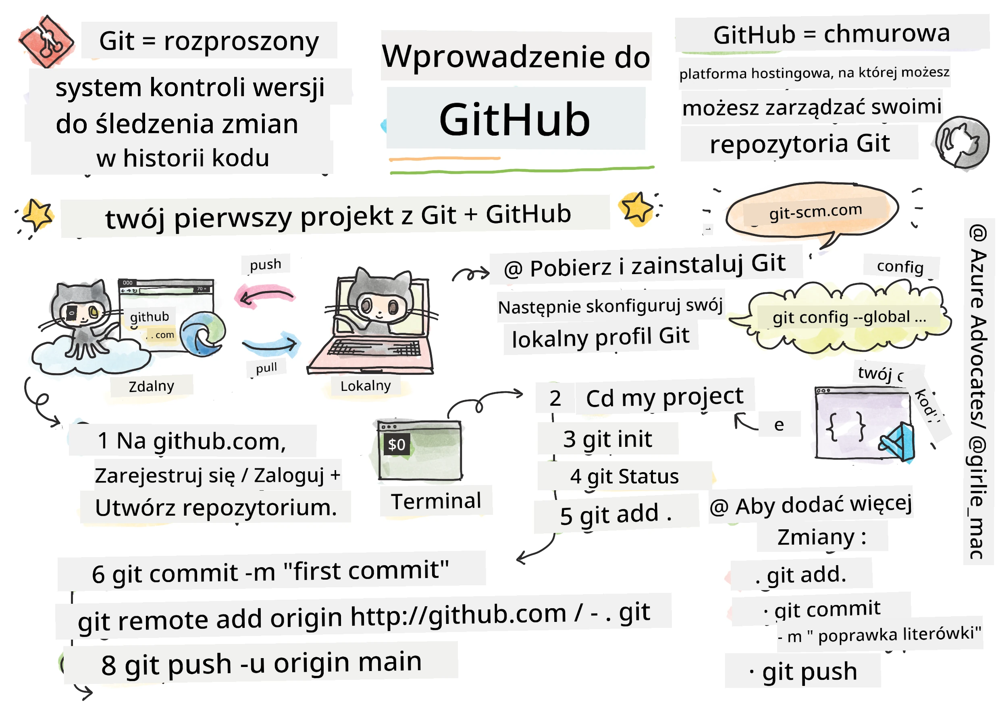
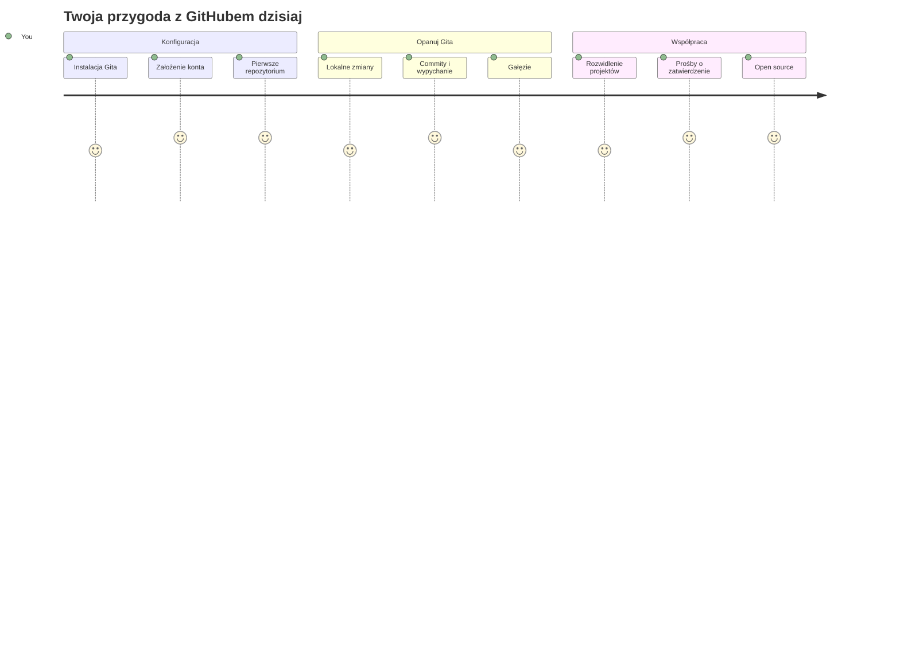
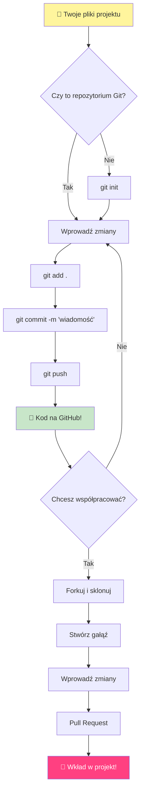
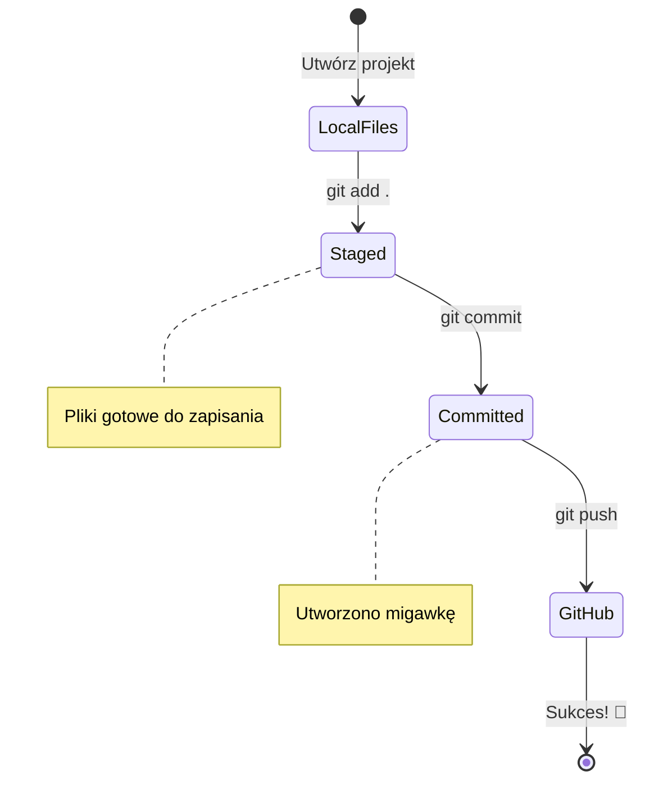
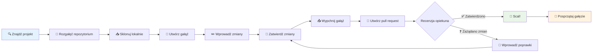
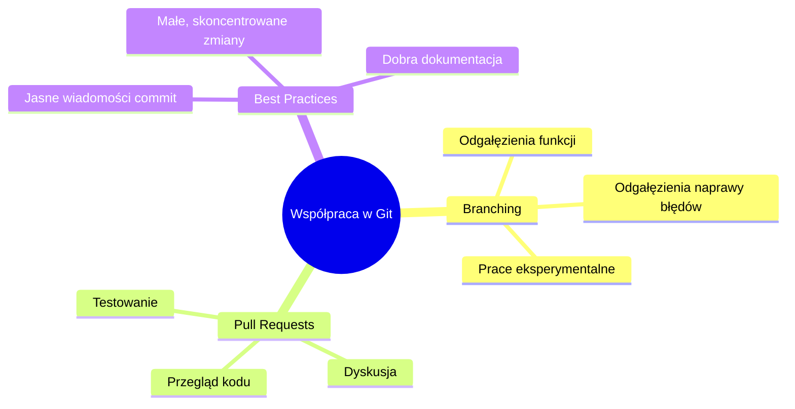
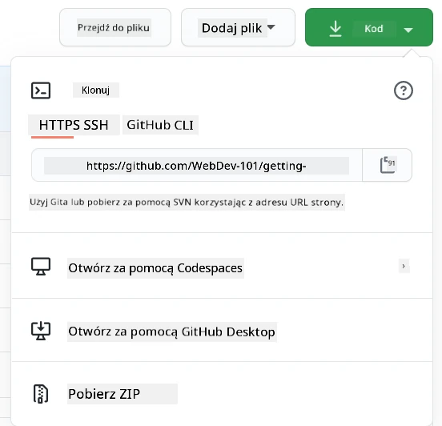
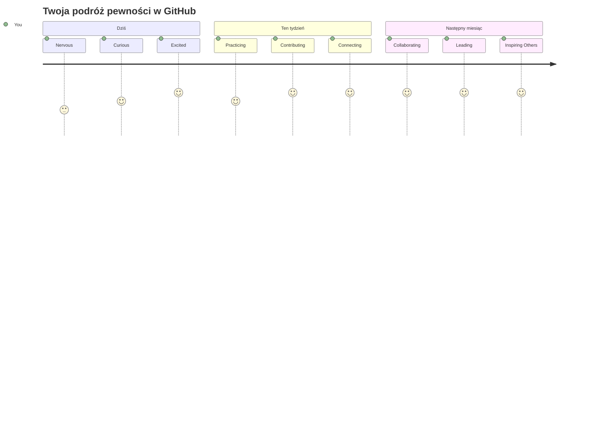

<!--
CO_OP_TRANSLATOR_METADATA:
{
  "original_hash": "5c383cc2cc23bb164b06417d1c107a44",
  "translation_date": "2026-01-06T20:02:11+00:00",
  "source_file": "1-getting-started-lessons/2-github-basics/README.md",
  "language_code": "pl"
}
-->
# Wprowadzenie do GitHub

Cześć, przyszły programisto! 👋 Gotowy dołączać do milionów kodujących na całym świecie? Naprawdę cieszę się, że mogę przedstawić Ci GitHub – pomyśl o nim jak o platformie społecznościowej dla programistów, ale zamiast zdjęć swojego lunchu, dzielimy się kodem i razem tworzymy niesamowite rzeczy!

To, co mnie absolutnie zachwyca: każda aplikacja na Twoim telefonie, każda strona internetowa, którą odwiedzasz, i większość narzędzi, które nauczysz się używać, zostały stworzone przez zespoły programistów współpracujących na platformach właśnie takich jak GitHub. Ta aplikacja muzyczna, którą kochasz? Ktoś taki jak Ty się do niej przyczynił. Ta gra, od której nie możesz się oderwać? Tak, prawdopodobnie zbudowana dzięki współpracy na GitHub. A teraz TO TY nauczysz się, jak być częścią tej niesamowitej społeczności!

Wiem, że na początku może to wydać się dużo – pamiętam, jak patrzyłem na moją pierwszą stronę GitHub i myślałem „Co to w ogóle znaczy?” Ale chodzi o to: każdy programista zaczynał dokładnie tam, gdzie Ty teraz jesteś. Pod koniec tej lekcji będziesz mieć swoje własne repozytorium GitHub (pomyśl o nim jak o swojej osobistej wystawie projektów w chmurze), a także nauczysz się, jak zapisywać swoją pracę, dzielić się nią z innymi, a nawet jak wnosić wkład do projektów używanych przez miliony ludzi.

Przejdziemy przez tę podróż razem, krok po kroku. Bez pośpiechu, bez presji – tylko Ty, ja i naprawdę fajne narzędzia, które wkrótce staną się Twoimi nowymi najlepszymi przyjaciółmi!


> Sketchnote autorstwa [Tomomi Imura](https://twitter.com/girlie_mac)


## Quiz przed wykładem
[Pre-lecture quiz](https://ff-quizzes.netlify.app)

## Wprowadzenie

Zanim zanurzymy się w naprawdę ekscytujące rzeczy, przygotujmy Twój komputer na trochę magii GitHub! Pomyśl o tym jak o uporządkowaniu swoich artystycznych przyborów przed stworzeniem dzieła sztuki – mając odpowiednie narzędzia pod ręką wszystko przebiega znacznie sprawniej i jest o wiele przyjemniejsze.

Przeprowadzę Cię osobiście przez każdy krok konfiguracji i obiecuję, że nie jest to tak przerażające, jak może wyglądać na pierwszy rzut oka. Jeśli coś nie od razu wejdzie w głowę, to zupełnie normalne! Pamiętam, kiedy konfigurowałem moje pierwsze środowisko programistyczne i czułem się, jakbym próbował odczytać starożytne hieroglify. Każdy programista był dokładnie tam, gdzie Ty teraz jesteś, zastanawiając się, czy robi to dobrze. Spoiler: jeśli tu jesteś i się uczysz, to znaczy, że robisz to dobrze! 🌟

W tej lekcji omówimy:

- śledzenie pracy, którą wykonujesz na swoim komputerze
- pracę nad projektami z innymi
- jak wnosić wkład do oprogramowania open source

### Wymagania wstępne

Przygotujmy Twój komputer na trochę magii GitHub! Nie martw się – tę konfigurację wykonujesz tylko raz, a potem będziesz gotowy na całą swoją przygodę z kodowaniem.

Dobrze, zacznijmy od podstaw! Najpierw sprawdźmy, czy Git już jest zainstalowany na Twoim komputerze. Git to coś jak bardzo sprytny asystent, który zapamiętuje każdą zmianę, jaką wprowadzasz w kodzie – o wiele lepszy niż gorączkowe wciskanie Ctrl+S co dwie sekundy (wszyscy to znamy!).

Sprawdźmy, czy Git jest już zainstalowany, wpisując w terminalu tę magiczną komendę:
`git --version`

Jeśli Git nie jest jeszcze zainstalowany, nie martw się! Po prostu przejdź do [download Git](https://git-scm.com/downloads) i pobierz go. Po instalacji musimy przedstawić Ci Git prawidłowo:

> 💡 **Pierwsza konfiguracja**: Te komendy mówią Gitowi, kim jesteś. Ta informacja zostanie dołączona do każdego Twojego commita, więc wybierz nazwę i email, które chcesz publicznie udostępniać.

```bash
git config --global user.name "your-name"
git config --global user.email "your-email"
```

Aby sprawdzić, czy Git jest już skonfigurowany, możesz wpisać:
```bash
git config --list
```

Będziesz również potrzebować konta na GitHub, edytora kodu (takiego jak Visual Studio Code) i otworzyć terminal (lub: wiersz polecenia).

Przejdź na [github.com](https://github.com/) i załóż konto, jeśli jeszcze go nie masz, albo zaloguj się i wypełnij swój profil.

💡 **Wskazówka nowoczesna**: Rozważ skonfigurowanie [kluczy SSH](https://docs.github.com/en/authentication/connecting-to-github-with-ssh) lub użycie [GitHub CLI](https://cli.github.com/) dla łatwiejszej autoryzacji bez haseł.

✅ GitHub nie jest jedynym repozytorium kodu na świecie; są też inne, ale GitHub jest najlepiej znany

### Przygotowanie

Będziesz potrzebować zarówno folderu z projektem kodu na swoim lokalnym komputerze (laptop lub PC), jak i publicznego repozytorium na GitHub, które posłuży jako przykład na to, jak wnosić wkład do projektów innych.

### Jak dbać o bezpieczeństwo swojego kodu

Porozmawiajmy na chwilę o bezpieczeństwie – ale nie martw się, nie zasypiemy Cię strasznymi rzeczami! Pomyśl o tych praktykach zabezpieczających jak o zamykaniu swojego samochodu lub domu. To proste nawyki, które stają się drugą naturą i chronią Twoją ciężką pracę.

Pokażemy Ci nowoczesne, bezpieczne metody pracy z GitHub już od samego początku. W ten sposób wyrobisz sobie dobre nawyki, które przydadzą się przez całą Twoją karierę programistyczną.

Pracując z GitHub ważne jest, aby przestrzegać najlepszych praktyk bezpieczeństwa:

| Obszar bezpieczeństwa | Najlepsza praktyka | Dlaczego to ważne |
|-----------------------|--------------------|-------------------|
| **Uwierzytelnianie** | Używaj kluczy SSH lub tokenów dostępu osobistego | Hasła są mniej bezpieczne i są stopniowo wycofywane |
| **Dwuskładnikowe uwierzytelnianie** | Włącz 2FA na swoim koncie GitHub | Dodaje dodatkową warstwę ochrony konta |
| **Bezpieczeństwo repozytorium** | Nigdy nie commituj poufnych informacji | Klucze API i hasła nie powinny nigdy być w publicznych repozytoriach |
| **Zarządzanie zależnościami** | Włącz Dependabot do aktualizacji | Utrzymuje Twoje zależności bezpieczne i aktualne |

> ⚠️ **Krytyczne przypomnienie o bezpieczeństwie**: Nigdy nie commituj kluczy API, haseł ani innych poufnych informacji do żadnego repozytorium. Używaj zmiennych środowiskowych i plików `.gitignore` do ochrony danych wrażliwych.

**Nowoczesna konfiguracja uwierzytelniania:**

```bash
# Wygeneruj klucz SSH (nowoczesny algorytm ed25519)
ssh-keygen -t ed25519 -C "your_email@example.com"

# Skonfiguruj Git do używania SSH
git remote set-url origin git@github.com:username/repository.git
```

> 💡 **Pro tip**: Klucze SSH wykluczają konieczność wielokrotnego wpisywania haseł i są bezpieczniejsze niż tradycyjne metody uwierzytelniania.

---

## Zarządzanie kodem jak profesjonalista

Dobra, TO jest moment, w którym robi się naprawdę ekscytująco! 🎉 Zaraz nauczymy się, jak śledzić i zarządzać swoim kodem tak jak profesjonaliści, a szczerze mówiąc, to jedna z moich ulubionych rzeczy do nauczania, bo naprawdę zmienia zasady gry.

Wyobraź sobie, że piszesz niesamowitą historię i chcesz śledzić każdy szkic, każdą genialną korektę i każdy moment „chwila, to jest genialne!”. Właśnie to robi Git dla Twojego kodu! To jak najbardziej niesamowity notatnik podróżujący w czasie, który zapamiętuje WSZYSTKO – każdy klawisz, każdą zmianę, każdy moment „ups, coś zepsułem”, który możesz natychmiast cofnąć.

Będę szczery – na początku może to być przytłaczające. Kiedy zaczynałem, myślałem „Czemu po prostu nie mogę zapisywać plików jak zwykle?” Ale zaufaj mi: gdy Git zacznie dla Ciebie działać (a zacznie!), będziesz miał tę chwilę olśnienia „Jak WYTRZYMAŁEM bez tego wcześniej?” To jak odkrycie, że potrafisz latać, gdy całe życie chodziłeś na piechotę!

Załóżmy, że masz lokalny folder z jakimś projektem i chcesz zacząć śledzić postępy za pomocą gita – systemu kontroli wersji. Niektórzy porównują używanie gita do pisania listu miłosnego do swojego przyszłego ja. Czytając wiadomości commitów dni, tygodni czy miesięcy później, będziesz mógł przypomnieć sobie, dlaczego podjąłeś konkretną decyzję lub „cofnąć” zmianę – pod warunkiem, że piszesz dobre wiadomości commitów.


### Zadanie: Stwórz swoje pierwsze repozytorium!

> 🎯 **Twoja misja (i super się cieszę, że to robisz!)**: Stworzymy razem Twoje pierwsze repozytorium na GitHub! Do końca tego kroku będziesz mieć swój własny mały kawałek internetu, gdzie będzie mieszkał Twój kod, a także wykonasz swój pierwszy „commit” (to taki programistyczny sposób na inteligentne zapisywanie pracy).
>
> To naprawdę wyjątkowy moment – właśnie oficjalnie dołączasz do globalnej społeczności programistów! Nadal pamiętam dreszcz emocji po stworzeniu mojego pierwszego repo i myśleniu „Wow, naprawdę to robię!”

Przejdźmy przez tę przygodę razem, krok po kroku. Nie śpiesz się z żadnym etapem – nie ma nagrody za pędzenie, a obiecuję, że każdy krok będzie miał sens. Pamiętaj, że każdy gwiazdor programowania, którego podziwiasz, kiedyś siedział dokładnie tam, gdzie Ty teraz jesteś, gotowy stworzyć swoje pierwsze repozytorium. Jakie to fajne?

> Zobacz wideo
> 
> [](https://www.youtube.com/watch?v=9R31OUPpxU4)

**Zróbmy to razem:**

1. **Stwórz swoje repozytorium na GitHub**. Wejdź na GitHub.com i znajdź ten jaskrawozielony przycisk **New** (lub znak **+** w prawym górnym rogu). Kliknij i wybierz **New repository**.

   Oto co zrobić:
   1. Nadaj repozytorium nazwę – niech będzie dla Ciebie znacząca!
   1. Dodaj opis, jeśli chcesz (ułatwia innym zrozumienie, o co chodzi w Twoim projekcie)
   1. Zdecyduj, czy chcesz, aby było publiczne (wszyscy mogą je zobaczyć) czy prywatne (tylko dla Ciebie)
   1. Polecam zaznaczyć opcję dodania pliku README – to jak pierwsza strona Twojego projektu
   1. Kliknij **Create repository** i świętuj – właśnie stworzyłeś swoje pierwsze repozytorium! 🎉

2. **Przejdź do folderu z projektem**. Teraz otwórz terminal (nie martw się, nie jest taki straszny, jak wygląda!). Musimy powiedzieć komputerowi, gdzie znajdują się Twoje pliki projektu. Wpisz tę komendę:

   ```bash
   cd [name of your folder]
   ```

   **Co tutaj robimy:**
   - Właściwie mówimy „Hej, komputer, zabierz mnie do mojego folderu z projektem”
   - To jak otwieranie wybranego folderu na pulpicie, ale robimy to za pomocą poleceń tekstowych
   - Zamień `[name of your folder]` na właściwą nazwę folderu projektu

3. **Zamień swój folder w repozytorium Git**. To tutaj dzieje się magia! Wpisz:

   ```bash
   git init
   ```

   **Co właśnie się wydarzyło (fajne rzeczy!):**
   - Git stworzył ukryty folder `.git` w Twoim projekcie – nie zobaczysz go, ale jest!
   - Twój zwykły folder jest teraz „repozytorium”, które może śledzić każdą zmianę, którą wprowadzasz
   - To jak nadanie folderowi supermocy, aby pamiętał wszystko

4. **Sprawdź, co się dzieje**. Zobaczmy, co Git myśli o Twoim projekcie teraz:

   ```bash
   git status
   ```

   **Jak rozumieć, co Git Ci mówi:**
   
   Możesz zobaczyć coś w tym stylu:

   ```output
   Changes not staged for commit:
   (use "git add <file>..." to update what will be committed)
   (use "git restore <file>..." to discard changes in working directory)

        modified:   file.txt
        modified:   file2.txt
   ```

   **Nie panikuj! Oto co to oznacza:**
   - Pliki na **czerwono** to pliki, które mają zmiany, ale jeszcze nie są gotowe do zapisania
   - Pliki na **zielono** (gdy je widzisz) są gotowe do zapisania
   - Git pomaga Ci, mówiąc dokładnie, co możesz zrobić dalej

   > 💡 **Pro tip**: Komenda `git status` jest Twoim najlepszym przyjacielem! Używaj jej za każdym razem, gdy nie wiesz, co się dzieje. To jak pytanie Git „Hej, jaka jest teraz sytuacja?”

5. **Przygotuj pliki do zapisania** (to się nazywa „staging”):

   ```bash
   git add .
   ```

   **Co właśnie zrobiliśmy:**
   - Powiedzieliśmy Gitowi „Hej, chcę dołączyć WSZYSTKIE moje pliki do następnego zapisu”
   - Kropka to jak powiedzenie „wszystko w tym folderze”
   - Teraz Twoje pliki są „przygotowane” i gotowe do następnego kroku

   **Chcesz być bardziej wybiórczy?** Możesz dodać tylko wybrane pliki:

   ```bash
   git add [file or folder name]
   ```

   **Dlaczego może chcesz tak zrobić?**
   - Czasem chcesz zapisać powiązane zmiany razem
   - Pomaga to zorganizować pracę w logiczne części
   - Ułatwia zrozumienie, co i kiedy się zmieniło

   **Zmieniłeś zdanie?** Spokojnie! Możesz cofnąć „staging” plików tak:

   ```bash
   # Cofnij zaznaczenie wszystkiego
   git reset
   
   # Cofnij zaznaczenie tylko jednego pliku
   git reset [file name]
   ```

   Nie martw się – to nie usuwa pracy, po prostu wyjmuje pliki z „gotowych do zapisu”.

6. **Zapisz swoją pracę na stałe** (tworząc pierwszy commit!):

   ```bash
   git commit -m "first commit"
   ```

   **🎉 Gratulacje! Właśnie zrobiłeś swój pierwszy commit!**
   
   **Co się właśnie wydarzyło:**
   - Git zrobił „zdjęcie” wszystkich przygotowanych plików w tym dokładnym momencie
   - Twój komunikat commit „first commit” wyjaśnia, co oznacza ten punkt zapisu
   - Git nadał temu zdjęciu unikalny identyfikator, abyś mógł je zawsze znaleźć później
   - Oficjalnie zacząłeś śledzić historię swojego projektu!

   > 💡 **Przyszłe komunikaty commit**: W kolejnych commitach bądź bardziej opisowy! Zamiast „updated stuff” spróbuj „Dodaj formularz kontaktowy na stronie głównej” lub „Napraw błąd w menu nawigacji”. Twoje przyszłe ja Ci podziękuje!

7. **Połącz swój lokalny projekt z GitHub**. Teraz Twój projekt istnieje tylko na komputerze. Połączmy go z Twoim repozytorium na GitHub, abyś mógł się nim dzielić ze światem!

   Najpierw przejdź do strony swojego repozytorium na GitHub i skopiuj URL. Potem wróć tutaj i wpisz:

   ```bash
   git remote add origin https://github.com/username/repository_name.git
   ```
   
   (Zamień ten URL na adres swojego rzeczywistego repozytorium!)

   **Co właśnie zrobiliśmy:**
   - Stworzyliśmy połączenie między Twoim lokalnym projektem a repozytorium na GitHubie
   - "Origin" to tylko przezwisko dla Twojego repozytorium na GitHubie – to jak dodanie kontaktu do telefonu
   - Teraz Twój lokalny Git wie, gdzie wysyłać Twój kod, gdy jesteś gotowy, aby go udostępnić

   💡 **Łatwiejszy sposób**: Jeśli masz zainstalowany GitHub CLI, możesz zrobić to jednym poleceniem:
   ```bash
   gh repo create my-repo --public --push --source=.
   ```

8. **Wyślij swój kod na GitHub** (wielki moment!):

   ```bash
   git push -u origin main
   ```

   **🚀 To jest to! Przesyłasz swój kod na GitHub!**
   
   **Co się dzieje:**
   - Twoje commity przenoszą się z Twojego komputera na GitHub
   - Flaga `-u` ustawia stałe połączenie, dzięki czemu przyszłe pushe są łatwiejsze
   - "main" to nazwa Twojej głównej gałęzi (jak główny folder)
   - Po tym możesz po prostu wpisać `git push` przy kolejnych wysyłkach!

   💡 **Szybka uwaga**: Jeśli Twoja gałąź nazywa się inaczej (np. "master"), użyj tej nazwy zamiast. Możesz to sprawdzić poleceniem `git branch --show-current`.

9. **Twój nowy codzienny rytm kodowania** (to właśnie staje się uzależniające!):

   Od tej pory, gdy tylko wprowadzisz zmiany w swoim projekcie, wykonujesz ten prosty taniec w trzech krokach:

   ```bash
   git add .
   git commit -m "describe what you changed"
   git push
   ```

   **To staje się Twoim rytmem pisania kodu:**
   - Wprowadź niesamowite zmiany w swoim kodzie ✨
   - Dodaj je do staging area poleceniem `git add` („Hej Git, zwróć uwagę na te zmiany!”)
   - Zapisz je poleceniem `git commit` z opisowym komunikatem (przyszły Ty Ci podziękuje!)
   - Podziel się nimi ze światem za pomocą `git push` 🚀
   - Powtarzaj – serio, to staje się tak naturalne jak oddychanie!

   Uwielbiam ten workflow, bo to jak mieć wiele punktów zapisu w grze wideo. Dokonałeś zmiany, którą lubisz? Commituj ją! Chcesz spróbować czegoś ryzykownego? Nie ma problemu – zawsze możesz wrócić do ostatniego commita, jeśli coś pójdzie nie tak!

   > 💡 **Wskazówka**: Możesz też chcieć użyć pliku `.gitignore`, aby zapobiec śledzeniu na GitHubie plików, których nie chcesz pokazywać – jak notatki, które przechowujesz w tym samym folderze, ale nie mają miejsca w publicznym repozytorium. Szablony `.gitignore` znajdziesz na [.gitignore templates](https://github.com/github/gitignore) lub możesz stworzyć własny za pomocą [gitignore.io](https://www.toptal.com/developers/gitignore).

### 🧠 **Pierwsze dodanie do repozytorium: Jak się z tym czułeś?**

**Poświęć chwilę, aby się pochwalić i pomyśleć:**
- Jak się czułeś, gdy po raz pierwszy zobaczyłeś swój kod na GitHubie?
- Który krok był najbardziej mylący, a który wyjątkowo łatwy?
- Czy potrafisz własnymi słowami wyjaśnić różnicę między `git add`, `git commit` a `git push`?


> **Pamiętaj**: Nawet doświadczeni deweloperzy czasem zapominają dokładne polecenia. Żeby ten workflow stał się pamięcią mięśniową, potrzeba praktyki – radzisz sobie świetnie!

#### Nowoczesne workflow Gita

Rozważ przyjęcie tych współczesnych praktyk:

- **Conventional Commits**: Używaj ustandaryzowanego formatu komunikatów commitów, np. `feat:`, `fix:`, `docs:` itd. Dowiedz się więcej na [conventionalcommits.org](https://www.conventionalcommits.org/)
- **Atomic commits**: Każdy commit powinien reprezentować jedną logiczną zmianę
- **Częste commity**: Commituj często z opisowymi komunikatami zamiast dużych, rzadkich commitów

#### Komunikaty commitów

Świetny temat commitów kończy następujące zdanie:
Jeśli zostanie zastosowany, ten commit <tu Twoja linijka tematu>

Temat wypowiedz w trybie rozkazującym, w czasie teraźniejszym: "change", a nie "changed" czy "changes". 
Tak samo w treści (opcjonalnej) również używaj trybu rozkazującego, czasu teraźniejszego. Treść powinna zawierać motywację zmiany oraz kontrast do poprzedniego zachowania. Wyjaśniasz **dlaczego**, a nie **jak**.

✅ Poświęć kilka minut na surfowanie po GitHubie. Czy potrafisz znaleźć naprawdę dobry komunikat commita? A może wyjątkowo minimalistyczny? Jakie informacje Twoim zdaniem są najważniejsze i najprzydatniejsze do przekazania w komunikacie commit?

## Praca z innymi (Ta zabawa!)

Trzymaj kapelusz, bo TERAZ GitHub staje się naprawdę magiczny! 🪄 Opanowałeś zarządzanie swoim własnym kodem, ale teraz zanurzamy się w moją absolutnie ulubioną część – współpracę z niesamowitymi ludźmi z całego świata.

Wyobraź sobie: budzisz się jutro i widzisz, że ktoś z Tokio ulepszył Twój kod, gdy spałeś. Potem ktoś z Berlina naprawia błąd, na którym ugrząkłeś. Po południu deweloper z São Paulo dodał funkcję, o której nawet nie pomyślałeś. To nie science fiction – to po prostu wtorek w świecie GitHuba!

Co mnie naprawdę ekscytuje, to że umiejętności współpracy, które zaraz poznasz? To DOKŁADNIE te same workflow, których używają zespoły w Google, Microsoft oraz Twoich ulubionych startupach każdego dnia. Nie uczysz się tylko fajnego narzędzia – uczysz się sekretnego języka, który sprawia, że cały świat oprogramowania działa razem.

Serio, gdy raz poczujesz radość z merge’a swojego pierwszego pull requesta, zrozumiesz, dlaczego programiści tak bardzo kochają open source. To jak bycie częścią największego, najbardziej kreatywnego zespołu na świecie!

> Zobacz film
>
> [](https://www.youtube.com/watch?v=bFCM-PC3cu8)

Głównym powodem umieszczania projektów na GitHubie była możliwość współpracy z innymi programistami.


W swoim repozytorium przejdź do `Insights > Community`, aby zobaczyć, jak Twój projekt wypada na tle zalecanych standardów społeczności.

Chcesz, aby Twoje repozytorium wyglądało profesjonalnie i zachęcająco? Wejdź do swojego repozytorium i kliknij `Insights > Community`. Ta świetna funkcja pokaże Ci, jak Twój projekt wypada w porównaniu z tym, co społeczność GitHub uznaje za „dobre praktyki repozytorium”.

> 🎯 **Spraw, by Twój projekt błyszczał**: Dobrze zorganizowane repozytorium z dobrą dokumentacją to jak czysta, przyjazna witryna sklepu. Pokazuje, że dbasz o swoją pracę i zachęca innych do współpracy!

**Oto co sprawia, że repozytorium jest super:**

| Co dodać | Dlaczego to ważne | Co to daje Tobie |
|-------------|-------------------|---------------------|
| **Opis** | Pierwsze wrażenie ma znaczenie! | Ludzie od razu wiedzą, czym jest projekt |
| **README** | Strona główna Twojego projektu | Jak przyjazny przewodnik dla nowych odwiedzających |
| **Wytyczne dotyczące współpracy** | Pokazuje, że jesteś otwarty na pomoc | Ludzie dokładnie wiedzą, jak mogą pomóc |
| **Kodeks postępowania** | Tworzy przyjazną przestrzeń | Każdy czuje się mile widziany do udziału |
| **Licencja** | Klarowność prawna | Inni wiedzą, jak mogą używać Twojego kodu |
| **Polityka bezpieczeństwa** | Pokazuje odpowiedzialność | Demonstruje profesjonalne praktyki |

> 💡 **Profesjonalna wskazówka**: GitHub oferuje szablony dla wszystkich tych plików. Przy tworzeniu nowego repozytorium zaznacz odpowiednie pola, aby automatycznie wygenerować te pliki.

**Nowoczesne funkcje GitHuba do odkrycia:**

🤖 **Automatyzacja & CI/CD:**
- **GitHub Actions** do automatycznych testów i wdrożeń
- **Dependabot** do automatycznych aktualizacji zależności

💬 **Społeczność & zarządzanie projektem:**
- **GitHub Discussions** do rozmów społecznościowych poza zgłoszeniami
- **GitHub Projects** do zarządzania projektami w stylu kanban
- **Zasady ochrony gałęzi** aby wymusić standardy jakości kodu


Wszystkie te zasoby pomogą w onboardingu nowych członków zespołu. Zwykle to właśnie te rzeczy nowe osoby sprawdzają, zanim zaczną w ogóle patrzeć na Twój kod, by dowiedzieć się, czy to miejsce dla nich.

✅ Pliki README, chociaż wymagają czasu na przygotowanie, są często zaniedbywane przez zapracowanych maintainerów. Czy potrafisz znaleźć przykład szczególnie opisowego README? Uwaga: istnieją też [narzędzia pomagające tworzyć dobre README](https://www.makeareadme.com/), które możesz chcieć wypróbować.

### Zadanie: Scal trochę kodu

Dokumentacja współpracy pomaga ludziom wnieść wkład w projekt. Wyjaśnia, jakiego rodzaju wkładów szukasz i jak działa proces. Kontrybutorzy będą musieli przejść przez szereg kroków, aby móc wnosić zmiany do Twojego repo na GitHubie:


1. **Forkowanie Twojego repo** Pewnie zechcesz, aby ludzie **forkowali** Twój projekt. Forkowanie oznacza utworzenie kopii Twojego repozytorium na ich profilu GitHub.
1. **Klonowanie**. Z tego miejsca sklonują projekt na swoim lokalnym komputerze. 
1. **Utworzenie gałęzi**. Poprosisz ich, aby utworzyli osobną **gałąź** na swoje zmiany. 
1. **Skupienie zmian na jednym obszarze**. Poproś kontrybutorów, aby skupili swoje zmiany na jednym temacie na raz – w ten sposób jest większa szansa, że uda Ci się scalić ich pracę. Wyobraź sobie, że ktoś napisał poprawkę do błędu, dodał nową funkcję i zaktualizował kilka testów – co jeśli chcesz, albo możesz, zaimplementować tylko 2 z 3 lub 1 z 3 zmian?

✅ Wyobraź sobie sytuację, w której gałęzie są szczególnie istotne do pisania i dostarczania dobrego kodu. Jakie scenariusze możesz sobie wyobrazić?

> Pamiętaj, bądź zmianą, którą chcesz zobaczyć w świecie i twórz gałęzie również dla swojej pracy. Każdy commit, który wykonasz, zostanie przypisany do gałęzi, na której aktualnie się znajdujesz. Użyj `git status`, aby zobaczyć, na której gałęzi jesteś.

Przejdźmy przez workflow kontrybutora. Załóżmy, że kontrybutor już **forkował** i **sklonował** repozytorium, więc ma gotowy repozytorium Git na swoim komputerze:

1. **Utwórz gałąź**. Użyj polecenia `git branch`, aby stworzyć gałąź, która będzie zawierać zmiany, które chce wnieść:

   ```bash
   git branch [branch-name]
   ```

   > 💡 **Nowoczesne podejście**: Możesz też stworzyć gałąź i przełączyć się na nią jednym poleceniem:
   ```bash
   git switch -c [branch-name]
   ```

1. **Przełącz się na gałąź roboczą**. Przełącz się na wybraną gałąź i zaktualizuj katalog roboczy poleceniem `git switch`:

   ```bash
   git switch [branch-name]
   ```

   > 💡 **Nowoczesna uwaga**: `git switch` jest nowoczesnym zamiennikiem dla `git checkout` przy zmianie gałęzi. Jest bardziej czytelne i bezpieczniejsze dla początkujących.

1. **Wykonuj pracę**. W tym momencie chcesz dodać swoje zmiany. Nie zapomnij poinformować o tym Gita następującymi poleceniami:

   ```bash
   git add .
   git commit -m "my changes"
   ```

   > ⚠️ **Jakość komunikatu commita**: Upewnij się, że nadajesz swojemu commitowi dobrą nazwę, zarówno dla siebie, jak i dla maintainerów repozytorium, w którym pomagasz. Bądź konkretny, co zmieniłeś!

1. **Połącz swoją pracę z gałęzią `main`**. W pewnym momencie kończysz pracę i chcesz połączyć swoją gałąź z gałęzią `main`. Gałąź `main` mogła się już zmienić, więc najpierw upewnij się, że masz ją zaktualizowaną do najnowszej wersji, wykonując następujące polecenia:

   ```bash
   git switch main
   git pull
   ```

   Na tym etapie chcesz upewnić się, że wszystkie **konflikty**, czyli sytuacje, gdy Git nie potrafi łatwo **połączyć** zmian, pojawią się w Twojej gałęzi roboczej. Dlatego uruchom poniższe polecenia:

   ```bash
   git switch [branch_name]
   git merge main
   ```

   Polecenie `git merge main` wniesie do Twojej gałęzi wszystkie zmiany z `main`. Miejmy nadzieję, że możesz po prostu kontynuować. Jeśli nie, VS Code powie Ci, gdzie Git jest **zdezorientowany** i wystarczy, że zmienisz odpowiednie pliki, wskazując, która zawartość jest prawidłowa.

   💡 **Nowoczesna alternatywa**: Rozważ użycie `git rebase` dla czystszej historii:
   ```bash
   git rebase main
   ```
   To przesuwa Twoje commity na wierzch najnowszej gałęzi main, tworząc liniową historię.

1. **Wyślij swoją pracę na GitHub**. Wysłanie pracy na GitHub oznacza dwie rzeczy. Wypchnięcie Twojej gałęzi do repozytorium i otwarcie PR, Pull Requesta.

   ```bash
   git push --set-upstream origin [branch-name]
   ```

   Powyższe polecenie tworzy gałąź na Twoim forkowanym repozytorium.

### 🤝 **Sprawdzenie umiejętności współpracy: Gotowy, by pracować z innymi?**

**Zobaczmy, jak czujesz się w kwestii współpracy:**
- Czy teraz rozumiesz, czym są forki i pull requesty?
- Jaką jedną rzecz związaną z pracą na gałęziach chcesz jeszcze poćwiczyć?
- Jak bardzo czujesz się komfortowo, wnosząc wkład do czyjegoś projektu?


> **Dodatek pewności**: Każdy deweloper, którego podziwiasz, kiedyś się stresował przed swoim pierwszym pull requestem. Społeczność GitHub jest niesamowicie otwarta na nowicjuszy!

1. **Otwórz PR**. Następnie chcesz otworzyć PR. Robisz to, przechodząc do forkowanego repozytorium na GitHubie. Zobaczysz tam wskazówkę, czy chcesz utworzyć nowy PR, kliknij to i zostaniesz przeniesiony do interfejsu, gdzie możesz zmienić tytuł commita i nadać mu lepszy opis. Teraz maintainer repozytorium, które forkowałeś, zobaczy ten PR i _trzymaj kciuki_, że doceni i _zmerguje_ Twój PR. Teraz jesteś współtwórcą, hurra :)

   💡 **Nowoczesna wskazówka**: PR-y możesz też tworzyć używając GitHub CLI:
   ```bash
   gh pr create --title "Your PR title" --body "Description of changes"
   ```

   🔧 **Dobre praktyki dla PR:**
   - Linkuj do powiązanych issue używając słów kluczowych, np. "Fixes #123"
   - Dodawaj zrzuty ekranu przy zmianach UI
   - Proś o konkretne osoby do review
   - Używaj draft PR-ów do pracy w toku
   - Upewnij się, że wszystkie CI przechodzą przed prośbą o review
1. **Sprzątanie**. Uważa się za dobrą praktykę _posprzątanie_ po pomyślnym scaleniu PR. Chcesz posprzątać zarówno swoją lokalną gałąź, jak i gałąź, którą wypchnąłeś do GitHub. Najpierw usuń ją lokalnie za pomocą następującego polecenia:

   ```bash
   git branch -d [branch-name]
   ```
  
   Upewnij się, że potem przejdziesz na stronę GitHub forka i usuniesz właśnie wypchniętą do niej zdalną gałąź.

`Pull request` wydaje się głupim określeniem, ponieważ tak naprawdę chcesz wypchnąć swoje zmiany do projektu. Ale opiekun (właściciel projektu) lub główny zespół musi rozważyć twoje zmiany przed ich scaleniem z gałęzią "main" projektu, więc faktycznie prosisz opiekuna o decyzję w sprawie zmiany.

Pull request to miejsce do porównania i dyskusji nad różnicami wprowadzonymi w gałęzi, wraz z przeglądami, komentarzami, zintegrowanymi testami i nie tylko. Dobry pull request mniej więcej podąża za tymi samymi zasadami co wiadomość commita. Możesz dodać odwołanie do zgłoszenia w trackerze problemów, gdy na przykład twoja praca rozwiązuje dane zgłoszenie. Robi się to używając `#` oraz numeru twojego zgłoszenia. Na przykład `#97`.

🤞Trzymam kciuki, aby wszystkie kontrole przeszły pomyślnie i właściciel projektu/ właściciele scalili twoje zmiany z projektem 🤞

Zaktualizuj swoją obecną lokalną gałąź roboczą o wszystkie nowe commity z odpowiadającej jej zdalnej gałęzi na GitHub:

`git pull`

## Współtworzenie Open Source (Twoja Szansa na Wywarcie Wpływu!)

Jesteś gotów na coś, co absolutnie rozwali twój umysł? 🤯 Porozmawiajmy o współtworzeniu projektów open source – aż mam gęsią skórkę na samą myśl o dzieleniu się tym z tobą!

To twoja szansa, aby stać się częścią czegoś naprawdę niezwykłego. Wyobraź sobie, że ulepszasz narzędzia, których codziennie używają miliony programistów, albo naprawiasz błąd w aplikacji, którą twoi znajomi uwielbiają. To nie tylko marzenie – to właśnie jest istota wkładu w open source!

Oto co za każdym razem mnie porusza: każde narzędzie, którego się uczyłeś – twój edytor kodu, frameworki, które poznamy, nawet przeglądarka, w której to czytasz – zaczęło się od kogoś takiego jak ty, kto dokonał swojego pierwszego wkładu. Ten genialny deweloper, który stworzył twoje ulubione rozszerzenie do VS Code? Kiedyś był początkującym klikającym „utwórz pull request” z drżącymi rękami, dokładnie tak jak ty zaraz to zrobisz.

I tutaj jest najpiękniejsze: społeczność open source to jak największe internetowe przytulenie grupowe. Większość projektów aktywnie poszukuje nowicjuszy i ma problemy oznaczone etykietą „good first issue” właśnie dla takich osób jak ty! Opiekunowie naprawdę cieszą się, widząc nowych współtwórców, bo pamiętają swoje własne pierwsze kroki.

```mermaid
flowchart TD
    A[🔍 Przeglądaj GitHub] --> B[🏷️ Znajdź "dobry pierwszy issue"]
    B --> C[📖 Przeczytaj Zasady Współpracy]
    C --> D[🍴 Wykonaj Fork Repozytorium]
    D --> E[💻 Skonfiguruj Środowisko Lokalnie]
    E --> F[🌿 Utwórz Gałąź Funkcji]
    F --> G[✨ Wnieś Swój Wkład]
    G --> H[🧪 Przetestuj Swoje Zmiany]
    H --> I[📝 Napisz Jasny Commit]
    I --> J[📤 Wypchnij i Utwórz PR]
    J --> K[💬 Zaangażuj się w Opinie]
    K --> L[🎉 Scalono! Jesteś Współpracownikiem!]
    L --> M[🌟 Znajdź Następne Issue]
    
    style A fill:#e1f5fe
    style L fill:#c8e6c9
    style M fill:#fff59d
```  
Nie uczysz się tu tylko programować – przygotowujesz się do dołączenia do globalnej rodziny twórców, którzy codziennie budzą się z myślą „Jak możemy uczynić cyfrowy świat trochę lepszym?” Witaj w klubie! 🌟

Najpierw znajdź repozytorium (**repo**) na GitHub, które cię interesuje i do którego chciałbyś wnieść zmianę. Będziesz chciał skopiować jego zawartość na swój komputer.

✅ Dobrym sposobem na znalezienie repozytoriów „przyjaznych początkującym” jest [wyszukiwanie po tagu 'good-first-issue'](https://github.blog/2020-01-22-browse-good-first-issues-to-start-contributing-to-open-source/).



Istnieje kilka sposobów na skopiowanie kodu. Jednym z nich jest „klonowanie” zawartości repozytorium za pomocą HTTPS, SSH lub wykorzystując GitHub CLI (interfejs wiersza poleceń).

Otwórz terminal i sklonuj repozytorium w ten sposób:  
```bash
# Używanie HTTPS
git clone https://github.com/ProjectURL

# Używanie SSH (wymaga konfiguracji klucza SSH)
git clone git@github.com:username/repository.git

# Używanie GitHub CLI
gh repo clone username/repository
```
  
Aby pracować nad projektem, przejdź do właściwego folderu:  
`cd ProjectURL`

Możesz także otworzyć cały projekt używając:  
- **[GitHub Codespaces](https://github.com/features/codespaces)** – Chmurowe środowisko deweloperskie GitHub z VS Code w przeglądarce  
- **[GitHub Desktop](https://desktop.github.com/)** – Graficzna aplikacja do operacji Git  
- **[GitHub.dev](https://github.dev)** – Naciśnij klawisz `.` w dowolnym repozytorium GitHub, aby otworzyć VS Code w przeglądarce  
- **VS Code** z rozszerzeniem GitHub Pull Requests

Na koniec możesz pobrać kod w formie spakowanego archiwum.

### Kilka ciekawostek o GitHub

Możesz oznaczać gwiazdką, obserwować i/lub „forkować” dowolne publiczne repozytorium na GitHub. Swoje oznaczone gwiazdką repozytoria znajdziesz w menu rozwijanym w prawym górnym rogu. To coś jak zakładki, ale dla kodu.

Projekty mają tracker problemów, głównie na GitHub w zakładce „Issues” (chyba że zaznaczono inaczej), gdzie ludzie dyskutują na temat problemów związanych z projektem. Zakładka Pull Requests służy do dyskusji i przeglądania zmian, które są w trakcie pracy.

Projekty mogą też mieć dyskusje na forach, listach mailowych albo w kanałach czatu jak Slack, Discord albo IRC.

🔧 **Nowoczesne funkcje GitHub**:  
- **GitHub Discussions** – Wbudowane forum do rozmów społeczności  
- **GitHub Sponsors** – Finansowe wsparcie dla opiekunów  
- **Zakładka Security** – Raporty o podatnościach i ostrzeżenia bezpieczeństwa  
- **Zakładka Actions** – Automatyczne workflow i potoki CI/CD  
- **Zakładka Insights** – Analizy kontrybutorów, commitów i stanu projektu  
- **Zakładka Projects** – Wbudowane narzędzia do zarządzania projektami

✅ Rozejrzyj się po nowym repozytorium GitHub i spróbuj kilku rzeczy, na przykład edytuj ustawienia, dodaj informacje do repozytorium, stwórz projekt (np. tablicę Kanban) i skonfiguruj GitHub Actions do automatyzacji. Możesz zrobić mnóstwo rzeczy!

---

## 🚀 Wyzwanie

Dobrze, czas sprawdzić twoje błyszczące nowe supermoce GitHub! 🚀 Oto wyzwanie, które sprawi, że wszystko kliknie w najbardziej satysfakcjonujący sposób:

Weź znajomego (albo członka rodziny, który ciągle pyta, czym się zajmujesz z tym "komputerowym rzeczami") i rozpocznijcie wspólną przygodę z kodowaniem! To tutaj dzieje się prawdziwa magia – utwórz projekt, pozwól mu zrobić fork, stwórzcie kilka gałęzi i scalcie zmiany, jak profesjonaliści, którymi stajecie się z każdą minutą.

Nie będę ci kłamać – pewnie będziecie się śmiać (szczególnie gdy obaj będziecie chcieli zmienić ten sam wiersz), może zdziwieni i zdezorientowani, ale na pewno będziecie mieć niesamowite momenty „aha!”, które sprawiają, że nauka się opłaca. Poza tym jest coś wyjątkowego w dzieleniu się pierwszym udanym merge'em z kimś innym – to jak małe świętowanie tego, jak daleko zaszedłeś!

Nie masz jeszcze partnera do kodowania? Nie martw się! Społeczność GitHub jest pełna niesamowicie przyjaznych ludzi, którzy pamiętają, jak to jest być nowym. Szukaj repozytoriów z etykietą "good first issue" – one mówią „Hej początkujący, przyjdźcie się uczyć z nami!” Jak to jest wspaniałe?

## Quiz po wykładzie  
[Quiz po wykładzie](https://ff-quizzes.netlify.app/web/en/)

## Przegląd i dalsza nauka

Uff! 🎉 Popatrz na siebie – właśnie opanowałeś podstawy GitHub jak prawdziwy mistrz! Jeśli twój mózg teraz trochę paruje, to całkiem normalne i szczerze mówiąc, dobry znak. Właśnie nauczyłeś się narzędzi, których ja potrzebowałem tygodni, żeby się nimi poczuć pewnie na początku.

Git i GitHub są niesamowicie potężne (serio, naprawdę potężne), a każdy programista, którego znam – nawet ci, którzy teraz wyglądają jak czarodzieje – musiał trochę poćwiczyć i potknąć się, zanim wszystko zaskoczyło. Fakt, że przeszedłeś tę lekcję oznacza, że jesteś na dobrej drodze, by opanować jedne z najważniejszych narzędzi w zestawie każdego dewelopera.

Oto doskonałe zasoby, które pomogą ci ćwiczyć i stać się jeszcze lepszym:

- [Przewodnik dotyczący współtworzenia oprogramowania open source](https://opensource.guide/how-to-contribute/#how-to-submit-a-contribution) – Twoja mapa drogowa do wywarcia wpływu  
- [ściągawka Git](https://training.github.com/downloads/github-git-cheat-sheet/) – trzymaj pod ręką do szybkiego sprawdzenia!

I pamiętaj: praktyka czyni postęp, nie perfekcję! Im więcej używasz Git i GitHub, tym bardziej wszystko staje się naturalne. GitHub stworzył też fantastyczne interaktywne kursy, dzięki którym możesz ćwiczyć w bezpiecznym środowisku:

- [Wprowadzenie do GitHub](https://github.com/skills/introduction-to-github)  
- [Komunikacja za pomocą Markdown](https://github.com/skills/communicate-using-markdown)  
- [GitHub Pages](https://github.com/skills/github-pages)  
- [Zarządzanie konfliktami scalania](https://github.com/skills/resolve-merge-conflicts)

**Czujesz się odważnie? Sprawdź te nowoczesne narzędzia:**  
- [Dokumentacja GitHub CLI](https://cli.github.com/manual/) – gdy chcesz poczuć się jak czarodziej wiersza poleceń  
- [Dokumentacja GitHub Codespaces](https://docs.github.com/en/codespaces) – programuj w chmurze!  
- [Dokumentacja GitHub Actions](https://docs.github.com/en/actions) – automatyzuj wszystko  
- [Najlepsze praktyki Git](https://www.atlassian.com/git/tutorials/comparing-workflows) – podnieś swój styl pracy na wyższy poziom

## Wyzwanie Agenta GitHub Copilot 🚀

Użyj trybu Agenta, aby wykonać następujące zadanie:

**Opis:** Stwórz wspólny projekt web developmentu, który pokaże cały proces pracy na GitHub, którego nauczyłeś się w tej lekcji. To wyzwanie pomoże ci poćwiczyć tworzenie repozytorium, funkcje współpracy oraz nowoczesne workflow Git w praktycznym scenariuszu.

**Zadanie:** Utwórz nowe publiczne repozytorium na GitHub dla prostego projektu „Zasoby do tworzenia stron www”. Repozytorium powinno zawierać dobrze zorganizowany plik README.md z listą przydatnych narzędzi i zasobów web developmentu, uporządkowanych według kategorii (HTML, CSS, JavaScript itd.). Skonfiguruj repozytorium według właściwych standardów społeczności, włączając licencję, zasady współtworzenia oraz kodeks postępowania. Utwórz przynajmniej dwie gałęzie funkcjonalne: jedną do dodania zasobów CSS, drugą do zasobów JavaScript. Dokonuj commitów w każdej gałęzi z opisowymi wiadomościami commitów, potem twórz pull requests, aby scalić zmiany z gałęzią main. Włącz funkcje GitHub takie jak Issues, Discussions oraz skonfiguruj podstawowy workflow GitHub Actions do automatycznych kontroli.

## Zadanie

Twoja misja, jeśli zdecydujesz się ją przyjąć: ukończ kurs [Introduction to GitHub](https://github.com/skills/introduction-to-github) na GitHub Skills. Ten interaktywny kurs pozwoli ci ćwiczyć wszystko, czego się nauczyłeś, w bezpiecznym, prowadzonym środowisku. A na koniec otrzymasz fajną odznakę! 🏅

**Gotów na kolejne wyzwania?**  
- Skonfiguruj uwierzytelnianie SSH dla swojego konta GitHub (żadnych więcej haseł!)  
- Spróbuj korzystać z GitHub CLI do codziennych operacji Git  
- Utwórz repozytorium z workflow GitHub Actions  
- Wypróbuj GitHub Codespaces, otwierając to samo repozytorium w edytorze chmurowym

---

## 🚀 Twój Harmonogram Mistrzostwa GitHub

### ⚡ **Co możesz zrobić w następnych 5 minutach**  
- [ ] Oznacz to repozytorium gwiazdką oraz 3 inne interesujące cię projekty  
- [ ] Włącz uwierzytelnianie dwuskładnikowe na swoim koncie GitHub  
- [ ] Stwórz prosty plik README dla swojego pierwszego repozytorium  
- [ ] Obserwuj 5 programistów, których praca cię inspiruje

### 🎯 **Co możesz osiągnąć w ciągu najbliższej godziny**  
- [ ] Ukończ quiz po lekcji i przemyśl swoją przygodę z GitHub  
- [ ] Skonfiguruj klucze SSH dla bezhasłowego uwierzytelniania GitHub  
- [ ] Zrób swój pierwszy znaczący commit z dobrą wiadomością commit  
- [ ] Przeglądaj zakładkę „Explore” GitHub, aby odkryć ciekawe projekty  
- [ ] Poćwicz robienie forka repozytorium i wprowadzenie drobnej zmiany

### 📅 **Twoja tygodniowa przygoda z GitHub**  
- [ ] Ukończ kursy GitHub Skills (Introduction to GitHub, Markdown)  
- [ ] Zrób swój pierwszy pull request do projektu open source  
- [ ] Skonfiguruj witrynę GitHub Pages do prezentacji swoich prac  
- [ ] Dołącz do dyskusji GitHub w projektach, które cię interesują  
- [ ] Stwórz repozytorium z poprawnymi standardami społeczności (README, Licencja, itd.)  
- [ ] Wypróbuj GitHub Codespaces do pracy w chmurze

### 🌟 **Twoja miesięczna metamorfoza**  
- [ ] Wnieś wkład do 3 różnych projektów open source  
- [ ] Zostań mentorem kogoś nowego na GitHub (oddaj dalej!)  
- [ ] Skonfiguruj zautomatyzowane workflow z GitHub Actions  
- [ ] Zbuduj portfolio pokazujące twoje kontrybucje na GitHub  
- [ ] Weź udział w Hacktoberfecie lub podobnych wydarzeniach społecznościowych  
- [ ] Zostań opiekunem swojego własnego projektu, do którego inni będą wprowadzać zmiany

### 🎓 **Ostateczne sprawdzenie mistrzostwa GitHub**

**Świętuj swój postęp:**  
- Co jest twoją ulubioną rzeczą w korzystaniu z GitHub?  
- Która funkcja współpracy najbardziej cię ekscytuje?  
- Jak pewnie czujesz się teraz, aby wnosić wkład do open source?  
- Jaki jest pierwszy projekt, do którego chcesz dołożyć swoją cegiełkę?


> 🌍 **Witamy w globalnej społeczności programistów!** Masz teraz narzędzia, aby współpracować z milionami programistów na całym świecie. Twój pierwszy wkład może wydawać się mały, ale pamiętaj – każdy duży projekt open source zaczynał się od czyjegoś pierwszego commita. Pytanie nie brzmi czy wywrzesz wpływ, ale który niesamowity projekt jako pierwszy skorzysta z twojej wyjątkowej perspektywy! 🚀

Pamiętaj: każdy ekspert kiedyś był początkującym. Dasz radę! 💪

---

<!-- CO-OP TRANSLATOR DISCLAIMER START -->
**Zastrzeżenie**:
Ten dokument został przetłumaczony przy użyciu automatycznej usługi tłumaczeniowej AI [Co-op Translator](https://github.com/Azure/co-op-translator). Mimo że dokładamy starań, aby tłumaczenie było jak najbardziej precyzyjne, prosimy pamiętać, że tłumaczenia automatyczne mogą zawierać błędy lub niedokładności. Oryginalny dokument w języku źródłowym powinien być uznawany za źródło autorytatywne. W przypadku istotnych informacji zalecane jest skorzystanie z profesjonalnego tłumaczenia wykonanego przez człowieka. Nie ponosimy odpowiedzialności za wszelkie nieporozumienia lub błędne interpretacje wynikające z korzystania z tego tłumaczenia.
<!-- CO-OP TRANSLATOR DISCLAIMER END -->