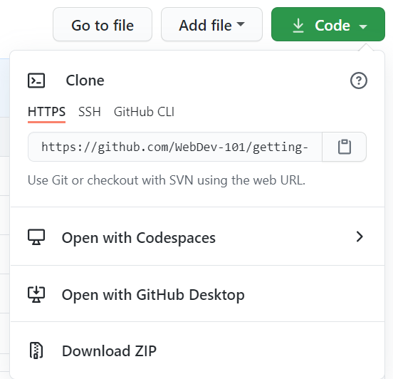

<!--
CO_OP_TRANSLATOR_METADATA:
{
  "original_hash": "ea65b75e488aa33a3cc5cb1c6c3f047a",
  "translation_date": "2025-10-03T13:55:20+00:00",
  "source_file": "1-getting-started-lessons/2-github-basics/README.md",
  "language_code": "pl"
}
-->
# Wprowadzenie do GitHub

Ta lekcja obejmuje podstawy GitHub, platformy do hostowania i zarządzania zmianami w kodzie.


> Sketchnote autorstwa [Tomomi Imura](https://twitter.com/girlie_mac)

## Quiz przed lekcją
[Quiz przed lekcją](https://ff-quizzes.netlify.app)

## Wprowadzenie

W tej lekcji omówimy:

- śledzenie pracy na Twoim komputerze
- pracę nad projektami z innymi
- jak przyczyniać się do rozwoju oprogramowania open source

### Wymagania wstępne

Przed rozpoczęciem sprawdź, czy Git jest zainstalowany. W terminalu wpisz: 
`git --version`

Jeśli Git nie jest zainstalowany, [pobierz Git](https://git-scm.com/downloads). Następnie skonfiguruj swój lokalny profil Git w terminalu:
* `git config --global user.name "twoje-imie"`
* `git config --global user.email "twoj-email"`

Aby sprawdzić, czy Git jest już skonfigurowany, możesz wpisać:
`git config --list`

Będziesz także potrzebować konta GitHub, edytora kodu (np. Visual Studio Code) oraz otwartego terminala (lub wiersza poleceń).

Przejdź na [github.com](https://github.com/) i załóż konto, jeśli jeszcze go nie masz, lub zaloguj się i uzupełnij swój profil. 

✅ GitHub nie jest jedynym repozytorium kodu na świecie; istnieją inne, ale GitHub jest najbardziej znany.

### Przygotowanie

Będziesz potrzebować zarówno folderu z projektem kodu na swoim lokalnym komputerze (laptopie lub PC), jak i publicznego repozytorium na GitHub, które posłuży jako przykład, jak przyczyniać się do projektów innych osób.  

---

## Zarządzanie kodem

Załóżmy, że masz lokalnie folder z projektem kodu i chcesz zacząć śledzić swoje postępy za pomocą git - systemu kontroli wersji. Niektórzy porównują używanie git do pisania listu miłosnego do swojego przyszłego "ja". Czytając swoje wiadomości commit po dniach, tygodniach czy miesiącach, będziesz w stanie przypomnieć sobie, dlaczego podjąłeś daną decyzję, lub "cofnąć" zmianę - pod warunkiem, że piszesz dobre wiadomości commit.

### Zadanie: Utwórz repozytorium i zatwierdź kod  

> Obejrzyj wideo
> 
> [](https://www.youtube.com/watch?v=9R31OUPpxU4)

1. **Utwórz repozytorium na GitHub**. Na GitHub.com, w zakładce repozytoriów lub z paska nawigacyjnego w prawym górnym rogu, znajdź przycisk **new repo**.

   1. Nadaj swojemu repozytorium (folderowi) nazwę.
   1. Wybierz **create repository**.

1. **Przejdź do swojego folderu roboczego**. W terminalu przejdź do folderu (znanego również jako katalog), który chcesz zacząć śledzić. Wpisz:

   ```bash
   cd [name of your folder]
   ```

1. **Zainicjalizuj repozytorium git**. W swoim projekcie wpisz:

   ```bash
   git init
   ```

1. **Sprawdź status**. Aby sprawdzić status swojego repozytorium, wpisz:

   ```bash
   git status
   ```

   wynik może wyglądać mniej więcej tak:

   ```output
   Changes not staged for commit:
   (use "git add <file>..." to update what will be committed)
   (use "git checkout -- <file>..." to discard changes in working directory)

        modified:   file.txt
        modified:   file2.txt
   ```

   Zazwyczaj polecenie `git status` informuje o takich rzeczach jak pliki gotowe do _zapisania_ w repozytorium lub zmiany, które warto utrwalić.

1. **Dodaj wszystkie pliki do śledzenia**
   To nazywa się również etapowaniem plików/dodawaniem plików do obszaru etapowania.

   ```bash
   git add .
   ```

   Argument `git add` plus `.` wskazuje, że wszystkie Twoje pliki i zmiany są gotowe do śledzenia. 

1. **Dodaj wybrane pliki do śledzenia**

   ```bash
   git add [file or folder name]
   ```

   To pozwala dodać tylko wybrane pliki do obszaru etapowania, gdy nie chcesz zatwierdzać wszystkich plików naraz.

1. **Cofnij etapowanie wszystkich plików**

   ```bash
   git reset
   ```

   To polecenie pozwala cofnąć etapowanie wszystkich plików naraz.

1. **Cofnij etapowanie konkretnego pliku**

   ```bash
   git reset [file or folder name]
   ```

   To polecenie pozwala cofnąć etapowanie tylko konkretnego pliku, którego nie chcesz uwzględniać w następnym zatwierdzeniu.

1. **Utrwal swoją pracę**. Na tym etapie dodałeś pliki do tzw. _obszaru etapowania_. Miejsca, w którym Git śledzi Twoje pliki. Aby zmiana była trwała, musisz _zatwierdzić_ pliki. Aby to zrobić, tworzysz _commit_ za pomocą polecenia `git commit`. _Commit_ reprezentuje punkt zapisu w historii Twojego repozytorium. Wpisz poniższe polecenie, aby utworzyć _commit_:

   ```bash
   git commit -m "first commit"
   ```

   To zatwierdza wszystkie Twoje pliki, dodając wiadomość "first commit". W przyszłych wiadomościach commit warto być bardziej opisowym, aby przekazać, jaki rodzaj zmiany został dokonany.

1. **Połącz lokalne repozytorium Git z GitHub**. Repozytorium Git na Twoim komputerze jest przydatne, ale w pewnym momencie będziesz chciał mieć kopię zapasową swoich plików gdzieś indziej i zaprosić innych do pracy nad swoim repozytorium. Jednym z takich miejsc jest GitHub. Pamiętaj, że już utworzyliśmy repozytorium na GitHub, więc jedyne, co musimy zrobić, to połączyć lokalne repozytorium Git z GitHub. Polecenie `git remote add` właśnie to zrobi. Wpisz poniższe polecenie:

   > Uwaga, zanim wpiszesz polecenie, przejdź na stronę swojego repozytorium GitHub, aby znaleźć URL repozytorium. Użyjesz go w poniższym poleceniu. Zastąp ```https://github.com/username/repository_name.git``` swoim URL GitHub.

   ```bash
   git remote add origin https://github.com/username/repository_name.git
   ```

   To tworzy _remote_, czyli połączenie, nazwane "origin", wskazujące na repozytorium GitHub, które utworzyłeś wcześniej.

1. **Wyślij lokalne pliki na GitHub**. Do tej pory utworzyłeś _połączenie_ między lokalnym repozytorium a repozytorium GitHub. Wyślij te pliki na GitHub za pomocą poniższego polecenia `git push`:

   > Uwaga, nazwa Twojej gałęzi może być domyślnie inna niż ```main```.

   ```bash
   git push -u origin main
   ```

   To wysyła Twoje commity w gałęzi "main" na GitHub. Ustawienie gałęzi `upstream`, w tym `-u` w poleceniu, tworzy link między lokalną gałęzią a gałęzią zdalną, dzięki czemu możesz po prostu używać git push lub git pull bez określania nazwy gałęzi w przyszłości. Git automatycznie użyje gałęzi upstream i nie będziesz musiał jawnie określać nazwy gałęzi w przyszłych poleceniach.

2. **Dodawanie kolejnych zmian**. Jeśli chcesz kontynuować wprowadzanie zmian i wysyłanie ich na GitHub, wystarczy użyć poniższych trzech poleceń:

   ```bash
   git add .
   git commit -m "type your commit message here"
   git push
   ```

   > Wskazówka, możesz również rozważyć użycie pliku `.gitignore`, aby zapobiec śledzeniu plików, których nie chcesz umieszczać na GitHub - na przykład pliku z notatkami, który przechowujesz w tym samym folderze, ale nie ma miejsca w publicznym repozytorium. Możesz znaleźć szablony plików `.gitignore` na stronie [.gitignore templates](https://github.com/github/gitignore).

#### Wiadomości commit

Świetna wiadomość commit w linii tematu powinna kończyć następujące zdanie:
Jeśli zastosowane, ten commit <Twoja linia tematu tutaj>

W temacie używaj trybu rozkazującego, czasu teraźniejszego: "zmień" zamiast "zmieniono" czy "zmienia". 
Podobnie w treści (opcjonalnej) używaj trybu rozkazującego, czasu teraźniejszego. Treść powinna zawierać motywację dla zmiany i kontrastować ją z wcześniejszym zachowaniem. Wyjaśniasz `dlaczego`, a nie `jak`.

✅ Poświęć kilka minut na przeglądanie GitHub. Czy możesz znaleźć naprawdę świetną wiadomość commit? Czy możesz znaleźć bardzo minimalistyczną? Jakie informacje uważasz za najważniejsze i najbardziej przydatne do przekazania w wiadomości commit?

### Zadanie: Współpraca

Głównym powodem umieszczania rzeczy na GitHub było umożliwienie współpracy z innymi deweloperami.

## Praca nad projektami z innymi

> Obejrzyj wideo
>
> [](https://www.youtube.com/watch?v=bFCM-PC3cu8)

W swoim repozytorium przejdź do `Insights > Community`, aby zobaczyć, jak Twój projekt wypada w porównaniu z zalecanymi standardami społeczności.

   Oto kilka rzeczy, które mogą poprawić Twoje repozytorium GitHub:
   - **Opis**. Czy dodałeś opis swojego projektu?
   - **README**. Czy dodałeś README? GitHub oferuje wskazówki dotyczące pisania [README](https://docs.github.com/articles/about-readmes/?WT.mc_id=academic-77807-sagibbon).
   - **Wytyczne dotyczące współpracy**. Czy Twój projekt ma [wytyczne dotyczące współpracy](https://docs.github.com/articles/setting-guidelines-for-repository-contributors/?WT.mc_id=academic-77807-sagibbon)?
   - **Kodeks postępowania**. [Kodeks postępowania](https://docs.github.com/articles/adding-a-code-of-conduct-to-your-project/),
   - **Licencja**. Być może najważniejsze, [licencja](https://docs.github.com/articles/adding-a-license-to-a-repository/)?


Wszystkie te zasoby będą korzystne dla onboardingu nowych członków zespołu. Są to zazwyczaj rzeczy, na które nowi współpracownicy zwracają uwagę, zanim jeszcze spojrzą na Twój kod, aby dowiedzieć się, czy Twój projekt jest odpowiednim miejscem, w którym warto spędzać czas.

✅ Pliki README, choć wymagają czasu na przygotowanie, są często zaniedbywane przez zajętych opiekunów. Czy możesz znaleźć przykład szczególnie opisowego README? Uwaga: istnieją [narzędzia pomagające tworzyć dobre README](https://www.makeareadme.com/), które możesz wypróbować.

### Zadanie: Scal kod

Dokumenty dotyczące współpracy pomagają ludziom przyczyniać się do projektu. Wyjaśniają, jakiego rodzaju wkładu szukasz i jak działa proces. Współpracownicy będą musieli przejść przez szereg kroków, aby móc przyczynić się do Twojego repozytorium na GitHub:

1. **Forkowanie Twojego repozytorium**. Prawdopodobnie będziesz chciał, aby ludzie _forkowali_ Twój projekt. Forkowanie oznacza utworzenie repliki Twojego repozytorium na ich profilu GitHub.
1. **Klonowanie**. Następnie sklonują projekt na swój lokalny komputer.
1. **Utworzenie gałęzi**. Poproś ich o utworzenie _gałęzi_ dla swojej pracy.
1. **Skupienie się na jednej zmianie**. Poproś współpracowników, aby skoncentrowali swoje zmiany na jednej rzeczy naraz - w ten sposób szanse na to, że będziesz mógł _scalić_ ich pracę, są większe. Wyobraź sobie, że naprawiają błąd, dodają nową funkcję i aktualizują kilka testów - co jeśli chcesz lub możesz zaimplementować tylko 2 z 3, lub 1 z 3 zmian?

✅ Wyobraź sobie sytuację, w której gałęzie są szczególnie istotne dla pisania i dostarczania dobrego kodu. Jakie przypadki użycia przychodzą Ci na myśl?

> Uwaga, bądź zmianą, którą chcesz zobaczyć na świecie, i twórz gałęzie dla swojej własnej pracy. Wszystkie commity, które wykonasz, będą wykonane na gałęzi, na której obecnie jesteś "zalogowany". Użyj `git status`, aby zobaczyć, na której gałęzi się znajdujesz.

Przejdźmy przez proces pracy współpracownika. Załóżmy, że współpracownik już _forkował_ i _sklonował_ repozytorium, więc ma gotowe repozytorium Git na swoim lokalnym komputerze:

1. **Utwórz gałąź**. Użyj polecenia `git branch`, aby utworzyć gałąź, która będzie zawierać zmiany, które zamierza wprowadzić:

   ```bash
   git branch [branch-name]
   ```

1. **Przełącz się na gałąź roboczą**. Przełącz się na określoną gałąź i zaktualizuj katalog roboczy za pomocą `git switch`:

   ```bash
   git switch [branch-name]
   ```

1. **Wykonaj pracę**. Na tym etapie chcesz dodać swoje zmiany. Nie zapomnij poinformować o tym Git za pomocą poniższych poleceń:

   ```bash
   git add .
   git commit -m "my changes"
   ```

   Upewnij się, że nadajesz swojemu commitowi dobrą nazwę, zarówno dla siebie, jak i dla opiekuna repozytorium, któremu pomagasz.

1. **Połącz swoją pracę z gałęzią `main`**. W pewnym momencie kończysz pracę i chcesz połączyć ją z gałęzią `main`. Gałąź `main` mogła się zmienić w międzyczasie, więc upewnij się, że najpierw ją zaktualizujesz za pomocą poniższych poleceń:

   ```bash
   git switch main
   git pull
   ```

   Na tym etapie chcesz upewnić się, że wszelkie _konflikty_, sytuacje, w których Git nie może łatwo _połączyć_ zmian, występują w Twojej gałęzi roboczej. Dlatego uruchom poniższe polecenia:

   ```bash
   git switch [branch_name]
   git merge main
   ```

   Polecenie `git merge main` wprowadzi wszystkie zmiany z `main` do Twojej gałęzi. Miejmy nadzieję, że możesz po prostu kontynuować. Jeśli nie, VS Code wskaże, gdzie Git jest _zdezorientowany_, a Ty po prostu zmienisz odpowiednie pliki, aby wskazać, która zawartość jest najbardziej dokładna.

   Aby przełączyć się na inną gałąź, użyj nowoczesnego polecenia `git switch`:
   ```bash
   git switch [branch_name]


1. **Wyślij swoją pracę na GitHub**. Wysłanie swojej pracy na GitHub oznacza dwie rzeczy. Wypchnięcie swojej gałęzi do repozytorium i otwarcie PR, Pull Request.

   ```bash
   git push --set-upstream origin [branch-name]
   ```

   Powyższe polecenie tworzy gałąź w Twoim repozytorium forkowanym.
1. **Otwórz PR**. Następnie chcesz otworzyć PR. Robisz to, przechodząc do sforkowanego repozytorium na GitHub. Zobaczysz na GitHubie wskazówkę, która pyta, czy chcesz utworzyć nowy PR. Klikasz to i zostajesz przeniesiony do interfejsu, w którym możesz zmienić tytuł wiadomości commit, nadać jej bardziej odpowiedni opis. Teraz właściciel repozytorium, które sforkowałeś, zobaczy ten PR i _trzymamy kciuki_, że doceni go i _scali_ Twój PR. Jesteś teraz współtwórcą, hurra :)

1. **Posprzątaj**. Uważa się za dobrą praktykę _posprzątanie_ po pomyślnym scaleniu PR. Chcesz posprzątać zarówno swoją lokalną gałąź, jak i gałąź, którą wypchnąłeś na GitHub. Najpierw usuń ją lokalnie za pomocą następującego polecenia:

   ```bash
   git branch -d [branch-name]
   ```

   Następnie przejdź na stronę GitHub dla sforkowanego repozytorium i usuń zdalną gałąź, którą właśnie tam wypchnąłeś.

`Pull request` wydaje się być dziwnym terminem, ponieważ tak naprawdę chcesz wypchnąć swoje zmiany do projektu. Ale właściciel projektu lub główny zespół musi rozważyć Twoje zmiany przed scaleniem ich z "główną" gałęzią projektu, więc tak naprawdę prosisz o decyzję dotyczącą zmiany od właściciela projektu.

Pull request to miejsce, w którym można porównać i omówić różnice wprowadzone w gałęzi, z recenzjami, komentarzami, zintegrowanymi testami i nie tylko. Dobry pull request przestrzega mniej więcej tych samych zasad co wiadomość commit. Możesz dodać odniesienie do problemu w trackerze problemów, na przykład gdy Twoja praca rozwiązuje jakiś problem. Robi się to za pomocą `#`, po którym następuje numer problemu. Na przykład `#97`.

🤞Trzymamy kciuki, że wszystkie testy przejdą pomyślnie i właściciel(e) projektu scalą Twoje zmiany z projektem🤞

Zaktualizuj swoją bieżącą lokalną gałąź roboczą o wszystkie nowe commity z odpowiadającej jej zdalnej gałęzi na GitHub:

`git pull`

## Jak przyczynić się do rozwoju open source

Najpierw znajdź repozytorium (lub **repo**) na GitHub, które Cię interesuje i do którego chciałbyś wprowadzić zmiany. Chcesz skopiować jego zawartość na swój komputer.

✅ Dobrym sposobem na znalezienie repozytoriów przyjaznych dla początkujących jest [wyszukiwanie według tagu 'good-first-issue'](https://github.blog/2020-01-22-browse-good-first-issues-to-start-contributing-to-open-source/).



Istnieje kilka sposobów kopiowania kodu. Jednym z nich jest "klonowanie" zawartości repozytorium za pomocą HTTPS, SSH lub GitHub CLI (Command Line Interface).

Otwórz terminal i sklonuj repozytorium w ten sposób:
`git clone https://github.com/ProjectURL`

Aby pracować nad projektem, przejdź do odpowiedniego folderu:
`cd ProjectURL`

Możesz również otworzyć cały projekt za pomocą [Codespaces](https://github.com/features/codespaces), wbudowanego edytora kodu / środowiska programistycznego w chmurze GitHub, lub [GitHub Desktop](https://desktop.github.com/).

Na koniec możesz pobrać kod w spakowanym folderze.

### Kilka ciekawych rzeczy o GitHub

Możesz oznaczyć gwiazdką, obserwować i/lub "sforkować" każde publiczne repozytorium na GitHub. Znajdziesz swoje oznaczone gwiazdką repozytoria w menu rozwijanym w prawym górnym rogu. To jak zakładki, ale dla kodu.

Projekty mają tracker problemów, najczęściej na GitHub w zakładce "Issues", chyba że wskazano inaczej, gdzie ludzie omawiają problemy związane z projektem. Zakładka Pull Requests to miejsce, gdzie ludzie omawiają i recenzują zmiany, które są w toku.

Projekty mogą również mieć dyskusje na forach, listach mailingowych lub kanałach czatu, takich jak Slack, Discord czy IRC.

✅ Rozejrzyj się po swoim nowym repozytorium na GitHub i spróbuj kilku rzeczy, takich jak edytowanie ustawień, dodawanie informacji do repozytorium i tworzenie projektu (np. tablicy Kanban). Możesz zrobić naprawdę wiele!

---

## 🚀 Wyzwanie

Połącz siły z przyjacielem, aby pracować nad kodem nawzajem. Stwórzcie wspólnie projekt, sforkujcie kod, utwórzcie gałęzie i scalcie zmiany.

## Quiz po wykładzie
[Quiz po wykładzie](https://ff-quizzes.netlify.app/web/en/)

## Przegląd i samodzielna nauka

Przeczytaj więcej o [przyczynianiu się do rozwoju oprogramowania open source](https://opensource.guide/how-to-contribute/#how-to-submit-a-contribution).

[Git cheatsheet](https://training.github.com/downloads/github-git-cheat-sheet/).

Ćwicz, ćwicz, ćwicz. GitHub oferuje świetne ścieżki edukacyjne dostępne na [skills.github.com](https://skills.github.com):

- [Pierwszy tydzień na GitHub](https://skills.github.com/#first-week-on-github)

Znajdziesz tam również bardziej zaawansowane kursy.

## Zadanie

Ukończ kurs [Pierwszy tydzień na GitHub](https://skills.github.com/#first-week-on-github)

---

**Zastrzeżenie**:  
Ten dokument został przetłumaczony za pomocą usługi tłumaczenia AI [Co-op Translator](https://github.com/Azure/co-op-translator). Chociaż dokładamy wszelkich starań, aby tłumaczenie było precyzyjne, prosimy pamiętać, że automatyczne tłumaczenia mogą zawierać błędy lub nieścisłości. Oryginalny dokument w jego języku źródłowym powinien być uznawany za autorytatywne źródło. W przypadku informacji o kluczowym znaczeniu zaleca się skorzystanie z profesjonalnego tłumaczenia przez człowieka. Nie ponosimy odpowiedzialności za jakiekolwiek nieporozumienia lub błędne interpretacje wynikające z użycia tego tłumaczenia.