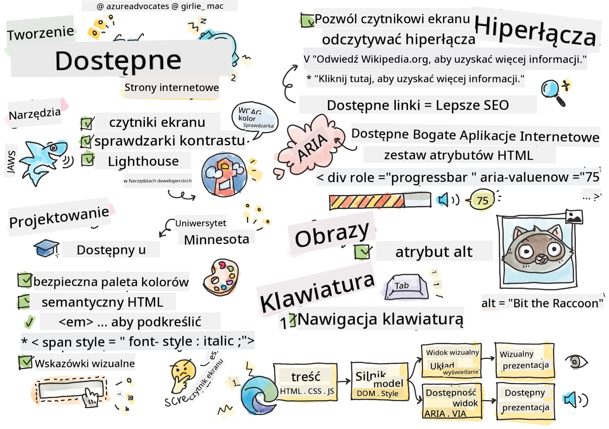

<!--
CO_OP_TRANSLATOR_METADATA:
{
  "original_hash": "f0c88c3e2cefa8952d356f802b1e47ca",
  "translation_date": "2025-08-29T16:40:42+00:00",
  "source_file": "1-getting-started-lessons/3-accessibility/README.md",
  "language_code": "pl"
}
-->
# Tworzenie Dostępnych Stron Internetowych


> Sketchnotka autorstwa [Tomomi Imura](https://twitter.com/girlie_mac)

## Quiz przed wykładem
[Quiz przed wykładem](https://ff-quizzes.netlify.app/web/)

> Siła internetu tkwi w jego uniwersalności. Dostęp dla każdego, niezależnie od niepełnosprawności, jest kluczowym aspektem.
>
> \- Sir Timothy Berners-Lee, dyrektor W3C i wynalazca World Wide Web

Ten cytat doskonale podkreśla znaczenie tworzenia dostępnych stron internetowych. Aplikacja, która nie jest dostępna dla wszystkich, z definicji wyklucza pewne grupy użytkowników. Jako twórcy stron internetowych powinniśmy zawsze mieć na uwadze dostępność. Skupiając się na tym od samego początku, będziesz na dobrej drodze, aby zapewnić dostępność tworzonych stron dla wszystkich. W tej lekcji dowiesz się, jakie narzędzia mogą pomóc w zapewnieniu dostępności zasobów internetowych oraz jak projektować z myślą o dostępności.

> Możesz przerobić tę lekcję na [Microsoft Learn](https://docs.microsoft.com/learn/modules/web-development-101/accessibility/?WT.mc_id=academic-77807-sagibbon)!

## Narzędzia do wykorzystania

### Czytniki ekranu

Jednym z najbardziej znanych narzędzi wspierających dostępność są czytniki ekranu.

[Czytniki ekranu](https://en.wikipedia.org/wiki/Screen_reader) to popularne narzędzia używane przez osoby z wadami wzroku. Tak jak dbamy o to, aby przeglądarka poprawnie wyświetlała informacje, które chcemy przekazać, musimy również upewnić się, że czytnik ekranu robi to samo.

W najprostszej formie czytnik ekranu odczytuje stronę od góry do dołu na głos. Jeśli Twoja strona składa się wyłącznie z tekstu, czytnik przekaże te informacje w sposób podobny do przeglądarki. Oczywiście strony internetowe rzadko są wyłącznie tekstowe; zawierają linki, grafiki, kolory i inne elementy wizualne. Należy zadbać o to, aby te informacje były poprawnie odczytywane przez czytnik ekranu.

Każdy twórca stron internetowych powinien zapoznać się z działaniem czytnika ekranu. Jak wspomniano wcześniej, to narzędzie, z którego będą korzystać Twoi użytkownicy. Tak jak znasz działanie przeglądarki, powinieneś poznać działanie czytnika ekranu. Na szczęście czytniki ekranu są wbudowane w większość systemów operacyjnych.

Niektóre przeglądarki mają również wbudowane narzędzia i rozszerzenia, które mogą odczytywać tekst na głos lub oferować podstawowe funkcje nawigacyjne, takie jak [te narzędzia dostępności w przeglądarce Edge](https://support.microsoft.com/help/4000734/microsoft-edge-accessibility-features). Są to również ważne narzędzia wspierające dostępność, ale działają inaczej niż czytniki ekranu i nie powinny być traktowane jako narzędzia do testowania czytników ekranu.

✅ Wypróbuj czytnik ekranu i narzędzie do odczytu tekstu w przeglądarce. W systemie Windows domyślnie dostępny jest [Narrator](https://support.microsoft.com/windows/complete-guide-to-narrator-e4397a0d-ef4f-b386-d8ae-c172f109bdb1/?WT.mc_id=academic-77807-sagibbon), a także można zainstalować [JAWS](https://webaim.org/articles/jaws/) i [NVDA](https://www.nvaccess.org/about-nvda/). W systemach macOS i iOS domyślnie zainstalowany jest [VoiceOver](https://support.apple.com/guide/voiceover/welcome/10).

### Powiększanie

Innym narzędziem często używanym przez osoby z wadami wzroku jest funkcja powiększania. Najprostszy rodzaj powiększania to powiększanie statyczne, kontrolowane za pomocą `Control + znak plus (+)` lub przez zmniejszenie rozdzielczości ekranu. Ten rodzaj powiększania powoduje zmianę rozmiaru całej strony, dlatego ważne jest stosowanie [projektowania responsywnego](https://developer.mozilla.org/docs/Learn/CSS/CSS_layout/Responsive_Design), aby zapewnić dobrą jakość użytkowania przy zwiększonych poziomach powiększenia.

Inny rodzaj powiększania opiera się na specjalistycznym oprogramowaniu, które powiększa wybrany obszar ekranu i przesuwa go, podobnie jak użycie prawdziwej lupy. W systemie Windows wbudowane jest narzędzie [Magnifier](https://support.microsoft.com/windows/use-magnifier-to-make-things-on-the-screen-easier-to-see-414948ba-8b1c-d3bd-8615-0e5e32204198), a [ZoomText](https://www.freedomscientific.com/training/zoomtext/getting-started/) to oprogramowanie zewnętrzne z większą liczbą funkcji i szerszą bazą użytkowników. Zarówno macOS, jak i iOS mają wbudowane oprogramowanie do powiększania o nazwie [Zoom](https://www.apple.com/accessibility/mac/vision/).

### Narzędzia do sprawdzania kontrastu

Kolory na stronach internetowych muszą być starannie dobrane, aby odpowiadały potrzebom osób z daltonizmem lub trudnościami w widzeniu kolorów o niskim kontraście.

✅ Przetestuj stronę internetową, którą lubisz, pod kątem użycia kolorów za pomocą rozszerzenia przeglądarki, takiego jak [narzędzie do sprawdzania kontrastu WCAG](https://microsoftedge.microsoft.com/addons/detail/wcag-color-contrast-check/idahaggnlnekelhgplklhfpchbfdmkjp?hl=en-US&WT.mc_id=academic-77807-sagibbon). Czego się dowiadujesz?

### Lighthouse

W narzędziach deweloperskich przeglądarki znajdziesz narzędzie Lighthouse. Jest ono ważne, aby uzyskać pierwszy wgląd w dostępność (oraz inne analizy) strony internetowej. Chociaż nie należy polegać wyłącznie na Lighthouse, wynik 100% jest bardzo pomocny jako punkt wyjścia.

✅ Znajdź Lighthouse w panelu narzędzi deweloperskich przeglądarki i przeprowadź analizę dowolnej strony. Co odkrywasz?

## Projektowanie z myślą o dostępności

Dostępność to stosunkowo szeroki temat. Aby Ci pomóc, dostępnych jest wiele zasobów.

- [Accessible U - University of Minnesota](https://accessibility.umn.edu/your-role/web-developers)

Chociaż nie będziemy w stanie omówić każdego aspektu tworzenia dostępnych stron, poniżej znajdziesz kilka podstawowych zasad, które warto wdrożyć. Projektowanie dostępnej strony od samego początku jest **zawsze** łatwiejsze niż wprowadzanie zmian w istniejącej stronie, aby uczynić ją dostępną.

## Dobre zasady wyświetlania

### Bezpieczne palety kolorów

Ludzie postrzegają świat na różne sposoby, w tym kolory. Wybierając schemat kolorów dla swojej strony, powinieneś upewnić się, że jest on dostępny dla wszystkich. Świetnym [narzędziem do generowania palet kolorów jest Color Safe](http://colorsafe.co/).

✅ Zidentyfikuj stronę internetową, która ma poważne problemy z użyciem kolorów. Dlaczego?

### Używaj poprawnego HTML

Dzięki CSS i JavaScript można sprawić, że dowolny element będzie wyglądał jak dowolny typ kontrolki. `<span>` może być użyty do stworzenia `<button>`, a `<b>` może stać się hiperłączem. Chociaż może to być łatwiejsze do stylizacji, nie przekazuje żadnych informacji czytnikowi ekranu. Używaj odpowiedniego HTML podczas tworzenia kontrolek na stronie. Jeśli chcesz stworzyć hiperłącze, użyj `<a>`. Używanie odpowiedniego HTML dla odpowiedniej kontrolki nazywa się stosowaniem Semantycznego HTML.

✅ Przejdź na dowolną stronę internetową i sprawdź, czy projektanci i deweloperzy używają HTML poprawnie. Czy znajdziesz przycisk, który powinien być linkiem? Wskazówka: kliknij prawym przyciskiem myszy i wybierz „Wyświetl źródło strony” w przeglądarce, aby zobaczyć kod źródłowy.

### Twórz opisową hierarchię nagłówków

Użytkownicy czytników ekranu [w dużym stopniu polegają na nagłówkach](https://webaim.org/projects/screenreadersurvey8/#finding), aby znaleźć informacje i poruszać się po stronie. Pisanie opisowych treści nagłówków i używanie semantycznych tagów nagłówków jest ważne dla stworzenia łatwej w nawigacji strony dla użytkowników czytników ekranu.

### Używaj dobrych wskazówek wizualnych

CSS oferuje pełną kontrolę nad wyglądem dowolnego elementu na stronie. Możesz tworzyć pola tekstowe bez obramowania lub hiperłącza bez podkreślenia. Niestety, usunięcie tych wskazówek może utrudnić rozpoznanie typu kontrolki osobom, które na nich polegają.

## Znaczenie tekstu linków

Hiperłącza są kluczowe dla nawigacji w internecie. Dlatego ważne jest, aby czytnik ekranu mógł poprawnie odczytać linki, co pozwala wszystkim użytkownikom nawigować po Twojej stronie.

### Czytniki ekranu i linki

Jak można się spodziewać, czytniki ekranu odczytują tekst linków w taki sam sposób, jak każdy inny tekst na stronie. Mając to na uwadze, poniższy przykład tekstu może wydawać się całkowicie akceptowalny.

> Mały pingwin, czasami nazywany wróżkowym pingwinem, jest najmniejszym pingwinem na świecie. [Kliknij tutaj](https://en.wikipedia.org/wiki/Little_penguin), aby uzyskać więcej informacji.

> Mały pingwin, czasami nazywany wróżkowym pingwinem, jest najmniejszym pingwinem na świecie. Odwiedź https://en.wikipedia.org/wiki/Little_penguin, aby uzyskać więcej informacji.

> **NOTE** Jak zaraz przeczytasz, **nigdy** nie powinieneś tworzyć linków, które wyglądają jak powyżej.

Pamiętaj, że czytniki ekranu to inny interfejs niż przeglądarki, z innym zestawem funkcji.

### Problem z używaniem URL

Czytniki ekranu odczytują tekst. Jeśli w tekście pojawi się URL, czytnik ekranu odczyta URL. Ogólnie rzecz biorąc, URL nie przekazuje znaczących informacji i może brzmieć irytująco. Możesz tego doświadczyć, jeśli Twój telefon kiedykolwiek odczytał na głos wiadomość tekstową z URL.

### Problem z „kliknij tutaj”

Czytniki ekranu mają również możliwość odczytywania tylko hiperłączy na stronie, podobnie jak osoba widząca skanuje stronę w poszukiwaniu linków. Jeśli tekst linku zawsze brzmi „kliknij tutaj”, użytkownik usłyszy tylko „kliknij tutaj, kliknij tutaj, kliknij tutaj, kliknij tutaj, kliknij tutaj, ...”. Wszystkie linki stają się nieodróżnialne od siebie.

### Dobry tekst linku

Dobry tekst linku krótko opisuje, co znajduje się po drugiej stronie linku. W powyższym przykładzie dotyczącym małych pingwinów link prowadzi do strony Wikipedii o tym gatunku. Fraza *mały pingwin* byłaby idealnym tekstem linku, ponieważ jasno wskazuje, czego można się dowiedzieć, klikając link - małych pingwinów.

> [Mały pingwin](https://en.wikipedia.org/wiki/Little_penguin), czasami nazywany wróżkowym pingwinem, jest najmniejszym pingwinem na świecie.

✅ Przeglądaj internet przez kilka minut, aby znaleźć strony, które używają niejasnych strategii linkowania. Porównaj je z innymi, lepiej zaprojektowanymi stronami. Czego się uczysz?

#### Uwagi dotyczące wyszukiwarek

Dodatkową korzyścią z zapewnienia dostępności Twojej strony dla wszystkich jest pomoc wyszukiwarkom w nawigacji po Twojej stronie. Wyszukiwarki używają tekstu linków, aby dowiedzieć się, o czym są strony. Dlatego używanie dobrego tekstu linków pomaga wszystkim!

### ARIA

Wyobraź sobie następującą stronę:

| Produkt      | Opis              | Zamów        |
| ------------ | ----------------- | ------------ |
| Widget       | [Opis](../../../../1-getting-started-lessons/3-accessibility/')       | [Zamów](../../../../1-getting-started-lessons/3-accessibility/') |
| Super widget | [Opis](../../../../1-getting-started-lessons/3-accessibility/')       | [Zamów](../../../../1-getting-started-lessons/3-accessibility/') |

W tym przykładzie powtarzanie tekstu „opis” i „zamów” ma sens dla osoby korzystającej z przeglądarki. Jednak osoba korzystająca z czytnika ekranu usłyszy jedynie słowa *opis* i *zamów* powtarzane bez kontekstu.

Aby obsłużyć takie scenariusze, HTML obsługuje zestaw atrybutów znanych jako [Accessible Rich Internet Applications (ARIA)](https://developer.mozilla.org/docs/Web/Accessibility/ARIA). Te atrybuty pozwalają na dostarczenie dodatkowych informacji czytnikom ekranu.

> **NOTE**: Podobnie jak w przypadku wielu aspektów HTML, obsługa przeglądarek i czytników ekranu może się różnić. Jednak większość głównych klientów obsługuje atrybuty ARIA.

Możesz użyć `aria-label`, aby opisać link, gdy format strony na to nie pozwala. Opis dla widgetu można ustawić jako

``` html
<a href="#" aria-label="Widget description">description</a>
```

✅ Ogólnie rzecz biorąc, używanie semantycznego HTML, jak opisano powyżej, ma pierwszeństwo przed używaniem ARIA, ale czasami nie ma semantycznego odpowiednika dla różnych widżetów HTML. Dobrym przykładem jest drzewo. Nie ma odpowiednika HTML dla drzewa, więc identyfikujesz ogólny `<div>` dla tego elementu za pomocą odpowiedniej roli i wartości ARIA. [Dokumentacja MDN na temat ARIA](https://developer.mozilla.org/docs/Web/Accessibility/ARIA) zawiera więcej przydatnych informacji.

```html
<h2 id="tree-label">File Viewer</h2>
<div role="tree" aria-labelledby="tree-label">
  <div role="treeitem" aria-expanded="false" tabindex="0">Uploads</div>
</div>
```

## Obrazy

Oczywiste jest, że czytniki ekranu nie są w stanie automatycznie odczytać, co znajduje się na obrazie. Zapewnienie dostępności obrazów nie wymaga dużego wysiłku - właśnie po to służy atrybut `alt`. Wszystkie znaczące obrazy powinny mieć `alt`, aby opisać, czym są.  
Obrazy, które są czysto dekoracyjne, powinny mieć atrybut `alt` ustawiony na pusty ciąg: `alt=""`. Zapobiega to niepotrzebnemu ogłaszaniu dekoracyjnego obrazu przez czytniki ekranu.

✅ Jak można się spodziewać, wyszukiwarki również nie są w stanie zrozumieć, co znajduje się na obrazie. One również używają tekstu alternatywnego. Tak więc, jak widać, zapewnienie dostępności strony przynosi dodatkowe korzyści!

## Klawiatura

Niektórzy użytkownicy nie są w stanie korzystać z myszy lub touchpada, polegając zamiast tego na interakcjach klawiatury, aby przechodzić od jednego elementu do drugiego. Ważne jest, aby Twoja strona internetowa prezentowała treści w logicznej kolejności, aby użytkownik klawiatury mógł uzyskać dostęp do każdego interaktywnego elementu, poruszając się w dół dokumentu. Jeśli tworzysz swoje strony internetowe z semantycznym HTML i używasz CSS do stylizacji ich układu wizualnego, Twoja strona powinna być nawigowalna za pomocą klawiatury, ale ważne jest, aby przetestować ten aspekt ręcznie. Dowiedz się więcej o [strategiach nawigacji klawiaturą](https://webaim.org/techniques/keyboard/).

✅ Przejdź na dowolną stronę internetową i spróbuj nawigować po niej, używając wyłącznie klawiatury. Co działa, a co nie? Dlaczego?

## Podsumowanie

Internet dostępny tylko dla niektórych nie jest prawdziwą „światową siecią”. Najlepszym sposobem na zapewnienie dostępności tworzonych stron jest wdrażanie najlepszych praktyk dostępności od samego początku. Chociaż wymaga to dodatkowych kroków, włączenie tych umiejętności do swojego procesu pracy już teraz sprawi, że wszystkie strony, które stworzysz, będą dostępne.

---

## 🚀 Wyzwanie

Weź ten kod HTML i przepisz go tak, aby był jak najbardziej dostępny, korzystając ze
Wiele rządów posiada przepisy dotyczące wymagań w zakresie dostępności. Zapoznaj się z przepisami dotyczącymi dostępności w swoim kraju. Co jest objęte regulacjami, a co nie? Przykładem może być [ta strona rządowa](https://accessibility.blog.gov.uk/).

## Zadanie

[Przeanalizuj niedostępną stronę internetową](assignment.md)

Źródło: [Turtle Ipsum](https://github.com/Instrument/semantic-html-sample) autorstwa Instrument

---

**Zastrzeżenie**:  
Ten dokument został przetłumaczony za pomocą usługi tłumaczenia AI [Co-op Translator](https://github.com/Azure/co-op-translator). Chociaż dokładamy wszelkich starań, aby tłumaczenie było precyzyjne, prosimy pamiętać, że automatyczne tłumaczenia mogą zawierać błędy lub nieścisłości. Oryginalny dokument w jego rodzimym języku powinien być uznawany za wiarygodne źródło. W przypadku informacji o kluczowym znaczeniu zaleca się skorzystanie z profesjonalnego tłumaczenia przez człowieka. Nie ponosimy odpowiedzialności za jakiekolwiek nieporozumienia lub błędne interpretacje wynikające z użycia tego tłumaczenia.