<!--
CO_OP_TRANSLATOR_METADATA:
{
  "original_hash": "7f2c48e04754724123ea100a822765e5",
  "translation_date": "2026-01-06T19:53:00+00:00",
  "source_file": "1-getting-started-lessons/3-accessibility/README.md",
  "language_code": "pl"
}
-->
# Tworzenie dostępnych stron internetowych

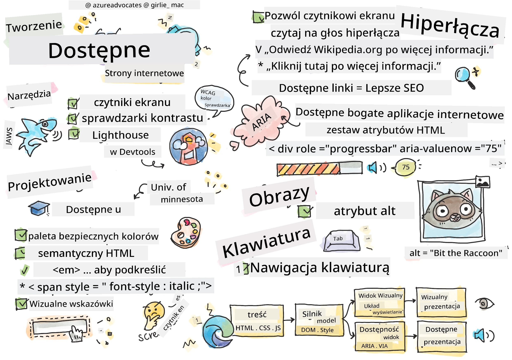
> Sketchnote autorstwa [Tomomi Imura](https://twitter.com/girlie_mac)

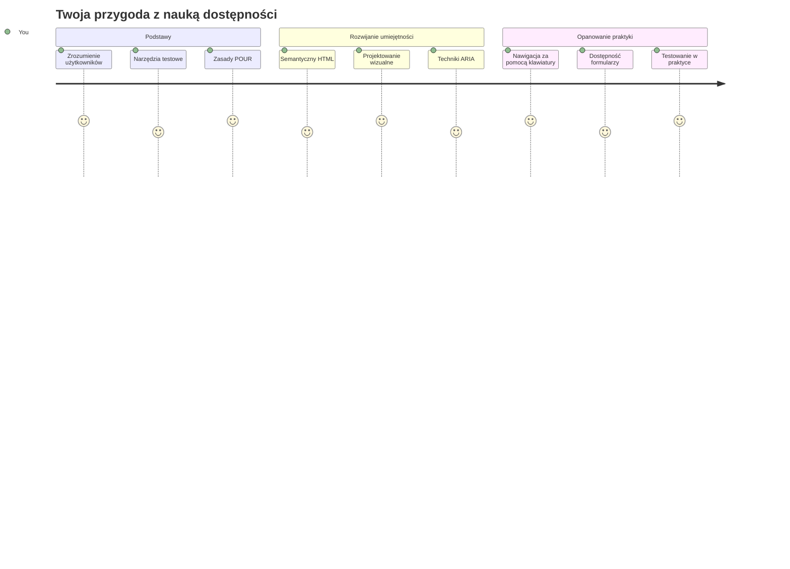
## Quiz przed wykładem
[Quiz przed wykładem](https://ff-quizzes.netlify.app/web/)

> Siła Internetu tkwi w jego uniwersalności. Dostęp dla wszystkich, bez względu na niepełnosprawność, jest kluczowym aspektem.
>
> \- Sir Timothy Berners-Lee, dyrektor W3C i wynalazca World Wide Web

Oto coś, co może Cię zaskoczyć: kiedy budujesz dostępne strony internetowe, nie tylko pomagasz osobom z niepełnosprawnościami — faktycznie sprawiasz, że internet staje się lepszy dla wszystkich!

Zauważyłeś kiedyś te obniżenia krawężników na rogach ulic? Zostały one pierwotnie zaprojektowane dla wózków inwalidzkich, ale teraz pomagają także osobom z wózkami dziecięcymi, kurierom z taczkami, podróżnym z walizkami na kółkach i rowerzystom. Tak właśnie działa dostępny design stron internetowych — rozwiązania pomagające jednej grupie często okazują się korzystne dla wszystkich. Fajne, prawda?

W tej lekcji zbadamy, jak tworzyć strony, które naprawdę działają dla wszystkich, bez względu na to, jak korzystają z internetu. Odkryjesz praktyczne techniki już zawarte w standardach sieciowych, przetestujesz narzędzia do testowania na żywo i zobaczysz, jak dostępność zwiększa użyteczność Twoich stron dla wszystkich użytkowników.

Pod koniec lekcji będziesz mieć pewność, że uczynienie dostępności naturalną częścią Twojego procesu programistycznego jest jak najbardziej możliwe. Gotowy, by odkryć, jak przemyślane decyzje projektowe mogą otworzyć internet dla miliardów użytkowników? Zaczynajmy!

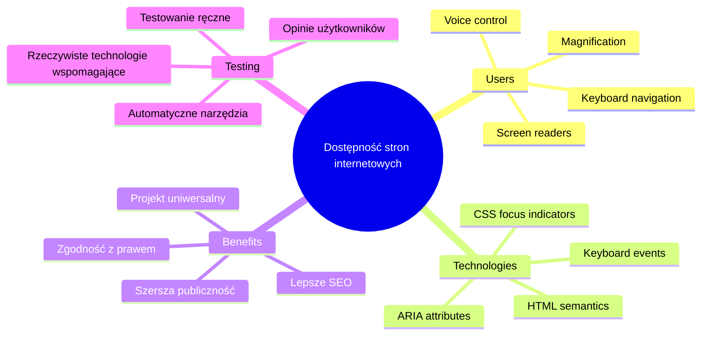
> Możesz odbyć tę lekcję na [Microsoft Learn](https://docs.microsoft.com/learn/modules/web-development-101/accessibility/?WT.mc_id=academic-77807-sagibbon)!

## Zrozumienie technologii wspomagających

Zanim przejdziemy do kodowania, poświęćmy chwilę, aby zrozumieć, jak osoby o różnych zdolnościach faktycznie doświadczają internetu. To nie jest tylko teoria — zrozumienie tych rzeczywistych wzorców nawigacji uczyni Cię znacznie lepszym programistą!

Technologie wspomagające to naprawdę niesamowite narzędzia, które pomagają osobom z niepełnosprawnościami w interakcji ze stronami internetowymi w sposób, który może Cię zaskoczyć. Kiedy poznasz, jak działają te technologie, tworzenie dostępnych doświadczeń internetowych stanie się o wiele bardziej intuicyjne. To jak nauczyć się widzieć swój kod oczami kogoś innego.

### Czytniki ekranu

[Czytniki ekranu](https://en.wikipedia.org/wiki/Screen_reader) to dość zaawansowane technologicznie narzędzia, które zamieniają cyfrowy tekst na mowę lub notatki brajlowskie. Choć głównie używają ich osoby z wadami wzroku, są także bardzo pomocne dla użytkowników z trudnościami w uczeniu się, np. dysleksją.

Lubię myśleć o czytniku ekranu jak o bardzo inteligentnym narratorze czytającym Ci książkę. Czyta treść na głos w logicznym porządku, ogłasza elementy interaktywne takie jak „przycisk” czy „link” i zapewnia skróty klawiaturowe do przeskakiwania po stronie. Ale jest jedno „ale” — czytniki ekranu mogą działać cudownie tylko wtedy, gdy budujemy strony z odpowiednią strukturą i znaczącą zawartością. I tutaj przychodzisz Ty jako programista!

**Popularne czytniki ekranu na różnych platformach:**
- **Windows**: [NVDA](https://www.nvaccess.org/about-nvda/) (darmowy i najbardziej popularny), [JAWS](https://webaim.org/articles/jaws/), [Narrator](https://support.microsoft.com/windows/complete-guide-to-narrator-e4397a0d-ef4f-b386-d8ae-c172f109bdb1/?WT.mc_id=academic-77807-sagibbon) (wbudowany)
- **macOS/iOS**: [VoiceOver](https://support.apple.com/guide/voiceover/welcome/10) (wbudowany i bardzo zaawansowany)
- **Android**: [TalkBack](https://support.google.com/accessibility/android/answer/6283677) (wbudowany)
- **Linux**: [Orca](https://wiki.gnome.org/Projects/Orca) (darmowy i open source)

**Jak czytniki ekranu nawigują po zawartości internetowej:**

Czytniki ekranu oferują wiele sposobów nawigacji, które czynią przeglądanie efektywnym dla doświadczonych użytkowników:
- **Czytanie sekwencyjne**: Czyta treść od góry do dołu, jak książkę
- **Nawigacja po punktach orientacyjnych**: Przeskoki między sekcjami strony (nagłówek, nawigacja, główny obszar, stopka)
- **Nawigacja po nagłówkach**: Przeskakiwanie między nagłówkami, by zrozumieć strukturę strony
- **Listy linków**: Generowanie listy wszystkich linków do szybkiego dostępu
- **Sterowanie formularzami**: Bezpośrednia nawigacja między polami formularza i przyciskami

> 💡 **Coś, co mnie zaskoczyło**: 68% użytkowników czytników ekranu nawigują przede wszystkim po nagłówkach ([WebAIM Survey](https://webaim.org/projects/screenreadersurvey9/#finding)). To oznacza, że Twoja struktura nagłówków to jak mapa drogowa dla użytkowników — kiedy robi się ją dobrze, dosłownie pomagasz ludziom szybciej odnaleźć to, czego szukają!

### Budowanie swojego procesu testowania

Dobra wiadomość — skuteczne testowanie dostępności nie musi być przytłaczające! Chcesz połączyć narzędzia automatyczne (świetne w wykrywaniu oczywistych problemów) z trochę testowania ręcznego. Oto systematyczne podejście, które przynosi największą skuteczność bez poświęcania całego dnia:

**Podstawowy manualny proces testowania:**

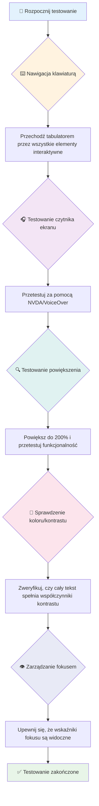
**Lista kontrolna krok po kroku:**
1. **Nawigacja klawiaturą**: Używaj wyłącznie Tab, Shift+Tab, Enter, Spacji i klawiszy strzałek
2. **Testowanie czytnikiem ekranu**: Włącz NVDA, VoiceOver lub Narratora i nawiguj z zamkniętymi oczami
3. **Testowanie powiększenia**: Testuj na poziomach 200% i 400%
4. **Weryfikacja kontrastu kolorów**: Sprawdź cały tekst i elementy UI
5. **Testowanie wskaźnika fokusa**: Upewnij się, że wszystkie elementy interaktywne mają widoczny stan fokusa

✅ **Zacznij od Lighthouse**: Otwórz narzędzia deweloperskie przeglądarki, uruchom audyt dostępności Lighthouse, a wyniki wykorzystaj, by skupić się na obszarach wymagających manualnego testowania.

### Narzędzia powiększające i zoom

Znasz to uczucie, gdy ściskasz ekran telefonu, by powiększyć tekst, bo jest zbyt mały, albo mrużysz oczy na ekran laptopa w ostrym słońcu? Wiele osób codziennie korzysta z narzędzi powiększających, aby uczynić treść czytelną. Dotyczy to osób z niskim wzrokiem, starszych dorosłych, a także tych, którzy kiedykolwiek próbowali czytać stronę na zewnątrz.

Nowoczesne technologie powiększania to coś więcej niż tylko powiększanie elementów. Zrozumienie, jak działają te narzędzia, pomoże Ci tworzyć responsywne projekty, które pozostaną funkcjonalne i estetyczne przy każdej wielkości powiększenia.

**Możliwości zoomu w nowoczesnych przeglądarkach:**
- **Zoom strony**: Skaluje całą zawartość proporcjonalnie (tekst, obrazy, układ) — to preferowana metoda
- **Zoom tylko tekstu**: Zwiększa rozmiar czcionki, zachowując oryginalny układ
- **Pinch-to-zoom**: Gest powiększania na urządzeniach mobilnych, tymczasowe powiększenie
- **Wsparcie przeglądarek**: Wszystkie nowoczesne przeglądarki obsługują zoom do 500% bez utraty funkcjonalności

**Specjalistyczne oprogramowanie powiększające:**
- **Windows**: [Lupa](https://support.microsoft.com/windows/use-magnifier-to-make-things-on-the-screen-easier-to-see-414948ba-8b1c-d3bd-8615-0e5e32204198) (wbudowana), [ZoomText](https://www.freedomscientific.com/training/zoomtext/getting-started/)
- **macOS/iOS**: [Zoom](https://www.apple.com/accessibility/mac/vision/) (wbudowany z zaawansowanymi funkcjami)

> ⚠️ **Wskazówka dot. projektowania**: WCAG wymaga, aby treść pozostała funkcjonalna przy powiększeniu do 200%. Na tym poziomie przewijanie poziome powinno być minimalne a wszystkie elementy interaktywne dostępne.

✅ **Testuj responsywność swojego projektu**: Powiększ przeglądarkę do 200% i 400%. Czy układ dostosowuje się płynnie? Czy nadal masz dostęp do wszystkich funkcji bez nadmiernego przewijania?

## Nowoczesne narzędzia do testowania dostępności

Teraz, gdy rozumiesz, jak ludzie nawigują po sieci za pomocą technologii wspomagających, przyjrzyjmy się narzędziom, które pomagają budować i testować dostępne strony.

Pomyśl o tym tak: narzędzia automatyczne świetnie wykrywają oczywiste błędy (np. brak tekstu alternatywnego), a testowanie ręczne pomaga Ci upewnić się, że serwis jest przyjemny i użyteczny w rzeczywistości. Razem dają pewność, że Twoje witryny działają dla wszystkich.

### Testowanie kontrastu kolorów

Dobra wiadomość: kontrast kolorów to jedno z najczęstszych problemów dostępności, ale też jedno z najłatwiejszych do naprawienia. Dobry kontrast sprzyja wszystkim — od osób z wadami wzroku po tych, którzy próbują czytać telefon na plaży.

**Wymagania WCAG dotyczące kontrastu:**

| Rodzaj tekstu | WCAG AA (minimum) | WCAG AAA (rozszerzone) |
|---------------|-------------------|-----------------------|
| **Tekst zwykły** (poniżej 18pt) | stosunek kontrastu 4.5:1 | stosunek kontrastu 7:1 |
| **Tekst duży** (18pt+ lub 14pt+ pogrubiony) | stosunek kontrastu 3:1 | stosunek kontrastu 4.5:1 |
| **Elementy UI** (przyciski, obramowania formularzy) | stosunek kontrastu 3:1 | stosunek kontrastu 3:1 |

**Podstawowe narzędzia do testowania:**
- [Colour Contrast Analyser](https://www.tpgi.com/color-contrast-checker/) - aplikacja desktopowa z narzędziem do wyboru kolorów
- [WebAIM Contrast Checker](https://webaim.org/resources/contrastchecker/) - narzędzie webowe z natychmiastową informacją zwrotną
- [Stark](https://www.getstark.co/) - wtyczka do narzędzi projektowych Figma, Sketch, Adobe XD
- [Accessible Colors](https://accessible-colors.com/) - narzędzie do znajdowania dostępnych palet kolorów

✅ **Buduj lepsze palety kolorów**: Zacznij od kolorów Twojej marki i użyj narzędzi do sprawdzania kontrastu, aby tworzyć dostępne warianty. Dokumentuj je jako tokeny kolorów dostępnych w systemie projektowym.

### Kompleksowe audyty dostępności

Najskuteczniejsze testowanie dostępności łączy różnorodne metody. Żadne pojedyncze narzędzie nie wychwyci wszystkiego, dlatego budowanie rutyny testowej z wieloma podejściami gwarantuje pełne pokrycie.

**Testowanie w przeglądarce (wbudowane w DevTools):**
- **Chrome/Edge**: audyt dostępności Lighthouse + panel dostępności
- **Firefox**: Inspektor dostępności z szczegółowym widokiem drzewa
- **Safari**: karta audytu w Web Inspector z symulacją VoiceOver

**Profesjonalne rozszerzenia do testów:**
- [axe DevTools](https://www.deque.com/axe/devtools/) - branżowy standard testów automatycznych
- [WAVE](https://wave.webaim.org/extension/) - wizualne wskazówki z podświetleniem błędów
- [Accessibility Insights](https://accessibilityinsights.io/) - kompleksowy zestaw narzędzi Microsoftu

**Testy wiersza poleceń i integracja CI/CD:**
- [axe-core](https://github.com/dequelabs/axe-core) - biblioteka JavaScript do testów automatycznych
- [Pa11y](https://pa11y.org/) - narzędzie do testów dostępności z linii komend
- [Lighthouse CI](https://github.com/GoogleChrome/lighthouse-ci) - automatyczne oceny dostępności

> 🎯 **Cel testowania**: Dąż do wyniku 95+ w audycie dostępności Lighthouse jako bazy wyjściowej. Pamiętaj, że narzędzia automatyczne wykrywają tylko około 30-40% problemów — testy manualne są wciąż konieczne!

### 🧠 **Sprawdzenie umiejętności testowania: Gotowy znaleźć problemy?**

**Sprawdź, jak się czujesz względem testowania dostępności:**
- Która metoda testowania wydaje się teraz najbardziej przystępna?
- Czy wyobrażasz sobie korzystanie wyłącznie z klawiatury przez cały dzień?
- Jaka jest jedna bariera dostępności, której osobiście doświadczyłeś online?

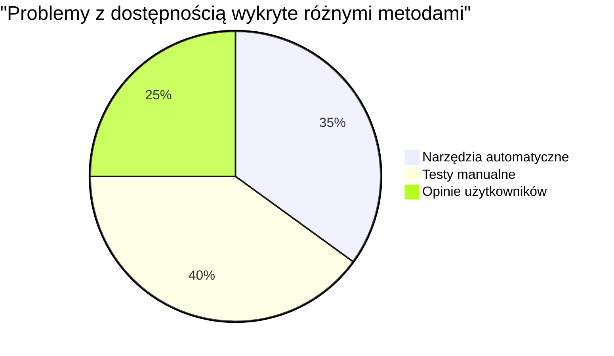
> **Zastrzyk pewności**: Profesjonalni testerzy dostępności używają dokładnie takiego zestawu metod. Uczysz się standardów branżowych!

## Budowanie dostępności od podstaw

Kluczem do sukcesu w dostępności jest wbudowanie jej w fundament od samego początku. Wiem, że kusi myśl „dodam dostępność później”, ale to tak, jakby próbować dobudować rampę do domu, który już stoi. Można? Tak. Łatwo? Niekoniecznie.

Pomyśl o dostępności jak o planowaniu domu — dużo łatwiej uwzględnić dostęp dla wózków inwalidzkich w pierwotnych planach architektonicznych niż poprawiać wszystko na późniejszym etapie.

### Zasady POUR: Twoje fundamenty dostępności

Wytyczne dotyczące dostępności treści internetowych (WCAG) opierają się na czterech podstawowych zasadach skróconych jako POUR. Nie martw się — to nie są sztywne, akademickie koncepcje! To praktyczne wytyczne, które pomagają tworzyć treści działające dla wszystkich.

Kiedy opanujesz zasady POUR, podejmowanie decyzji dotyczących dostępności będzie o wiele bardziej intuicyjne. To jak posiadanie mentalnej listy kontrolnej, która prowadzi Twoje wybory projektowe. Rozbijmy je:

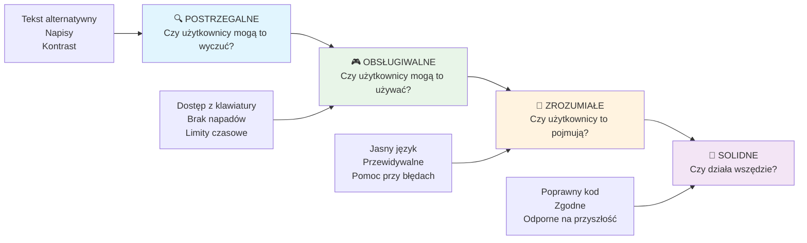
**🔍 Postrzegalne**: Informacje muszą być przedstawione w sposób dostępny dla zmysłów użytkowników

- Zapewnij tekstowe alternatywy dla treści niebędących tekstem (obrazy, wideo, audio)
- Zapewnij wystarczający kontrast kolorów dla tekstu i elementów UI
- Udostępnij napisy i transkrypcje dla treści multimedialnych
- Projektuj treści, które pozostają funkcjonalne po powiększeniu do 200%
- Używaj wielu cech sensorycznych (nie tylko koloru) do przekazywania informacji

**🎮 Obsługiwalne**: Wszystkie komponenty interfejsu muszą być obsługiwane przez dostępne metody wprowadzania danych

- Umożliwiaj dostęp do całej funkcjonalności za pomocą klawiatury
- Zapewnij użytkownikom wystarczająco dużo czasu na czytanie i interakcję
- Unikaj treści mogących wywołać napady lub zawroty głowy
- Pomagaj użytkownikom nawigować efektywnie przez klarowną strukturę i punkty orientacyjne
- Zapewnij odpowiednie rozmiary celów interaktywnych (minimum 44px)

**📖 Zrozumiałe**: Informacje i obsługa interfejsu muszą być jasne i zrozumiałe

- Używaj jasnego, prostego języka dopasowanego do odbiorców
- Zapewnij, że treść pojawia się i działa w przewidywalny, spójny sposób
- Dostarczaj wyraźne instrukcje i komunikaty o błędach przy wprowadzaniu danych
- Pomagaj użytkownikom zrozumieć i poprawić błędy w formularzach
- Organizuj treści z logicznym porządkiem czytania i hierarchią informacji

**💪 Solidne**: Treści muszą działać niezawodnie na różnych technologiach i urządzeniach wspomagających

- **Używaj poprawnego, semantycznego HTML jako podstawy**
- **Zapewnij kompatybilność z obecnymi i przyszłymi technologiami wspomagającymi**
- **Stosuj standardy sieciowe i najlepsze praktyki dotyczące znaczników**
- **Testuj na różnych przeglądarkach, urządzeniach i narzędziach wspomagających**
- **Strukturyzuj treść tak, aby degradacja przebiegała łagodnie, gdy zaawansowane funkcje nie są obsługiwane**

### 🎯 **Sprawdzenie zasad POUR: Utrwalanie wiedzy**

**Szybka refleksja na temat fundamentów:**
- Czy potrafisz wymyślić funkcję strony internetowej, która nie spełnia którejkolwiek z zasad POUR?
- Która zasada wydaje Ci się najbardziej naturalna jako programiście?
- Jak te zasady mogą poprawić projektowanie dla wszystkich, nie tylko dla użytkowników z niepełnosprawnościami?

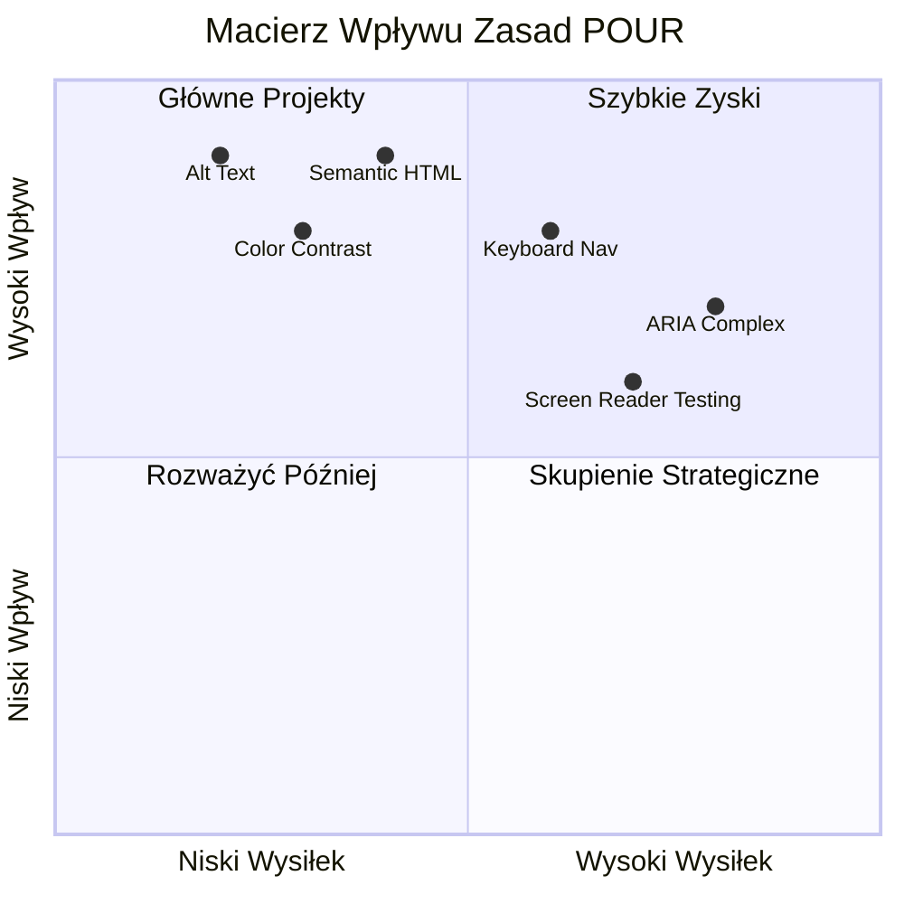
> **Pamiętaj**: Zacznij od usprawnień o dużym wpływie i niskim nakładzie pracy. Semantyczny HTML i tekst alternatywny dają największy wzrost dostępności przy najmniejszym wysiłku!

## Tworzenie dostępnego designu wizualnego

Dobry design wizualny i dostępność idą w parze. Projektując z myślą o dostępności, często odkrywasz, że takie ograniczenia prowadzą do czystszych, bardziej eleganckich rozwiązań korzystnych dla wszystkich użytkowników.

Przyjrzyjmy się, jak tworzyć atrakcyjne wizualnie projekty, które sprawdzają się dla wszystkich, niezależnie od ich zdolności wzrokowych czy warunków przeglądania treści.

### Strategie dotyczące koloru i dostępności wizualnej

Kolor jest potężnym narzędziem komunikacji, ale nie powinien być jedynym sposobem przekazywania ważnych informacji. Projektowanie ponadkolorowe tworzy bardziej trwałe, inkluzywne doświadczenia działające w większej liczbie sytuacji.

**Projektuj z uwzględnieniem różnic w percepcji kolorów:**

Około 8% mężczyzn i 0,5% kobiet ma jakąś formę różnicy w widzeniu kolorów (często nazywanej „daltonizmem”). Najczęstsze typy to:
- **Deuteranopia**: trudności z rozróżnianiem czerwonego i zielonego
- **Protanopia**: czerwony wydaje się przygaszony
- **Tritanopia**: trudności z rozróżnianiem niebieskiego i żółtego (rzadkie)

**Inkluzywne strategie kolorystyczne:**

```css
/* ❌ Bad: Using only color to indicate status */
.error { color: red; }
.success { color: green; }

/* ✅ Good: Color plus icons and context */
.error {
  color: #d32f2f;
  border-left: 4px solid #d32f2f;
}
.error::before {
  content: "⚠️";
  margin-right: 8px;
}

.success {
  color: #2e7d32;
  border-left: 4px solid #2e7d32;
}
.success::before {
  content: "✅";
  margin-right: 8px;
}
```

**Poza podstawowymi wymaganiami kontrastu:**
- Testuj dobór kolorów za pomocą symulatorów daltonizmu
- Używaj wzorów, tekstur lub kształtów obok kodowania kolorystycznego
- Zapewnij, że stany interaktywne pozostają rozróżnialne bez koloru
- Rozważ, jak Twój projekt wygląda w trybie wysokiego kontrastu

✅ **Przetestuj dostępność kolorów**: Korzystaj z narzędzi takich jak [Coblis](https://www.color-blindness.com/coblis-color-blindness-simulator/), aby zobaczyć, jak Twoja strona wygląda dla użytkowników z różnymi rodzajami różnicy widzenia kolorów.

### Wskaźniki fokusu i projektowanie interakcji

Wskaźniki fokusu to cyfrowy odpowiednik kursora — pokazują użytkownikom klawiatury, gdzie się znajdują na stronie. Dobrze zaprojektowane wskaźniki fokusu poprawiają doświadczenie wszystkich, czyniąc interakcje jasnymi i przewidywalnymi.

**Nowoczesne najlepsze praktyki wskaźników fokusu:**

```css
/* Enhanced focus styles that work across browsers */
button:focus-visible {
  outline: 2px solid #0066cc;
  outline-offset: 2px;
  box-shadow: 0 0 0 4px rgba(0, 102, 204, 0.25);
}

/* Remove focus outline for mouse users, preserve for keyboard users */
button:focus:not(:focus-visible) {
  outline: none;
}

/* Focus-within for complex components */
.card:focus-within {
  box-shadow: 0 0 0 3px rgba(74, 144, 164, 0.5);
  border-color: #4A90A4;
}

/* Ensure focus indicators meet contrast requirements */
.custom-focus:focus-visible {
  outline: 3px solid #ffffff;
  outline-offset: 2px;
  box-shadow: 0 0 0 6px #000000;
}
```

**Wymagania dotyczące wskaźników fokusu:**
- **Widoczność**: co najmniej 3:1 kontrast względem otoczenia
- **Szerokość**: minimalna grubość 2px dookoła całego elementu
- **Trwałość**: powinien pozostać widoczny do momentu zmiany fokusu
- **Rozróżnialność**: musi wizualnie różnić się od innych stanów UI

> 💡 **Wskazówka projektowa**: Świetne wskaźniki fokusu często korzystają z kombinacji obrysu, cienia pudełka i zmiany koloru, aby zapewnić widoczność na różnych tłach i w różnych kontekstach.

✅ **Przeprowadź audyt wskaźników fokusu**: Przechodź tabulatorem przez swoją stronę i zanotuj, które elementy mają wyraźne wskaźniki fokusu. Czy któryś jest trudny do zauważenia lub w ogóle go brak?

### Semantyczny HTML: fundament dostępności

Semantyczny HTML to jak podarowanie technologiom wspomagającym systemu GPS na Twojej stronie. Używając odpowiednich elementów HTML w ich zamierzonym celu, dostarczasz czytnikom ekranu, klawiaturom i innym narzędziom szczegółowej mapy ułatwiającej sprawną nawigację.

Oto analogia, która bardzo mi utkwiła: semantyczny HTML to różnica między dobrze zorganizowaną biblioteką z wyraźnymi kategoriami i pomocnymi znakami a magazynem, gdzie książki są porozrzucane losowo. Oba miejsca mają te same książki, ale w którym łatwiej byłoby Ci coś znaleźć? Dokładnie!

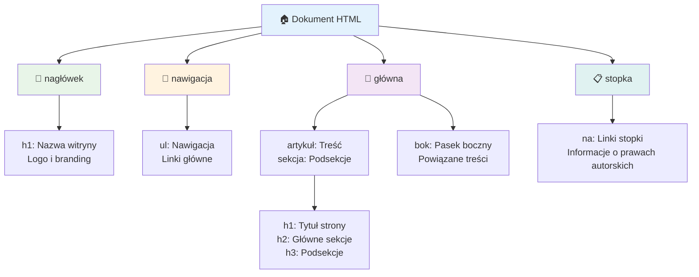
**Budulec struktury dostępnej strony:**

```html
<!-- Landmark elements provide page navigation structure -->
<header>
  <h1>Your Site Name</h1>
  <nav aria-label="Main navigation">
    <ul>
      <li><a href="/home">Home</a></li>
      <li><a href="/about">About</a></li>
      <li><a href="/services">Services</a></li>
    </ul>
  </nav>
</header>

<main>
  <article>
    <header>
      <h1>Article Title</h1>
      <p>Published on <time datetime="2024-10-14">October 14, 2024</time></p>
    </header>
    
    <section>
      <h2>First Section</h2>
      <p>Content that relates to this section...</p>
    </section>
    
    <section>
      <h2>Second Section</h2>
      <p>More related content...</p>
    </section>
  </article>
  
  <aside>
    <h2>Related Links</h2>
    <nav aria-label="Related articles">
      <ul>
        <li><a href="/related-1">First related article</a></li>
        <li><a href="/related-2">Second related article</a></li>
      </ul>
    </nav>
  </aside>
</main>

<footer>
  <p>&copy; 2024 Your Site Name. All rights reserved.</p>
  <nav aria-label="Footer links">
    <ul>
      <li><a href="/privacy">Privacy Policy</a></li>
      <li><a href="/contact">Contact Us</a></li>
    </ul>
  </nav>
</footer>
```

**Dlaczego semantyczny HTML zmienia dostępność:**

| Element semantyczny | Przeznaczenie | Korzyść dla czytnika ekranu |
|---------------------|---------------|-----------------------------|
| `<header>` | Nagłówek strony lub sekcji | „Banner landmark” – szybka nawigacja na górę |
| `<nav>` | Linki nawigacyjne | „Navigation landmark” – lista sekcji nawigacji |
| `<main>` | Główna zawartość strony | „Main landmark” – pomijanie bezpośrednio do treści |
| `<article>` | Zawartość samodzielna | Informuje o granicach artykułu |
| `<section>` | Tematyczne grupy treści | Zapewnia strukturę zawartości |
| `<aside>` | Powiązana zawartość boczna | „Complementary landmark” |
| `<footer>` | Stopka strony lub sekcji | „Contentinfo landmark” |

**Supermoce czytników ekranu z semantycznym HTML:**
- **Nawigacja po punktach orientacyjnych**: skakanie natychmiast między głównymi sekcjami strony
- **Zarysy nagłówków**: generowanie spisu treści według struktury nagłówków
- **Listy elementów**: tworzenie list wszystkich linków, przycisków lub kontrolek formularza
- **Świadomość kontekstu**: zrozumienie relacji między sekcjami treści

> 🎯 **Szybki test**: Spróbuj nawigować po swojej stronie za pomocą czytnika ekranu używając skrótów do punktów orientacyjnych (D dla landmark, H dla nagłówka, K dla linku w NVDA/JAWS). Czy nawigacja jest jasna?

### 🏗️ **Sprawdzenie mistrzostwa semantycznego HTML: budowanie solidnych fundamentów**

**Oceń swoje rozumienie semantyki:**
- Czy potrafisz zidentyfikować punkty orientacyjne na stronie tylko na podstawie HTML?
- Jak wyjaśniłbyś znajomemu różnicę między `<section>` a `<div>`?
- Co byłoby pierwszą rzeczą, którą sprawdziłbyś, gdyby użytkownik czytnika ekranu zgłosił problemy z nawigacją?

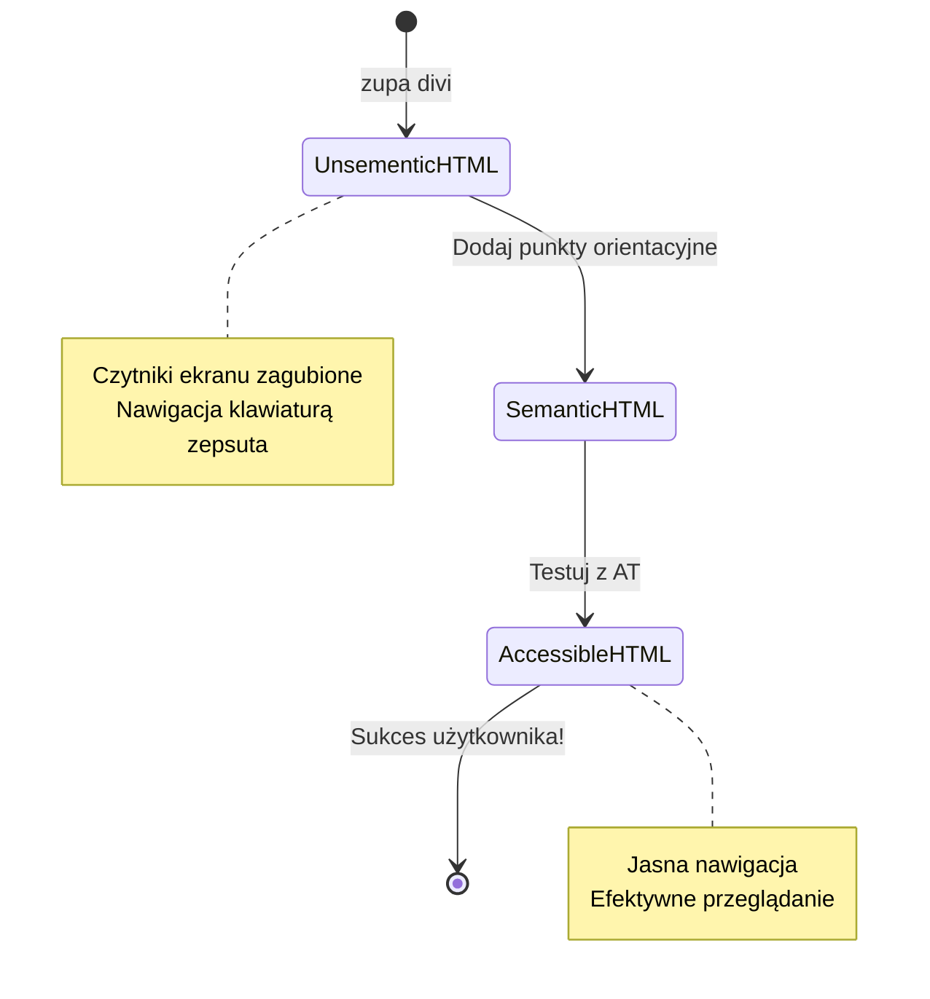
> **Profesjonalna wskazówka**: Dobry semantyczny HTML rozwiązuje około 70% problemów z dostępnością automatycznie. Opanuj ten fundament, a jesteś na dobrej drodze!

✅ **Przeprowadź audyt struktury semantycznej**: Skorzystaj z panelu Accessibility w narzędziach deweloperskich przeglądarki, aby zobaczyć drzewo dostępności i upewnić się, że Twój markup tworzy logiczną strukturę.

### Hierarchia nagłówków: tworzenie logicznego zarysu treści

Nagłówki są absolutnie kluczowe dla dostępnej treści — są jak kręgosłup, który wszystko trzyma razem. Użytkownicy czytników ekranu mocno polegają na nagłówkach, aby zrozumieć i nawigować po Twojej zawartości. To jak zapewnienie spisu treści na stronie.

**Złota zasada nagłówków:**
Nigdy nie pomijaj poziomów. Zawsze przechodź logicznie z `<h1>` do `<h2>`, następnie do `<h3>` i tak dalej. Pamiętasz robienie konspektów w szkole? To dokładnie ta sama zasada — nie wskoczysz z „I. Główna myśl” od razu do „C. Pod-podpunkt” bez „A. Podpunkt” pośrednio, prawda?

**Przykład idealnej struktury nagłówków:**

```html
<!-- ✅ Excellent: Logical, hierarchical progression -->
<main>
  <h1>Complete Guide to Web Accessibility</h1>
  
  <section>
    <h2>Understanding Screen Readers</h2>
    <p>Introduction to screen reader technology...</p>
    
    <h3>Popular Screen Reader Software</h3>
    <p>NVDA, JAWS, and VoiceOver comparison...</p>
    
    <h3>Testing with Screen Readers</h3>
    <p>Step-by-step testing instructions...</p>
  </section>
  
  <section>
    <h2>Color and Contrast Guidelines</h2>
    <p>Designing with sufficient contrast...</p>
    
    <h3>WCAG Contrast Requirements</h3>
    <p>Understanding the different contrast levels...</p>
    
    <h3>Testing Tools and Techniques</h3>
    <p>Tools for verifying contrast ratios...</p>
  </section>
</main>
```

```html
<!-- ❌ Problematic: Skipping levels, inconsistent structure -->
<h1>Page Title</h1>
<h3>Subsection</h3> <!-- Skipped h2 -->
<h2>This should come before h3</h2>
<h1>Another main heading?</h1> <!-- Multiple h1s -->
```

**Najlepsze praktyki dotyczące nagłówków:**
- **Jeden `<h1>` na stronę**: zazwyczaj główny tytuł strony lub główny nagłówek treści
- **Logiczny postęp**: nigdy nie pomijaj poziomów (h1 → h2 → h3, nie h1 → h3)
- **Opisowa treść**: nagłówki powinny mieć sens, gdy są czytane bez kontekstu
- **Stylizacja wizualna przez CSS**: wygląd realizuj przez CSS, poziomy HTML dla struktury

**Statystyki nawigacji czytników ekranu:**
- 68% użytkowników czytników nawigują za pomocą nagłówków ([WebAIM Survey](https://webaim.org/projects/screenreadersurvey9/#finding))
- Użytkownicy oczekują logicznego spisu nagłówków
- Nagłówki dają najszybszy sposób zrozumienia struktury strony

> 💡 **Profesjonalna wskazówka**: Używaj rozszerzeń przeglądarki takich jak "HeadingsMap" do wizualizacji struktury nagłówków. Powinno to czytać się jak dobrze zorganizowany spis treści.

✅ **Przetestuj strukturę nagłówków**: Skorzystaj z nawigacji po nagłówkach czytnika ekranu (klawisz H w NVDA) i przeskakuj po nagłówkach. Czy postęp mówi logiczną historię Twojej zawartości?

### Zaawansowane techniki dostępności wizualnej

Poza podstawami kontrastu i koloru istnieją zaawansowane techniki, które pomagają tworzyć naprawdę inkluzywne wizualne doświadczenia. Metody te zapewniają, że Twoja zawartość działa w różnych warunkach wyświetlania i z różnymi technologiami wspomagającymi.

**Podstawowe strategie komunikacji wizualnej:**

- **Multimodalne informacje zwrotne**: łącz wizualne, tekstowe i czasem dźwiękowe sygnały
- **Stopniowe ujawnianie**: prezentowanie informacji w przyswajalnych porcjach
- **Spójne wzorce interakcji**: stosuj znane konwencje UI
- **Responsywna typografia**: odpowiednie skalowanie tekstu na różnych urządzeniach
- **Stany ładowania i błędu**: zapewnij jasny feedback dla wszystkich działań użytkownika

**Narzędzia CSS do zwiększenia dostępności:**

```css
/* Screen reader only text - visually hidden but accessible */
.sr-only {
  position: absolute;
  width: 1px;
  height: 1px;
  padding: 0;
  margin: -1px;
  overflow: hidden;
  clip: rect(0, 0, 0, 0);
  white-space: nowrap;
  border: 0;
}

/* Skip link for keyboard navigation */
.skip-link {
  position: absolute;
  top: -40px;
  left: 6px;
  background: #000000;
  color: #ffffff;
  padding: 8px 16px;
  text-decoration: none;
  border-radius: 4px;
  font-weight: bold;
  transition: top 0.3s ease;
  z-index: 1000;
}

.skip-link:focus {
  top: 6px;
}

/* Reduced motion respect */
@media (prefers-reduced-motion: reduce) {
  .skip-link {
    transition: none;
  }
  
  * {
    animation-duration: 0.01ms !important;
    animation-iteration-count: 1 !important;
    transition-duration: 0.01ms !important;
  }
}

/* High contrast mode support */
@media (prefers-contrast: high) {
  .button {
    border: 2px solid;
  }
}
```

> 🎯 **Wzorzec dostępności**: „skip link” jest niezbędny dla użytkowników klawiatury. Powinien być pierwszym elementem fokusowalnym na stronie i od razu przenosić do głównej treści.

✅ **Wprowadź pomijanie nawigacji**: Dodaj linki pomijające do swoich stron i przetestuj je naciskając Tab zaraz po załadowaniu strony. Powinny się pojawić i pozwolić na skok do głównej treści.

## Pisanie znaczącego tekstu linków

Linki są w zasadzie autostradami internetu, ale źle napisany tekst linku to jak znaki drogowe mówiące tylko „Miejsce” zamiast „Centrum Chicago”. Niewiele to pomaga, prawda?

Coś, co mnie zaskoczyło, gdy się tego nauczyłem: czytniki ekranu mogą wyciągnąć wszystkie linki ze strony i pokazać je jako jedną dużą listę. Wyobraź sobie, że ktoś daje Ci katalog wszystkich linków na Twojej stronie. Czy każdy z nich miałby sens samodzielnie? Tego testu powinien przejść Twój tekst linku!

### Zrozumienie wzorców nawigacji linków

Czytniki ekranu oferują potężne funkcje nawigacji po linkach oparte na dobrze napisanym tekście linku:

**Metody nawigacji po linkach:**
- **Czytanie sekwencyjne**: linki czytane są w kontekście wraz z zawartością
- **Generowanie listy linków**: wszystkie linki strony skompilowane w przeszukiwalny katalog
- **Szybka nawigacja**: skoki między linkami za pomocą skrótów klawiaturowych (K w NVDA)
- **Funkcja wyszukiwania**: znajdź konkretne linki po częściowym tekście

**Dlaczego kontekst ma znaczenie:**
Gdy użytkownicy czytnika generują listę linków, widzą coś takiego:
- „Pobierz raport”
- „Dowiedz się więcej”
- „Kliknij tutaj”
- „Polityka prywatności”
- „Kliknij tutaj”

Tylko dwa z tych linków dostarczają użytecznej informacji, gdy są czytane poza kontekstem!

> 📊 **Wpływ na użytkownika**: Użytkownicy czytników skanują listy linków, aby szybko zrozumieć zawartość strony. Ogólnikowy tekst linku zmusza ich do powrotu do kontekstu każdego linku, znacznie spowalniając przeglądanie.

### Najczęstsze błędy w tekstach linków do unikania

Zrozumienie, co nie działa, pomaga rozpoznać i naprawić problemy z dostępnością w istniejących treściach.

**❌ Ogólny tekst linku pozbawiony kontekstu:**

```html
<!-- Meaningless when read from a link list -->
<p>Our sustainability efforts are detailed in our recent report. 
   <a href="/sustainability-2024.pdf">Click here</a> to view it.</p>

<!-- Repeated generic text throughout the page -->
<div class="article-card">
  <h3>Web Accessibility Guide</h3>
  <p>Learn the fundamentals...</p>
  <a href="/accessibility-guide">Read more</a>
</div>
<div class="article-card">
  <h3>Color Contrast Tips</h3>
  <p>Improve your design...</p>
  <a href="/color-contrast">Read more</a>
</div>

<!-- URLs as link text (difficult for screen readers to announce) -->
<p>Visit https://www.w3.org/WAI/WCAG21/quickref/ for WCAG guidelines.</p>

<!-- Vague action words -->
<a href="/contact">Go</a> | <a href="/about">See</a> | <a href="/help">View</a>
```

**Dlaczego te wzorce zawodzą:**
- **„Kliknij tutaj”** nic nie mówi o celu linku
- **„Czytaj więcej”** powtarzane wielokrotnie wprowadza zamieszanie
- **Surowe adresy URL** są trudne do wymawiania przez czytniki ekranu
- **Pojedyncze słowa** jak „Idź” lub „Zobacz” brakuje im opisowego kontekstu

### Pisanie doskonałego tekstu linków

Opisowy tekst linków przynosi korzyści wszystkim — użytkownicy widzący mogą szybko zeskanować linki, a użytkownicy czytników od razu rozumieją cel odnośnika.

**✅ Przykłady jasnego, opisowego tekstu linków:**

```html
<!-- Descriptive text that explains the destination -->
<p>Our comprehensive <a href="/sustainability-2024.pdf">2024 sustainability report (PDF, 2.1MB)</a> details our environmental initiatives.</p>

<!-- Specific, unique link text for each card -->
<div class="article-card">
  <h3>Web Accessibility Guide</h3>
  <p>Learn the fundamentals of inclusive design...</p>
  <a href="/accessibility-guide">Read our complete web accessibility guide</a>
</div>
<div class="article-card">
  <h3>Color Contrast Tips</h3>
  <p>Improve your design with better color choices...</p>
  <a href="/color-contrast">Explore color contrast best practices</a>
</div>

<!-- Meaningful text instead of raw URLs -->
<p>The <a href="https://www.w3.org/WAI/WCAG21/quickref/">WCAG 2.1 Quick Reference guide</a> provides comprehensive accessibility guidelines.</p>

<!-- Descriptive action links -->
<a href="/contact">Contact our support team</a> | 
<a href="/about">About our company</a> | 
<a href="/help">Get help with your account</a>
```

**Najlepsze praktyki w tekstach linków:**
- **Bądź konkretny**: „Pobierz kwartalny raport finansowy” zamiast „Pobierz”
- **Podawaj typ i rozmiar pliku**: „(PDF, 1,2MB)” dla plików do pobrania
- **Informuj, gdy link otwiera się na zewnątrz**: „(otwiera się w nowym oknie)” jeśli to stosowne
- **Używaj aktywnego języka**: „Skontaktuj się z nami” zamiast „Strona kontaktowa”
- **Bądź zwięzły**: staraj się stosować 2-8 słów, jeśli to możliwe

### Zaawansowane wzorce dostępności linków

Czasem ograniczenia wizualne lub wymagania techniczne potrzebują specjalnych rozwiązań. Oto zaawansowane techniki dla trudnych scenariuszy:

**Używanie ARIA dla lepszego kontekstu:**

```html
<!-- When button text must be short but needs more context -->
<a href="/report.pdf" 
   aria-label="Download 2024 annual financial report, PDF format, 2.3MB">
  Download Report
</a>

<!-- When the full context comes from surrounding content -->
<h3 id="sustainability-heading">Sustainability Initiative</h3>
<p>Our efforts to reduce environmental impact...</p>
<a href="/sustainability-details" 
   aria-labelledby="sustainability-heading"
   aria-describedby="sustainability-summary">
  Learn more
</a>
<p id="sustainability-summary">Detailed breakdown of our 2024 environmental goals and achievements</p>
```

**Wskazywanie typów plików i zewnętrznych celów:**

```html
<!-- Method 1: Include information in visible link text -->
<a href="/annual-report.pdf">
  Download our 2024 annual report (PDF, 2.3MB)
</a>

<!-- Method 2: Use screen reader-only text for file details -->
<a href="/annual-report.pdf">
  Download our 2024 annual report
  <span class="sr-only">(PDF format, 2.3MB)</span>
</a>

<!-- Method 3: External link indication -->
<a href="https://example.com" 
   target="_blank" 
   aria-describedby="external-link-warning">
  Visit external resource
</a>
<span id="external-link-warning" class="sr-only">
  (opens in new window)
</span>

<!-- Method 4: Using CSS for visual indicators -->
<a href="https://example.com" class="external-link">
  External resource
</a>
```

```css
/* Visual indicator for external links */
.external-link::after {
  content: " ↗";
  font-size: 0.8em;
  color: #666;
}

/* Screen reader announcement for external links */
.external-link::before {
  content: "External link: ";
  position: absolute;
  left: -10000px;
  width: 1px;
  height: 1px;
  overflow: hidden;
}
```

> ⚠️ **Ważne**: Gdy używasz `target="_blank"`, zawsze informuj użytkowników, że link otwiera się w nowym oknie lub karcie. Niespodziewane zmiany nawigacji mogą dezorientować.

✅ **Sprawdź kontekst swoich linków**: Użyj narzędzi deweloperskich przeglądarki, aby wygenerować listę wszystkich linków na stronie. Czy rozumiesz cel każdego linku bez otaczającego kontekstu?

## ARIA: wspomaganie dostępności HTML

[ARIA (Accessible Rich Internet Applications)](https://developer.mozilla.org/docs/Web/Accessibility/ARIA) to jak uniwersalny tłumacz między Twoimi złożonymi aplikacjami webowymi a technologiami wspomagającymi. Gdy sam HTML nie daje rady wyrazić wszystkiego, co robią Twoje interaktywne komponenty, ARIA wypełnia te luki.

Lubię myśleć o ARIA jak o dodawaniu pomocnych adnotacji do HTML — coś jak didaskalia w scenariuszu, które pomagają aktorom zrozumieć ich rolę i relacje.

**Najważniejsza zasada dotycząca ARIA**: Zawsze najpierw stosuj semantyczny HTML, potem ARIA, aby go wzbogacić. Traktuj ARIA jak przyprawę, a nie główne danie. Powinna wyjaśniać i wzmacniać strukturę HTML, nigdy jej nie zastępować. Najpierw opanuj fundament!

### Strategiczne wdrażanie ARIA

ARIA jest potężna, ale z mocą wiąże się odpowiedzialność. Nieprawidłowe użycie ARIA może pogorszyć dostępność bardziej niż jej brak. Oto kiedy i jak stosować efektywnie:

**✅ Używaj ARIA, gdy:**
- Tworzysz niestandardowe interaktywne widżety (akordeony, zakładki, karuzele)
- Budujesz dynamiczną zawartość zmieniającą się bez przeładowania strony
- Dostarczasz dodatkowy kontekst dla złożonych relacji UI
- Wskazujesz stany ładowania lub aktualizacje treści na żywo
- Tworzysz interfejsy przypominające aplikacje z niestandardowymi kontrolkami

**❌ Unikaj ARIA, gdy:**
- Standardowe elementy HTML już zapewniają potrzebną semantykę
- Nie masz pewności, jak ją poprawnie wdrożyć
- Powielasz informacje już podane przez semantyczny HTML
- Nie testowałeś z rzeczywistymi technologiami wspomagającymi

> 🎯 **Złota zasada ARIA**: „Nie zmieniaj semantyki, chyba że to absolutnie konieczne, zawsze zapewniaj dostępność klawiaturową i testuj z rzeczywistą technologią wspomagającą.”
**Pięć kategorii ARIA:**

1. **Role**: Czym jest ten element? (`button`, `tab`, `dialog`)
2. **Właściwości**: Jakie ma cechy? (`aria-required`, `aria-haspopup`)
3. **Stany**: Jaki jest jego aktualny stan? (`aria-expanded`, `aria-checked`)
4. **Punkty orientacyjne**: Gdzie znajduje się w strukturze strony? (`banner`, `navigation`, `main`)
5. **Reguły na żywo**: Jak powinny być ogłaszane zmiany? (`aria-live`, `aria-atomic`)

### Podstawowe wzorce ARIA dla nowoczesnych aplikacji webowych

Te wzorce rozwiązują najczęstsze wyzwania związane z dostępnością w interaktywnych aplikacjach internetowych:

**Nazewnictwo i opisywanie elementów:**

```html
<!-- aria-label: Provides accessible name when visible text isn't sufficient -->
<button aria-label="Close newsletter subscription dialog">×</button>

<!-- aria-labelledby: References existing text as the accessible name -->
<section aria-labelledby="news-heading">
  <h2 id="news-heading">Latest News</h2>
  <!-- news content -->
</section>

<!-- aria-describedby: Links to additional descriptive text -->
<input type="password" 
       aria-describedby="pwd-requirements pwd-strength"
       required>
<div id="pwd-requirements">
  Password must contain at least 8 characters, including uppercase, lowercase, and numbers.
</div>
<div id="pwd-strength" aria-live="polite">
  <!-- Dynamic password strength indicator -->
</div>
```

**Regiony na żywo dla dynamicznej zawartości:**

```html
<!-- Polite announcements (don't interrupt current speech) -->
<div aria-live="polite" id="status-updates">
  <!-- Status messages appear here -->
</div>

<!-- Assertive announcements (interrupt and announce immediately) -->
<div aria-live="assertive" id="urgent-alerts">
  <!-- Error messages and critical alerts -->
</div>

<!-- Loading states with live regions -->
<button id="submit-btn" aria-describedby="loading-status">
  Submit Application
</button>
<div id="loading-status" aria-live="polite" aria-atomic="true">
  <!-- "Processing your application..." appears here -->
</div>
```

**Przykład interaktywnego widgetu (akordeon):**

```html
<div class="accordion">
  <h3>
    <button aria-expanded="false" 
            aria-controls="panel-1" 
            id="accordion-trigger-1"
            class="accordion-trigger">
      Accessibility Guidelines
    </button>
  </h3>
  <div id="panel-1" 
       role="region"
       aria-labelledby="accordion-trigger-1" 
       hidden>
    <p>WCAG 2.1 provides comprehensive guidelines...</p>
  </div>
</div>
```

```javascript
// JavaScript do zarządzania stanem akordeonu
function toggleAccordion(trigger) {
  const panel = document.getElementById(trigger.getAttribute('aria-controls'));
  const isExpanded = trigger.getAttribute('aria-expanded') === 'true';
  
  // Przełącz stany
  trigger.setAttribute('aria-expanded', !isExpanded);
  panel.hidden = isExpanded;
  
  // Ogłoś zmianę czytnikom ekranu
  const status = document.getElementById('status-updates');
  status.textContent = isExpanded ? 'Section collapsed' : 'Section expanded';
}
```

### Najlepsze praktyki implementacji ARIA

ARIA jest potężne, ale wymaga starannej implementacji. Przestrzeganie tych wytycznych pomaga upewnić się, że ARIA wspiera, a nie utrudnia dostępność:

**🛡️ Podstawowe zasady:**

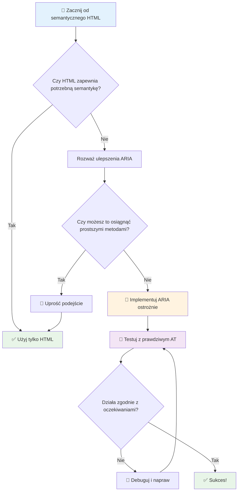
1. **Najpierw semantyczny HTML**: Zawsze preferuj `<button>` zamiast `<div role="button">`
2. **Nie łam semantyki**: Nigdy nie nadpisuj istniejącego znaczenia HTML (unikaj `<h1 role="button">`)
3. **Utrzymuj dostępność klawiatury**: Wszystkie interaktywne elementy ARIA muszą być w pełni dostępne z klawiatury
4. **Testuj z prawdziwymi użytkownikami**: Wsparcie ARIA znacznie różni się w zależności od technologii asystujących
5. **Zacznij od prostoty**: Złożone implementacje ARIA częściej zawierają błędy

**🔍 Proces testowania:**

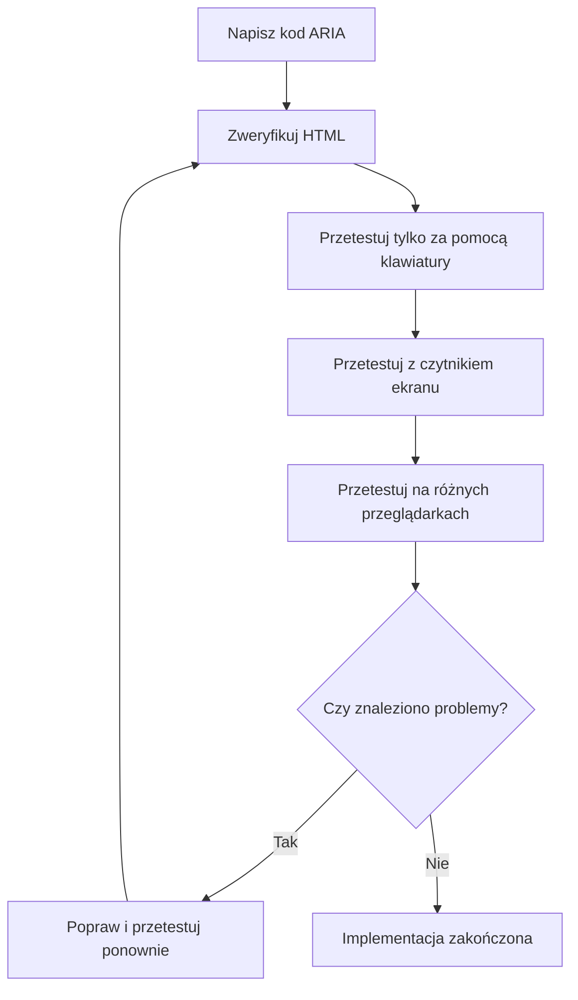
**🚫 Typowe błędy ARIA, których należy unikać:**

- **Sprzeczne informacje**: Nie zaprzeczaj semantyce HTML
- **Nadmierne etykietowanie**: Zbyt dużo informacji ARIA przytłacza użytkowników
- **Statyczna ARIA**: Zapominanie o aktualizacji stanów ARIA przy zmianie zawartości
- **Nieprzetestowane implementacje**: ARIA działające w teorii, ale zawodzące w praktyce
- **Brak wsparcia dla klawiatury**: Role ARIA bez odpowiadających interakcji klawiaturowych

> 💡 **Zasoby do testowania**: Używaj narzędzi takich jak [accessibility-checker](https://www.npmjs.com/package/accessibility-checker) do automatycznej walidacji ARIA, ale zawsze testuj z prawdziwymi czytnikami ekranu, aby uzyskać pełne doświadczenie.

### 🎭 **Sprawdzenie umiejętności ARIA: Gotowy na złożone interakcje?**

**Oceń swoje zaufanie do ARIA:**
- Kiedy wybrałbyś ARIA zamiast semantycznego HTML? (Wskazówka: prawie nigdy!)
- Czy potrafisz wyjaśnić, dlaczego `<div role="button">` zwykle jest gorsze niż `<button>`?
- Co jest najważniejszą rzeczą do zapamiętania przy testowaniu ARIA?

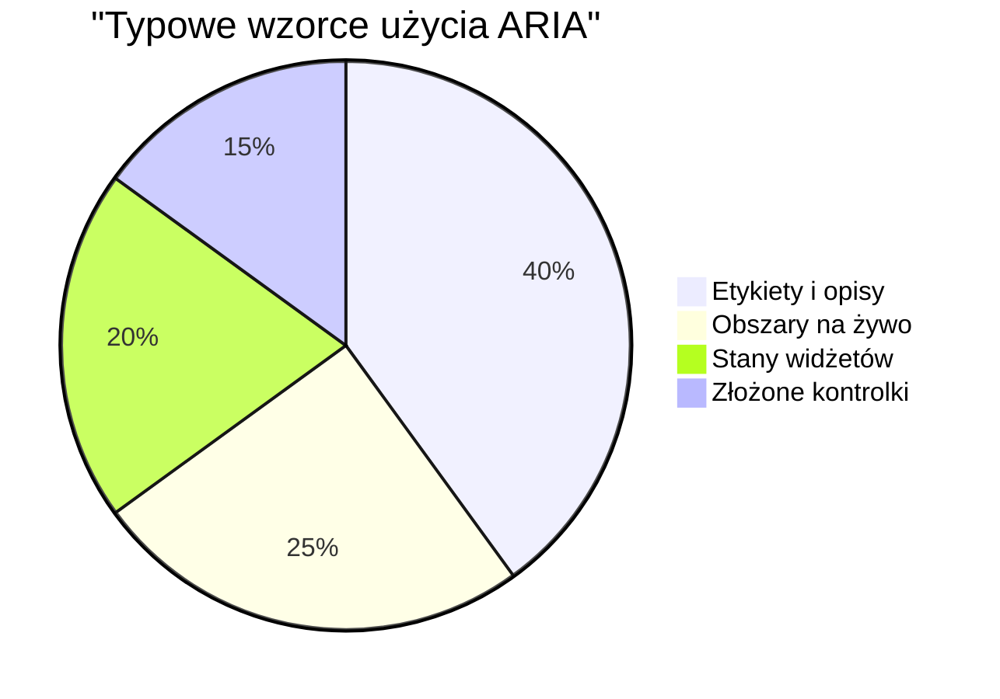
> **Kluczowa uwaga**: Większość zastosowań ARIA służy do etykietowania i opisywania elementów. Złożone wzorce widgetów są dużo mniej powszechne, niż mogłoby się wydawać!

✅ **Ucz się od ekspertów**: Przestudiuj [ARIA Authoring Practices Guide](https://w3c.github.io/aria-practices/) dla sprawdzonych wzorców i implementacji złożonych interaktywnych widgetów.

## Uczynienie obrazów i mediów dostępnymi

Treści wizualne i audio są kluczowymi elementami nowoczesnych doświadczeń internetowych, ale mogą stanowić barierę, jeśli nie są wdrożone z rozwagą. Celem jest zapewnienie, aby informacje i emocjonalny przekaz Twoich mediów docierały do każdego użytkownika. Gdy już opanujesz tę umiejętność, stanie się to Twoją drugą naturą.

Różne rodzaje mediów wymagają różnych podejść do dostępności. To jak gotowanie — nie potraktujesz delikatnej ryby tak samo jak solidnego steku. Zrozumienie tych różnic pomaga wybrać odpowiednie rozwiązanie dla każdej sytuacji.

### Strategiczne podejście do dostępności obrazów

Każdy obraz na Twojej stronie pełni jakąś funkcję. Zrozumienie tej funkcji pomaga pisać lepsze alternatywne opisy i tworzyć bardziej inkluzywne doświadczenia.

**Cztery typy obrazów oraz strategie alt tekstu:**

**Obrazy informacyjne** - przekazują ważne informacje:
```html

```

**Obrazy dekoracyjne** - czysto wizualne, bez wartości informacyjnej:
```html

```

**Obrazy funkcyjne** - służą jako przyciski lub kontrolki:
```html
<button>
  
</button>
```

**Obrazy złożone** - wykresy, diagramy, infografiki:
```html

<div id="chart-description">
  <p>Detailed description: Sales data shows a steady increase across all quarters...</p>
</div>
```

### Dostępność wideo i audio

**Wymagania dla wideo:**
- **Napisy**: wersja tekstowa mówionych treści i efektów dźwiękowych
- **Opisy audio**: narracja elementów wizualnych dla osób niewidomych
- **Transkrypcje**: pełne tekstowe wersje całej zawartości audio i wizualnej

```html
<video controls>
  <source src="video.mp4" type="video/mp4">
  <track kind="captions" src="captions.vtt" srclang="en" label="English">
  <track kind="descriptions" src="descriptions.vtt" srclang="en" label="Audio descriptions">
</video>
```

**Wymagania dla audio:**
- **Transkrypcje**: tekstowa wersja wszystkiego, co jest mówione
- **Wizualne wskaźniki**: w przypadku treści tylko audio dostarcz wizualne wskazówki

### Nowoczesne techniki obrazów

**Wykorzystanie CSS do obrazów dekoracyjnych:**
```css
.hero-section {
  background-image: url('decorative-hero.jpg');
  /* Decorative images in CSS don't need alt text */
}
```

**Responsywne obrazy z uwzględnieniem dostępności:**
```html
<picture>
  <source media="(min-width: 800px)" srcset="large-chart.png">
  <source media="(min-width: 400px)" srcset="medium-chart.png">
  
</picture>
```

✅ **Testuj dostępność obrazów**: Użyj czytnika ekranu, aby nawigować po stronie z obrazami. Czy otrzymujesz wystarczającą ilość informacji, aby zrozumieć zawartość?

## Nawigacja klawiaturą i zarządzanie fokusem

Wielu użytkowników nawiguję po sieci wyłącznie za pomocą klawiatury. To obejmuje osoby z niepełnosprawnościami ruchowymi, zaawansowanych użytkowników, którzy uważają klawiaturę za szybszą niż mysz, oraz każdego, komu mysz przestała działać. Zapewnienie poprawnej pracy witryny z klawiaturą jest kluczowe i często zwiększa efektywność dla wszystkich.

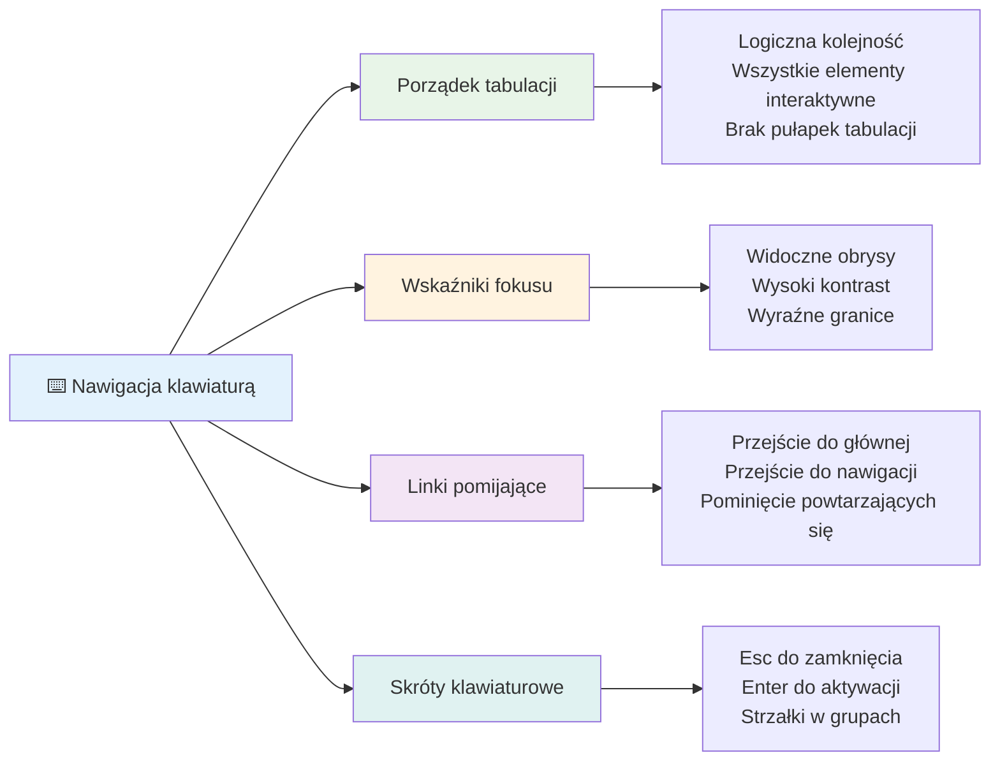
### Podstawowe wzorce nawigacji klawiaturą

**Standardowe interakcje klawiaturą:**
- **Tab**: Przesuwa fokus do przodu przez elementy interaktywne
- **Shift + Tab**: Przesuwa fokus do tyłu
- **Enter**: Aktywuje przyciski i linki
- **Spacja**: Aktywuje przyciski, zaznacza pola wyboru
- **Strzałki**: Nawiguje w ramach grup komponentów (przyciski radiowe, menu)
- **Escape**: Zamknięcie modali, dropdownów lub anulowanie operacji

### Najlepsze praktyki zarządzania fokusem

**Widoczne wskaźniki fokusu:**
```css
/* Ensure focus is always visible */
button:focus-visible {
  outline: 2px solid #4A90A4;
  outline-offset: 2px;
}

/* Custom focus styles for different components */
.card:focus-within {
  box-shadow: 0 0 0 3px rgba(74, 144, 164, 0.5);
}
```

**Linki pomijające dla efektywnej nawigacji:**
```html
<a href="#main-content" class="skip-link">Skip to main content</a>
<a href="#navigation" class="skip-link">Skip to navigation</a>

<nav id="navigation">
  <!-- navigation content -->
</nav>
<main id="main-content">
  <!-- main content -->
</main>
```

**Poprawna kolejność tabulacji:**
```html
<!-- Use semantic HTML for natural tab order -->
<form>
  <label for="name">Name:</label>
  <input type="text" id="name" tabindex="0">
  
  <label for="email">Email:</label>
  <input type="email" id="email" tabindex="0">
  
  <button type="submit" tabindex="0">Submit</button>
</form>
```

### Uwięźnięcie fokusu w modalach

Przy otwieraniu dialogów modalnych fokus powinien być uwięziony wewnątrz modalu:

```javascript
// Nowoczesna implementacja pułapki fokusowej
function trapFocus(element) {
  const focusableElements = element.querySelectorAll(
    'button, [href], input, select, textarea, [tabindex]:not([tabindex="-1"])'
  );
  
  const firstElement = focusableElements[0];
  const lastElement = focusableElements[focusableElements.length - 1];

  element.addEventListener('keydown', (e) => {
    if (e.key === 'Tab') {
      if (e.shiftKey && document.activeElement === firstElement) {
        e.preventDefault();
        lastElement.focus();
      } else if (!e.shiftKey && document.activeElement === lastElement) {
        e.preventDefault();
        firstElement.focus();
      }
    }
    
    if (e.key === 'Escape') {
      closeModal();
    }
  });
  
  // Ustaw fokus na pierwszy element po otwarciu modalu
  firstElement.focus();
}
```

✅ **Testuj nawigację klawiaturą**: Spróbuj poruszać się po twojej stronie używając wyłącznie klawisza Tab. Czy uda Ci się dotrzeć do wszystkich elementów interaktywnych? Czy kolejność fokusu jest logiczna? Czy wskaźniki fokusu są dobrze widoczne?

## Dostępność formularzy

Formularze są kluczowe dla interakcji użytkownika i wymagają szczególnej uwagi w kwestii dostępności.

### Powiązanie etykiet i kontrolek formularza

**Każda kontrolka formularza wymaga etykiety:**
```html
<!-- Explicit labeling (preferred) -->
<label for="username">Username:</label>
<input type="text" id="username" name="username" required>

<!-- Implicit labeling -->
<label>
  Password:
  <input type="password" name="password" required>
</label>

<!-- Using aria-label when visual label isn't desired -->
<input type="search" aria-label="Search products" placeholder="Search...">
```

### Obsługa błędów i walidacja

**Dostępne komunikaty o błędach:**
```html
<label for="email">Email Address:</label>
<input type="email" id="email" name="email" 
       aria-describedby="email-error" 
       aria-invalid="true" required>
<div id="email-error" role="alert">
  Please enter a valid email address
</div>
```

**Najlepsze praktyki walidacji formularzy:**
- Używaj `aria-invalid` do wskazywania nieprawidłowych pól
- Dostarczaj jasne, konkretne komunikaty o błędach
- Używaj `role="alert"` do ważnych komunikatów o błędach
- Pokaż błędy natychmiast i przy zatwierdzaniu formularza

### Fieldsety i grupowanie

**Grupuj powiązane kontrolki formularza:**
```html
<fieldset>
  <legend>Shipping Address</legend>
  <label for="street">Street Address:</label>
  <input type="text" id="street" name="street">
  
  <label for="city">City:</label>
  <input type="text" id="city" name="city">
</fieldset>

<fieldset>
  <legend>Preferred Contact Method</legend>
  <input type="radio" id="contact-email" name="contact" value="email">
  <label for="contact-email">Email</label>
  
  <input type="radio" id="contact-phone" name="contact" value="phone">
  <label for="contact-phone">Phone</label>
</fieldset>
```

## Twoja podróż ku dostępności: Kluczowe wnioski

Gratulacje! właśnie zdobyłeś podstawową wiedzę, aby tworzyć naprawdę inkluzywne doświadczenia webowe. To naprawdę ekscytujące! Dostępność w sieci to nie tylko zaznaczanie wymaganych rubryk — to rozpoznanie różnorodnych sposobów, w jaki ludzie korzystają z treści cyfrowych i projektowanie dla tej niesamowitej złożoności.

Jesteś teraz częścią rosnącej społeczności deweloperów, którzy rozumieją, że świetny design działa dla wszystkich. Witamy w klubie!

**🎯 Twój zestaw narzędzi do dostępności zawiera teraz:**

| Podstawowa zasada | Implementacja | Wpływ |
|-------------------|---------------|--------|
| **Podstawa semantycznego HTML** | Używaj odpowiednich elementów HTML do zamierzonego celu | Czytniki ekranu nawigują sprawnie, klawiatura działa automatycznie |
| **Inkluzywny design wizualny** | Wystarczający kontrast, znaczące użycie kolorów, widoczne wskaźniki fokusu | Czytelność dla każdego w dowolnych warunkach oświetleniowych |
| **Opisowa treść** | Znaczące teksty linków, alt text, nagłówki | Użytkownicy rozumieją zawartość bez kontekstu wizualnego |
| **Dostępność klawiatury** | Kolejność tabulacji, skróty klawiaturowe, zarządzanie fokusem | Dostępność motoryczna i efektywność dla zaawansowanych użytkowników |
| **Udoskonalenie ARIA** | Strategiczne użycie do wypełnienia luk semantycznych | Złożone aplikacje działają z technologiami wspomagającymi |
| **Kompleksowe testowanie** | Narzędzia automatyczne + ręczna weryfikacja + testy z użytkownikami | Wykrywa problemy zanim wpłyną na użytkowników |

**🚀 Twoje następne kroki:**

1. **Wbuduj dostępność w swój proces pracy**: Uczyń testowanie naturalną częścią swojego procesu deweloperskiego
2. **Ucz się od prawdziwych użytkowników**: Szukaj opinii od osób korzystających z technologii asystujących
3. **Bądź na bieżąco**: Techniki dostępności ewoluują wraz z nowymi technologiami i standardami
4. **Promuj inkluzywność**: Dziel się swoją wiedzą i spraw, by dostępność była priorytetem zespołu

> 💡 **Pamiętaj**: Ograniczenia dostępności często prowadzą do innowacyjnych, eleganckich rozwiązań korzystnych dla wszystkich. Obniżenia krawężników, napisy i kontrola głosowa zaczęły jako funkcje dostępności i stały się powszechnymi ulepszeniami.

**Biznesowy argument jest krystalicznie jasny**: Strony dostępne dla wszystkich docierają do większej liczby użytkowników, mają wyższe pozycje w wyszukiwarkach, niższe koszty utrzymania i unikają ryzyka prawnego. Ale szczerze? Prawdziwy powód, by dbać o dostępność, sięga znacznie głębiej. Strony dostępne ucieleśniają najlepsze wartości sieci — otwartość, inkluzywność oraz przekonanie, że każdy zasługuje na równy dostęp do informacji.

Masz teraz narzędzia, aby budować inkluzywny web przyszłości. Każda dostępna strona, którą tworzysz, sprawia, że internet jest bardziej przyjaznym miejscem dla wszystkich. To naprawdę niesamowite, gdy o tym pomyślisz!

## Dodatkowe zasoby

Kontynuuj swoją drogę nauki dostępności z tymi podstawowymi zasobami:

**📚 Oficjalne standardy i wytyczne:**
- [WCAG 2.1 Guidelines](https://www.w3.org/WAI/WCAG21/quickref/) - Oficjalny standard dostępności z szybkim odniesieniem
- [ARIA Authoring Practices Guide](https://w3c.github.io/aria-practices/) - Kompleksowe wzorce dla interaktywnych widgetów
- [WebAIM Guidelines](https://webaim.org/) - Praktyczne, przyjazne dla początkujących wskazówki dotyczące dostępności

**🛠️ Narzędzia i zasoby do testowania:**
- [axe DevTools](https://www.deque.com/axe/devtools/) - Branżowe narzędzie do testowania dostępności
- [A11y Project Checklist](https://www.a11yproject.com/checklist/) - Lista kontrolna do krok po kroku weryfikacji dostępności
- [Accessibility Insights](https://accessibilityinsights.io/) - Kompleksowy zestaw do testów firmy Microsoft
- [Color Oracle](https://colororacle.org/) - Symulator daltonizmu do testowania projektów

**🎓 Nauka i społeczność:**
- [WebAIM Screen Reader Survey](https://webaim.org/projects/screenreadersurvey9/) - Preferencje i zachowania prawdziwych użytkowników
- [Inclusive Components](https://inclusive-components.design/) - Nowoczesne dostępne wzorce komponentów
- [A11y Coffee](https://a11y.coffee/) - Szybkie wskazówki i przemyślenia o dostępności
- [Web Accessibility Initiative (WAI)](https://www.w3.org/WAI/) - Kompleksowe zasoby dostępności W3C

**🎥 Nauka praktyczna:**
- [Accessibility Developer Guide](https://www.accessibility-developer-guide.com/) - Praktyczne wytyczne do implementacji
- [Deque University](https://dequeuniversity.com/) - Profesjonalne kursy szkoleniowe nt. dostępności

## Wyzwanię GitHub Copilot Agent 🚀

Użyj trybu Agenta, aby wykonać następujące zadanie:

**Opis:** Stwórz dostępny komponent dialogu modalnego, który demonstruje odpowiednie zarządzanie fokusem, atrybuty ARIA oraz wzorce nawigacji klawiaturą.

**Polecenie:** Zbuduj kompletny komponent dialogu modalnego w HTML, CSS i JavaScript zawierający: prawidłowe uwięzienie fokusu, klawisz ESC do zamknięcia, kliknięcie poza modalem do zamknięcia, atrybuty ARIA dla czytników ekranu oraz widoczne wskaźniki fokusu. Modal powinien zawierać formularz z odpowiednimi etykietami i obsługą błędów. Zapewnij spełnienie standardów WCAG 2.1 AA.


## 🚀 Wyzwanie

Weź ten HTML i przepisz go, aby był jak najbardziej dostępny, stosując poznane strategie.

```html
<!DOCTYPE html>
<html lang="en">
  <head>
    <meta charset="UTF-8">
    <meta name="viewport" content="width=device-width, initial-scale=1.0">
    <title>Turtle Ipsum - The World's Premier Turtle Fan Club</title>
    <link href='../assets/style.css' rel='stylesheet' type='text/css'>
  </head>
  <body>
    <header class="site-header">
      <h1 class="site-title">Turtle Ipsum</h1>
      <p class="site-subtitle">The World's Premier Turtle Fan Club</p>
    </header>
    
    <nav class="main-nav" aria-label="Main navigation">
      <h2 class="nav-header">Resources</h2>
      <ul class="nav-list">
        <li><a href="https://www.youtube.com/watch?v=CMNry4PE93Y">"I like turtles" video</a></li>
        <li><a href="https://en.wikipedia.org/wiki/Turtle">Basic turtle information</a></li>
        <li><a href="https://en.wikipedia.org/wiki/Turtles_(chocolate)">Chocolate turtles candy</a></li>
      </ul>
    </nav>
    
    <main class="main-content">
      <article>
        <h1>Welcome to Turtle Ipsum</h1>
        <p class="intro">
          <a href="/about">Learn more about our turtle community</a> and discover fascinating facts about these amazing creatures.
        </p>
        <p class="article-text">
          Turtle ipsum dolor sit amet, consectetur adipiscing elit, sed do eiusmod tempor incididunt ut labore et dolore magna aliqua. Ut enim ad minim veniam, quis nostrud exercitation ullamco laboris nisi ut aliquip ex ea commodo consequat. Duis aute irure dolor in reprehenderit in voluptate velit esse cillum dolore eu fugiat nulla pariatur. Excepteur sint occaecat cupidatat non proident, sunt in culpa qui officia deserunt mollit anim id est laborum.
        </p>
      </article>
    </main>
    
    <footer class="footer">
      <section class="newsletter-signup">
        <h2>Stay Updated</h2>
        <button type="button" onclick="showNewsletterForm()">Sign up for turtle news</button>
      </section>
      
      <nav class="footer-nav" aria-label="Footer navigation">
        <h2>Site Pages</h2>
        <ul>
          <li><a href="../">Home</a></li>
          <li><a href="../semantic">Semantic HTML example</a></li>
        </ul>
      </nav>
      
      <p class="footer-copyright">&copy; 2024 Instrument. All rights reserved.</p>
    </footer>
  </body>
</html>
```

**Kluczowe wprowadzone ulepszenia:**
- Dodano właściwą semantyczną strukturę HTML
- Naprawiono hierarchię nagłówków (jeden h1, logiczny układ)
- Dodano znaczące teksty linków zamiast „kliknij tutaj”
- Dodano właściwe etykiety ARIA dla nawigacji
- Dodano atrybut lang i odpowiednie meta tagi
- Użyto elementu button dla elementów interaktywnych
- Ustrukturyzowano zawartość stopki z właściwymi punktami orientacyjnymi

## Quiz po wykładzie
[Quiz po wykładzie](https://ff-quizzes.netlify.app/web/en/)

## Powtórka i samodzielna nauka

Wiele rządów ma przepisy dotyczące wymogów dostępności. Przeczytaj o prawie dotyczącym dostępności w Twoim kraju. Co jest objęte, a co nie? Przykładem jest [ta rządowa strona](https://accessibility.blog.gov.uk/).

## Zadanie

[Analiza niedostępnej strony internetowej](assignment.md)

Autor: [Turtle Ipsum](https://github.com/Instrument/semantic-html-sample) by Instrument

---

## 🚀 Twój harmonogram opanowania dostępności

### ⚡ **Co możesz zrobić w ciągu następnych 5 minut**
- [ ] Zainstaluj rozszerzenie axe DevTools w swojej przeglądarce
- [ ] Uruchom audyt dostępności Lighthouse na swojej ulubionej stronie
- [ ] Spróbuj nawigować po dowolnej stronie używając wyłącznie klawisza Tab
- [ ] Przetestuj wbudowany czytnik ekranu w przeglądarce (Narrator/VoiceOver)

### 🎯 **Co możesz osiągnąć w ciągu godziny**
- [ ] Wykonaj quiz po lekcji i przemyśl wnioski dotyczące dostępności
- [ ] Poćwicz pisanie znaczących opisów alt dla 10 różnych obrazów
- [ ] Sprawdź strukturę nagłówków strony za pomocą rozszerzenia HeadingsMap
- [ ] Popraw problemy z dostępnością znalezione w wyzwaniu HTML
- [ ] Przetestuj kontrast kolorów w aktualnym projekcie narzędziem WebAIM

### 📅 **Twoja tydzień-długa podróż dostępności**
- [ ] Wykonaj zadanie analizując niedostępną stronę internetową
- [ ] Skonfiguruj środowisko deweloperskie z narzędziami do testowania dostępności
- [ ] Ćwicz nawigację za pomocą klawiatury na 5 różnych skomplikowanych stronach internetowych
- [ ] Zbuduj prosty formularz z odpowiednimi etykietami, obsługą błędów i ARIA
- [ ] Dołącz do społeczności zajmującej się dostępnością (A11y Slack, forum WebAIM)
- [ ] Obserwuj prawdziwych użytkowników z niepełnosprawnościami podczas nawigacji po stronach internetowych (YouTube ma świetne przykłady)

### 🌟 **Twoja miesięczna transformacja**
- [ ] Zintegruj testowanie dostępności z workflow developerskim
- [ ] Wnieś wkład do projektu open source, naprawiając problemy z dostępnością
- [ ] Przeprowadź testy użyteczności z osobą korzystającą z technologii wspomagających
- [ ] Zbuduj dostępną bibliotekę komponentów dla swojego zespołu
- [ ] Propaguj dostępność w miejscu pracy lub społeczności
- [ ] Mentoring dla osoby nowej w tematach dostępności

### 🏆 **Ostateczne podsumowanie mistrza dostępności**

**Świętuj swoją podróż w świat dostępności:**
- Co było najbardziej zaskakujące, czego się nauczyłeś o tym, jak ludzie korzystają z internetu?
- Która zasada dostępności najlepiej rezonuje z twoim stylem programowania?
- Jak nauka o dostępności zmieniła twój punkt widzenia na projektowanie?
- Jaka jest pierwsza poprawka dostępności, którą chcesz wprowadzić w prawdziwym projekcie?

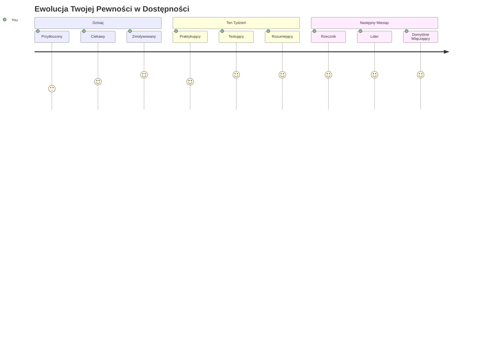
> 🌍 **Jesteś teraz mistrzem dostępności!** Rozumiesz, że świetne doświadczenia internetowe działają dla każdego, niezależnie od sposobu dostępu do sieci. Każda funkcja dostępna, którą tworzysz, sprawia, że internet jest bardziej inkluzywny. Sieć potrzebuje programistów takich jak ty, którzy postrzegają dostępność nie jako ograniczenie, ale jako szansę na tworzenie lepszych doświadczeń dla wszystkich użytkowników. Witamy w ruchu! 🎉

---

<!-- CO-OP TRANSLATOR DISCLAIMER START -->
**Zastrzeżenie**:
Niniejszy dokument został przetłumaczony przy użyciu automatycznej usługi tłumaczeniowej [Co-op Translator](https://github.com/Azure/co-op-translator). Mimo że dokładamy starań, aby tłumaczenie było jak najdokładniejsze, należy pamiętać, że tłumaczenia automatyczne mogą zawierać błędy lub niedokładności. Oryginalny dokument w języku źródłowym należy traktować jako źródło ostateczne. W przypadku informacji o krytycznym znaczeniu zaleca się skorzystanie z profesjonalnego tłumaczenia wykonanego przez człowieka. Nie ponosimy odpowiedzialności za jakiekolwiek nieporozumienia lub błędne interpretacje wynikające z korzystania z tego tłumaczenia.
<!-- CO-OP TRANSLATOR DISCLAIMER END -->