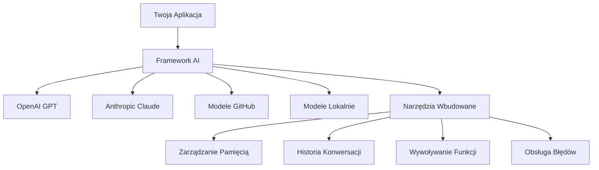
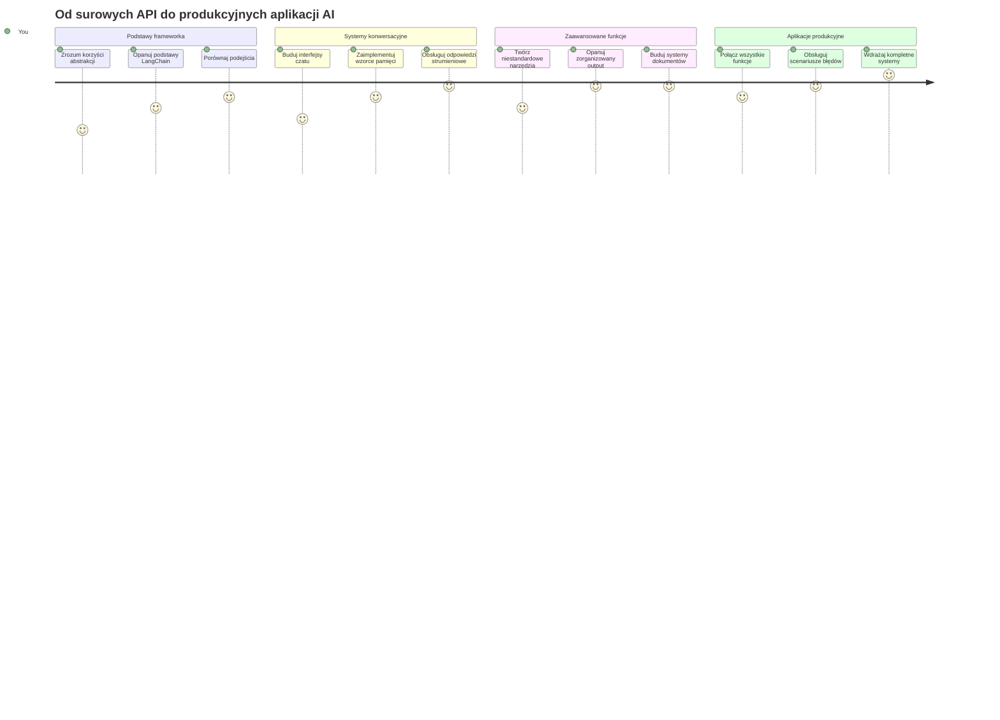
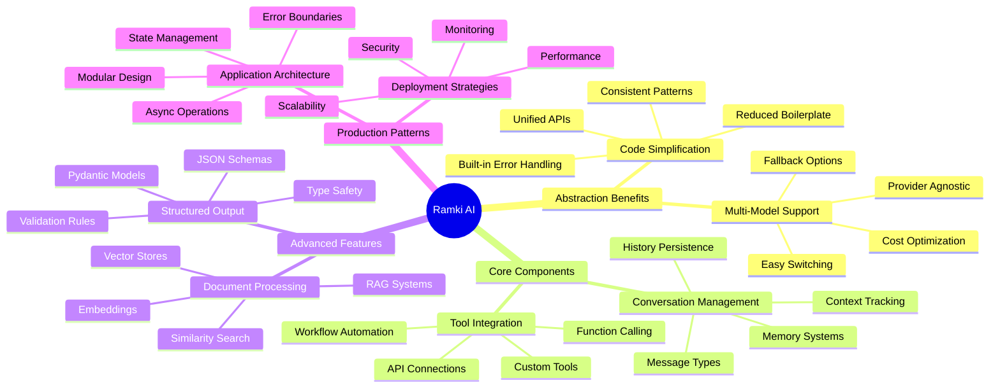
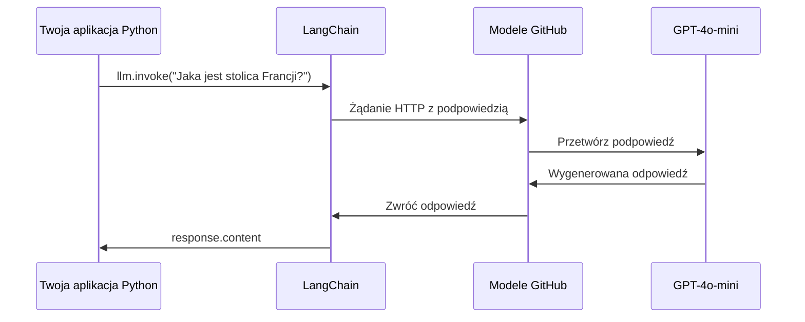
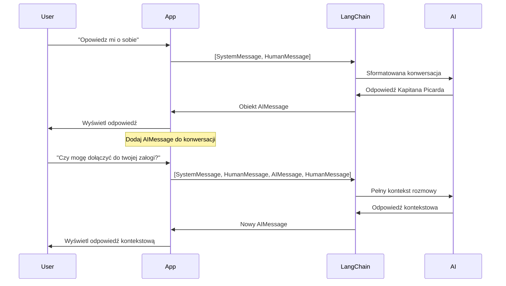
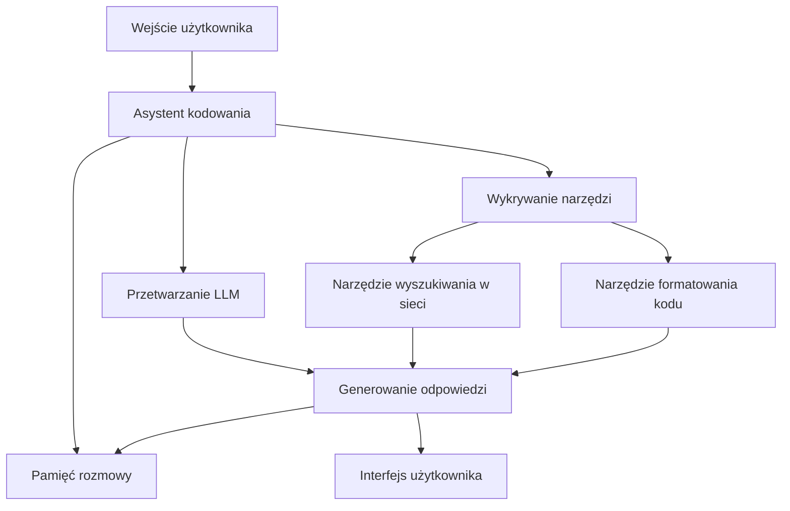
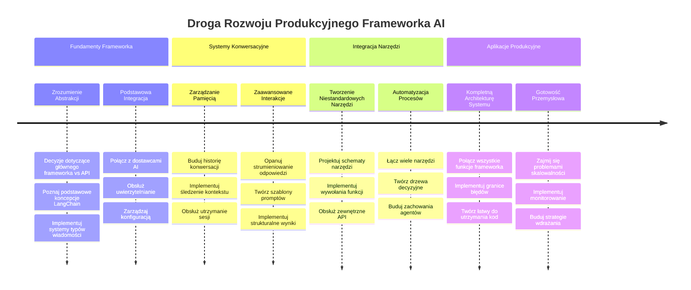
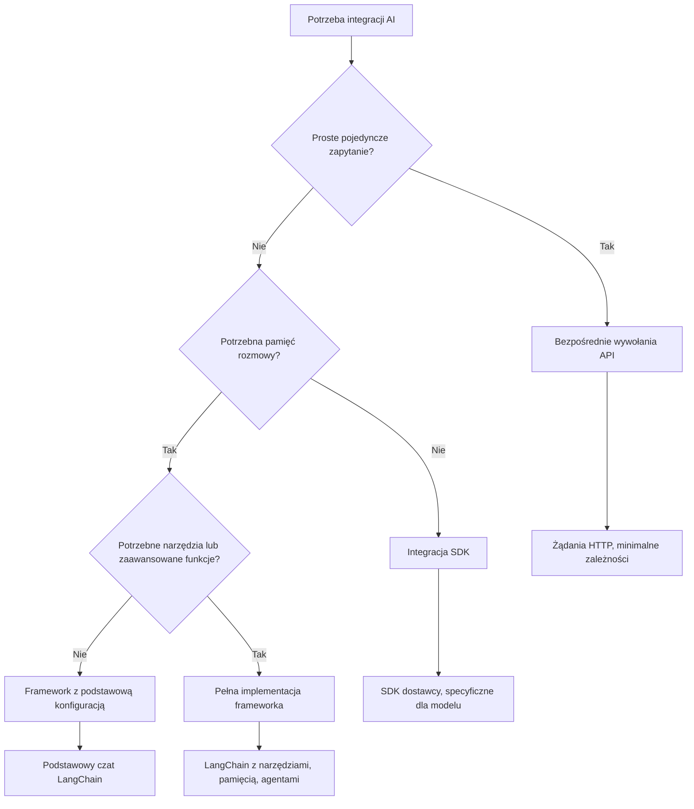

<!--
CO_OP_TRANSLATOR_METADATA:
{
  "original_hash": "3925b6a1c31c60755eaae4d578232c25",
  "translation_date": "2026-01-06T18:43:07+00:00",
  "source_file": "10-ai-framework-project/README.md",
  "language_code": "pl"
}
-->
# AI Framework

Czy kiedykolwiek czułeś się przytłoczony, próbując budować aplikacje AI od podstaw? Nie jesteś sam! Frameworki AI to jak szwajcarski scyzoryk dla programistów AI – to potężne narzędzia, które mogą zaoszczędzić Ci czas i bóle głowy podczas tworzenia inteligentnych aplikacji. Pomyśl o frameworku AI jak o dobrze zorganizowanej bibliotece: zapewnia gotowe komponenty, ustandaryzowane API i sprytne abstrakcje, dzięki czemu możesz skupić się na rozwiązywaniu problemów zamiast zmagać się ze szczegółami implementacji.

W tej lekcji odkryjemy, jak frameworki takie jak LangChain mogą zamienić kiedyś skomplikowane zadania integracji AI w czysty, czytelny kod. Dowiesz się, jak radzić sobie z rzeczywistymi wyzwaniami, takimi jak śledzenie rozmów, implementacja wywoływania narzędzi i zarządzanie różnymi modelami AI za pomocą jednego zunifikowanego interfejsu.

Po ukończeniu dowiesz się, kiedy sięgnąć po frameworki zamiast surowych wywołań API, jak efektywnie korzystać z ich abstrakcji i jak budować aplikacje AI gotowe na rzeczywiste zastosowania. Poznajmy, co frameworki AI mogą zrobić dla Twoich projektów.

## ⚡ Co możesz zrobić w następnych 5 minut

**Szybki start dla zapracowanych programistów**


- **Minuta 1**: Zainstaluj LangChain: `pip install langchain langchain-openai`
- **Minuta 2**: Skonfiguruj swój token GitHub i zaimportuj klienta ChatOpenAI
- **Minuta 3**: Stwórz prostą rozmowę z wiadomościami systemowymi i od człowieka
- **Minuta 4**: Dodaj podstawowe narzędzie (np. funkcję dodawania) i zobacz wywoływanie narzędzi AI
- **Minuta 5**: Doświadcz różnicy między surowymi wywołaniami API a abstrakcją frameworku

**Szybki test kodu**:
```python
from langchain_openai import ChatOpenAI
from langchain_core.messages import SystemMessage, HumanMessage

llm = ChatOpenAI(
    api_key=os.environ["GITHUB_TOKEN"],
    base_url="https://models.github.ai/inference",
    model="openai/gpt-4o-mini"
)

response = llm.invoke([
    SystemMessage(content="You are a helpful coding assistant"),
    HumanMessage(content="Explain Python functions briefly")
])
print(response.content)
```

**Dlaczego to ważne**: W ciągu 5 minut zobaczysz, jak frameworki AI przekształcają skomplikowaną integrację AI w proste wywołania metod. To fundament, który napędza produkcyjne aplikacje AI.

## Dlaczego warto wybrać framework?

Jesteś gotowy, aby zbudować aplikację AI – super! Ale sprawa wygląda tak: masz kilka różnych ścieżek do wyboru, a każda z nich ma swoje plusy i minusy. To trochę jak wybór między chodzeniem, jazdą na rowerze lub autem, żeby gdzieś dotrzeć – wszystkie sposoby doprowadzą Cię do celu, ale doświadczenie (i wysiłek) będą zupełnie inne.

Rozłożymy na czynniki pierwsze trzy główne sposoby integracji AI w Twoich projektach:

| Podejście | Zalety | Najlepsze do | Uwagi |
|----------|------------|----------|--------------|
| **Bezpośrednie żądania HTTP** | Pełna kontrola, brak zależności | Proste zapytania, nauka podstaw | Bardziej rozbudowany kod, ręczne obsługiwanie błędów |
| **Integracja SDK** | Mniej boilerplate’u, optymalizacje specyficzne dla modelu | Aplikacje z jednym modelem | Ograniczone do konkretnych dostawców |
| **Frameworki AI** | Zunifikowane API, wbudowane abstrakcje | Aplikacje wielomodelowe, złożone przepływy | Krzywa nauki, możliwość nadmiernej abstrakcji |

### Korzyści z frameworków w praktyce


**Dlaczego frameworki są ważne:**
- **Integrują** wielu dostawców AI pod jednym interfejsem
- **Obsługują** pamięć rozmowy automatycznie
- **Dostarczają** gotowe narzędzia do typowych zadań jak embeddingi i wywoływanie funkcji
- **Zarządzają** obsługą błędów i logiką ponowień
- **Przekształcają** skomplikowane przepływy w czytelne wywołania metod

> 💡 **Profesjonalna wskazówka**: Używaj frameworków, gdy przełączasz się między różnymi modelami AI lub budujesz złożone funkcje, takie jak agenci, pamięć czy wywoływanie narzędzi. Stosuj bezpośrednie API, gdy uczysz się podstaw lub tworzysz proste, skoncentrowane aplikacje.

**Podsumowując**: Podobnie jak wybór między wyspecjalizowanymi narzędziami rzemieślnika a kompletnym warsztatem, chodzi o dopasowanie narzędzia do zadania. Frameworki sprawdzają się świetnie w złożonych, bogatych funkcjach aplikacjach, podczas gdy bezpośrednie API dobrze działają w prostych zastosowaniach.

## 🗺️ Twoja podróż naukowa przez mistrzostwo frameworków AI


**Cel Twojej podróży**: Pod koniec tej lekcji opanujesz rozwój w frameworkach AI i będziesz w stanie tworzyć zaawansowane, gotowe do produkcji aplikacje AI, które konkurują z komercyjnymi asystentami AI.

## Wprowadzenie

W tej lekcji nauczysz się:

- Korzystać z popularnego frameworku AI.
- Rozwiązywać typowe problemy, takie jak rozmowy czatowe, użycie narzędzi, pamięć i kontekst.
- Wykorzystywać to do budowania aplikacji AI.

## 🧠 Ekosystem rozwoju frameworków AI


**Główna zasada**: Frameworki AI upraszczają złożoność, oferując potężne abstrakcje do zarządzania rozmowami, integracji narzędzi i przetwarzania dokumentów, umożliwiając programistom tworzenie zaawansowanych aplikacji AI z czystym i łatwym w utrzymaniu kodem.

## Twój pierwszy prompt AI

Zacznijmy od podstaw, tworząc pierwszą aplikację AI, która wysyła pytanie i otrzymuje odpowiedź. Podobnie jak Archimedes odkrywający zasadę wyporu w swojej kąpieli, czasem najprostsze obserwacje prowadzą do najpotężniejszych wniosków – a frameworki udostępniają te wnioski.

### Konfiguracja LangChain z modelami GitHub

Użyjemy LangChain do połączenia się z modelami GitHub, co jest całkiem fajne, ponieważ daje darmowy dostęp do różnych modeli AI. Najlepsza część? Potrzebujesz tylko kilku prostych parametrów konfiguracyjnych, aby zacząć:

```python
from langchain_openai import ChatOpenAI
import os

llm = ChatOpenAI(
    api_key=os.environ["GITHUB_TOKEN"],
    base_url="https://models.github.ai/inference",
    model="openai/gpt-4o-mini",
)

# Wyślij proste polecenie
response = llm.invoke("What's the capital of France?")
print(response.content)
```

**Oto co się tutaj dzieje:**
- **Tworzy** klienta LangChain za pomocą klasy `ChatOpenAI` – to twój wstęp do AI!
- **Konfiguruje** połączenie do modeli GitHub z Twoim tokenem uwierzytelniającym
- **Określa**, którego modelu AI używać (`gpt-4o-mini`) – pomyśl o tym jak o wyborze asystenta AI
- **Wysyła** pytanie metodą `invoke()` – tutaj dzieje się magia
- **Wyciąga** i wyświetla odpowiedź – voilà, rozmawiasz z AI!

> 🔧 **Notatka**: Jeśli korzystasz z GitHub Codespaces, masz szczęście – `GITHUB_TOKEN` jest już skonfigurowany! Pracujesz lokalnie? Spokojnie, będziesz musiał stworzyć token dostępu osobistego z odpowiednimi uprawnieniami.

**Oczekiwany wynik:**
```text
The capital of France is Paris.
```


## Budowanie konwersacyjnej AI

Ten pierwszy przykład demonstruje podstawy, ale to tylko jedna wymiana – zadajesz pytanie, dostajesz odpowiedź i to wszystko. W rzeczywistych aplikacjach chcesz, aby AI pamiętało, o czym rozmawialiście, tak jak Watson i Holmes budowali swoje śledcze rozmowy na przestrzeni czasu.

Tu LangChain okazuje się szczególnie przydatne. Udostępnia różne typy wiadomości, które pomagają strukturyzować rozmowy i pozwalają nadać AI osobowość. Będziesz tworzyć czaty utrzymujące kontekst i charakter.

### Zrozumienie typów wiadomości

Pomyśl o typach wiadomości jak o różnych „kapeluszach”, które uczestnicy noszą w rozmowie. LangChain używa różnych klas wiadomości, by śledzić, kto co mówi:

| Typ Wiadomości | Cel | Przykład Zastosowania |
|--------------|---------|------------------|
| `SystemMessage` | Definiuje osobowość i zachowanie AI | "Jesteś pomocnym asystentem programistycznym" |
| `HumanMessage` | Reprezentuje wejście użytkownika | "Wyjaśnij, jak działają funkcje" |
| `AIMessage` | Przechowuje odpowiedzi AI | Poprzednie odpowiedzi AI w rozmowie |

### Tworzenie pierwszej rozmowy

Stwórzmy rozmowę, w której AI przyjmuje konkretną rolę. Niech będzie Kapitanem Picardem – postacią znaną z dyplomatycznej mądrości i przywództwa:

```python
messages = [
    SystemMessage(content="You are Captain Picard of the Starship Enterprise"),
    HumanMessage(content="Tell me about you"),
]
```

**Co robi ta konfiguracja rozmowy:**
- **Ustala** rolę i osobowość AI przez `SystemMessage`
- **Dostarcza** wstępne zapytanie użytkownika za pomocą `HumanMessage`
- **Tworzy** podstawę do rozmowy wieloetapowej

Pełny kod tego przykładu wygląda tak:

```python
from langchain_core.messages import HumanMessage, SystemMessage
from langchain_openai import ChatOpenAI
import os

llm = ChatOpenAI(
    api_key=os.environ["GITHUB_TOKEN"],
    base_url="https://models.github.ai/inference",
    model="openai/gpt-4o-mini",
)

messages = [
    SystemMessage(content="You are Captain Picard of the Starship Enterprise"),
    HumanMessage(content="Tell me about you"),
]


# działa
response  = llm.invoke(messages)
print(response.content)
```

Powinieneś zobaczyć wynik podobny do:

```text
I am Captain Jean-Luc Picard, the commanding officer of the USS Enterprise (NCC-1701-D), a starship in the United Federation of Planets. My primary mission is to explore new worlds, seek out new life and new civilizations, and boldly go where no one has gone before. 

I believe in the importance of diplomacy, reason, and the pursuit of knowledge. My crew is diverse and skilled, and we often face challenges that test our resolve, ethics, and ingenuity. Throughout my career, I have encountered numerous species, grappled with complex moral dilemmas, and have consistently sought peaceful solutions to conflicts.

I hold the ideals of the Federation close to my heart, believing in the importance of cooperation, understanding, and respect for all sentient beings. My experiences have shaped my leadership style, and I strive to be a thoughtful and just captain. How may I assist you further?
```

Aby zachować ciągłość rozmowy (zamiast resetować kontekst za każdym razem), musisz ciągle dodawać odpowiedzi do listy wiadomości. Podobnie jak ustne tradycje przekazujące historie z pokolenia na pokolenie, takie podejście buduje trwałą pamięć:

```python
from langchain_core.messages import HumanMessage, SystemMessage
from langchain_openai import ChatOpenAI
import os

llm = ChatOpenAI(
    api_key=os.environ["GITHUB_TOKEN"],
    base_url="https://models.github.ai/inference",
    model="openai/gpt-4o-mini",
)

messages = [
    SystemMessage(content="You are Captain Picard of the Starship Enterprise"),
    HumanMessage(content="Tell me about you"),
]


# działa
response  = llm.invoke(messages)

print(response.content)

print("---- Next ----")

messages.append(response)
messages.append(HumanMessage(content="Now that I know about you, I'm Chris, can I be in your crew?"))

response  = llm.invoke(messages)

print(response.content)

```

Całkiem niezłe, prawda? Dzieje się tu tak, że wywołujemy LLM dwukrotnie – najpierw z dwoma początkowymi wiadomościami, a potem ponownie z pełną historią rozmowy. To tak, jakby AI naprawdę śledziło naszą rozmowę!

Kiedy uruchomisz ten kod, otrzymasz drugą odpowiedź, która może brzmieć tak:

```text
Welcome aboard, Chris! It's always a pleasure to meet those who share a passion for exploration and discovery. While I cannot formally offer you a position on the Enterprise right now, I encourage you to pursue your aspirations. We are always in need of talented individuals with diverse skills and backgrounds. 

If you are interested in space exploration, consider education and training in the sciences, engineering, or diplomacy. The values of curiosity, resilience, and teamwork are crucial in Starfleet. Should you ever find yourself on a starship, remember to uphold the principles of the Federation: peace, understanding, and respect for all beings. Your journey can lead you to remarkable adventures, whether in the stars or on the ground. Engage!
```


Wezmę to jako „może” ;)

## Streaming odpowiedzi

Czy zauważyłeś, jak ChatGPT zdaje się „pisać” odpowiedzi w czasie rzeczywistym? To właśnie streaming w akcji. Podobnie jak obserwowanie zręcznego kaligrafa – widzisz, jak pojawiają się litery krok po kroku, zamiast natychmiast – streaming sprawia, że interakcja jest bardziej naturalna i daje natychmiastową informację zwrotną.

### Implementacja streamingu w LangChain

```python
from langchain_openai import ChatOpenAI
import os

llm = ChatOpenAI(
    api_key=os.environ["GITHUB_TOKEN"],
    base_url="https://models.github.ai/inference",
    model="openai/gpt-4o-mini",
    streaming=True
)

# Strumieniuj odpowiedź
for chunk in llm.stream("Write a short story about a robot learning to code"):
    print(chunk.content, end="", flush=True)
```

**Dlaczego streaming jest świetny:**
- **Pokazuje** zawartość, gdy jest tworzona – koniec z niezręcznym czekaniem!
- **Sprawia**, że użytkownicy czują, iż coś się faktycznie dzieje
- **Wydaje się** szybszy, nawet jeśli technicznie taki nie jest
- **Pozwala** rozpocząć czytanie, podczas gdy AI jeszcze „myśli”

> 💡 **Wskazówka dla UX**: Streaming szczególnie błyszczy przy dłuższych odpowiedziach, takich jak wyjaśnienia kodu, kreatywne pisanie czy szczegółowe tutoriale. Twoi użytkownicy pokochają widzieć postęp zamiast patrzeć na pusty ekran!

### 🎯 Pedagogiczna chwila refleksji: Korzyści abstrakcji frameworku

**Zatrzymaj się i pomyśl**: Właśnie doświadczyłeś mocy abstrakcji frameworków AI. Porównaj to, czego się nauczyłeś, z surowymi wywołaniami API z poprzednich lekcji.

**Szybka autoocena**:
- Czy potrafisz wyjaśnić, jak LangChain upraszcza zarządzanie rozmową w porównaniu z ręcznym śledzeniem wiadomości?
- Jaka jest różnica między metodami `invoke()` a `stream()` i kiedy ich używać?
- Jak system typów wiadomości w frameworku poprawia organizację kodu?

**Połączenie z rzeczywistością**: Schematy abstrakcji, które poznałeś (typy wiadomości, interfejsy strumieniowe, pamięć rozmowy) są używane w każdej dużej aplikacji AI – od interfejsu ChatGPT po pomoc kodową GitHub Copilot. Opanowujesz te same wzorce architektoniczne, które stosują profesjonalne zespoły deweloperskie AI.

**Pytanie wyzwania**: Jak zaprojektowałbyś abstrakcję frameworku do obsługi różnych dostawców modeli AI (OpenAI, Anthropic, Google) za pomocą jednolitego interfejsu? Rozważ korzyści i kompromisy.

## Szablony promptów

Szablony promptów działają jak struktury retoryczne stosowane w klasycznej oratorii – pomyśl o tym, jak Cyceron dostosowywał swoje wzorce mowy do różnych odbiorców, zachowując tę samą perswazyjną ramę. Pozwalają tworzyć wielokrotnego użytku pytania, w których można wymieniać różne elementy bez przepisywania wszystkiego od nowa. Po skonfigurowaniu szablonu wystarczy wypełnić zmienne odpowiednimi wartościami.

### Tworzenie wielokrotnego użytku promptów

```python
from langchain_core.prompts import ChatPromptTemplate

# Zdefiniuj szablon do wyjaśnień kodu
template = ChatPromptTemplate.from_messages([
    ("system", "You are an expert programming instructor. Explain concepts clearly with examples."),
    ("human", "Explain {concept} in {language} with a practical example for {skill_level} developers")
])

# Użyj szablonu z różnymi wartościami
questions = [
    {"concept": "functions", "language": "JavaScript", "skill_level": "beginner"},
    {"concept": "classes", "language": "Python", "skill_level": "intermediate"},
    {"concept": "async/await", "language": "JavaScript", "skill_level": "advanced"}
]

for question in questions:
    prompt = template.format_messages(**question)
    response = llm.invoke(prompt)
    print(f"Topic: {question['concept']}\n{response.content}\n---\n")
```

**Dlaczego pokochasz szablony:**
- **Utrzymują** spójność promptów w całej aplikacji
- **Koniec z** brzydkim łączeniem stringów – tylko czyste, proste zmienne
- **Twoje AI** zachowuje się przewidywalnie, bo struktura pozostaje niezmienna
- **Aktualizacje** to pestka – zmieniasz szablon raz i zmiana obowiązuje wszędzie

## Strukturalne outputy

Czy zdarzyło Ci się frustrować podczas próby analizowania odpowiedzi AI, które wracają jako niestrukturalny tekst? Strukturalny output to jak nauczenie AI, aby stosowało systematyczne podejście, które Linneusz używał do klasyfikacji biologicznej – uporządkowane, przewidywalne i łatwe w obsłudze. Możesz żądać JSON, konkretnych struktur danych lub dowolnego formatu, którego potrzebujesz.

### Definiowanie schematów outputu

```python
from langchain_core.prompts import ChatPromptTemplate
from langchain_core.output_parsers import JsonOutputParser
from pydantic import BaseModel, Field

class CodeReview(BaseModel):
    score: int = Field(description="Code quality score from 1-10")
    strengths: list[str] = Field(description="List of code strengths")
    improvements: list[str] = Field(description="List of suggested improvements")
    overall_feedback: str = Field(description="Summary feedback")

# Skonfiguruj parser
parser = JsonOutputParser(pydantic_object=CodeReview)

# Utwórz prompt z instrukcjami formatowania
prompt = ChatPromptTemplate.from_messages([
    ("system", "You are a code reviewer. {format_instructions}"),
    ("human", "Review this code: {code}")
])

# Sformatuj prompt z instrukcjami
chain = prompt | llm | parser

# Pobierz uporządkowaną odpowiedź
code_sample = """
def calculate_average(numbers):
    return sum(numbers) / len(numbers)
"""

result = chain.invoke({
    "code": code_sample,
    "format_instructions": parser.get_format_instructions()
})

print(f"Score: {result['score']}")
print(f"Strengths: {', '.join(result['strengths'])}")
```

**Dlaczego strukturalny output zmienia zasady gry:**
- **Koniec z** zgadywaniem, jaki format dostaniesz – jest zawsze spójny
- **Podłącza się** bezpośrednio do Twoich baz danych i API bez dodatkowej pracy
- **Wykrywa** dziwne odpowiedzi AI, zanim zepsują Twoją aplikację
- **Upraszcza** Twój kod, bo dokładnie wiesz, z czym pracujesz

## Wywoływanie narzędzi

Teraz docieramy do jednej z najbardziej potężnych funkcji: narzędzi. To sposób, aby dać Twojemu AI praktyczne zdolności wykraczające poza samą rozmowę. Podobnie jak średniowieczne gildie tworzyły specjalistyczne narzędzia do konkretnych rzemiosł, możesz wyposażyć AI w ukierunkowane instrumenty. Opisujesz dostępne narzędzia, a gdy ktoś poprosi o coś, co pasuje do ich zakresu, AI może podjąć działanie.

### Używanie Pythona

Dodajmy kilka narzędzi w ten sposób:

```python
from typing_extensions import Annotated, TypedDict

class add(TypedDict):
    """Add two integers."""

    # Adnotacje muszą mieć typ i opcjonalnie mogą zawierać wartość domyślną oraz opis (w tej kolejności).
    a: Annotated[int, ..., "First integer"]
    b: Annotated[int, ..., "Second integer"]

tools = [add]

functions = {
    "add": lambda a, b: a + b
}
```

Co tu się dzieje? Tworzymy szablon narzędzia o nazwie `add`. Dziedzicząc po `TypedDict` i używając tych fajnych typów `Annotated` dla `a` i `b`, dajemy LLM jasny obraz, co to narzędzie robi i czego potrzebuje. Słownik `functions` jest jak nasza skrzynka narzędziowa – mówi naszemu kodowi dokładnie, co zrobić, gdy AI zdecyduje się użyć konkretnego narzędzia.

Zobaczmy, jak wywołujemy LLM z tym narzędziem:

```python
llm = ChatOpenAI(
    api_key=os.environ["GITHUB_TOKEN"],
    base_url="https://models.github.ai/inference",
    model="openai/gpt-4o-mini",
)

llm_with_tools = llm.bind_tools(tools)
```

Wywołujemy `bind_tools` z tablicą `tools`, dzięki czemu nowy LLM `llm_with_tools` posiada wiedzę o tym narzędziu.

Aby użyć tego nowego LLM, możemy wpisać następujący kod:

```python
query = "What is 3 + 12?"

res = llm_with_tools.invoke(query)
if(res.tool_calls):
    for tool in res.tool_calls:
        print("TOOL CALL: ", functions[tool["name"]](../../../10-ai-framework-project/**tool["args"]))
print("CONTENT: ",res.content)
```

Teraz, gdy wywołujemy `invoke` na tym nowym llm, które ma narzędzia, właściwość `tool_calls` może zostać wypełniona. Jeśli tak, każde zidentyfikowane narzędzie posiada właściwości `name` i `args`, które określają, jakie narzędzie ma być wywołane i z jakimi argumentami. Pełny kod wygląda tak:

```python
from langchain_core.messages import HumanMessage, SystemMessage
from langchain_openai import ChatOpenAI
import os
from typing_extensions import Annotated, TypedDict

class add(TypedDict):
    """Add two integers."""

    # Adnotacje muszą mieć typ i mogą opcjonalnie zawierać wartość domyślną oraz opis (w tej kolejności).
    a: Annotated[int, ..., "First integer"]
    b: Annotated[int, ..., "Second integer"]

tools = [add]

functions = {
    "add": lambda a, b: a + b
}

llm = ChatOpenAI(
    api_key=os.environ["GITHUB_TOKEN"],
    base_url="https://models.github.ai/inference",
    model="openai/gpt-4o-mini",
)

llm_with_tools = llm.bind_tools(tools)

query = "What is 3 + 12?"

res = llm_with_tools.invoke(query)
if(res.tool_calls):
    for tool in res.tool_calls:
        print("TOOL CALL: ", functions[tool["name"]](../../../10-ai-framework-project/**tool["args"]))
print("CONTENT: ",res.content)
```

Po uruchomieniu kodu powinieneś zobaczyć wynik podobny do:

```text
TOOL CALL:  15
CONTENT: 
```

AI przeanalizowało pytanie "Co to jest 3 + 12" i rozpoznało to jako zadanie dla narzędzia `add`. Podobnie jak doświadczony bibliotekarz wie, z którego źródła korzystać w zależności od pytania, podjęło tę decyzję na podstawie nazwy narzędzia, opisu i specyfikacji pól. Wynik 15 pochodzi ze słownika `functions` wykonującego narzędzie:

```python
print("TOOL CALL: ", functions[tool["name"]](../../../10-ai-framework-project/**tool["args"]))
```

### Bardziej interesujące narzędzie wywołujące API sieciowe
Dodawanie liczb ilustruje koncept, ale prawdziwe narzędzia zazwyczaj wykonują bardziej złożone operacje, takie jak wywoływanie API internetowych. Rozszerzmy nasz przykład tak, aby AI pobierało zawartość z internetu – podobnie jak operatorzy telegrafu kiedyś łączyli odległe lokalizacje:

```python
class joke(TypedDict):
    """Tell a joke."""

    # Adnotacje muszą mieć typ i mogą opcjonalnie zawierać wartość domyślną oraz opis (w tej kolejności).
    category: Annotated[str, ..., "The joke category"]

def get_joke(category: str) -> str:
    response = requests.get(f"https://api.chucknorris.io/jokes/random?category={category}", headers={"Accept": "application/json"})
    if response.status_code == 200:
        return response.json().get("value", f"Here's a {category} joke!")
    return f"Here's a {category} joke!"

functions = {
    "add": lambda a, b: a + b,
    "joke": lambda category: get_joke(category)
}

query = "Tell me a joke about animals"

# reszta kodu jest taka sama
```
  
Teraz, jeśli uruchomisz ten kod, otrzymasz odpowiedź mówiącą coś w stylu:

```text
TOOL CALL:  Chuck Norris once rode a nine foot grizzly bear through an automatic car wash, instead of taking a shower.
CONTENT:  
```
  
```mermaid
flowchart TD
    A[Zapytanie użytkownika: "Opowiedz mi dowcip o zwierzętach"] --> B[Analiza LangChain]
    B --> C{Czy narzędzie jest dostępne?}
    C -->|Tak| D[Wybierz narzędzie do dowcipów]
    C -->|Nie| E[Wygeneruj bezpośrednią odpowiedź]
    
    D --> F[Wyodrębnij parametry]
    F --> G[Wywołaj dowcip(kategoria="zwierzęta")]
    G --> H[Żądanie API do chucknorris.io]
    H --> I[Zwróć treść dowcipu]
    I --> J[Wyświetl użytkownikowi]
    
    E --> K[Odpowiedź wygenerowana przez AI]
    K --> J
    
    subgraph "Warstwa definicji narzędzi"
        L[Schemat TypedDict]
        M[Implementacja funkcji]
        N[Walidacja parametrów]
    end
    
    D --> L
    F --> N
    G --> M
```  
Oto kod w całości:

```python
from langchain_openai import ChatOpenAI
import requests
import os
from typing_extensions import Annotated, TypedDict

class add(TypedDict):
    """Add two integers."""

    # Adnotacje muszą mieć typ i mogą opcjonalnie zawierać wartość domyślną oraz opis (w tej kolejności).
    a: Annotated[int, ..., "First integer"]
    b: Annotated[int, ..., "Second integer"]

class joke(TypedDict):
    """Tell a joke."""

    # Adnotacje muszą mieć typ i mogą opcjonalnie zawierać wartość domyślną oraz opis (w tej kolejności).
    category: Annotated[str, ..., "The joke category"]

tools = [add, joke]

def get_joke(category: str) -> str:
    response = requests.get(f"https://api.chucknorris.io/jokes/random?category={category}", headers={"Accept": "application/json"})
    if response.status_code == 200:
        return response.json().get("value", f"Here's a {category} joke!")
    return f"Here's a {category} joke!"

functions = {
    "add": lambda a, b: a + b,
    "joke": lambda category: get_joke(category)
}

llm = ChatOpenAI(
    api_key=os.environ["GITHUB_TOKEN"],
    base_url="https://models.github.ai/inference",
    model="openai/gpt-4o-mini",
)

llm_with_tools = llm.bind_tools(tools)

query = "Tell me a joke about animals"

res = llm_with_tools.invoke(query)
if(res.tool_calls):
    for tool in res.tool_calls:
        # print("WYWOŁANIE NARZĘDZIA: ", tool)
        print("TOOL CALL: ", functions[tool["name"]](../../../10-ai-framework-project/**tool["args"]))
print("CONTENT: ",res.content)
```
  
## Embeddingi i przetwarzanie dokumentów

Embeddingi to jedno z najpiękniejszych rozwiązań we współczesnej AI. Wyobraź sobie, że możesz wziąć dowolny kawałek tekstu i przekształcić go w współrzędne liczbowe, które uchwytują jego znaczenie. Właśnie to robią embeddingi – przekształcają tekst w punkty w przestrzeni wielowymiarowej, gdzie podobne koncepcje skupiają się razem. To jak system współrzędnych dla pomysłów, przypominający sposób, w jaki Mendelejew uporządkował układ okresowy według właściwości atomowych.

### Tworzenie i używanie embeddingów

```python
from langchain_openai import OpenAIEmbeddings
from langchain_community.vectorstores import FAISS
from langchain_community.document_loaders import TextLoader
from langchain.text_splitter import CharacterTextSplitter

# Inicjalizuj osadzenia
embeddings = OpenAIEmbeddings(
    api_key=os.environ["GITHUB_TOKEN"],
    base_url="https://models.github.ai/inference",
    model="text-embedding-3-small"
)

# Załaduj i podziel dokumenty
loader = TextLoader("documentation.txt")
documents = loader.load()

text_splitter = CharacterTextSplitter(chunk_size=1000, chunk_overlap=0)
texts = text_splitter.split_documents(documents)

# Utwórz magazyn wektorów
vectorstore = FAISS.from_documents(texts, embeddings)

# Wykonaj wyszukiwanie podobieństwa
query = "How do I handle user authentication?"
similar_docs = vectorstore.similarity_search(query, k=3)

for doc in similar_docs:
    print(f"Relevant content: {doc.page_content[:200]}...")
```
  
### Ładowarki dokumentów dla różnych formatów

```python
from langchain_community.document_loaders import (
    PyPDFLoader,
    CSVLoader,
    JSONLoader,
    WebBaseLoader
)

# Załaduj różne typy dokumentów
pdf_loader = PyPDFLoader("manual.pdf")
csv_loader = CSVLoader("data.csv")
json_loader = JSONLoader("config.json")
web_loader = WebBaseLoader("https://example.com/docs")

# Przetwórz wszystkie dokumenty
all_documents = []
for loader in [pdf_loader, csv_loader, json_loader, web_loader]:
    docs = loader.load()
    all_documents.extend(docs)
```
  
**Co możesz zrobić za pomocą embeddingów:**
- **Zbudować** wyszukiwanie, które naprawdę rozumie, co masz na myśli, a nie tylko dopasowanie słów kluczowych
- **Stworzyć** AI, które potrafi odpowiadać na pytania dotyczące twoich dokumentów
- **Wykonać** systemy rekomendacji sugerujące naprawdę istotne treści
- **Automatycznie** organizować i kategoryzować twoje materiały

```mermaid
flowchart LR
    A[Dokumenty] --> B[Podział Tekstu]
    B --> C[Tworzenie Osadzeń]
    C --> D[Magazyn Wektorów]
    
    E[Zapytanie Użytkownika] --> F[Osadzenie Zapytania]
    F --> G[Wyszukiwanie Podobieństw]
    G --> D
    D --> H[Istotne Dokumenty]
    H --> I[Odpowiedź AI]
    
    subgraph "Przestrzeń Wektorowa"
        J[Dokument A: [0.1, 0.8, 0.3...]]
        K[Dokument B: [0.2, 0.7, 0.4...]]
        L[Zapytanie: [0.15, 0.75, 0.35...]]
    end
    
    C --> J
    C --> K
    F --> L
    G --> J
    G --> K
```  
## Budowanie kompletnej aplikacji AI

Teraz zintegrujemy wszystko, czego się nauczyłeś, w kompleksową aplikację – asystenta do programowania, który potrafi odpowiadać na pytania, korzystać z narzędzi i utrzymywać pamięć rozmowy. Podobnie jak druk łączył istniejące technologie (czcionki ruchome, tusz, papier i nacisk) w coś przełomowego, połączymy nasze komponenty AI w coś praktycznego i użytecznego.

### Przykład kompletnej aplikacji

```python
from langchain_openai import ChatOpenAI, OpenAIEmbeddings
from langchain_core.prompts import ChatPromptTemplate
from langchain_core.messages import HumanMessage, SystemMessage, AIMessage
from langchain_community.vectorstores import FAISS
from typing_extensions import Annotated, TypedDict
import os
import requests

class CodingAssistant:
    def __init__(self):
        self.llm = ChatOpenAI(
            api_key=os.environ["GITHUB_TOKEN"],
            base_url="https://models.github.ai/inference",
            model="openai/gpt-4o-mini"
        )
        
        self.conversation_history = [
            SystemMessage(content="""You are an expert coding assistant. 
            Help users learn programming concepts, debug code, and write better software.
            Use tools when needed and maintain a helpful, encouraging tone.""")
        ]
        
        # Zdefiniuj narzędzia
        self.setup_tools()
    
    def setup_tools(self):
        class web_search(TypedDict):
            """Search for programming documentation or examples."""
            query: Annotated[str, "Search query for programming help"]
        
        class code_formatter(TypedDict):
            """Format and validate code snippets."""
            code: Annotated[str, "Code to format"]
            language: Annotated[str, "Programming language"]
        
        self.tools = [web_search, code_formatter]
        self.llm_with_tools = self.llm.bind_tools(self.tools)
    
    def chat(self, user_input: str):
        # Dodaj wiadomość użytkownika do rozmowy
        self.conversation_history.append(HumanMessage(content=user_input))
        
        # Pobierz odpowiedź AI
        response = self.llm_with_tools.invoke(self.conversation_history)
        
        # Obsłuż wywołania narzędzi, jeśli są
        if response.tool_calls:
            for tool_call in response.tool_calls:
                tool_result = self.execute_tool(tool_call)
                print(f"🔧 Tool used: {tool_call['name']}")
                print(f"📊 Result: {tool_result}")
        
        # Dodaj odpowiedź AI do rozmowy
        self.conversation_history.append(response)
        
        return response.content
    
    def execute_tool(self, tool_call):
        tool_name = tool_call['name']
        args = tool_call['args']
        
        if tool_name == 'web_search':
            return f"Found documentation for: {args['query']}"
        elif tool_name == 'code_formatter':
            return f"Formatted {args['language']} code: {args['code'][:50]}..."
        
        return "Tool execution completed"

# Przykład użycia
assistant = CodingAssistant()

print("🤖 Coding Assistant Ready! Type 'quit' to exit.\n")

while True:
    user_input = input("You: ")
    if user_input.lower() == 'quit':
        break
    
    response = assistant.chat(user_input)
    print(f"🤖 Assistant: {response}\n")
```
  
**Architektura aplikacji:**


**Kluczowe funkcje, które zaimplementowaliśmy:**
- **Pamięta** całą twoją rozmowę dla ciągłości kontekstu
- **Wykonuje działania** poprzez wywoływanie narzędzi, nie tylko rozmowę
- **Podąża** za przewidywalnymi wzorcami interakcji
- **Zarządza** obsługą błędów i złożonymi procesami automatycznie

### 🎯 Pedagogiczne podsumowanie: Architektura AI produkcyjnego poziomu

**Zrozumienie architektury**: Zbudowałeś kompletną aplikację AI łączącą zarządzanie rozmową, wywoływanie narzędzi oraz zorganizowane procesy. To reprezentuje rozwój aplikacji AI na poziomie produkcyjnym.

**Opanowane kluczowe koncepcje**:
- **Architektura oparta na klasach**: uporządkowana, łatwa do utrzymania struktura aplikacji AI
- **Integracja narzędzi**: funkcjonalność niestandardowa wykraczająca poza rozmowę
- **Zarządzanie pamięcią**: trwały kontekst konwersacji
- **Obsługa błędów**: solidne zachowanie aplikacji

**Powiązanie z branżą**: Wzorce architektoniczne, które zaimplementowałeś (klasy rozmów, systemy narzędzi, zarządzanie pamięcią) to te same wzorce używane w korporacyjnych aplikacjach AI, takich jak asystent AI Slacka, GitHub Copilot czy Microsoft Copilot. Budujesz z myśleniem na profesjonalnym poziomie.

**Pytanie do refleksji**: Jak rozwiniesz tę aplikację, by obsługiwała wielu użytkowników, trwałą pamięć albo integrację z zewnętrznymi bazami danych? Weź pod uwagę wyzwania związane ze skalowalnością i zarządzaniem stanem.

## Zadanie: Zbuduj własnego asystenta naukowego zasilanego AI

**Cel**: Stwórz aplikację AI, która pomoże studentom uczyć się programowania, dostarczając wyjaśnienia, przykłady kodu oraz interaktywne quizy.

### Wymagania

**Podstawowe funkcje (wymagane):**
1. **Interfejs rozmowy**: Zaimplementuj system czatu, który zachowuje kontekst przez wiele pytań
2. **Narzędzia edukacyjne**: Stwórz co najmniej dwa narzędzia wspierające naukę:
   - narzędzie do wyjaśniania kodu
   - generator quizów koncepcyjnych
3. **Spersonalizowane uczenie**: Wykorzystaj komunikaty systemowe, by dostosować odpowiedzi do różnych poziomów zaawansowania
4. **Formatowanie odpowiedzi**: Zaimplementuj ustrukturyzowane wyjście dla pytań quizowych

### Kroki wdrożenia

**Krok 1: Przygotuj środowisko**
```bash
pip install langchain langchain-openai
```
  
**Krok 2: Podstawowa funkcjonalność czatu**
- Stwórz klasę `StudyAssistant`
- Zaimplementuj pamięć rozmowy
- Dodaj konfigurację osobowości dla wsparcia edukacyjnego

**Krok 3: Dodaj narzędzia edukacyjne**
- **Wyjaśniacz kodu**: rozkłada kod na zrozumiałe części
- **Generator quizów**: tworzy pytania dotyczące koncepcji programistycznych
- **Śledzenie postępów**: monitoruje przerobione tematy

**Krok 4: Rozszerzone funkcje (opcjonalnie)**
- Wdroż odpowiedzi strumieniowe dla lepszego doświadczenia użytkownika
- Dodaj ładowanie dokumentów, aby uwzględnić materiały kursowe
- Stwórz embeddingi do wyszukiwania semantycznego w materiałach

### Kryteria oceny

| Funkcja | Doskonała (4) | Dobra (3) | Zadowalająca (2) | Wymaga pracy (1) |
|---------|----------------|----------|------------------|------------------|
| **Przebieg rozmowy** | Naturalne, świadome kontekstu odpowiedzi | Dobra pamięć kontekstu | Podstawowa rozmowa | Brak pamięci między wymianami |
| **Integracja narzędzi** | Wiele użytecznych narzędzi działa bezproblemowo | 2+ narzędzia poprawnie zaimplementowane | 1-2 narzędzia podstawowe | Narzędzia nie działają |
| **Jakość kodu** | Czysty, dobrze udokumentowany, obsługa błędów | Dobra struktura, częściowa dokumentacja | Podstawowa funkcjonalność działa | Słaba struktura, brak obsługi błędów |
| **Wartość edukacyjna** | Naprawdę pomocne w nauce, adaptacyjne | Dobre wsparcie nauki | Podstawowe wyjaśnienia | Ograniczona wartość edukacyjna |

### Przykładowa struktura kodu

```python
class StudyAssistant:
    def __init__(self, skill_level="beginner"):
        # Inicjalizuj LLM, narzędzia i pamięć konwersacji
        pass
    
    def explain_code(self, code, language):
        # Narzędzie: Wyjaśnij, jak działa kod
        pass
    
    def generate_quiz(self, topic, difficulty):
        # Narzędzie: Twórz pytania do ćwiczeń
        pass
    
    def chat(self, user_input):
        # Główne interfejs konwersacji
        pass

# Przykładowe użycie
assistant = StudyAssistant(skill_level="intermediate")
response = assistant.chat("Explain how Python functions work")
```
  
**Dodatkowe wyzwania:**
- Dodaj obsługę wejścia/wyjścia głosowego
- Wdroż interfejs webowy za pomocą Streamlit lub Flask
- Stwórz bazę wiedzy z materiałów kursowych przy pomocy embeddingów
- Dodaj śledzenie postępów i spersonalizowane ścieżki nauki

## 📈 Twoja oś mistrzostwa w rozwoju frameworków AI


**🎓 Kamień milowy ukończenia**: Opanowałeś rozwój frameworków AI używając tych samych narzędzi i wzorców, które napędzają nowoczesne aplikacje AI. Te umiejętności reprezentują najnowszy poziom rozwoju aplikacji AI i przygotowują cię do budowy systemów inteligentnych na poziomie korporacyjnym.

**🔄 Kolejne poziomy możliwości**:
- Gotowy do eksploracji zaawansowanych architektur AI (agenci, systemy multi-agentowe)
- Przygotowany do budowy systemów RAG z bazami wektorowymi
- Wyposażony, by tworzyć multimodalne aplikacje AI
- Fundament pod skalowanie i optymalizację aplikacji AI

## Podsumowanie

🎉 Opanowałeś podstawy rozwoju frameworków AI i nauczyłeś się, jak budować zaawansowane aplikacje AI używając LangChain. To jak ukończenie wszechstronnego praktykatu — zdobyłeś solidny zestaw umiejętności. Przejrzyjmy, co osiągnąłeś.

### Czego się nauczyłeś

**Podstawowe koncepcje frameworku:**
- **Korzyści z frameworków**: kiedy wybierać frameworki zamiast bezpośrednich wywołań API
- **Podstawy LangChain**: konfiguracja i połączenie z modelami AI
- **Rodzaje wiadomości**: stosowanie `SystemMessage`, `HumanMessage` i `AIMessage` dla uporządkowanych rozmów

**Zaawansowane funkcje:**
- **Wywoływanie narzędzi**: tworzenie i integracja niestandardowych narzędzi zwiększających możliwości AI
- **Pamięć rozmowy**: utrzymanie kontekstu przez wiele tur konwersacji
- **Streaming odpowiedzi**: implementacja dostarczania odpowiedzi w czasie rzeczywistym
- **Szablony promptów**: budowanie wielokrotnego użytku, dynamicznych promptów
- **Ustrukturyzowane wyjście**: zapewnienie spójnych, łatwych do przetwarzania odpowiedzi AI
- **Embeddingi**: tworzenie możliwości wyszukiwania semantycznego i przetwarzania dokumentów

**Praktyczne zastosowania:**
- **Budowanie kompletnej aplikacji**: łączenie wielu funkcji w gotowe do produkcji aplikacje
- **Obsługa błędów**: implementacja solidnego zarządzania błędami i walidacji
- **Integracja narzędzi**: tworzenie własnych narzędzi rozszerzających możliwości AI

### Kluczowe wnioski

> 🎯 **Pamiętaj**: Frameworki AI takie jak LangChain to twoi najlepsi przyjaciele ukrywający złożoność i oferujący wiele funkcji. Są idealne, gdy potrzebujesz pamięci rozmowy, wywoływania narzędzi lub chcesz pracować z wieloma modelami AI bez utraty zdrowia psychicznego.

**Ramowy schemat decyzji przy integracji AI:**


### Co dalej?

**Zacznij budować już teraz:**
- Weź te koncepcje i stwórz coś, co CIĘ ekscytuje!
- Eksperymentuj z różnymi modelami AI przez LangChain – to jak plac zabaw pełen modeli AI
- Twórz narzędzia rozwiązujące rzeczywiste problemy, z którymi się mierzasz w pracy lub projektach

**Gotowy na kolejny poziom?**
- **Agenci AI**: Buduj systemy AI, które potrafią samodzielnie planować i wykonywać złożone zadania
- **RAG (retrieval-augmented generation)**: Połącz AI z własnymi bazami wiedzy dla supermocy aplikacji
- **Multimodalne AI**: Pracuj jednocześnie z tekstem, obrazami i dźwiękiem – możliwości są nieograniczone!
- **Wdrożenie produkcyjne**: Naucz się skalować aplikacje AI i monitorować je w rzeczywistym świecie

**Dołącz do społeczności:**
- Społeczność LangChain jest fantastyczna do pozostania na bieżąco i nauki najlepszych praktyk
- GitHub Models daje dostęp do najnowszych możliwości AI – idealne do eksperymentów
- Ćwicz na różnych przypadkach użycia – każdy projekt nauczy cię czegoś nowego

Masz teraz wiedzę, by budować inteligentne, konwersacyjne aplikacje, które pomagają ludziom rozwiązywać prawdziwe problemy. Jak rzemieślnicy renesansu łączący wizję artystyczną z umiejętnościami technicznymi, możesz łączyć możliwości AI z praktycznym zastosowaniem. Pytanie brzmi: co stworzysz? 🚀

## Wyzwanie GitHub Copilot Agent 🚀

Użyj trybu agenta, aby wykonać następujące wyzwanie:

**Opis:** Zbuduj zaawansowanego asystenta przeglądu kodu zasilanego AI, który łączy wiele funkcji LangChain, w tym wywoływanie narzędzi, ustrukturyzowane wyjście i pamięć rozmowy, by dostarczać kompleksowe opinie o przesłanych kodach.

**Prompt:** Stwórz klasę CodeReviewAssistant, która implementuje:
1. Narzędzie do analizy złożoności kodu i sugerowania ulepszeń
2. Narzędzie do sprawdzania kodu względem najlepszych praktyk
3. Ustrukturyzowane wyjście za pomocą modeli Pydantic dla spójnego formatu przeglądu
4. Pamięć rozmowy do śledzenia sesji przeglądu
5. Główny interfejs czatu obsługujący przesyłanie kodu i dostarczający szczegółowe, praktyczne uwagi

Asystent powinien potrafić recenzować kod w wielu językach programowania, utrzymywać kontekst przez wiele przesłanych fragmentów w sesji oraz dostarczać zarówno podsumowujące oceny, jak i szczegółowe sugestie ulepszeń.

Dowiedz się więcej o [trybie agenta](https://code.visualstudio.com/blogs/2025/02/24/introducing-copilot-agent-mode) tutaj.

---

<!-- CO-OP TRANSLATOR DISCLAIMER START -->
**Zastrzeżenie**:
Niniejszy dokument został przetłumaczony za pomocą automatycznej usługi tłumaczeniowej AI [Co-op Translator](https://github.com/Azure/co-op-translator). Mimo że dążymy do dokładności, prosimy mieć na uwadze, że tłumaczenia automatyczne mogą zawierać błędy lub nieścisłości. Oryginalny dokument w języku źródłowym powinien być uznawany za wiarygodne źródło. W przypadku informacji istotnych zalecane jest skorzystanie z profesjonalnego tłumaczenia wykonanego przez człowieka. Nie ponosimy odpowiedzialności za jakiekolwiek nieporozumienia lub błędne interpretacje wynikające z korzystania z tego tłumaczenia.
<!-- CO-OP TRANSLATOR DISCLAIMER END -->