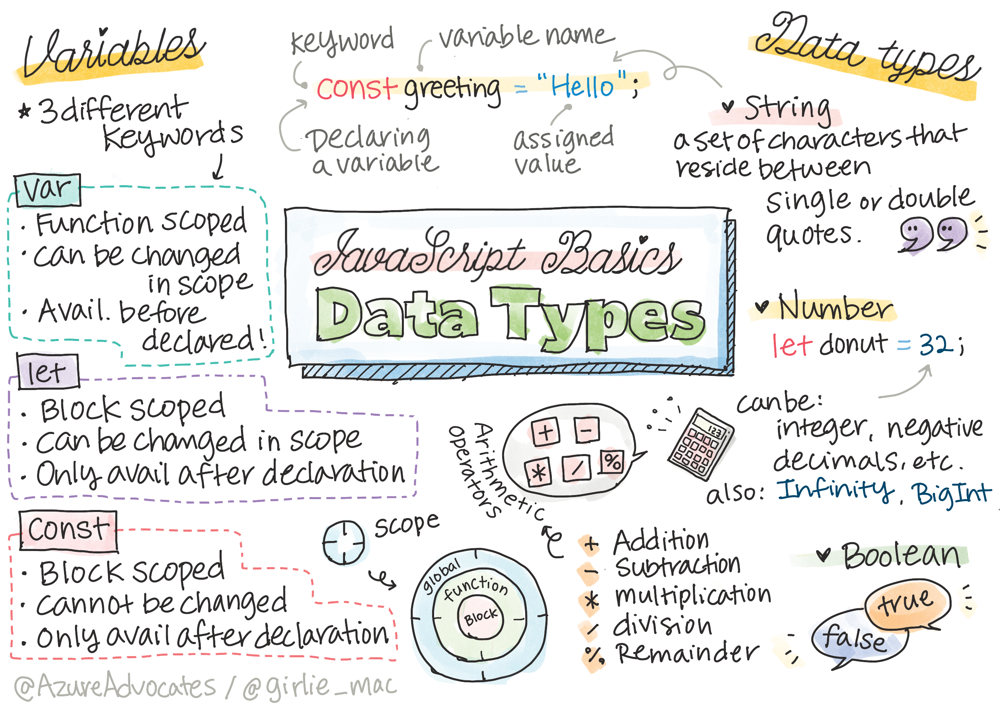

<!--
CO_OP_TRANSLATOR_METADATA:
{
  "original_hash": "b95fdd8310ef467305015ece1b0f9411",
  "translation_date": "2025-08-29T16:33:48+00:00",
  "source_file": "2-js-basics/1-data-types/README.md",
  "language_code": "pl"
}
-->
# Podstawy JavaScript: Typy danych


> Sketchnote autorstwa [Tomomi Imura](https://twitter.com/girlie_mac)

## Quiz przed wykładem
[Quiz przed wykładem](https://ff-quizzes.netlify.app/web/)

Ta lekcja obejmuje podstawy JavaScript, języka, który zapewnia interaktywność w sieci.

> Możesz przerobić tę lekcję na [Microsoft Learn](https://docs.microsoft.com/learn/modules/web-development-101-variables/?WT.mc_id=academic-77807-sagibbon)!

[](https://youtube.com/watch?v=JNIXfGiDWM8 "Zmienne w JavaScript")

[](https://youtube.com/watch?v=AWfA95eLdq8 "Typy danych w JavaScript")

> 🎥 Kliknij powyższe obrazy, aby obejrzeć filmy o zmiennych i typach danych

Zacznijmy od zmiennych i typów danych, które je wypełniają!

## Zmienne

Zmienne przechowują wartości, które mogą być używane i zmieniane w całym kodzie.

Tworzenie i **deklarowanie** zmiennej ma następującą składnię **[słowo kluczowe] [nazwa]**. Składa się z dwóch części:

- **Słowo kluczowe**. Słowa kluczowe mogą być `let` lub `var`.  

✅ Słowo kluczowe `let` zostało wprowadzone w ES6 i nadaje zmiennej tzw. _zakres blokowy_. Zaleca się używanie `let` zamiast `var`. Omówimy zakresy blokowe bardziej szczegółowo w kolejnych częściach.
- **Nazwa zmiennej**, czyli nazwa, którą wybierasz samodzielnie.

### Zadanie - praca ze zmiennymi

1. **Deklaruj zmienną**. Zadeklaruj zmienną używając słowa kluczowego `let`:

    ```javascript
    let myVariable;
    ```

   `myVariable` została teraz zadeklarowana za pomocą słowa kluczowego `let`. Obecnie nie ma przypisanej wartości.

1. **Przypisz wartość**. Przechowaj wartość w zmiennej za pomocą operatora `=`, po którym następuje oczekiwana wartość.

    ```javascript
    myVariable = 123;
    ```

   > Uwaga: użycie `=` w tej lekcji oznacza, że korzystamy z "operatora przypisania", używanego do ustawienia wartości zmiennej. Nie oznacza to równości.

   `myVariable` została teraz *zainicjalizowana* wartością 123.

1. **Refaktoryzacja**. Zastąp swój kod następującym poleceniem.

    ```javascript
    let myVariable = 123;
    ```

    Powyższe nazywa się _jawna inicjalizacja_, gdy zmienna jest deklarowana i przypisywana wartość w tym samym czasie.

1. **Zmień wartość zmiennej**. Zmień wartość zmiennej w następujący sposób:

   ```javascript
   myVariable = 321;
   ```

   Po zadeklarowaniu zmiennej możesz zmienić jej wartość w dowolnym momencie w kodzie za pomocą operatora `=` i nowej wartości.

   ✅ Spróbuj! Możesz pisać kod JavaScript bezpośrednio w swojej przeglądarce. Otwórz okno przeglądarki i przejdź do Narzędzi dla deweloperów. W konsoli znajdziesz polecenie; wpisz `let myVariable = 123`, naciśnij Enter, a następnie wpisz `myVariable`. Co się dzieje? Zauważ, że więcej o tych koncepcjach dowiesz się w kolejnych lekcjach.

## Stałe

Deklaracja i inicjalizacja stałej odbywa się według tych samych zasad co zmiennej, z wyjątkiem użycia słowa kluczowego `const`. Stałe są zazwyczaj deklarowane wielkimi literami.

```javascript
const MY_VARIABLE = 123;
```

Stałe są podobne do zmiennych, z dwoma wyjątkami:

- **Muszą mieć wartość**. Stałe muszą być zainicjalizowane, w przeciwnym razie wystąpi błąd podczas uruchamiania kodu.
- **Referencja nie może być zmieniona**. Referencja stałej nie może być zmieniona po jej zainicjalizowaniu, w przeciwnym razie wystąpi błąd podczas uruchamiania kodu. Spójrzmy na dwa przykłady:
   - **Prosta wartość**. Poniższe NIE jest dozwolone:
   
      ```javascript
      const PI = 3;
      PI = 4; // not allowed
      ```
 
   - **Referencja obiektu jest chroniona**. Poniższe NIE jest dozwolone.
   
      ```javascript
      const obj = { a: 3 };
      obj = { b: 5 } // not allowed
      ```

    - **Wartość obiektu nie jest chroniona**. Poniższe JEST dozwolone:
    
      ```javascript
      const obj = { a: 3 };
      obj.a = 5;  // allowed
      ```

      Powyżej zmieniasz wartość obiektu, ale nie jego referencję, co jest dozwolone.

   > Uwaga, `const` oznacza, że referencja jest chroniona przed ponownym przypisaniem. Wartość jednak nie jest _niezmienna_ i może się zmieniać, szczególnie jeśli jest to złożona struktura, jak obiekt.

## Typy danych

Zmienne mogą przechowywać różne typy wartości, takie jak liczby czy tekst. Te różne typy wartości są znane jako **typy danych**. Typy danych są ważnym elementem programowania, ponieważ pomagają programistom podejmować decyzje dotyczące sposobu pisania kodu i działania oprogramowania. Ponadto niektóre typy danych mają unikalne cechy, które pomagają przekształcać lub wyodrębniać dodatkowe informacje z wartości.

✅ Typy danych są również nazywane prymitywami danych JavaScript, ponieważ są to najniższe poziomy typów danych dostarczanych przez język. Istnieje 7 prymitywnych typów danych: string, number, bigint, boolean, undefined, null i symbol. Poświęć chwilę, aby wyobrazić sobie, co każdy z tych prymitywów może reprezentować. Co to jest `zebra`? A `0`? `true`?

### Liczby

W poprzedniej sekcji wartość `myVariable` była typu liczbowego.

`let myVariable = 123;`

Zmienne mogą przechowywać wszystkie typy liczb, w tym liczby dziesiętne czy ujemne. Liczby mogą być również używane z operatorami arytmetycznymi, omówionymi w [następnej sekcji](../../../../2-js-basics/1-data-types).

### Operatory arytmetyczne

Istnieje kilka typów operatorów do wykonywania funkcji arytmetycznych, a niektóre z nich są wymienione poniżej:

| Symbol | Opis                                                                     | Przykład                         |
| ------ | ------------------------------------------------------------------------ | -------------------------------- |
| `+`    | **Dodawanie**: Oblicza sumę dwóch liczb                                  | `1 + 2 //oczekiwany wynik to 3`  |
| `-`    | **Odejmowanie**: Oblicza różnicę dwóch liczb                             | `1 - 2 //oczekiwany wynik to -1` |
| `*`    | **Mnożenie**: Oblicza iloczyn dwóch liczb                                | `1 * 2 //oczekiwany wynik to 2`  |
| `/`    | **Dzielenie**: Oblicza iloraz dwóch liczb                                | `1 / 2 //oczekiwany wynik to 0.5`|
| `%`    | **Reszta**: Oblicza resztę z dzielenia dwóch liczb                       | `1 % 2 //oczekiwany wynik to 1`  |

✅ Spróbuj! Wypróbuj operację arytmetyczną w konsoli przeglądarki. Czy wyniki Cię zaskakują?

### Łańcuchy znaków (Strings)

Łańcuchy znaków to zestawy znaków umieszczone między pojedynczymi lub podwójnymi cudzysłowami.

- `'To jest łańcuch znaków'`
- `"To też jest łańcuch znaków"`
- `let myString = 'To jest wartość łańcucha znaków przechowywana w zmiennej';`

Pamiętaj, aby używać cudzysłowów podczas pisania łańcucha znaków, w przeciwnym razie JavaScript założy, że to nazwa zmiennej.

### Formatowanie łańcuchów znaków

Łańcuchy znaków są tekstowe i czasami wymagają formatowania.

Aby **konkatenować** dwa lub więcej łańcuchów znaków, czyli połączyć je, użyj operatora `+`.

```javascript
let myString1 = "Hello";
let myString2 = "World";

myString1 + myString2 + "!"; //HelloWorld!
myString1 + " " + myString2 + "!"; //Hello World!
myString1 + ", " + myString2 + "!"; //Hello, World!

```

✅ Dlaczego `1 + 1 = 2` w JavaScript, ale `'1' + '1' = 11?` Zastanów się nad tym. A co z `'1' + 1`?

**Szablony tekstowe** (template literals) to inny sposób formatowania łańcuchów znaków, z tą różnicą, że zamiast cudzysłowów używa się odwrotnego apostrofu. Wszystko, co nie jest zwykłym tekstem, musi być umieszczone w nawiasach `${ }`. Dotyczy to również zmiennych, które mogą być łańcuchami znaków.

```javascript
let myString1 = "Hello";
let myString2 = "World";

`${myString1} ${myString2}!` //Hello World!
`${myString1}, ${myString2}!` //Hello, World!
```

Możesz osiągnąć swoje cele formatowania za pomocą obu metod, ale szablony tekstowe będą respektować wszelkie spacje i łamanie linii.

✅ Kiedy użyłbyś szablonu tekstowego zamiast zwykłego łańcucha znaków?

### Booleany

Booleany mogą przyjmować tylko dwie wartości: `true` lub `false`. Booleany pomagają podejmować decyzje, które linie kodu powinny być uruchamiane, gdy spełnione są określone warunki. W wielu przypadkach [operatory](../../../../2-js-basics/1-data-types) pomagają w ustawianiu wartości Booleana i często zauważysz oraz napiszesz zmienne, które są inicjalizowane lub ich wartości są aktualizowane za pomocą operatora.

- `let myTrueBool = true`
- `let myFalseBool = false`

✅ Zmienna może być uznana za 'truthy', jeśli ocenia się jako boolean `true`. Co ciekawe, w JavaScript [wszystkie wartości są truthy, chyba że są zdefiniowane jako falsy](https://developer.mozilla.org/docs/Glossary/Truthy).

---

## 🚀 Wyzwanie

JavaScript jest znany ze swoich zaskakujących sposobów obsługi typów danych. Poszukaj informacji o tych 'pułapkach'. Na przykład: wrażliwość na wielkość liter może być problematyczna! Spróbuj tego w konsoli: `let age = 1; let Age = 2; age == Age` (rezultat `false` -- dlaczego?). Jakie inne pułapki możesz znaleźć?

## Quiz po wykładzie
[Quiz po wykładzie](https://ff-quizzes.netlify.app)

## Przegląd i samodzielna nauka

Spójrz na [tę listę ćwiczeń z JavaScript](https://css-tricks.com/snippets/javascript/) i spróbuj jednego. Czego się nauczyłeś?

## Zadanie

[Ćwiczenia z typów danych](assignment.md)

---

**Zastrzeżenie**:  
Ten dokument został przetłumaczony za pomocą usługi tłumaczenia AI [Co-op Translator](https://github.com/Azure/co-op-translator). Chociaż dokładamy wszelkich starań, aby tłumaczenie było precyzyjne, prosimy pamiętać, że automatyczne tłumaczenia mogą zawierać błędy lub nieścisłości. Oryginalny dokument w jego języku źródłowym powinien być uznawany za wiarygodne źródło. W przypadku informacji o kluczowym znaczeniu zaleca się skorzystanie z profesjonalnego tłumaczenia przez człowieka. Nie ponosimy odpowiedzialności za jakiekolwiek nieporozumienia lub błędne interpretacje wynikające z użycia tego tłumaczenia.