<!--
CO_OP_TRANSLATOR_METADATA:
{
  "original_hash": "672b0bb6e8b431075f3bdb7130590d2d",
  "translation_date": "2026-01-06T18:55:03+00:00",
  "source_file": "2-js-basics/1-data-types/README.md",
  "language_code": "pl"
}
-->
# Podstawy JavaScript: Typy danych


> Sketchnote autorstwa [Tomomi Imura](https://twitter.com/girlie_mac)

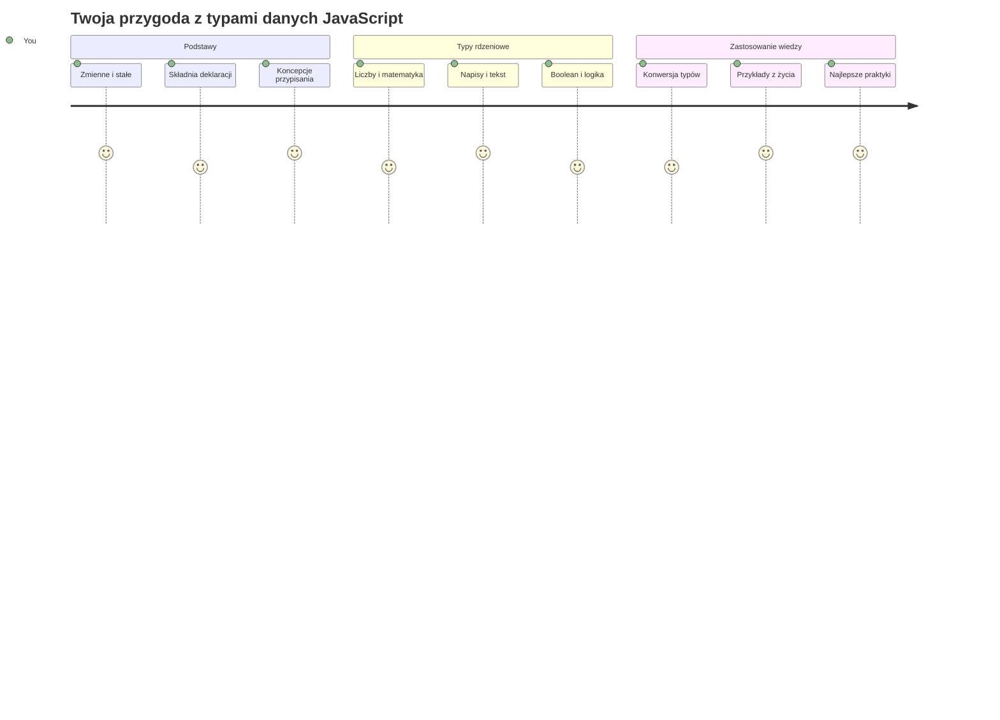
Typy danych to jedna z podstawowych koncepcji w JavaScript, z którą spotkasz się w każdym napisanym programie. Pomyśl o typach danych jak o systemie katalogowania używanym przez starożytnych bibliotekarzy w Aleksandrii – mieli oni określone miejsca na zwoje zawierające poezję, matematykę i zapisy historyczne. JavaScript organizuje informacje w podobny sposób, tworząc różne kategorie dla różnych rodzajów danych.

W tej lekcji poznasz podstawowe typy danych, które umożliwiają działanie JavaScript. Nauczysz się, jak obsługiwać liczby, tekst, wartości prawda/fałsz i zrozumiesz, dlaczego wybór właściwego typu jest kluczowy dla twoich programów. Te koncepcje mogą na początku wydawać się abstrakcyjne, ale z praktyką staną się naturalne.

Zrozumienie typów danych sprawi, że wszystko inne w JavaScript stanie się dużo jaśniejsze. Tak jak architekci muszą znać różne materiały budowlane przed zbudowaniem katedry, te podstawy będą wspierać wszystko, co zbudujesz w przyszłości.

## Quiz przed wykładem
[Pre-lecture quiz](https://ff-quizzes.netlify.app/web/)

Ta lekcja obejmuje podstawy JavaScript, języka, który zapewnia interaktywność w sieci.

> Możesz odbyć tę lekcję na platformie [Microsoft Learn](https://docs.microsoft.com/learn/modules/web-development-101-variables/?WT.mc_id=academic-77807-sagibbon)!

[](https://youtube.com/watch?v=JNIXfGiDWM8 "Variables in JavaScript")

[](https://youtube.com/watch?v=AWfA95eLdq8 "Data Types in JavaScript")

> 🎥 Kliknij powyższe obrazki, aby obejrzeć filmy o zmiennych i typach danych

Zacznijmy od zmiennych i typów danych, które je wypełniają!

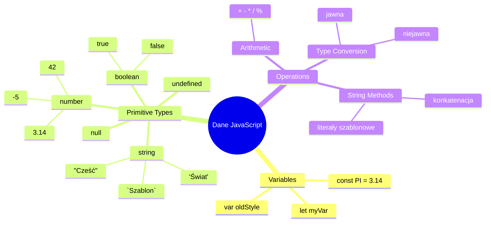
## Zmienne

Zmienne są podstawowymi elementami programowania. Podobnie jak oznakowane słoiki, których średniowieczni alchemicy używali do przechowywania różnych substancji, zmienne pozwalają przechowywać informacje i nadać im opisową nazwę, aby można było do nich odwołać się później. Potrzebujesz zapamiętać wiek kogoś? Przechowaj go w zmiennej o nazwie `age`. Chcesz śledzić nazwę użytkownika? Przechowaj ją w zmiennej `userName`.

Skupimy się na nowoczesnym podejściu do tworzenia zmiennych w JavaScript. Techniki, które tutaj poznasz, odzwierciedlają lata rozwoju języka i najlepsze praktyki wypracowane przez społeczność programistyczną.

Tworzenie i **deklarowanie** zmiennej ma następującą składnię **[keyword] [name]**. Składa się z dwóch części:

- **Słowo kluczowe**. Użyj `let` dla zmiennych, które mogą się zmieniać, lub `const` dla wartości, które pozostają niezmienne.
- **Nazwa zmiennej**, jest to opisowa nazwa wybrana przez ciebie.

✅ Słowo kluczowe `let` zostało wprowadzone w ES6 i nadaje zmiennej tzw. _zakres blokowy_. Zaleca się używanie `let` lub `const` zamiast starszego słowa `var`. W kolejnych częściach omówimy zakresy blokowe bardziej szczegółowo.

### Zadanie - praca ze zmiennymi

1. **Zadeklaruj zmienną**. Zacznijmy od utworzenia naszej pierwszej zmiennej:

    ```javascript
    let myVariable;
    ```

   **Co to osiąga:**
   - Informuje JavaScript, aby utworzył miejsce na dane o nazwie `myVariable`
   - JavaScript przydziela miejsce w pamięci dla tej zmiennej
   - Zmienna obecnie nie ma wartości (undefined)

2. **Nadaj jej wartość**. Teraz wstawmy coś do zmiennej:

    ```javascript
    myVariable = 123;
    ```

   **Jak działa przypisanie:**
   - Operator `=` przypisuje wartość 123 do zmiennej
   - Zmienna teraz zawiera tę wartość, a nie jest undefined
   - Możesz odwoływać się do tej wartości w kodzie używając `myVariable`

   > Uwaga: w tej lekcji użycie `=` oznacza "operator przypisania", który służy do ustawienia wartości zmiennej. Nie oznacza on równości.

3. **Zrób to sprytniej**. Właściwie połączmy te dwa kroki:

    ```javascript
    let myVariable = 123;
    ```

    **To podejście jest bardziej efektywne:**
    - Deklarujesz zmienną i przypisujesz jej wartość w jednym poleceniu
    - Jest to standardowa praktyka programistów
    - Skraca kod, zachowując przejrzystość

4. **Zmiana zdania**. Co jeśli chcemy przechować inną liczbę?

   ```javascript
   myVariable = 321;
   ```

   **Zrozumienie ponownego przypisania:**
   - Zmienna teraz zawiera 321 zamiast 123
   - Poprzednia wartość zostaje zastąpiona – zmienne przechowują tylko jedną wartość na raz
   - Ta zmienność jest kluczową cechą zmiennych zadeklarowanych przez `let`

   ✅ Wypróbuj sam! Możesz pisać JavaScript bezpośrednio w przeglądarce. Otwórz narzędzia deweloperskie i przejdź do konsoli. Wpisz `let myVariable = 123`, naciśnij Enter, a następnie wpisz `myVariable`. Co się stanie? Więcej o tych koncepcjach dowiesz się w kolejnych lekcjach.

### 🧠 **Sprawdzenie umiejętności ze zmiennymi: Oswajanie tematu**

**Zobaczmy, jak sobie radzisz ze zmiennymi:**
- Czy potrafisz wyjaśnić różnicę między deklarowaniem a przypisywaniem zmiennej?
- Co się stanie, jeśli spróbujesz użyć zmiennej przed jej deklaracją?
- Kiedy warto wybrać `let` zamiast `const` dla zmiennej?

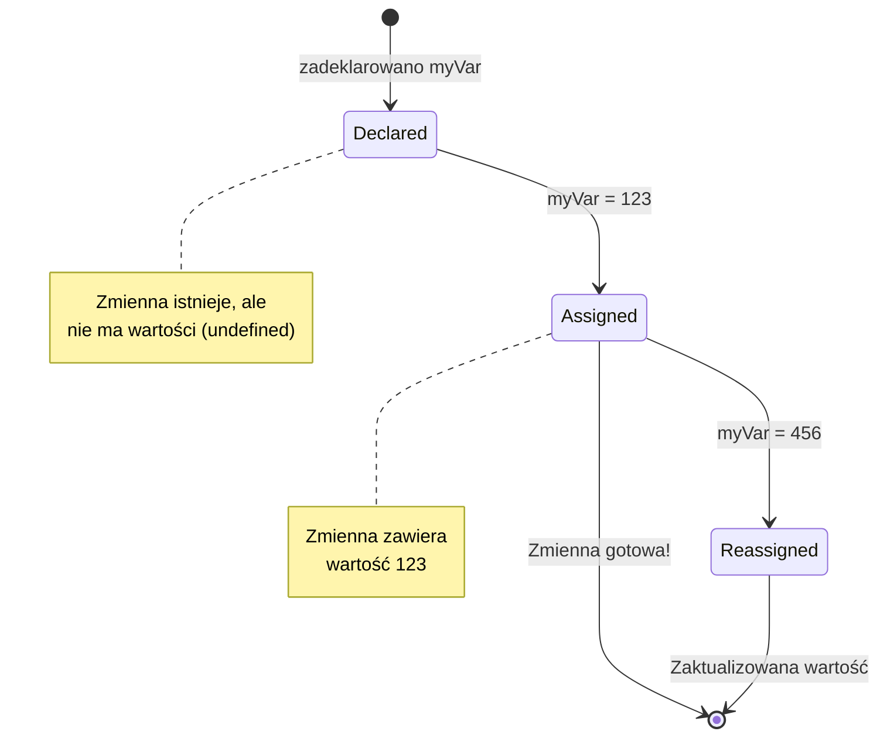
> **Szybka wskazówka**: Pomyśl o zmiennych jak o oznakowanych pudełkach na przechowywanie. Tworzysz pudełko (`let`), wkładasz do niego coś (`=`) i możesz później wymienić zawartość, jeśli trzeba!

## Stałe

Czasami trzeba przechowywać informacje, które nigdy nie powinny się zmieniać podczas działania programu. Pomysł na stałe przypomina zasady matematyczne, które Euklides ustanowił w starożytnej Grecji – raz dowiedzione i udokumentowane, pozostały niezmienne na zawsze.

Stałe działają podobnie jak zmienne, ale mają ważne ograniczenie: po przypisaniu wartości nie można jej zmienić. Ta niezmienność pomaga zapobiec przypadkowym modyfikacjom istotnych wartości w programie.

Deklaracja i inicjalizacja stałej wykorzystuje te same zasady co zmienna, z wyjątkiem słowa kluczowego `const`. Nazwy stałych zwykle są pisane wielkimi literami.

```javascript
const MY_VARIABLE = 123;
```

**Co robi ten kod:**
- **Tworzy** stałą o nazwie `MY_VARIABLE` z wartością 123
- **Używa** konwencji nazw wielkimi literami dla stałych
- **Uniemożliwia** przyszłe zmiany tej wartości

Stałe mają dwie główne zasady:

- **Musisz od razu nadać im wartość** – nie można tworzyć pustych stałych!
- **Nigdy nie możesz zmieniać tej wartości** – JavaScript zgłosi błąd, jeśli spróbujesz. Zobaczmy, co to oznacza:

   **Prosta wartość** - Następujące jest NIE DOZWOLONE:
   
      ```javascript
      const PI = 3;
      PI = 4; // niedozwolone
      ```

   **Co należy zapamiętać:**
   - **Próby** ponownego przypisania stałej spowodują błąd
   - **Chroni** ważne wartości przed przypadkowymi zmianami
   - **Zapewnia**, że wartość pozostaje spójna przez cały program
 
   **Referencja obiektu jest chroniona** - Następujące jest NIE DOZWOLONE:
   
      ```javascript
      const obj = { a: 3 };
      obj = { b: 5 } // niedozwolone
      ```

   **Zrozumienie tych zasad:**
   - **Zapobiega** zastąpieniu całego obiektu nowym
   - **Chroni** referencję do oryginalnego obiektu
   - **Utrzymuje** tożsamość obiektu w pamięci

    **Wartość obiektu nie jest chroniona** - Następujące JEST dozwolone:
    
      ```javascript
      const obj = { a: 3 };
      obj.a = 5;  // dozwolone
      ```

      **Co się tutaj dzieje:**
      - **Modyfikuje** wartość właściwości w obiekcie
      - **Zachowuje** tę samą referencję obiektu
      - **Pokazuje**, że zawartość obiektu może się zmieniać, choć referencja pozostaje stała

   > Pamiętaj, `const` oznacza, że referencja jest chroniona przed ponownym przypisaniem. Wartość nie jest _niezmienna_ i może się zmieniać, zwłaszcza jeśli jest to złożona struktura jak obiekt.

## Typy danych

JavaScript organizuje informacje w różne kategorie, zwane typami danych. Koncepcja ta odzwierciedla sposób, w jaki starożytni uczeni kategoryzowali wiedzę – Arystoteles rozróżniał różne typy rozumowania, wiedząc, że zasady logiki nie mogą być stosowane jednolicie do poezji, matematyki i filozofii przyrody.

Typy danych są ważne, ponieważ różne operacje wymagają różnych rodzajów informacji. Podobnie jak nie można wykonywać działań arytmetycznych na imieniu osoby czy uporządkować matematycznego równania alfabetycznie, JavaScript wymaga odpowiedniego typu danych dla każdej operacji. Zrozumienie tego zapobiega błędom i czyni twój kod bardziej niezawodnym.

Zmienne mogą przechowywać wiele różnych typów wartości, jak liczby czy tekst. Te różne typy wartości nazywane są **typem danych**. Typy danych są ważną częścią tworzenia oprogramowania, ponieważ pomagają programistom podejmować decyzje, jak kod powinien być napisany i jak oprogramowanie ma działać. Ponadto niektóre typy danych mają unikalne cechy pomagające przekształcać lub wydobywać dodatkowe informacje z wartości.

✅ Typy danych nazywane są również prymitywami języka JavaScript, ponieważ są to podstawowe, najniższego poziomu typy dostarczane przez język. Istnieje 7 prymitywnych typów danych: string, number, bigint, boolean, undefined, null i symbol. Poświęć chwilę, aby wyobrazić sobie, co każdy z tych prymitywów może reprezentować. Czym jest `zebra`? A `0`? `true`?

### Liczby

Liczby to najprostszy typ danych w JavaScript. Niezależnie od tego, czy pracujesz z liczbami całkowitymi jak 42, liczbami dziesiętnymi jak 3.14, czy liczbami ujemnymi jak -5, JavaScript traktuje je jednolicie.

Pamiętasz zmienną z poprzednich przykładów? Ta 123, którą zapamiętaliśmy, to właściwie typ danych liczbowych:

```javascript
let myVariable = 123;
```

**Kluczowe cechy:**
- JavaScript automatycznie rozpoznaje wartości liczbowe
- Możesz wykonywać operacje matematyczne na tych zmiennych
- Nie jest wymagana jawna deklaracja typu

Zmienne mogą przechowywać wszystkie typy liczb, wliczając liczby dziesiętne czy ujemne. Liczby mogą być także używane z operatorami arytmetycznymi, które omówimy w [kolejnym rozdziale](../../../../2-js-basics/1-data-types).

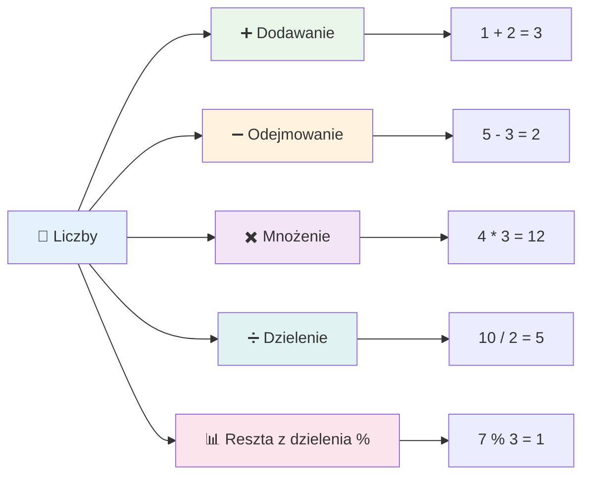
### Operatory arytmetyczne

Operatory arytmetyczne pozwalają wykonywać obliczenia matematyczne w JavaScript. Działają one według tych samych zasad, których używali matematycy przez wieki – tych samych symboli, jakie pojawiały się w dziełach uczonych takich jak Al-Khwarizmi, który rozwinął notację algebraiczną.

Operatory działają tak, jak można się spodziewać po tradycyjnej matematyce: plus do dodawania, minus do odejmowania i tak dalej.

Istnieje kilka typów operatorów używanych do wykonywania funkcji arytmetycznych, niektóre z nich to:

| Symbol | Opis                                                                   | Przykład                       |
| ------ | ---------------------------------------------------------------------- | ----------------------------- |
| `+`    | **Dodawanie**: Oblicza sumę dwóch liczb                               | `1 + 2 //oczekiwany wynik 3`  |
| `-`    | **Odejmowanie**: Oblicza różnicę między dwiema liczbami               | `1 - 2 //oczekiwany wynik -1` |
| `*`    | **Mnożenie**: Oblicza iloczyn dwóch liczb                             | `1 * 2 //oczekiwany wynik 2`  |
| `/`    | **Dzielenie**: Oblicza iloraz dwóch liczb                             | `1 / 2 //oczekiwany wynik 0.5`|
| `%`    | **Reszta z dzielenia**: Oblicza resztę z dzielenia dwóch liczb        | `1 % 2 //oczekiwany wynik 1`  |

✅ Wypróbuj! Spróbuj wykonać operację arytmetyczną w konsoli przeglądarki. Czy wyniki cię zaskoczyły?

### 🧮 **Sprawdzenie umiejętności matematycznych: Liczenie z pewnością**

**Przetestuj swoją wiedzę o arytmetyce:**
- Jaka jest różnica między `/` (dzielenie) a `%` (reszta z dzielenia)?
- Czy możesz przewidzieć, ile wynosi `10 % 3`? (Podpowiedź: to nie 3.33...)
- Dlaczego operator reszty może być przydatny w programowaniu?

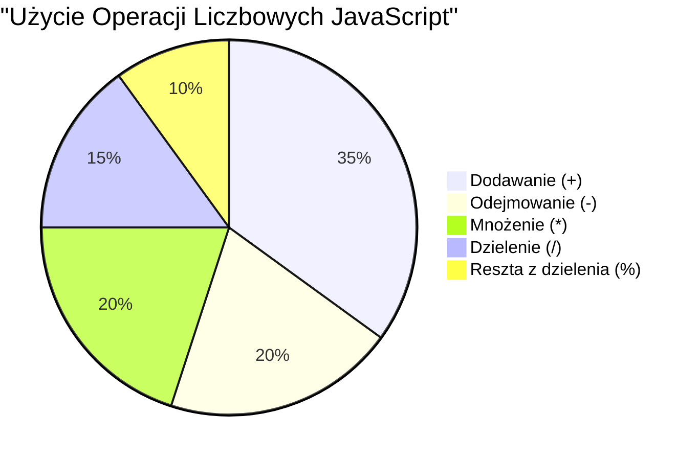
> **Wskazówka z życia:** Operator reszty (%) jest bardzo przydatny do sprawdzania, czy liczby są parzyste/nieparzyste, tworzenia wzorów lub przechodzenia przez tablice!

### Łańcuchy tekstowe (Strings)

W JavaScript dane tekstowe reprezentowane są jako łańcuchy znaków (strings). Termin „string” pochodzi od koncepcji znaków połączonych w sekwencję, podobnie jak skrybowie w średniowiecznych klasztorach łączyli litery w słowa i zdania w swoich rękopisach.

Łańcuchy znaków są podstawą tworzenia stron internetowych. Każdy fragment tekstu wyświetlany na stronie – nazwy użytkowników, podpisy przycisków, komunikaty o błędach, treści – jest obsługiwany jako dane typu string. Zrozumienie łańcuchów jest niezbędne do tworzenia funkcjonalnych interfejsów użytkownika.

Łańcuchy to zestaw znaków znajdujących się między pojedynczymi lub podwójnymi cudzysłowami.

```javascript
'This is a string'
"This is also a string"
let myString = 'This is a string value stored in a variable';
```

**Co warto wiedzieć:**
- Do definiowania łańcuchów używa się pojedynczych `'` lub podwójnych `"` cudzysłowów
- Przechowują dane tekstowe, które mogą zawierać litery, liczby i symbole
- Przypisuje się je do zmiennych, aby można było ich potem używać
- Wymagają cudzysłowów, by odróżnić tekst od nazw zmiennych

Pamiętaj o używaniu cudzysłowów przy zapisie łańcuchów, w przeciwnym razie JavaScript założy, że jest to nazwa zmiennej.

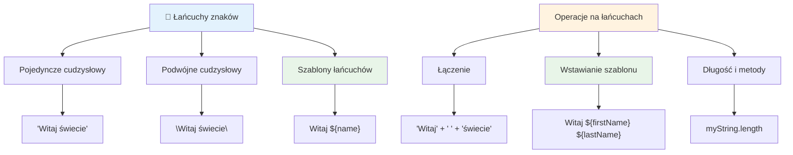
### Formatowanie łańcuchów

Manipulacja łańcuchami pozwala łączyć tekst, włączać zmienne i tworzyć dynamiczne treści reagujące na stan programu. Ta technika umożliwia tworzenie tekstu programowo.

Często potrzebujesz połączyć kilka łańcuchów razem – ten proces nazywa się konkatenacją.
Aby **łączyć** dwa lub więcej łańcuchów znaków, lub scalić je razem, użyj operatora `+`.

```javascript
let myString1 = "Hello";
let myString2 = "World";

myString1 + myString2 + "!"; //WitajŚwiecie!
myString1 + " " + myString2 + "!"; //Witaj Świecie!
myString1 + ", " + myString2 + "!"; //Witaj, Świecie!
```

**Krok po kroku, oto co się dzieje:**
- **Łączy** wiele łańcuchów znaków za pomocą operatora `+`
- **Scala** łańcuchy bezpośrednio razem bez spacji w pierwszym przykładzie
- **Dodaje** znaki spacji `" "` między łańcuchami dla czytelności
- **Wstawia** znaki interpunkcyjne, takie jak przecinki, aby utworzyć właściwe formatowanie

✅ Dlaczego `1 + 1 = 2` w JavaScript, ale `'1' + '1' = 11`? Pomyśl o tym. A co z `'1' + 1`?

**Szablonowe literały** to inny sposób formatowania łańcuchów, z tą różnicą, że zamiast cudzysłowu używa się tyldy odwrotnej (backtick). Wszystko, co nie jest zwykłym tekstem, musi być umieszczone wewnątrz nawiasów `${ }`. Obejmuje to wszelkie zmienne, które mogą być łańcuchami znaków.

```javascript
let myString1 = "Hello";
let myString2 = "World";

`${myString1} ${myString2}!` //Witaj, świecie!
`${myString1}, ${myString2}!` //Witaj, świecie!
```

**Zrozummy każdą część:**
- **Używa** tyld odwrotnych `` ` `` zamiast zwykłych cudzysłowów do tworzenia literałów szablonowych
- **Wstawia** zmienne bezpośrednio za pomocą składni `${}`
- **Zachowuje** spacje i formatowanie dokładnie takie, jakie zostało napisane
- **Zapewnia** czytelniejszy sposób tworzenia złożonych łańcuchów znaków ze zmiennymi

Możesz osiągnąć swoje cele formatowania obydwoma metodami, ale literały szablonowe zachowują wszystkie spacje i łamanie linii.

✅ Kiedy używałbyś literału szablonowego zamiast zwykłego łańcucha znaków?

### 🔤 **Sprawdzenie mistrzostwa łańcuchów: Pewność manipulacji tekstem**

**Oceń swoje umiejętności pracy z łańcuchami:**
- Czy potrafisz wyjaśnić, dlaczego `'1' + '1'` daje `'11'` zamiast `2`?
- Która metoda łańcucha jest dla Ciebie bardziej czytelna: konkatenacja czy literały szablonowe?
- Co się stanie, jeśli zapomnisz cudzysłowów wokół łańcucha?

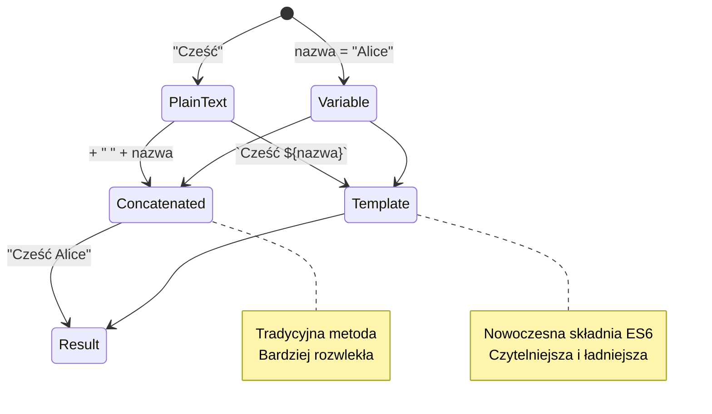
> **Wskazówka eksperta:** Literały szablonowe są zazwyczaj preferowane do złożonego budowania łańcuchów, ponieważ są bardziej czytelne i doskonale obsługują wielolinijkowe teksty!

### Booleany

Booleany reprezentują najprostszy rodzaj danych: mogą przyjmować tylko jedną z dwóch wartości – `true` lub `false`. Ten binarny system logiczny jest wywiedziony z prac George'a Boole'a, matematyka XIX wieku, który opracował algebrę Boole'a.

Pomimo swojej prostoty booleany są niezbędne dla logiki programu. Umożliwiają Twojemu kodowi podejmowanie decyzji na podstawie warunków – na przykład, czy użytkownik jest zalogowany, czy kliknięto przycisk, albo czy spełnione są określone kryteria.

Booleany mogą mieć tylko dwie wartości: `true` lub `false`. Pomagają podejmować decyzje o tym, które fragmenty kodu powinny się wykonać, gdy dane warunki zostaną spełnione. W wielu przypadkach [operatory](../../../../2-js-basics/1-data-types) pomagają ustawić wartość Boolean i często zauważysz, że zmienne są inicjowane lub ich wartości aktualizowane za pomocą operatorów.

```javascript
let myTrueBool = true;
let myFalseBool = false;
```

**Powyżej:**
- **Utworzyliśmy** zmienną przechowującą wartość Boolean `true`
- **Pokażemy**, jak przechowywać wartość Boolean `false`
- **Użyliśmy** dokładnych słów kluczowych `true` i `false` (nie wymagają cudzysłowów)
- **Przygotowaliśmy** te zmienne do użycia w instrukcjach warunkowych

✅ Zmienna jest uważana za 'truthy', jeśli ocenia się na wartość Boolean `true`. Co ciekawe, w JavaScript [wszystkie wartości są truthy, chyba że zdefiniowane jako falsy](https://developer.mozilla.org/docs/Glossary/Truthy).

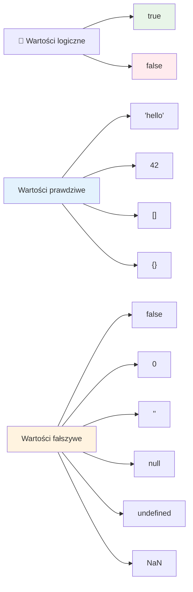
### 🎯 **Sprawdzenie logiki Boolean: Umiejętność podejmowania decyzji**

**Przetestuj swoją wiedzę o booleanach:**
- Dlaczego, Twoim zdaniem, JavaScript ma wartości „truthy” i „falsy” oprócz zwykłych `true` i `false`?
- Czy potrafisz przewidzieć, która z wartości jest falsy: `0`, `"0"`, `[]`, `"false"`?
- W jaki sposób booleany mogą być użyteczne w kontrolowaniu przepływu programu?

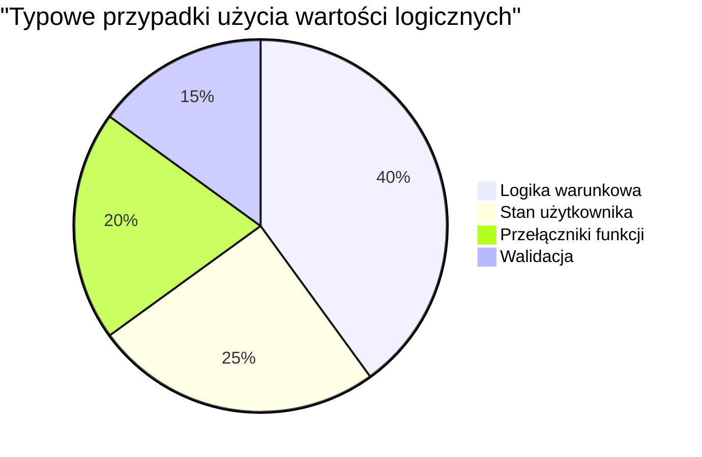
> **Pamiętaj:** W JavaScript tylko 6 wartości jest falsy: `false`, `0`, `""`, `null`, `undefined` oraz `NaN`. Wszystko inne jest truthy!

---

## 📊 **Podsumowanie Twojego zestawu typów danych**

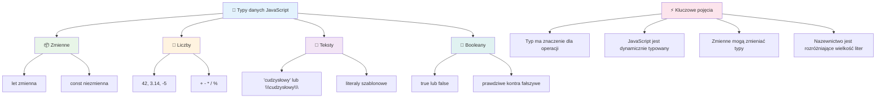
## Wyzwanie GitHub Copilot Agent 🚀

Użyj trybu Agenta, aby wykonać następujące wyzwanie:

**Opis:** Stwórz menedżera informacji osobistych, który demonstruje wszystkie typy danych JavaScript, których nauczyłeś się na tej lekcji, obsługując przy tym realne scenariusze danych.

**Polecenie:** Zbuduj program JavaScript, który tworzy obiekt profilu użytkownika zawierający: imię i nazwisko (string), wiek (number), status studenta (boolean), ulubione kolory jako tablicę oraz obiekt adresu z właściwościami ulica, miasto i kod pocztowy. Dodaj funkcje do wyświetlania informacji z profilu oraz aktualizacji poszczególnych pól. Pokaż zastosowanie konkatenacji łańcuchów, literałów szablonowych, operacji arytmetycznych na wieku oraz logiki boolean dla statusu studenta.

Dowiedz się więcej o [trybie agenta](https://code.visualstudio.com/blogs/2025/02/24/introducing-copilot-agent-mode) tutaj.

## 🚀 Wyzwanie

JavaScript ma pewne zachowania, które mogą zaskoczyć programistów. Oto klasyczny przykład do eksploracji: spróbuj wpisać to w konsoli przeglądarki: `let age = 1; let Age = 2; age == Age` i obserwuj wynik. Zwraca `false` – czy potrafisz wyjaśnić dlaczego?

To jedno z wielu zachowań JavaScript, które warto zrozumieć. Znajomość tych niuansów pomoże Ci pisać bardziej niezawodny kod i skuteczniej debugować problemy.

## Quiz po wykładzie
[Quiz po wykładzie](https://ff-quizzes.netlify.app)

## Powtórka i samodzielna nauka

Spójrz na [listę ćwiczeń JavaScript](https://css-tricks.com/snippets/javascript/) i spróbuj jednego. Czego się nauczyłeś?

## Zadanie

[Praktyka z typami danych](assignment.md)

## 🚀 Twoja oś czasu opanowania typów danych w JavaScript

### ⚡ **Co możesz zrobić w ciągu następnych 5 minut**
- [ ] Otwórz konsolę przeglądarki i utwórz 3 zmienne o różnych typach danych
- [ ] Spróbuj wyzwania: `let age = 1; let Age = 2; age == Age` i zrozum, dlaczego wynik jest false
- [ ] Poćwicz konkatenację łańcuchów ze swoim imieniem i ulubioną liczbą
- [ ] Sprawdź, co się stanie, gdy dodasz liczbę do łańcucha znaków

### 🎯 **Co możesz osiągnąć w ciągu tej godziny**
- [ ] Wypełnij quiz po lekcji i przejrzyj wszelkie niejasne koncepcje
- [ ] Stwórz mini kalkulator dodający, odejmujący, mnożący i dzielący dwie liczby
- [ ] Zbuduj prosty formatownik imion używając literałów szablonowych
- [ ] Zbadaj różnice między operatorami porównania `==` i `===`
- [ ] Ćwicz konwersję między różnymi typami danych

### 📅 **Twoja tygodniowa podstawa JavaScript**
- [ ] Wykonaj zadanie z pewnością i kreatywnością
- [ ] Stwórz obiekt profilu osobistego używając wszystkich poznanych typów danych
- [ ] Ćwicz z [ćwiczeniami JavaScript od CSS-Tricks](https://css-tricks.com/snippets/javascript/)
- [ ] Zbuduj prosty walidator formularza używając logiki boolean
- [ ] Eksperymentuj z typami danych tablic i obiektów (zapowiedź nadchodzących lekcji)
- [ ] Dołącz do społeczności JavaScript i zadawaj pytania dotyczące typów danych

### 🌟 **Twoja miesięczna transformacja**
- [ ] Włącz wiedzę o typach danych do większych projektów programistycznych
- [ ] Zrozum, kiedy i dlaczego używać każdego typu danych w rzeczywistych aplikacjach
- [ ] Pomagaj innym początkującym zrozumieć podstawy JavaScript
- [ ] Zbuduj małą aplikację zarządzającą różnymi typami danych użytkownika
- [ ] Zbadaj zaawansowane koncepcje typów danych, takie jak koercja typów i ścisła równość
- [ ] Wspieraj projekty open source JavaScript, poprawiając dokumentację

### 🧠 **Ostateczne sprawdzenie mistrzostwa typów danych**

**Świętuj swoje fundamenty JavaScript:**
- Który typ danych najbardziej Cię zaskoczył pod względem zachowania?
- Jak komfortowo czujesz się wyjaśniając zmienne vs. stałe znajomemu?
- Jaka najciekawsza rzecz odkryłeś o systemie typów JavaScript?
- Jaką rzeczywistą aplikację wyobrażasz sobie zbudować z wykorzystaniem tych podstaw?

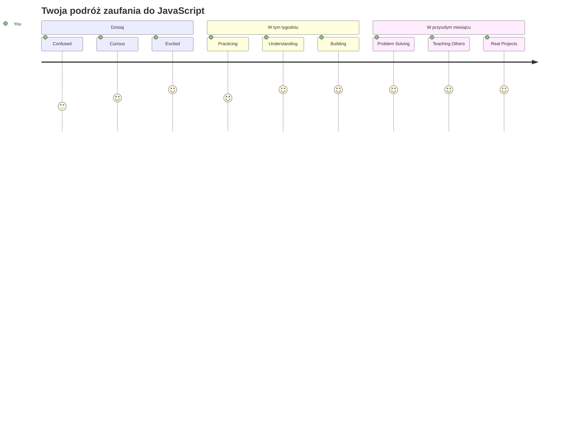
> 💡 **Zbudowałeś fundament!** Rozumienie typów danych jest jak nauka alfabetu przed pisaniem opowiadań. Każdy program JavaScript, jaki kiedykolwiek napiszesz, będzie korzystał z tych podstawowych pojęć. Masz teraz podstawy, by tworzyć interaktywne strony, dynamiczne aplikacje i rozwiązywać problemy rzeczywistego świata przy pomocy kodu. Witamy w cudownym świecie JavaScript! 🎉

---

<!-- CO-OP TRANSLATOR DISCLAIMER START -->
**Zastrzeżenie**:  
Niniejszy dokument został przetłumaczony przy użyciu usługi tłumaczenia AI [Co-op Translator](https://github.com/Azure/co-op-translator). Choć dążymy do jak największej dokładności, prosimy mieć na uwadze, że tłumaczenia automatyczne mogą zawierać błędy lub nieścisłości. Oryginalny dokument w języku źródłowym powinien być traktowany jako źródło wiążące. W przypadku informacji o kluczowym znaczeniu zaleca się skorzystanie z profesjonalnego tłumaczenia wykonanego przez człowieka. Nie ponosimy odpowiedzialności za jakiekolwiek nieporozumienia lub błędne interpretacje wynikające z korzystania z tego tłumaczenia.
<!-- CO-OP TRANSLATOR DISCLAIMER END -->