<!--
CO_OP_TRANSLATOR_METADATA:
{
  "original_hash": "71f7d7dafa1c7194d79ddac87f669ff9",
  "translation_date": "2026-01-06T18:52:31+00:00",
  "source_file": "2-js-basics/2-functions-methods/README.md",
  "language_code": "pl"
}
-->
# Podstawy JavaScript: Metody i funkcje

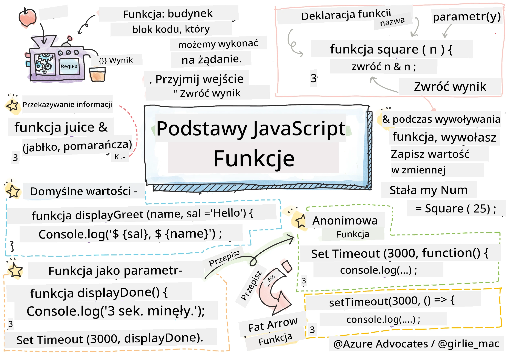
> Sketchnota autorstwa [Tomomi Imura](https://twitter.com/girlie_mac)

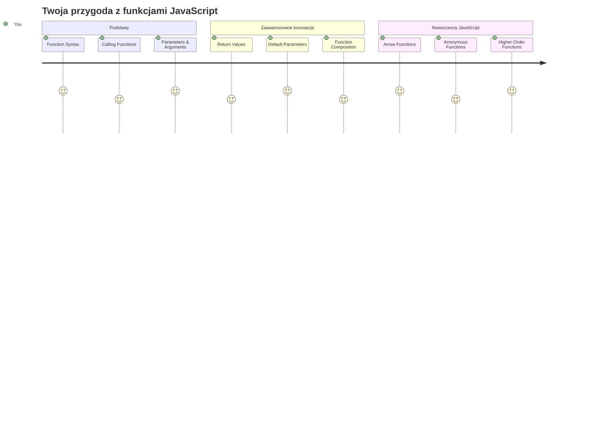
## Quiz przed wykładem
[Quiz przed wykładem](https://ff-quizzes.netlify.app)

Pisanie tego samego kodu wielokrotnie to jedna z najczęstszych frustracji programowania. Funkcje rozwiązują ten problem, pozwalając zapakować kod w wielokrotnego użytku bloki. Pomyśl o funkcjach jak o standardowych częściach, które uczyniły linię montażową Henry’ego Forda rewolucyjną – gdy stworzysz niezawodny komponent, możesz go używać wszędzie tam, gdzie potrzebujesz, bez konieczności tworzenia od nowa.

Funkcje pozwalają zgrupować kawałki kodu, abyś mógł korzystać z nich w całym swoim programie. Zamiast kopiować i wklejać tę samą logikę wszędzie, możesz stworzyć funkcję raz i wywołać ją kiedy tylko trzeba. To podejście utrzymuje twój kod uporządkowany i znacznie ułatwia aktualizacje.

W tej lekcji nauczysz się, jak tworzyć własne funkcje, przekazywać im informacje i otrzymywać przydatne wyniki. Odkryjesz różnicę pomiędzy funkcjami a metodami, poznasz nowoczesne składnie i zobaczysz, jak funkcje mogą współpracować z innymi funkcjami. Będziemy budować te pojęcia krok po kroku.

[](https://youtube.com/watch?v=XgKsD6Zwvlc "Metody i funkcje")

> 🎥 Kliknij powyższy obraz, aby obejrzeć film o metodach i funkcjach.

> Możesz też przerobić tę lekcję na [Microsoft Learn](https://docs.microsoft.com/learn/modules/web-development-101-functions/?WT.mc_id=academic-77807-sagibbon)!

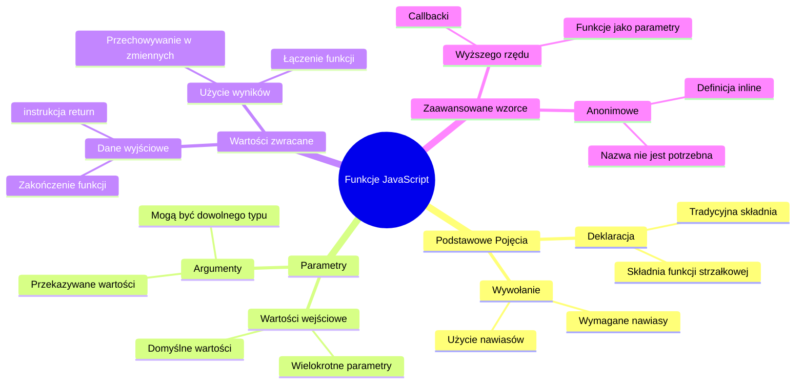
## Funkcje

Funkcja to samodzielny blok kodu, który wykonuje określone zadanie. Enkapsuluje logikę, którą możesz wywołać w dowolnym momencie.

Zamiast pisać ten sam kod wiele razy w programie, możesz zapakować go w funkcję i wywoływać ją, kiedy potrzebujesz. To podejście utrzymuje twój kod czysty i ułatwia aktualizacje. Wyobraź sobie wyzwanie utrzymania, gdybyś musiał zmienić logikę rozproszoną w 20 różnych miejscach w bazie kodu.

Nadawanie funkcjom opisowych nazw jest kluczowe. Dobrze nazwana funkcja jasno komunikuje swój cel – gdy widzisz `cancelTimer()`, od razu rozumiesz, co robi, tak jak wyraźnie oznaczony przycisk mówi ci dokładnie, co się stanie po kliknięciu. 

## Tworzenie i wywoływanie funkcji

Przyjrzyjmy się, jak stworzyć funkcję. Składnia ma spójny wzór:

```javascript
function nameOfFunction() { // definicja funkcji
 // definicja/ciało funkcji
}
```

Rozbijmy to na części:
- Słowo kluczowe `function` mówi JavaScriptowi „Hej, tworzę funkcję!”
- `nameOfFunction` to miejsce, gdzie nadajesz funkcji opisową nazwę
- Nawiasy `()` to miejsce na parametry (wkrótce o tym opowiemy)
- Nawiasy klamrowe `{}` zawierają kod, który wykonuje się, gdy wywołasz funkcję

Stwórzmy prostą funkcję powitania, aby zobaczyć to w praktyce:

```javascript
function displayGreeting() {
  console.log('Hello, world!');
}
```

Ta funkcja wypisuje „Hello, world!” w konsoli. Po jej zdefiniowaniu możesz jej używać tyle razy, ile potrzebujesz.

Aby wykonać (czyli „wywołać”) funkcję, napisz jej nazwę, a potem nawiasy. JavaScript pozwala na definicję funkcji przed lub po jej wywołaniu – silnik JavaScript zajmie się kolejnością wykonania.

```javascript
// wywołanie naszej funkcji
displayGreeting();
```

Kiedy uruchomisz tę linię, wykona cały kod znajdujący się w funkcji `displayGreeting`, wyświetlając „Hello, world!” w konsoli przeglądarki. Możesz wywoływać tę funkcję wielokrotnie.

### 🧠 **Podstawy funkcji: Budowanie pierwszych funkcji**

**Sprawdźmy twoją wiedzę na temat podstawowych funkcji:**
- Dlaczego używamy nawiasów klamrowych `{}` w definicjach funkcji?
- Co się stanie, jeśli napiszesz `displayGreeting` bez nawiasów?
- Dlaczego możesz chcieć wywołać tę samą funkcję wielokrotnie?

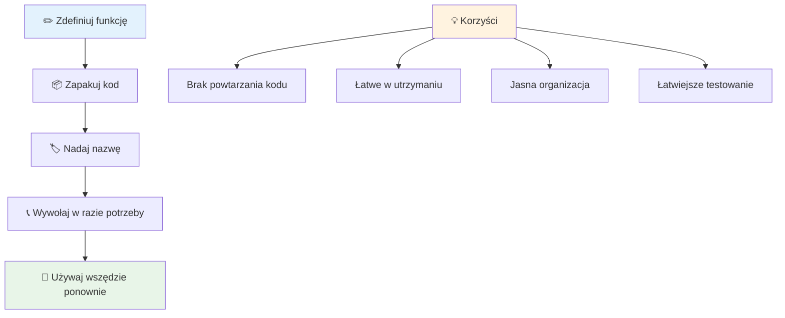
> **Uwaga:** W tych lekcjach używałeś **metod**. `console.log()` to metoda – funkcja należąca do obiektu `console`. Kluczowa różnica jest taka, że metody są przypięte do obiektów, a funkcje działają samodzielnie. Wielu programistów używa tych terminów zamiennie w rozmowach potocznych.

### Najlepsze praktyki dla funkcji

Oto kilka wskazówek, które pomogą ci pisać świetne funkcje:

- Nadaj funkcjom jasne, opisowe nazwy – twoja przyszła ja powie ci dzięki!
- Stosuj **camelCase** dla wielowyrazowych nazw (np. `calculateTotal` zamiast `calculate_total`)
- Każda funkcja powinna skupiać się na wykonywaniu jednej rzeczy dobrze

## Przekazywanie informacji do funkcji

Nasza funkcja `displayGreeting` jest ograniczona – zawsze wyświetla „Hello, world!”. Parametry pozwalają uczynić funkcje bardziej elastycznymi i użytecznymi.

**Parametry** działają jak miejsca zastępcze, do których możesz wstawić różne wartości za każdym razem, gdy używasz funkcji. Dzięki temu ta sama funkcja może pracować z różnymi informacjami przy każdym wywołaniu.

Parametry wypisujesz w nawiasach przy definiowaniu funkcji, oddzielając je przecinkami:

```javascript
function name(param, param2, param3) {

}
```

Każdy parametr działa jak symbol zastępczy – gdy ktoś wywoła twoją funkcję, poda faktyczne wartości, które zostaną tam „wstawione”.

Zaktualizujmy funkcję powitania, aby przyjmowała czyjeś imię:

```javascript
function displayGreeting(name) {
  const message = `Hello, ${name}!`;
  console.log(message);
}
```

Zauważ, że używamy backticków (`` ` ``) oraz `${}`, aby wstawić imię bezpośrednio do wiadomości – to nazywa się literałem szablonowym i jest bardzo wygodnym sposobem łączenia tekstu z zmiennymi.

Teraz, gdy wywołamy funkcję, możemy podać dowolne imię:

```javascript
displayGreeting('Christopher');
// wyświetla "Witaj, Christopher!" po uruchomieniu
```

JavaScript przyjmuje ciąg znaków `'Christopher'`, przypisuje go do parametru `name` i tworzy spersonalizowaną wiadomość „Hello, Christopher!”

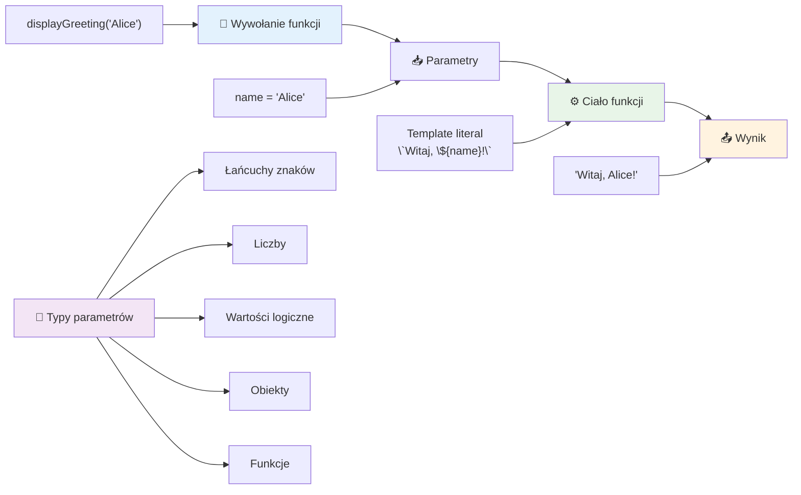
## Wartości domyślne

A co jeśli chcemy, by niektóre parametry były opcjonalne? W tym pomagają wartości domyślne!

Załóżmy, że chcemy umożliwić ludziom personalizację słowa powitania, ale jeśli nie podadzą żadnego, używamy domyślnie „Hello”. Możesz ustawić wartości domyślne, używając znaku równości, tak jak przy przypisywaniu zmiennej:

```javascript
function displayGreeting(name, salutation='Hello') {
  console.log(`${salutation}, ${name}`);
}
```

Tu `name` jest nadal wymagane, ale `salutation` ma zapasową wartość `'Hello'`, jeśli nikt nie poda innego powitania.

Teraz możemy wywołać tę funkcję na dwa sposoby:

```javascript
displayGreeting('Christopher');
// wyświetla "Hello, Christopher"

displayGreeting('Christopher', 'Hi');
// wyświetla "Hi, Christopher"
```

W pierwszym wywołaniu JavaScript używa domyślnego „Hello”, ponieważ nie określiliśmy powitania. W drugim używa naszego spersonalizowanego „Hi”. Ta elastyczność sprawia, że funkcje są dopasowane do różnych sytuacji.

### 🎛️ **Sprawdzenie umiejętności parametrów: Uczynienie funkcji elastycznymi**

**Przetestuj swoją wiedzę o parametrach:**
- Jaka jest różnica między parametrem a argumentem?
- Dlaczego wartości domyślne są przydatne w rzeczywistym programowaniu?
- Czy przewidzisz, co się stanie, jeśli podasz więcej argumentów niż parametrów?

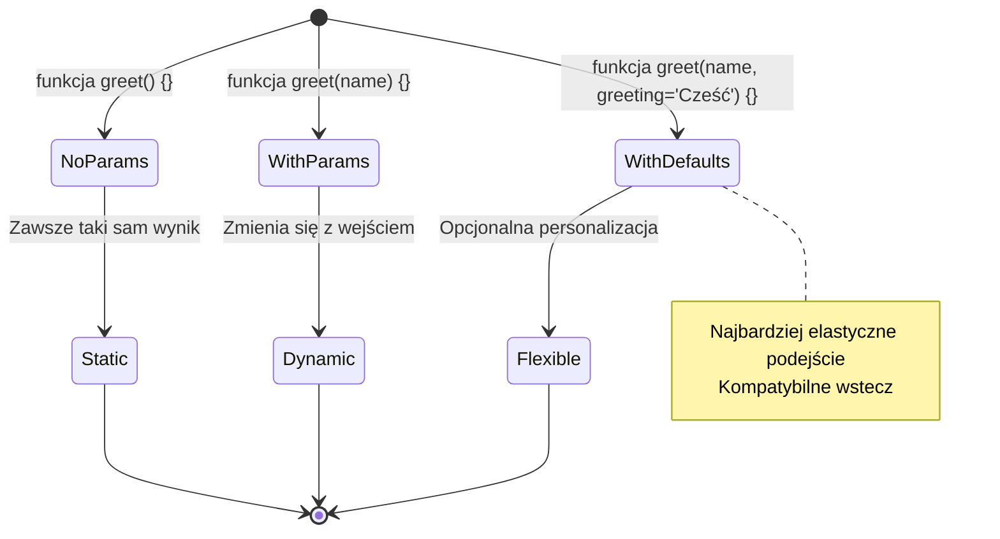
> **Profesjonalna wskazówka**: Parametry domyślne czynią twoje funkcje bardziej przyjaznymi dla użytkownika. Można szybko zacząć korzystać z rozsądnych wartości początkowych, ale nadal dostosować je w razie potrzeby!

## Wartości zwracane

Dotychczas nasze funkcje tylko wypisywały komunikaty w konsoli, ale co jeśli chcesz, aby funkcja wykonała obliczenia i zwróciła wynik?

W tym pomagają **wartości zwracane**. Zamiast tylko wyświetlać coś, funkcja może zwrócić wartość, którą możesz przechować w zmiennej lub użyć w innych miejscach kodu.

Aby zwrócić wartość, używasz słowa kluczowego `return`, po którym podajesz, co chcesz zwrócić:

```javascript
return myVariable;
```

Ważne: gdy funkcja napotka instrukcję `return`, natychmiast przestaje działać i zwraca tę wartość temu, kto ją wywołał.

Zmodyfikujmy naszą funkcję powitania, aby zwracała komunikat zamiast go wypisywać:

```javascript
function createGreetingMessage(name) {
  const message = `Hello, ${name}`;
  return message;
}
```

Teraz zamiast wypisywać powitanie, funkcja tworzy wiadomość i ją zwraca.

Aby użyć zwróconej wartości, możemy ją zapisać do zmiennej jak każdą inną wartość:

```javascript
const greetingMessage = createGreetingMessage('Christopher');
```

Teraz `greetingMessage` zawiera „Hello, Christopher” i możemy jej używać w dowolnym miejscu w kodzie – pokazać na stronie, wysłać w mailu lub przekazać do innej funkcji.

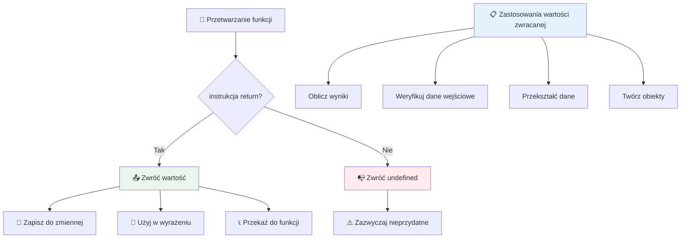
### 🔄 **Sprawdzian wartości zwracanych: Otrzymywanie wyników**

**Oceń swoją wiedzę o zwracaniu wartości:**
- Co się dzieje z kodem po instrukcji `return` wewnątrz funkcji?
- Dlaczego zwracanie wartości często jest lepsze niż samo wypisanie w konsoli?
- Czy funkcja może zwracać różne typy wartości (string, liczba, boolean)?

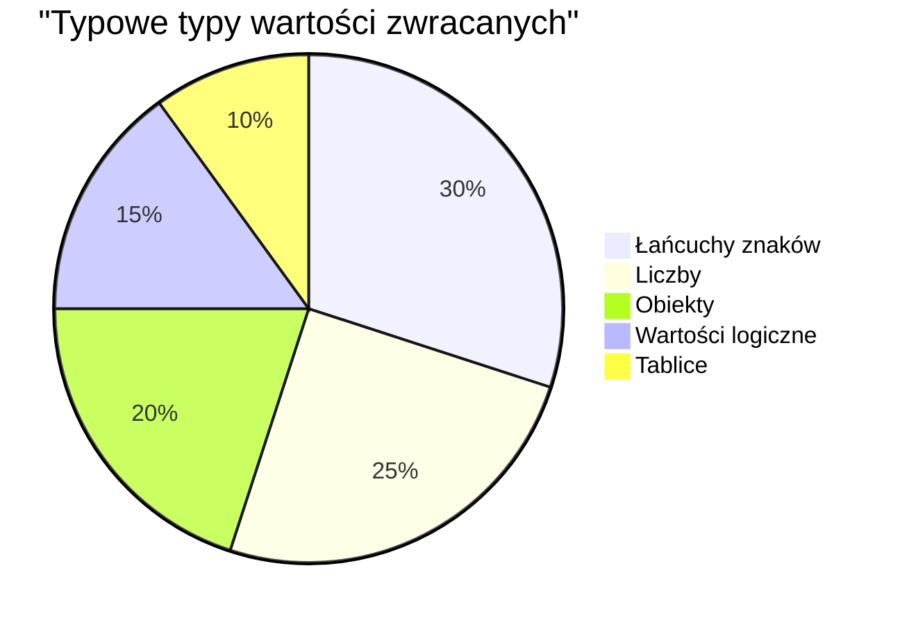
> **Kluczowa uwaga**: Funkcje zwracające wartości są bardziej wszechstronne, ponieważ wywołujący decyduje, co zrobić z wynikiem. To sprawia, że kod jest bardziej modularny i wielokrotnego użytku!

## Funkcje jako parametry funkcji

Funkcje mogą być przekazywane jako parametry do innych funkcji. Choć ten koncept może się wydawać na początku skomplikowany, jest to potężna cecha umożliwiająca elastyczne wzorce programistyczne.

Ten wzorzec jest bardzo powszechny, gdy chcesz powiedzieć „gdy coś się stanie, wykonaj coś innego.” Na przykład: „gdy timer się zakończy, wykonaj ten kod” lub „gdy użytkownik kliknie przycisk, wywołaj tę funkcję”.

Spójrzmy na `setTimeout`, który jest wbudowaną funkcją, która czeka określony czas i potem wykonuje jakiś kod. Musimy powiedzieć, co ma wykonać – idealny przykład przekazania funkcji!

Wypróbuj ten kod – po 3 sekundach zobaczysz komunikat:

```javascript
function displayDone() {
  console.log('3 seconds has elapsed');
}
// wartość timera jest w milisekundach
setTimeout(displayDone, 3000);
```

Zauważ, że przekazujemy `displayDone` (bez nawiasów) do `setTimeout`. Nie wywołujemy funkcji samodzielnie – przekazujemy ją do `setTimeout` i mówimy „wywołaj to za 3 sekundy”.

### Funkcje anonimowe

Czasami potrzebujesz funkcji do tylko jednego zadania i nie chcesz nadawać jej nazwy. Pomyśl o tym – jeśli używasz funkcji tylko raz, po co zagracać kod dodatkową nazwą?

JavaScript pozwala tworzyć **funkcje anonimowe** – funkcje bez nazw, które możesz zdefiniować bezpośrednio tam, gdzie ich potrzebujesz.

Oto jak możemy przepisać nasz przykład z timerem, używając funkcji anonimowej:

```javascript
setTimeout(function() {
  console.log('3 seconds has elapsed');
}, 3000);
```

To osiąga ten sam efekt, ale funkcja jest definiowana bezpośrednio w wywołaniu `setTimeout`, eliminując potrzebę osobnej deklaracji funkcji.

### Funkcje strzałkowe (arrow functions)

Nowoczesny JavaScript ma jeszcze krótszy sposób pisania funkcji zwany **funkcjami strzałkowymi**. Używają `=>` (wygląda jak strzałka – stąd nazwa) i są bardzo popularne wśród programistów.

Funkcje strzałkowe pozwalają pominąć słowo kluczowe `function` i pisać bardziej zwięzły kod.

Oto nasz przykładowy timer z funkcją strzałkową:

```javascript
setTimeout(() => {
  console.log('3 seconds has elapsed');
}, 3000);
```

`()` to miejsce na parametry (tutaj puste), potem jest strzałka `=>`, a na końcu ciało funkcji w nawiasach klamrowych. To zapewnia tę samą funkcjonalność, ale z bardziej zwięzłą składnią.

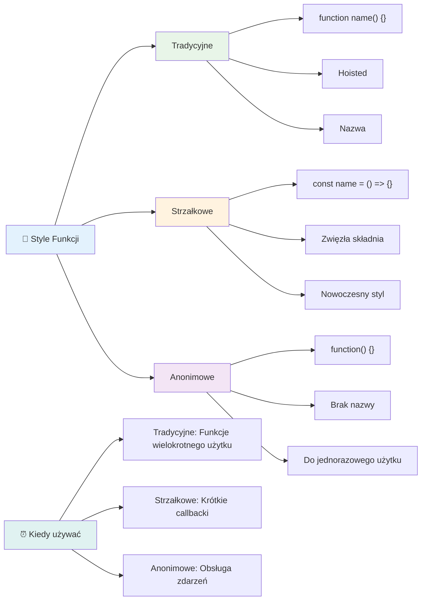
### Kiedy używać której strategii

Kiedy stosować które podejście? Praktyczna zasada: jeśli będziesz używać funkcji wielokrotnie, nadaj jej nazwę i zdefiniuj osobno. Jeśli to jedno konkretne użycie, rozważ funkcję anonimową. Zarówno funkcje strzałkowe, jak i tradycyjne są poprawne, choć funkcje strzałkowe dominują w nowoczesnym kodzie JavaScript.

### 🎨 **Sprawdzenie stylów funkcji: Wybór właściwej składni**

**Przetestuj swoją wiedzę o składni:**
- Kiedy możesz preferować funkcje strzałkowe zamiast tradycyjnych?
- Jaka jest główna zaleta funkcji anonimowych?
- Czy potrafisz wymyślić sytuację, w której funkcja nazwana jest lepsza niż anonimowa?

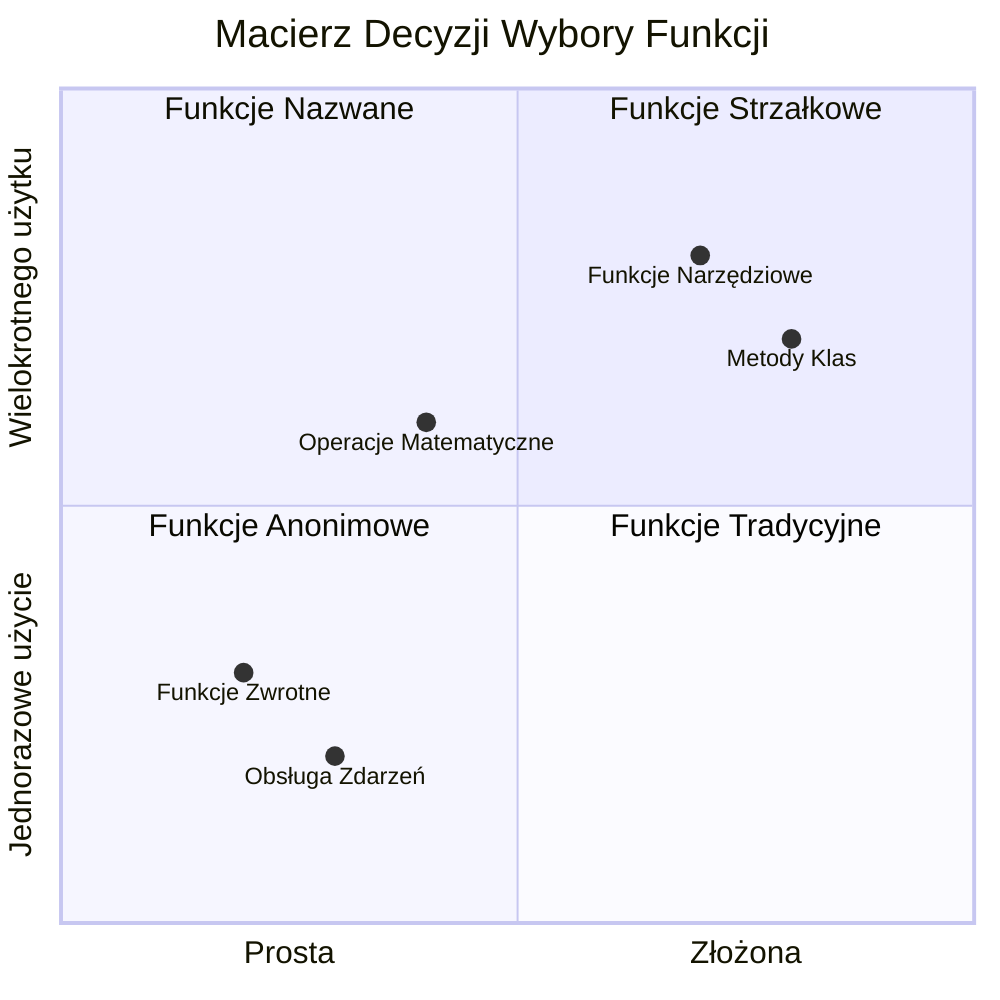
> **Nowoczesny trend**: Funkcje strzałkowe stają się domyślnym wyborem wielu programistów ze względu na zwięzłą składnię, ale tradycyjne funkcje nadal mają swoje miejsce!

---


## 🚀 Wyzwanie

Potrafisz w jednym zdaniu wyjaśnić różnicę między funkcjami a metodami? Spróbuj!

## Wyzwanie GitHub Copilot Agent 🚀

Użyj trybu Agenta, aby wykonać następujące zadanie:

**Opis:** Stwórz bibliotekę narzędzi matematycznych demonstrującą różne koncepcje funkcji przedstawione w tej lekcji, w tym parametry, wartości domyślne, wartości zwracane i funkcje strzałkowe.

**Zadanie:** Utwórz plik JavaScript `mathUtils.js` zawierający następujące funkcje:
1. Funkcję `add` przyjmującą dwa parametry i zwracającą ich sumę
2. Funkcję `multiply` z domyślnymi wartościami parametrów (drugi parametr domyślnie 1)
3. Funkcję strzałkową `square`, która przyjmuje liczbę i zwraca jej kwadrat
4. Funkcję `calculate`, która przyjmuje inną funkcję jako parametr oraz dwie liczby, a następnie stosuje tę funkcję do tych liczb
5. Pokaż wywołania każdej funkcji z odpowiednimi testowymi przypadkami

Dowiedz się więcej o [trybie agenta](https://code.visualstudio.com/blogs/2025/02/24/introducing-copilot-agent-mode) tutaj.

## Quiz po wykładzie
[Quiz po wykładzie](https://ff-quizzes.netlify.app)

## Przegląd i samodzielna nauka

Warto [przeczytać więcej o funkcjach strzałkowych](https://developer.mozilla.org/docs/Web/JavaScript/Reference/Functions/Arrow_functions), ponieważ są coraz częściej stosowane w bazach kodu. Ćwicz pisanie funkcji, a następnie przepisywanie ich z użyciem tej składni.

## Zadanie domowe

[Zabawy z funkcjami](assignment.md)

---

## 🧰 **Podsumowanie toolkit'u funkcji JavaScript**

```mermaid
graph TD
    A["🎯 Funkcje JavaScript"] --> B["📋 Deklaracja funkcji"]
    A --> C["📥 Parametry"]
    A --> D["📤 Wartości zwracane"]
    A --> E["🎨 Nowoczesna składnia"]
    
    B --> B1["function name() {}"]
    B --> B2["Opisowe nazewnictwo"]
    B --> B3["Wielokrotnego użytku bloki kodu"]
    
    C --> C1["Dane wejściowe"]
    C --> C2["Wartości domyślne"]
    C --> C3["Wiele parametrów"]
    
    D --> D1["instrukcja return"]
    D --> D2["Zakończenie funkcji"]
    D --> D3["Przekazanie danych z powrotem"]
    
    E --> E1["Funkcje strzałkowe: () =>"]
    E --> E2["Funkcje anonimowe"]
    E --> E3["Funkcje wyższego rzędu"]
    
    F["⚡ Kluczowe korzyści"] --> F1["Ponowne użycie kodu"]
    F --> F2["Lepsza organizacja"]
    F --> F3["Łatwiejsze testowanie"]
    F --> F4["Modułowa konstrukcja"]
    
    style A fill:#e3f2fd
    style B fill:#e8f5e8
    style C fill:#fff3e0
    style D fill:#f3e5f5
    style E fill:#e0f2f1
    style F fill:#fce4ec
```
---

## 🚀 Twoja oś czasu opanowania funkcji JavaScript

### ⚡ **Co potrafisz zrobić w ciągu następnych 5 minut**
- [ ] Napisać prostą funkcję zwracającą twoją ulubioną liczbę
- [ ] Stworzyć funkcję z dwoma parametrami, która dodaje je razem
- [ ] Spróbuj przekształcić tradycyjną funkcję na składnię funkcji strzałkowej
- [ ] Ćwicz wyzwanie: wyjaśnij różnicę między funkcjami a metodami

### 🎯 **Co możesz osiągnąć w tę godzinę**
- [ ] Ukończ quiz po lekcji i przejrzyj wszelkie niezrozumiałe koncepcje
- [ ] Zbuduj bibliotekę narzędzi matematycznych z wyzwania GitHub Copilot
- [ ] Stwórz funkcję, która używa innej funkcji jako parametru
- [ ] Ćwicz pisanie funkcji z domyślnymi parametrami
- [ ] Eksperymentuj z literałami szablonowymi w wartościach zwracanych przez funkcje

### 📅 **Twój tygodniowy plan mistrzostwa w funkcjach**
- [ ] Ukończ zadanie „Zabawa z funkcjami” z kreatywnością
- [ ] Przepisz powtarzający się kod, który napisałeś, na funkcje wielokrotnego użytku
- [ ] Zbuduj mały kalkulator używając tylko funkcji (bez zmiennych globalnych)
- [ ] Ćwicz funkcje strzałkowe z metodami tablicowymi takimi jak `map()` i `filter()`
- [ ] Stwórz zestaw funkcji narzędziowych do powszechnych zadań
- [ ] Studiuj funkcje wyższego rzędu i koncepcje programowania funkcyjnego

### 🌟 **Twoja miesięczna transformacja**
- [ ] Opanuj zaawansowane koncepcje funkcji, takie jak domknięcia i zakresy
- [ ] Zbuduj projekt intensywnie wykorzystujący składanie funkcji
- [ ] Wnieś wkład do projektów open source poprzez ulepszenie dokumentacji funkcji
- [ ] Naucz kogoś innego o funkcjach i różnych stylach składni
- [ ] Eksploruj paradygmaty programowania funkcyjnego w JavaScript
- [ ] Stwórz osobistą bibliotekę funkcji wielokrotnego użytku do przyszłych projektów

### 🏆 **Końcowy test mistrza funkcji**

**Świętuj swoje mistrzostwo w funkcjach:**
- Jaka jest najbardziej przydatna funkcja, jaką do tej pory stworzyłeś?
- Jak nauka o funkcjach zmieniła twoje podejście do organizacji kodu?
- Którą składnię funkcji preferujesz i dlaczego?
- Jaki problem z rzeczywistego świata rozwiązałbyś pisząc funkcję?

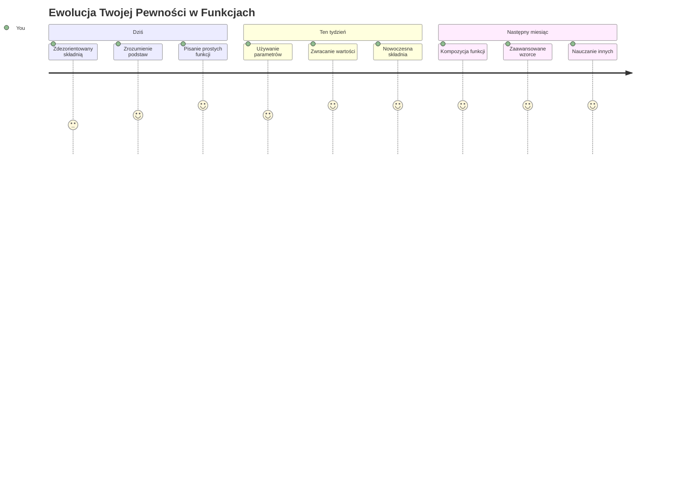
> 🎉 **Opanowałeś jeden z najpotężniejszych konceptów programowania!** Funkcje to podstawowe elementy większych programów. Każda aplikacja, którą kiedykolwiek stworzysz, będzie używać funkcji do organizacji, wielokrotnego wykorzystania i strukturyzacji kodu. Teraz rozumiesz, jak zapakować logikę w komponenty wielokrotnego użytku, czyniąc cię bardziej efektywnym i skutecznym programistą. Witamy w świecie programowania modułowego! 🚀

---

<!-- CO-OP TRANSLATOR DISCLAIMER START -->
**Zastrzeżenie**:  
Niniejszy dokument został przetłumaczony przy użyciu usługi tłumaczenia AI [Co-op Translator](https://github.com/Azure/co-op-translator). Pomimo naszych starań, aby zapewnić dokładność, prosimy mieć na uwadze, że tłumaczenia automatyczne mogą zawierać błędy lub nieścisłości. Oryginalny dokument w języku źródłowym należy uznać za dokument nadrzędny. W przypadku istotnych informacji zalecane jest skorzystanie z profesjonalnego tłumaczenia wykonanego przez człowieka. Nie ponosimy odpowiedzialności za jakiekolwiek nieporozumienia lub błędne interpretacje wynikające z korzystania z tego tłumaczenia.
<!-- CO-OP TRANSLATOR DISCLAIMER END -->