<!--
CO_OP_TRANSLATOR_METADATA:
{
  "original_hash": "c688385d15dd3645e924ea0ffee8967f",
  "translation_date": "2026-01-06T18:57:22+00:00",
  "source_file": "2-js-basics/3-making-decisions/README.md",
  "language_code": "pl"
}
-->
# Podstawy JavaScript: Podejmowanie decyzji


> Sketchnote autorstwa [Tomomi Imura](https://twitter.com/girlie_mac)

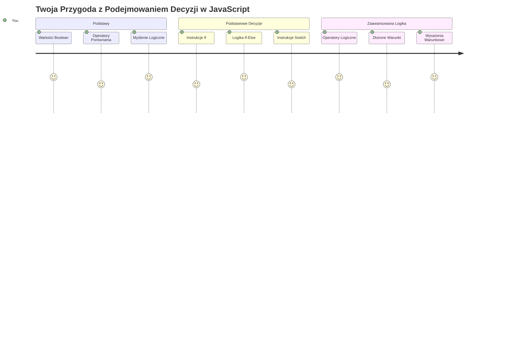
Czy kiedykolwiek zastanawiałeś się, jak aplikacje podejmują inteligentne decyzje? Na przykład jak system nawigacji wybiera najszybszą trasę lub jak termostat decyduje, kiedy włączyć ogrzewanie? To jest podstawowa koncepcja podejmowania decyzji w programowaniu.

Podobnie jak Analyticzna Maszyna Charlesa Babbage’a została zaprojektowana do wykonywania różnych sekwencji operacji w zależności od warunków, nowoczesne programy JavaScript muszą podejmować wybory w oparciu o zmienne okoliczności. Ta zdolność rozgałęziania i podejmowania decyzji to właśnie to, co przekształca statyczny kod w responsywne, inteligentne aplikacje.

W tej lekcji nauczysz się, jak wdrażać logikę warunkową w swoich programach. Przeanalizujemy instrukcje warunkowe, operatory porównania i wyrażenia logiczne, które pozwalają Twojemu kodowi oceniać sytuacje i odpowiednio na nie reagować.

## Quiz przed wykładem

[Quiz przed wykładem](https://ff-quizzes.netlify.app/web/quiz/11)

Umiejętność podejmowania decyzji i kontrolowania przepływu programu jest fundamentalnym aspektem programowania. W tej sekcji omówimy, jak kontrolować ścieżkę wykonania programów JavaScript przy użyciu wartości Boolean i logiki warunkowej.

[](https://youtube.com/watch?v=SxTp8j-fMMY "Podejmowanie decyzji")

> 🎥 Kliknij powyższy obraz, aby obejrzeć film o podejmowaniu decyzji.

> Możesz też zrealizować tę lekcję na [Microsoft Learn](https://docs.microsoft.com/learn/modules/web-development-101-if-else/?WT.mc_id=academic-77807-sagibbon)!

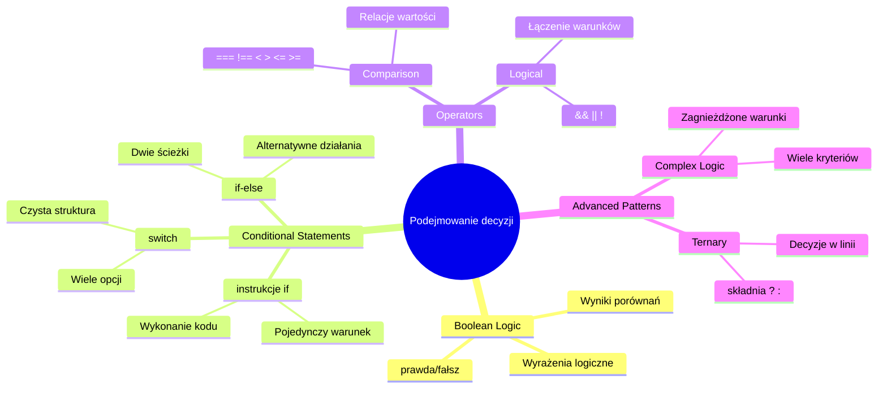
## Krótkie przypomnienie o wartościach Boolean

Zanim zanurzymy się w podejmowanie decyzji, przypomnijmy sobie wartości Boolean z poprzedniej lekcji. Nazwane na cześć matematyka George’a Boole’a, te wartości reprezentują stany binarne – albo `true`, albo `false`. Nie ma tu niejasności ani stanów pośrednich.

Te wartości binarne stanowią podstawę całej logiki obliczeniowej. Każda decyzja w twoim programie ostatecznie sprowadza się do oceny Boolean.

Tworzenie zmiennych Boolean jest proste:

```javascript
let myTrueBool = true;
let myFalseBool = false;
```

To tworzy dwie zmienne z wyraźnymi wartościami Boolean.

✅ Boole są nazwane na cześć angielskiego matematyka, filozofa i logika George’a Boole’a (1815–1864).

## Operatory porównania i wartości Boolean

W praktyce rzadko ustawiasz wartości Boolean ręcznie. Zamiast tego generujesz je poprzez ocenę warunków: "Czy ta liczba jest większa od tamtej?" albo "Czy te wartości są równe?"

Operatory porównania umożliwiają takie oceny. Porównują wartości i zwracają wyniki Boolean w zależności od relacji między operandami.

| Symbol | Opis                                                                                                                                                       | Przykład             |
| ------ | ---------------------------------------------------------------------------------------------------------------------------------------------------------- | -------------------- |
| `<`    | **Mniejsze niż**: Porównuje dwie wartości i zwraca `true`, jeśli wartość po lewej jest mniejsza niż po prawej                                        | `5 < 6 // true`      |
| `<=`   | **Mniejsze lub równe**: Porównuje dwie wartości i zwraca `true`, jeśli wartość po lewej jest mniejsza lub równa prawej                                | `5 <= 6 // true`     |
| `>`    | **Większe niż**: Porównuje dwie wartości i zwraca `true`, jeśli wartość po lewej jest większa niż po prawej                                           | `5 > 6 // false`     |
| `>=`   | **Większe lub równe**: Porównuje dwie wartości i zwraca `true`, jeśli wartość po lewej jest większa lub równa prawej                                  | `5 >= 6 // false`    |
| `===`  | **Ścisła równość**: Porównuje dwie wartości i zwraca `true`, jeśli wartości po obu stronach są równe I mają ten sam typ danych                      | `5 === 6 // false`   |
| `!==`  | **Nierówność**: Porównuje dwie wartości i zwraca przeciwną wartość Boolean do tej, którą zwróciłby operator ścisłej równości                           | `5 !== 6 // true`    |

✅ Sprawdź swoją wiedzę, wpisując porównania w konsoli przeglądarki. Czy któryś z wyników Cię zaskoczył?

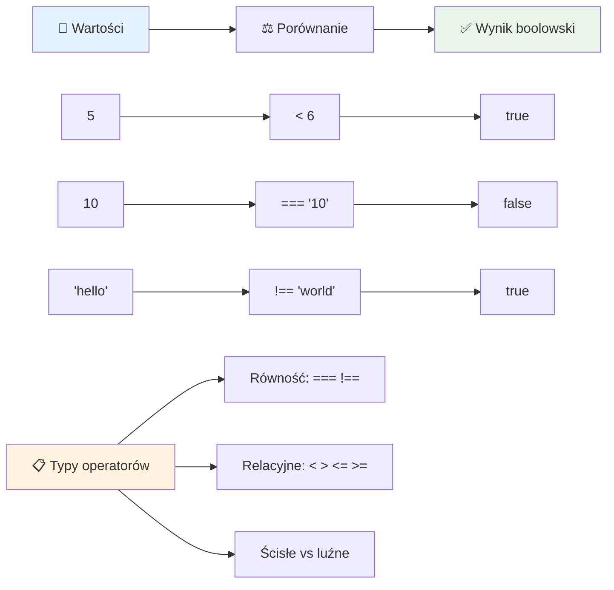
### 🧠 **Sprawdzenie opanowania porównania: Rozumienie logiki Boolean**

**Przetestuj swoje rozumienie porównań:**
- Dlaczego uważasz, że `===` (ścisła równość) jest zazwyczaj preferowane nad `==` (luźna równość)?
- Czy potrafisz przewidzieć, co zwróci `5 === '5'`? A `5 == '5'`?
- Jaka jest różnica między `!==` a `!=`?

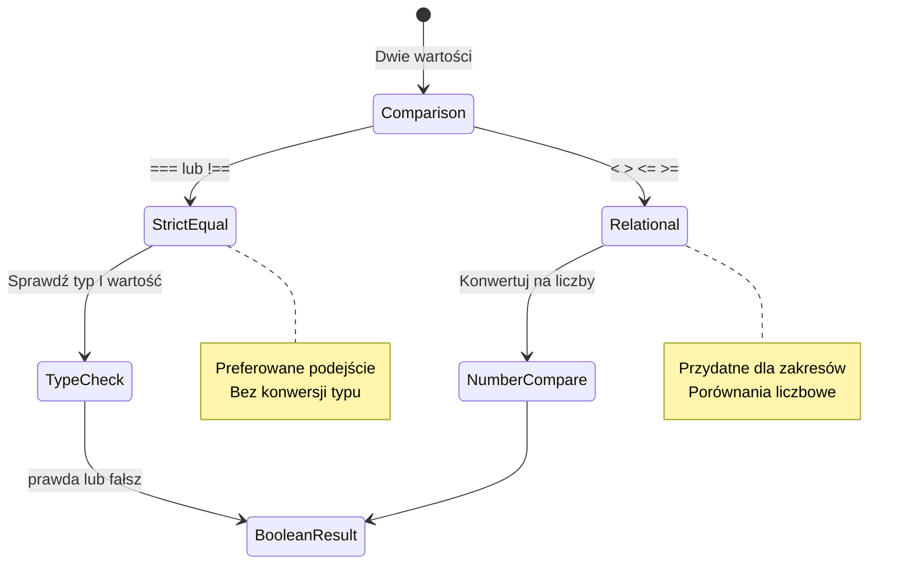
> **Przydatna wskazówka**: Zawsze używaj `===` i `!==` do sprawdzania równości, chyba że potrzebujesz konkretnie konwersji typów. Zapobiega to nieoczekiwanym zachowaniom!

## Instrukcja If

Instrukcja `if` to jak zadanie pytania w Twoim kodzie. „Jeśli ten warunek jest prawdziwy, wykonaj tę czynność.” To prawdopodobnie najważniejsze narzędzie do podejmowania decyzji w JavaScript.

Oto jak działa:

```javascript
if (condition) {
  // Warunek jest prawdziwy. Kod w tym bloku zostanie wykonany.
}
```

Warunek umieszcza się w nawiasach, a jeśli jest `true`, JavaScript wykonuje kod we wnętrzu nawiasów klamrowych. Jeśli jest `false`, JavaScript po prostu pomija ten blok.

Często użyjesz operatorów porównania, aby tworzyć te warunki. Zobaczmy praktyczny przykład:

```javascript
let currentMoney = 1000;
let laptopPrice = 800;

if (currentMoney >= laptopPrice) {
  // Warunek jest prawdziwy. Kod w tym bloku zostanie wykonany.
  console.log("Getting a new laptop!");
}
```

Ponieważ `1000 >= 800` ocenia się na `true`, kod wewnątrz bloku zostaje wykonany, wyświetlając „Getting a new laptop!” w konsoli.

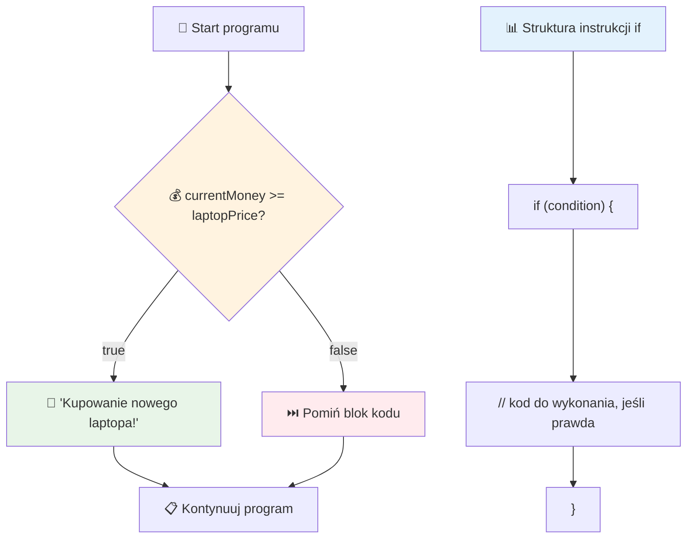
## Instrukcja If..Else

A co, jeśli chcesz, aby program robił coś innego, gdy warunek jest fałszywy? Tu wkracza `else` – to jak plan awaryjny.

Instrukcja `else` pozwala powiedzieć „jeśli ten warunek nie jest prawdziwy, wykonaj zamiast tego coś innego.”

```javascript
let currentMoney = 500;
let laptopPrice = 800;

if (currentMoney >= laptopPrice) {
  // Warunek jest prawdziwy. Kod w tym bloku zostanie wykonany.
  console.log("Getting a new laptop!");
} else {
  // Warunek jest fałszywy. Kod w tym bloku zostanie wykonany.
  console.log("Can't afford a new laptop, yet!");
}
```

Ponieważ `500 >= 800` jest `false`, JavaScript pomija pierwszy blok i wykonuje blok `else`. W konsoli zobaczysz „Can't afford a new laptop, yet!”.

✅ Przetestuj swoje zrozumienie tego kodu i poniższego, uruchamiając je w konsoli przeglądarki. Zmień wartości zmiennych currentMoney i laptopPrice, aby zmienić wynikowe `console.log()`.

### 🎯 **Sprawdzenie logiki If-Else: Rozgałęzione ścieżki**

**Oceń swoje zrozumienie logiki warunkowej:**
- Co się stanie, jeśli `currentMoney` będzie dokładnie równe `laptopPrice`?
- Czy potrafisz wymyślić realistyczny scenariusz, gdzie logika if-else byłaby użyteczna?
- Jak możesz rozszerzyć to, aby obsłużyć wiele zakresów cen?

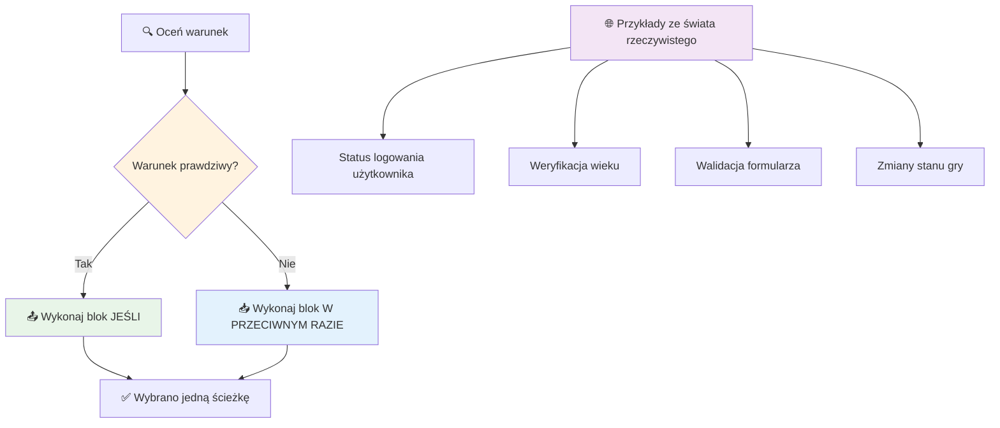
> **Ważna uwaga**: If-else zapewnia, że dokładnie jedna ścieżka zostanie wybrana. Gwarantuje to, że Twój program zawsze ma odpowiedź na każdy warunek!

## Instrukcja Switch

Czasem musisz porównać jedną wartość z wieloma opcjami. Można to zrobić łańcuchując wiele instrukcji `if..else`, ale staje się to nieczytelne. Instrukcja `switch` daje czytelniejszą strukturę do obsługi wielu konkretnych wartości.

Koncepcja przypomina mechaniczne systemy przełączające używane w dawnych centralach telefonicznych – jedna wartość wejściowa decyduje, którą konkretną ścieżkę wykonanie podąża.

```javascript
switch (expression) {
  case x:
    // blok kodu
    break;
  case y:
    // blok kodu
    break;
  default:
    // blok kodu
}
```

Oto jak jest zbudowana:
- JavaScript ocenia wyrażenie tylko raz
- Przeszukuje każdy `case`, aby znaleźć dopasowanie
- Gdy znajdzie dopasowanie, wykonuje ten blok kodu
- `break` mówi JavaScript, aby przerwał i opuścił switch
- Jeśli żaden przypadek nie pasuje, wykonuje blok `default` (jeśli jest)

```javascript
// Program wykorzystujący instrukcję switch do dni tygodnia
let dayNumber = 2;
let dayName;

switch (dayNumber) {
  case 1:
    dayName = "Monday";
    break;
  case 2:
    dayName = "Tuesday";
    break;
  case 3:
    dayName = "Wednesday";
    break;
  default:
    dayName = "Unknown day";
    break;
}
console.log(`Today is ${dayName}`);
```

W tym przykładzie JavaScript widzi, że `dayNumber` to `2`, znajduje odpowiadający `case 2`, ustawia `dayName` na „Tuesday” i wychodzi z instrukcji switch. Efekt? „Today is Tuesday” zostaje wyświetlone w konsoli.

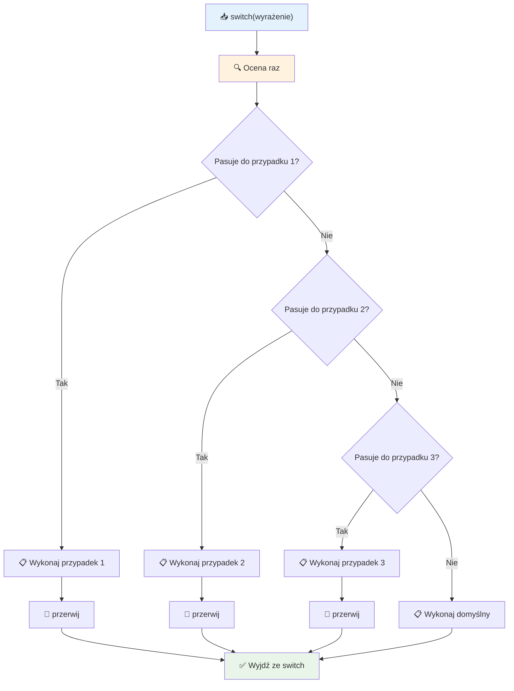
✅ Przetestuj swoje zrozumienie tego i poniższego kodu, uruchamiając w konsoli przeglądarki. Zmień wartość zmiennej a, aby zmienić wynikowe `console.log()`.

### 🔄 **Opanowanie instrukcji Switch: Wiele opcji**

**Sprawdź swoje zrozumienie switch:**
- Co się stanie, jeśli zapomnisz instrukcję `break`?
- Kiedy użyłbyś `switch` zamiast wielu instrukcji `if-else`?
- Dlaczego przypadek `default` jest użyteczny, nawet jeśli uważasz, że uwzględniłeś wszystkie możliwości?

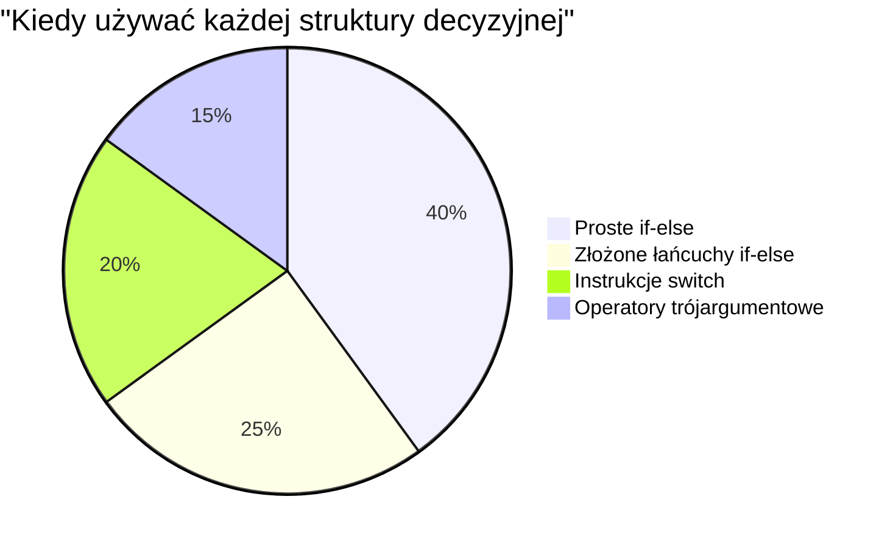
> **Dobra praktyka**: Używaj `switch`, gdy porównujesz jedną zmienną z wieloma konkretnymi wartościami. Używaj if-else do sprawdzania zakresów lub złożonych warunków!

## Operatory logiczne i Boole

Złożone decyzje często wymagają oceny wielu warunków jednocześnie. Podobnie jak algebra Boole’a pozwala łączyć wyrażenia logiczne, programowanie dostarcza operatorów logicznych do łączenia wielu warunków Boolean.

Te operatory umożliwiają zaawansowaną logikę warunkową przez łączenie prostych ocen prawdy/fałszu.

| Symbol | Opis                                                                                   | Przykład                                                                |
| ------ | -------------------------------------------------------------------------------------- | ----------------------------------------------------------------------- |
| `&&`   | **Logiczne AND**: Porównuje dwa wyrażenia Boolean. Zwraca true **tylko**, gdy oba są true | `(5 > 3) && (5 < 10) // Oba warunki prawdziwe. Zwraca true`             |
| `\|\|` | **Logiczne OR**: Porównuje dwa wyrażenia Boolean. Zwraca true, jeśli przynajmniej jedno jest true | `(5 > 10) \|\| (5 < 10) // Jeden fałszywy, drugi prawdziwy. Zwraca true` |
| `!`    | **Logiczne NOT**: Zwraca przeciwną wartość wyrażenia Boolean                         | `!(5 > 10) // 5 nie jest większe niż 10, więc "!" zmienia na true`      |

Te operatory pozwalają łączyć warunki w użyteczny sposób:
- AND (`&&`) oznacza, że oba warunki muszą być prawdziwe
- OR (`||`) oznacza, że przynajmniej jeden warunek musi być prawdziwy  
- NOT (`!`) zmienia prawdę na fałsz (i odwrotnie)

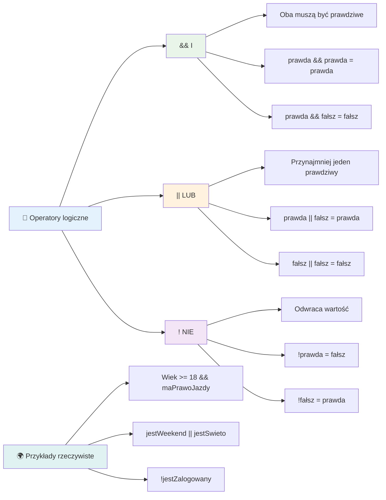
## Warunki i decyzje z operatorami logicznymi

Zobaczmy te operatory w akcji na bardziej realistycznym przykładzie:

```javascript
let currentMoney = 600;
let laptopPrice = 800;
let laptopDiscountPrice = laptopPrice - (laptopPrice * 0.2); // Cena laptopa z 20 procentową zniżką

if (currentMoney >= laptopPrice || currentMoney >= laptopDiscountPrice) {
  // Warunek jest prawdziwy. Kod w tym bloku zostanie wykonany.
  console.log("Getting a new laptop!");
} else {
  // Warunek jest fałszywy. Kod w tym bloku zostanie wykonany.
  console.log("Can't afford a new laptop, yet!");
}
```

W tym przykładzie: obliczamy cenę po 20% rabacie (640), a następnie oceniamy, czy dostępne środki pokrywają pełną cenę LUB cenę po rabacie. Ponieważ 600 nie osiąga progu 640, warunek ocenia się jako false.

### 🧮 **Sprawdzenie operatorów logicznych: Łączenie warunków**

**Przetestuj swoje rozumienie operatorów logicznych:**
- W wyrażeniu `A && B`, co się stanie, jeśli A jest fałszywe? Czy B jest wtedy oceniane?
- Czy potrafisz wymyślić sytuację, w której potrzebujesz wszystkich trzech operatorów (&&, ||, !) razem?
- Jaka jest różnica między `!user.isActive` a `user.isActive !== true`?

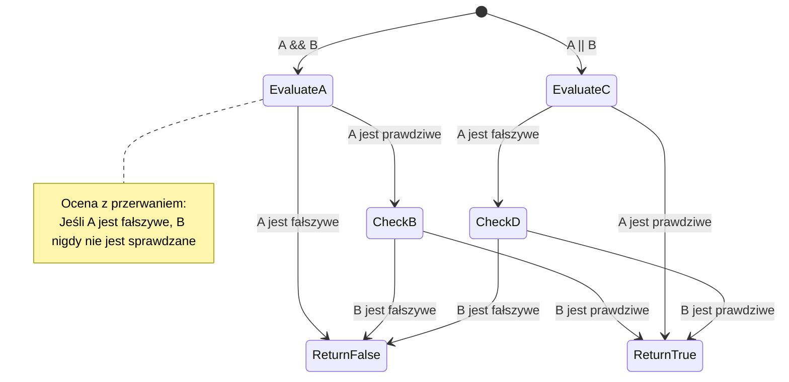
> **Wskazówka dotycząca wydajności**: JavaScript używa „oceny krótkozamykającej” — w `A && B`, jeśli A jest fałszywe, B nie jest oceniane. Wykorzystaj to na swoją korzyść!

### Operator negacji

Czasem łatwiej jest pomyśleć o tym, kiedy coś NIE jest prawdziwe. Zamiast pytać „Czy użytkownik jest zalogowany?”, możesz zapytać „Czy użytkownik NIE jest zalogowany?” Operator wykrzyknika (`!`) odwraca logikę za Ciebie.

```javascript
if (!condition) {
  // wykonuje się, jeśli warunek jest fałszywy
} else {
  // wykonuje się, jeśli warunek jest prawdziwy
}
```

Operator `!` to jak powiedzenie „przeciwnie do…” – jeśli coś jest `true`, `!` zmienia to na `false` i odwrotnie.

### Wyrażenia warunkowe (ternarne)

Dla prostych przypisań warunkowych JavaScript oferuje **operator ternarny**. Ta zwięzła składnia pozwala napisać wyrażenie warunkowe w jednej linii, co jest przydatne, gdy trzeba przypisać jedną z dwóch wartości na podstawie warunku.

```javascript
let variable = condition ? returnThisIfTrue : returnThisIfFalse;
```

Czyta się to jak pytanie: „Czy ten warunek jest prawdziwy? Jeśli tak, użyj tej wartości. Jeśli nie, użyj tamtej wartości.”

Poniżej bardziej konkretny przykład:

```javascript
let firstNumber = 20;
let secondNumber = 10;
let biggestNumber = firstNumber > secondNumber ? firstNumber : secondNumber;
```

✅ Poświęć chwilę, aby przeczytać ten kod kilka razy. Czy rozumiesz, jak działają te operatory?

Ta linia mówi: „Czy `firstNumber` jest większa od `secondNumber`? Jeśli tak, wpisz `firstNumber` do `biggestNumber`. Jeśli nie, wpisz `secondNumber` do `biggestNumber`.”

Operator ternarny to po prostu krótszy sposób zapisu tradycyjnej instrukcji `if..else`:

```javascript
let biggestNumber;
if (firstNumber > secondNumber) {
  biggestNumber = firstNumber;
} else {
  biggestNumber = secondNumber;
}
```

Oba podejścia dają identyczne efekty. Operator ternarny oferuje zwięzłość, natomiast tradycyjna struktura if-else może być bardziej czytelna przy złożonych warunkach.

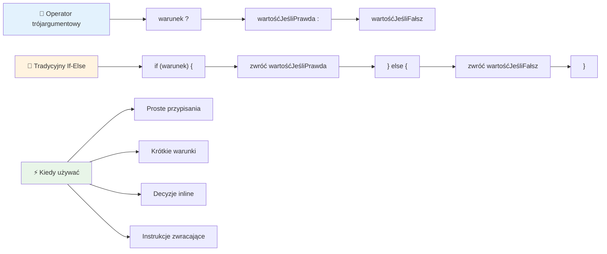
---


## 🚀 Wyzwanie

Utwórz program, który najpierw napiszesz używając operatorów logicznych, a następnie przepiszesz go z użyciem wyrażenia ternarnego. Która składnia jest dla Ciebie wygodniejsza?

---

## Wyzwanie z Agentem GitHub Copilot 🚀

Użyj trybu Agenta, aby wykonać następujące zadanie:

**Opis:** Stwórz kompleksowy kalkulator ocen, który demonstruje kilka koncepcji podejmowania decyzji z tej lekcji, włączając instrukcje if-else, switch, operatory logiczne i wyrażenia ternarne.

**Polecenie:** Napisz program w JavaScript, który przyjmuje numeryczną ocenę ucznia (0–100) i określa ocenę literową według następujących kryteriów:
- A: 90-100
- B: 80-89  
- C: 70-79
- D: 60-69
- F: Poniżej 60

Wymagania:
1. Użyj instrukcji if-else, aby określić ocenę literową
2. Użyj operatorów logicznych, aby sprawdzić, czy uczeń zdaje (ocena >= 60) ORAZ ma wyróżnienie (ocena >= 90)  
3. Użyj instrukcji switch, aby zapewnić konkretną informację zwrotną dla każdej oceny literowej  
4. Użyj operatora warunkowego (ternary operator), aby określić, czy uczeń kwalifikuje się do następnego kursu (ocena >= 70)  
5. Uwzględnij walidację danych wejściowych, aby zapewnić, że wynik mieści się w zakresie od 0 do 100  

Przetestuj swój program na różnych wynikach, w tym na przypadkach brzegowych, takich jak 59, 60, 89, 90 oraz na nieprawidłowych danych wejściowych.

Dowiedz się więcej o [trybie agenta](https://code.visualstudio.com/blogs/2025/02/24/introducing-copilot-agent-mode) tutaj.


## Quiz po wykładzie

[Quiz po wykładzie](https://ff-quizzes.netlify.app/web/quiz/12)

## Przegląd i samodzielna nauka

Przeczytaj więcej o wielu dostępnych operatorach [na MDN](https://developer.mozilla.org/docs/Web/JavaScript/Reference/Operators).

Przejrzyj wspaniały [przegląd operatorów](https://joshwcomeau.com/operator-lookup/) autorstwa Josha Comeau!

## Zadanie

[Operatory](assignment.md)

---

## 🧠 **Podsumowanie Twojego zestawu narzędzi do podejmowania decyzji**

```mermaid
graph TD
    A["🎯 Decyzje w JavaScript"] --> B["🔍 Logika boolowska"]
    A --> C["📊 Instrukcje warunkowe"]
    A --> D["🔗 Operatory logiczne"]
    A --> E["⚡ Zaawansowane wzorce"]
    
    B --> B1["wartości true/false"]
    B --> B2["Operatory porównania"]
    B --> B3["Pojęcia prawdziwości"]
    
    C --> C1["instrukcje if"]
    C --> C2["łańcuchy if-else"]
    C --> C3["instrukcje switch"]
    
    D --> D1["&& (I)"]
    D --> D2["|| (LUB)"]
    D --> D3["! (NIE)"]
    
    E --> E1["Operator warunkowy (ternarny)"]
    E --> E2["Krótkie spięcie oceny"]
    E --> E3["Złożone warunki"]
    
    F["💡 Kluczowe zasady"] --> F1["Jasne i czytelne warunki"]
    F --> F2["Spójny styl porównań"]
    F --> F3["Właściwa kolejność operatorów"]
    F --> F4["Efektywna kolejność oceny"]
    
    style A fill:#e3f2fd
    style B fill:#e8f5e8
    style C fill:#fff3e0
    style D fill:#f3e5f5
    style E fill:#e0f2f1
    style F fill:#fce4ec
```
---

## 🚀 Twój harmonogram mistrzostwa w podejmowaniu decyzji w JavaScript

### ⚡ **Co możesz zrobić w ciągu następnych 5 minut**
- [ ] Ćwicz operatory porównania w konsoli przeglądarki  
- [ ] Napisz prostą instrukcję if-else, która sprawdzi Twój wiek  
- [ ] Spróbuj wyzwania: przepisać instrukcję if-else, używając operatora warunkowego  
- [ ] Przetestuj, co się dzieje z różnymi wartościami "truthy" i "falsy"  

### 🎯 **Co możesz osiągnąć w ciągu tej godziny**
- [ ] Wykonaj quiz po lekcji i przejrzyj wszelkie niejasne koncepcje  
- [ ] Zbuduj kompleksowy kalkulator ocen z wyzwania GitHub Copilot  
- [ ] Stwórz prostą drzewo decyzyjne dla rzeczywistego scenariusza (np. wybór ubrań)  
- [ ] Ćwicz łączenie wielu warunków za pomocą operatorów logicznych  
- [ ] Eksperymentuj z instrukcjami switch dla różnych zastosowań  

### 📅 **Twoje tygodniowe mistrzostwo w logice**
- [ ] Wykonaj zadanie dotyczące operatorów, używając kreatywnych przykładów  
- [ ] Zbuduj mini aplikację quizową z różnymi strukturami warunkowymi  
- [ ] Stwórz walidator formularza, który sprawdza wiele warunków wejściowych  
- [ ] Ćwicz zadania Josha Comeau z [przeglądu operatorów](https://joshwcomeau.com/operator-lookup/)  
- [ ] Refaktoryzuj istniejący kod, stosując bardziej odpowiednie struktury warunkowe  
- [ ] Studiuj ocenę krótkiego spięcia (short-circuit evaluation) i jej wpływ na wydajność  

### 🌟 **Twoja miesięczna transformacja**
- [ ] Opanuj złożone zagnieżdżone warunki zachowując czytelność kodu  
- [ ] Zbuduj aplikację z zaawansowaną logiką podejmowania decyzji  
- [ ] Wnieś wkład do projektów open source, ulepszając logikę warunkową istniejących projektów  
- [ ] Nauczaj innych różnych struktur warunkowych i kiedy każdą stosować  
- [ ] Zgłębiaj podejścia funkcyjne do logiki warunkowej  
- [ ] Stwórz osobisty przewodnik po najlepszych praktykach warunkowych  

### 🏆 **Finałowa kontrola mistrza podejmowania decyzji**

**Świętuj swoje mistrzostwo w logicznym myśleniu:**  
- Jaka jest najtrudniejsza logika decyzyjna, którą udało Ci się zaimplementować?  
- Która struktura warunkowa jest dla Ciebie najbardziej naturalna i dlaczego?  
- Jak nauka o operatorach logicznych zmieniła Twoje podejście do rozwiązywania problemów?  
- Jaka rzeczywista aplikacja mogłaby skorzystać z zaawansowanej logiki decyzyjnej?  

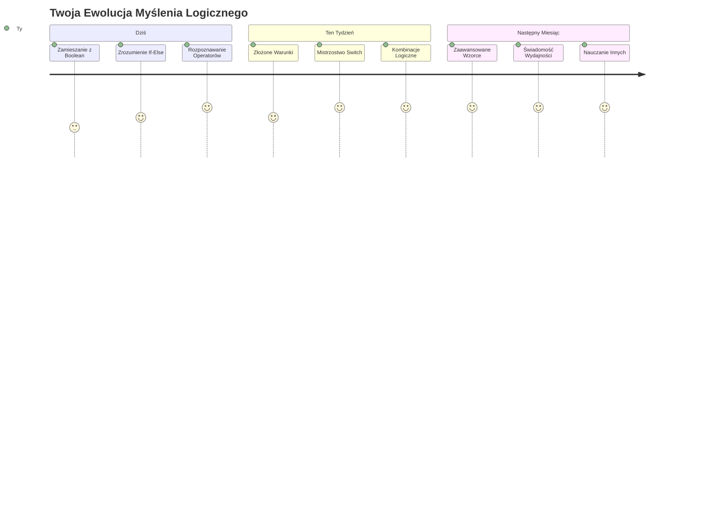
> 🧠 **Opanowałeś sztukę cyfrowego podejmowania decyzji!** Każda interaktywna aplikacja opiera się na logice warunkowej, aby inteligentnie reagować na działania użytkownika i zmieniające się warunki. Teraz rozumiesz, jak sprawić, by Twoje programy myślały, oceniały i wybierały odpowiednie odpowiedzi. Ta logiczna podstawa zasili każdą dynamiczną aplikację, którą stworzysz! 🎉

---

<!-- CO-OP TRANSLATOR DISCLAIMER START -->
**Zastrzeżenie**:  
Dokument ten został przetłumaczony za pomocą usługi tłumaczeń AI [Co-op Translator](https://github.com/Azure/co-op-translator). Choć staramy się zapewnić dokładność, prosimy mieć na uwadze, że automatyczne tłumaczenia mogą zawierać błędy lub niedokładności. Oryginalny dokument w jego języku źródłowym powinien być uznawany za źródło autorytatywne. W przypadku informacji krytycznych zalecane jest skorzystanie z profesjonalnego tłumaczenia wykonanego przez człowieka. Nie ponosimy odpowiedzialności za jakiekolwiek nieporozumienia lub błędne interpretacje wynikające z użycia tego tłumaczenia.
<!-- CO-OP TRANSLATOR DISCLAIMER END -->