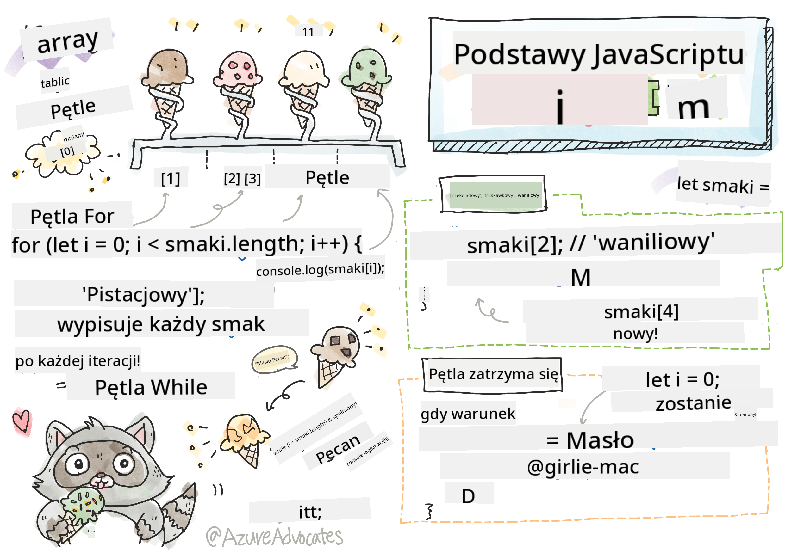

<!--
CO_OP_TRANSLATOR_METADATA:
{
  "original_hash": "9029f96b0e034839c1799f4595e4bb66",
  "translation_date": "2025-08-29T16:34:22+00:00",
  "source_file": "2-js-basics/4-arrays-loops/README.md",
  "language_code": "pl"
}
-->
# Podstawy JavaScript: Tablice i Pętle


> Sketchnote autorstwa [Tomomi Imura](https://twitter.com/girlie_mac)

## Quiz przed wykładem
[Quiz przed wykładem](https://ff-quizzes.netlify.app/web/quiz/13)

Ta lekcja obejmuje podstawy JavaScript, języka, który zapewnia interaktywność w sieci. W tej lekcji nauczysz się o tablicach i pętlach, które są używane do manipulacji danymi.

[](https://youtube.com/watch?v=1U4qTyq02Xw "Tablice")

[](https://www.youtube.com/watch?v=Eeh7pxtTZ3k "Pętle")

> 🎥 Kliknij obrazy powyżej, aby obejrzeć filmy o tablicach i pętlach.

> Możesz przerobić tę lekcję na [Microsoft Learn](https://docs.microsoft.com/learn/modules/web-development-101-arrays/?WT.mc_id=academic-77807-sagibbon)!

## Tablice

Praca z danymi to częste zadanie w każdym języku programowania, a jest ono znacznie łatwiejsze, gdy dane są zorganizowane w strukturze, takiej jak tablice. W tablicach dane są przechowywane w strukturze przypominającej listę. Jedną z głównych zalet tablic jest to, że można w nich przechowywać różne typy danych.

✅ Tablice są wszędzie wokół nas! Czy potrafisz podać przykład tablicy z życia codziennego, na przykład tablicy paneli słonecznych?

Składnia tablicy to para nawiasów kwadratowych.

```javascript
let myArray = [];
```

To jest pusta tablica, ale tablice mogą być deklarowane już z danymi. Wartości w tablicy są oddzielone przecinkami.

```javascript
let iceCreamFlavors = ["Chocolate", "Strawberry", "Vanilla", "Pistachio", "Rocky Road"];
```

Wartości w tablicy mają przypisany unikalny numer zwany **indeksem**, który jest liczbą całkowitą przypisywaną na podstawie odległości od początku tablicy. W powyższym przykładzie wartość "Chocolate" ma indeks 0, a "Rocky Road" ma indeks 4. Użyj indeksu z nawiasami kwadratowymi, aby pobrać, zmienić lub wstawić wartości tablicy.

✅ Czy zaskakuje Cię, że indeksy w tablicach zaczynają się od zera? W niektórych językach programowania indeksy zaczynają się od 1. To ciekawa historia, o której możesz [przeczytać na Wikipedii](https://en.wikipedia.org/wiki/Zero-based_numbering).

```javascript
let iceCreamFlavors = ["Chocolate", "Strawberry", "Vanilla", "Pistachio", "Rocky Road"];
iceCreamFlavors[2]; //"Vanilla"
```

Możesz wykorzystać indeks, aby zmienić wartość, na przykład tak:

```javascript
iceCreamFlavors[4] = "Butter Pecan"; //Changed "Rocky Road" to "Butter Pecan"
```

Możesz również wstawić nową wartość pod danym indeksem w ten sposób:

```javascript
iceCreamFlavors[5] = "Cookie Dough"; //Added "Cookie Dough"
```

✅ Bardziej powszechnym sposobem dodawania wartości do tablicy jest użycie operatorów tablicowych, takich jak array.push().

Aby dowiedzieć się, ile elementów znajduje się w tablicy, użyj właściwości `length`.

```javascript
let iceCreamFlavors = ["Chocolate", "Strawberry", "Vanilla", "Pistachio", "Rocky Road"];
iceCreamFlavors.length; //5
```

✅ Wypróbuj sam! Użyj konsoli przeglądarki, aby utworzyć i manipulować tablicą własnego pomysłu.

## Pętle

Pętle pozwalają nam wykonywać powtarzalne lub **iteracyjne** zadania, co pozwala zaoszczędzić dużo czasu i kodu. Każda iteracja może różnić się zmiennymi, wartościami i warunkami. Istnieją różne rodzaje pętli w JavaScript, które różnią się nieco składnią, ale zasadniczo robią to samo: iterują po danych.

### Pętla for

Pętla `for` wymaga 3 elementów do iteracji:
- `counter` Zmienna, która jest zazwyczaj inicjalizowana liczbą i zlicza liczbę iteracji
- `condition` Wyrażenie wykorzystujące operatory porównania, które powoduje zatrzymanie pętli, gdy zwróci `false`
- `iteration-expression` Wykonywane na końcu każdej iteracji, zazwyczaj używane do zmiany wartości licznika

```javascript
// Counting up to 10
for (let i = 0; i < 10; i++) {
  console.log(i);
}
```

✅ Uruchom ten kod w konsoli przeglądarki. Co się stanie, gdy wprowadzisz drobne zmiany w liczniku, warunku lub wyrażeniu iteracyjnym? Czy możesz sprawić, by działała wstecz, tworząc odliczanie?

### Pętla while

W przeciwieństwie do składni pętli `for`, pętle `while` wymagają jedynie warunku, który zatrzyma pętlę, gdy stanie się `false`. Warunki w pętlach zazwyczaj opierają się na innych wartościach, takich jak liczniki, i muszą być zarządzane w trakcie działania pętli. Wartości początkowe liczników muszą być utworzone poza pętlą, a wszelkie wyrażenia spełniające warunek, w tym zmiana licznika, muszą być utrzymywane wewnątrz pętli.

```javascript
//Counting up to 10
let i = 0;
while (i < 10) {
 console.log(i);
 i++;
}
```

✅ Dlaczego wybrałbyś pętlę for zamiast while? 17 tysięcy użytkowników miało to samo pytanie na StackOverflow, a niektóre opinie [mogą Cię zainteresować](https://stackoverflow.com/questions/39969145/while-loops-vs-for-loops-in-javascript).

## Pętle i Tablice

Tablice są często używane z pętlami, ponieważ większość warunków wymaga długości tablicy, aby zatrzymać pętlę, a indeks może również pełnić rolę licznika.

```javascript
let iceCreamFlavors = ["Chocolate", "Strawberry", "Vanilla", "Pistachio", "Rocky Road"];

for (let i = 0; i < iceCreamFlavors.length; i++) {
  console.log(iceCreamFlavors[i]);
} //Ends when all flavors are printed
```

✅ Poeksperymentuj z iterowaniem po tablicy własnego pomysłu w konsoli przeglądarki.

---

## 🚀 Wyzwanie

Istnieją inne sposoby iterowania po tablicach niż pętle for i while. Są to [forEach](https://developer.mozilla.org/docs/Web/JavaScript/Reference/Global_Objects/Array/forEach), [for-of](https://developer.mozilla.org/docs/Web/JavaScript/Reference/Statements/for...of) i [map](https://developer.mozilla.org/docs/Web/JavaScript/Reference/Global_Objects/Array/map). Przepisz swoją pętlę tablicową, używając jednej z tych technik.

## Quiz po wykładzie
[Quiz po wykładzie](https://ff-quizzes.netlify.app/web/quiz/14)

## Przegląd i samodzielna nauka

Tablice w JavaScript mają wiele metod, które są niezwykle przydatne do manipulacji danymi. [Przeczytaj o tych metodach](https://developer.mozilla.org/docs/Web/JavaScript/Reference/Global_Objects/Array) i wypróbuj niektóre z nich (takie jak push, pop, slice i splice) na tablicy własnego pomysłu.

## Zadanie

[Iterowanie po tablicy](assignment.md)

---

**Zastrzeżenie**:  
Ten dokument został przetłumaczony za pomocą usługi tłumaczenia AI [Co-op Translator](https://github.com/Azure/co-op-translator). Chociaż dokładamy wszelkich starań, aby tłumaczenie było precyzyjne, prosimy pamiętać, że automatyczne tłumaczenia mogą zawierać błędy lub nieścisłości. Oryginalny dokument w jego rodzimym języku powinien być uznawany za wiarygodne źródło. W przypadku informacji o kluczowym znaczeniu zaleca się skorzystanie z profesjonalnego tłumaczenia przez człowieka. Nie ponosimy odpowiedzialności za jakiekolwiek nieporozumienia lub błędne interpretacje wynikające z użycia tego tłumaczenia.