<!--
CO_OP_TRANSLATOR_METADATA:
{
  "original_hash": "1710a50a519a6e4a1b40a5638783018d",
  "translation_date": "2026-01-06T19:00:14+00:00",
  "source_file": "2-js-basics/4-arrays-loops/README.md",
  "language_code": "pl"
}
-->
# JavaScript Basics: Tablice i Pętle


> Sketchnote autorstwa [Tomomi Imura](https://twitter.com/girlie_mac)

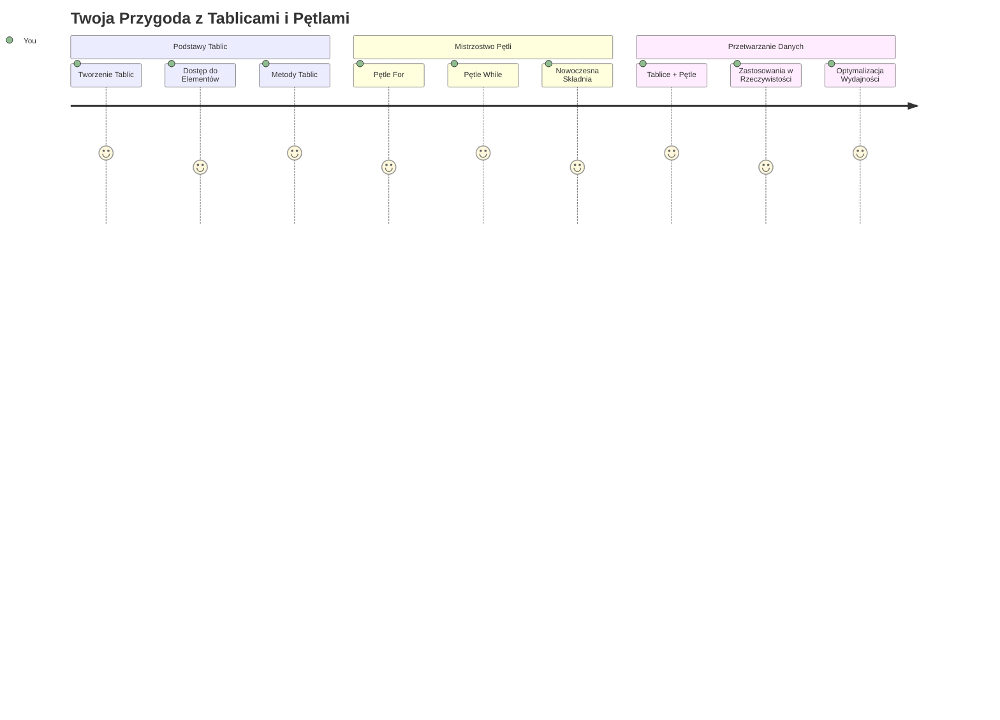
## Quiz przed wykładem
[Quiz przed wykładem](https://ff-quizzes.netlify.app/web/quiz/13)

Zastanawiałeś się kiedyś, jak strony internetowe śledzą przedmioty w koszyku lub wyświetlają listę znajomych? Tutaj z pomocą przychodzą tablice i pętle. Tablice są jak cyfrowe pojemniki, które przechowują wiele informacji, podczas gdy pętle pozwalają na efektywną pracę z tymi danymi bez powtarzania kodu.

Razem te dwa pojęcia stanowią fundament obsługi informacji w twoich programach. Nauczysz się przechodzić od ręcznego pisania każdego kroku do tworzenia inteligentnego, wydajnego kodu, który potrafi szybko przetworzyć setki, a nawet tysiące elementów.

Na koniec tej lekcji zrozumiesz, jak wykonywać złożone zadania związane z danymi za pomocą zaledwie kilku linii kodu. Poznajmy te niezbędne koncepcje programowania.

[](https://youtube.com/watch?v=1U4qTyq02Xw "Arrays")

[](https://www.youtube.com/watch?v=Eeh7pxtTZ3k "Loops")

> 🎥 Kliknij obrazy powyżej, aby obejrzeć filmy o tablicach i pętlach.

> Możesz także skorzystać z tej lekcji na [Microsoft Learn](https://docs.microsoft.com/learn/modules/web-development-101-arrays/?WT.mc_id=academic-77807-sagibbon)!

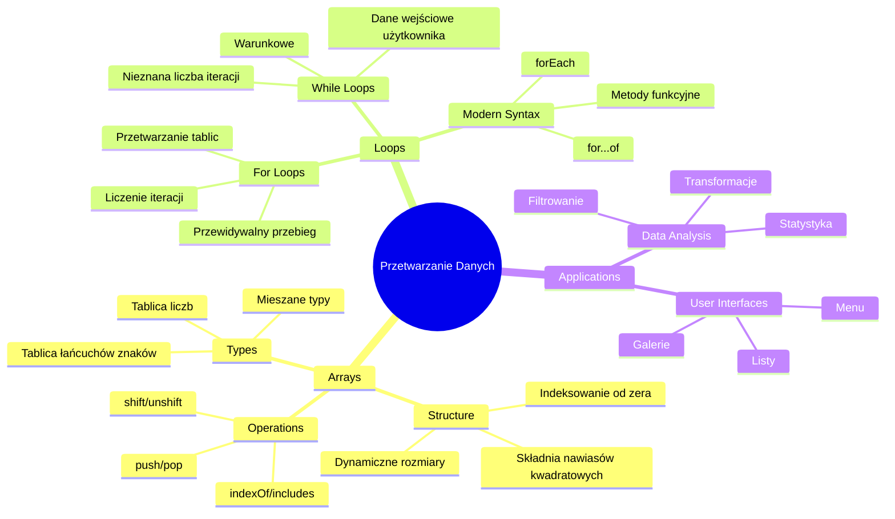
## Tablice

Pomyśl o tablicach jak o cyfrowej szafce z segregatorami – zamiast przechowywać jeden dokument na szufladę, możesz uporządkować wiele powiązanych elementów w jednej, zorganizowanej przestrzeni. W terminologii programistycznej tablice pozwalają przechowywać wiele informacji w jednym uporządkowanym pakiecie.

Niezależnie czy budujesz galerię zdjęć, zarządzasz listą zadań do zrobienia czy śledzisz najlepsze wyniki w grze, tablice stanowią fundament organizacji danych. Zobaczmy, jak to działa.

✅ Tablice są wszędzie wokół nas! Czy potrafisz podać przykład tablicy w rzeczywistości, np. paneli słonecznych?

### Tworzenie tablic

Tworzenie tablicy jest bardzo proste – wystarczy użyć nawiasów kwadratowych!

```javascript
// Pusta tablica - jak pusty koszyk czekający na przedmioty
const myArray = [];
```

**Co się tu dzieje?**
Właśnie utworzyłeś pusty pojemnik, używając nawiasów `[]`. Można to porównać do pustej półki w bibliotece – jest gotowa, aby pomieścić dowolne książki, które tam ulożysz.

Możesz także wypełnić tablicę wartościami początkowymi od razu:

```javascript
// Menu smaków twojej lodziarni
const iceCreamFlavors = ["Chocolate", "Strawberry", "Vanilla", "Pistachio", "Rocky Road"];

// Informacje profilowe użytkownika (łączenie różnych typów danych)
const userData = ["John", 25, true, "developer"];

// Wyniki testów z twojego ulubionego przedmiotu
const scores = [95, 87, 92, 78, 85];
```

**Ciekawe rzeczy do zauważenia:**
- Możesz przechowywać tekst, liczby, a nawet wartości true/false w tej samej tablicy
- Wystarczy oddzielić każdy element przecinkiem – proste!
- Tablice są idealne do trzymania powiązanych informacji razem

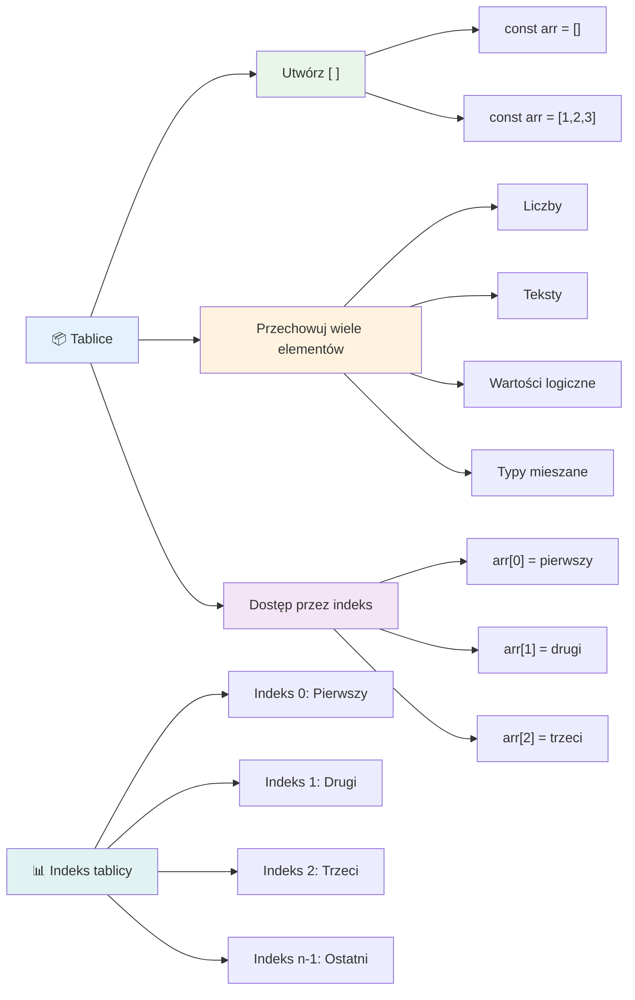
### Indeksowanie tablic

Oto coś, co może wydać się na początku nietypowe: tablice numerują swoje elementy od 0, a nie od 1. Indeksowanie oparte na zerze wywodzi się z działania pamięci komputerowej – jest to konwencja programistyczna od początków języków takich jak C. Każde miejsce w tablicy ma przypisany własny numer zwany **indeksem**.

| Indeks | Wartość | Opis |
|-------|-------|-------------|
| 0 | "Czekoladowy" | Pierwszy element |
| 1 | "Truskawkowy" | Drugi element |
| 2 | "Waniliowy" | Trzeci element |
| 3 | "Pistacjowy" | Czwarty element |
| 4 | "Rocky Road" | Piąty element |

✅ Czy zaskakuje Cię, że tablice zaczynają się od indeksu zero? W niektórych językach programowania indeksy zaczynają się od 1. Istnieje ciekawa historia dotycząca tego, którą możesz [przeczytać na Wikipedii](https://en.wikipedia.org/wiki/Zero-based_numbering).

**Dostęp do elementów tablicy:**

```javascript
const iceCreamFlavors = ["Chocolate", "Strawberry", "Vanilla", "Pistachio", "Rocky Road"];

// Uzyskaj dostęp do poszczególnych elementów za pomocą notacji nawiasowej
console.log(iceCreamFlavors[0]); // "Chocolate" - pierwszy element
console.log(iceCreamFlavors[2]); // "Vanilla" - trzeci element
console.log(iceCreamFlavors[4]); // "Rocky Road" - ostatni element
```

**Rozkład tego, co się dzieje:**
- **Używa** notacji z nawiasami kwadratowymi i numerem indeksu, aby uzyskać elementy
- **Zwraca** wartość przechowywaną na tej konkretnej pozycji w tablicy
- **Zaczyna** liczyć od 0, więc pierwszy element ma indeks 0

**Modyfikacja elementów tablicy:**

```javascript
// Zmień istniejącą wartość
iceCreamFlavors[4] = "Butter Pecan";
console.log(iceCreamFlavors[4]); // "Masło Orzechowe"

// Dodaj nowy element na końcu
iceCreamFlavors[5] = "Cookie Dough";
console.log(iceCreamFlavors[5]); // "Ciasto Ciasteczkowe"
```

**W powyższym przykładzie:**
- **Zmodyfikowano** element o indeksie 4 z "Rocky Road" na "Butter Pecan"
- **Dodano** nowy element "Cookie Dough" pod indeksem 5
- **Rozszerzono** automatycznie długość tablicy, gdy dodano element poza obecne granice

### Długość tablicy i powszechne metody

Tablice mają wbudowane właściwości i metody, które znacznie ułatwiają pracę z danymi.

**Znajdowanie długości tablicy:**

```javascript
const iceCreamFlavors = ["Chocolate", "Strawberry", "Vanilla", "Pistachio", "Rocky Road"];
console.log(iceCreamFlavors.length); // 5

// Długość aktualizuje się automatycznie wraz ze zmianą tablicy
iceCreamFlavors.push("Mint Chip");
console.log(iceCreamFlavors.length); // 6
```

**Najważniejsze punkty do zapamiętania:**
- **Zwraca** całkowitą liczbę elementów w tablicy
- **Aktualizuje się** automatycznie, gdy elementy są dodawane lub usuwane
- **Dostarcza** dynamiczną wartość przydatną w pętlach i walidacji

**Podstawowe metody tablic:**

```javascript
const fruits = ["apple", "banana", "orange"];

// Dodaj elementy
fruits.push("grape");           // Dodaje na koniec: ["jabłko", "banan", "pomarańcza", "winogrono"]
fruits.unshift("strawberry");   // Dodaje na początek: ["truskawka", "jabłko", "banan", "pomarańcza", "winogrono"]

// Usuń elementy
const lastFruit = fruits.pop();        // Usuwa i zwraca "winogrono"
const firstFruit = fruits.shift();     // Usuwa i zwraca "truskawka"

// Znajdź elementy
const index = fruits.indexOf("banana"); // Zwraca 1 (pozycja "banana")
const hasApple = fruits.includes("apple"); // Zwraca prawda
```

**Warto zrozumieć te metody:**
- **Dodaje** elementy za pomocą `push()` (na koniec) i `unshift()` (na początek)
- **Usuwa** elementy za pomocą `pop()` (z końca) i `shift()` (z początku)
- **Znajduje** elementy za pomocą `indexOf()` i sprawdza istnienie przez `includes()`
- **Zwraca** przydatne wartości, takie jak usunięte elementy lub indeksy pozycji

✅ Spróbuj sam! Użyj konsoli przeglądarki, aby stworzyć i manipulować własną tablicą.

### 🧠 **Sprawdzenie podstaw tablic: Organizowanie twoich danych**

**Sprawdź swoją wiedzę o tablicach:**
- Dlaczego tablice zaczynają liczyć od 0, a nie od 1?
- Co się stanie, jeśli spróbujesz dostać się do indeksu, który nie istnieje (np. `arr[100]` w tablicy z 5 elementami)?
- Czy potrafisz wymyślić trzy sytuacje z życia codziennego, gdzie tablice byłyby użyteczne?

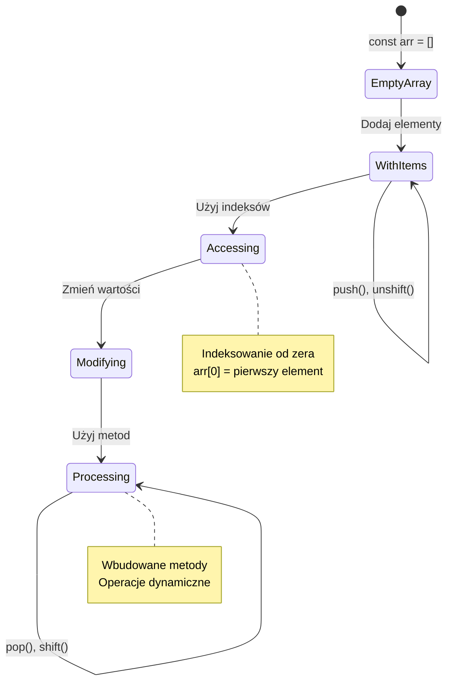
> **Wgląd z życia:** Tablice są wszędzie w programowaniu! Kanały w mediach społecznościowych, koszyki zakupowe, galerie zdjęć, playlisty z piosenkami – wszystko to tablice w tle!

## Pętle

Pomyśl o znanym karze ze starych powieści Charlesa Dickensa, gdzie uczniowie musieli wielokrotnie przepisywać zdania na tabliczce. Wyobraź sobie, że mógłbyś po prostu polecić komuś „napisz to zdanie 100 razy” i zostało by to wykonane automatycznie. Właśnie to robią pętle w twoim kodzie.

Pętle są jak niestrudzony asystent, który może powtarzać zadania bez błędów. Niezależnie czy musisz sprawdzić każdy element w koszyku zakupowym, czy wyświetlić wszystkie zdjęcia w albumie, pętle robią to efektywnie i bez powtórzeń.

JavaScript oferuje kilka typów pętli do wyboru. Przyjrzyjmy się każdemu z nich i zrozummy, kiedy ich używać.

```mermaid
flowchart TD
    A["🔄 Typy pętli"] --> B["Pętla For"]
    A --> C["Pętla While"]
    A --> D["Pętla For...of"]
    A --> E["Metoda forEach"]
    
    B --> B1["Znane iteracje"]
    B --> B2["Na podstawie licznika"]
    B --> B3["for(init; warunek; inkrementacja)"]
    
    C --> C1["Nieznane iteracje"]
    C --> C2["Na podstawie warunku"]
    C --> C3["while(warunek)"]
    
    D --> D1["Nowoczesny ES6+"]
    D --> D2["Iteracja po tablicy"]
    D --> D3["for(element z tablicy)"]
    
    E --> E1["Styl funkcyjny"]
    E --> E2["Metoda tablicy"]
    E --> E3["tablica.forEach(callback)"]
    
    F["⏰ Kiedy używać"] --> F1["For: Liczenie, indeksy"]
    F --> F2["While: Dane od użytkownika, wyszukiwanie"]
    F --> F3["For...of: Prosta iteracja"]
    F --> F4["forEach: Programowanie funkcyjne"]
    
    style A fill:#e3f2fd
    style B fill:#e8f5e8
    style C fill:#fff3e0
    style D fill:#f3e5f5
    style E fill:#e0f2f1
    style F fill:#fce4ec
```
### Pętla For

Pętla `for` jest jak ustawianie timera – wiesz dokładnie, ile razy coś ma się wydarzyć. Jest bardzo uporządkowana i przewidywalna, co sprawia, że jest idealna, gdy pracujesz z tablicami lub potrzebujesz liczyć elementy.

**Struktura pętli for:**

| Składnik | Cel | Przykład |
|-----------|---------|----------|
| **Inicjalizacja** | Ustawia punkt startowy | `let i = 0` |
| **Warunek** | Kiedy kontynuować | `i < 10` |
| **Inkrementacja** | Jak aktualizować | `i++` |

```javascript
// Liczenie od 0 do 9
for (let i = 0; i < 10; i++) {
  console.log(`Count: ${i}`);
}

// Bardziej praktyczny przykład: przetwarzanie wyników
const testScores = [85, 92, 78, 96, 88];
for (let i = 0; i < testScores.length; i++) {
  console.log(`Student ${i + 1}: ${testScores[i]}%`);
}
```

**Krok po kroku, co się dzieje:**
- **Inicjalizuje** zmienną licznik `i` na 0 na początku
- **Sprawdza** warunek `i < 10` przed każdą iteracją
- **Wykonuje** blok kodu, gdy warunek jest prawdziwy
- **Zwiększa** `i` o 1 po każdej iteracji za pomocą `i++`
- **Zatrzymuje** się, gdy warunek stanie się fałszywy (gdy `i` osiągnie 10)

✅ Uruchom ten kod w konsoli przeglądarki. Co się stanie, gdy wprowadzisz małe zmiany w liczniku, warunku lub wyrażeniu iteracji? Czy potrafisz sprawić, by działał wstecz, tworząc odliczanie?

### 🗓️ **Sprawdzenie mistrzostwa pętli for: Kontrolowane powtarzanie**

**Oceń swoje zrozumienie pętli for:**
- Jakie są trzy części pętli for i do czego służy każda z nich?
- Jak byś iterował tablicę wstecz?
- Co się stanie, jeśli zapomnisz o inkrementacji (`i++`)?

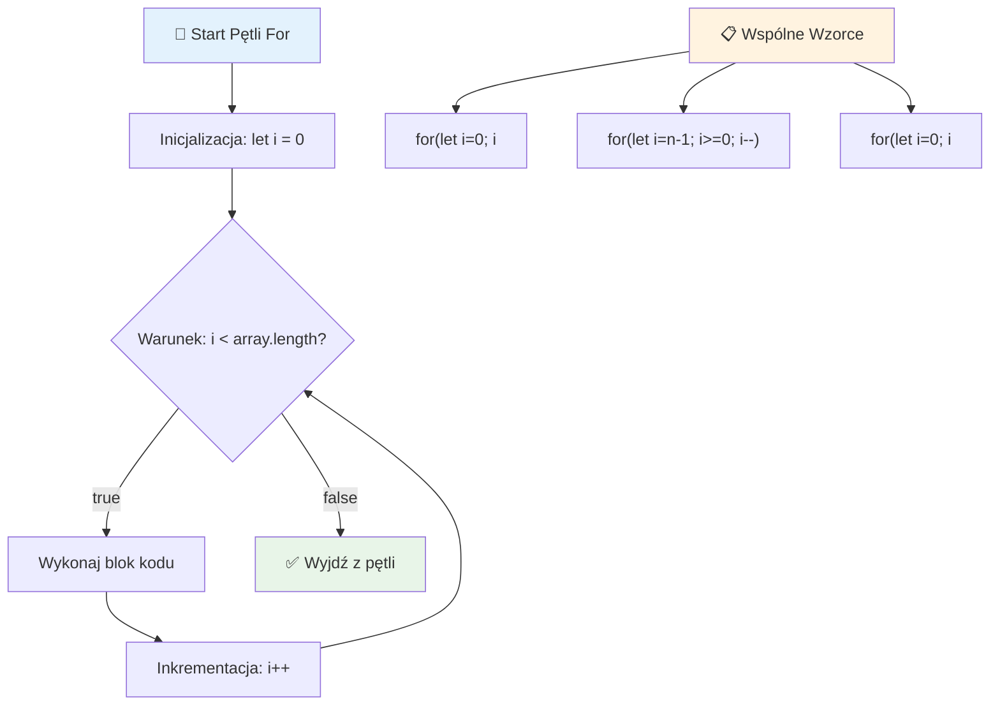
> **Mądrość pętli**: Pętle for są idealne, gdy dokładnie wiesz, ile razy chcesz coś powtórzyć. Są najczęstszym wyborem do przetwarzania tablic!

### Pętla While

Pętla `while` jest jak mówienie „rób to, dopóki…” – możesz nie znać dokładnej liczby iteracji, ale wiesz, kiedy trzeba przestać. Idealnie nadaje się do sytuacji takich jak pytanie użytkownika o dane, dopóki nie poda poprawnej odpowiedzi, lub przeszukiwanie danych, aż znajdziesz to, czego szukasz.

**Cechy pętli while:**
- **Kontynuuje** wykonywanie, dopóki warunek jest prawdziwy
- **Wymaga** ręcznego zarządzania zmiennymi liczników
- **Sprawdza** warunek przed każdą iteracją
- **Grozi** niekończącą się pętlą, jeśli warunek nigdy nie stanie się fałszywy

```javascript
// Podstawowy przykład liczenia
let i = 0;
while (i < 10) {
  console.log(`While count: ${i}`);
  i++; // Nie zapomnij zwiększyć!
}

// Bardziej praktyczny przykład: przetwarzanie danych wejściowych użytkownika
let userInput = "";
let attempts = 0;
const maxAttempts = 3;

while (userInput !== "quit" && attempts < maxAttempts) {
  userInput = prompt(`Enter 'quit' to exit (attempt ${attempts + 1}):`);
  attempts++;
}

if (attempts >= maxAttempts) {
  console.log("Maximum attempts reached!");
}
```

**Zrozumienie tych przykładów:**
- **Zarządza** zmienną licznik `i` ręcznie wewnątrz ciała pętli
- **Zwiększa** licznik by zapobiec nieskończonej pętli
- **Pokazuje** praktyczne użycie z wprowadzaniem danych od użytkownika i ograniczeniem prób
- **Zawiera** mechanizmy bezpieczeństwa, by uniknąć nieskończonego wykonywania

### ♾️ **Sprawdzenie mądrości pętli while: Powtarzanie oparte na warunku**

**Sprawdź swoją wiedzę o pętli while:**
- Jakie jest główne zagrożenie podczas używania pętli while?
- Kiedy wybrałbyś pętlę while zamiast for?
- Jak zapobiec nieskończonym pętlom?

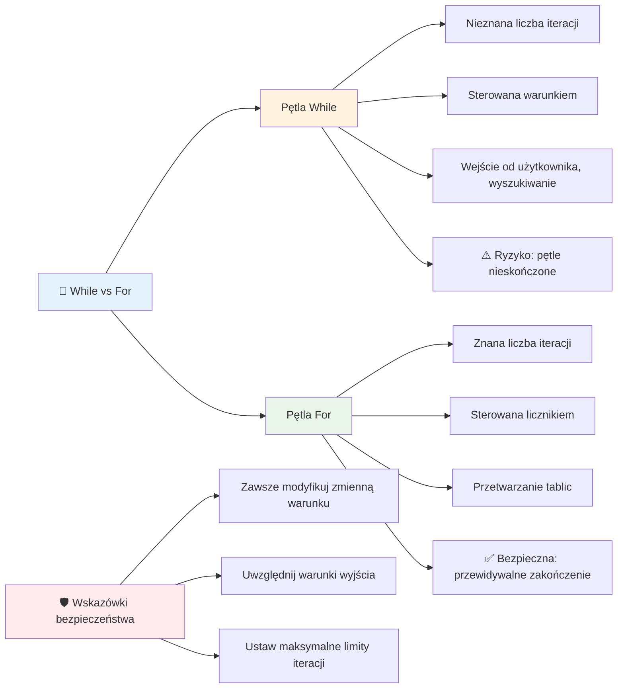
> **Bezpieczeństwo przede wszystkim**: Pętle while są potężne, lecz wymagają ostrożnego zarządzania warunkiem. Zawsze upewnij się, że warunek pętli ostatecznie stanie się fałszywy!

### Nowoczesne alternatywy dla pętli

JavaScript oferuje nowoczesną składnię pętli, która może uczynić twój kod bardziej czytelnym i mniej podatnym na błędy.

**Pętla For...of (ES6+):**

```javascript
const colors = ["red", "green", "blue", "yellow"];

// Nowoczesne podejście - czyściej i bezpieczniej
for (const color of colors) {
  console.log(`Color: ${color}`);
}

// Porównaj z tradycyjną pętlą for
for (let i = 0; i < colors.length; i++) {
  console.log(`Color: ${colors[i]}`);
}
```

**Kluczowe zalety for...of:**
- **Eliminuje** zarządzanie indeksami i potencjalne błędy "off-by-one"
- **Zapewnia** bezpośredni dostęp do elementów tablicy
- **Poprawia** czytelność kodu i zmniejsza złożoność składniową

**Metoda forEach:**

```javascript
const prices = [9.99, 15.50, 22.75, 8.25];

// Używanie forEach w stylu programowania funkcyjnego
prices.forEach((price, index) => {
  console.log(`Item ${index + 1}: $${price.toFixed(2)}`);
});

// forEach z funkcjami strzałkowymi dla prostych operacji
prices.forEach(price => console.log(`Price: $${price}`));
```

**Co warto wiedzieć o forEach:**
- **Wykonuje** funkcję dla każdego elementu tablicy
- **Dostarcza** zarówno wartość elementu, jak i jego indeks jako parametry
- **Nie można** przerwać wcześniej (w przeciwieństwie do tradycyjnych pętli)
- **Zwraca** undefined (nie tworzy nowej tablicy)

✅ Dlaczego wybrałbyś pętlę for zamiast while? 17 tysięcy użytkowników StackOverflow zadało to pytanie, a niektóre opinie [mogą być dla Ciebie ciekawe](https://stackoverflow.com/questions/39969145/while-loops-vs-for-loops-in-javascript).

### 🎨 **Sprawdzenie składni nowoczesnych pętli: Przyjmowanie ES6+**

**Oceń swoje zrozumienie nowoczesnego JavaScript:**
- Jakie są zalety `for...of` nad tradycyjnymi pętlami for?
- Kiedy nadal mogłeś woleć tradycyjne pętle for?
- Jaka jest różnica między `forEach` a `map`?

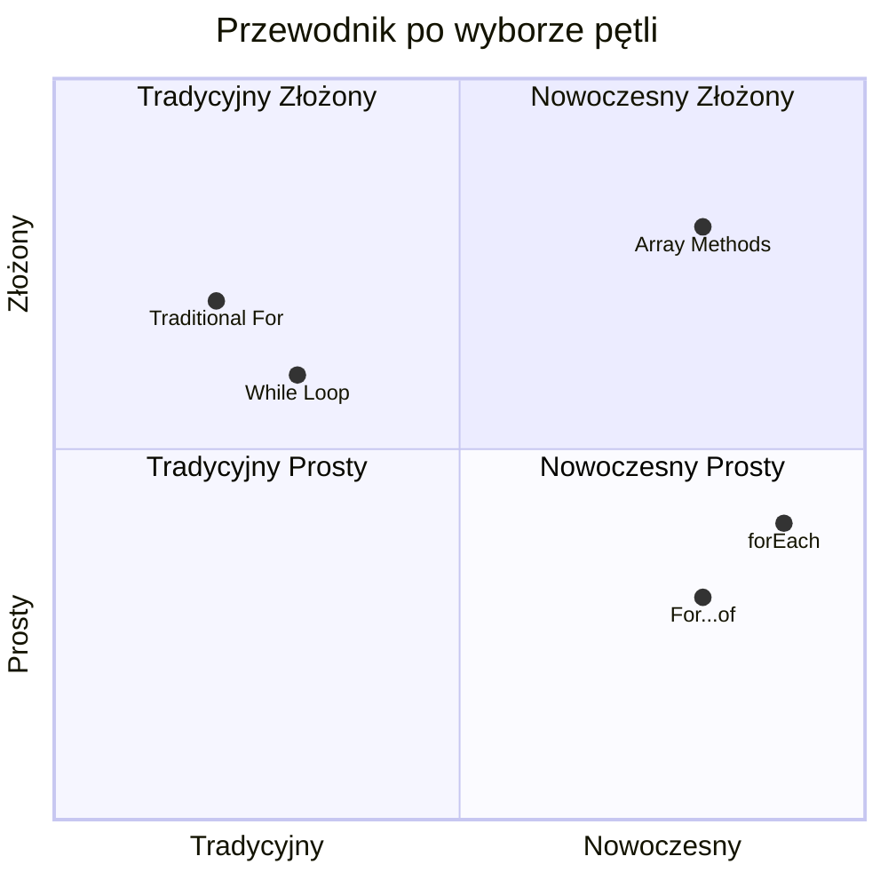
> **Nowoczesny trend**: Składnia ES6+ jak `for...of` i `forEach` staje się preferowanym podejściem do iteracji tablic, bo jest czyściejsza i mniej podatna na błędy!

## Pętle i Tablice

Połączenie tablic z pętlami daje potężne możliwości przetwarzania danych. To podstawowa para dla wielu zadań programistycznych - od wyświetlania list po wyliczanie statystyk.

**Tradycyjne przetwarzanie tablic:**

```javascript
const iceCreamFlavors = ["Chocolate", "Strawberry", "Vanilla", "Pistachio", "Rocky Road"];

// Klasyczne podejście pętli for
for (let i = 0; i < iceCreamFlavors.length; i++) {
  console.log(`Flavor ${i + 1}: ${iceCreamFlavors[i]}`);
}

// Nowoczesne podejście for...of
for (const flavor of iceCreamFlavors) {
  console.log(`Available flavor: ${flavor}`);
}
```

**Zrozummy każde podejście:**
- **Używa** właściwości długości tablicy do określenia granic pętli
- **Dostęp** do elementów przez indeks w tradycyjnych pętlach for
- **Zapewnia** bezpośredni dostęp do elementów w pętlach for...of
- **Przetwarza** każdy element tablicy dokładnie raz

**Praktyczny przykład przetwarzania danych:**

```javascript
const studentGrades = [85, 92, 78, 96, 88, 73, 89];
let total = 0;
let highestGrade = studentGrades[0];
let lowestGrade = studentGrades[0];

// Przetwórz wszystkie oceny za pomocą jednej pętli
for (let i = 0; i < studentGrades.length; i++) {
  const grade = studentGrades[i];
  total += grade;
  
  if (grade > highestGrade) {
    highestGrade = grade;
  }
  
  if (grade < lowestGrade) {
    lowestGrade = grade;
  }
}

const average = total / studentGrades.length;
console.log(`Average: ${average.toFixed(1)}`);
console.log(`Highest: ${highestGrade}`);
console.log(`Lowest: ${lowestGrade}`);
```

**Tak działa ten kod:**
- **Inicjalizuje** zmienne do śledzenia sumy i wartości ekstremalnych
- **Przetwarza** każdą ocenę w jednej, efektywnej pętli
- **Akumuluje** sumę do obliczenia średniej
- **Śledzi** najwyższe i najniższe wartości podczas iteracji
- **Oblicza** końcowe statystyki po zakończeniu pętli

✅ Eksperymentuj z iteracją nad tablicą stworzoną przez siebie w konsoli przeglądarki.

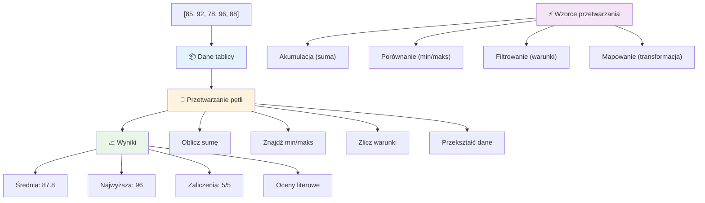
---

## Wyzwanie Agenta GitHub Copilot 🚀

Użyj trybu Agent, aby wykonać następujące wyzwanie:

**Opis:** Zbuduj kompleksową funkcję przetwarzającą dane, która łączy tablice i pętle do analizy zestawu danych i generowania znaczących wniosków.

**Zadanie:** Stwórz funkcję nazwaną `analyzeGrades`, która przyjmuje tablicę obiektów ocen uczniów (każdy z właściwościami name i score) i zwraca obiekt ze statystykami, w tym najwyższą oceną, najniższą oceną, średnią oceną, liczbą uczniów, którzy zdali (score >= 70) oraz tablicą imion uczniów, którzy uzyskali wynik powyżej średniej. Użyj co najmniej dwóch różnych typów pętli w swoim rozwiązaniu.

Dowiedz się więcej o [trybie agenta](https://code.visualstudio.com/blogs/2025/02/24/introducing-copilot-agent-mode) tutaj.

## 🚀 Wyzwanie
JavaScript oferuje kilka nowoczesnych metod tablicowych, które mogą zastąpić tradycyjne pętle w określonych zadaniach. Poznaj [forEach](https://developer.mozilla.org/docs/Web/JavaScript/Reference/Global_Objects/Array/forEach), [for-of](https://developer.mozilla.org/docs/Web/JavaScript/Reference/Statements/for...of), [map](https://developer.mozilla.org/docs/Web/JavaScript/Reference/Global_Objects/Array/map), [filter](https://developer.mozilla.org/docs/Web/JavaScript/Reference/Global_Objects/Array/filter) oraz [reduce](https://developer.mozilla.org/docs/Web/JavaScript/Reference/Global_Objects/Array/reduce).

**Twoje wyzwanie:** Przeprojektuj przykład ocen uczniów, używając co najmniej trzech różnych metod tablicowych. Zauważ, jak dużo czytelniejszy i przejrzystszy staje się kod z nowoczesną składnią JavaScript.

## Quiz po wykładzie
[Quiz po wykładzie](https://ff-quizzes.netlify.app/web/quiz/14)


## Przegląd i samodzielna nauka

Tablice w JavaScript mają wiele metod, które są niezwykle przydatne do manipulacji danymi. [Przeczytaj o tych metodach](https://developer.mozilla.org/docs/Web/JavaScript/Reference/Global_Objects/Array) i wypróbuj niektóre z nich (takie jak push, pop, slice i splice) na tablicy, którą stworzysz samodzielnie.

## Zadanie

[Przeiteruj tablicę](assignment.md)

---

## 📊 **Podsumowanie Twojego zestawu narzędzi: Tablice i Pętle**

```mermaid
graph TD
    A["🎯 Mistrzostwo tablic i pętli"] --> B["📦 Podstawy tablic"]
    A --> C["🔄 Typy pętli"]
    A --> D["🔗 Przetwarzanie danych"]
    A --> E["🎨 Nowoczesne techniki"]
    
    B --> B1["Tworzenie: [ ]"]
    B --> B2["Indeksowanie: arr[0]"]
    B --> B3["Metody: push, pop"]
    B --> B4["Właściwości: length"]
    
    C --> C1["For: Znana liczba iteracji"]
    C --> C2["While: Na podstawie warunku"]
    C --> C3["For...of: Bezpośredni dostęp"]
    C --> C4["forEach: Funkcyjna"]
    
    D --> D1["Obliczanie statystyk"]
    D --> D2["Transformacja danych"]
    D --> D3["Filtrowanie i wyszukiwanie"]
    D --> D4["Przetwarzanie w czasie rzeczywistym"]
    
    E --> E1["Funkcje strzałkowe"]
    E --> E2["Łańcuchowe wywołania metod"]
    E --> E3["Destrukturyzacja"]
    E --> E4["Szablony tekstowe"]
    
    F["💡 Kluczowe korzyści"] --> F1["Efektywna obsługa danych"]
    F --> F2["Zredukowana powtarzalność kodu"]
    F --> F3["Skalowalne rozwiązania"]
    F --> F4["Czystsza składnia"]
    
    style A fill:#e3f2fd
    style B fill:#e8f5e8
    style C fill:#fff3e0
    style D fill:#f3e5f5
    style E fill:#e0f2f1
    style F fill:#fce4ec
```
---

## 🚀 Twoja oś czasu do opanowania tablic i pętli

### ⚡ **Co możesz zrobić w ciągu następnych 5 minut**
- [ ] Stwórz tablicę ulubionych filmów i uzyskaj dostęp do konkretnych elementów
- [ ] Napisz pętlę for, która liczy od 1 do 10
- [ ] Wypróbuj wyzwanie z nowoczesnymi metodami tablic z lekcji
- [ ] Ćwicz indeksowanie tablic w konsoli przeglądarki

### 🎯 **Co możesz osiągnąć w ciągu tej godziny**
- [ ] Ukończ quiz po lekcji i przejrzyj trudniejsze zagadnienia
- [ ] Zbuduj kompleksowy analizator ocen z wyzwania GitHub Copilot
- [ ] Stwórz prosty koszyk zakupowy, który dodaje i usuwa przedmioty
- [ ] Ćwicz konwersję między różnymi typami pętli
- [ ] Eksperymentuj z metodami tablic jak `push`, `pop`, `slice` i `splice`

### 📅 **Twoja tygodniowa podróż w przetwarzaniu danych**
- [ ] Ukończ zadanie "Przeiteruj tablicę" z kreatywnymi ulepszeniami
- [ ] Stwórz aplikację listy rzeczy do zrobienia, używając tablic i pętli
- [ ] Zbuduj prosty kalkulator statystyk dla danych liczbowych
- [ ] Ćwicz z [metodami tablic MDN](https://developer.mozilla.org/docs/Web/JavaScript/Reference/Global_Objects/Array)
- [ ] Zbuduj interfejs galerii zdjęć lub listy odtwarzania muzyki
- [ ] Poznaj programowanie funkcyjne za pomocą `map`, `filter` i `reduce`

### 🌟 **Twoja miesięczna transformacja**
- [ ] Opanuj zaawansowane operacje na tablicach oraz optymalizację wydajności
- [ ] Zbuduj kompletny panel wizualizacji danych
- [ ] Wnieś wkład w projekty open source związane z przetwarzaniem danych
- [ ] Nauczaj kogoś innego o tablicach i pętlach na praktycznych przykładach
- [ ] Stwórz osobistą bibliotekę wielokrotnego użytku funkcji do przetwarzania danych
- [ ] Poznaj algorytmy i struktury danych oparte na tablicach

### 🏆 **Ostateczne sprawdzenie mistrzostwa w przetwarzaniu danych**

**Świętuj swoje mistrzostwo w pracy z tablicami i pętlami:**
- Jaka operacja na tablicach jest dla Ciebie najbardziej przydatna w zastosowaniach praktycznych?
- Który typ pętli wydaje Ci się najbardziej naturalny i dlaczego?
- Jak zrozumienie tablic i pętli zmieniło Twój sposób organizowania danych?
- Jakie złożone zadanie przetwarzania danych chciałbyś/chciałabyś rozwiązać jako następne?

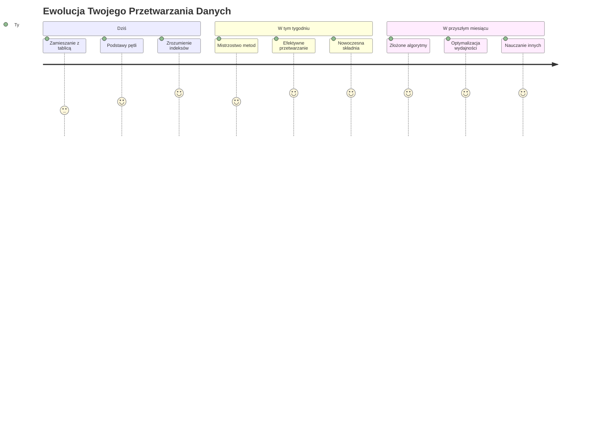
> 📦 **Odblokowałeś moc organizacji i przetwarzania danych!** Tablice i pętle są fundamentem niemal każdej aplikacji, jaką kiedykolwiek zbudujesz. Od prostych list po zaawansowaną analizę danych, masz teraz narzędzia, by efektywnie i elegancko zarządzać informacjami. Każda dynamiczna strona internetowa, aplikacja mobilna i aplikacja oparta na danych opiera się na tych podstawowych koncepcjach. Witamy w świecie skalowalnego przetwarzania danych! 🎉

---

<!-- CO-OP TRANSLATOR DISCLAIMER START -->
**Zastrzeżenie**:  
Niniejszy dokument został przetłumaczony przy użyciu usługi tłumaczenia AI [Co-op Translator](https://github.com/Azure/co-op-translator). Pomimo naszych starań, aby zapewnić dokładność, prosimy pamiętać, że tłumaczenia automatyczne mogą zawierać błędy lub nieścisłości. Oryginalny dokument w języku źródłowym powinien być uznawany za wiarygodne źródło. W przypadku informacji krytycznych zaleca się skorzystanie z profesjonalnego tłumaczenia wykonanego przez człowieka. Nie ponosimy odpowiedzialności za jakiekolwiek nieporozumienia lub błędne interpretacje wynikające z korzystania z tego tłumaczenia.
<!-- CO-OP TRANSLATOR DISCLAIMER END -->