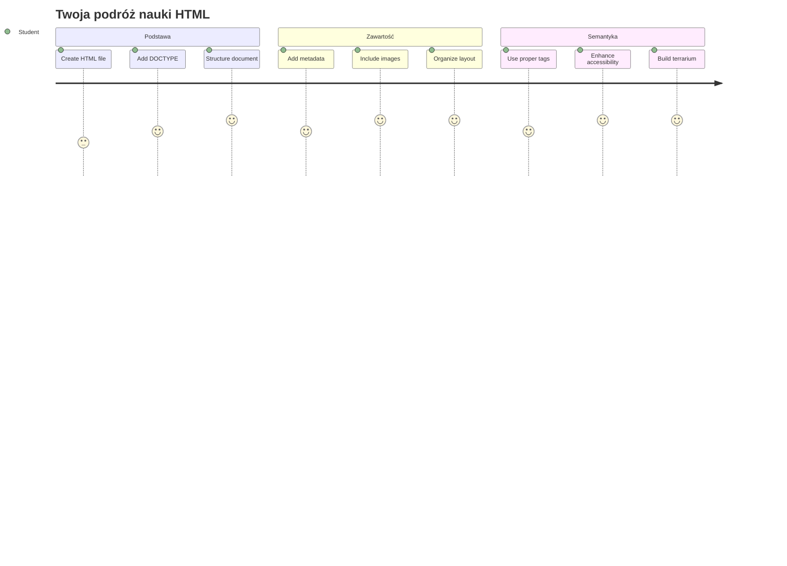
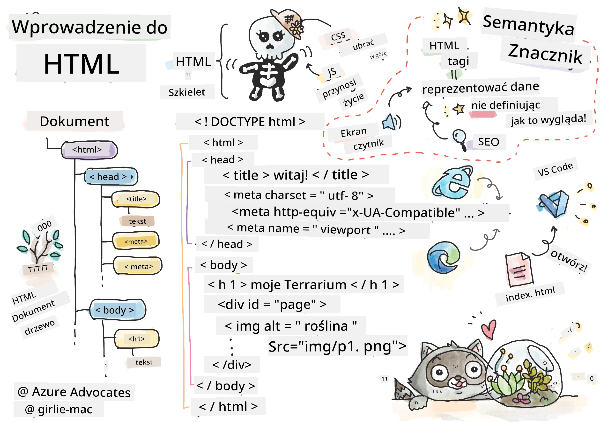
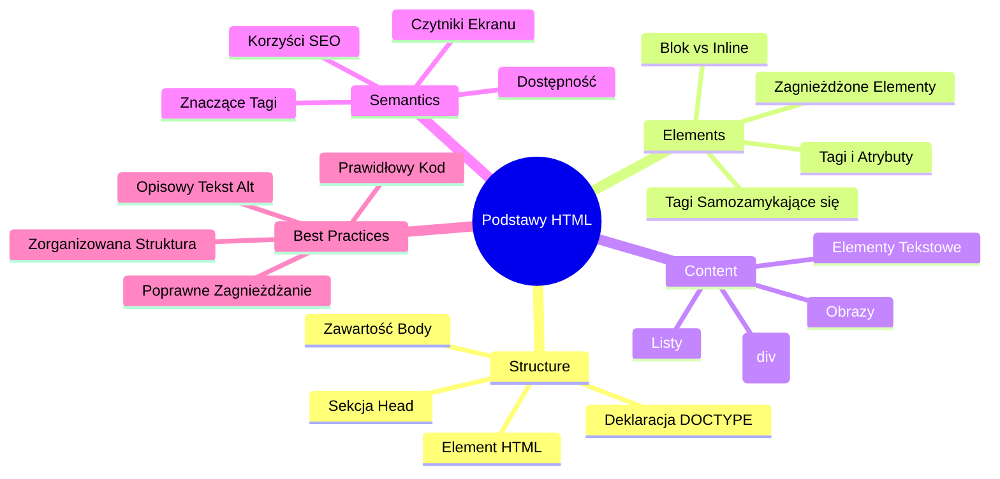
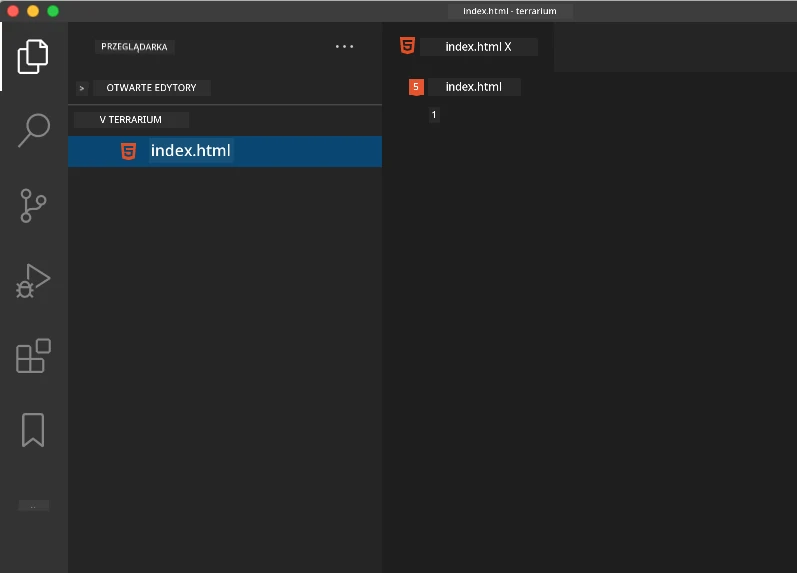
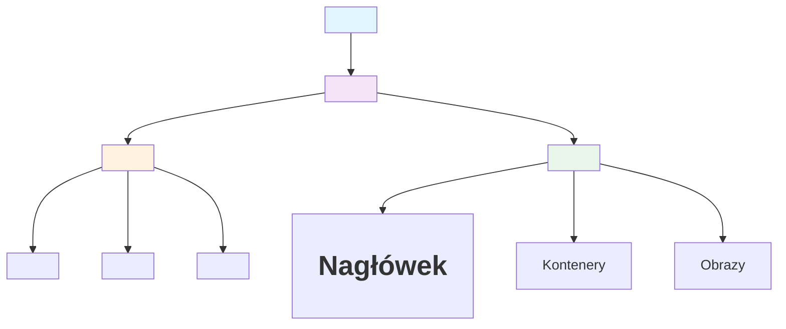
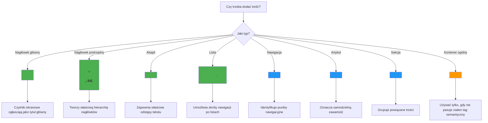
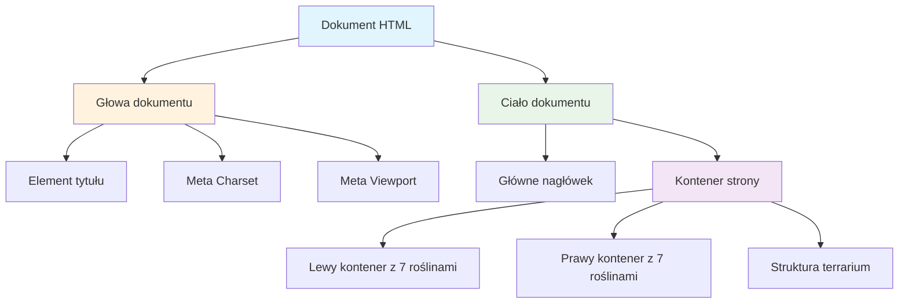
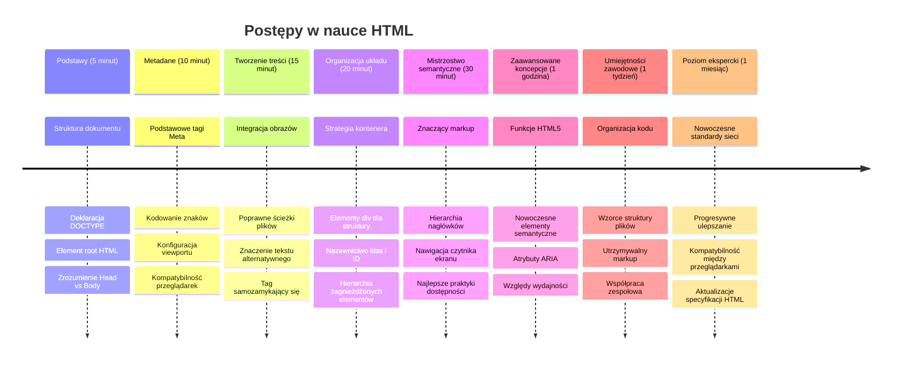

<!--
CO_OP_TRANSLATOR_METADATA:
{
  "original_hash": "3fcfa99c4897e051b558b5eaf1e8cc74",
  "translation_date": "2026-01-06T19:45:01+00:00",
  "source_file": "3-terrarium/1-intro-to-html/README.md",
  "language_code": "pl"
}
-->
# Projekt Terrarium Część 1: Wprowadzenie do HTML



> Sketchnote autorstwa [Tomomi Imura](https://twitter.com/girlie_mac)

HTML, czyli HyperText Markup Language, to fundament każdej odwiedzanej witryny. Pomyśl o HTML jak o szkielecie nadającym strukturę stronom internetowym – definiuje, gdzie trafia zawartość, jak jest zorganizowana i co reprezentuje każdy element. Podczas gdy CSS później "ubrać" Twój HTML kolorami i układami, a JavaScript tchnie w niego życie dzięki interaktywności, HTML zapewnia niezbędną strukturę, która umożliwia wszystko inne.

W tej lekcji stworzysz strukturę HTML dla wirtualnego interfejsu terrarium. Ten praktyczny projekt nauczy Cię podstawowych pojęć HTML, jednocześnie budując coś wizualnie angażującego. Nauczysz się organizować zawartość za pomocą semantycznych elementów, pracować z obrazami i stworzyć fundament pod interaktywną aplikację webową.

Pod koniec lekcji będziesz mieć działającą stronę HTML wyświetlającą obrazy roślin w uporządkowanych kolumnach, gotową do stylizacji w następnej lekcji. Nie martw się, jeśli na początku będzie wyglądać to prosto – dokładnie tak powinien wyglądać HTML zanim CSS doda wizualny szlif.


## Quiz przed wykładem

[Quiz przed wykładem](https://ff-quizzes.netlify.app/web/quiz/15)

> 📺 **Oglądaj i ucz się**: Sprawdź ten pomocny przegląd wideo
> 
> [](https://www.youtube.com/watch?v=1TvxJKBzhyQ)

## Konfigurowanie projektu

Zanim zanurzymy się w kod HTML, ustawmy odpowiednie miejsce pracy dla Twojego projektu terrarium. Utworzenie zorganizowanej struktury plików od samego początku to kluczowy nawyk, który będzie Ci służył przez całą przygodę z tworzeniem stron.

### Zadanie: Stwórz strukturę projektu

Stworzysz dedykowany folder dla projektu terrarium i dodasz pierwszy plik HTML. Oto dwa podejścia, które możesz wykorzystać:

**Opcja 1: Korzystanie z Visual Studio Code**
1. Otwórz Visual Studio Code
2. Kliknij „Plik” → „Otwórz folder” lub użyj `Ctrl+K, Ctrl+O` (Windows/Linux) lub `Cmd+K, Cmd+O` (Mac)
3. Utwórz nowy folder o nazwie `terrarium` i wybierz go
4. W panelu Eksploratora kliknij ikonę „Nowy plik”
5. Nazwij swój plik `index.html`



**Opcja 2: Korzystanie z poleceń terminala**
```bash
mkdir terrarium
cd terrarium
touch index.html
code index.html
```

**Co robią te polecenia:**
- **Tworzą** nowy katalog o nazwie `terrarium` na Twój projekt
- **Przechodzą** do katalogu terrarium
- **Tworzą** pusty plik `index.html`
- **Otwierają** plik w Visual Studio Code do edycji

> 💡 **Wskazówka**: Nazwa pliku `index.html` jest wyjątkowa w tworzeniu stron. Kiedy ktoś odwiedza witrynę, przeglądarki automatycznie szukają `index.html` jako domyślnej strony do wyświetlenia. Oznacza to, że URL taki jak `https://mysite.com/projects/` automatycznie poda plik `index.html` z folderu `projects` bez konieczności podawania nazwy pliku w URL.

## Zrozumienie struktury dokumentu HTML

Każdy dokument HTML ma określoną strukturę, którą przeglądarki muszą zrozumieć, aby poprawnie wyświetlać zawartość. Pomyśl o tej strukturze jak o formalnym liście – ma wymagane elementy w ustalonej kolejności, które pomagają odbiorcy (czyli przeglądarce) poprawnie przetworzyć zawartość.


Zacznijmy od dodania niezbędnej podstawy, której potrzebuje każdy dokument HTML.

### Deklaracja DOCTYPE i element root

Pierwsze dwie linijki każdego pliku HTML to „wprowadzenie” dokumentu dla przeglądarki:

```html
<!DOCTYPE html>
<html></html>
```

**Co robi ten kod:**
- **Deklaruje** typ dokumentu jako HTML5 za pomocą `<!DOCTYPE html>`
- **Tworzy** element root `<html>`, który będzie zawierać całą zawartość strony
- **Ustanawia** nowoczesne standardy webowe dla poprawnego renderowania w przeglądarkach
- **Zapewnia** spójne wyświetlanie we wszystkich przeglądarkach i na różnych urządzeniach

> 💡 **Wskazówka VS Code**: Najedź kursorem na dowolny tag HTML w VS Code, aby zobaczyć pomocne informacje z MDN Web Docs, w tym przykłady użycia i zgodność z przeglądarkami.

> 📚 **Dowiedz się więcej**: Deklaracja DOCTYPE zapobiega przejściu przeglądarek w „quirks mode”, który był używany do obsługi bardzo starych stron. Nowoczesne tworzenie stron wykorzystuje prostą deklarację `<!DOCTYPE html>`, aby zapewnić [renderowanie zgodne ze standardami](https://developer.mozilla.org/docs/Web/HTML/Quirks_Mode_and_Standards_Mode).

### 🔄 **Sprawdzenie pedagogiczne**
**Zatrzymaj się i przemyśl**: Przed kontynuacją upewnij się, że rozumiesz:
- ✅ Dlaczego każdy dokument HTML potrzebuje deklaracji DOCTYPE
- ✅ Co zawiera element root `<html>`
- ✅ Jak ta struktura pomaga przeglądarkom poprawnie renderować strony

**Szybki test samodzielny**: Czy potrafisz własnymi słowami wyjaśnić, co oznacza „renderowanie zgodne ze standardami”?

## Dodawanie niezbędnych metadanych dokumentu

Sekcja `<head>` dokumentu HTML zawiera kluczowe informacje, których przeglądarki i wyszukiwarki potrzebują, ale których odwiedzający bezpośrednio na stronie nie widzą. Pomyśl o niej jak o „kulisy” informacji, które pomagają Twojej stronie działać poprawnie i wyglądać dobrze na różnych urządzeniach i platformach.

Te metadane informują przeglądarki, jak wyświetlać stronę, jakie kodowanie znaków stosować i jak obsługiwać różne rozmiary ekranów – to wszystko niezbędne do tworzenia profesjonalnych, dostępnych stron internetowych.

### Zadanie: Dodaj sekcję head

Wstaw tę sekcję `<head>` między otwierającym i zamykającym tagiem `<html>`:

```html
<head>
	<title>Welcome to my Virtual Terrarium</title>
	<meta charset="utf-8" />
	<meta http-equiv="X-UA-Compatible" content="IE=edge" />
	<meta name="viewport" content="width=device-width, initial-scale=1" />
</head>
```

**Co robi każdy element:**
- **Ustawia** tytuł strony pojawiający się na kartach przeglądarki i w wynikach wyszukiwania
- **Określa** kodowanie znaków UTF-8 dla poprawnego wyświetlania tekstu na całym świecie
- **Zapewnia** kompatybilność z nowoczesnymi wersjami Internet Explorera
- **Konfiguruje** design responsywny przez ustawienie viewport zgodnie z szerokością urządzenia
- **Kontroluje** początkowy poziom powiększenia, aby zawartość wyświetlała się w naturalnym rozmiarze

> 🤔 **Pomyśl nad tym**: Co by się stało, gdybyś ustawił tag viewport tak: `<meta name="viewport" content="width=600">`? Spowodowałoby to, że strona zawsze miałaby szerokość 600 pikseli, co zepsułoby responsywny design! Dowiedz się więcej o [poprawnej konfiguracji viewport](https://developer.mozilla.org/docs/Web/HTML/Viewport_meta_tag).

## Budowa ciała dokumentu

Element `<body>` zawiera całą widoczną zawartość strony – wszystko, co użytkownicy zobaczą i z czym będą wchodzić w interakcję. Podczas gdy sekcja `<head>` dostarczała instrukcji dla przeglądarki, sekcja `<body>` zawiera faktyczną zawartość: tekst, obrazy, przyciski i inne elementy tworzące interfejs użytkownika.

Dodajmy strukturę ciała i zrozummy, jak tagi HTML współpracują, by tworzyć znaczącą zawartość.

### Zrozumienie struktury tagów HTML

HTML używa par tagów do definiowania elementów. Większość tagów ma otwierający `<p>` i zamykający `</p>`, a pomiędzy nim zawartość: `<p>Witaj, świecie!</p>`. Tworzy to element akapitu zawierający tekst „Witaj, świecie!”.

### Zadanie: Dodaj element body

Uaktualnij plik HTML, aby zawierał element `<body>`:

```html
<!DOCTYPE html>
<html>
	<head>
		<title>Welcome to my Virtual Terrarium</title>
		<meta charset="utf-8" />
		<meta http-equiv="X-UA-Compatible" content="IE=edge" />
		<meta name="viewport" content="width=device-width, initial-scale=1" />
	</head>
	<body></body>
</html>
```

**Co oferuje ta kompletna struktura:**
- **Tworzy** podstawowy szkielet dokumentu HTML5
- **Zawiera** niezbędne metadane do właściwego renderowania w przeglądarce
- **Tworzy** pusty body gotowy na widoczną zawartość
- **Zgodna** z najlepszymi praktykami nowoczesnego tworzenia stron

Teraz możesz dodać widoczne elementy swojego terrarium. Użyjemy elementów `<div>` jako pojemników do organizacji różnych sekcji zawartości oraz elementów `` do wyświetlania obrazów roślin.

### Praca z obrazami i kontenerami układu

Obrazy w HTML są szczególne, ponieważ używają tagów samodomykających się. W odróżnieniu od elementów takich jak `<p></p>`, które otaczają zawartość, tag `` zawiera wszystkie informacje bezpośrednio wewnątrz tagu za pomocą atrybutów takich jak `src` dla ścieżki pliku i `alt` dla dostępności.

Zanim dodasz obrazy do HTML, musisz właściwie zorganizować pliki projektu, tworząc folder images i dodając w nim grafiki roślin.

**Najpierw przygotuj obrazy:**
1. Utwórz folder `images` wewnątrz folderu projektu terrarium
2. Pobierz obrazy roślin z [folderu rozwiązania](../../../../3-terrarium/solution/images) (łącznie 14 obrazów)
3. Skopiuj wszystkie obrazy roślin do nowego folderu `images`

### Zadanie: Stwórz układ wyświetlania roślin

Dodaj teraz obrazy roślin zorganizowane w dwóch kolumnach między tagami `<body></body>`:

```html
<div id="page">
	<div id="left-container" class="container">
		<div class="plant-holder">
			
		</div>
		<div class="plant-holder">
			
		</div>
		<div class="plant-holder">
			
		</div>
		<div class="plant-holder">
			
		</div>
		<div class="plant-holder">
			
		</div>
		<div class="plant-holder">
			
		</div>
		<div class="plant-holder">
			
		</div>
	</div>
	<div id="right-container" class="container">
		<div class="plant-holder">
			
		</div>
		<div class="plant-holder">
			
		</div>
		<div class="plant-holder">
			
		</div>
		<div class="plant-holder">
			
		</div>
		<div class="plant-holder">
			
		</div>
		<div class="plant-holder">
			
		</div>
		<div class="plant-holder">
			
		</div>
	</div>
</div>
```

**Co krok po kroku robi ten kod:**
- **Tworzy** główny pojemnik strony z `id="page"` na całą zawartość
- **Ustanawia** dwa pojemniki kolumn: `left-container` i `right-container`
- **Organizuje** 7 roślin w lewej i 7 w prawej kolumnie
- **Opakowuje** każdy obraz rośliny w div `plant-holder` dla indywidualnego pozycjonowania
- **Stosuje** spójne nazwy klas do stylizacji CSS w następnej lekcji
- **Przypisuje** unikalne ID każdemu obrazowi rośliny do późniejszej interakcji w JavaScript
- **Zawiera** właściwe ścieżki do folderu images

> 🤔 **Zastanów się**: Zauważ, że wszystkie obrazy mają ten sam tekst alt "plant". To nie jest idealne dla dostępności. Użytkownicy czytników ekranu usłyszą „plant” powtarzane 14 razy, nie wiedząc, która roślina jest którą. Czy potrafisz wymyślić lepsze, bardziej opisowe teksty alt dla każdego obrazu?

> 📝 **Rodzaje elementów HTML**: Elementy `<div>` są „blokowe” i zajmują całą szerokość, natomiast `<span>` są „inline” i zajmują tylko potrzebną szerokość. Co myślisz, co by się stało, gdybyś zamienił wszystkie `<div>` na `<span>`?

### 🔄 **Sprawdzenie pedagogiczne**
**Zrozumienie struktury**: Poświęć chwilę na przegląd swojej struktury HTML:
- ✅ Czy potrafisz wskazać główne pojemniki w układzie?
- ✅ Czy rozumiesz, dlaczego każdy obraz ma unikalne ID?
- ✅ Jak opisałbyś cel divów `plant-holder`?

**Sprawdzenie wizualne**: Otwórz plik HTML w przeglądarce. Powinieneś zobaczyć:
- Podstawową listę obrazów roślin
- Obrazy zorganizowane w dwóch kolumnach
- Prosty, niestylizowany układ

**Pamiętaj**: Ta uproszczona forma to dokładnie to, jak HTML powinien wyglądać przed stylizacją CSS!

Dzięki temu oznaczeniu rośliny pojawią się na ekranie, choć nie będą jeszcze dopracowane wizualnie – do tego służy CSS w następnej lekcji! Na teraz masz solidną bazę HTML, która dobrze organizuje zawartość i stosuje najlepsze praktyki dostępności.

## Używanie semantycznego HTML dla dostępności

Semantyczny HTML oznacza dobór elementów HTML na podstawie ich znaczenia i roli, a nie tylko wyglądu. Kiedy stosujesz semantyczny znacznik, przekazujesz strukturę i znaczenie treści przeglądarkom, wyszukiwarkom i technologiom wspomagającym, takim jak czytniki ekranu.


Takie podejście sprawia, że Twoje strony są bardziej dostępne dla osób z niepełnosprawnościami i pomaga wyszukiwarkom lepiej zrozumieć zawartość. To fundamentalna zasada współczesnego tworzenia stron, która tworzy lepsze doświadczenia dla wszystkich.

### Dodanie semantycznego tytułu strony

Dodajmy teraz właściwy nagłówek na stronie terrarium. Wstaw tę linię zaraz po otwierającym tagu `<body>`:

```html
<h1>My Terrarium</h1>
```

**Dlaczego semantyczne znaczniki są ważne:**
- **Pomagają** czytnikom ekranu nawigować i rozumieć strukturę strony
- **Poprawiają** SEO przez wyjaśnienie hierarchii treści
- **Zwiększają** dostępność dla użytkowników z problemami wzroku lub różnicami poznawczymi
- **Tworzą** lepsze doświadczenia użytkownika na wszystkich urządzeniach i platformach
- **Stosują** standardy webowe i najlepsze praktyki profesjonalnego tworzenia stron

**Przykłady wyborów semantycznych vs niesemantycznych:**

| Przeznaczenie | ✅ Wybór semantyczny | ❌ Wybór niesemantyczny |
|---------------|---------------------|------------------------|
| Nagłówek główny | `<h1>Tytuł</h1>` | `<div class="big-text">Tytuł</div>` |
| Nawigacja | `<nav><ul><li></li></ul></nav>` | `<div class="menu"><div></div></div>` |
| Przycisk | `<button>Kliknij mnie</button>` | `<span onclick="...">Kliknij mnie</span>` |
| Zawartość artykułu | `<article><p></p></article>` | `<div class="content"><div></div></div>` |

> 🎥 **Zobacz w akcji**: Obejrzyj [jak czytniki ekranu współdziałają ze stronami](https://www.youtube.com/watch?v=OUDV1gqs9GA), by zrozumieć, dlaczego semantyczny znacznik jest kluczowy dla dostępności. Zauważ, jak właściwa struktura HTML pomaga użytkownikom sprawnie nawigować.

## Tworzenie kontenera terrarium

Dodajmy teraz strukturę HTML samego terrarium – szklanego pojemnika, w którym w końcu zostaną umieszczone rośliny. Ta sekcja demonstruje ważną koncepcję: HTML zapewnia strukturę, ale bez stylizacji CSS te elementy jeszcze nie będą widoczne.

Oznaczenia terrarium używają opisowych nazw klas, które uczynią stylizację CSS intuicyjną i łatwą do utrzymania w następnej lekcji.

### Zadanie: Dodaj strukturę terrarium

Wstaw ten kod powyżej ostatniego tagu `</div>` (przed zamknięciem pojemnika strony):

```html
<div id="terrarium">
	<div class="jar-top"></div>
	<div class="jar-walls">
		<div class="jar-glossy-long"></div>
		<div class="jar-glossy-short"></div>
	</div>
	<div class="dirt"></div>
	<div class="jar-bottom"></div>
</div>
```

**Co oznacza ta struktura terrarium:**
- **Tworzy** główny kontener terrarium z unikalnym ID do stylizacji
- **Definiuje** oddzielne elementy dla każdego wizualnego składnika (góra, ściany, ziemia, dół)
- **Zawiera** zagnieżdżone elementy dla efektów odbicia szkła (błyszczące elementy)
- **Używa** opisowych nazw klas, które jasno wskazują przeznaczenie każdego elementu
- **Przygotowuje** strukturę do stylizacji CSS, która stworzy wygląd szklanego terrarium

> 🤔 **Coś zauważyłeś?**: Mimo że dodałeś ten markup, nie widzisz nic nowego na stronie! To doskonale ilustruje, jak HTML zapewnia strukturę, a CSS wygląd. Te elementy `<div>` istnieją, ale nie mają jeszcze stylizacji wizualnej – to nadejdzie w następnej lekcji!


### 🔄 **Pedagogiczna kontrola**
**Opanowanie struktury HTML**: Przed dalszą nauką upewnij się, że potrafisz:
- ✅ Wyjaśnić różnicę między strukturą HTML a wyglądem wizualnym
- ✅ Wskazać elementy semantyczne i niesemantyczne HTML
- ✅ Opisać, jak właściwy markup wpływa na dostępność
- ✅ Rozpoznać kompletną strukturę drzewa dokumentu

**Sprawdzenie zrozumienia**: Spróbuj otworzyć swój plik HTML w przeglądarce z wyłączonym JavaScriptem i bez CSS. Pokaże to czystą, semantyczną strukturę, którą stworzyłeś!

---

## Wyzwanie GitHub Copilot Agent

Użyj trybu Agenta, aby wykonać następujące zadanie:

**Opis:** Stwórz semantyczną strukturę HTML dla sekcji przewodnika pielęgnacji roślin, która mogłaby zostać dodana do projektu terrarium.

**Zadanie:** Stwórz semantyczną sekcję HTML zawierającą główny nagłówek „Przewodnik pielęgnacji roślin”, trzy podsekcje z nagłówkami „Podlewanie”, „Wymagania świetlne” oraz „Pielęgnacja gleby”, z których każda zawiera akapit z informacjami o pielęgnacji roślin. Użyj odpowiednich semantycznych tagów HTML, takich jak `<section>`, `<h2>`, `<h3>`, i `<p>`, aby odpowiednio ustawić strukturę treści.

Więcej o [trybie agenta](https://code.visualstudio.com/blogs/2025/02/24/introducing-copilot-agent-mode) tutaj.

## Wyzwanie Historia HTML

**Poznawanie ewolucji sieci**

HTML znacząco ewoluował od czasu, gdy Tim Berners-Lee stworzył pierwszą przeglądarkę sieci WWW w CERN w 1990 roku. Niektóre starsze tagi, takie jak `<marquee>`, zostały wycofane, ponieważ nie współgrają dobrze z nowoczesnymi standardami dostępności oraz zasadami projektowania responsywnego.

**Wypróbuj ten eksperyment:**
1. Tymczasowo owiń swój tytuł `<h1>` tagiem `<marquee>`: `<marquee><h1>Moje Terrarium</h1></marquee>`
2. Otwórz stronę w przeglądarce i obserwuj efekt przewijania
3. Zastanów się, dlaczego ten tag został wycofany (podpowiedź: pomyśl o doświadczeniu użytkownika i dostępności)
4. Usuń tag `<marquee>` i wróć do semantycznego markupu

**Pytania refleksyjne:**
- Jak tytuł w ruchu może wpłynąć na użytkowników z zaburzeniami wzroku lub nadwrażliwością na ruch?
- Jakie nowoczesne techniki CSS mogą osiągnąć podobne efekty wizualne przy lepszej dostępności?
- Dlaczego ważne jest stosowanie aktualnych standardów webowych zamiast przestarzałych elementów?

Dowiedz się więcej o [przestarzałych i wycofanych elementach HTML](https://developer.mozilla.org/docs/Web/HTML/Element#Obsolete_and_deprecated_elements), aby zrozumieć, jak standardy internetowe ewoluują, by poprawić doświadczenia użytkowników.

## Quiz po wykładzie

[Quiz po wykładzie](https://ff-quizzes.netlify.app/web/quiz/16)

## Przegląd i samodzielna nauka

**Poszerz swoją wiedzę o HTML**

HTML jest podstawą sieci od ponad 30 lat, ewoluując od prostego języka znaczników dokumentów do zaawansowanej platformy do tworzenia interaktywnych aplikacji. Zrozumienie tej ewolucji pomaga docenić współczesne standardy oraz podejmować lepsze decyzje w tworzeniu stron.

**Polecane ścieżki nauki:**

1. **Historia i ewolucja HTML**
   - Zbadaj oś czasu od HTML 1.0 do HTML5
   - Poznaj powody wycofania niektórych tagów (dostępność, przyjazność dla urządzeń mobilnych, utrzymywalność)
   - Zgłębiaj nowe funkcje i propozycje HTML

2. **Semantyczny HTML – dogłębnie**
   - Przestudiuj kompletną listę [semantycznych elementów HTML5](https://developer.mozilla.org/docs/Web/HTML/Element)
   - Ćwicz rozpoznawanie, kiedy używać `<article>`, `<section>`, `<aside>`, i `<main>`
   - Poznaj atrybuty ARIA dla lepszej dostępności

3. **Nowoczesny rozwój webowy**
   - Poznaj [tworzenie responsywnych stron](https://docs.microsoft.com/learn/modules/build-simple-website/?WT.mc_id=academic-77807-sagibbon) na Microsoft Learn
   - Zrozum, jak HTML współpracuje z CSS i JavaScript
   - Dowiedz się o najlepszych praktykach wydajności i SEO

**Pytania refleksyjne:**
- Jakie przestarzałe tagi HTML odkryłeś i dlaczego zostały usunięte?
- Jakie nowe funkcje HTML są proponowane na przyszłość?
- Jak semantyczny HTML wspiera dostępność oraz SEO?

### ⚡ **Co możesz zrobić w ciągu najbliższych 5 minut**
- [ ] Otwórz DevTools (F12) i zbadaj strukturę HTML swojej ulubionej strony
- [ ] Stwórz prosty plik HTML z podstawowymi tagami: `<h1>`, `<p>`, i ``
- [ ] Zweryfikuj swój HTML za pomocą W3C HTML Validator online
- [ ] Spróbuj dodać komentarz do swojego HTML za pomocą `<!-- komentarz -->`

### 🎯 **Co możesz osiągnąć w ciągu najbliższej godziny**
- [ ] Ukończ quiz po lekcji i przejrzyj koncepcje semantycznego HTML
- [ ] Zbuduj prostą stronę o sobie z użyciem właściwej struktury HTML
- [ ] Eksperymentuj z różnymi poziomami nagłówków i formatowaniem tekstu
- [ ] Dodaj obrazy i linki, aby ćwiczyć integrację multimediów
- [ ] Zbadaj jeszcze nieznane funkcje HTML5

### 📅 **Twój tygodniowy plan nauki HTML**
- [ ] Ukończ projekt terrarium z użyciem semantycznego markup
- [ ] Stwórz dostępną stronę używając etykiet i ról ARIA
- [ ] Ćwicz tworzenie formularzy z różnymi typami pól
- [ ] Poznaj API HTML5, takie jak localStorage lub geolokalizacja
- [ ] Studiuj wzorce responsywnego HTML i projektowanie mobile-first
- [ ] Przeglądaj kod HTML innych developerów w celu poznania dobrych praktyk

### 🌟 **Twój miesięczny fundament w sieci**
- [ ] Stwórz portfolio prezentujące twoją biegłość w HTML
- [ ] Naucz się szablonowania HTML z użyciem frameworka takiego jak Handlebars
- [ ] Współtwórz projekty open source, poprawiając dokumentację HTML
- [ ] Opanuj zaawansowane koncepcje HTML, takie jak elementy niestandardowe
- [ ] Integruj HTML z frameworkami CSS i bibliotekami JavaScript
- [ ] Mentoruj innych, którzy uczą się podstaw HTML

## 🎯 Twoja oś czasu opanowania HTML


### 🛠️ Podsumowanie twojego zestawu narzędzi HTML

Po ukończeniu tej lekcji masz teraz:
- **Strukturę dokumentu**: Kompletną bazę HTML5 z poprawnym DOCTYPE
- **Semantyczny markup**: Znaczące tagi poprawiające dostępność i SEO
- **Integrację obrazów**: Właściwą organizację plików i praktyki alt text
- **Kontenery układu**: Strategiczne użycie divów z opisowymi nazwami klas
- **Świadomość dostępności**: Zrozumienie nawigacji z czytników ekranu
- **Nowoczesne standardy**: Aktualne praktyki HTML5 i wiedzę o tagach wycofanych
- **Podstawy projektu**: Solidną bazę do stylizacji CSS i interaktywności JavaScript

**Kolejne kroki**: Twoja struktura HTML jest gotowa do stylizacji CSS! Zbudowana semantyczna podstawa znacznie ułatwi zrozumienie następnej lekcji.

## Zadanie

[Ćwicz swój HTML: Zbuduj makietę bloga](assignment.md)

---

<!-- CO-OP TRANSLATOR DISCLAIMER START -->
**Zastrzeżenie**:
Niniejszy dokument został przetłumaczony za pomocą usługi tłumaczeń AI [Co-op Translator](https://github.com/Azure/co-op-translator). Mimo że dokładamy wszelkich starań, aby tłumaczenie było jak najbardziej precyzyjne, prosimy mieć na uwadze, że automatyczne tłumaczenia mogą zawierać błędy lub niedokładności. Oryginalny dokument w języku źródłowym powinien być uważany za źródło wiążące. W przypadku informacji istotnych zalecane jest skorzystanie z profesjonalnego tłumaczenia przez człowieka. Nie ponosimy odpowiedzialności za jakiekolwiek nieporozumienia lub błędne interpretacje wynikające z korzystania z tego tłumaczenia.
<!-- CO-OP TRANSLATOR DISCLAIMER END -->