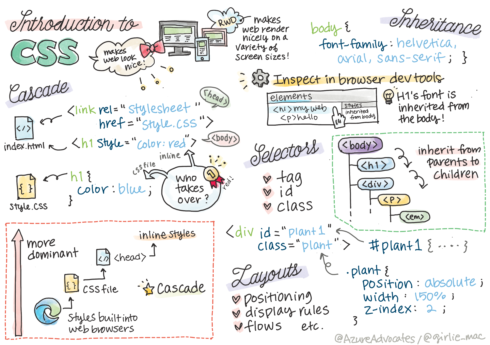
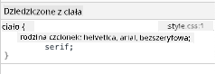
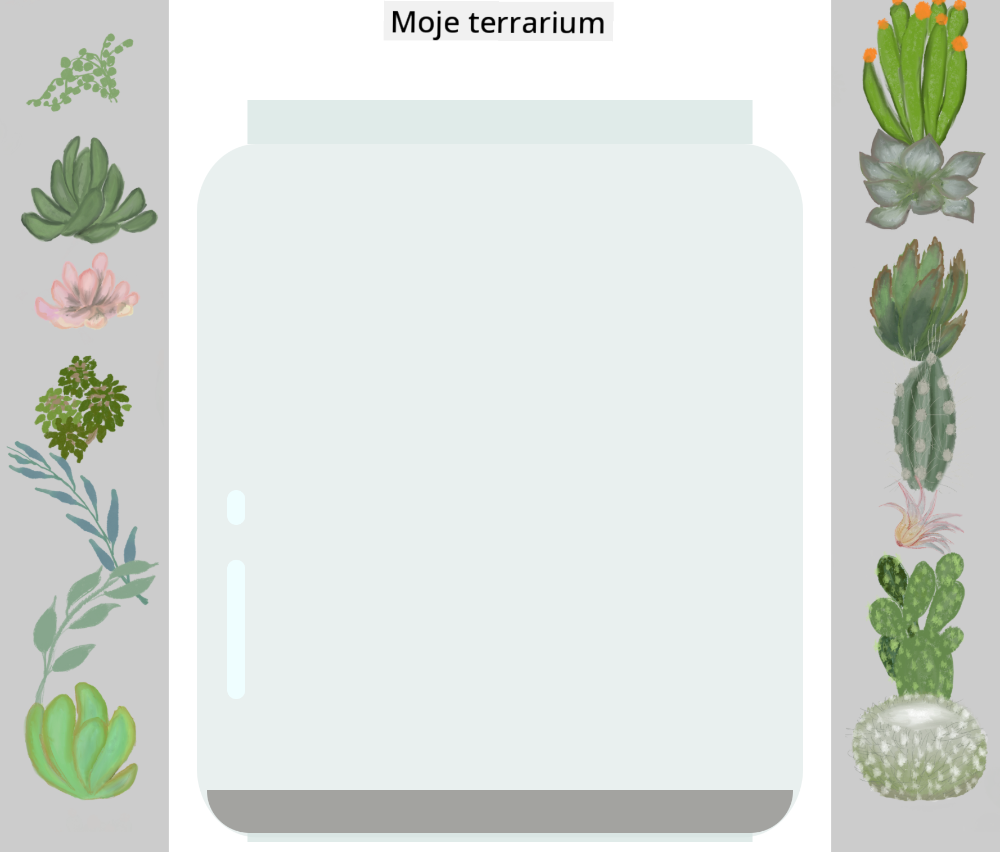

<!--
CO_OP_TRANSLATOR_METADATA:
{
  "original_hash": "acb5ae00cde004304296bb97da8ff4c3",
  "translation_date": "2025-08-29T16:35:19+00:00",
  "source_file": "3-terrarium/2-intro-to-css/README.md",
  "language_code": "pl"
}
-->
# Projekt Terrarium, Część 2: Wprowadzenie do CSS


> Sketchnote autorstwa [Tomomi Imura](https://twitter.com/girlie_mac)

## Quiz przed wykładem

[Quiz przed wykładem](https://ff-quizzes.netlify.app/web/quiz/17)

### Wprowadzenie

CSS, czyli Kaskadowe Arkusze Stylów, rozwiązują istotny problem w tworzeniu stron internetowych: jak sprawić, by Twoja strona wyglądała atrakcyjnie. Stylizowanie aplikacji sprawia, że są bardziej użyteczne i estetyczne; CSS pozwala również na tworzenie Responsywnego Projektowania Stron (RWD) - dzięki czemu aplikacje wyglądają dobrze niezależnie od rozmiaru ekranu, na którym są wyświetlane. CSS to nie tylko narzędzie do poprawy wyglądu aplikacji; jego specyfikacja obejmuje animacje i transformacje, które umożliwiają zaawansowane interakcje w aplikacjach. Grupa robocza CSS pomaga utrzymywać aktualne specyfikacje CSS; możesz śledzić ich pracę na [stronie World Wide Web Consortium](https://www.w3.org/Style/CSS/members).

> Uwaga: CSS to język, który ewoluuje, jak wszystko w sieci, i nie wszystkie przeglądarki obsługują nowsze części specyfikacji. Zawsze sprawdzaj swoje implementacje, korzystając z [CanIUse.com](https://caniuse.com).

W tej lekcji dodamy style do naszego internetowego terrarium i dowiemy się więcej o kilku koncepcjach CSS: kaskadowości, dziedziczeniu, użyciu selektorów, pozycjonowaniu oraz wykorzystaniu CSS do budowy układów. W trakcie pracy zaprojektujemy układ terrarium i stworzymy samo terrarium.

### Wymagania wstępne

Powinieneś mieć gotowy HTML dla swojego terrarium, który jest przygotowany do stylizacji.

> Obejrzyj wideo

> 
> [](https://www.youtube.com/watch?v=6yIdOIV9p1I)

### Zadanie

W folderze terrarium utwórz nowy plik o nazwie `style.css`. Zaimportuj ten plik w sekcji `<head>`:

```html
<link rel="stylesheet" href="./style.css" />
```

---

## Kaskadowość

Kaskadowe Arkusze Stylów uwzględniają ideę, że style „kaskadują”, co oznacza, że zastosowanie stylu jest kierowane jego priorytetem. Style ustawione przez autora strony internetowej mają wyższy priorytet niż te ustawione przez przeglądarkę. Style ustawione „inline” mają wyższy priorytet niż te ustawione w zewnętrznym arkuszu stylów.

### Zadanie

Dodaj styl inline „color: red” do swojego tagu `<h1>`:

```HTML
<h1 style="color: red">My Terrarium</h1>
```

Następnie dodaj poniższy kod do swojego pliku `style.css`:

```CSS
h1 {
 color: blue;
}
```

✅ Jaki kolor wyświetla się w Twojej aplikacji internetowej? Dlaczego? Czy potrafisz znaleźć sposób na nadpisanie stylów? Kiedy chciałbyś to zrobić, a kiedy nie?

---

## Dziedziczenie

Style są dziedziczone od stylu przodka do potomka, co oznacza, że zagnieżdżone elementy dziedziczą style swoich rodziców.

### Zadanie

Ustaw czcionkę dla ciała dokumentu i sprawdź czcionkę zagnieżdżonego elementu:

```CSS
body {
	font-family: helvetica, arial, sans-serif;
}
```

Otwórz konsolę przeglądarki na zakładce „Elements” i zaobserwuj czcionkę H1. Dziedziczy swoją czcionkę z ciała dokumentu, co jest wskazane w przeglądarce:



✅ Czy możesz sprawić, by zagnieżdżony styl dziedziczył inną właściwość?

---

## Selektory CSS

### Tagi

Jak dotąd Twój plik `style.css` ma stylizowane tylko kilka tagów, a aplikacja wygląda dość dziwnie:

```CSS
body {
	font-family: helvetica, arial, sans-serif;
}

h1 {
	color: #3a241d;
	text-align: center;
}
```

Ten sposób stylizowania tagu daje Ci kontrolę nad unikalnymi elementami, ale potrzebujesz kontroli nad stylami wielu roślin w swoim terrarium. Aby to zrobić, musisz wykorzystać selektory CSS.

### Identyfikatory (Ids)

Dodaj styl do układu lewego i prawego kontenera. Ponieważ istnieje tylko jeden lewy kontener i jeden prawy kontener, w znacznikach HTML nadano im identyfikatory. Aby je stylizować, użyj `#`:

```CSS
#left-container {
	background-color: #eee;
	width: 15%;
	left: 0px;
	top: 0px;
	position: absolute;
	height: 100%;
	padding: 10px;
}

#right-container {
	background-color: #eee;
	width: 15%;
	right: 0px;
	top: 0px;
	position: absolute;
	height: 100%;
	padding: 10px;
}
```

Tutaj umieściłeś te kontenery z absolutnym pozycjonowaniem na skrajnie lewej i prawej stronie ekranu oraz użyłeś procentów dla ich szerokości, aby mogły skalować się na małych ekranach mobilnych.

✅ Ten kod jest dość powtarzalny, a więc nie jest zgodny z zasadą „DRY” (Don't Repeat Yourself). Czy możesz znaleźć lepszy sposób na stylizowanie tych identyfikatorów, być może za pomocą identyfikatora i klasy? Musiałbyś zmienić znaczniki HTML i zrefaktoryzować CSS:

```html
<div id="left-container" class="container"></div>
```

### Klasy

W powyższym przykładzie stylizowałeś dwa unikalne elementy na ekranie. Jeśli chcesz, aby style dotyczyły wielu elementów na ekranie, możesz użyć klas CSS. Zrób to, aby zaprojektować rośliny w lewym i prawym kontenerze.

Zauważ, że każda roślina w znacznikach HTML ma kombinację identyfikatorów i klas. Identyfikatory są tutaj używane przez JavaScript, który dodasz później, aby manipulować rozmieszczeniem roślin w terrarium. Klasy natomiast nadają wszystkim roślinom określony styl.

```html
<div class="plant-holder">
	
</div>
```

Dodaj poniższy kod do swojego pliku `style.css`:

```CSS
.plant-holder {
	position: relative;
	height: 13%;
	left: -10px;
}

.plant {
	position: absolute;
	max-width: 150%;
	max-height: 150%;
	z-index: 2;
}
```

Warto zwrócić uwagę na mieszankę pozycjonowania względnego i absolutnego, które omówimy w następnej sekcji. Przyjrzyj się, jak wysokości są obsługiwane za pomocą procentów:

Ustawiasz wysokość uchwytu rośliny na 13%, co jest dobrym wyborem, aby wszystkie rośliny były wyświetlane w każdym pionowym kontenerze bez potrzeby przewijania.

Przesuwasz uchwyt rośliny w lewo, aby rośliny były bardziej wyśrodkowane w swoim kontenerze. Obrazy mają dużą ilość przezroczystego tła, aby można je było łatwiej przeciągać, więc muszą być przesunięte w lewo, aby lepiej pasowały na ekranie.

Następnie roślina sama w sobie ma maksymalną szerokość 150%. Dzięki temu skaluje się w dół, gdy przeglądarka jest skalowana w dół. Spróbuj zmienić rozmiar swojej przeglądarki; rośliny pozostają w swoich kontenerach, ale skalują się w dół, aby pasować.

Warto również zwrócić uwagę na użycie z-index, który kontroluje względną wysokość elementu (tak aby rośliny znajdowały się na kontenerze i wyglądały, jakby były w terrarium).

✅ Dlaczego potrzebujesz zarówno selektora CSS dla uchwytu rośliny, jak i dla samej rośliny?

## Pozycjonowanie CSS

Mieszanie właściwości pozycjonowania (statyczne, względne, stałe, absolutne i przyklejone) może być nieco skomplikowane, ale jeśli jest wykonane poprawnie, daje dobrą kontrolę nad elementami na Twoich stronach.

Elementy pozycjonowane absolutnie są pozycjonowane względem najbliższego pozycjonowanego przodka, a jeśli takiego nie ma, są pozycjonowane względem ciała dokumentu.

Elementy pozycjonowane względnie są pozycjonowane na podstawie wskazówek CSS, które przesuwają je z ich początkowej pozycji.

W naszym przykładzie `plant-holder` jest elementem pozycjonowanym względnie, który jest pozycjonowany w absolutnie pozycjonowanym kontenerze. Rezultatem jest to, że kontenery boczne są przypięte do lewej i prawej strony, a `plant-holder` jest zagnieżdżony, dostosowując się w obrębie kontenerów bocznych, tworząc miejsce na rośliny w pionowym rzędzie.

> Sama `plant` również ma pozycjonowanie absolutne, co jest konieczne, aby można ją było przeciągać, jak dowiesz się w następnej lekcji.

✅ Eksperymentuj, zmieniając typy pozycjonowania kontenerów bocznych i `plant-holder`. Co się dzieje?

## Układy CSS

Teraz wykorzystasz to, czego się nauczyłeś, aby zbudować samo terrarium, wszystko za pomocą CSS!

Najpierw wystylizuj dzieci div `.terrarium` jako zaokrąglony prostokąt za pomocą CSS:

```CSS
.jar-walls {
	height: 80%;
	width: 60%;
	background: #d1e1df;
	border-radius: 1rem;
	position: absolute;
	bottom: 0.5%;
	left: 20%;
	opacity: 0.5;
	z-index: 1;
}

.jar-top {
	width: 50%;
	height: 5%;
	background: #d1e1df;
	position: absolute;
	bottom: 80.5%;
	left: 25%;
	opacity: 0.7;
	z-index: 1;
}

.jar-bottom {
	width: 50%;
	height: 1%;
	background: #d1e1df;
	position: absolute;
	bottom: 0%;
	left: 25%;
	opacity: 0.7;
}

.dirt {
	width: 60%;
	height: 5%;
	background: #3a241d;
	position: absolute;
	border-radius: 0 0 1rem 1rem;
	bottom: 1%;
	left: 20%;
	opacity: 0.7;
	z-index: -1;
}
```

Zwróć uwagę na użycie procentów. Jeśli zmniejszysz rozmiar przeglądarki, zobaczysz, jak słoik również się skaluje. Zauważ także szerokości i wysokości procentowe dla elementów słoika oraz sposób, w jaki każdy element jest absolutnie pozycjonowany w centrum, przypięty do dolnej części widoku.

Używamy również `rem` dla border-radius, czyli długości względnej względem czcionki. Przeczytaj więcej o tego typu względnych miarach w [specyfikacji CSS](https://www.w3.org/TR/css-values-3/#font-relative-lengths).

✅ Spróbuj zmienić kolory słoika i jego przezroczystość w porównaniu do ziemi. Co się dzieje? Dlaczego?

---

## 🚀Wyzwanie

Dodaj „bąbelkowy” połysk do dolnej lewej części słoika, aby wyglądał bardziej jak szkło. Będziesz stylizować `.jar-glossy-long` i `.jar-glossy-short`, aby wyglądały jak odbity połysk. Oto jak to będzie wyglądać:



Aby ukończyć quiz po wykładzie, przejdź przez ten moduł Learn: [Stylizuj swoją aplikację HTML za pomocą CSS](https://docs.microsoft.com/learn/modules/build-simple-website/4-css-basics/?WT.mc_id=academic-77807-sagibbon)

## Quiz po wykładzie

[Quiz po wykładzie](https://ff-quizzes.netlify.app/web/quiz/18)

## Przegląd i samodzielna nauka

CSS wydaje się pozornie prosty, ale istnieje wiele wyzwań związanych z próbą idealnego stylizowania aplikacji dla wszystkich przeglądarek i rozmiarów ekranów. CSS-Grid i Flexbox to narzędzia, które zostały opracowane, aby uczynić pracę bardziej uporządkowaną i niezawodną. Dowiedz się więcej o tych narzędziach, grając w [Flexbox Froggy](https://flexboxfroggy.com/) i [Grid Garden](https://codepip.com/games/grid-garden/).

## Zadanie

[Refaktoryzacja CSS](assignment.md)

---

**Zastrzeżenie**:  
Ten dokument został przetłumaczony za pomocą usługi tłumaczenia AI [Co-op Translator](https://github.com/Azure/co-op-translator). Chociaż dokładamy wszelkich starań, aby tłumaczenie było precyzyjne, prosimy pamiętać, że automatyczne tłumaczenia mogą zawierać błędy lub nieścisłości. Oryginalny dokument w jego języku źródłowym powinien być uznawany za wiarygodne źródło. W przypadku informacji o kluczowym znaczeniu zaleca się skorzystanie z profesjonalnego tłumaczenia przez człowieka. Nie ponosimy odpowiedzialności za jakiekolwiek nieporozumienia lub błędne interpretacje wynikające z użycia tego tłumaczenia.