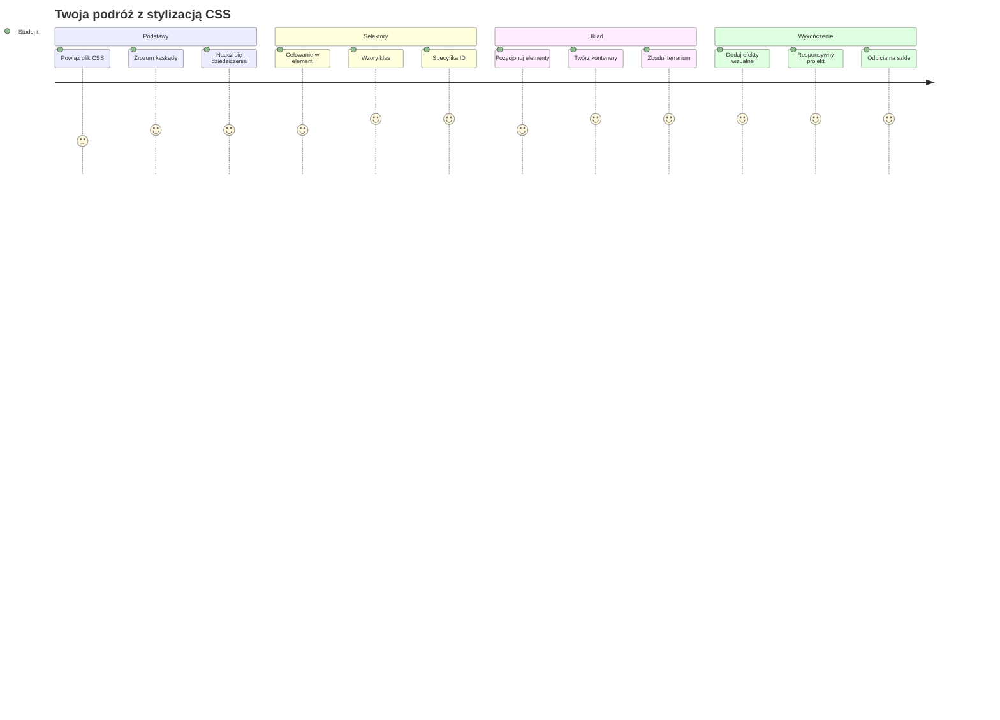
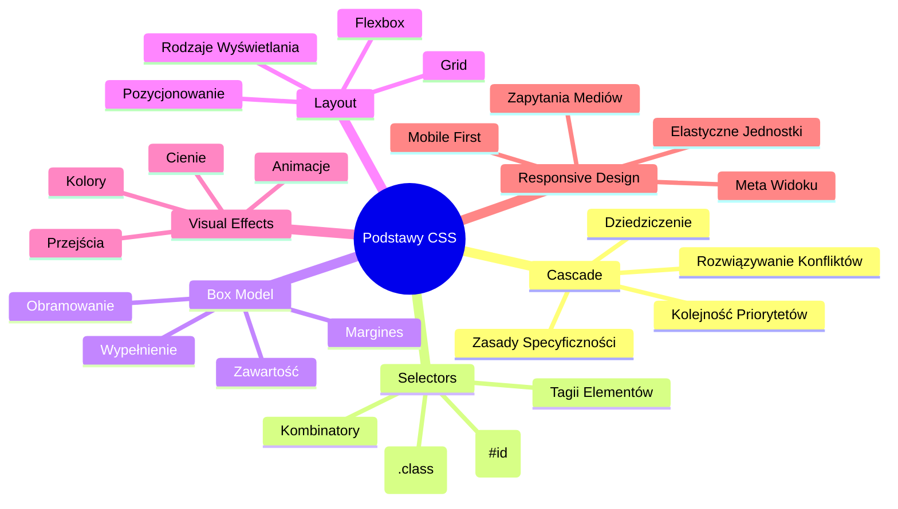
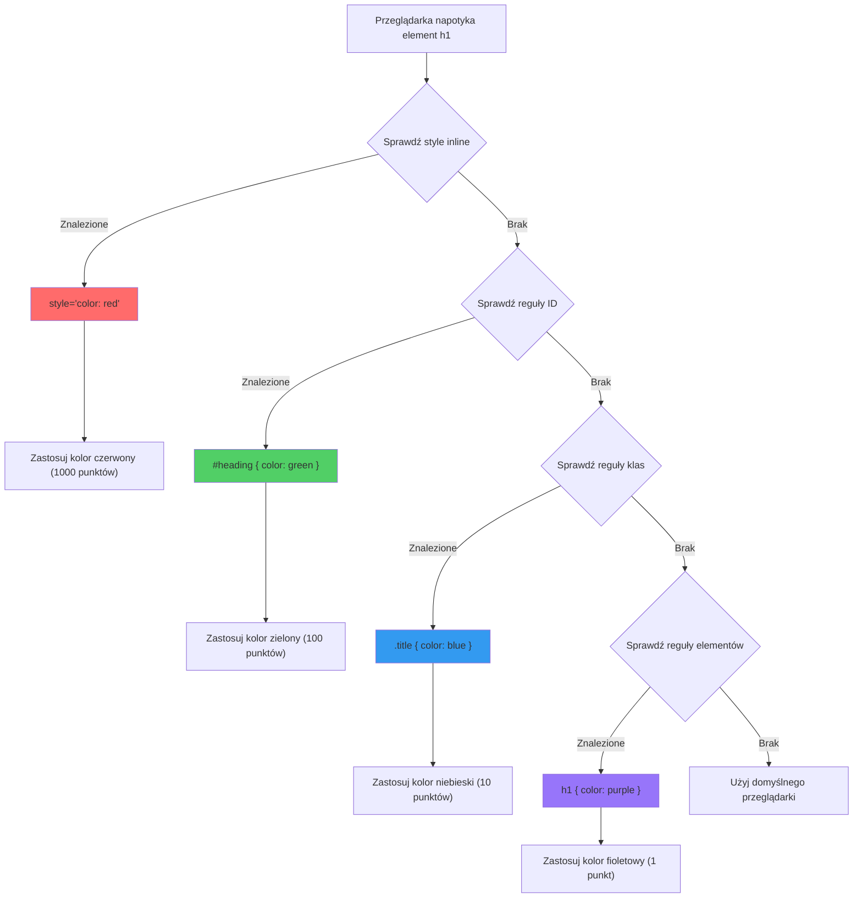
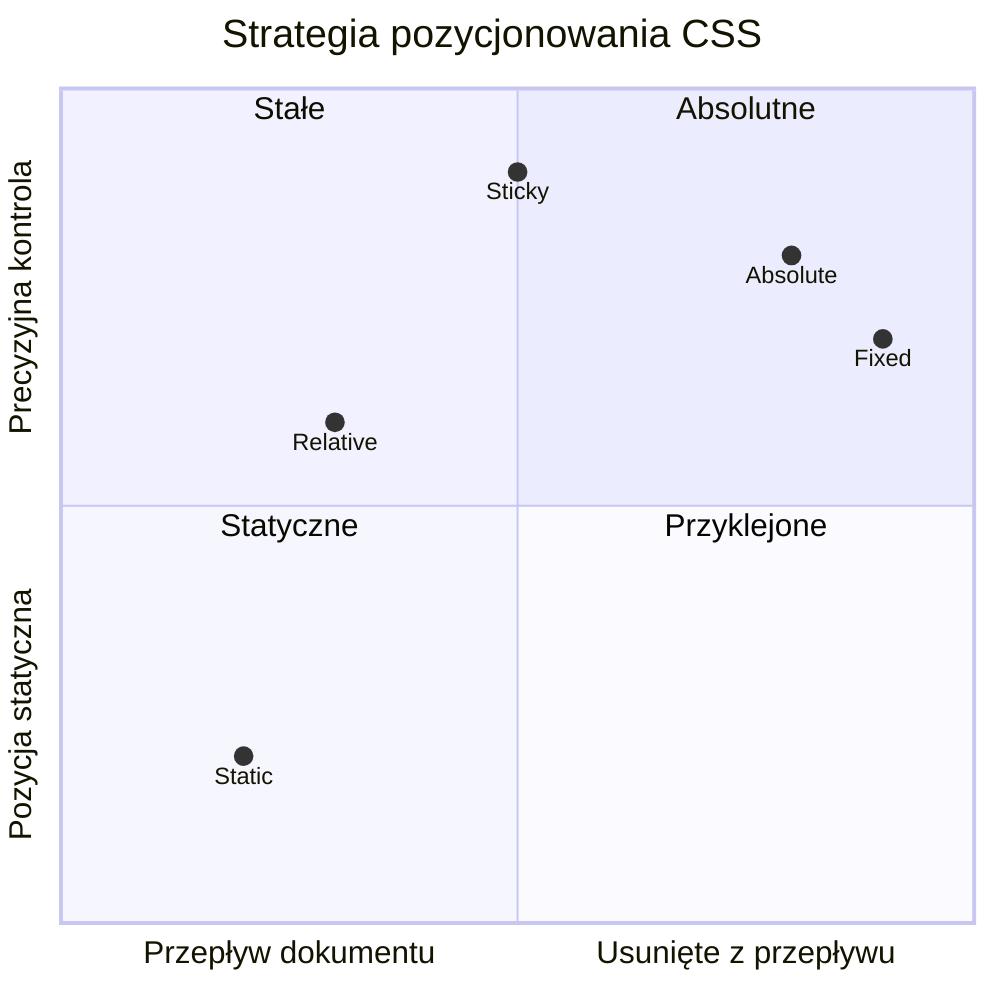
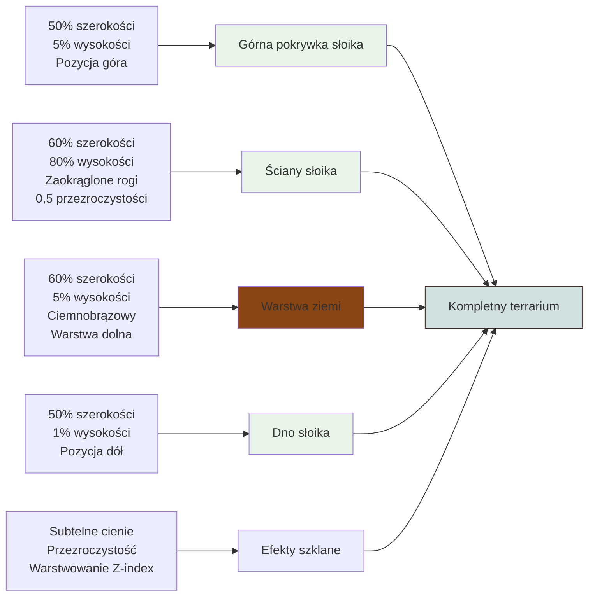
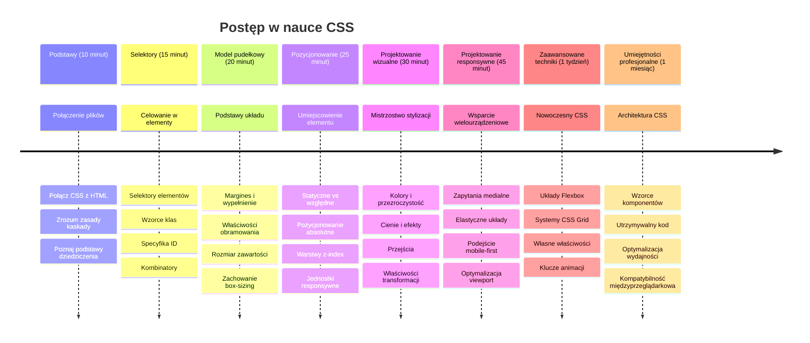

<!--
CO_OP_TRANSLATOR_METADATA:
{
  "original_hash": "e39f3a4e3bcccf94639e3af1248f8a4d",
  "translation_date": "2026-01-06T19:50:25+00:00",
  "source_file": "3-terrarium/2-intro-to-css/README.md",
  "language_code": "pl"
}
-->
# Projekt Terrarium Część 2: Wprowadzenie do CSS



> Notatka graficzna autorstwa [Tomomi Imura](https://twitter.com/girlie_mac)

Pamiętasz, jak twoje terrarium HTML wyglądało dość prosto? CSS to miejsce, gdzie przekształcamy tę prostą strukturę w coś wizualnie atrakcyjnego.

Jeśli HTML to budowa ram domu, to CSS to wszystko, co sprawia, że czujesz się w nim jak w domu - kolory farb, ustawienie mebli, oświetlenie i jak pomieszczenia ze sobą współgrają. Pomyśl, jak Pałac w Wersalu zaczął jako prosty domek myśliwski, a staranne dbanie o dekoracje i układ przekształciło go w jeden z najwspanialszych budynków świata.

Dziś przemienimy twoje terrarium z funkcjonalnego w dopracowane wizualnie. Nauczysz się, jak precyzyjnie pozycjonować elementy, sprawić, by układy reagowały na różne rozmiary ekranów i tworzyć wizualną atrakcyjność, która angażuje użytkowników.

Na koniec tej lekcji zobaczysz, jak strategiczne stylizowanie CSS może znacząco ulepszyć twój projekt. Dodajmy trochę stylu twojemu terrarium.


## Quiz przed wykładem

[Quiz przed wykładem](https://ff-quizzes.netlify.app/web/quiz/17)

## Pierwsze kroki z CSS

CSS często jest postrzegany jedynie jako „upiększanie rzeczy”, ale służy znacznie szerszym celom. CSS to jak reżyser filmu - kontrolujesz nie tylko jak wszystko wygląda, ale jak się porusza, reaguje na interakcję i dostosowuje do różnych sytuacji.

Nowoczesne CSS jest niezwykle zdolne. Możesz pisać kod, który automatycznie dostosowuje układy dla telefonów, tabletów i komputerów stacjonarnych. Możesz tworzyć płynne animacje, które kierują uwagę użytkowników tam, gdzie trzeba. Wyniki mogą być naprawdę imponujące, gdy wszystko działa razem.

> 💡 **Profesjonalna wskazówka**: CSS ciągle się rozwija z nowymi funkcjami i możliwościami. Zawsze sprawdzaj [CanIUse.com](https://caniuse.com), aby zweryfikować wsparcie przeglądarek dla nowszych funkcji CSS przed użyciem ich w projektach produkcyjnych.

**Oto, co zrealizujemy w tej lekcji:**
- **Stworzymy** kompletny wizualny design twojego terrarium za pomocą nowoczesnych technik CSS
- **Poznamy** fundamentalne koncepcje takie jak kaskada, dziedziczenie i selektory CSS
- **Zastosujemy** responsywne pozycjonowanie i strategie układu
- **Zbudujemy** kontener terrarium za pomocą CSS-owych kształtów i stylizacji

### Wymagania wstępne

Powinieneś mieć ukończoną strukturę HTML twojego terrarium z poprzedniej lekcji i być gotowy do stylowania.

> 📺 **Materiały wideo**: Obejrzyj pomocny film instruktażowy
>
> [](https://www.youtube.com/watch?v=6yIdOIV9p1I)

### Konfiguracja pliku CSS

Zanim zaczniemy stylować, musimy połączyć CSS z naszym HTML-em. To połączenie mówi przeglądarce, gdzie znaleźć instrukcje stylowania dla naszego terrarium.

W folderze terrarium stwórz nowy plik o nazwie `style.css`, a następnie dołącz go w sekcji `<head>` twojego dokumentu HTML:

```html
<link rel="stylesheet" href="./style.css" />
```

**Co robi ten kod:**
- **Tworzy** połączenie między plikami HTML i CSS
- **Informuje** przeglądarkę, aby załadowała i zastosowała style z `style.css`
- **Używa** atrybutu `rel="stylesheet"`, aby określić, że jest to plik CSS
- **Odwołuje się** do ścieżki pliku za pomocą `href="./style.css"`

## Zrozumienie kaskady CSS

Zastanawiałeś się kiedyś, dlaczego CSS nazywa się "Cascading" Style Sheets (Kaskadowe arkusze stylów)? Style opadają niczym wodospad i czasem ze sobą kolidują.

Pomyśl jak działa wojskowa hierarchia poleceń – ogólny rozkaz może brzmieć „wszyscy żołnierze noszą zielone”, ale konkretne polecenie dla twojej jednostki to „na ceremonię przywdziej mundur galowy”. Bardziej szczegółowa instrukcja ma pierwszeństwo. CSS działa na podobnej zasadzie, a zrozumienie tej hierarchii znacznie ułatwia debugowanie.

### Eksperymentowanie z priorytetem kaskady

Zobaczmy, jak działa kaskada, tworząc konflikt stylów. Najpierw dodaj styl inline do twojego tagu `<h1>`:

```html
<h1 style="color: red">My Terrarium</h1>
```

**Co robi ten kod:**
- **Stosuje** czerwony kolor bezpośrednio do elementu `<h1>` za pomocą stylu inline
- **Używa** atrybutu `style`, aby osadzić CSS bezpośrednio w HTML
- **Tworzy** regułę o najwyższym priorytecie dla tego konkretnego elementu

Następnie dodaj tę regułę do pliku `style.css`:

```css
h1 {
  color: blue;
}
```

**W powyższym przykładzie:**
- **Zdefiniowaliśmy** regułę CSS, która celuje w wszystkie elementy `<h1>`
- **Ustawiliśmy** kolor tekstu na niebieski za pomocą zewnętrznego arkusza stylów
- **Utworzyliśmy** regułę o niższym priorytecie w porównaniu do stylów inline

✅ **Sprawdzenie wiedzy**: Jaki kolor wyświetla się w twojej aplikacji webowej? Dlaczego ten kolor wygrywa? Czy potrafisz wymyślić sytuacje, w których chcesz nadpisać style?


> 💡 **Kolejność priorytetów CSS (od najwyższego do najniższego):**
> 1. **Style inline** (atrybut style)
> 2. **ID** (#myId)
> 3. **Klasy** (.myClass) i atrybuty
> 4. **Selektory elementów** (h1, div, p)
> 5. **Domyślne style przeglądarki**

## Dziedziczenie CSS w praktyce

Dziedziczenie w CSS działa jak genetyka – elementy dziedziczą pewne właściwości po swoich rodzicach. Jeśli ustawisz rodzinę czcionek na elemencie body, to cały tekst w środku automatycznie będzie używał tej samej czcionki. To podobne do charakterystycznej szczęki rodu Habsburgów, która pojawiała się w pokoleniach, nawet jeśli nie była określana dla każdej osoby z osobna.

Jednak nie wszystko jest dziedziczone. Style tekstowe, takie jak czcionki i kolory, dziedziczą się, ale właściwości układu, takie jak marginesy i obramowania, nie. Podobnie jak dzieci mogą odziedziczyć cechy fizyczne, ale niekoniecznie wybory modowe rodziców.

### Obserwacja dziedziczenia czcionki

Zobaczmy dziedziczenie w akcji, ustawiając rodzinę czcionki na elemencie `<body>`:

```css
body {
  font-family: 'Segoe UI', Tahoma, Geneva, Verdana, sans-serif;
}
```

**Co się tu dzieje:**
- **Ustawiamy** rodzinę czcionek dla całej strony, celując w element `<body>`
- **Używamy** zestawu fontów z opcjami zapasowymi dla lepszej kompatybilności przeglądarek
- **Stosujemy** nowoczesne fonty systemowe, które dobrze wyglądają na różnych systemach operacyjnych
- **Zapewniamy**, że wszystkie elementy potomne dziedziczą tę czcionkę, chyba że jest to jawnie nadpisane

Otwórz narzędzia deweloperskie przeglądarki (F12), przejdź do zakładki Elements i zbadaj swój element `<h1>`. Zobaczysz, że dziedziczy rodzinę czcionki po body:


✅ **Czas na eksperyment**: Spróbuj ustawić inne właściwości dziedziczone na `<body>`, jak `color`, `line-height` lub `text-align`. Co się stanie z nagłówkiem i innymi elementami?

> 📝 **Właściwości dziedziczone obejmują**: `color`, `font-family`, `font-size`, `line-height`, `text-align`, `visibility`
>
> **Właściwości nie dziedziczone to**: `margin`, `padding`, `border`, `width`, `height`, `position`

### 🔄 **Sprawdzenie pedagogiczne**
**Zrozumienie podstaw CSS**: Przed przejściem do selektorów upewnij się, że potrafisz:
- ✅ Wyjaśnić różnicę między kaskadą a dziedziczeniem
- ✅ Przewidzieć, który styl wygra w konflikcie specyficzności
- ✅ Zidentyfikować, które właściwości dziedziczą się po elementach nadrzędnych
- ✅ Prawidłowo połączyć pliki CSS z HTML

**Szybki test**: Mając poniższe style, jakiego koloru będzie `<h1>` wewnątrz `<div class="special">`?
```css
div { color: blue; }
.special { color: green; }
h1 { color: red; }
```
*Odpowiedź: Czerwony (selektor elementu bezpośrednio celuje w h1)*

## Opanowanie selektorów CSS

Selektory CSS pozwalają na celowanie w konkretne elementy do stylowania. Działają jak precyzyjne wskazówki - zamiast mówić „dom”, mówisz „niebieski dom z czerwonymi drzwiami na ulicy Maple”.

CSS oferuje różne sposoby precyzji, a wybór właściwego selektora to jak wybór odpowiedniego narzędzia do zadania. Czasami trzeba wystylizować wszystkie drzwi w okolicy, a czasem tylko jedno konkretne.

### Selektory elementów (tagów)

Selektory elementów celują w elementy HTML na podstawie nazwy tagu. Są idealne do ustawiania bazowych stylów stosowanych szeroko na stronie:

```css
body {
  font-family: 'Segoe UI', Tahoma, Geneva, Verdana, sans-serif;
  margin: 0;
  padding: 0;
}

h1 {
  color: #3a241d;
  text-align: center;
  font-size: 2.5rem;
  margin-bottom: 1rem;
}
```

**Co robią te style:**
- **Ustawiają** spójną typografię na całej stronie za pomocą selektora `body`
- **Usuwają** domyślne marginesy i padding przeglądarki dla lepszej kontroli
- **Stylizują** wszystkie nagłówki kolorem, wyrównaniem i odstępami
- **Używają** jednostek `rem` dla skalowalnego, dostępnego rozmiaru czcionki

Chociaż selektory elementów dobrze sprawdzają się do ogólnego stylu, potrzebujesz bardziej precyzyjnych selektorów do stylizacji poszczególnych elementów, takich jak rośliny w twoim terrarium.

### Selektory ID dla unikalnych elementów

Selektory ID używają symbolu `#` i celują w elementy z konkretnym atrybutem `id`. Ponieważ ID muszą być unikalne na stronie, są idealne do stylowania pojedynczych, wyjątkowych elementów, takich jak pojemniki z roślinami po lewej i prawej stronie.

Stwórzmy stylizację dla naszych bocznych pojemników w terrarium, gdzie będą rosnąć rośliny:

```css
#left-container {
  background-color: #f5f5f5;
  width: 15%;
  left: 0;
  top: 0;
  position: absolute;
  height: 100vh;
  padding: 1rem;
  box-sizing: border-box;
}

#right-container {
  background-color: #f5f5f5;
  width: 15%;
  right: 0;
  top: 0;
  position: absolute;
  height: 100vh;
  padding: 1rem;
  box-sizing: border-box;
}
```

**Co robi ten kod:**
- **Pozycjonuje** kontenery na skrajnych lewych i prawych krawędziach za pomocą `position: absolute`
- **Używa** jednostek `vh` (wysokość okna widoku) dla responsywnej wysokości dostosowującej się do wielkości ekranu
- **Ustawia** `box-sizing: border-box`, by padding był wliczany do całkowitej szerokości
- **Usuwa** zbędne jednostki `px` przy wartościach zero, dla czyściej kodu
- **Stosuje** subtelny kolor tła, który jest łagodniejszy dla oka niż jaskrawa szarość

✅ **Wyzwanie jakości kodu**: Zauważ, że ten CSS łamie zasadę DRY (Don't Repeat Yourself). Czy potrafisz zrefaktoryzować ten kod, używając zarówno ID, jak i klasy?

**Lepsze podejście:**
```html
<div id="left-container" class="container"></div>
<div id="right-container" class="container"></div>
```

```css
.container {
  background-color: #f5f5f5;
  width: 15%;
  top: 0;
  position: absolute;
  height: 100vh;
  padding: 1rem;
  box-sizing: border-box;
}

#left-container {
  left: 0;
}

#right-container {
  right: 0;
}
```

### Selektory klas do stylów wielokrotnego użytku

Selektory klas używają symbolu `.` i są idealne, gdy chcesz stosować te same style do wielu elementów. W przeciwieństwie do ID, klasy można powtarzać w całym HTML, co czyni je świetnym narzędziem do spójnych wzorców stylów.

W naszym terrarium każda roślina potrzebuje podobnych stylów, ale także indywidualnego pozycjonowania. Użyjemy kombinacji klas do wspólnych stylów i ID do unikalnego pozycjonowania.

**Oto struktura HTML każdej rośliny:**
```html
<div class="plant-holder">
  
</div>
```

**Wyjaśnienie kluczowych elementów:**
- **Używa** `class="plant-holder"` do spójnego stylowania kontenera dla wszystkich roślin
- **Stosuje** `class="plant"` dla wspólnego stylu i zachowania obrazków
- **Zawiera** unikalny `id="plant1"` do indywidualnego pozycjonowania i interakcji JS
- **Zapewnia** opisowy tekst alternatywny dla dostępności czytników ekranowych

Dodaj teraz te style do pliku `style.css`:

```css
.plant-holder {
  position: relative;
  height: 13%;
  left: -0.6rem;
}

.plant {
  position: absolute;
  max-width: 150%;
  max-height: 150%;
  z-index: 2;
  transition: transform 0.3s ease;
}

.plant:hover {
  transform: scale(1.05);
}
```

**Co robią te style:**
- **Tworzą** pozycjonowanie względne dla kontenera rośliny, które pozwala na kontekst pozycjonowania
- **Ustawiają** wysokość każdego kontenera roślin na 13%, zapewniając, że wszystkie rośliny mieszczą się pionowo bez przewijania
- **Przesuwają** kontenery nieco w lewo, by lepiej wycentrować rośliny w ich pojemnikach
- **Pozwalają** roślinom skalować się responsywnie z `max-width` i `max-height`
- **Używają** `z-index`, aby warstwować rośliny nad innymi elementami terrarium
- **Dodają** subtelny efekt przy najechaniu kursorem z CSS transitions dla lepszej interakcji użytkownika

✅ **Myślenie krytyczne**: Dlaczego potrzebujemy zarówno selektorów `.plant-holder`, jak i `.plant`? Co się stanie, gdy spróbujemy użyć tylko jednego?

> 💡 **Wzorzec projektowy**: Kontener (`.plant-holder`) kontroluje układ i pozycjonowanie, a zawartość (`.plant`) steruje wyglądem i skalowaniem. To rozdzielenie sprawia, że kod jest bardziej utrzymywalny i elastyczny.

## Zrozumienie pozycjonowania CSS

Pozycjonowanie CSS jest jak dyrektor sceny w teatrze - kierujesz, gdzie stają aktorzy i jak się poruszają po scenie. Niektórzy aktorzy trzymają się standardowego ustawienia, inni potrzebują specyficznego pozycjonowania dla efektu dramatycznego.

Gdy zrozumiesz pozycjonowanie, wiele problemów z układami staje się łatwiejszych. Potrzebujesz paska nawigacji, który pozostaje na górze podczas przewijania? Pozycjonowanie się tym zajmie. Chcesz tooltipa, który pojawia się w konkretnym miejscu? To też pozycjonowanie.

### Pięć wartości pozcji


| Wartość pozycji | Zachowanie | Przypadek użycia |
|-----------------|------------|------------------|
| `static` | Domyślny przepływ, ignoruje top/left/right/bottom | Normalny układ dokumentu |
| `relative` | Pozycjonowany względem swojej normalnej pozycji | Małe przesunięcia, tworzenie kontekstu pozycjonowania |
| `absolute` | Pozycjonowany względem najbliższego przodka z pozycjonowaniem | Precyzyjne umieszczenie, nakładki |
| `fixed` | Pozycjonowany względem widoku okna | Paski nawigacji, elementy unoszące się |
| `sticky` | Przełącza między relative a fixed w zależności od przewijania | Nagłówki przylegające przy przewijaniu |

### Pozycjonowanie w naszym terrarium

Nasze terrarium używa strategicznego połączenia typów pozycji, by stworzyć pożądany układ:

```css
/* Container positioning */
.container {
  position: absolute; /* Removes from normal flow */
  /* ... other styles ... */
}

/* Plant holder positioning */
.plant-holder {
  position: relative; /* Creates positioning context */
  /* ... other styles ... */
}

/* Plant positioning */
.plant {
  position: absolute; /* Allows precise placement within holder */
  /* ... other styles ... */
}
```

**Strategia pozycjonowania:**
- **Kontenery absolutne** są usunięte z normalnego przepływu dokumentu i przypięte do krawędzi ekranu
- **Kontenery roślin o pozycji względnej** tworzą kontekst pozycjonowania, pozostając w przepływie dokumentu
- **Rośliny z pozycją absolutną** mogą być precyzyjnie pozycjonowane wewnątrz względnych kontenerów
- **To połączenie** pozwala na pionowe układanie roślin, z możliwością indywidualnego pozycjonowania

> 🎯 **Dlaczego to ważne**: Elementy `plant` potrzebują pozycji absolutnej, aby stać się przeciągalne w następnej lekcji. Pozycja absolutna usuwa je z normalnego przepływu, umożliwiając interakcje drag-and-drop.

✅ **Czas na eksperyment**: Spróbuj zmienić wartości pozycji i zobacz wyniki:
- Co się stanie, jeśli zmienisz `.container` z `absolute` na `relative`?
- Jak zmienia się układ, jeśli `.plant-holder` używa `absolute` zamiast `relative`?
- Co się dzieje, gdy zmienisz pozycjonowanie `.plant` na `relative`?

### 🔄 **Sprawdzenie zrozumienia**
**Opanowanie pozycjonowania CSS**: Zatrzymaj się, aby zweryfikować swoją wiedzę:
- ✅ Czy potrafisz wyjaśnić, dlaczego rośliny potrzebują pozycjonowania absolute do przeciągania i upuszczania?
- ✅ Czy rozumiesz, jak relatywne kontenery tworzą kontekst pozycjonowania?
- ✅ Dlaczego boczne kontenery używają pozycjonowania absolute?
- ✅ Co by się stało, gdybyś całkowicie usunął deklaracje pozycji?

**Powiązanie z rzeczywistością**: Pomyśl, jak pozycjonowanie CSS odzwierciedla układ rzeczywisty:
- **Static**: Książki na półce (naturalny porządek)
- **Relative**: Przesunięcie książki lekko, ale pozostawienie jej miejsca
- **Absolute**: Umieszczenie zakładki na dokładnej stronie
- **Fixed**: Karteczka samoprzylepna, która pozostaje widoczna podczas przewracania stron

## Budowanie terrarium za pomocą CSS

Teraz zbudujemy szklany słoik używając tylko CSS – bez obrazów czy oprogramowania graficznego.

Tworzenie realistycznego szkła, cieni i efektów głębi za pomocą pozycjonowania i przezroczystości pokazuje wizualne możliwości CSS. Ta technika nawiązuje do tego, jak architekci ruchu Bauhaus używali prostych form geometrycznych do tworzenia złożonych, pięknych struktur. Gdy zrozumiesz te zasady, rozpoznasz techniki CSS stojące za wieloma projektami stron.


### Tworzenie komponentów słoika terrarium

Zbudujmy słoik terrarium kawałek po kawałku. Każda część używa pozycjonowania absolute i rozmiarów procentowych dla responsywnego projektu:

```css
.jar-walls {
  height: 80%;
  width: 60%;
  background: #d1e1df;
  border-radius: 1rem;
  position: absolute;
  bottom: 0.5%;
  left: 20%;
  opacity: 0.5;
  z-index: 1;
  box-shadow: inset 0 0 2rem rgba(0, 0, 0, 0.1);
}

.jar-top {
  width: 50%;
  height: 5%;
  background: #d1e1df;
  position: absolute;
  bottom: 80.5%;
  left: 25%;
  opacity: 0.7;
  z-index: 1;
  border-radius: 0.5rem 0.5rem 0 0;
}

.jar-bottom {
  width: 50%;
  height: 1%;
  background: #d1e1df;
  position: absolute;
  bottom: 0;
  left: 25%;
  opacity: 0.7;
  border-radius: 0 0 0.5rem 0.5rem;
}

.dirt {
  width: 60%;
  height: 5%;
  background: #3a241d;
  position: absolute;
  border-radius: 0 0 1rem 1rem;
  bottom: 1%;
  left: 20%;
  opacity: 0.7;
  z-index: -1;
}
```

**Zrozumienie konstrukcji terrarium:**
- **Używa** wymiarów opartych na procentach dla skalowania responsywnego na wszystkich rozmiarach ekranów
- **Pozycjonuje** elementy absolutnie, aby precyzyjnie je układać i nakładać
- **Stosuje** różne wartości przezroczystości, tworząc efekt przeźroczystości szkła
- **Implementuje** warstwowanie za pomocą `z-index`, dzięki czemu rośliny pojawiają się wewnątrz słoika
- **Dodaje** subtelne cienie i dopracowane zaokrąglenia rogów, aby wyglądało bardziej realistycznie

### Projekt responsywny z użyciem procentów

Zauważ, że wszystkie wymiary są podane w procentach, a nie w stałych pikselach:

**Dlaczego to ma znaczenie:**
- **Zapewnia**, że terrarium skaluje się proporcjonalnie na dowolnym ekranie
- **Utrzymuje** wizualne relacje między komponentami słoika
- **Daje** spójne doświadczenie od telefonów komórkowych po duże monitory
- **Pozwala** na adaptację projektu bez zepsucia układu wizualnego

### Jednostki CSS w działaniu

Używamy jednostek `rem` dla zaokrągleń `border-radius`, które skalują się względem rozmiaru fontu root. Tworzy to bardziej dostępne projekty, które respektują preferencje użytkownika co do wielkości czcionki. Dowiedz się więcej o [jednostkach relatywnych CSS](https://www.w3.org/TR/css-values-3/#font-relative-lengths) w oficjalnej specyfikacji.

✅ **Eksperyment wizualny**: Spróbuj zmodyfikować te wartości i obserwuj efekty:
- Zmień przezroczystość słoika z 0.5 na 0.8 – jak to wpływa na wygląd szkła?
- Zmień kolor ziemi z `#3a241d` na `#8B4513` – jaki wizualny efekt to wywołuje?
- Zmień `z-index` ziemi na 2 – co się dzieje z warstwami?

### 🔄 **Sprawdzenie zrozumienia**
**Zrozumienie wizualnego projektowania CSS**: Potwierdź swoją wiedzę o elementach wizualnych CSS:
- ✅ Jak wymiary procentowe tworzą design responsywny?
- ✅ Dlaczego przezroczystość tworzy efekt przeźroczystości szkła?
- ✅ Jaką rolę odgrywa z-index w warstwowaniu elementów?
- ✅ Jak wartości border-radius tworzą kształt słoika?

**Zasada projektowania**: Zwróć uwagę, jak budujemy złożone wizualizacje z prostych kształtów:
1. **Prostokąty** → **Zaokrąglone prostokąty** → **Komponenty słoika**
2. **Płaskie kolory** → **Przezroczystość** → **Efekt szkła**
3. **Pojedyncze elementy** → **Warstwowa kompozycja** → **Wygląd 3D**

---

## Wyzwanie GitHub Copilot Agent 🚀

Użyj trybu Agenta, aby wykonać następujące zadanie:

**Opis:** Stwórz animację CSS, która sprawi, że rośliny terrarium będą delikatnie się kołysać, naśladując naturalny powiew wiatru. To ćwiczenie pozwoli Ci poćwiczyć animacje CSS, transformacje i klatki kluczowe, jednocześnie wzbogacając wizualny efekt terrarium.

**Polecenie:** Dodaj animacje keyframe CSS, aby rośliny w terrarium kołysały się delikatnie z jednej strony na drugą. Stwórz animację, która obraca każdą roślinę lekko (2-3 stopnie) w lewo i prawo w czasie 3-4 sekund, i zastosuj ją do klasy `.plant`. Upewnij się, że animacja jest zapętlona w nieskończoność i posiada funkcję łagodzenia ruchu dla naturalnego efektu.

Dowiedz się więcej o [trybie agenta](https://code.visualstudio.com/blogs/2025/02/24/introducing-copilot-agent-mode) tutaj.

## 🚀 Wyzwanie: Dodanie refleksów szklanych

Gotowy, by wzbogacić terrarium o realistyczne refleksy szklane? Ta technika doda głębi i realizmu projektowi.

Stworzysz subtelne refleksy, które symulują odbicie światła od powierzchni szkła. Podejście to jest podobne do metody, jaką stosowali renesansowi malarze tacy jak Jan van Eyck, używając światła i odbić, aby nadać szkłu trójwymiarowy wygląd. Oto, do czego dążysz:


**Twoje zadanie:**
- **Stwórz** subtelne białe lub jasne owalne kształty dla refleksów szklanych
- **Ustaw je** strategicznie po lewej stronie słoika
- **Zastosuj** odpowiednią przezroczystość i rozmycie dla realistycznego odbicia światła
- **Użyj** `border-radius` do tworzenia organicznych, bąbelkowatych kształtów
- **Eksperymentuj** z gradientami lub cieniami dla wzmocnienia realizmu

## Quiz po wykładzie

[Quiz po wykładzie](https://ff-quizzes.netlify.app/web/quiz/18)

## Rozszerz swoją wiedzę o CSS

CSS na początku może wydawać się skomplikowany, ale zrozumienie podstaw daje solidny fundament do bardziej zaawansowanych technik.

**Twoje kolejne obszary nauki CSS:**
- **Flexbox** - upraszcza wyrównywanie i dystrybucję elementów
- **CSS Grid** - dostarcza potężnych narzędzi do tworzenia złożonych układów
- **Zmienne CSS** - zmniejszają powtarzalność i poprawiają utrzymanie kodu
- **Projektowanie responsywne** - zapewnia poprawne działanie serwisów na różnych rozmiarach ekranów

### Interaktywne zasoby do nauki

Ćwicz te koncepcje, korzystając z angażujących, praktycznych gier:
- 🐸 [Flexbox Froggy](https://flexboxfroggy.com/) - Opanuj Flexbox przez zabawne wyzwania
- 🌱 [Grid Garden](https://codepip.com/games/grid-garden/) - Naucz się CSS Grid, uprawiając wirtualne marchewki
- 🎯 [CSS Battle](https://cssbattle.dev/) - Sprawdź swoje umiejętności CSS w wyzwaniach kodowania

### Dodatkowa nauka

Aby poznać podstawy CSS kompleksowo, ukończ moduł Microsoft Learn: [Stylizuj swoją aplikację HTML za pomocą CSS](https://docs.microsoft.com/learn/modules/build-simple-website/4-css-basics/?WT.mc_id=academic-77807-sagibbon)

### ⚡ **Co możesz zrobić w ciągu kolejnych 5 minut**
- [ ] Otwórz DevTools i sprawdź style CSS na dowolnej stronie w panelu Elements
- [ ] Utwórz prosty plik CSS i podłącz go do strony HTML
- [ ] Spróbuj zmieniać kolory za pomocą różnych metod: hex, RGB i nazwanych kolorów
- [ ] Ćwicz model pudełkowy, dodając padding i margin do elementu div

### 🎯 **Co możesz osiągnąć w ciągu tej godziny**
- [ ] Ukończ quiz po lekcji i powtórz podstawy CSS
- [ ] Stylizuj stronę HTML za pomocą fontów, kolorów i odstępów
- [ ] Stwórz prosty układ używając flexboxa lub grid
- [ ] Eksperymentuj z przejściami CSS dla płynnych efektów
- [ ] Ćwicz projekt responsywny za pomocą zapytań media

### 📅 **Twój tygodniowy plan nauki CSS**
- [ ] Zrealizuj zadanie stylizacji terrarium z kreatywnym podejściem
- [ ] Opanuj CSS Grid, budując layout galerii zdjęć
- [ ] Naucz się animacji CSS, aby ożywić swoje projekty
- [ ] Poznaj preprocesory CSS, takie jak Sass lub Less
- [ ] Studiuj zasady projektowania i stosuj je w CSS
- [ ] Analizuj i odtwarzaj ciekawe projekty znalezione online

### 🌟 **Miesięczne mistrzostwo projektowania**
- [ ] Zbuduj kompletny system projektowania responsywnych stron
- [ ] Naucz się CSS-in-JS lub frameworków utility-first takich jak Tailwind
- [ ] Wspieraj projekty open source, ulepszając CSS
- [ ] Opanuj zaawansowane koncepcje CSS, takie jak własności niestandardowe i containment
- [ ] Twórz wielokrotnego użytku biblioteki komponentów z modułowym CSS
- [ ] Mentoring innych uczących się CSS i dzielenie się wiedzą projektową

## 🎯 Twój harmonogram mistrzostwa CSS


### 🛠️ Podsumowanie Twojego zestawu narzędzi CSS

Po ukończeniu tej lekcji masz:
- **Zrozumienie kaskady**: Jak style dziedziczą się i nadpisują nawzajem
- **Opanowanie selektorów**: Precyzyjne targetowanie elementów, klas i identyfikatorów
- **Umiejętności pozycjonowania**: Strategiczne umieszczanie i warstwowanie elementów
- **Projekt wizualny**: Tworzenie efektów szkła, cieni i przezroczystości
- **Techniki responsywne**: Układy oparte na procentach adaptujące się do dowolnego ekranu
- **Organizacja kodu**: Czysta, łatwa w utrzymaniu struktura CSS
- **Nowoczesne praktyki**: Używanie jednostek relatywnych i wzorców dostępności

**Kolejne kroki**: Twoje terrarium ma już strukturę (HTML) i styl (CSS). Ostatnia lekcja doda interaktywność z JavaScript! 

## Zadanie

[Refaktoryzacja CSS](assignment.md)

---

<!-- CO-OP TRANSLATOR DISCLAIMER START -->
**Zastrzeżenie**:  
Niniejszy dokument został przetłumaczony za pomocą usługi tłumaczenia AI [Co-op Translator](https://github.com/Azure/co-op-translator). Chociaż dążymy do dokładności, prosimy mieć na uwadze, że automatyczne tłumaczenia mogą zawierać błędy lub niedokładności. Oryginalny dokument w języku źródłowym należy traktować jako autorytatywne źródło. W przypadku istotnych informacji zalecane jest skorzystanie z profesjonalnego tłumaczenia wykonanego przez człowieka. Nie ponosimy odpowiedzialności za jakiekolwiek nieporozumienia lub błędne interpretacje wynikające z korzystania z tego tłumaczenia.
<!-- CO-OP TRANSLATOR DISCLAIMER END -->