<!--
CO_OP_TRANSLATOR_METADATA:
{
  "original_hash": "973e48ad87d67bf5bb819746c9f8e302",
  "translation_date": "2026-01-06T19:47:16+00:00",
  "source_file": "3-terrarium/3-intro-to-DOM-and-closures/README.md",
  "language_code": "pl"
}
-->
# Projekt Terrarium Część 3: Manipulacja DOM i Zamknięcia w JavaScript

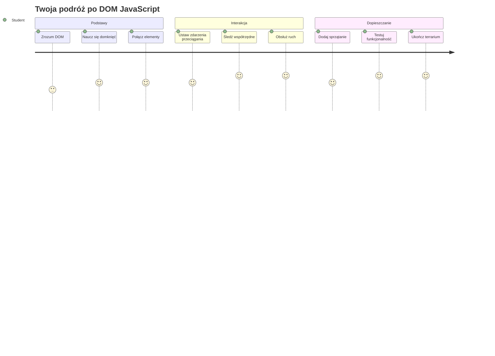
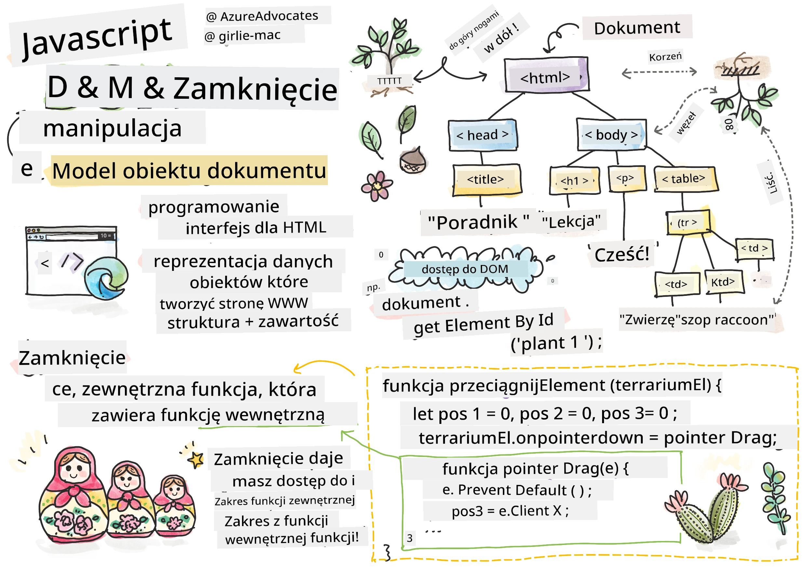
> Sketchnotka autorstwa [Tomomi Imura](https://twitter.com/girlie_mac)

Witamy w jednym z najbardziej angażujących aspektów tworzenia stron internetowych – tworzeniu interaktywności! Model Obiektowy Dokumentu (DOM) jest jak most łączący twój HTML z JavaScript, a dziś użyjemy go, aby ożywić twoje terrarium. Gdy Tim Berners-Lee stworzył pierwszą przeglądarkę internetową, wyobrażał sobie sieć, gdzie dokumenty mogą być dynamiczne i interaktywne – to właśnie DOM sprawia, że ta wizja jest możliwa.

Poznamy też zamknięcia w JavaScript, które mogą na początku wydawać się onieśmielające. Pomyśl o zamknięciach jak o tworzeniu "kieszonek pamięci", gdzie twoje funkcje mogą zapamiętywać ważne informacje. To tak, jakby każda roślina w twoim terrarium miała własny rekord danych śledzący jej pozycję. Pod koniec tej lekcji zrozumiesz, jak naturalne i użyteczne są zamknięcia.

Oto, co zbudujemy: terrarium, gdzie użytkownicy mogą przeciągać rośliny w dowolne miejsce, które chcą. Nauczysz się technik manipulacji DOM, które napędzają wszystko, od przeciągania i upuszczania plików po interaktywne gry. Ożywmy twoje terrarium.

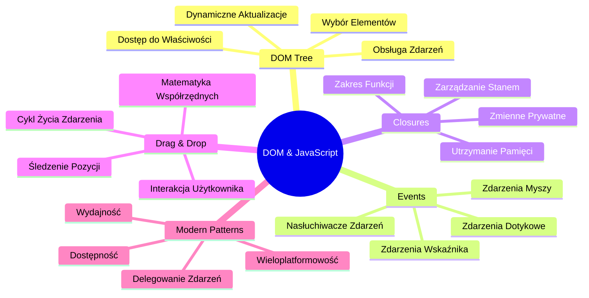
## Quiz przed wykładem

[Quiz przed wykładem](https://ff-quizzes.netlify.app/web/quiz/19)

## Zrozumienie DOM: Twoja brama do interaktywnych stron internetowych

Model Obiektowy Dokumentu (DOM) to sposób, w jaki JavaScript komunikuje się z twoimi elementami HTML. Kiedy przeglądarka ładuje stronę HTML, tworzy w pamięci uporządkowaną reprezentację tej strony – to właśnie DOM. Pomyśl o tym jak o drzewie genealogicznym, gdzie każdy element HTML jest członkiem rodziny, do którego JavaScript może mieć dostęp, modyfikować go lub przestawiać.

Manipulacja DOM przekształca statyczne strony w interaktywne witryny. Za każdym razem, gdy widzisz, jak przycisk zmienia kolor po najechaniu, treść aktualizuje się bez odświeżania strony lub gdy możesz przeciągać elementy – to właśnie działa manipulacja DOM.

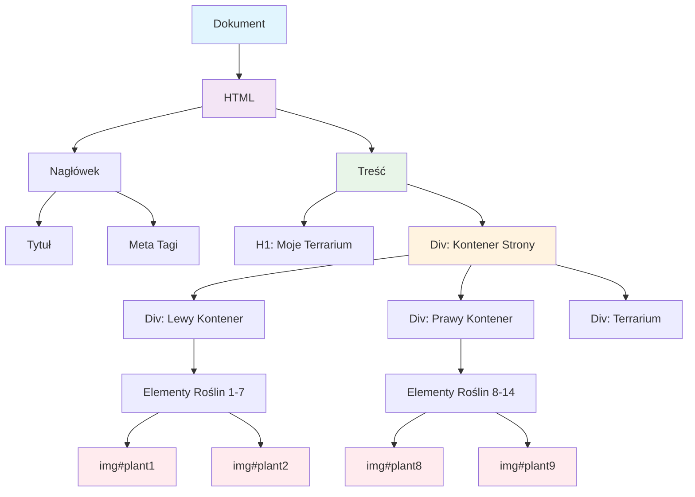
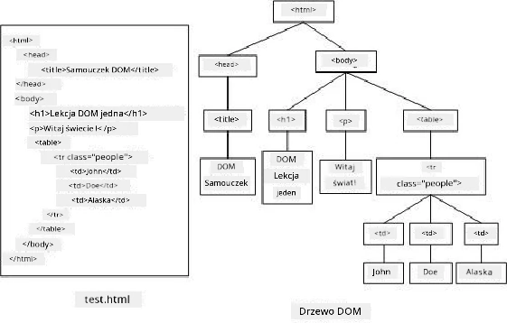

> Reprezentacja DOM i powiązanego znacznika HTML. Źródło: [Olfa Nasraoui](https://www.researchgate.net/publication/221417012_Profile-Based_Focused_Crawler_for_Social_Media-Sharing_Websites)

**Co czyni DOM potężnym:**
- **Zapewnia** uporządkowany sposób dostępu do dowolnego elementu na stronie
- **Umożliwia** dynamiczne aktualizacje treści bez przeładowywania strony
- **Pozwala** na reakcję w czasie rzeczywistym na interakcje użytkownika, takie jak kliknięcia i przeciąganie
- **Tworzy** fundament nowoczesnych interaktywnych aplikacji webowych

## Zamknięcia JavaScript: Tworzenie zorganizowanego, potężnego kodu

[Zamknięcie w JavaScript](https://developer.mozilla.org/docs/Web/JavaScript/Closures) to jak nadanie funkcji prywatnej przestrzeni roboczej z trwałą pamięcią. Rozważ, jak zięby Darwina na Wyspach Galapagos każda wykształciła specjalistyczny kształt dzioba w zależności od lokalnego środowiska – zamknięcia działają podobnie, tworząc specjalizowane funkcje, które "pamiętają" swój kontekst nawet po zakończeniu funkcji nadrzędnej.

W naszym terrarium zamknięcia pomagają każdej roślinie pamiętać własną pozycję niezależnie. Ten wzorzec pojawia się w profesjonalnym rozwoju JavaScript, dlatego warto go poznać.

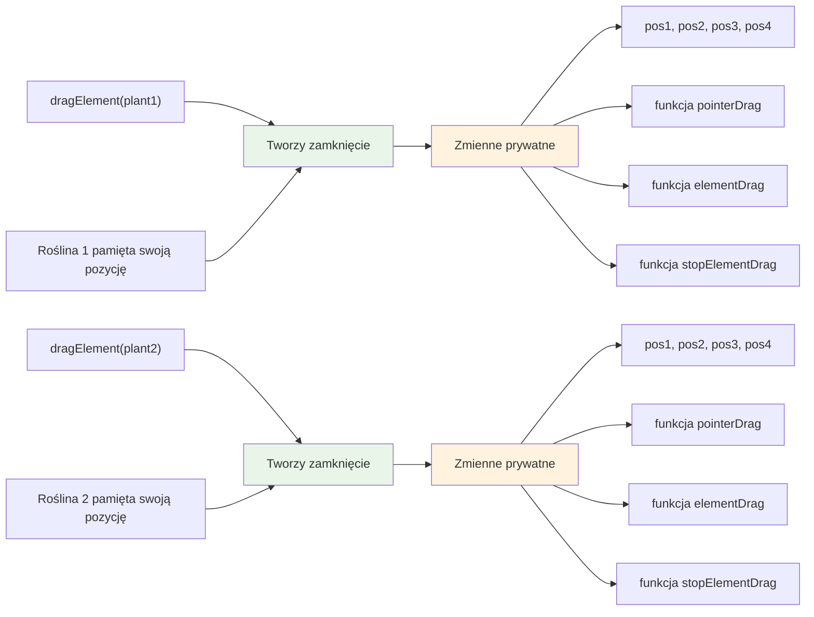
> 💡 **Zrozumienie zamknięć**: Zamknięcia to istotny temat w JavaScript i wielu programistów używa ich przez lata, zanim w pełni zrozumie teoretyczne aspekty. Dzisiaj skupimy się na praktycznym zastosowaniu – zobaczysz, jak zamknięcia naturalnie pojawiają się podczas budowania interaktywnych funkcji. Zrozumienie rozwinie się, gdy zobaczysz, jak rozwiązują rzeczywiste problemy.


> Reprezentacja DOM i powiązanego znacznika HTML. Źródło: [Olfa Nasraoui](https://www.researchgate.net/publication/221417012_Profile-Based_Focused_Crawler_for_Social_Media-Sharing_Websites)

W tej lekcji ukończymy nasz projekt interaktywnego terrarium, tworząc JavaScript, który pozwoli użytkownikowi manipulować roślinami na stronie.

## Zanim zaczniemy: Przygotowanie do sukcesu

Będziesz potrzebować plików HTML i CSS z poprzednich lekcji terrarium – właśnie zamienimy ten statyczny projekt w interaktywny. Jeśli dołączasz po raz pierwszy, ukończenie tych lekcji najpierw zapewni ważny kontekst.

Oto, co zbudujemy:
- **Płynne przeciąganie i upuszczanie** wszystkich roślin w terrarium
- **Śledzenie współrzędnych**, aby rośliny pamiętały swoje pozycje
- **Kompletny interaktywny interfejs** napisany w czystym JavaScript
- **Czysty, uporządkowany kod** wykorzystujący wzorce zamknięć

## Tworzenie pliku JavaScript

Stwórzmy plik JavaScript, który uczyni twoje terrarium interaktywnym.

**Krok 1: Utwórz plik skryptu**

W folderze terrarium utwórz nowy plik o nazwie `script.js`.

**Krok 2: Podłącz JavaScript do HTML**

Dodaj ten tag skryptu do sekcji `<head>` w pliku `index.html`:

```html
<script src="./script.js" defer></script>
```

**Dlaczego atrybut `defer` jest ważny:**
- **Zapewnia**, że twój JavaScript czeka, aż cały HTML zostanie załadowany
- **Zapobiega** błędom, gdy JavaScript szuka elementów, które jeszcze nie są gotowe
- **Gwarantuje**, że wszystkie elementy roślin są dostępne do interakcji
- **Zapewnia** lepszą wydajność niż umieszczanie skryptów na dole strony

> ⚠️ **Ważna uwaga**: Atrybut `defer` zapobiega typowym problemom z kolejnością ładowania. Bez niego JavaScript może próbować uzyskać dostęp do elementów HTML zanim będą załadowane, co powoduje błędy.

---

## Łączenie JavaScript z elementami HTML

Zanim umożliwimy przeciąganie elementów, JavaScript musi znaleźć je w DOM. Pomyśl o tym jak o katalogu bibliotecznym – mając numer katalogowy, znajdziesz dokładnie tę książkę, której potrzebujesz, i uzyskasz dostęp do całej jej zawartości.

Użyjemy metody `document.getElementById()`, aby nawiązać te połączenia. To jak precyzyjny system archiwizacji – podajesz ID, a metoda znajduje dokładny element w twoim HTML.

### Włączanie funkcji przeciągania dla wszystkich roślin

Dodaj ten kod do pliku `script.js`:

```javascript
// Włącz funkcję przeciągania dla wszystkich 14 roślin
dragElement(document.getElementById('plant1'));
dragElement(document.getElementById('plant2'));
dragElement(document.getElementById('plant3'));
dragElement(document.getElementById('plant4'));
dragElement(document.getElementById('plant5'));
dragElement(document.getElementById('plant6'));
dragElement(document.getElementById('plant7'));
dragElement(document.getElementById('plant8'));
dragElement(document.getElementById('plant9'));
dragElement(document.getElementById('plant10'));
dragElement(document.getElementById('plant11'));
dragElement(document.getElementById('plant12'));
dragElement(document.getElementById('plant13'));
dragElement(document.getElementById('plant14'));
```

**Co ten kod robi:**
- **Znajduje** każdy element rośliny w DOM po jego unikalnym ID
- **Pobiera** referencję JavaScript do każdego elementu HTML
- **Przekazuje** każdy element do funkcji `dragElement` (którą stworzymy za chwilę)
- **Przygotowuje** każdą roślinę do interakcji przeciągania i upuszczania
- **Łączy** strukturę HTML z funkcjonalnością JavaScript

> 🎯 **Dlaczego używamy ID zamiast klas?** ID zapewniają unikalne identyfikatory dla konkretnych elementów, podczas gdy klasy CSS służą do stylizowania grup elementów. Gdy JavaScript musi manipulować pojedynczym elementem, ID zapewniają precyzję i wydajność.

> 💡 **Porada praktyczna**: Zauważ, że wywołujemy `dragElement()` osobno dla każdej rośliny. Takie podejście gwarantuje, że każda roślina otrzymuje swoją niezależną funkcjonalność przeciągania, co jest kluczowe dla płynnej interakcji użytkownika.

### 🔄 **Sprawdzenie pedagogiczne**
**Zrozumienie połączenia DOM**: Przed przejściem do funkcji przeciągania upewnij się, że potrafisz:
- ✅ Wytłumaczyć, jak `document.getElementById()` lokalizuje elementy HTML
- ✅ Zrozumieć, dlaczego używamy unikalnych ID dla każdej rośliny
- ✅ Opisać cel atrybutu `defer` w tagach skryptu
- ✅ Rozpoznać, jak JavaScript i HTML łączą się przez DOM

**Szybki test:** Co by się stało, gdyby dwa elementy miały takie samo ID? Dlaczego `getElementById()` zwraca tylko jeden element?  
*Odpowiedź: ID powinny być unikalne; jeśli się powtarzają, zostanie zwrócony tylko pierwszy element*

---

## Budowanie zamknięcia funkcji dragElement

Teraz stworzymy serce naszej funkcjonalności przeciągania: zamknięcie zarządzające zachowaniem przeciągania dla każdej rośliny. To zamknięcie będzie zawierać kilka funkcji wewnętrznych, które współpracują, aby śledzić ruchy myszy i aktualizować pozycje elementów.

Zamknięcia są idealne do tego zadania, ponieważ pozwalają tworzyć "prywatne" zmienne, które utrzymują stan między wywołaniami funkcji, dając każdej roślinie własny, niezależny system śledzenia współrzędnych.

### Zrozumienie zamknięć na prostym przykładzie

Pokażę zamknięcia na prostym przykładzie ilustrującym tę koncepcję:

```javascript
function createCounter() {
    let count = 0; // To jest jak prywatna zmienna
    
    function increment() {
        count++; // Funkcja wewnętrzna pamięta zmienną zewnętrzną
        return count;
    }
    
    return increment; // Zwracamy funkcję wewnętrzną
}

const myCounter = createCounter();
console.log(myCounter()); // 1
console.log(myCounter()); // 2
```

**Co dzieje się w tym wzorcu zamknięcia:**
- **Tworzy** prywatną zmienną `count`, która istnieje tylko w tym zamknięciu
- **Funkcja wewnętrzna** może uzyskiwać dostęp i modyfikować tę zewnętrzną zmienną (mechanizm zamknięcia)
- **Po zwróceniu** funkcji wewnętrznej zachowuje ona połączenie z tymi prywatnymi danymi
- **Nawet po** zakończeniu wykonania `createCounter()`, zmienna `count` istnieje i pamięta swoją wartość

### Dlaczego zamknięcia są idealne dla funkcji przeciągania

W naszym terrarium każda roślina musi pamiętać swoje aktualne współrzędne pozycji. Zamknięcia zapewniają idealne rozwiązanie:

**Kluczowe korzyści dla naszego projektu:**
- **Utrzymują** prywatne zmienne pozycji dla każdej rośliny niezależnie
- **Zachowują** dane współrzędnych między zdarzeniami przeciągania
- **Zapobiegają** konfliktom zmiennych między różnymi elementami do przeciągania
- **Tworzą** czystą, uporządkowaną strukturę kodu

> 🎯 **Cel nauki**: Nie musisz teraz opanować wszystkich aspektów zamknięć. Skup się na tym, jak pomagają nam zorganizować kod i utrzymać stan w funkcjonalności przeciągania.

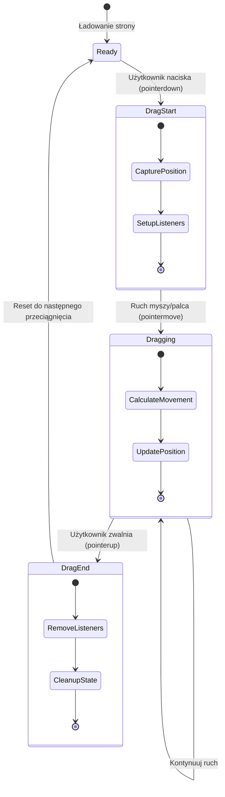
### Tworzenie funkcji dragElement

Zbudujmy teraz główną funkcję, która obsłuży całą logikę przeciągania. Dodaj tę funkcję poniżej deklaracji elementów roślin:

```javascript
function dragElement(terrariumElement) {
    // Zainicjuj zmienne śledzenia pozycji
    let pos1 = 0,  // Poprzednia pozycja myszy na osi X
        pos2 = 0,  // Poprzednia pozycja myszy na osi Y
        pos3 = 0,  // Aktualna pozycja myszy na osi X
        pos4 = 0;  // Aktualna pozycja myszy na osi Y
    
    // Ustaw początkowego nasłuchiwacza zdarzenia przeciągania
    terrariumElement.onpointerdown = pointerDrag;
}
```

**Zrozumienie systemu śledzenia pozycji:**
- **`pos1` i `pos2`**: Przechowują różnicę między starą a nową pozycją myszy
- **`pos3` i `pos4`**: Śledzą aktualne współrzędne myszy
- **`terrariumElement`**: Konkretny element rośliny, który czynimy przeciągalnym
- **`onpointerdown`**: Zdarzenie wyzwalane, kiedy użytkownik zaczyna przeciąganie

**Jak działa wzorzec zamknięcia:**
- **Tworzy** prywatne zmienne pozycji dla każdego elementu rośliny
- **Utrzymuje** te zmienne przez cały cykl przeciągania
- **Zapewnia**, że każda roślina śledzi swoje współrzędne niezależnie
- **Dostarcza** czysty interfejs poprzez funkcję `dragElement`

### Dlaczego używamy zdarzeń wskaźnikowych (pointer events)?

Możesz się zastanawiać, dlaczego używamy `onpointerdown` zamiast bardziej znanego `onclick`. Oto uzasadnienie:

| Typ zdarzenia | Najlepsze dla | Co jest istotne |
|---------------|---------------|----------------|
| `onclick` | Proste kliknięcia przyciskiem | Nie obsługuje przeciągania (tylko kliknięcia i zwolnienia) |
| `onpointerdown` | Zarówno mysz, jak i dotyk | Nowsze, ale obecnie dobrze wspierane |
| `onmousedown` | Tylko mysz na komputerze | Nie obsługuje użytkowników mobilnych |

**Dlaczego zdarzenia wskaźnikowe są idealne do naszego projektu:**
- **Działają świetnie** niezależnie, czy ktoś używa myszy, palca czy rysika
- **Dają tę samą funkcjonalność** na laptopie, tablecie czy telefonie
- **Obsługują** faktyczny ruch przeciągania (nie tylko kliknięcie)
- **Tworzą** płynne doświadczenie oczekiwane od nowoczesnych aplikacji webowych

> 💡 **Zabezpieczenie na przyszłość**: Zdarzenia wskaźnikowe to nowoczesny sposób obsługi interakcji użytkownika. Zamiast pisać osobny kod dla myszy i dotyku, masz oba w jednym. Całkiem sprytne, prawda?

### 🔄 **Sprawdzenie pedagogiczne**
**Zrozumienie obsługi zdarzeń**: Zatrzymaj się, by potwierdzić zrozumienie:
- ✅ Dlaczego używamy zdarzeń wskaźnikowych zamiast zdarzeń myszy?
- ✅ Jak zmienne w zamknięciach zachowują się między wywołaniami funkcji?
- ✅ Jaką rolę pełni `preventDefault()` dla płynnego przeciągania?
- ✅ Dlaczego nasłuchiwacze zdarzeń są dodawani do dokumentu, a nie indywidualnych elementów?

**Połączenie z rzeczywistością**: Pomyśl o interfejsach przeciągnij i upuść, których używasz na co dzień:
- **Przesyłanie plików:** Przeciąganie plików do okna przeglądarki
- **Tablice kanban:** Przenoszenie zadań między kolumnami
- **Galerie obrazów:** Zmienianie kolejności zdjęć
- **Interfejsy mobilne:** Przesuwanie i przeciąganie na ekranach dotykowych

---

## Funkcja pointerDrag: Rejestrowanie rozpoczęcia przeciągania

Gdy użytkownik naciska na roślinę (myszą lub dotykiem), funkcja `pointerDrag` wkracza do akcji. Ta funkcja rejestruje początkowe współrzędne i przygotowuje system przeciągania.

Dodaj tę funkcję wewnątrz swojego zamknięcia `dragElement`, zaraz po linii `terrariumElement.onpointerdown = pointerDrag;`:

```javascript
function pointerDrag(e) {
    // Zapobiegaj domyślnemu zachowaniu przeglądarki (takim jak zaznaczanie tekstu)
    e.preventDefault();
    
    // Zapisz początkową pozycję myszy/palca
    pos3 = e.clientX;  // Współrzędna X, w której rozpoczęto przeciąganie
    pos4 = e.clientY;  // Współrzędna Y, w której rozpoczęto przeciąganie
    
    // Ustaw nasłuchiwacze zdarzeń dla procesu przeciągania
    document.onpointermove = elementDrag;
    document.onpointerup = stopElementDrag;
}
```

**Krok po kroku, co się tu dzieje:**
- **Zapobiega** domyślnym zachowaniom przeglądarki, które mogłyby przeszkadzać w przeciąganiu
- **Rejestruje** dokładne współrzędne, w których użytkownik zaczął gest przeciągania
- **Ustala** nasłuchiwacze zdarzeń dla trwającego ruchu przeciągania
- **Przygotowuje** system do śledzenia ruchu myszy/palca na całym dokumencie

### Zrozumienie zapobiegania zdarzeniom

Linia `e.preventDefault()` jest kluczowa dla płynnego przeciągania:

**Bez tego przeglądarki mogą:**
- **Zaznaczać** tekst podczas przeciągania po stronie
- **Uruchamiać** menu kontekstowe przy przeciąganiu prawym przyciskiem
- **Przeszkadzać** w naszym niestandardowym zachowaniu przeciągania
- **Tworzyć** artefakty wizualne podczas operacji przeciągania

> 🔍 **Eksperyment**: Po ukończeniu tej lekcji spróbuj usunąć `e.preventDefault()` i zobacz, jak to wpływa na doświadczenie przeciągania. Szybko zauważysz, dlaczego ta linia jest niezbędna!

### System śledzenia współrzędnych

Właściwości `e.clientX` i `e.clientY` dają nam precyzyjne współrzędne myszy/dotyku:

| Właściwość | Co mierzy | Zastosowanie |
|------------|-----------|--------------|
| `clientX`  | Pozycja pozioma względem widoku | Śledzenie ruchu w osi poziomej |
| `clientY`  | Pozycja pionowa względem widoku | Śledzenie ruchu w osi pionowej |
**Zrozumienie tych współrzędnych:**
- **Zapewnia** idealnie dopasowane informacje o pozycjonowaniu w pikselach
- **Aktualizuje się** w czasie rzeczywistym, gdy użytkownik przesuwa wskaźnik
- **Pozostaje** spójne na różnych rozmiarach ekranu i poziomach zoomu
- **Umożliwia** płynne, responsywne przeciąganie

### Konfigurowanie nasłuchiwaczy zdarzeń na poziomie dokumentu

Zauważ, jak przypisujemy zdarzenia move i stop do całego `document`, a nie tylko do elementu rośliny:

```javascript
document.onpointermove = elementDrag;
document.onpointerup = stopElementDrag;
```

**Dlaczego przypinamy do dokumentu:**
- **Kontynuuje** śledzenie nawet, gdy mysz opuszcza element rośliny
- **Zapobiega** przerwaniu przeciągania, jeśli użytkownik szybko przesunie wskaźnik
- **Zapewnia** płynne przeciąganie na całym ekranie
- **Obsługuje** sytuacje krańcowe, gdy kursor wyjdzie poza okno przeglądarki

> ⚡ **Uwaga dotycząca wydajności**: Nasłuchiwacze na poziomie dokumentu zostaną usunięte, gdy przeciąganie zostanie zakończone, aby uniknąć wycieków pamięci i problemów z wydajnością.

## Ukończenie systemu przeciągania: ruch i sprzątanie

Teraz dodamy dwie pozostałe funkcje, które obsługują faktyczny ruch podczas przeciągania oraz sprzątanie po zakończeniu przeciągania. Funkcje te współpracują, aby tworzyć płynny, responsywny ruch roślin w terrarium.

### Funkcja elementDrag: Śledzenie ruchu

Dodaj funkcję `elementDrag` zaraz po zamykającym nawiasie klamrowym `pointerDrag`:

```javascript
function elementDrag(e) {
    // Oblicz odległość pokonaną od ostatniego zdarzenia
    pos1 = pos3 - e.clientX;  // Przesunięcie poziome
    pos2 = pos4 - e.clientY;  // Przesunięcie pionowe
    
    // Zaktualizuj bieżące śledzenie pozycji
    pos3 = e.clientX;  // Nowa bieżąca pozycja X
    pos4 = e.clientY;  // Nowa bieżąca pozycja Y
    
    // Zastosuj przesunięcie do pozycji elementu
    terrariumElement.style.top = (terrariumElement.offsetTop - pos2) + 'px';
    terrariumElement.style.left = (terrariumElement.offsetLeft - pos1) + 'px';
}
```

**Zrozumienie matematyki współrzędnych:**
- **`pos1` i `pos2`**: Obliczają, jak daleko mysz przesunęła się od ostatniej aktualizacji
- **`pos3` i `pos4`**: Przechowują aktualną pozycję myszy do kolejnych obliczeń
- **`offsetTop` i `offsetLeft`**: Pobierają aktualną pozycję elementu na stronie
- **Logika odejmowania**: Przesuwa element o tę samą odległość, o jaką poruszyła się mysz

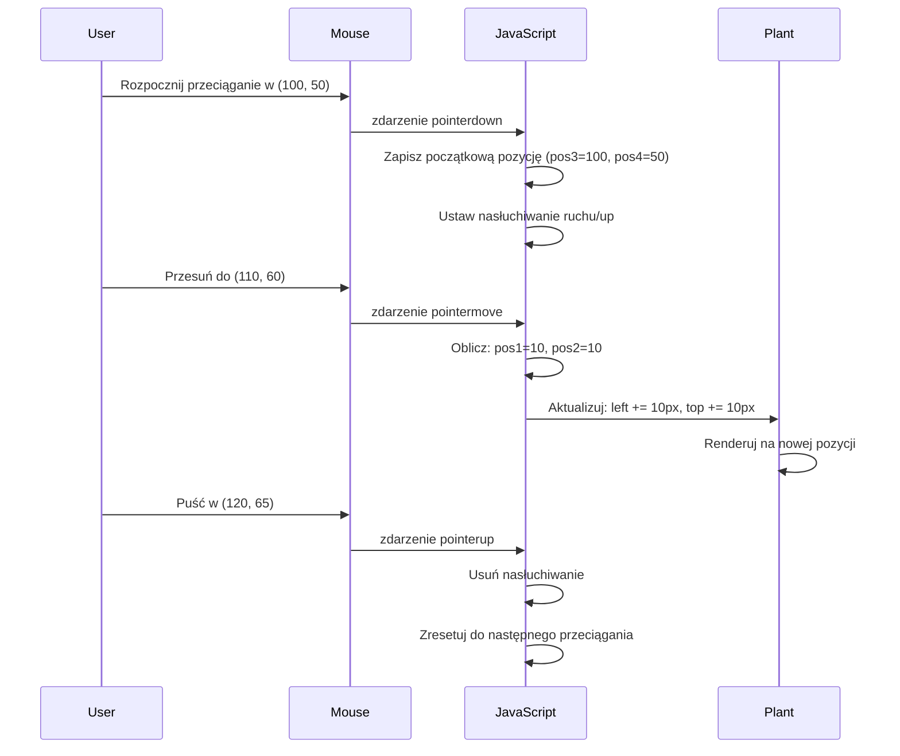
**Oto rozbicie obliczeń ruchu:**
1. **Mierzy** różnicę między starą a nową pozycją myszy
2. **Oblicza**, o ile przesunąć element na podstawie ruchu myszy
3. **Aktualizuje** właściwości CSS pozycji elementu w czasie rzeczywistym
4. **Przechowuje** nową pozycję jako punkt odniesienia do kolejnych obliczeń ruchu

### Wizualna prezentacja matematyki

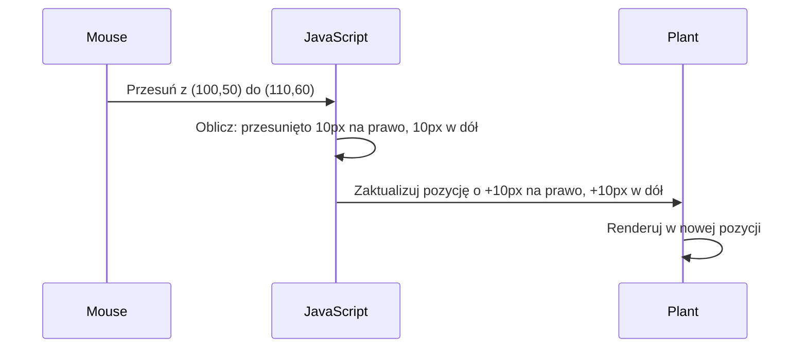
### Funkcja stopElementDrag: Sprzątanie

Dodaj funkcję sprzątającą po zamykającym nawiasie klamrowym `elementDrag`:

```javascript
function stopElementDrag() {
    // Usuń nasłuchiwacze zdarzeń na poziomie dokumentu
    document.onpointerup = null;
    document.onpointermove = null;
}
```

**Dlaczego sprzątanie jest istotne:**
- **Zapobiega** wyciekom pamięci przez pozostające nasłuchiwacze zdarzeń
- **Zatrzymuje** zachowanie przeciągania, gdy użytkownik puści roślinę
- **Umożliwia** niezależne przeciąganie innych elementów
- **Resetuje** system do następnej operacji przeciągania

**Co się stanie bez sprzątania:**
- Nasłuchiwacze zdarzeń działają nadal po zakończeniu przeciągania
- Wydajność spada wraz z nagromadzeniem nieużywanych nasłuchiwaczy
- Niespodziewane zachowanie przy interakcji z innymi elementami
- Zasoby przeglądarki są marnowane na niepotrzebną obsługę zdarzeń

### Zrozumienie właściwości pozycji CSS

Nasz system przeciągania manipuluje dwiema kluczowymi właściwościami CSS:

| Właściwość | Co kontroluje | Jak jej używamy |
|------------|---------------|-----------------|
| `top`      | Odległość od górnej krawędzi | Pozycjonowanie pionowe podczas przeciągania |
| `left`     | Odległość od lewej krawędzi  | Pozycjonowanie poziome podczas przeciągania |

**Kluczowe informacje o właściwościach offset:**
- **`offsetTop`**: Aktualna odległość od górnej krawędzi najbliższego pozycjonowanego elementu nadrzędnego
- **`offsetLeft`**: Aktualna odległość od lewej krawędzi najbliższego pozycjonowanego elementu nadrzędnego
- **Kontekst pozycjonowania**: Wartości są względem najbliższego pozycjonowanego przodka
- **Aktualizacje w czasie rzeczywistym**: Zmieniają się natychmiast po modyfikacji właściwości CSS

> 🎯 **Filozofia projektowania**: Ten system przeciągania jest celowo elastyczny – nie ma „stref upuszczania” ani ograniczeń. Użytkownicy mogą umieszczać rośliny dowolnie, mając pełną kontrolę kreatywną nad projektem terrarium.

## Podsumowanie: Twój kompletny system przeciągania

Gratulacje! Właśnie zbudowałeś zaawansowany system przeciągnij-i-upuść używając vanilla JavaScript. Twoja kompletna funkcja `dragElement` zawiera teraz potężny closure, który zarządza:

**Co osiąga Twój closure:**
- **Utrzymuje** prywatne zmienne pozycji dla każdej rośliny niezależnie
- **Obsługuje** cały cykl życia przeciągania od początku do końca
- **Zapewnia** płynny, responsywny ruch na całym ekranie
- **Prawidłowo sprząta** zasoby, aby zapobiegać wyciekom pamięci
- **Tworzy** intuicyjny, kreatywny interfejs do projektowania terrarium

### Testowanie Twojego interaktywnego terrarium

Teraz przetestuj swoje interaktywne terrarium! Otwórz plik `index.html` w przeglądarce i wypróbuj funkcjonalność:

1. **Kliknij i przytrzymaj** dowolną roślinę, aby rozpocząć przeciąganie
2. **Przesuń mysz lub palec** i zobacz, jak roślina płynnie podąża
3. **Puść** aby upuścić roślinę w nowym miejscu
4. **Eksperymentuj** z różnymi ułożeniami, aby poznać interfejs

🥇 **Osiągnięcie**: Stworzyłeś w pełni interaktywną aplikację webową używając podstawowych koncepcji stosowanych przez profesjonalnych programistów codziennie. Ta funkcjonalność przeciągnij-i-upuść wykorzystuje te same zasady, co upload plików, tablice kanban i wiele innych interaktywnych interfejsów.

### 🔄 **Sprawdzenie pedagogiczne**
**Pełne zrozumienie systemu**: Zweryfikuj swoją biegłość w całym systemie przeciągania:
- ✅ Jak closure utrzymują niezależny stan dla każdej rośliny?
- ✅ Dlaczego matematyka obliczeń współrzędnych jest potrzebna do płynnego ruchu?
- ✅ Co się stanie, jeśli zapomnimy posprzątać nasłuchiwacze zdarzeń?
- ✅ Jak ten wzorzec skaluje się do bardziej złożonych interakcji?

**Refleksja nad jakością kodu**: Przejrzyj swoje kompletne rozwiązanie:
- **Modułowa konstrukcja**: Każda roślina dostaje własną instancję closure
- **Efektywność zdarzeń**: Poprawne ustawienie i sprzątanie nasłuchiwaczy
- **Wsparcie wieloplatformowe**: Działa na desktopie i urządzeniach mobilnych
- **Uważność na wydajność**: Brak wycieków pamięci lub zbędnych obliczeń

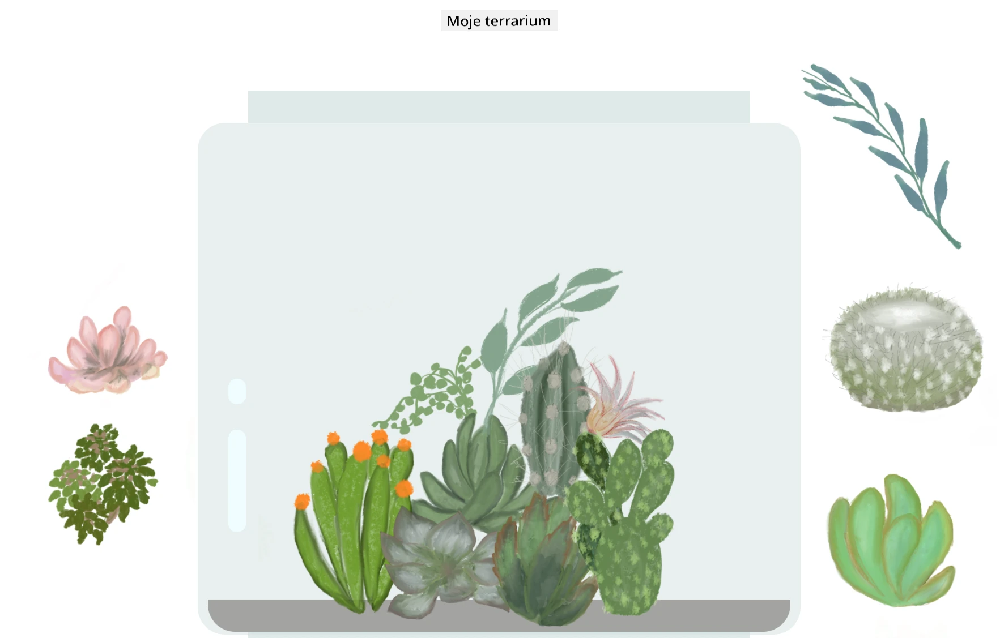

---

## Wyzwanie GitHub Copilot Agent 🚀

Użyj trybu Agenta, aby ukończyć następujące zadanie:

**Opis:** Rozbuduj projekt terrarium o funkcję resetowania, która przywróci wszystkie rośliny do ich oryginalnych pozycji na pasku bocznym, animując ruch płynnie.

**Polecenie:** Stwórz przycisk resetowania, który po kliknięciu animuje wszystkie rośliny z powrotem do ich oryginalnych pozycji na pasku bocznym, używając przejść CSS. Funkcja powinna zapisywać oryginalne pozycje przy ładowaniu strony i płynnie przenosić rośliny z powrotem w ciągu 1 sekundy po naciśnięciu przycisku reset.

Dowiedz się więcej o [trybie agenta](https://code.visualstudio.com/blogs/2025/02/24/introducing-copilot-agent-mode).

## 🚀 Dodatkowe wyzwanie: Rozwijaj swoje umiejętności

Gotowy, by przenieść swoje terrarium na wyższy poziom? Spróbuj wdrożyć te ulepszenia:

**Kreatywne rozszerzenia:**
- **Podwójne kliknięcie** rośliny, by wysunąć ją na wierzch (manipulacja z-index)
- **Dodaj wizualne efekty** takie jak delikatny blask podczas najechania na rośliny
- **Wprowadź ograniczenia** uniemożliwiające przeciąganie roślin poza granice terrarium
- **Stwórz funkcję zapisu**, która pamięta pozycje roślin w localStorage
- **Dodaj efekty dźwiękowe** przy podnoszeniu i upuszczaniu roślin

> 💡 **Okazja do nauki**: Każde z tych zadań nauczy Cię nowych aspektów manipulacji DOM, obsługi zdarzeń i projektowania UX.

## Quiz po wykładzie

[Quiz po wykładzie](https://ff-quizzes.netlify.app/web/quiz/20)

## Przegląd i samodzielna nauka: Pogłębienie zrozumienia

Opanowałeś fundamenty manipulacji DOM i closure, ale zawsze jest co zgłębiać! Oto propozycje ścieżek do rozwijania wiedzy i umiejętności.

### Alternatywne podejścia do przeciągania i upuszczania

Użyliśmy zdarzeń pointer dla maksymalnej elastyczności, ale web development oferuje wiele podejść:

| Podejście | Do czego najlepsze | Wartość nauki |
|-----------|--------------------|---------------|
| [HTML Drag and Drop API](https://developer.mozilla.org/docs/Web/API/HTML_Drag_and_Drop_API) | Upload plików, formalne strefy przeciągania | Zrozumienie natywnych funkcji przeglądarki |
| [Touch Events](https://developer.mozilla.org/docs/Web/API/Touch_events) | Interakcje na urządzeniach mobilnych | Wzorce rozwoju mobile-first |
| Właściwości CSS `transform` | Płynne animacje | Techniki optymalizacji wydajności |

### Zaawansowane tematy manipulacji DOM

**Następne kroki w nauce:**
- **Delegowanie zdarzeń**: Efektywna obsługa wielu elementów
- **Intersection Observer**: Wykrywanie, kiedy elementy wchodzą/opuszczają widok
- **Mutation Observer**: Monitorowanie zmian w strukturze DOM
- **Web Components**: Tworzenie wielokrotnego użytku, enkapsulowanych elementów UI
- **Koncepcje Virtual DOM**: Zrozumienie, jak frameworki optymalizują aktualizacje DOM

### Niezbędne zasoby dla dalszej nauki

**Dokumentacja techniczna:**
- [Przewodnik po zdarzeniach pointer na MDN](https://developer.mozilla.org/docs/Web/API/Pointer_events) – Kompleksowy przewodnik po zdarzeniach pointer
- [Specyfikacja Pointer Events W3C](https://www.w3.org/TR/pointerevents1/) – Oficjalna dokumentacja standardów
- [Dogłębne omówienie closures w JavaScript](https://developer.mozilla.org/docs/Web/JavaScript/Closures) – Zaawansowane wzorce closure

**Zgodność przeglądarek:**
- [CanIUse.com](https://caniuse.com/) – Sprawdź wsparcie funkcji w różnych przeglądarkach
- [MDN Dane zgodności](https://github.com/mdn/browser-compat-data) – Szczegółowe informacje o kompatybilności

**Możliwości praktyki:**
- **Stwórz** grę puzzlową z użyciem podobnych mechanik przeciągania
- **Zapewnij** tablicę kanban z zarządzaniem zadaniami przeciągając je i upuszczając
- **Zaprojektuj** galerię zdjęć z przeciąganymi układami zdjęć
- **Eksperymentuj** z gestami dotykowymi na interfejsach mobilnych

> 🎯 **Strategia nauki**: Najlepszym sposobem na utrwalenie tych koncepcji jest praktyka. Buduj różne warianty interfejsów przeciągania – każdy projekt nauczy Cię czegoś nowego o interakcjach użytkownika i manipulacji DOM.

### ⚡ **Co możesz zrobić w ciągu najbliższych 5 minut**
- [ ] Otwórz narzędzia developerskie przeglądarki i wpisz `document.querySelector('body')` w konsoli
- [ ] Spróbuj zmienić tekst na stronie za pomocą `innerHTML` lub `textContent`
- [ ] Dodaj nasłuchiwacz kliknięć do dowolnego przycisku lub linku na stronie
- [ ] Zbadaj strukturę drzewa DOM w panelu Elementy

### 🎯 **Co możesz osiągnąć w ciągu godziny**
- [ ] Ukończ quiz po lekcji i przejrzyj koncepcje manipulacji DOM
- [ ] Stwórz interaktywną stronę internetową reagującą na kliknięcia użytkownika
- [ ] Przećwicz obsługę zdarzeń różnych typów (click, mouseover, keypress)
- [ ] Zbuduj prostą listę zadań lub licznik używając manipulacji DOM
- [ ] Poznaj związek między elementami HTML a obiektami JavaScript

### 📅 **Twoja tygodniowa podróż po JavaScript**
- [ ] Ukończ projekt interaktywnego terrarium z funkcją przeciągania i upuszczania
- [ ] Opanuj delegowanie zdarzeń dla efektywnej obsługi eventów
- [ ] Naucz się o pętli zdarzeń i asynchronicznym JavaScript
- [ ] Przećwicz closure, tworząc moduły z prywatnym stanem
- [ ] Zapoznaj się z nowoczesnymi API DOM, takimi jak Intersection Observer
- [ ] Buduj interaktywne komponenty bez użycia frameworków

### 🌟 **Twoje miesięczne mistrzostwo JavaScript**
- [ ] Stwórz złożoną aplikację typu SPA używając vanilla JavaScript
- [ ] Naucz się nowoczesnego frameworka (React, Vue lub Angular) i porównaj z vanilla DOM
- [ ] Wkładaj wkład do projektów open source w JavaScript
- [ ] Opanuj zaawansowane koncepcje, takie jak web components i custom elements
- [ ] Buduj wydajne aplikacje internetowe z optymalnymi wzorcami DOM
- [ ] Ucz innych o manipulacji DOM i podstawach JavaScript

## 🎯 Twoja oś czasu mistrzostwa DOM w JavaScript

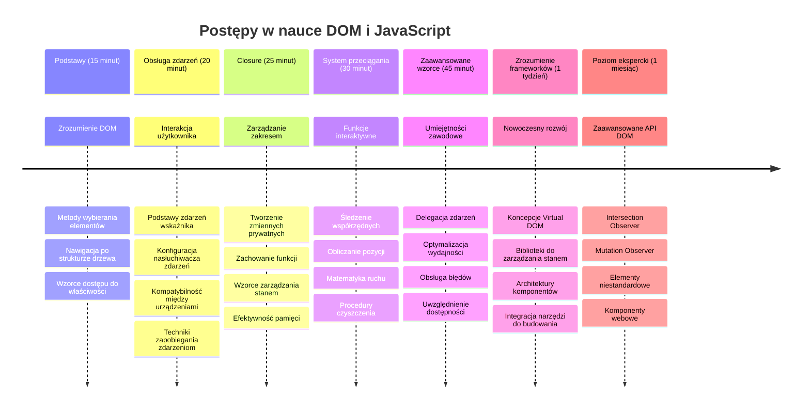
### 🛠️ Podsumowanie Twojego zestawu narzędzi JavaScript

Po ukończeniu tej lekcji masz teraz:
- **Mistrzostwo DOM**: wybieranie elementów, manipulacja właściwościami i nawigacja po drzewie
- **Ekspertyza zdarzeń**: obsługa interakcji wieloplatformowych z eventami pointer
- **Zrozumienie closure**: zarządzanie prywatnym stanem i trwałością funkcji
- **Interaktywne systemy**: kompletna implementacja przeciągnij-i-upuść od podstaw
- **Świadomość wydajności**: odpowiednie sprzątanie zdarzeń i zarządzanie pamięcią
- **Nowoczesne wzorce**: techniki organizacji kodu stosowane w profesjonalnym developmentcie
- **Doświadczenie użytkownika**: tworzenie intuicyjnych, responsywnych interfejsów

**Zdobyte umiejętności zawodowe**: Zbudowałeś funkcje wykorzystujące te same techniki co:
- **Tablice Trello/Kanban**: przeciąganie kart między kolumnami
- **Systemy uploadu plików**: przeciągnij-i-upuść przesyłanie plików
- **Galerie zdjęć**: interfejsy aranżacji zdjęć
- **Aplikacje mobilne**: wzorce obsługi dotykowej

**Kolejny poziom**: Jesteś gotowy, aby poznać nowoczesne frameworki takie jak React, Vue czy Angular, które opierają się na tych podstawowych koncepcjach manipulacji DOM!

## Zadanie

[Pracuj nieco więcej z DOM](assignment.md)

---

<!-- CO-OP TRANSLATOR DISCLAIMER START -->
**Zastrzeżenie**:
Ten dokument został przetłumaczony za pomocą usługi tłumaczeń AI [Co-op Translator](https://github.com/Azure/co-op-translator). Chociaż staramy się zapewnić dokładność, prosimy mieć na uwadze, że automatyczne tłumaczenia mogą zawierać błędy lub nieścisłości. Oryginalny dokument w języku źródłowym powinien być traktowany jako źródło autorytatywne. W przypadku informacji krytycznych zaleca się skorzystanie z profesjonalnego tłumaczenia przez człowieka. Nie ponosimy odpowiedzialności za jakiekolwiek nieporozumienia lub błędne interpretacje wynikające z korzystania z tego tłumaczenia.
<!-- CO-OP TRANSLATOR DISCLAIMER END -->