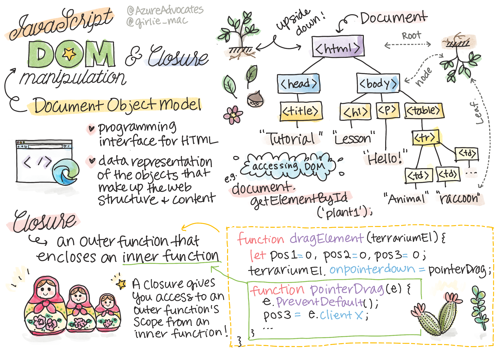

<!--
CO_OP_TRANSLATOR_METADATA:
{
  "original_hash": "30f8903a1f290e3d438dc2c70fe60259",
  "translation_date": "2025-08-24T12:05:17+00:00",
  "source_file": "3-terrarium/3-intro-to-DOM-and-closures/README.md",
  "language_code": "pl"
}
-->
# Projekt Terrarium Część 3: Manipulacja DOM i Domknięcie


> Sketchnote autorstwa [Tomomi Imura](https://twitter.com/girlie_mac)

## Quiz przed wykładem

[Quiz przed wykładem](https://ashy-river-0debb7803.1.azurestaticapps.net/quiz/19)

### Wprowadzenie

Manipulacja DOM, czyli "Document Object Model", to kluczowy aspekt tworzenia stron internetowych. Według [MDN](https://developer.mozilla.org/docs/Web/API/Document_Object_Model/Introduction), "Document Object Model (DOM) to reprezentacja danych obiektów, które tworzą strukturę i treść dokumentu w sieci." Wyzwania związane z manipulacją DOM w sieci często były powodem korzystania z frameworków JavaScript zamiast czystego JavaScriptu do zarządzania DOM, ale my poradzimy sobie sami!

Dodatkowo, w tej lekcji wprowadzimy pojęcie [domknięcia w JavaScript](https://developer.mozilla.org/docs/Web/JavaScript/Closures), które można sobie wyobrazić jako funkcję zamkniętą w innej funkcji, dzięki czemu funkcja wewnętrzna ma dostęp do zakresu funkcji zewnętrznej.

> Domknięcia w JavaScript to obszerny i złożony temat. W tej lekcji poruszymy najbardziej podstawową ideę, że w kodzie tego terrarium znajdziesz domknięcie: funkcję wewnętrzną i funkcję zewnętrzną skonstruowane w taki sposób, aby funkcja wewnętrzna miała dostęp do zakresu funkcji zewnętrznej. Aby dowiedzieć się więcej o tym, jak to działa, odwiedź [obszerną dokumentację](https://developer.mozilla.org/docs/Web/JavaScript/Closures).

Użyjemy domknięcia do manipulacji DOM.

Pomyśl o DOM jako o drzewie, które reprezentuje wszystkie sposoby, w jakie dokument strony internetowej może być manipulowany. Różne API (Application Program Interfaces) zostały stworzone, aby programiści, używając swojego ulubionego języka programowania, mogli uzyskać dostęp do DOM i edytować, zmieniać, przestawiać i w inny sposób nim zarządzać.


> Reprezentacja DOM i odpowiadającego mu kodu HTML. Źródło: [Olfa Nasraoui](https://www.researchgate.net/publication/221417012_Profile-Based_Focused_Crawler_for_Social_Media-Sharing_Websites)

W tej lekcji ukończymy nasz interaktywny projekt terrarium, tworząc kod JavaScript, który pozwoli użytkownikowi manipulować roślinami na stronie.

### Wymagania wstępne

Powinieneś mieć już gotowy kod HTML i CSS dla swojego terrarium. Po zakończeniu tej lekcji będziesz mógł przenosić rośliny do i z terrarium, przeciągając je.

### Zadanie

W folderze terrarium utwórz nowy plik o nazwie `script.js`. Zaimportuj ten plik w sekcji `<head>`:

```html
	<script src="./script.js" defer></script>
```

> Uwaga: użyj `defer`, importując zewnętrzny plik JavaScript do pliku HTML, aby umożliwić wykonanie JavaScriptu dopiero po pełnym załadowaniu pliku HTML. Możesz również użyć atrybutu `async`, który pozwala na wykonanie skryptu podczas parsowania pliku HTML, ale w naszym przypadku ważne jest, aby elementy HTML były w pełni dostępne do przeciągania przed uruchomieniem skryptu przeciągania.
---

## Elementy DOM

Pierwszą rzeczą, którą musisz zrobić, jest utworzenie referencji do elementów, które chcesz manipulować w DOM. W naszym przypadku są to 14 roślin obecnie czekających w paskach bocznych.

### Zadanie

```html
dragElement(document.getElementById('plant1'));
dragElement(document.getElementById('plant2'));
dragElement(document.getElementById('plant3'));
dragElement(document.getElementById('plant4'));
dragElement(document.getElementById('plant5'));
dragElement(document.getElementById('plant6'));
dragElement(document.getElementById('plant7'));
dragElement(document.getElementById('plant8'));
dragElement(document.getElementById('plant9'));
dragElement(document.getElementById('plant10'));
dragElement(document.getElementById('plant11'));
dragElement(document.getElementById('plant12'));
dragElement(document.getElementById('plant13'));
dragElement(document.getElementById('plant14'));
```

Co tu się dzieje? Odwołujesz się do dokumentu i przeszukujesz jego DOM, aby znaleźć element o określonym Id. Pamiętasz, że w pierwszej lekcji o HTML nadałeś indywidualne Id każdemu obrazowi rośliny (`id="plant1"`)? Teraz wykorzystasz ten wysiłek. Po zidentyfikowaniu każdego elementu przekazujesz ten element do funkcji o nazwie `dragElement`, którą za chwilę stworzysz. W ten sposób element w HTML staje się gotowy do przeciągania lub wkrótce będzie.

✅ Dlaczego odwołujemy się do elementów za pomocą Id? Dlaczego nie za pomocą ich klasy CSS? Możesz wrócić do poprzedniej lekcji o CSS, aby odpowiedzieć na to pytanie.

---

## Domknięcie

Teraz jesteś gotowy, aby utworzyć domknięcie `dragElement`, które jest funkcją zewnętrzną otaczającą funkcję lub funkcje wewnętrzne (w naszym przypadku będą trzy).

Domknięcia są przydatne, gdy jedna lub więcej funkcji musi mieć dostęp do zakresu funkcji zewnętrznej. Oto przykład:

```javascript
function displayCandy(){
	let candy = ['jellybeans'];
	function addCandy(candyType) {
		candy.push(candyType)
	}
	addCandy('gumdrops');
}
displayCandy();
console.log(candy)
```

W tym przykładzie funkcja `displayCandy` otacza funkcję, która dodaje nowy typ cukierka do tablicy, która już istnieje w funkcji. Jeśli uruchomisz ten kod, tablica `candy` będzie niezdefiniowana, ponieważ jest zmienną lokalną (lokalną dla domknięcia).

✅ Jak możesz sprawić, aby tablica `candy` była dostępna? Spróbuj przenieść ją poza domknięcie. W ten sposób tablica stanie się globalna, zamiast pozostawać dostępna tylko w lokalnym zakresie domknięcia.

### Zadanie

Pod deklaracjami elementów w `script.js` utwórz funkcję:

```javascript
function dragElement(terrariumElement) {
	//set 4 positions for positioning on the screen
	let pos1 = 0,
		pos2 = 0,
		pos3 = 0,
		pos4 = 0;
	terrariumElement.onpointerdown = pointerDrag;
}
```

`dragElement` pobiera swój obiekt `terrariumElement` z deklaracji na początku skryptu. Następnie ustawiasz kilka lokalnych pozycji na `0` dla obiektu przekazanego do funkcji. Są to zmienne lokalne, które będą manipulowane dla każdego elementu, gdy dodasz funkcjonalność przeciągania i upuszczania w ramach domknięcia do każdego elementu. Terrarium zostanie wypełnione tymi przeciąganymi elementami, więc aplikacja musi śledzić, gdzie są one umieszczane.

Dodatkowo, element `terrariumElement`, który jest przekazywany do tej funkcji, jest przypisany do zdarzenia `pointerdown`, które jest częścią [web APIs](https://developer.mozilla.org/docs/Web/API) zaprojektowanych do zarządzania DOM. `onpointerdown` uruchamia się, gdy przycisk jest wciśnięty lub, w naszym przypadku, gdy dotknięty zostanie element do przeciągania. Ten obsługiwacz zdarzeń działa zarówno w [przeglądarkach internetowych, jak i mobilnych](https://caniuse.com/?search=onpointerdown), z kilkoma wyjątkami.

✅ [Obsługiwacz zdarzeń `onclick`](https://developer.mozilla.org/docs/Web/API/GlobalEventHandlers/onclick) ma znacznie większe wsparcie w różnych przeglądarkach; dlaczego nie użyć go tutaj? Pomyśl o dokładnym typie interakcji ekranowej, którą próbujesz stworzyć.

---

## Funkcja Pointerdrag

Element `terrariumElement` jest gotowy do przeciągania; gdy zdarzenie `onpointerdown` zostanie uruchomione, wywoływana jest funkcja `pointerDrag`. Dodaj tę funkcję zaraz pod tą linią: `terrariumElement.onpointerdown = pointerDrag;`:

### Zadanie 

```javascript
function pointerDrag(e) {
	e.preventDefault();
	console.log(e);
	pos3 = e.clientX;
	pos4 = e.clientY;
}
```

Dzieje się tu kilka rzeczy. Po pierwsze, zapobiegasz domyślnym zdarzeniom, które normalnie występują przy `pointerdown`, używając `e.preventDefault();`. Dzięki temu masz większą kontrolę nad zachowaniem interfejsu.

> Wróć do tej linii, gdy całkowicie zbudujesz plik skryptu i spróbuj bez `e.preventDefault()` - co się stanie?

Po drugie, otwórz `index.html` w oknie przeglądarki i sprawdź interfejs. Gdy klikniesz roślinę, możesz zobaczyć, jak zdarzenie 'e' jest przechwytywane. Zbadaj zdarzenie, aby zobaczyć, ile informacji jest zbieranych przez jedno zdarzenie pointerdown!  

Następnie zauważ, jak lokalne zmienne `pos3` i `pos4` są ustawiane na e.clientX. Możesz znaleźć wartości `e` w panelu inspekcji. Te wartości przechwytują współrzędne x i y rośliny w momencie, gdy ją klikniesz lub dotkniesz. Będziesz potrzebować precyzyjnej kontroli nad zachowaniem roślin podczas ich przeciągania, więc śledzisz ich współrzędne.

✅ Czy staje się bardziej jasne, dlaczego cała ta aplikacja jest zbudowana jako jedno duże domknięcie? Gdyby tak nie było, jak utrzymałbyś zakres dla każdej z 14 przeciąganych roślin?

Uzupełnij początkową funkcję, dodając jeszcze dwie manipulacje zdarzeniami wskaźnika pod `pos4 = e.clientY`:

```html
document.onpointermove = elementDrag;
document.onpointerup = stopElementDrag;
```
Teraz wskazujesz, że chcesz, aby roślina była przeciągana razem ze wskaźnikiem, gdy go przesuwasz, oraz aby gest przeciągania zakończył się, gdy odznaczysz roślinę. `onpointermove` i `onpointerup` są częścią tego samego API co `onpointerdown`. Interfejs będzie teraz wyrzucał błędy, ponieważ nie zdefiniowałeś jeszcze funkcji `elementDrag` i `stopElementDrag`, więc zbuduj je teraz.

## Funkcje elementDrag i stopElementDrag

Uzupełnisz swoje domknięcie, dodając dwie kolejne funkcje wewnętrzne, które będą obsługiwać to, co dzieje się, gdy przeciągasz roślinę i przestajesz ją przeciągać. Chcesz, aby zachowanie było takie, że możesz przeciągać dowolną roślinę w dowolnym momencie i umieszczać ją w dowolnym miejscu na ekranie. Ten interfejs jest dość elastyczny (nie ma na przykład strefy upuszczania), aby umożliwić Ci zaprojektowanie swojego terrarium dokładnie tak, jak chcesz, dodając, usuwając i zmieniając położenie roślin.

### Zadanie

Dodaj funkcję `elementDrag` zaraz po zamykającym nawiasie klamrowym `pointerDrag`:

```javascript
function elementDrag(e) {
	pos1 = pos3 - e.clientX;
	pos2 = pos4 - e.clientY;
	pos3 = e.clientX;
	pos4 = e.clientY;
	console.log(pos1, pos2, pos3, pos4);
	terrariumElement.style.top = terrariumElement.offsetTop - pos2 + 'px';
	terrariumElement.style.left = terrariumElement.offsetLeft - pos1 + 'px';
}
```
W tej funkcji dokonujesz wielu edycji początkowych pozycji 1-4, które ustawiłeś jako zmienne lokalne w funkcji zewnętrznej. Co tu się dzieje?

Podczas przeciągania ponownie przypisujesz `pos1`, ustawiając go jako równy `pos3` (który wcześniej ustawiłeś jako `e.clientX`) minus bieżąca wartość `e.clientX`. Podobną operację wykonujesz dla `pos2`. Następnie resetujesz `pos3` i `pos4` do nowych współrzędnych X i Y elementu. Możesz obserwować te zmiany w konsoli podczas przeciągania. Następnie manipulujesz stylem CSS rośliny, aby ustawić jej nową pozycję na podstawie nowych pozycji `pos1` i `pos2`, obliczając współrzędne X i Y rośliny na podstawie porównania jej przesunięcia z tymi nowymi pozycjami.

> `offsetTop` i `offsetLeft` to właściwości CSS, które ustawiają pozycję elementu na podstawie jego rodzica; rodzicem może być dowolny element, który nie jest ustawiony jako `static`. 

Całe to przeliczanie pozycji pozwala na precyzyjne dostosowanie zachowania terrarium i jego roślin.

### Zadanie 

Ostatnim zadaniem, aby ukończyć interfejs, jest dodanie funkcji `stopElementDrag` po zamykającym nawiasie klamrowym `elementDrag`:

```javascript
function stopElementDrag() {
	document.onpointerup = null;
	document.onpointermove = null;
}
```

Ta mała funkcja resetuje zdarzenia `onpointerup` i `onpointermove`, abyś mógł albo wznowić przeciąganie rośliny, zaczynając od nowa, albo zacząć przeciągać nową roślinę.

✅ Co się stanie, jeśli nie ustawisz tych zdarzeń na null?

Teraz ukończyłeś swój projekt!

🥇Gratulacje! Ukończyłeś swoje piękne terrarium. 

---

## 🚀Wyzwanie

Dodaj nowy obsługiwacz zdarzeń do swojego domknięcia, aby zrobić coś więcej z roślinami; na przykład, podwójne kliknięcie rośliny, aby przenieść ją na przód. Bądź kreatywny!

## Quiz po wykładzie

[Quiz po wykładzie](https://ashy-river-0debb7803.1.azurestaticapps.net/quiz/20)

## Przegląd i samodzielna nauka

Chociaż przeciąganie elementów po ekranie wydaje się trywialne, istnieje wiele sposobów na to i wiele pułapek, w zależności od efektu, który chcesz osiągnąć. W rzeczywistości istnieje całe [API przeciągania i upuszczania](https://developer.mozilla.org/docs/Web/API/HTML_Drag_and_Drop_API), które możesz wypróbować. Nie użyliśmy go w tym module, ponieważ efekt, który chcieliśmy osiągnąć, był nieco inny, ale spróbuj tego API w swoim własnym projekcie i zobacz, co możesz osiągnąć.

Znajdź więcej informacji o zdarzeniach wskaźnika w [dokumentacji W3C](https://www.w3.org/TR/pointerevents1/) oraz w [dokumentacji MDN](https://developer.mozilla.org/docs/Web/API/Pointer_events).

Zawsze sprawdzaj możliwości przeglądarek, korzystając z [CanIUse.com](https://caniuse.com/).

## Zadanie

[Pracuj trochę więcej z DOM](assignment.md)

**Zastrzeżenie**:  
Ten dokument został przetłumaczony za pomocą usługi tłumaczenia AI [Co-op Translator](https://github.com/Azure/co-op-translator). Chociaż staramy się zapewnić dokładność, prosimy mieć na uwadze, że automatyczne tłumaczenia mogą zawierać błędy lub nieścisłości. Oryginalny dokument w jego rodzimym języku powinien być uznawany za wiarygodne źródło. W przypadku informacji krytycznych zaleca się skorzystanie z profesjonalnego tłumaczenia przez człowieka. Nie ponosimy odpowiedzialności za jakiekolwiek nieporozumienia lub błędne interpretacje wynikające z użycia tego tłumaczenia.