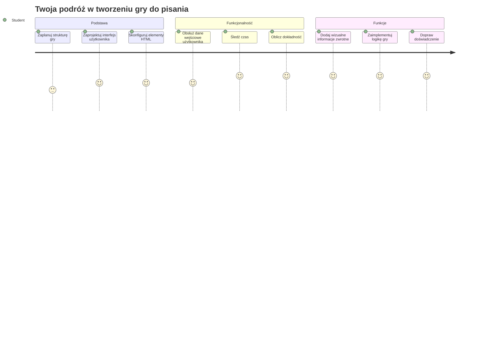
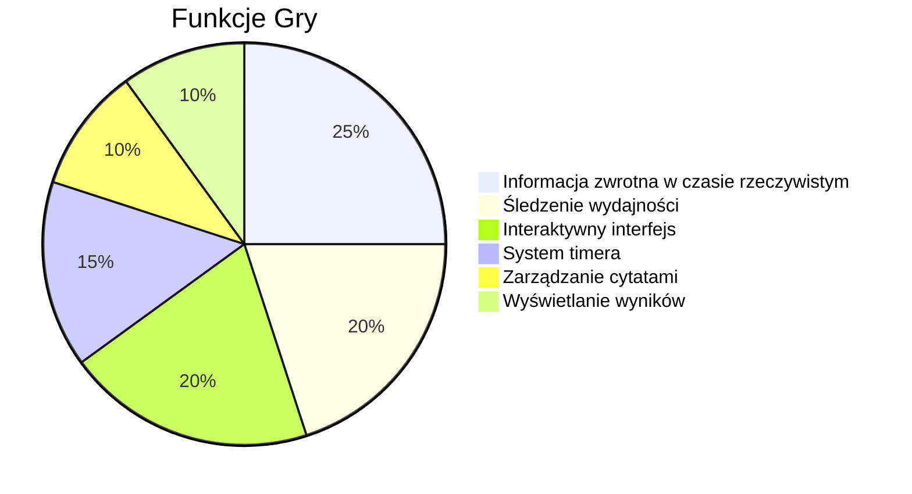
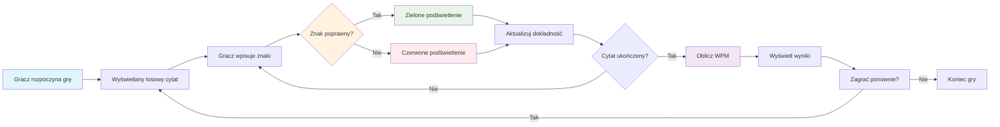
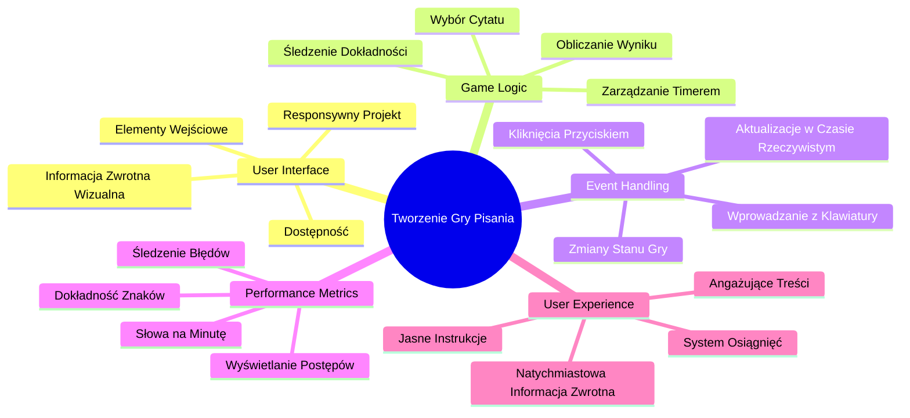
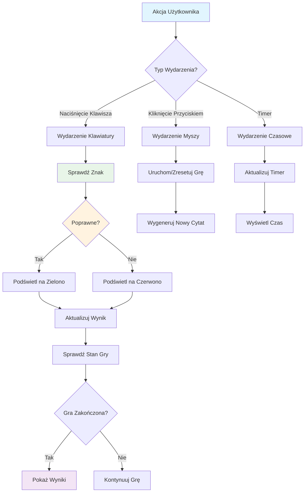
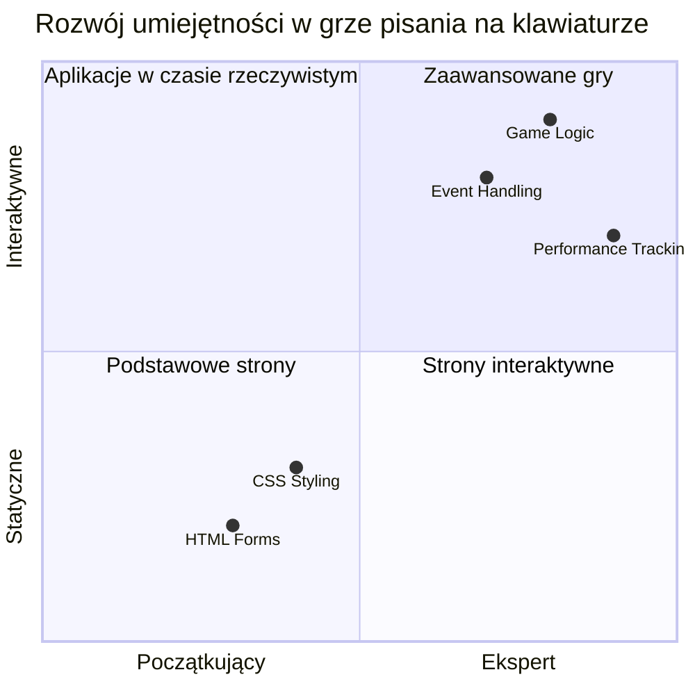
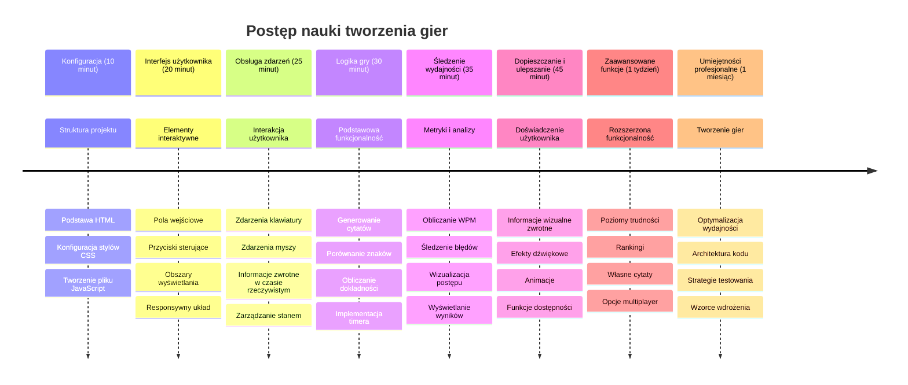

# Programowanie sterowane zdarzeniami - Stwórz grę w pisanie

## Wprowadzenie

Oto coś, co każdy programista zna, ale rzadko o tym mówi: szybkie pisanie to supermoc! 🚀 Pomyśl o tym — im szybciej potrafisz przenieść swoje pomysły z głowy do edytora kodu, tym bardziej twoja kreatywność może płynąć. To jak bezpośrednia rura między twoimi myślami a ekranem.

Chcesz poznać jeden z najlepszych sposobów na podniesienie tej umiejętności? Zgadłeś — zbudujemy grę!

> Stwórzmy razem niesamowitą grę w pisanie!

Gotowy, by wykorzystać wszystkie swoje umiejętności z JavaScriptu, HTML i CSS, których się uczyłeś? Zbudujemy grę w pisanie, która rzuci ci wyzwanie losowymi cytatami legendarnego detektywa [Sherlocka Holmesa](https://en.wikipedia.org/wiki/Sherlock_Holmes). Gra będzie śledzić, jak szybko i dokładnie potrafisz pisać — i uwierz mi, to bardziej uzależnia niż myślisz!

## Co musisz wiedzieć

Zanim zaczniemy, upewnij się, że czujesz się pewnie z tymi koncepcjami (nie martw się, jeśli potrzebujesz szybkiego przypomnienia — wszyscy tak mamy!):

- Tworzenie kontrolek tekstowych i przycisków
- CSS i ustawianie styli za pomocą klas  
- Podstawy JavaScriptu
  - Tworzenie tablicy
  - Generowanie losowej liczby
  - Pobieranie aktualnego czasu

Jeśli któryś z tych tematów wydaje się trochę zardzewiały, to całkowicie w porządku! Czasem najlepszym sposobem na utrwalenie wiedzy jest zanurzenie się w projekt i odkrywanie rzeczy na bieżąco.

### 🔄 **Sprawdzenie pedagogiczne**
**Ocena podstaw**: Przed rozpoczęciem pracy upewnij się, że rozumiesz:
- ✅ Jak działają formularze HTML i elementy wejściowe
- ✅ Klasy CSS i dynamiczne stylizowanie
- ✅ Nasłuchiwacze zdarzeń i obsługiwacze w JavaScript
- ✅ Operacje na tablicach i wybór losowy
- ✅ Pomiar czasu i obliczenia

**Szybki test własny**: Czy potrafisz wyjaśnić, jak te koncepcje działają razem w interaktywnej grze?
- **Zdarzenia** wywołują się, gdy użytkownicy wchodzą w interakcje z elementami
- **Obsługiwacze** przetwarzają te zdarzenia i aktualizują stan gry
- **CSS** zapewnia wizualną informację zwrotną dla działań użytkownika
- **Synchronizacja czasu** umożliwia pomiar wyników i postęp w grze

## Zbudujmy to!

[Tworzenie gry w pisanie przy użyciu programowania sterowanego zdarzeniami](./typing-game/README.md)

### ⚡ **Co możesz zrobić w ciągu następnych 5 minut**
- [ ] Otwórz konsolę przeglądarki i spróbuj nasłuchiwać zdarzeń klawiatury za pomocą `addEventListener`
- [ ] Stwórz prostą stronę HTML z polem wejściowym i przetestuj wykrywanie pisania
- [ ] Ćwicz operacje na łańcuchach, porównując wpisywany tekst z tekstem docelowym
- [ ] Eksperymentuj z `setTimeout`, aby zrozumieć funkcje czasowe

### 🎯 **Co możesz osiągnąć w ciągu godziny**
- [ ] Wykonaj quiz po lekcji i zrozum programowanie sterowane zdarzeniami
- [ ] Zbuduj podstawową wersję gry w pisanie z walidacją słów
- [ ] Dodaj wizualną informację zwrotną dla prawidłowego i błędnego pisania
- [ ] Wdróż prosty system punktacji oparty na szybkości i dokładności
- [ ] Ostyluj swoją grę za pomocą CSS, aby była atrakcyjna wizualnie

### 📅 **Twój tygodniowy rozwój gry**
- [ ] Ukończ pełną wersję gry w pisanie ze wszystkimi funkcjami i dopracowaniem
- [ ] Dodaj poziomy trudności z różną złożonością słów
- [ ] Wdróż śledzenie statystyk użytkownika (WPM, dokładność w czasie)
- [ ] Stwórz efekty dźwiękowe i animacje dla lepszego doświadczenia użytkownika
- [ ] Spraw, aby twoja gra była responsywna na urządzenia mobilne z ekranem dotykowym
- [ ] Udostępnij swoją grę online i zbieraj opinie od użytkowników

### 🌟 **Twój miesięczny interaktywny rozwój**
- [ ] Stwórz wiele gier eksplorujących różne wzorce interakcji
- [ ] Poznaj pętle gry, zarządzanie stanem i optymalizację wydajności
- [ ] Współpracuj przy projektach open source związanych z tworzeniem gier
- [ ] Opanuj zaawansowane koncepcje synchronizacji czasu i płynnych animacji
- [ ] Stwórz portfolio prezentujące różne aplikacje interaktywne
- [ ] Mentoruj innych zainteresowanych tworzeniem gier i interakcją użytkownika

## 🎯 Twoja oś czasu mistrzostwa w grze w pisanie

### 🛠️ Podsumowanie zestawu narzędzi do tworzenia Twojej gry

Po ukończeniu tego projektu opanujesz:
- **Programowanie sterowane zdarzeniami**: Responsywne interfejsy użytkownika reagujące na wejścia
- **Informację zwrotną w czasie rzeczywistym**: Natychmiastowe aktualizacje wizualne i wyników
- **Pomiar wydajności**: Dokładne systemy pomiaru czasu i punktacji
- **Zarządzanie stanem gry**: Kontrolowanie przepływu aplikacji i doświadczenia użytkownika
- **Projektowanie interaktywne**: Tworzenie angażujących, uzależniających doświadczeń użytkownika
- **Nowoczesne Web API**: Wykorzystywanie możliwości przeglądarki do bogatych interakcji
- **Wzorce dostępności**: Projektowanie dostępne dla wszystkich użytkowników

**Zastosowania w praktyce**: Te umiejętności mają bezpośrednie zastosowanie w:
- **Aplikacjach sieciowych**: Każdy interaktywny interfejs lub panel kontrolny
- **Oprogramowaniu edukacyjnym**: Platformy do nauki i narzędzia oceny umiejętności
- **Narzędziach produktywności**: Edytory tekstu, IDE i oprogramowanie do współpracy
- **Przemyśle gier**: Gry przeglądarkowe i rozrywka interaktywna
- **Rozwoju mobilnym**: Interfejsy dotykowe i obsługa gestów

**Kolejny poziom**: Jesteś gotów, aby zgłębić zaawansowane frameworki do gier, systemy multiplayer w czasie rzeczywistym lub złożone aplikacje interaktywne!

## Podziękowania

Napisane z ♥️ przez [Christophera Harrisona](http://www.twitter.com/geektrainer)

---

<!-- CO-OP TRANSLATOR DISCLAIMER START -->
**Zastrzeżenie**:
Niniejszy dokument został przetłumaczony za pomocą usługi tłumaczenia AI [Co-op Translator](https://github.com/Azure/co-op-translator). Chociaż dokładamy starań, aby tłumaczenie było jak najdokładniejsze, prosimy mieć na uwadze, że automatyczne tłumaczenia mogą zawierać błędy lub nieścisłości. Oryginalny dokument w języku źródłowym powinien być uznawany za źródło ostateczne. W przypadku informacji krytycznych zaleca się skorzystanie z profesjonalnego tłumaczenia wykonanego przez człowieka. Nie ponosimy odpowiedzialności za jakiekolwiek nieporozumienia lub błędne interpretacje wynikające z korzystania z tego tłumaczenia.
<!-- CO-OP TRANSLATOR DISCLAIMER END -->