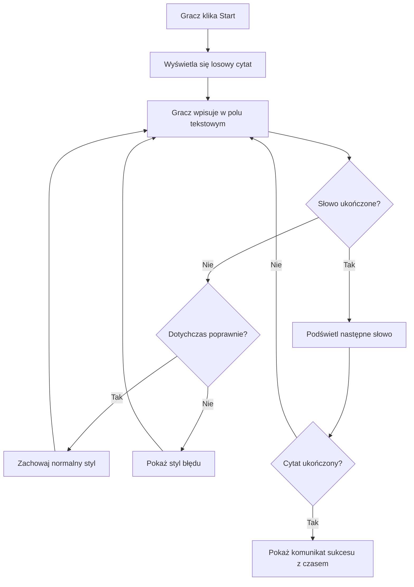
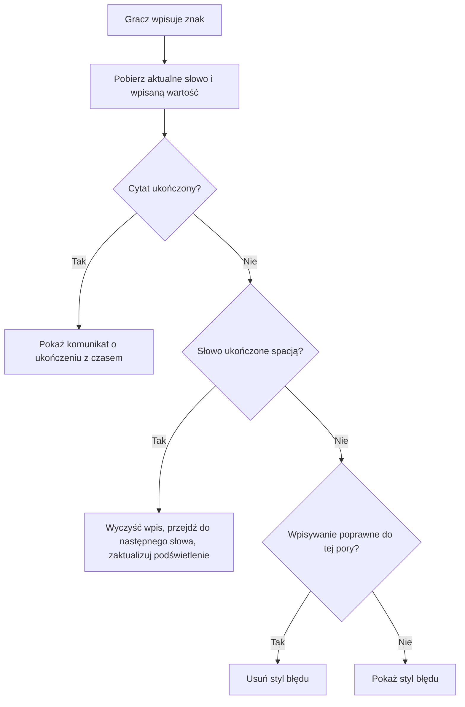
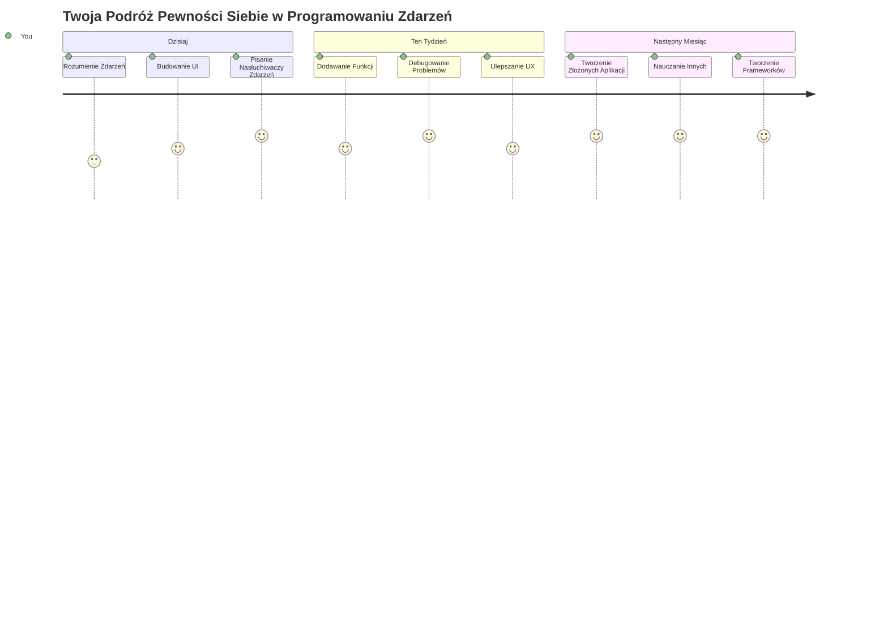

# Tworzenie gry z wykorzystaniem zdarzeń

Czy kiedykolwiek zastanawiałeś się, jak strony internetowe wiedzą, kiedy klikniesz przycisk lub wpisujesz tekst w polu? To magia programowania opartego na zdarzeniach! Jaki lepszy sposób na naukę tej niezbędnej umiejętności niż zbudowanie czegoś pożytecznego – gry na szybkość pisania, która reaguje na każdy naciśnięty klawisz.

Zobaczysz na własne oczy, jak przeglądarki internetowe "komunikują się" z Twoim kodem JavaScript. Za każdym razem, gdy klikniesz, wpiszesz znak lub poruszysz myszką, przeglądarka wysyła małe wiadomości (nazywamy je zdarzeniami) do Twojego kodu, a Ty decydujesz, jak na nie zareagować!

Kiedy tu skończymy, stworzysz prawdziwą grę do pisania, która śledzi Twoją szybkość i dokładność. Co ważniejsze, zrozumiesz podstawowe koncepcje, które napędzają każdą interaktywną stronę internetową, jakiej kiedykolwiek używałeś. Zaczynajmy!

## Quiz przed wykładem

[Quiz przed wykładem](https://ff-quizzes.netlify.app/web/quiz/21)

## Programowanie zdarzeniowe

Pomyśl o swojej ulubionej aplikacji lub stronie – co sprawia, że wydaje się żywa i responsywna? To wszystko zależy od tego, jak reaguje na Twoje działania! Każde stuknięcie, kliknięcie, przesunięcie palcem lub naciśnięcie klawisza tworzy to, co nazywamy „zdarzeniem”, i to właśnie tam dzieje się prawdziwa magia tworzenia stron internetowych.

Oto, co sprawia, że programowanie pod kątem internetu jest tak interesujące: nigdy nie wiemy, kiedy ktoś kliknie ten przycisk lub zacznie pisać w polu tekstowym. Może kliknąć od razu, zaczekać pięć minut, a może nigdy nie kliknąć! Ta nieprzewidywalność oznacza, że musimy myśleć inaczej o tym, jak piszemy kod.

Zamiast pisać kod, który działa od góry do dołu niczym przepis kulinarny, piszemy kod, który cierpliwie czeka na zdarzenie. To podobne do tego, jak w XIX wieku telegrafiści siedzieli przy swoich urządzeniach, gotowi zareagować w chwili nadejścia sygnału.

Czym dokładnie jest „zdarzenie”? To po prostu coś, co się dzieje! Gdy klikniesz przycisk – to zdarzenie. Gdy wpiszesz literę – to zdarzenie. Gdy poruszysz myszką – to kolejne zdarzenie.

Programowanie zdarzeniowe pozwala nam ustawić nasz kod tak, aby nasłuchiwał i reagował. Tworzymy specjalne funkcje nazywane **nasłuchiwaczami zdarzeń**, które cierpliwie czekają na określone zdarzenia, a potem natychmiast przechodzą do akcji.

Pomyśl o nasłuchiwaczach zdarzeń jak o dzwonku do twojego kodu. Ustawiasz dzwonek (`addEventListener()`), określasz, na jaki dźwięk ma reagować (np. 'click' lub 'keypress'), a potem definiujesz, co ma się wydarzyć, gdy ktoś zadzwoni (Twoja niestandardowa funkcja).

**Oto jak działają nasłuchiwacze zdarzeń:**
- **Nasłuchują** określonych działań użytkownika, takich jak kliknięcia, naciśnięcia klawiszy czy ruchy myszki
- **Wykonują** Twój niestandardowy kod, gdy wystąpi określone zdarzenie
- **Reagują** natychmiast na interakcje użytkownika, tworząc płynne doświadczenie
- **Obsługują** wiele zdarzeń na tym samym elemencie za pomocą różnych nasłuchiwaczy

> **UWAGA:** Warto podkreślić, że istnieje wiele sposobów tworzenia nasłuchiwaczy zdarzeń. Można używać funkcji anonimowych lub nazwanych. Można stosować różne skróty, takie jak przypisywanie własności `click`, lub używać `addEventListener()`. W naszym ćwiczeniu skupimy się na `addEventListener()` i funkcjach anonimowych, ponieważ to chyba najpopularniejsza technika używana przez programistów webowych. Jest też najbardziej elastyczna, ponieważ `addEventListener()` działa dla wszystkich zdarzeń, a nazwa zdarzenia może być podana jako parametr.

### Typowe zdarzenia

Chociaż przeglądarki internetowe oferują dziesiątki różnych zdarzeń, na które można nasłuchiwać, większość interaktywnych aplikacji opiera się na zaledwie kilku podstawowych zdarzeniach. Zrozumienie tych kluczowych zdarzeń da Ci fundament do budowania zaawansowanych interakcji użytkownika.

Istnieje [dziesiątki zdarzeń](https://developer.mozilla.org/docs/Web/Events), na które możesz nasłuchiwać podczas tworzenia aplikacji. W zasadzie wszystko, co użytkownik robi na stronie, wywołuje zdarzenie, co daje Ci dużo mocy, aby zapewnić mu doświadczenie, jakiego pragnie. Na szczęście zwykle potrzebujesz tylko niewielkiej liczby zdarzeń. Oto kilka popularnych (w tym dwa, których użyjemy przy tworzeniu naszej gry):

| Zdarzenie | Opis | Typowe zastosowania |
|-----------|------|--------------------|
| `click` | Użytkownik kliknął coś | Przyciski, linki, elementy interaktywne |
| `contextmenu` | Użytkownik kliknął prawym przyciskiem myszy | Niestandardowe menu kontekstowe |
| `select` | Użytkownik zaznaczył fragment tekstu | Edycja tekstu, operacje kopiowania |
| `input` | Użytkownik wpisał tekst | Walidacja formularzy, wyszukiwanie w czasie rzeczywistym |

**Zrozumienie tych typów zdarzeń:**
- **Wywoływane** gdy użytkownicy wchodzą w interakcję z określonymi elementami na stronie
- **Dostarczają** szczegółowych informacji o działaniu użytkownika przez obiekty zdarzeń
- **Umożliwiają** tworzenie responsywnych, interaktywnych aplikacji webowych
- **Działają** spójnie na różnych przeglądarkach i urządzeniach

## Tworzenie gry

Teraz, gdy rozumiesz, jak działają zdarzenia, zastosujmy tę wiedzę w praktyce, budując coś użytecznego. Stworzymy grę na szybkość pisania, która pokaże obsługę zdarzeń i pomoże Ci rozwinąć ważną umiejętność programisty.

Stworzymy grę, aby zbadać, jak działają zdarzenia w JavaScript. Nasza gra przetestuje umiejętność pisania gracza, która jest jedną z najbardziej niedocenianych umiejętności, jaką powinni posiadać wszyscy programiści. Ciekawostka: układ klawiatury QWERTY, którego używamy dzisiaj, został zaprojektowany w latach 70. XIX wieku dla maszyn do pisania – a dobre umiejętności pisania na klawiaturze są nadal tak samo cenne dla programistów! Ogólny przebieg gry będzie wyglądać tak:


**Oto jak będzie działała nasza gra:**
- **Zaczyna się** gdy gracz kliknie przycisk start i wyświetli się losowy cytat
- **Śledzi** postępy gracza w pisaniu słowo po słowie w czasie rzeczywistym
- **Podświetla** aktualne słowo, aby skupić uwagę gracza
- **Daje** natychmiastową wizualną informację o błędach w pisaniu
- **Oblicza** i wyświetla całkowity czas po ukończeniu cytatu

Zbudujmy naszą grę i poznajmy zdarzenia!

### Struktura plików

Zanim zaczniemy kodować, uporządkujmy wszystko! Posiadanie czystej struktury plików od początku zaoszczędzi Ci bólu głowy później i sprawi, że Twój projekt będzie bardziej profesjonalny. 😊

Zachowamy prostotę, używając trzech plików: `index.html` dla struktury strony, `script.js` dla całej logiki gry oraz `style.css`, aby wszystko dobrze wyglądało. To klasyczne trio, które napędza większość internetu!

**Utwórz nowy folder na swoje pliki, otwierając konsolę lub terminal i wpisując następujące polecenie:**

```bash
# Linux lub macOS
mkdir typing-game && cd typing-game

# Windows
md typing-game && cd typing-game
```

**Oto, co robią te polecenia:**
- **Tworzy** nowy katalog o nazwie `typing-game` na pliki projektu
- **Przechodzi** automatycznie do nowo utworzonego katalogu
- **Ustawia** czyste środowisko pracy do tworzenia gry

**Otwórz Visual Studio Code:**

```bash
code .
```

**To polecenie:**
- **Uruchamia** Visual Studio Code w bieżącym katalogu
- **Otwiera** folder projektu w edytorze
- **Zapewnia** dostęp do wszystkich potrzebnych narzędzi programistycznych

**Dodaj trzy pliki do folderu w Visual Studio Code o następujących nazwach:**
- `index.html` - zawiera strukturę i zawartość gry
- `script.js` - obsługuje całą logikę gry i nasłuchiwacze zdarzeń
- `style.css` - definiuje wygląd wizualny i stylizację

## Tworzenie interfejsu użytkownika

Zbudujmy teraz scenę, na której odbędzie się cała akcja gry! Pomyśl o tym jak o zaprojektowaniu panelu sterowania statku kosmicznego – musimy mieć pewność, że wszystko, czego potrzebują gracze, jest dokładnie tam, gdzie się tego spodziewają.

Zastanówmy się, czego faktycznie potrzebuje nasza gra. Gdybyś grał w grę na pisanie, co chciałbyś widzieć na ekranie? Oto, czego będziemy potrzebować:

| Element UI | Cel | Element HTML |
|------------|-----|--------------|
| Wyświetlanie cytatu | Pokazuje tekst do napisania | `<p>` z `id="quote"` |
| Obszar wiadomości | Wyświetla status i komunikaty o powodzeniu | `<p>` z `id="message"` |
| Pole tekstowe | Tam, gdzie gracz wpisuje cytat | `<input>` z `id="typed-value"` |
| Przyciski start | Rozpoczyna grę | `<button>` z `id="start"` |

**Zrozumienie struktury UI:**
- **Organizuje** zawartość logicznie od góry do dołu
- **Przypisuje** unikalne ID elementom do celów JavaScript
- **Zapewnia** wyraźną hierarchię wizualną dla lepszego doświadczenia użytkownika
- **Zawiera** semantyczne elementy HTML dla dostępności

Każdemu z tych elementów przypiszemy identyfikatory, aby móc je obsługiwać w JavaScript. Dodamy też odniesienia do plików CSS i JavaScript, które zamierzamy stworzyć.

Utwórz nowy plik o nazwie `index.html`. Dodaj następujący kod HTML:

```html
<!-- inside index.html -->
<html>
<head>
  <title>Typing game</title>
  <link rel="stylesheet" href="style.css">
</head>
<body>
  <h1>Typing game!</h1>
  <p>Practice your typing skills with a quote from Sherlock Holmes. Click **start** to begin!</p>
  <p id="quote"></p> <!-- This will display our quote -->
  <p id="message"></p> <!-- This will display any status messages -->
  <div>
    <input type="text" aria-label="current word" id="typed-value" /> <!-- The textbox for typing -->
    <button type="button" id="start">Start</button> <!-- To start the game -->
  </div>
  <script src="script.js"></script>
</body>
</html>
```

**Co osiąga ta struktura HTML:**
- **Łączy** arkusz stylów CSS w sekcji `<head>` dla stylizacji
- **Tworzy** wyraźny nagłówek i instrukcje dla użytkowników
- **Ustanawia** akapity zastępcze z określonymi ID dla dynamicznej zawartości
- **Zawiera** pole input z atrybutami ułatwiającymi dostępność
- **Dodaje** przycisk start, który uruchomi grę
- **Ładuje** plik JavaScript na końcu w celu optymalnej wydajności

### Uruchomienie aplikacji

Częste testowanie aplikacji podczas tworzenia pomaga wykryć problemy wcześnie i zobaczyć postępy w czasie rzeczywistym. Live Server to nieocenione narzędzie, które automatycznie odświeża przeglądarkę przy każdej zapisanej zmianie, co znacznie usprawnia rozwój.

Zawsze najlepiej rozwijać aplikację iteracyjnie, aby obserwować efekt. Uruchommy naszą aplikację. Istnieje świetne rozszerzenie do Visual Studio Code o nazwie [Live Server](https://marketplace.visualstudio.com/items?itemName=ritwickdey.LiveServer&WT.mc_id=academic-77807-sagibbon), które hostuje Twoją aplikację lokalnie i odświeża przeglądarkę przy każdej zapisanej zmianie.

**Zainstaluj [Live Server](https://marketplace.visualstudio.com/items?itemName=ritwickdey.LiveServer&WT.mc_id=academic-77807-sagibbon) klikając link i przycisk Install:**

**Oto, co się stanie podczas instalacji:**
- **Przekierowuje** Twoją przeglądarkę do Visual Studio Code
- **Przeprowadza** Cię przez proces instalacji rozszerzenia
- **Może wymagać** ponownego uruchomienia Visual Studio Code, by zakończyć konfigurację

**Po instalacji, w Visual Studio Code naciśnij Ctrl-Shift-P (lub Cmd-Shift-P), aby otworzyć paletę poleceń:**

**Co daje paleta poleceń:**
- **Zapewnia** szybki dostęp do wszystkich komend VS Code
- **Wyszukuje** polecenia podczas wpisywania
- **Oferuje** skróty klawiszowe przyspieszające pracę

**Wpisz "Live Server: Open with Live Server":**

**Co robi Live Server:**
- **Uruchamia** lokalny serwer deweloperski dla Twojego projektu
- **Automatycznie** odświeża przeglądarkę po zapisaniu plików
- **Serwuje** pliki z lokalnego adresu URL (zazwyczaj `localhost:5500`)

**Otwórz przeglądarkę i przejdź do `https://localhost:5500`:**

Powinieneś teraz zobaczyć utworzoną przez siebie stronę! Dodajmy teraz trochę funkcjonalności.

## Dodaj CSS

Zadbajmy teraz o ładny wygląd! Wizualna informacja zwrotna jest kluczowa dla interfejsów użytkownika od wczesnych lat informatyki. W latach 80. badacze odkryli, że natychmiastowa informacja wizualna dramatycznie poprawia wydajność użytkownika i zmniejsza liczbę błędów. Dokładnie to stworzymy.

Nasza gra musi jasno przekazywać, co się dzieje. Gracze powinni od razu wiedzieć, które słowo mają teraz pisać, a jeśli popełnią błąd, powinni go natychmiast zauważyć. Stwórzmy prostą, ale skuteczną stylizację:

Utwórz nowy plik o nazwie `style.css` i dodaj do niego poniższy kod.

```css
/* inside style.css */
.highlight {
  background-color: yellow;
}

.error {
  background-color: lightcoral;
  border: red;
}
```

**Co oznaczają te klasy CSS:**
- **Podświetla** aktualne słowo na żółto, zapewniając czytelną wskazówkę wizualną
- **Sygnalizuje** błędy w pisaniu za pomocą jasnoczerwonego tła
- **Daje** natychmiastową informację zwrotną, nie zakłócając rytmu pisania
- **Używa** kontrastujących kolorów dla dostępności i jasnej komunikacji

✅ Jeśli chodzi o CSS, możesz ułożyć stronę według własnego uznania. Poświęć trochę czasu, aby uczynić ją bardziej atrakcyjną:

- Wybierz inną czcionkę
- Pokoloruj nagłówki
- Zmień rozmiary elementów

## JavaScript

Tu robi się ciekawie! 🎉 Mamy już strukturę HTML i stylizację CSS, ale nasza gra to teraz jak piękny samochód bez silnika. JavaScript będzie właśnie tym silnikiem – to on sprawi, że wszystko będzie działać i reagować na to, co robią gracze.

Nasz projekt ożyje na Twoich oczach. Podejdziemy do tego krok po kroku, aby nic Cię nie przytłoczyło:

| Krok | Cel | Czego się nauczysz |
|------|-----|--------------------|
| [Dodaj stałe](../../../../4-typing-game/typing-game) | Ustaw cytaty i odwołania do DOM | Zarządzanie zmiennymi i wybór elementów DOM |
| [Nasłuchiwacz startu gry](../../../../4-typing-game/typing-game) | Obsługa inicjalizacji gry | Obsługa zdarzeń i aktualizacje UI |
| [Nasłuchiwacz pisania](../../../../4-typing-game/typing-game) | Przetwarzanie wpisu użytkownika w czasie rzeczywistym | Walidacja wpisu i dynamiczna informacja zwrotna |

**Takie podejście pomaga:**
- **Organizować** kod w logiczne, łatwe do zarządzania sekcje
- **Budować** funkcjonalność stopniowo dla łatwiejszego debugowania
- **Zrozumieć** jak różne części aplikacji współpracują ze sobą
- **Tworzyć** wzorce do ponownego wykorzystania w przyszłych projektach

Najpierw jednak utwórz nowy plik o nazwie `script.js`.

### Dodaj stałe

Zanim przejdziemy do działania, zgromadźmy wszystkie nasze zasoby! Podobnie jak kontrola misji NASA ustawia swoje systemy monitorujące przed startem, łatwiej jest, gdy wszystko jest przygotowane i gotowe. To oszczędza nam późniejszego szukania rzeczy i zapobiega literówkom.

Oto, co musimy najpierw ustawić:

| Typ danych | Cel | Przykład |
| Tablica cytatów | Przechowuje wszystkie możliwe cytaty do gry | `['Cytat 1', 'Cytat 2', ...]` |
| Tablica słów | Dzieli aktualny cytat na pojedyncze słowa | `['Kiedy', 'masz', ...]` |
| Indeks słowa | Śledzi, które słowo gracz aktualnie wpisuje | `0, 1, 2, 3...` |
| Czas startu | Oblicza upływ czasu do punktacji | `Date.now()` |

**Potrzebujemy także referencji do naszych elementów UI:**
| Element | ID | Przeznaczenie |
|---------|----|--------------|
| Pole tekstowe | `typed-value` | Miejsce, gdzie gracze wpisują tekst |
| Wyświetlacz cytatu | `quote` | Pokazuje cytat do wpisania |
| Obszar wiadomości | `message` | Wyświetla aktualizacje statusu |

```javascript
// w pliku script.js
// wszystkie nasze cytaty
const quotes = [
    'When you have eliminated the impossible, whatever remains, however improbable, must be the truth.',
    'There is nothing more deceptive than an obvious fact.',
    'I ought to know by this time that when a fact appears to be opposed to a long train of deductions it invariably proves to be capable of bearing some other interpretation.',
    'I never make exceptions. An exception disproves the rule.',
    'What one man can invent another can discover.',
    'Nothing clears up a case so much as stating it to another person.',
    'Education never ends, Watson. It is a series of lessons, with the greatest for the last.',
];
// przechowuj listę słów i indeks słowa, które gracz aktualnie wpisuje
let words = [];
let wordIndex = 0;
// czas rozpoczęcia
let startTime = Date.now();
// elementy strony
const quoteElement = document.getElementById('quote');
const messageElement = document.getElementById('message');
const typedValueElement = document.getElementById('typed-value');
```

**Rozbicie tego, co osiąga ten kod konfiguracyjny:**
- **Przechowuje** tablicę cytatów Sherlocka Holmesa używając `const`, ponieważ cytaty się nie zmieniają
- **Inicjalizuje** zmienne śledzące przy pomocy `let`, ponieważ wartości te będą się zmieniać podczas gry
- **Zapisuje** referencje do elementów DOM przy pomocy `document.getElementById()` dla efektywnego dostępu
- **Tworzy** podstawę dla całej funkcjonalności gry z jasnymi, opisowymi nazwami zmiennych
- **Organizuje** powiązane dane i elementy logicznie dla łatwiejszej konserwacji kodu

✅ Śmiało dodaj więcej cytatów do swojej gry

> 💡 **Pro Tip**: Elementy możemy pobierać w kodzie za pomocą `document.getElementById()` w dowolnym momencie. Ponieważ będziemy często odwoływać się do tych elementów, unikniemy literówek, używając stałych. Frameworki takie jak [Vue.js](https://vuejs.org/) czy [React](https://reactjs.org/) pomogą lepiej zarządzać centralizacją kodu.
>
**Dlaczego ta metoda działa tak dobrze:**
- **Zapobiega** błędom literowym podczas wielokrotnego odwoływania się do elementów
- **Poprawia** czytelność kodu dzięki opisowym nazwom stałych
- **Umożliwia** lepsze wsparcie IDE z autouzupełnianiem i sprawdzaniem błędów
- **Ułatwia** refaktoryzację, jeśli zmienią się identyfikatory elementów

Poświęć chwilę, by obejrzeć wideo o używaniu `const`, `let` i `var`

[](https://youtube.com/watch?v=JNIXfGiDWM8 "Typy zmiennych")

> 🎥 Kliknij powyższy obraz, aby obejrzeć wideo o zmiennych.

### Dodaj logikę startu

To tutaj wszystko zaczyna działać! 🚀 Zaraz napiszesz swój pierwszy prawdziwy nasłuchiwacz zdarzeń, a jest coś bardzo satysfakcjonującego w widzeniu, jak twój kod reaguje na kliknięcie przycisku.

Pomyśl o tym: gdzieś tam, gracz kliknie przycisk "Start", a twój kod musi być na to gotowy. Nie wiemy, kiedy to nastąpi - może zaraz, może po chwili przy kawie - ale gdy to zrobi, twoja gra ożyje.

Gdy użytkownik kliknie `start`, musimy wybrać cytat, przygotować interfejs i ustawić śledzenie aktualnego słowa i czasu. Poniżej znajdziesz wymagany JavaScript; omawiamy go zaraz po bloku skryptu.

```javascript
// na końcu script.js
document.getElementById('start').addEventListener('click', () => {
  // pobierz cytat
  const quoteIndex = Math.floor(Math.random() * quotes.length);
  const quote = quotes[quoteIndex];
  // Umieść cytat w tablicy słów
  words = quote.split(' ');
  // zresetuj indeks słowa do śledzenia
  wordIndex = 0;

  // Aktualizacje interfejsu użytkownika
  // Utwórz tablicę elementów span, aby móc ustawić klasę
  const spanWords = words.map(function(word) { return `<span>${word} </span>`});
  // Konwertuj na łańcuch znaków i ustaw jako innerHTML na wyświetlaczu cytatu
  quoteElement.innerHTML = spanWords.join('');
  // Podświetl pierwsze słowo
  quoteElement.childNodes[0].className = 'highlight';
  // Wyczyść wszelkie wcześniejsze wiadomości
  messageElement.innerText = '';

  // Skonfiguruj pole tekstowe
  // Wyczyść pole tekstowe
  typedValueElement.value = '';
  // ustaw fokus
  typedValueElement.focus();
  // ustaw obsługę zdarzeń

  // Uruchom timer
  startTime = new Date().getTime();
});
```

**Podzielmy kod na logiczne sekcje:**

**📊 Konfiguracja śledzenia słów:**
- **Wybiera** losowy cytat za pomocą `Math.floor()` i `Math.random()` dla urozmaicenia
- **Konwertuje** cytat na tablicę pojedynczych słów za pomocą `split(' ')`
- **Resetuje** `wordIndex` do 0, ponieważ gracz zaczyna od pierwszego słowa
- **Przygotowuje** stan gry na nową rundę

**🎨 Konfiguracja i wyświetlanie UI:**
- **Tworzy** tablicę elementów `<span>`, opakowując każde słowo dla indywidualnego stylowania
- **Łączy** elementy span w jeden ciąg dla efektywnej aktualizacji DOM
- **Podświetla** pierwsze słowo, dodając klasę CSS `highlight`
- **Czyści** poprzednie komunikaty gry, by dać czystą przestrzeń

**⌨️ Przygotowanie pola tekstowego:**
- **Czyści** istniejący tekst w polu input
- **Ustawia fokus** na polu tekstowym, aby gracze mogli zacząć pisać natychmiast
- **Przygotowuje** pole do nowej sesji gry

**⏱️ Inicjalizacja timera:**
- **Pobiera** aktualny znacznik czasu za pomocą `new Date().getTime()`
- **Umożliwia** dokładne obliczenia prędkości pisania i czasu ukończenia
- **Uruchamia** śledzenie czasu sesji gry

### Dodaj logikę pisania

Tu zajmiemy się sednem naszej gry! Nie martw się, jeśli na początku wydaje się tego dużo - przejdziemy przez każdy fragment, a na koniec zobaczysz, jak wszystko jest logiczne.

Budujemy coś dość zaawansowanego: za każdym razem, gdy ktoś wpisze literę, nasz kod sprawdzi, co zostało wpisane, da feedback i zdecyduje, co dalej. To podobne do wczesnych edytorów tekstu jak WordStar z lat 70., które dawały na bieżąco informacje zwrotne piszącym.

```javascript
// na końcu script.js
typedValueElement.addEventListener('input', () => {
  // Pobierz aktualne słowo
  const currentWord = words[wordIndex];
  // pobierz aktualną wartość
  const typedValue = typedValueElement.value;

  if (typedValue === currentWord && wordIndex === words.length - 1) {
    // koniec zdania
    // Wyświetl sukces
    const elapsedTime = new Date().getTime() - startTime;
    const message = `CONGRATULATIONS! You finished in ${elapsedTime / 1000} seconds.`;
    messageElement.innerText = message;
  } else if (typedValue.endsWith(' ') && typedValue.trim() === currentWord) {
    // koniec słowa
    // wyczyść typedValueElement dla nowego słowa
    typedValueElement.value = '';
    // przejdź do następnego słowa
    wordIndex++;
    // zresetuj nazwę klasy dla wszystkich elementów w cytacie
    for (const wordElement of quoteElement.childNodes) {
      wordElement.className = '';
    }
    // podświetl nowe słowo
    quoteElement.childNodes[wordIndex].className = 'highlight';
  } else if (currentWord.startsWith(typedValue)) {
    // aktualnie poprawne
    // podświetl następne słowo
    typedValueElement.className = '';
  } else {
    // stan błędu
    typedValueElement.className = 'error';
  }
});
```

**Jak działa przepływ logiki pisania:**

Funkcja działa jak kaskada warunków, sprawdzających od najbardziej specyficznych do najbardziej ogólnych. Rozbijmy każdy scenariusz:


**🏁 Cytat ukończony (Scenariusz 1):**
- **Sprawdza**, czy wpisany tekst dokładnie odpowiada aktualnemu słowu ORAZ jesteśmy na ostatnim słowie
- **Oblicza** upływ czasu poprzez odjęcie czasu startu od aktualnego czasu
- **Konwertuje** milisekundy na sekundy, dzieląc przez 1 000
- **Wyświetla** gratulacyjną wiadomość z czasem ukończenia

**✅ Słowo ukończone (Scenariusz 2):**
- **Wykrywa** zakończenie słowa, gdy na końcu wpisu jest spacja
- **Sprawdza**, czy obcięty tekst dokładnie pasuje do aktualnego słowa
- **Czyści** pole input na kolejne słowo
- **Przechodzi** do następnego słowa, zwiększając `wordIndex`
- **Aktualizuje** wizualne podświetlenie, usuwając wszystkie klasy i podświetlając nowe słowo

**📝 Pisanie w toku (Scenariusz 3):**
- **Weryfikuje**, czy aktualne słowo zaczyna się od tego, co już wpisano
- **Usuwa** ewentualne błędy stylów, by pokazać poprawność wpisu
- **Pozwala** na kontynuację pisania bez przerw

**❌ Stan błędu (Scenariusz 4):**
- **Działa**, gdy wpisany tekst nie pasuje do oczekiwanego początku słowa
- **Dodaje** klasę błędu CSS, by zapewnić natychmiastową wizualną informację
- **Pomaga** graczom szybko rozpoznać i poprawić pomyłki

## Przetestuj swoją aplikację

Spójrz, co osiągnąłeś! 🎉 Własnoręcznie stworzyłeś działającą grę w pisanie na podstawie zdarzeń. Poświęć chwilę, aby to docenić — to nie lada wyczyn!

Teraz pora na testy! Czy wszystko działa zgodnie z oczekiwaniami? Czy coś nam umknęło? Otóż jeśli coś nie działa od razu idealnie, to zupełnie normalne. Nawet doświadczeni programiści regularnie znajdują błędy w swoim kodzie. To część procesu tworzenia!

Kliknij `start` i zacznij pisać! Powinno to wyglądać trochę jak animacja, którą widzieliśmy wcześniej.


**Co przetestować w aplikacji:**
- **Sprawdza**, czy kliknięcie Start wyświetla losowy cytat
- **Potwierdza**, że wpisywanie prawidłowo podświetla aktualne słowo
- **Kontroluje**, czy pojawia się styl błędu przy błędnym pisaniu
- **Zapewnia**, że ukończenie słowa przesuwa podświetlenie odpowiednio do przodu
- **Testuje**, czy ukończenie cytatu pokazuje komunikat o zakończeniu z czasem

**Typowe wskazówki do debugowania:**
- **Sprawdź** konsolę przeglądarki (F12) pod kątem błędów JavaScript
- **Zweryfikuj**, czy wszystkie nazwy plików są dokładne (uwzględniając wielkość liter)
- **Upewnij się**, że Live Server działa i odświeża poprawnie
- **Przetestuj** różne cytaty, aby upewnić się, że losowy wybór działa

---

## Wyzwanie GitHub Copilot Agent 🎮

Użyj trybu Agenta, aby wykonać poniższe zadanie:

**Opis:** Rozszerz grę w pisanie, implementując system trudności, który dostosowuje się do wyników gracza. To wyzwanie pozwoli Ci poćwiczyć zaawansowane zarządzanie zdarzeniami, analizę danych i dynamiczne aktualizacje UI.

**Zadanie:** Stwórz system dostosowania trudności w grze w pisanie, który:
1. Śledzi prędkość pisania gracza (słów na minutę) oraz procent trafności
2. Automatycznie dostosowuje się do trzech poziomów trudności: Łatwy (proste cytaty), Średni (obecne cytaty), Trudny (złożone cytaty z interpunkcją)
3. Wyświetla aktualny poziom trudności i statystyki gracza w interfejsie
4. Realizuje licznik serii, który po 3 z rzędu dobrych wynikach zwiększa trudność
5. Dodaje wizualne sprzężenie zwrotne (kolory, animacje) sygnalizujące zmianę trudności

Dodaj niezbędne elementy HTML, style CSS, i funkcje JavaScript, aby zrealizować tę funkcję. Uwzględnij odpowiednie obsługi błędów oraz zapewnij dostępność gry z właściwymi etykietami ARIA.

Dowiedz się więcej o [trybie Agenta](https://code.visualstudio.com/blogs/2025/02/24/introducing-copilot-agent-mode) tutaj.

## 🚀 Wyzwanie

Chcesz podnieść swoją grę w pisanie na wyższy poziom? Spróbuj zaimplementować te zaawansowane funkcje, by pogłębić zrozumienie obsługi zdarzeń i manipulacji DOM:

**Dodaj więcej funkcjonalności:**

| Funkcja | Opis | Umiejętności do przećwiczenia |
|---------|------|-------------------------------|
| **Kontrola wejścia** | Wyłącz nasłuchiwacz zdarzenia `input` po ukończeniu i włącz go ponownie po kliknięciu przycisku | Zarządzanie zdarzeniami i kontrola stanu |
| **Zarządzanie stanem UI** | Wyłącz pole tekstowe po ukończeniu cytatu | Manipulacja właściwościami DOM |
| **Okno modalne** | Pokaż okno modalne z komunikatem sukcesu | Zaawansowane wzorce UI i dostępność |
| **System najlepszych wyników** | Przechowuj najlepsze wyniki w `localStorage` | API przechowywania w przeglądarce i trwałość danych |

**Wskazówki do implementacji:**
- **Zbadaj** `localStorage.setItem()` i `localStorage.getItem()` dla trwałego przechowywania
- **Ćwicz** dynamiczne dodawanie i usuwanie nasłuchiwaczy zdarzeń
- **Poznaj** elementy HTML dialog oraz wzorce modalne w CSS
- **Pamiętaj** o dostępności przy wyłączaniu i włączaniu elementów formularza

## Quiz po wykładzie

[Quiz po wykładzie](https://ff-quizzes.netlify.app/web/quiz/22)

---

## 🚀 Twoja oś mistrzostwa w grze w pisanie

### ⚡ **Co możesz zrobić w następnych 5 minutach**
- [ ] Przetestuj swoją grę na różnych cytatach, żeby upewnić się, że działa płynnie
- [ ] Eksperymentuj ze stylem CSS - zmień kolory podświetlenia i błędów
- [ ] Otwórz narzędzia deweloperskie przeglądarki (F12) i obserwuj konsolę podczas gry
- [ ] Spróbuj napisać cytat jak najszybciej

### ⏰ **Co możesz osiągnąć w tym godzinowym bloku**
- [ ] Dodaj więcej cytatów do tablicy (np. z ulubionych książek lub filmów)
- [ ] Zaimplementuj system najlepszych wyników w `localStorage` z sekcji wyzwań
- [ ] Stwórz kalkulator słów na minutę wyświetlany po każdej grze
- [ ] Dodaj efekty dźwiękowe przy poprawnym pisaniu, błędach i ukończeniu

### 📅 **Twoja przygoda na tydzień**
- [ ] Zbuduj wersję multiplayer, gdzie znajomi mogą rywalizować obok siebie
- [ ] Stwórz różne poziomy trudności z różną złożonością cytatów
- [ ] Dodaj pasek postępu pokazujący, jak dużo cytatu zostało ukończone
- [ ] Wdroż system kont użytkowników ze śledzeniem osobistych statystyk
- [ ] Zaprojektuj własne motywy i pozwól użytkownikom wybierać stylizację

### 🗓️ **Twoja transformacja na miesiąc**
- [ ] Stwórz kurs pisania z lekcjami uczącymi właściwego układu palców
- [ ] Zbuduj analizy pokazujące, które litery lub słowa sprawiają najwięcej błędów
- [ ] Dodaj wsparcie dla różnych języków i układów klawiatur
- [ ] Zintegruj się z edukacyjnymi API, aby pobierać cytaty z baz literatury
- [ ] Opublikuj rozszerzoną wersję gry, aby inni mogli z niej korzystać i się cieszyć

### 🎯 **Ostateczne podsumowanie**

**Zanim pójdziesz dalej, poświęć chwilę na refleksję:**
- Jaki moment był najbardziej satysfakcjonujący podczas budowania gry?
- Jak teraz postrzegasz programowanie zdarzeniowe w porównaniu do początku?
- Którą funkcję chcesz dodać, by uczynić grę wyjątkową?
- Jak możesz wykorzystać koncepcje obsługi zdarzeń w innych projektach?


> 🌟 **Pamiętaj**: właśnie opanowałeś jeden z kluczowych konceptów napędzających każdą interaktywną stronę i aplikację. Programowanie zdarzeniowe sprawia, że internet jest żywy i responsywny. Za każdym razem, gdy widzisz menu rozwijane, formularz z walidacją w czasie pisania czy grę reagującą na kliknięcia, teraz rozumiesz magię za tym stojącą. Nie uczysz się tylko kodować - uczysz się tworzyć doświadczenia intuicyjne i angażujące! 🎉

---

## Przegląd i samodzielna nauka

Przeczytaj o [wszystkich dostępnych zdarzeniach](https://developer.mozilla.org/docs/Web/Events) udostępnianych developerowi przez przeglądarkę i zastanów się, kiedy użyłbyś każdego z nich.

## Zadanie

[Stwórz nową grę na klawiaturę](assignment.md)

---

<!-- CO-OP TRANSLATOR DISCLAIMER START -->
**Zastrzeżenie**:  
Niniejszy dokument został przetłumaczony za pomocą usługi tłumaczenia AI [Co-op Translator](https://github.com/Azure/co-op-translator). Chociaż dokładamy wszelkich starań, aby zapewnić poprawność tłumaczenia, prosimy mieć na uwadze, że automatyczne tłumaczenia mogą zawierać błędy lub nieścisłości. Oryginalny dokument w języku źródłowym powinien być uważany za źródło autorytatywne. W przypadku informacji krytycznych zaleca się skorzystanie z profesjonalnego tłumaczenia wykonanego przez człowieka. Nie ponosimy odpowiedzialności za wszelkie nieporozumienia lub błędne interpretacje wynikające z korzystania z tego tłumaczenia.
<!-- CO-OP TRANSLATOR DISCLAIMER END -->